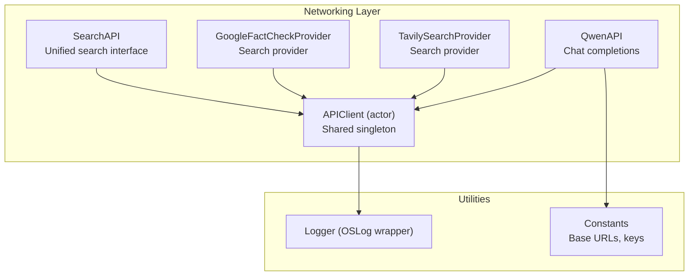
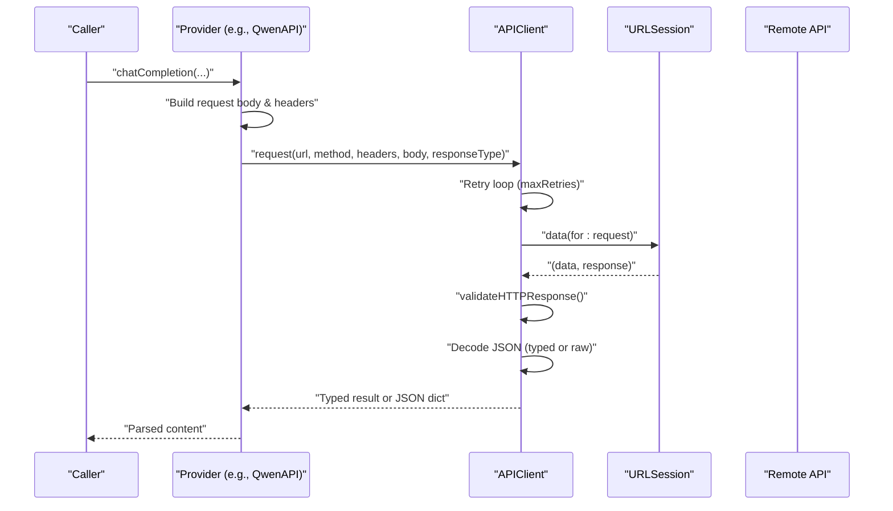
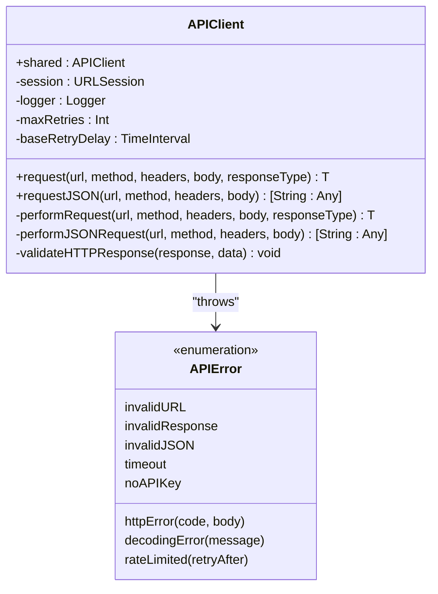
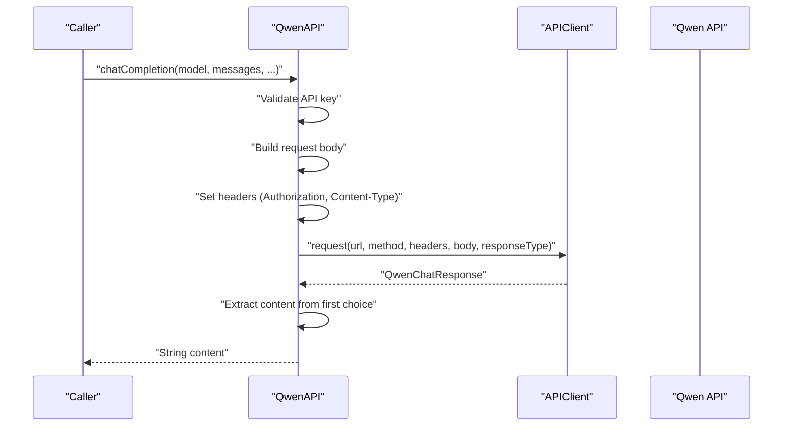
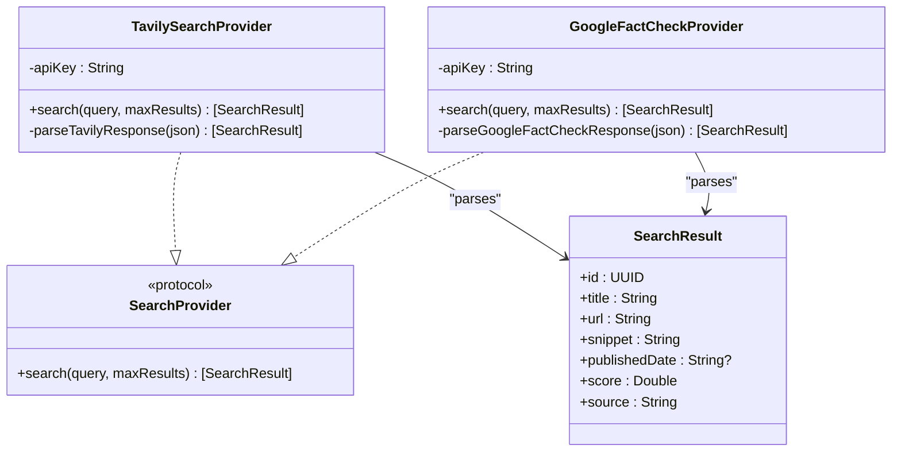
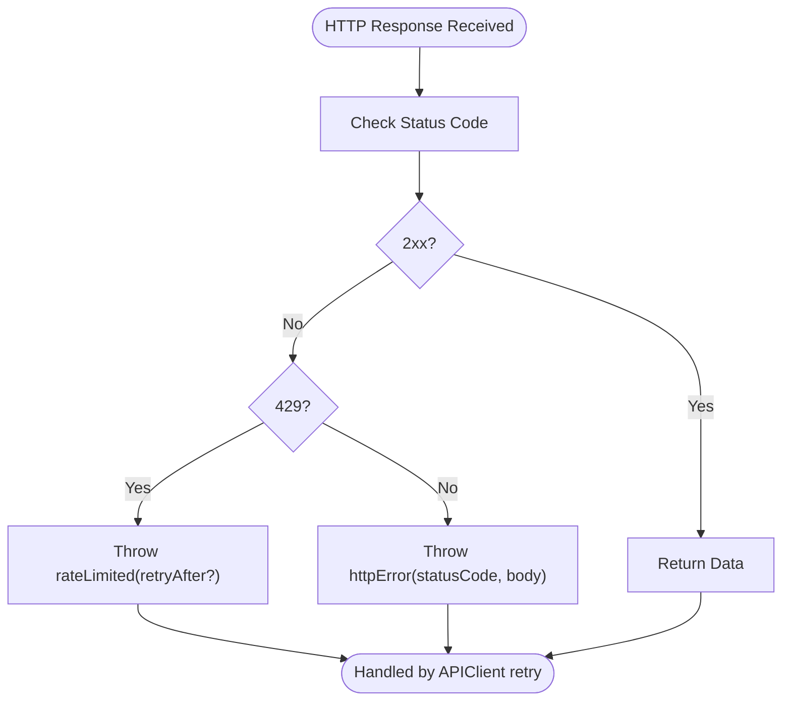
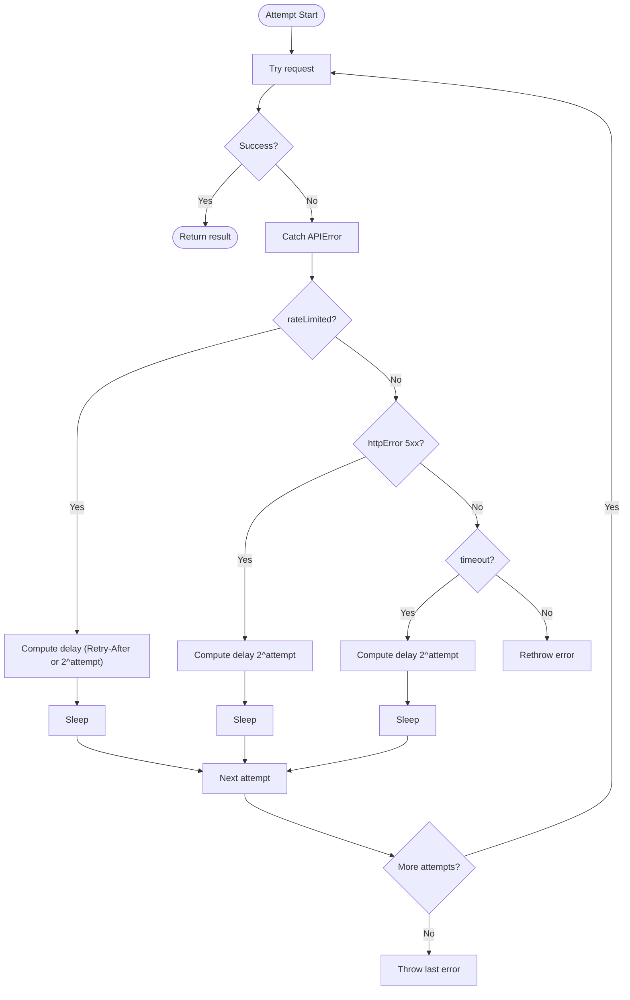
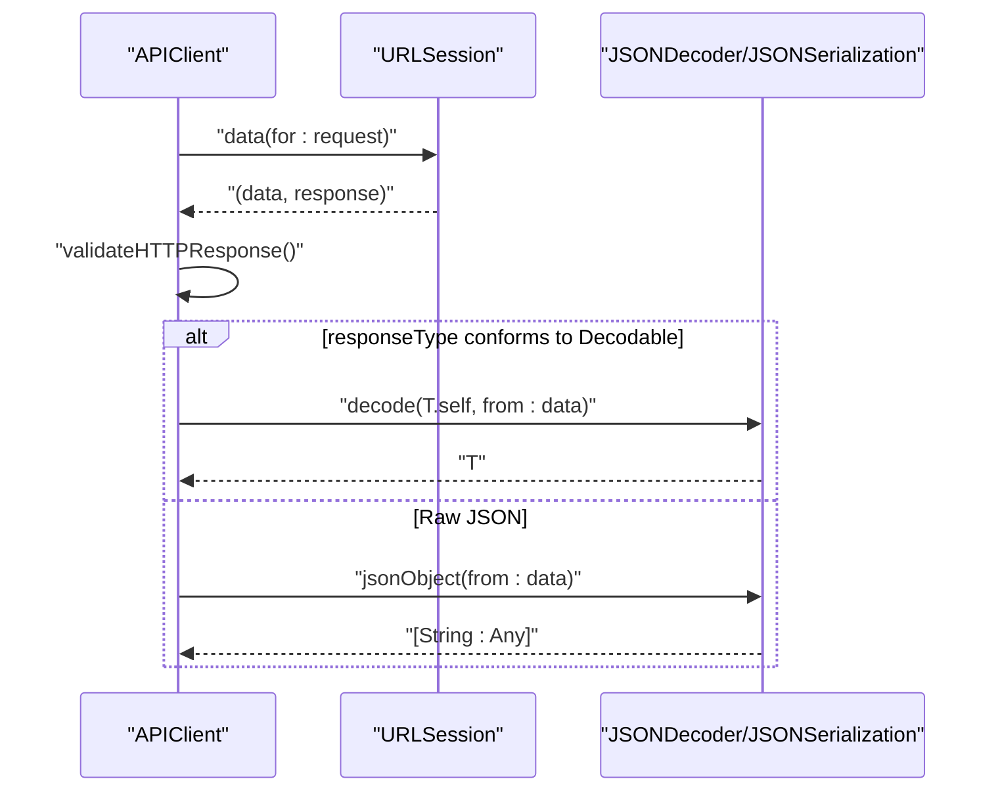
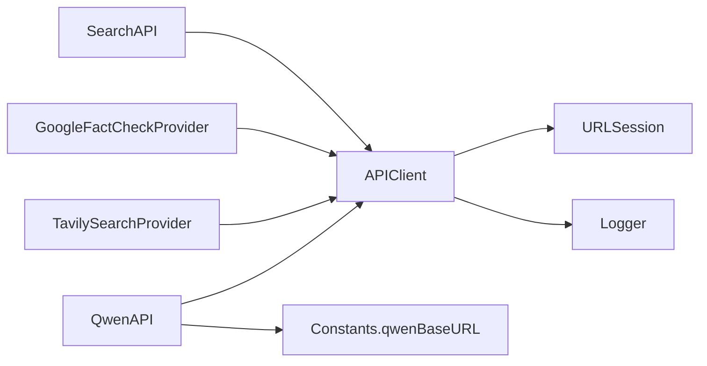

# API Client Base Class

<cite>
**Referenced Files in This Document**
- [APIClient.swift](file://FactShield/FactShield/Core/Network/APIClient.swift)
- [QwenAPI.swift](file://FactShield/FactShield/Core/Network/QwenAPI.swift)
- [SearchAPI.swift](file://FactShield/FactShield/Core/Network/SearchAPI.swift)
- [Constants.swift](file://FactShield/FactShield/Utilities/Constants.swift)
- [Logger.swift](file://FactShield/FactShield/Utilities/Logger.swift)
- [Enums.swift](file://FactShield/FactShield/Models/Enums.swift)
</cite>

## Update Summary
**Changes Made**
- Enhanced APIClient actor with comprehensive retry logic and exponential backoff
- Added Qwen API integration with chat completion capabilities and response parsing
- Implemented Search API with Tavily and Google Fact Check provider implementations
- Expanded error handling system with detailed APIError variants
- Improved logging integration with structured OSLog categories
- Added comprehensive documentation for all network operations and external service integrations

## Table of Contents
1. [Introduction](#introduction)
2. [Project Structure](#project-structure)
3. [Core Components](#core-components)
4. [Architecture Overview](#architecture-overview)
5. [Detailed Component Analysis](#detailed-component-analysis)
6. [Dependency Analysis](#dependency-analysis)
7. [Performance Considerations](#performance-considerations)
8. [Troubleshooting Guide](#troubleshooting-guide)
9. [Conclusion](#conclusion)
10. [Appendices](#appendices)

## Introduction
This document provides comprehensive documentation for the APIClient base class that powers all API communications in the FactShield iOS application. The system has been enhanced with comprehensive network operations, Qwen API integration, and Search API implementation for external service integration. It explains the generic request methods, JSON request handling, response validation mechanisms, error handling system, retry logic with exponential backoff, timeout configurations, URLSession configuration, logging integration, and performance monitoring capabilities. It also includes practical examples for extending the base client for new API integrations, managing custom headers and authentication tokens, and outlines best practices for thread safety, memory management, debugging, and troubleshooting.

## Project Structure
The networking layer is organized around a central APIClient actor that encapsulates HTTP communication, error handling, and retry logic. Specific providers (e.g., QwenAPI, TavilySearchProvider, GoogleFactCheckProvider) build on top of APIClient to implement provider-specific request bodies, headers, and response parsing. The system now includes comprehensive support for external services like Qwen AI, Tavily search, and Google Fact Check Tools.

**Diagram sources**
- [APIClient.swift:32-47](file://FactShield/FactShield/Core/Network/APIClient.swift#L32-L47)
- [QwenAPI.swift:68-73](file://FactShield/FactShield/Core/Network/QwenAPI.swift#L68-L73)
- [SearchAPI.swift:36-43](file://FactShield/FactShield/Core/Network/SearchAPI.swift#L36-L43)
- [Logger.swift:4-17](file://FactShield/FactShield/Utilities/Logger.swift#L4-L17)
- [Constants.swift:11-12](file://FactShield/FactShield/Utilities/Constants.swift#L11-L12)

**Section sources**
- [APIClient.swift:32-47](file://FactShield/FactShield/Core/Network/APIClient.swift#L32-L47)
- [QwenAPI.swift:68-73](file://FactShield/FactShield/Core/Network/QwenAPI.swift#L68-L73)
- [SearchAPI.swift:36-43](file://FactShield/FactShield/Core/Network/SearchAPI.swift#L36-L43)
- [Logger.swift:4-17](file://FactShield/FactShield/Utilities/Logger.swift#L4-L17)
- [Constants.swift:11-12](file://FactShield/FactShield/Utilities/Constants.swift#L11-L12)

## Core Components
- **APIClient actor**: Centralized HTTP client with shared singleton, URLSession configuration, retry logic, and response validation.
- **APIError enum**: Unified error representation covering invalid URL/response, HTTP errors, JSON/decoding failures, timeouts, missing API keys, and rate limiting.
- **Provider clients**: QwenAPI and SearchAPI demonstrate how to extend APIClient for specific APIs, including authentication token handling and response parsing.
- **SearchProvider protocol**: Defines a pluggable interface for different search providers with unified SearchResult model.

Key responsibilities:
- Generic request method with typed decoding and raw JSON request method.
- Automatic retry with exponential backoff for rate limits, server errors, and timeouts.
- HTTP response validation and structured error propagation.
- Logging integration via OSLog categories.
- Timeout configuration for requests and resources.
- Support for multiple external API integrations.

**Section sources**
- [APIClient.swift:6-28](file://FactShield/FactShield/Core/Network/APIClient.swift#L6-L28)
- [APIClient.swift:32-47](file://FactShield/FactShield/Core/Network/APIClient.swift#L32-L47)
- [APIClient.swift:51-103](file://FactShield/FactShield/Core/Network/APIClient.swift#L51-L103)
- [APIClient.swift:107-157](file://FactShield/FactShield/Core/Network/APIClient.swift#L107-L157)
- [APIClient.swift:221-232](file://FactShield/FactShield/Core/Network/APIClient.swift#L221-L232)

## Architecture Overview
The APIClient actor encapsulates URLSession configuration and exposes two public asynchronous methods:
- **request<T: Decodable>**: Performs a typed JSON decode and returns a strongly-typed model.
- **requestJSON**: Performs a raw JSON serialization and returns a dictionary.

Both methods implement retry logic with exponential backoff and validate HTTP responses. Providers such as QwenAPI and SearchAPI construct request bodies, set headers (including Authorization), and call APIClient methods. The system now supports multiple external services with unified error handling and logging.

**Diagram sources**
- [QwenAPI.swift:94-151](file://FactShield/FactShield/Core/Network/QwenAPI.swift#L94-L151)
- [APIClient.swift:51-103](file://FactShield/FactShield/Core/Network/APIClient.swift#L51-L103)
- [APIClient.swift:161-190](file://FactShield/FactShield/Core/Network/APIClient.swift#L161-L190)

## Detailed Component Analysis

### APIClient Actor
The APIClient actor is the foundation of the networking layer, providing centralized HTTP communication with robust error handling and retry logic.

- **Singleton pattern** via shared property.
- **URLSession configured with**:
  - Request timeout interval: 30 seconds.
  - Resource timeout interval: 60 seconds.
  - Waits for connectivity before sending requests.
- **Retry policy**:
  - Max retries: 3.
  - Base retry delay: 1 second.
  - Exponential backoff: 2^attempt seconds.
  - Special handling for rate-limited responses (Retry-After header) and server errors (5xx).
- **Public methods**:
  - **request<T: Decodable>**: Typed decoding with JSONDecoder.
  - **requestJSON**: Raw JSON parsing with JSONSerialization.
- **Response validation**:
  - Accepts 2xx.
  - Emits rateLimited with optional Retry-After.
  - Emits httpError with status code and body.

**Diagram sources**
- [APIClient.swift:32-47](file://FactShield/FactShield/Core/Network/APIClient.swift#L32-L47)
- [APIClient.swift:6-28](file://FactShield/FactShield/Core/Network/APIClient.swift#L6-L28)
- [APIClient.swift:51-103](file://FactShield/FactShield/Core/Network/APIClient.swift#L51-L103)
- [APIClient.swift:107-157](file://FactShield/FactShield/Core/Network/APIClient.swift#L107-L157)
- [APIClient.swift:161-232](file://FactShield/FactShield/Core/Network/APIClient.swift#L161-L232)

**Section sources**
- [APIClient.swift:32-47](file://FactShield/FactShield/Core/Network/APIClient.swift#L32-L47)
- [APIClient.swift:51-103](file://FactShield/FactShield/Core/Network/APIClient.swift#L51-L103)
- [APIClient.swift:107-157](file://FactShield/FactShield/Core/Network/APIClient.swift#L107-L157)
- [APIClient.swift:161-232](file://FactShield/FactShield/Core/Network/APIClient.swift#L161-L232)

### QwenAPI Integration
The QwenAPI provides comprehensive integration with Alibaba Cloud's Qwen AI service, enabling chat completions and content generation capabilities.

- **Loads API key** from environment or UserDefaults (recommended: secure storage in production).
- **Builds request body** from arrays of message dictionaries with support for temperature, maxTokens, and responseFormat.
- **Sets Authorization header** with Bearer token and Content-Type.
- **Uses APIClient.request** for typed decoding into QwenChatResponse.
- **Provides convenience method** returning raw JSON via APIClient.requestJSON.
- **Includes usage tracking** with detailed logging of prompt, completion, and total tokens.

**Diagram sources**
- [QwenAPI.swift:94-151](file://FactShield/FactShield/Core/Network/QwenAPI.swift#L94-L151)
- [APIClient.swift:51-103](file://FactShield/FactShield/Core/Network/APIClient.swift#L51-L103)

**Section sources**
- [QwenAPI.swift:68-82](file://FactShield/FactShield/Core/Network/QwenAPI.swift#L68-L82)
- [QwenAPI.swift:94-151](file://FactShield/FactShield/Core/Network/QwenAPI.swift#L94-L151)
- [QwenAPI.swift:155-197](file://FactShield/FactShield/Core/Network/QwenAPI.swift#L155-L197)
- [Constants.swift:11-12](file://FactShield/FactShield/Utilities/Constants.swift#L11-L12)

### SearchAPI Integrations
The SearchAPI provides a unified interface for multiple external search providers, currently supporting Tavily and Google Fact Check Tools.

#### SearchProvider Protocol
Defines a standardized interface for search providers with consistent error handling and response parsing.

#### TavilySearchProvider
Implements advanced web search capabilities with comprehensive result parsing.

- **Retrieves API key** from environment or UserDefaults.
- **Constructs request body** with query, search depth, and result limits.
- **Calls APIClient.requestJSON** to parse Tavily's JSON response.
- **Parses results** into unified SearchResult model with title, URL, snippet, and metadata.

#### GoogleFactCheckProvider
Integrates with Google's Fact Check Tools API for authoritative fact-checking results.

- **Encodes query parameters** safely for URL construction.
- **Uses GET requests** with API key in query string.
- **Parses complex claim review structures** into readable SearchResult format.
- **Provides high-confidence ratings** with source attribution.

**Diagram sources**
- [SearchAPI.swift:8-32](file://FactShield/FactShield/Core/Network/SearchAPI.swift#L8-L32)
- [SearchAPI.swift:36-104](file://FactShield/FactShield/Core/Network/SearchAPI.swift#L36-L104)
- [SearchAPI.swift:108-164](file://FactShield/FactShield/Core/Network/SearchAPI.swift#L108-L164)

**Section sources**
- [SearchAPI.swift:8-32](file://FactShield/FactShield/Core/Network/SearchAPI.swift#L8-L32)
- [SearchAPI.swift:36-104](file://FactShield/FactShield/Core/Network/SearchAPI.swift#L36-L104)
- [SearchAPI.swift:108-164](file://FactShield/FactShield/Core/Network/SearchAPI.swift#L108-L164)

### Error Handling System
The enhanced error handling system provides comprehensive coverage for all network operation scenarios.

- **APIError variants**:
  - **invalidURL**, **invalidResponse**, **httpError(statusCode, body)**, **invalidJSON**, **decodingError(message)**, **timeout**, **noAPIKey**, **rateLimited(retryAfter)**.
- **Propagation**:
  - APIClient validates HTTP responses and throws APIError.
  - Providers may throw APIError directly (e.g., missing API key).
- **Logging**:
  - Centralized Logger with subsystem com.factshield.api and categories for APIClient, QwenAPI, TavilySearch, GoogleFactCheck.

**Diagram sources**
- [APIClient.swift:221-232](file://FactShield/FactShield/Core/Network/APIClient.swift#L221-L232)

**Section sources**
- [APIClient.swift:6-28](file://FactShield/FactShield/Core/Network/APIClient.swift#L6-L28)
- [APIClient.swift:221-232](file://FactShield/FactShield/Core/Network/APIClient.swift#L221-L232)
- [Logger.swift:4-17](file://FactShield/FactShield/Utilities/Logger.swift#L4-L17)

### Retry Logic with Exponential Backoff
The retry mechanism provides robust resilience against transient network failures and rate limiting.

- **Attempts**: up to maxRetries (3).
- **Delays**: baseRetryDelay (1 second) multiplied by 2^attempt.
- **Conditions**:
  - **Rate limited**: uses Retry-After header if present; otherwise exponential backoff.
  - **Server errors (5xx)**: exponential backoff.
  - **Timeouts**: exponential backoff.
  - **Other errors**: rethrow immediately.
- **Logging**: Comprehensive warnings with attempt counts and delay information.

**Diagram sources**
- [APIClient.swift:60-103](file://FactShield/FactShield/Core/Network/APIClient.swift#L60-L103)
- [APIClient.swift:115-157](file://FactShield/FactShield/Core/Network/APIClient.swift#L115-L157)

**Section sources**
- [APIClient.swift:38-39](file://FactShield/FactShield/Core/Network/APIClient.swift#L38-L39)
- [APIClient.swift:74-91](file://FactShield/FactShield/Core/Network/APIClient.swift#L74-L91)
- [APIClient.swift:128-145](file://FactShield/FactShield/Core/Network/APIClient.swift#L128-L145)

### JSON Request Handling and Response Validation
The system provides flexible JSON handling for both typed decoding and raw JSON responses.

- **Typed decoding**: APIClient.request uses JSONDecoder to decode into responseType.
- **Raw JSON**: APIClient.requestJSON uses JSONSerialization to produce [String: Any].
- **Validation**: APIClient.validateHTTPResponse checks status codes and extracts Retry-After for rate limiting.
- **Error handling**: Comprehensive error detection for malformed JSON and decoding failures.

**Diagram sources**
- [APIClient.swift:161-232](file://FactShield/FactShield/Core/Network/APIClient.swift#L161-L232)

**Section sources**
- [APIClient.swift:161-190](file://FactShield/FactShield/Core/Network/APIClient.swift#L161-L190)
- [APIClient.swift:192-219](file://FactShield/FactShield/Core/Network/APIClient.swift#L192-L219)
- [APIClient.swift:221-232](file://FactShield/FactShield/Core/Network/APIClient.swift#L221-L232)

### Authentication Token Handling
The system provides secure and flexible authentication token management across all providers.

- **QwenAPI** loads API key from environment variable or UserDefaults (recommended: secure storage).
- **Headers include** Authorization: Bearer <token> and Content-Type: application/json.
- **Providers validate** presence of API key and throw APIError.noAPIKey when missing.
- **Search providers** handle missing keys gracefully by returning empty results and logging warnings.

Best practices:
- Store tokens securely (e.g., Keychain) in production environments.
- Prefer environment variables for local development.
- Avoid hardcoding tokens in source code.
- Implement proper fallback mechanisms for missing credentials.

**Section sources**
- [QwenAPI.swift:75-82](file://FactShield/FactShield/Core/Network/QwenAPI.swift#L75-L82)
- [QwenAPI.swift:126-129](file://FactShield/FactShield/Core/Network/QwenAPI.swift#L126-L129)
- [QwenAPI.swift:101-103](file://FactShield/FactShield/Core/Network/QwenAPI.swift#L101-L103)

### Extending APIClient for New API Integrations
The system provides a clear pattern for integrating new external APIs while maintaining consistency and reliability.

Steps to integrate a new API:
1. **Define a provider class** that holds a reference to APIClient.shared.
2. **Load credentials** from secure storage or environment variables.
3. **Build request body** and headers according to the API specification.
4. **Call APIClient.request** for typed responses or APIClient.requestJSON for raw JSON.
5. **Parse provider-specific JSON** into a unified model or return raw dictionary.
6. **Log relevant metadata** (e.g., usage metrics) via Logger.

Example patterns:
- **QwenAPI.chatCompletion** demonstrates typed decoding and usage logging.
- **SearchAPI providers** show raw JSON handling and unified SearchResult parsing.
- **SearchProvider protocol** enables pluggable architecture for multiple search engines.

**Section sources**
- [QwenAPI.swift:68-73](file://FactShield/FactShield/Core/Network/QwenAPI.swift#L68-L73)
- [SearchAPI.swift:36-43](file://FactShield/FactShield/Core/Network/SearchAPI.swift#L36-L43)
- [SearchAPI.swift:69-76](file://FactShield/FactShield/Core/Network/SearchAPI.swift#L69-L76)
- [SearchAPI.swift:130-136](file://FactShield/FactShield/Core/Network/SearchAPI.swift#L130-L136)

## Dependency Analysis
The networking system has well-defined dependencies that support scalability and maintainability.

- **APIClient depends on**:
  - URLSessionConfiguration for timeouts and connectivity behavior.
  - OSLog via Logger for structured logging.
- **Providers depend on**:
  - APIClient.shared for HTTP operations.
  - Constants for base URLs.
  - Environment/UserDefaults for credentials.
  - SearchProvider protocol for pluggable architecture.

**Diagram sources**
- [APIClient.swift:35-46](file://FactShield/FactShield/Core/Network/APIClient.swift#L35-L46)
- [QwenAPI.swift:71-73](file://FactShield/FactShield/Core/Network/QwenAPI.swift#L71-L73)
- [Constants.swift:11-12](file://FactShield/FactShield/Utilities/Constants.swift#L11-L12)

**Section sources**
- [APIClient.swift:35-46](file://FactShield/FactShield/Core/Network/APIClient.swift#L35-L46)
- [QwenAPI.swift:71-73](file://FactShield/FactShield/Core/Network/QwenAPI.swift#L71-L73)
- [Constants.swift:11-12](file://FactShield/FactShield/Utilities/Constants.swift#L11-L12)

## Performance Considerations
The system is designed with performance and reliability as top priorities.

- **Timeouts**:
  - Request timeout: 30 seconds; resource timeout: 60 seconds.
  - Waits for connectivity before sending requests.
- **Retry strategy**:
  - Limits retries to 3 with exponential backoff to reduce load on failing endpoints.
  - Intelligent backoff based on error type and Retry-After headers.
- **Logging overhead**:
  - Structured logs categorized under com.factshield.api improve observability without heavy instrumentation.
  - Minimal logging in success paths, comprehensive warnings for failures.
- **Memory management**:
  - URLSession manages connection pooling and caching automatically.
  - Efficient request body construction and JSON parsing.
  - Proper error cleanup and resource management.

## Troubleshooting Guide
Comprehensive troubleshooting guide for common issues across all integrated services.

### Common Issues and Resolutions

- **Invalid URL**:
  - **Symptom**: APIError.invalidURL thrown during request construction.
  - **Resolution**: Verify base URLs and endpoint paths in Constants.
  
- **Invalid response**:
  - **Symptom**: APIError.invalidResponse when response is not HTTPURLResponse.
  - **Resolution**: Check network connectivity and endpoint availability.
  
- **HTTP error**:
  - **Symptom**: APIError.httpError with status code and body.
  - **Resolution**: Inspect server logs and adjust request parameters.
  
- **Invalid JSON**:
  - **Symptom**: APIError.invalidJSON when raw JSON parsing fails.
  - **Resolution**: Validate provider response format and handle optional fields.
  
- **Decoding error**:
  - **Symptom**: APIError.decodingError when typed decoding fails.
  - **Resolution**: Align model definitions with server schema.
  
- **Timeout**:
  - **Symptom**: APIError.timeout during request.
  - **Resolution**: Increase timeouts cautiously; investigate server latency.
  
- **No API key**:
  - **Symptom**: APIError.noAPIKey when credentials are missing.
  - **Resolution**: Set environment variables or secure storage entries.
  
- **Rate limited**:
  - **Symptom**: APIError.rateLimited with optional Retry-After.
  - **Resolution**: Respect Retry-After; otherwise apply exponential backoff.

### Service-Specific Debugging

- **Qwen API Issues**:
  - Verify API key configuration in environment variables.
  - Check model availability and token limits.
  - Monitor usage logs for token consumption patterns.
  
- **Search API Issues**:
  - Tavily: Ensure API key is configured and search depth is appropriate.
  - Google Fact Check: Verify API key permissions and query encoding.
  - Both: Check network connectivity and rate limit compliance.

### Debugging Techniques

- **Enable verbose logging** via OSLog for categories: APIClient, QwenAPI, TavilySearch, GoogleFactCheck.
- **Inspect request headers and body** before invoking APIClient methods.
- **Use network tracing tools** to capture request/response payloads.
- **Monitor retry behavior** to identify persistent failure patterns.
- **Check error logs** for specific error codes and retry counts.

**Section sources**
- [APIClient.swift:6-28](file://FactShield/FactShield/Core/Network/APIClient.swift#L6-L28)
- [APIClient.swift:221-232](file://FactShield/FactShield/Core/Network/APIClient.swift#L221-L232)
- [Logger.swift:4-17](file://FactShield/FactShield/Utilities/Logger.swift#L4-L17)

## Conclusion
The enhanced APIClient actor provides a robust foundation for API communications with built-in retry logic, structured error handling, and comprehensive logging. The addition of Qwen API integration and Search API implementations demonstrates the system's extensibility and reliability. By leveraging APIClient.shared, providers can implement consistent patterns for request construction, authentication, and response parsing while maintaining thread safety and performance. The unified error handling and logging systems ensure reliable and maintainable API integrations across the FactShield application, supporting both internal services and external third-party APIs.

## Appendices

### Best Practices for API Client Usage
- **Use APIClient.shared** for all HTTP operations to benefit from centralized configuration and retry logic.
- **Implement provider-specific wrappers** (as seen in QwenAPI and SearchAPI) to encapsulate request building and response parsing.
- **Manage credentials securely**; avoid storing tokens in UserDefaults in production.
- **Respect rate limits and timeouts**; leverage exponential backoff for resilience.
- **Log meaningful metadata** (e.g., usage metrics) to aid debugging and monitoring.
- **Handle missing API keys gracefully** by implementing fallback mechanisms.
- **Monitor retry behavior** to identify and address persistent issues.

### Thread Safety and Memory Management
- **APIClient is an actor**, ensuring thread-safe access to shared state.
- **URLSession handles connection pooling and memory efficiently**; avoid creating multiple sessions unnecessarily.
- **Prefer lightweight request bodies** and avoid retaining large closures in request handlers.
- **Implement proper error cleanup** to prevent memory leaks in retry scenarios.

**Section sources**
- [APIClient.swift:32-47](file://FactShield/FactShield/Core/Network/APIClient.swift#L32-L47)

### Error Code References
- **HTTP 429**: Rate limited; APIClient throws APIError.rateLimited with optional Retry-After.
- **HTTP 5xx**: Server error; APIClient retries with exponential backoff.
- **HTTP 4xx/Other**: APIClient throws APIError.httpError with status and body.
- **Decoding failures**: APIError.decodingError with localized description.
- **JSON parsing failures**: APIError.invalidJSON.
- **Timeouts**: APIError.timeout.
- **Invalid URLs/responses**: APIError.invalidURL/invalidResponse.
- **Missing API key**: APIError.noAPIKey.

**Section sources**
- [APIClient.swift:6-28](file://FactShield/FactShield/Core/Network/APIClient.swift#L6-L28)
- [APIClient.swift:221-232](file://FactShield/FactShield/Core/Network/APIClient.swift#L221-L232)

### External Service Integration Guide
- **Qwen API**: Supports chat completions with configurable parameters and usage tracking.
- **Tavily Search**: Provides advanced web search with comprehensive result parsing.
- **Google Fact Check**: Offers authoritative fact-checking with structured claim reviews.
- **Extensibility**: New providers can be added using the SearchProvider protocol pattern.

**Section sources**
- [QwenAPI.swift:68-73](file://FactShield/FactShield/Core/Network/QwenAPI.swift#L68-L73)
- [SearchAPI.swift:36-43](file://FactShield/FactShield/Core/Network/SearchAPI.swift#L36-L43)
- [SearchAPI.swift:108-164](file://FactShield/FactShield/Core/Network/SearchAPI.swift#L108-L164)