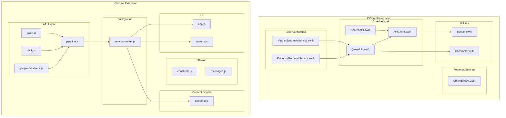
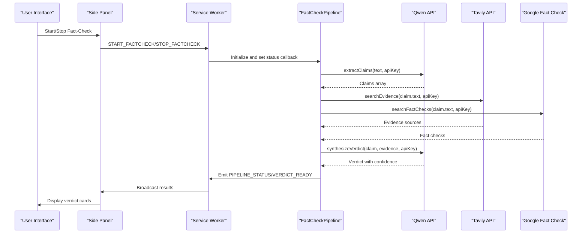
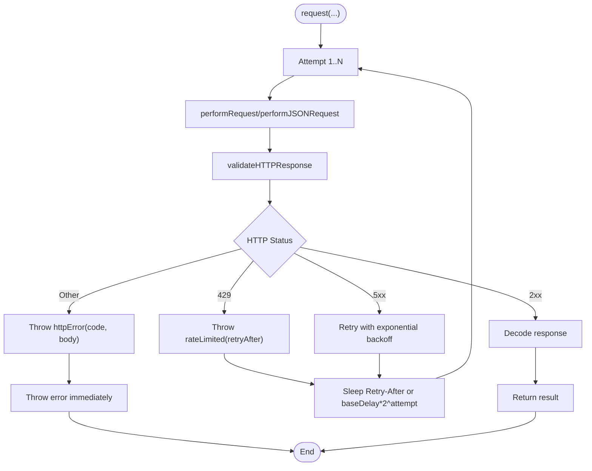
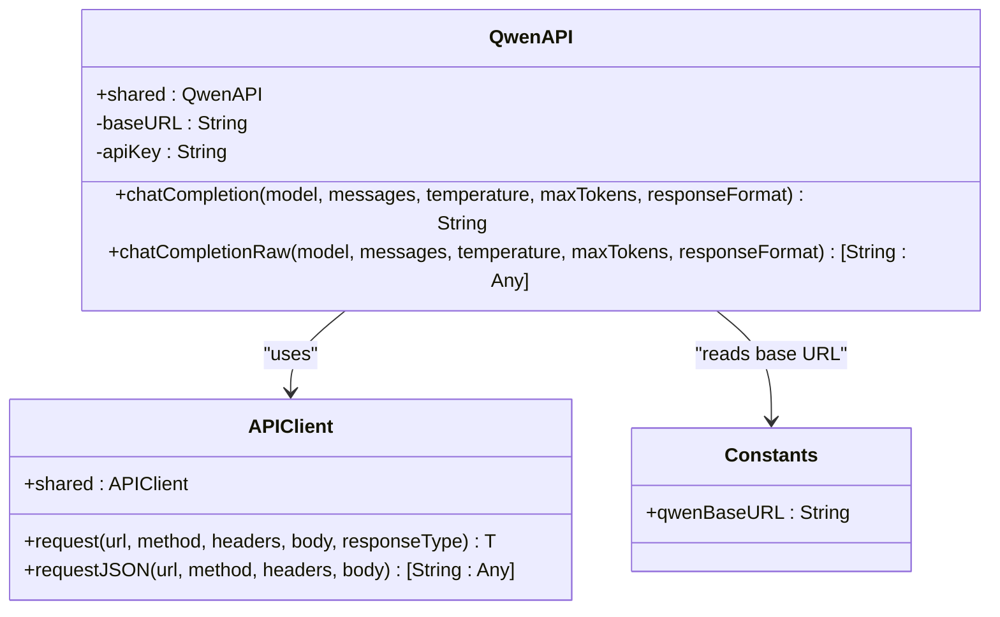
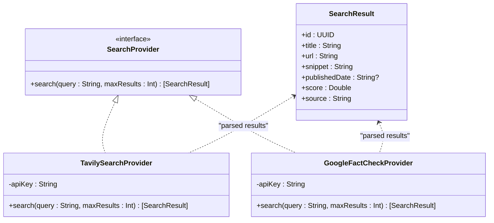
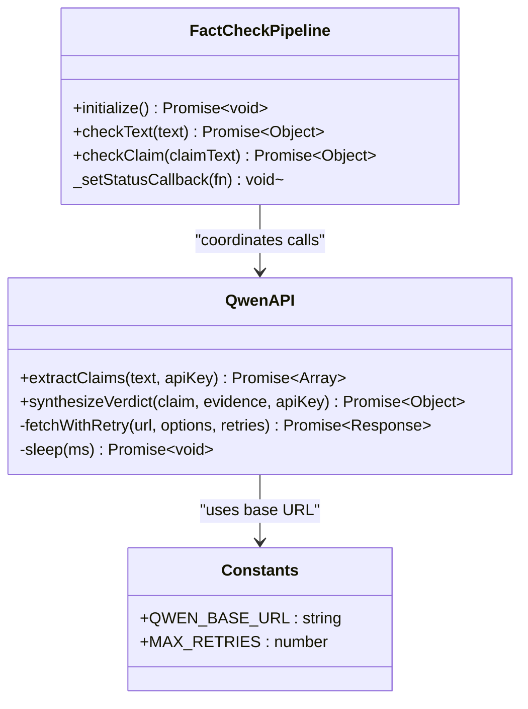
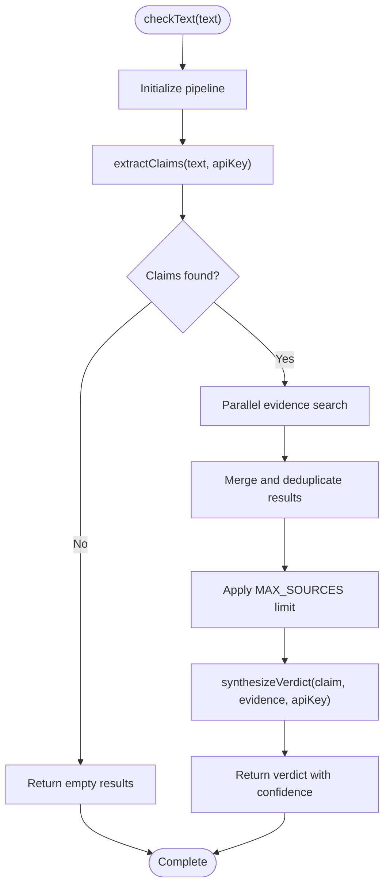
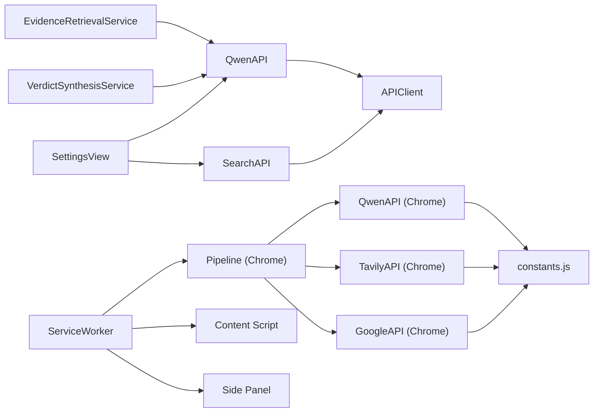

# API Reference

<cite>
**Referenced Files in This Document**
- [APIClient.swift](file://FactShield/FactShield/Core/Network/APIClient.swift)
- [QwenAPI.swift](file://FactShield/FactShield/Core/Network/QwenAPI.swift)
- [SearchAPI.swift](file://FactShield/FactShield/Core/Network/SearchAPI.swift)
- [Constants.swift](file://FactShield/FactShield/Utilities/Constants.swift)
- [Logger.swift](file://FactShield/FactShield/Utilities/Logger.swift)
- [SettingsView.swift](file://FactShield/FactShield/Features/Settings/SettingsView.swift)
- [EvidenceRetrievalService.swift](file://FactShield/FactShield/Core/Verification/EvidenceRetrievalService.swift)
- [VerdictSynthesisService.swift](file://FactShield/FactShield/Core/Verification/VerdictSynthesisService.swift)
- [qwen.js](file://FactShield-ChromeExtension/src/api/qwen.js)
- [tavily.js](file://FactShield-ChromeExtension/src/api/tavily.js)
- [google-factcheck.js](file://FactShield-ChromeExtension/src/api/google-factcheck.js)
- [pipeline.js](file://FactShield-ChromeExtension/src/api/pipeline.js)
- [constants.js](file://FactShield-ChromeExtension/src/shared/constants.js)
- [service-worker.js](file://FactShield-ChromeExtension/src/background/service-worker.js)
- [messages.js](file://FactShield-ChromeExtension/src/shared/messages.js)
- [extractor.js](file://FactShield-ChromeExtension/src/content/extractor.js)
- [app.js](file://FactShield-ChromeExtension/src/sidepanel/app.js)
- [options.js](file://FactShield-ChromeExtension/src/options/options.js)
</cite>

## Update Summary
**Changes Made**
- Added comprehensive documentation for Chrome extension API integrations
- Documented Qwen API integration for claim extraction and verdict synthesis
- Added Tavily search integration for evidence gathering
- Documented Google Fact Check Tools integration for cross-referencing
- Included pipeline orchestration APIs for coordinating the fact-checking workflow
- Added Chrome extension architecture overview and component interactions
- Updated authentication configuration and API key management for browser extension
- Documented message passing system between extension components
- Added side panel UI integration and real-time monitoring capabilities

## Table of Contents
1. [Introduction](#introduction)
2. [Project Structure](#project-structure)
3. [Core Components](#core-components)
4. [Architecture Overview](#architecture-overview)
5. [Detailed Component Analysis](#detailed-component-analysis)
6. [Chrome Extension API Integrations](#chrome-extension-api-integrations)
7. [Dependency Analysis](#dependency-analysis)
8. [Performance Considerations](#performance-considerations)
9. [Troubleshooting Guide](#troubleshooting-guide)
10. [Conclusion](#conclusion)
11. [Appendices](#appendices)

## Introduction
This document provides a comprehensive API reference for external integrations in FactChecking Live. It covers:
- Qwen API integration for language model processing, including authentication, request/response schemas, and endpoints
- SearchAPI integration for web search functionality and result processing
- APIClient base class and common patterns for API communication, error handling, and rate limiting
- Chrome extension API integrations including Qwen API, Tavily search, Google Fact Check Tools, and pipeline orchestration
- Authentication configuration, API key management, and security best practices
- Concrete examples of API requests and responses, parameter specifications, and error codes
- Retry mechanisms, timeout configurations, and performance optimization techniques
- API versioning, backward compatibility, and migration strategies
- Debugging tools and monitoring approaches for API interactions

## Project Structure
The API-related components are organized across two main areas: iOS Swift implementation and Chrome extension implementation. The Chrome extension provides a complete browser-based fact-checking solution with real-time monitoring capabilities.

**Diagram sources**
- [APIClient.swift:32-234](file://FactShield/FactShield/Core/Network/APIClient.swift#L32-L234)
- [QwenAPI.swift:68-199](file://FactShield/FactShield/Core/Network/QwenAPI.swift#L68-L199)
- [SearchAPI.swift:1-165](file://FactShield/FactShield/Core/Network/SearchAPI.swift#L1-L165)
- [constants.js:1-38](file://FactShield-ChromeExtension/src/shared/constants.js#L1-L38)
- [qwen.js:1-179](file://FactShield-ChromeExtension/src/api/qwen.js#L1-L179)
- [tavily.js:1-53](file://FactShield-ChromeExtension/src/api/tavily.js#L1-L53)
- [google-factcheck.js:1-50](file://FactShield-ChromeExtension/src/api/google-factcheck.js#L1-L50)
- [pipeline.js:1-205](file://FactShield-ChromeExtension/src/api/pipeline.js#L1-L205)
- [service-worker.js:1-250](file://FactShield-ChromeExtension/src/background/service-worker.js#L1-L250)
- [extractor.js:1-394](file://FactShield-ChromeExtension/src/content/extractor.js#L1-L394)
- [app.js:1-492](file://FactShield-ChromeExtension/src/sidepanel/app.js#L1-L492)
- [options.js:1-328](file://FactShield-ChromeExtension/src/options/options.js#L1-L328)

**Section sources**
- [APIClient.swift:32-234](file://FactShield/FactShield/Core/Network/APIClient.swift#L32-L234)
- [QwenAPI.swift:68-199](file://FactShield/FactShield/Core/Network/QwenAPI.swift#L68-L199)
- [SearchAPI.swift:1-165](file://FactShield/FactShield/Core/Network/SearchAPI.swift#L1-L165)
- [constants.js:1-38](file://FactShield-ChromeExtension/src/shared/constants.js#L1-L38)
- [qwen.js:1-179](file://FactShield-ChromeExtension/src/api/qwen.js#L1-L179)
- [tavily.js:1-53](file://FactShield-ChromeExtension/src/api/tavily.js#L1-L53)
- [google-factcheck.js:1-50](file://FactShield-ChromeExtension/src/api/google-factcheck.js#L1-L50)
- [pipeline.js:1-205](file://FactShield-ChromeExtension/src/api/pipeline.js#L1-L205)
- [service-worker.js:1-250](file://FactShield-ChromeExtension/src/background/service-worker.js#L1-L250)
- [extractor.js:1-394](file://FactShield-ChromeExtension/src/content/extractor.js#L1-L394)
- [app.js:1-492](file://FactShield-ChromeExtension/src/sidepanel/app.js#L1-L492)
- [options.js:1-328](file://FactShield-ChromeExtension/src/options/options.js#L1-L328)

## Core Components
- APIClient: Shared actor-based HTTP client with exponential backoff, timeouts, and robust error handling.
- QwenAPI: High-level client for DashScope-compatible Qwen chat completions with bearer token authentication.
- SearchAPI: Protocol-driven search providers (Tavily and Google Fact Check Tools) with stubbed implementations and JSON parsing helpers.
- **Chrome Extension Qwen API**: Direct JavaScript implementation for claim extraction and verdict synthesis with retry logic.
- **Chrome Extension Tavily API**: Web search integration with configurable result limits and content filtering.
- **Chrome Extension Google API**: Fact-check database cross-reference with structured result parsing.
- **Chrome Extension Pipeline**: Orchestrator that coordinates all API integrations and manages the complete fact-checking workflow.
- **Chrome Extension Service Worker**: Background controller that manages extension lifecycle, message routing, and state coordination.
- **Chrome Extension Content Script**: Real-time text extraction from web pages with platform-specific optimizations.
- **Chrome Extension Side Panel**: Interactive UI for displaying fact-check results and managing the verification process.
- **Chrome Extension Options**: Configuration interface for API keys and extension preferences.
- Constants: Centralized constants including Qwen base URL.
- Logger: Unified logging via OSLog subsystems.
- SettingsView: UI for managing API keys via UserDefaults-backed bindings.
- EvidenceRetrievalService and VerdictSynthesisService: Orchestration services that call Qwen for evidence retrieval and verdict synthesis.

**Section sources**
- [APIClient.swift:32-234](file://FactShield/FactShield/Core/Network/APIClient.swift#L32-L234)
- [QwenAPI.swift:68-199](file://FactShield/FactShield/Core/Network/QwenAPI.swift#L68-L199)
- [SearchAPI.swift:1-165](file://FactShield/FactShield/Core/Network/SearchAPI.swift#L1-L165)
- [qwen.js:1-179](file://FactShield-ChromeExtension/src/api/qwen.js#L1-L179)
- [tavily.js:1-53](file://FactShield-ChromeExtension/src/api/tavily.js#L1-L53)
- [google-factcheck.js:1-50](file://FactShield-ChromeExtension/src/api/google-factcheck.js#L1-L50)
- [pipeline.js:1-205](file://FactShield-ChromeExtension/src/api/pipeline.js#L1-L205)
- [service-worker.js:1-250](file://FactShield-ChromeExtension/src/background/service-worker.js#L1-L250)
- [extractor.js:1-394](file://FactShield-ChromeExtension/src/content/extractor.js#L1-L394)
- [app.js:1-492](file://FactShield-ChromeExtension/src/sidepanel/app.js#L1-L492)
- [options.js:1-328](file://FactShield-ChromeExtension/src/options/options.js#L1-L328)
- [Constants.swift:11-12](file://FactShield/FactShield/Utilities/Constants.swift#L11-L12)
- [Logger.swift:1-18](file://FactShield/FactShield/Utilities/Logger.swift#L1-L18)
- [SettingsView.swift:4-6](file://FactShield/FactShield/Features/Settings/SettingsView.swift#L4-L6)
- [EvidenceRetrievalService.swift:1-193](file://FactShield/FactShield/Core/Verification/EvidenceRetrievalService.swift#L1-L193)
- [VerdictSynthesisService.swift:1-184](file://FactShield/FactShield/Core/Verification/VerdictSynthesisService.swift#L1-L184)

## Architecture Overview
The system uses a layered approach with two distinct implementations:
- iOS Swift implementation: Traditional mobile app with local API client and service orchestration.
- Chrome Extension implementation: Complete browser-based solution with real-time monitoring, message passing, and interactive UI.

**Diagram sources**
- [service-worker.js:62-127](file://FactShield-ChromeExtension/src/background/service-worker.js#L62-L127)
- [pipeline.js:71-113](file://FactShield-ChromeExtension/src/api/pipeline.js#L71-L113)
- [qwen.js:38-94](file://FactShield-ChromeExtension/src/api/qwen.js#L38-L94)
- [tavily.js:12-52](file://FactShield-ChromeExtension/src/api/tavily.js#L12-L52)
- [google-factcheck.js:12-49](file://FactShield-ChromeExtension/src/api/google-factcheck.js#L12-L49)

## Detailed Component Analysis

### APIClient
- Purpose: Shared actor-based HTTP client with exponential backoff, timeouts, and structured error handling.
- Key capabilities:
  - Generic typed decoding and raw JSON decoding.
  - Retry logic for rate limits, server errors (5xx), and timeouts.
  - Configurable timeouts for requests and resources.
  - Validation of HTTP responses and conversion to domain-specific errors.
- Error types:
  - invalidURL, invalidResponse, httpError(code, body), invalidJSON, decodingError(message), timeout, noAPIKey, rateLimited(retryAfter).
- Retry strategy:
  - Exponential backoff with jitter based on base delay and attempt count.
  - Special handling for 429 with Retry-After header.
  - Retries up to a fixed maximum.
- Logging:
  - Uses OSLog with dedicated categories for API client activities.

**Diagram sources**
- [APIClient.swift:51-103](file://FactShield/FactShield/Core/Network/APIClient.swift#L51-L103)
- [APIClient.swift:161-232](file://FactShield/FactShield/Core/Network/APIClient.swift#L161-L232)

**Section sources**
- [APIClient.swift:32-234](file://FactShield/FactShield/Core/Network/APIClient.swift#L32-L234)

### Qwen API Integration
- Base URL: Defined centrally and used by QwenAPI.
- Authentication:
  - Bearer token via Authorization header.
  - API key loaded from environment variable or UserDefaults (with a note to use Keychain in production).
- Endpoints:
  - POST chat/completions
- Request schema:
  - Model name, messages array, optional temperature, max_tokens, response_format.
  - Messages are arrays of dictionaries with role/content.
- Response schema:
  - Choices array with first choice's message content.
  - Usage metrics (prompt_tokens, completion_tokens, total_tokens).
- Methods:
  - chatCompletion(model, messages, temperature, maxTokens, responseFormat) -> String
  - chatCompletionRaw(...) -> [String: Any]
- Usage examples:
  - EvidenceRetrievalService invokes Qwen for search simulation prompts.
  - VerdictSynthesisService invokes Qwen for verdict synthesis prompts.

**Diagram sources**
- [QwenAPI.swift:68-199](file://FactShield/FactShield/Core/Network/QwenAPI.swift#L68-L199)
- [APIClient.swift:32-234](file://FactShield/FactShield/Core/Network/APIClient.swift#L32-L234)
- [Constants.swift:11-12](file://FactShield/FactShield/Utilities/Constants.swift#L11-L12)

**Section sources**
- [QwenAPI.swift:68-199](file://FactShield/FactShield/Core/Network/QwenAPI.swift#L68-L199)
- [Constants.swift:11-12](file://FactShield/FactShield/Utilities/Constants.swift#L11-L12)
- [EvidenceRetrievalService.swift:87-97](file://FactShield/FactShield/Core/Verification/EvidenceRetrievalService.swift#L87-L97)
- [VerdictSynthesisService.swift:67-75](file://FactShield/FactShield/Core/Verification/VerdictSynthesisService.swift#L67-L75)

### SearchAPI Integration
- Protocol: SearchProvider defines a uniform interface for search providers.
- SearchResult: Generic result model with id, title, url, snippet, publishedDate, score, source.
- Providers:
  - TavilySearchProvider: POST https://api.tavily.com/search with api_key, query, search_depth, include_answer, max_results.
  - GoogleFactCheckProvider: GET https://factchecktools.googleapis.com/v1alpha1/claims:search with query, key, pageSize.
- Parsing:
  - Tavily: Extracts title, url, content, score, published_date.
  - Google Fact Check: Extracts text, first claimReview url/publisher/name/textualRating/reviewDate.
- Current status:
  - Implementation is marked as stubbed; EvidenceRetrievalService currently uses Qwen prompts as a simulation in early phases.

**Diagram sources**
- [SearchAPI.swift:8-165](file://FactShield/FactShield/Core/Network/SearchAPI.swift#L8-L165)

**Section sources**
- [SearchAPI.swift:1-165](file://FactShield/FactShield/Core/Network/SearchAPI.swift#L1-L165)
- [EvidenceRetrievalService.swift:68-166](file://FactShield/FactShield/Core/Verification/EvidenceRetrievalService.swift#L68-L166)

### Authentication Configuration and Security Best Practices
- API keys:
  - Qwen: Environment variable QWEN_API_KEY or UserDefaults key "qwen_api_key".
  - Tavily: Environment variable TAVILY_API_KEY or UserDefaults key "tavily_api_key".
  - Google Fact Check: Environment variable GOOGLE_FACTCHECK_API_KEY or UserDefaults key "google_factcheck_api_key".
- Settings UI:
  - Secure input fields for API keys with reveal toggle.
- Security recommendations:
  - Store secrets in secure storage (e.g., Keychain) in production.
  - Avoid logging sensitive data.
  - Use HTTPS endpoints and validate certificates.
  - Limit API key scope and rotate keys periodically.

**Section sources**
- [QwenAPI.swift:75-82](file://FactShield/FactShield/Core/Network/QwenAPI.swift#L75-L82)
- [SearchAPI.swift:40-43](file://FactShield/FactShield/Core/Network/SearchAPI.swift#L40-L43)
- [SearchAPI.swift:112-115](file://FactShield/FactShield/Core/Network/SearchAPI.swift#L112-L115)
- [SettingsView.swift:4-6](file://FactShield/FactShield/Features/Settings/SettingsView.swift#L4-L6)
- [SettingsView.swift:18-20](file://FactShield/FactShield/Features/Settings/SettingsView.swift#L18-L20)

### Error Handling Strategies
- APIClient:
  - Converts HTTP status codes to domain errors.
  - Handles rate limits with Retry-After header or exponential backoff.
  - Distinguishes server-side errors (5xx) from client-side errors (4xx).
  - Provides localized error descriptions.
- QwenAPI:
  - Throws noAPIKey when API key is missing.
  - Logs usage metrics on successful responses.
- SearchAPI:
  - Returns empty results when API keys are missing (graceful degradation).
  - Parses provider-specific JSON and maps to SearchResult.

**Section sources**
- [APIClient.swift:6-28](file://FactShield/FactShield/Core/Network/APIClient.swift#L6-L28)
- [APIClient.swift:221-232](file://FactShield/FactShield/Core/Network/APIClient.swift#L221-L232)
- [QwenAPI.swift:100-103](file://FactShield/FactShield/Core/Network/QwenAPI.swift#L100-L103)
- [QwenAPI.swift:146-148](file://FactShield/FactShield/Core/Network/QwenAPI.swift#L146-L148)
- [SearchAPI.swift:46-49](file://FactShield/FactShield/Core/Network/SearchAPI.swift#L46-L49)
- [SearchAPI.swift:118-121](file://FactShield/FactShield/Core/Network/SearchAPI.swift#L118-L121)

### Retry Mechanisms, Timeouts, and Performance Optimization
- Retry:
  - Up to 3 attempts with exponential backoff (base delay 1s).
  - Special handling for 429 with Retry-After header.
  - Retries on 5xx server errors and timeouts.
- Timeouts:
  - Request timeout: 30s.
  - Resource timeout: 60s.
  - Waits for connectivity before sending requests.
- Performance:
  - Structured logging for observability.
  - Deduplication and scoring in EvidenceRetrievalService.
  - JSON cleaning to handle markdown fences in model outputs.

**Section sources**
- [APIClient.swift:38-47](file://FactShield/FactShield/Core/Network/APIClient.swift#L38-L47)
- [APIClient.swift:60-103](file://FactShield/FactShield/Core/Network/APIClient.swift#L60-L103)
- [APIClient.swift:115-157](file://FactShield/FactShield/Core/Network/APIClient.swift#L115-L157)
- [EvidenceRetrievalService.swift:46-62](file://FactShield/FactShield/Core/Verification/EvidenceRetrievalService.swift#L46-L62)
- [VerdictSynthesisService.swift:167-182](file://FactShield/FactShield/Core/Verification/VerdictSynthesisService.swift#L167-L182)

### API Versioning, Backward Compatibility, and Migration
- Versioning:
  - Qwen endpoint uses a compatible-mode path indicating a specific API surface.
- Backward compatibility:
  - APIClient decodes into typed models; ensure new fields are optional to avoid breaking changes.
- Migration:
  - Replace Qwen prompts with real SearchAPI calls in EvidenceRetrievalService as providers become available.
  - Maintain stable request/response schemas and introduce new fields with defaults.

**Section sources**
- [Constants.swift:11-12](file://FactShield/FactShield/Utilities/Constants.swift#L11-L12)
- [QwenAPI.swift:115-121](file://FactShield/FactShield/Core/Network/QwenAPI.swift#L115-L121)
- [SearchAPI.swift:55-61](file://FactShield/FactShield/Core/Network/SearchAPI.swift#L55-L61)
- [EvidenceRetrievalService.swift:68-98](file://FactShield/FactShield/Core/Verification/EvidenceRetrievalService.swift#L68-L98)

### Debugging Tools and Monitoring
- Logging:
  - OSLog subsystems for API client, Qwen, Tavily, Google Fact Check, and other components.
  - Warnings and info logs for retries, usage metrics, and request outcomes.
- UI:
  - SettingsView displays status rows for API key configuration.
- Observability:
  - Track request counts, latency, and error rates via logs.
  - Monitor Retry-After behavior and adjust base delay if needed.

**Section sources**
- [Logger.swift:1-18](file://FactShield/FactShield/Utilities/Logger.swift#L1-L18)
- [APIClient.swift:74-77](file://FactShield/FactShield/Core/Network/APIClient.swift#L74-L77)
- [QwenAPI.swift:131-132](file://FactShield/FactShield/Core/Network/QwenAPI.swift#L131-L132)
- [QwenAPI.swift:146-148](file://FactShield/FactShield/Core/Network/QwenAPI.swift#L146-L148)
- [SearchAPI.swift:47-49](file://FactShield/FactShield/Core/Network/SearchAPI.swift#L47-L49)
- [SettingsView.swift:67-70](file://FactShield/FactShield/Features/Settings/SettingsView.swift#L67-L70)

## Chrome Extension API Integrations

### Qwen API Integration (Chrome Extension)
The Chrome extension provides a direct JavaScript implementation of Qwen API integration with enhanced features for real-time fact-checking:

- **Base URL**: `https://dashscope-intl.aliyuncs.com/compatible-mode/v1`
- **Authentication**: Bearer token via Authorization header
- **Endpoints**:
  - `POST /chat/completions` for claim extraction
  - `POST /chat/completions` for verdict synthesis
- **Request Schema**:
  - System prompts with role-based instructions
  - User messages containing text content
  - Temperature controls (0.1 for extraction, 0.2 for synthesis)
  - Response format set to JSON object
- **Response Schema**:
  - Claims array with text, check_worthiness, and original_context
  - Verdict object with verdict, confidence, reasoning, and source_analysis
- **Key Features**:
  - Built-in retry logic with exponential backoff for rate limiting
  - Parallel processing for multiple API calls
  - Automatic API key validation and error handling
  - Structured result parsing with fallback values

**Diagram sources**
- [qwen.js:38-94](file://FactShield-ChromeExtension/src/api/qwen.js#L38-L94)
- [pipeline.js:13-46](file://FactShield-ChromeExtension/src/api/pipeline.js#L13-L46)
- [constants.js:3](file://FactShield-ChromeExtension/src/shared/constants.js#L3)

**Section sources**
- [qwen.js:1-179](file://FactShield-ChromeExtension/src/api/qwen.js#L1-L179)
- [constants.js:3](file://FactShield-ChromeExtension/src/shared/constants.js#L3)

### Tavily Search Integration (Chrome Extension)
Web search integration for gathering evidence from online sources:

- **Base URL**: `https://api.tavily.com`
- **Endpoint**: `POST /search`
- **Request Schema**:
  - `api_key`: Tavily API key
  - `query`: Search query (claim text)
  - `search_depth`: "advanced" for comprehensive results
  - `include_answer`: false to prioritize source documents
  - `max_results`: 5 for balanced performance vs. coverage
- **Response Schema**:
  - Results array with title, url, content, score, published_date
  - Normalized to unified SearchResult structure
- **Key Features**:
  - Graceful degradation when API key is missing
  - Automatic result deduplication by URL
  - Configurable result limits via MAX_SOURCES constant

**Section sources**
- [tavily.js:1-53](file://FactShield-ChromeExtension/src/api/tavily.js#L1-L53)
- [constants.js:11](file://FactShield-ChromeExtension/src/shared/constants.js#L11)

### Google Fact Check Tools Integration (Chrome Extension)
Cross-reference with Google's official fact-check database:

- **Base URL**: `https://factchecktools.googleapis.com/v1alpha1/claims:search`
- **Endpoint**: `GET /claims:search`
- **Query Parameters**:
  - `query`: Claim text to search for
  - `key`: Google Fact Check API key
  - `pageSize`: 5 for result limit
- **Response Schema**:
  - Claims array with text and first claimReview details
  - Normalized to unified SearchResult structure
  - Extracts url, publisher, name, textualRating, reviewDate
- **Key Features**:
  - Structured result parsing with fallback values
  - Automatic normalization to Tavily format for unified processing

**Section sources**
- [google-factcheck.js:1-50](file://FactShield-ChromeExtension/src/api/google-factcheck.js#L1-L50)

### Pipeline Orchestration (Chrome Extension)
Central coordinator that manages the complete fact-checking workflow:

- **FactCheckPipeline Class**: Main orchestrator with state management
- **Initialization**: Loads API keys from chrome.storage.local
- **Status Management**: Tracks pipeline states (EXTRACTING, SEARCHING, VERIFYING, COMPLETE, ERROR)
- **Parallel Processing**: Executes Tavily and Google searches concurrently
- **Result Processing**: Merges, deduplicates, and normalizes evidence from multiple sources
- **Verdict Synthesis**: Coordinates Qwen API calls for final verdict generation
- **State Callbacks**: Notifies UI components of progress and completion

**Diagram sources**
- [pipeline.js:71-113](file://FactShield-ChromeExtension/src/api/pipeline.js#L71-L113)
- [pipeline.js:144-203](file://FactShield-ChromeExtension/src/api/pipeline.js#L144-L203)

**Section sources**
- [pipeline.js:1-205](file://FactShield-ChromeExtension/src/api/pipeline.js#L1-L205)

### Service Worker and Message Passing
Background controller that manages extension lifecycle and coordinates between components:

- **Message Types**: Standardized communication protocol between extension parts
- **State Management**: Tracks active tabs, pipeline state, and results
- **Lifecycle Events**: Handles extension installation, action clicks, and tab changes
- **Background Processing**: Manages fact-checking sessions independently of UI
- **Real-time Updates**: Broadcasts status changes to side panel and content scripts

**Section sources**
- [service-worker.js:1-250](file://FactShield-ChromeExtension/src/background/service-worker.js#L1-L250)
- [messages.js:1-41](file://FactShield-ChromeExtension/src/shared/messages.js#L1-L41)

### Content Script and Real-time Monitoring
Intelligent text extraction from web pages with platform-specific optimizations:

- **Platform Detection**: Automatic detection of YouTube, Twitter, Instagram, Spotify
- **Content Extraction**: Optimized extraction strategies for each platform
- **Real-time Monitoring**: Periodic text capture with 15-second intervals
- **Mutation Observer**: Dynamic updates for YouTube captions and other DOM changes
- **Selection Handling**: Captures user-selected text for manual verification
- **Highlighting**: Visual feedback system for verified claims

**Section sources**
- [extractor.js:1-394](file://FactShield-ChromeExtension/src/content/extractor.js#L1-L394)

### Side Panel and Options UI
Interactive user interfaces for managing and displaying fact-checking results:

- **Side Panel**: Real-time display of claims, verdicts, and evidence sources
- **Options Page**: Configuration interface for API keys and extension preferences
- **Validation**: Real-time API key testing and connection validation
- **History Management**: Persistent storage of past fact-checking sessions
- **Export/Import**: Data portability with JSON format support

**Section sources**
- [app.js:1-492](file://FactShield-ChromeExtension/src/sidepanel/app.js#L1-L492)
- [options.js:1-328](file://FactShield-ChromeExtension/src/options/options.js#L1-L328)

## Dependency Analysis
- QwenAPI depends on APIClient and Constants.
- SearchAPI depends on APIClient and defines protocol-driven providers.
- EvidenceRetrievalService and VerdictSynthesisService depend on QwenAPI.
- SettingsView manages API keys used by both QwenAPI and SearchAPI.
- **Chrome Extension Dependencies**:
  - QwenAPIExt depends on constants.js and implements direct fetch calls
  - TavilyAPI depends on constants.js and pipeline.js
  - GoogleAPI depends on constants.js and pipeline.js
  - Pipeline depends on all API modules and manages their coordination
  - ServiceWorker depends on pipeline.js and handles message routing
  - Content script depends on service-worker.js for communication
  - Side panel depends on service-worker.js for state management

**Diagram sources**
- [EvidenceRetrievalService.swift:1-193](file://FactShield/FactShield/Core/Verification/EvidenceRetrievalService.swift#L1-L193)
- [VerdictSynthesisService.swift:1-184](file://FactShield/FactShield/Core/Verification/VerdictSynthesisService.swift#L1-L184)
- [QwenAPI.swift:68-199](file://FactShield/FactShield/Core/Network/QwenAPI.swift#L68-L199)
- [SearchAPI.swift:1-165](file://FactShield/FactShield/Core/Network/SearchAPI.swift#L1-L165)
- [SettingsView.swift:4-6](file://FactShield/FactShield/Features/Settings/SettingsView.swift#L4-L6)
- [Constants.swift:11-12](file://FactShield/FactShield/Utilities/Constants.swift#L11-L12)
- [qwen.js:1-179](file://FactShield-ChromeExtension/src/api/qwen.js#L1-L179)
- [tavily.js:1-53](file://FactShield-ChromeExtension/src/api/tavily.js#L1-L53)
- [google-factcheck.js:1-50](file://FactShield-ChromeExtension/src/api/google-factcheck.js#L1-L50)
- [pipeline.js:1-205](file://FactShield-ChromeExtension/src/api/pipeline.js#L1-L205)
- [service-worker.js:1-250](file://FactShield-ChromeExtension/src/background/service-worker.js#L1-L250)
- [extractor.js:1-394](file://FactShield-ChromeExtension/src/content/extractor.js#L1-L394)
- [app.js:1-492](file://FactShield-ChromeExtension/src/sidepanel/app.js#L1-L492)

**Section sources**
- [EvidenceRetrievalService.swift:1-193](file://FactShield/FactShield/Core/Verification/EvidenceRetrievalService.swift#L1-L193)
- [VerdictSynthesisService.swift:1-184](file://FactShield/FactShield/Core/Verification/VerdictSynthesisService.swift#L1-L184)
- [QwenAPI.swift:68-199](file://FactShield/FactShield/Core/Network/QwenAPI.swift#L68-L199)
- [SearchAPI.swift:1-165](file://FactShield/FactShield/Core/Network/SearchAPI.swift#L1-L165)
- [SettingsView.swift:4-6](file://FactShield/FactShield/Features/Settings/SettingsView.swift#L4-L6)
- [Constants.swift:11-12](file://FactShield/FactShield/Utilities/Constants.swift#L11-L12)
- [qwen.js:1-179](file://FactShield-ChromeExtension/src/api/qwen.js#L1-L179)
- [tavily.js:1-53](file://FactShield-ChromeExtension/src/api/tavily.js#L1-L53)
- [google-factcheck.js:1-50](file://FactShield-ChromeExtension/src/api/google-factcheck.js#L1-L50)
- [pipeline.js:1-205](file://FactShield-ChromeExtension/src/api/pipeline.js#L1-L205)
- [service-worker.js:1-250](file://FactShield-ChromeExtension/src/background/service-worker.js#L1-L250)
- [extractor.js:1-394](file://FactShield-ChromeExtension/src/content/extractor.js#L1-L394)
- [app.js:1-492](file://FactShield-ChromeExtension/src/sidepanel/app.js#L1-L492)
- [options.js:1-328](file://FactShield-ChromeExtension/src/options/options.js#L1-L328)

## Performance Considerations
- Use response_format with type=json_object to reduce parsing overhead.
- Tune temperature and max_tokens to balance quality and cost/latency.
- Prefer raw JSON requests when you only need to parse provider-specific fields.
- Monitor usage metrics (prompt/completion/total tokens) to optimize prompt length and reuse.
- **Chrome Extension Specific**:
  - Implement parallel processing for multiple API calls to reduce latency
  - Use debounced text extraction to avoid excessive API calls
  - Cache frequently accessed results to improve user experience
  - Optimize DOM manipulation for highlighting to minimize layout thrashing

## Troubleshooting Guide
- No API key configured:
  - QwenAPI throws noAPIKey; configure via environment variable or Settings UI.
  - **Chrome Extension**: Pipeline emits ERROR state with specific message when keys are missing.
- Rate limited:
  - APIClient retries with exponential backoff; respect Retry-After header when present.
  - **Chrome Extension**: Built-in retry logic with exponential backoff for 429 errors.
- Invalid JSON or decoding errors:
  - Verify response_format and ensure model returns valid JSON.
  - Use raw JSON requests to inspect provider responses.
- Network timeouts:
  - Increase request/resource timeouts if needed; ensure connectivity is available.
- Search provider keys missing:
  - SearchAPI gracefully returns empty results; configure keys in Settings.
  - **Chrome Extension**: APIs return empty arrays when keys are missing, enabling graceful degradation.

**Section sources**
- [QwenAPI.swift:100-103](file://FactShield/FactShield/Core/Network/QwenAPI.swift#L100-L103)
- [APIClient.swift:74-91](file://FactShield/FactShield/Core/Network/APIClient.swift#L74-L91)
- [APIClient.swift:187-189](file://FactShield/FactShield/Core/Network/APIClient.swift#L187-L189)
- [SearchAPI.swift:46-49](file://FactShield/FactShield/Core/Network/SearchAPI.swift#L46-L49)
- [SettingsView.swift:18-20](file://FactShield/FactShield/Features/Settings/SettingsView.swift#L18-L20)
- [qwen.js:17-30](file://FactShield-ChromeExtension/src/api/qwen.js#L17-L30)

## Conclusion
FactChecking Live integrates external APIs through a robust, reusable APIClient and specialized clients for Qwen and search providers. The system emphasizes reliability via retries and timeouts, observability via structured logging, and flexibility for future migrations to real search APIs. The Chrome extension implementation adds real-time monitoring capabilities, parallel processing, and an intuitive user interface. Secure key management and clear error handling enable safe operation in production environments across both iOS and browser platforms.

## Appendices

### API Endpoints and Schemas

- Qwen Chat Completions
  - Endpoint: POST chat/completions
  - Headers:
    - Authorization: Bearer <API_KEY>
    - Content-Type: application/json
  - Request body fields:
    - model: string
    - messages: array of objects with role and content
    - temperature: number (optional)
    - max_tokens: integer (optional)
    - response_format: object with type (optional)
  - Response fields:
    - id, object, created, model, choices[], usage{}
  - Example usage:
    - EvidenceRetrievalService invokes Qwen for search simulation prompts.
    - VerdictSynthesisService invokes Qwen for verdict synthesis prompts.

**Section sources**
- [QwenAPI.swift:94-151](file://FactShield/FactShield/Core/Network/QwenAPI.swift#L94-L151)
- [EvidenceRetrievalService.swift:87-97](file://FactShield/FactShield/Core/Verification/EvidenceRetrievalService.swift#L87-L97)
- [VerdictSynthesisService.swift:67-75](file://FactShield/FactShield/Core/Verification/VerdictSynthesisService.swift#L67-L75)

### Search Providers

- Tavily Search
  - Endpoint: POST https://api.tavily.com/search
  - Body fields:
    - api_key, query, search_depth, include_answer, max_results
  - Response parsing:
    - results[] with title, url, content, score, published_date mapped to SearchResult.

- Google Fact Check Tools
  - Endpoint: GET https://factchecktools.googleapis.com/v1alpha1/claims:search
  - Query parameters:
    - query, key, pageSize
  - Response parsing:
    - claims[] with text and first claimReview url/publisher/name/textualRating/reviewDate mapped to SearchResult.

**Section sources**
- [SearchAPI.swift:51-77](file://FactShield/FactShield/Core/Network/SearchAPI.swift#L51-L77)
- [SearchAPI.swift:123-137](file://FactShield/FactShield/Core/Network/SearchAPI.swift#L123-L137)

### Chrome Extension API Endpoints

- **Qwen API (Chrome Extension)**
  - Base URL: https://dashscope-intl.aliyuncs.com/compatible-mode/v1
  - Endpoints:
    - POST /chat/completions (claim extraction)
    - POST /chat/completions (verdict synthesis)
  - Request fields:
    - model: "qwen-plus" for extraction, "qwen-max" for synthesis
    - messages: system and user prompts
    - temperature: 0.1 for extraction, 0.2 for synthesis
    - response_format: { type: "json_object" }

- **Tavily API (Chrome Extension)**
  - Base URL: https://api.tavily.com
  - Endpoint: POST /search
  - Request fields:
    - api_key: Tavily API key
    - query: Claim text
    - search_depth: "advanced"
    - include_answer: false
    - max_results: 5

- **Google Fact Check API (Chrome Extension)**
  - Base URL: https://factchecktools.googleapis.com/v1alpha1/claims:search
  - Endpoint: GET /claims:search
  - Query parameters:
    - query: Claim text
    - key: Google API key
    - pageSize: 5

**Section sources**
- [qwen.js:45-67](file://FactShield-ChromeExtension/src/api/qwen.js#L45-L67)
- [tavily.js:24-31](file://FactShield-ChromeExtension/src/api/tavily.js#L24-L31)
- [google-factcheck.js:19](file://FactShield-ChromeExtension/src/api/google-factcheck.js#L19)

### Error Codes and Descriptions
- HTTP 429: Rate limited; APIClient throws rateLimited with optional Retry-After.
- HTTP 5xx: Server error; APIClient retries with exponential backoff.
- HTTP 4xx: Client error; APIClient throws httpError with status and body.
- Other: APIClient throws invalidURL, invalidResponse, invalidJSON, decodingError, timeout, noAPIKey.

**Section sources**
- [APIClient.swift:6-28](file://FactShield/FactShield/Core/Network/APIClient.swift#L6-L28)
- [APIClient.swift:221-232](file://FactShield/FactShield/Core/Network/APIClient.swift#L221-L232)

### Chrome Extension Pipeline States
- **IDLE**: Initial state, no active fact-checking
- **CAPTURING**: Live monitoring mode capturing text from active tab
- **EXTRACTING**: Claim extraction phase using Qwen API
- **SEARCHING**: Evidence gathering from Tavily and Google APIs
- **VERIFYING**: Verdict synthesis using Qwen with gathered evidence
- **COMPLETE**: Fact-checking complete with results available
- **ERROR**: Error state with error message

**Section sources**
- [constants.js:21-29](file://FactShield-ChromeExtension/src/shared/constants.js#L21-L29)
- [service-worker.js:110-113](file://FactShield-ChromeExtension/src/background/service-worker.js#L110-L113)
- [pipeline.js:59-63](file://FactShield-ChromeExtension/src/api/pipeline.js#L59-L63)