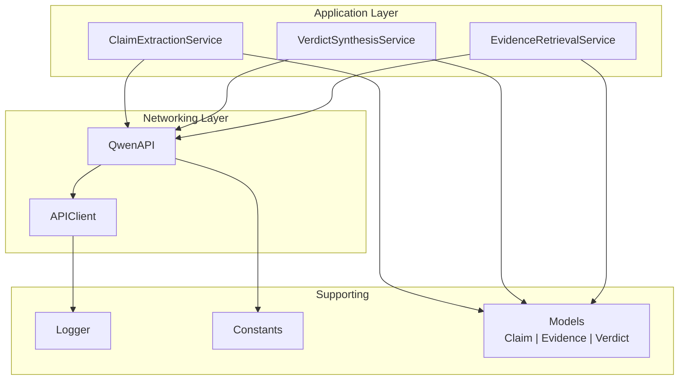
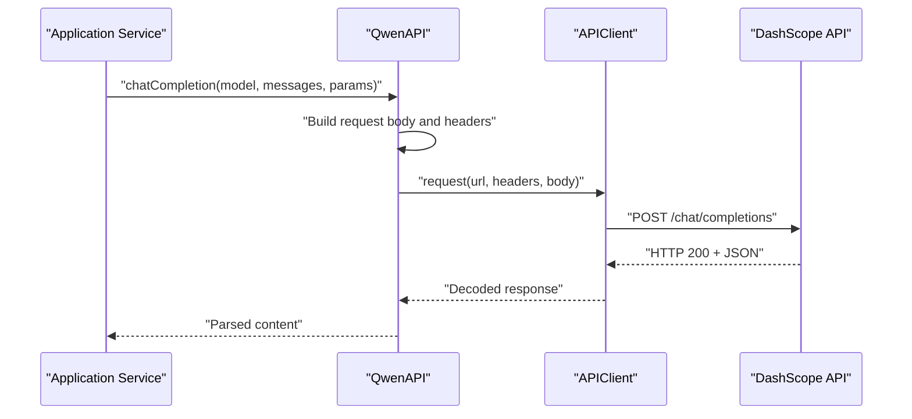
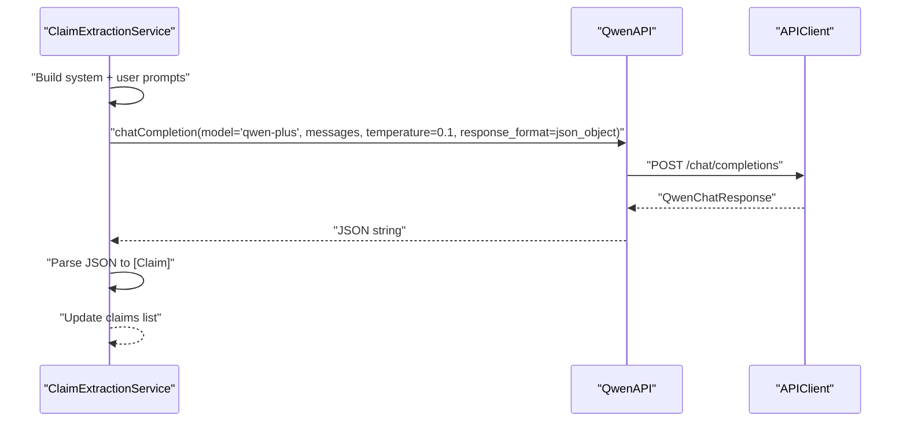
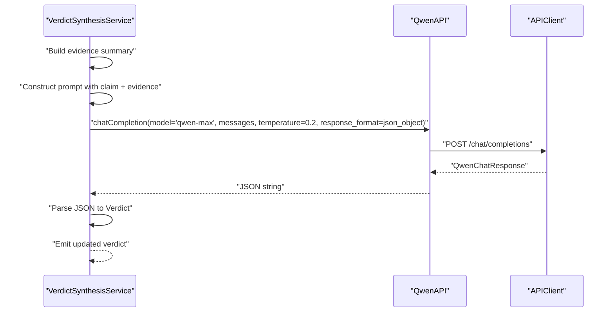
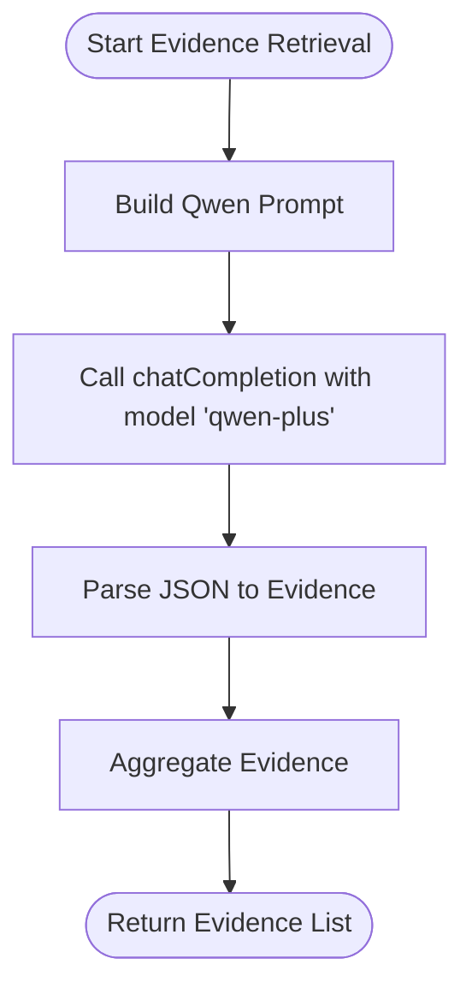
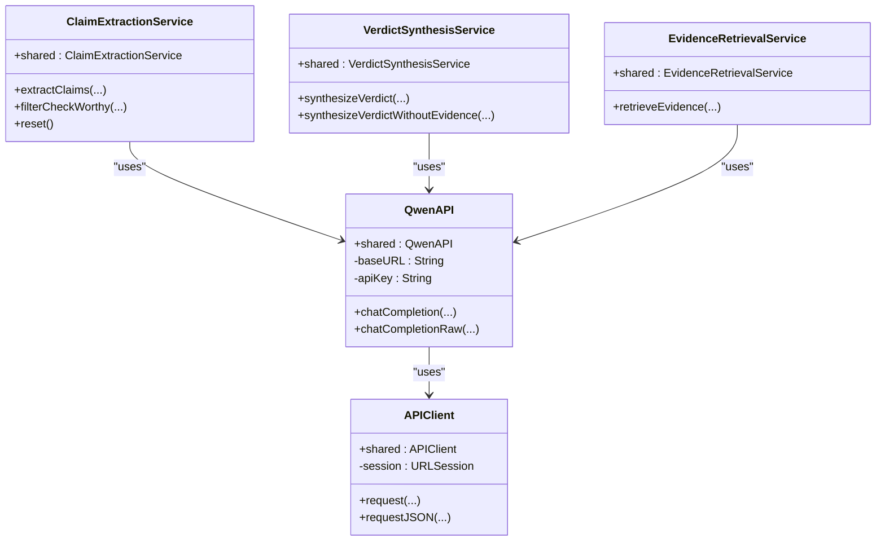
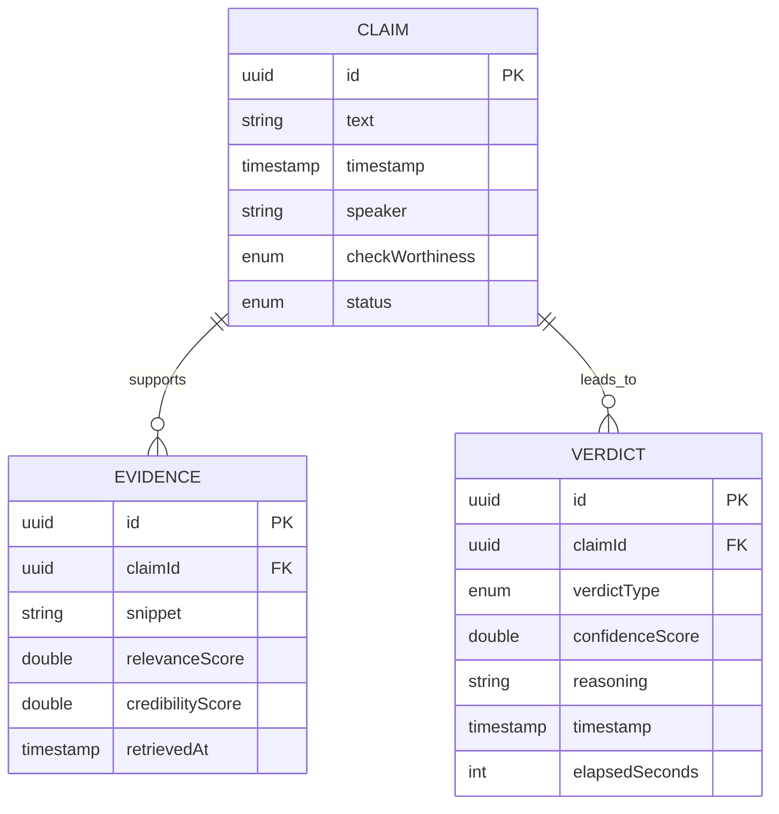

# Qwen API Integration

<cite>
**Referenced Files in This Document**
- [QwenAPI.swift](file://FactShield/FactShield/Core/Network/QwenAPI.swift)
- [APIClient.swift](file://FactShield/FactShield/Core/Network/APIClient.swift)
- [ClaimExtractionService.swift](file://FactShield/FactShield/Core/Claims/ClaimExtractionService.swift)
- [VerdictSynthesisService.swift](file://FactShield/FactShield/Core/Verification/VerdictSynthesisService.swift)
- [EvidenceRetrievalService.swift](file://FactShield/FactShield/Core/Verification/EvidenceRetrievalService.swift)
- [Constants.swift](file://FactShield/FactShield/Utilities/Constants.swift)
- [SettingsView.swift](file://FactShield/FactShield/Features/Settings/SettingsView.swift)
- [Claim.swift](file://FactShield/FactShield/Core/Claims/Claim.swift)
- [Evidence.swift](file://FactShield/FactShield/Core/Verification/Evidence.swift)
- [Verdict.swift](file://FactShield/FactShield/Core/Verification/Verdict.swift)
- [Logger.swift](file://FactShield/FactShield/Utilities/Logger.swift)
- [Enums.swift](file://FactShield/FactShield/Models/Enums.swift)
</cite>

## Table of Contents
1. [Introduction](#introduction)
2. [Project Structure](#project-structure)
3. [Core Components](#core-components)
4. [Architecture Overview](#architecture-overview)
5. [Detailed Component Analysis](#detailed-component-analysis)
6. [Dependency Analysis](#dependency-analysis)
7. [Performance Considerations](#performance-considerations)
8. [Troubleshooting Guide](#troubleshooting-guide)
9. [Conclusion](#conclusion)
10. [Appendices](#appendices)

## Introduction
This document provides comprehensive API documentation for the Qwen API integration used for AI-powered claim extraction and language model processing within the FactShield iOS application. It covers authentication configuration, endpoint details, request/response schemas, payload formats, error handling, rate limiting, retry mechanisms, parameter specifications, and operational guidance for performance and monitoring.

## Project Structure
The Qwen integration centers around a dedicated client and supporting services:
- QwenAPI: Encapsulates the Qwen chat completions endpoint and manages authentication and request construction.
- APIClient: Provides robust HTTP networking with retries, timeouts, and standardized error handling.
- ClaimExtractionService: Orchestrates claim extraction from transcript segments using Qwen.
- VerdictSynthesisService: Generates fact-checking verdicts using Qwen with chain-of-thought reasoning.
- EvidenceRetrievalService: Retrieves supporting evidence for claims via Qwen-based searches.
- Supporting models and utilities define data structures, constants, and logging.

**Diagram sources**
- [QwenAPI.swift:68-198](file://FactShield/FactShield/Core/Network/QwenAPI.swift#L68-L198)
- [APIClient.swift:32-233](file://FactShield/FactShield/Core/Network/APIClient.swift#L32-L233)
- [ClaimExtractionService.swift:4-151](file://FactShield/FactShield/Core/Claims/ClaimExtractionService.swift#L4-L151)
- [VerdictSynthesisService.swift:22-139](file://FactShield/FactShield/Core/Verification/VerdictSynthesisService.swift#L22-L139)
- [EvidenceRetrievalService.swift:1-157](file://FactShield/FactShield/Core/Verification/EvidenceRetrievalService.swift#L1-L157)
- [Logger.swift:1-18](file://FactShield/FactShield/Utilities/Logger.swift#L1-L18)
- [Constants.swift:3-36](file://FactShield/FactShield/Utilities/Constants.swift#L3-L36)
- [Claim.swift:3-37](file://FactShield/FactShield/Core/Claims/Claim.swift#L3-L37)
- [Evidence.swift:3-16](file://FactShield/FactShield/Core/Verification/Evidence.swift#L3-L16)
- [Verdict.swift:3-31](file://FactShield/FactShield/Core/Verification/Verdict.swift#L3-L31)

**Section sources**
- [QwenAPI.swift:68-198](file://FactShield/FactShield/Core/Network/QwenAPI.swift#L68-L198)
- [APIClient.swift:32-233](file://FactShield/FactShield/Core/Network/APIClient.swift#L32-L233)
- [ClaimExtractionService.swift:4-151](file://FactShield/FactShield/Core/Claims/ClaimExtractionService.swift#L4-L151)
- [VerdictSynthesisService.swift:22-139](file://FactShield/FactShield/Core/Verification/VerdictSynthesisService.swift#L22-L139)
- [EvidenceRetrievalService.swift:1-157](file://FactShield/FactShield/Core/Verification/EvidenceRetrievalService.swift#L1-L157)
- [Constants.swift:3-36](file://FactShield/FactShield/Utilities/Constants.swift#L3-L36)
- [Logger.swift:1-18](file://FactShield/FactShield/Utilities/Logger.swift#L1-L18)

## Core Components
- QwenAPI: Implements chat completions against the Qwen endpoint, constructs request bodies, injects Authorization headers, and parses structured responses.
- APIClient: Provides generic request orchestration with exponential backoff, timeout controls, and robust error classification.
- ClaimExtractionService: Uses Qwen to extract verifiable claims from transcript segments and parse structured JSON responses.
- VerdictSynthesisService: Synthesizes fact-checking verdicts using Qwen with chain-of-thought prompts and JSON response parsing.
- EvidenceRetrievalService: Gathers supporting evidence for claims via Qwen-based search prompts and JSON parsing.
- Models: Define Claim, Evidence, and Verdict structures used across the pipeline.

**Section sources**
- [QwenAPI.swift:68-198](file://FactShield/FactShield/Core/Network/QwenAPI.swift#L68-L198)
- [APIClient.swift:32-233](file://FactShield/FactShield/Core/Network/APIClient.swift#L32-L233)
- [ClaimExtractionService.swift:4-151](file://FactShield/FactShield/Core/Claims/ClaimExtractionService.swift#L4-L151)
- [VerdictSynthesisService.swift:22-139](file://FactShield/FactShield/Core/Verification/VerdictSynthesisService.swift#L22-L139)
- [EvidenceRetrievalService.swift:1-157](file://FactShield/FactShield/Core/Verification/EvidenceRetrievalService.swift#L1-L157)
- [Claim.swift:3-37](file://FactShield/FactShield/Core/Claims/Claim.swift#L3-L37)
- [Evidence.swift:3-16](file://FactShield/FactShield/Core/Verification/Evidence.swift#L3-L16)
- [Verdict.swift:3-31](file://FactShield/FactShield/Core/Verification/Verdict.swift#L3-L31)

## Architecture Overview
The integration follows a layered architecture:
- Application Services depend on QwenAPI for LLM interactions.
- QwenAPI delegates HTTP transport to APIClient.
- Logging utilities centralize observability.
- Data models unify claim extraction, evidence retrieval, and verdict synthesis.

**Diagram sources**
- [QwenAPI.swift:86-151](file://FactShield/FactShield/Core/Network/QwenAPI.swift#L86-L151)
- [APIClient.swift:51-103](file://FactShield/FactShield/Core/Network/APIClient.swift#L51-L103)

## Detailed Component Analysis

### Authentication and Security
- API key loading order:
  - Environment variable: QWEN_API_KEY
  - UserDefaults key: qwen_api_key
- Production recommendation: Store securely in the Keychain.
- Header injection: Authorization: Bearer <API_KEY>
- Base URL: https://dashscope-intl.aliyuncs.com/compatible-mode/v1

Security best practices:
- Never hardcode secrets in source.
- Prefer environment-based configuration during development.
- Use secure storage (Keychain) in production.
- Rotate keys periodically and monitor usage.

**Section sources**
- [QwenAPI.swift:75-82](file://FactShield/FactShield/Core/Network/QwenAPI.swift#L75-L82)
- [QwenAPI.swift:126-129](file://FactShield/FactShield/Core/Network/QwenAPI.swift#L126-L129)
- [Constants.swift:12](file://FactShield/FactShield/Utilities/Constants.swift#L12)
- [SettingsView.swift:18](file://FactShield/FactShield/Features/Settings/SettingsView.swift#L18)

### Endpoint: Chat Completions
- Path: /chat/completions
- Method: POST
- Content-Type: application/json
- Required headers: Authorization: Bearer <API_KEY>, Content-Type: application/json

Request body schema (QwenChatRequest):
- model: string (default: "qwen-plus")
- messages: array of ChatMessage
  - role: string ("system" or "user")
  - content: string
- temperature: number (optional)
- max_tokens: integer (optional)
- response_format: object (optional)
  - type: string ("json_object" or "text")

Response schema (QwenChatResponse):
- id: string
- object: string
- created: integer
- model: string
- choices: array of Choice
  - index: integer
  - message: Message
    - role: string
    - content: string
  - finish_reason: string
- usage: object (optional)
  - prompt_tokens: integer
  - completion_tokens: integer
  - total_tokens: integer

Notes:
- The integration expects a single-choice response and returns the content of the first choice.
- When requesting JSON responses, set response_format.type to "json_object".

**Section sources**
- [QwenAPI.swift:43-64](file://FactShield/FactShield/Core/Network/QwenAPI.swift#L43-L64)
- [QwenAPI.swift:6-41](file://FactShield/FactShield/Core/Network/QwenAPI.swift#L6-L41)
- [QwenAPI.swift:109-121](file://FactShield/FactShield/Core/Network/QwenAPI.swift#L109-L121)
- [QwenAPI.swift:133-150](file://FactShield/FactShield/Core/Network/QwenAPI.swift#L133-L150)

### Claim Extraction Workflow
Purpose: Extract verifiable factual claims from transcript segments.

Key steps:
- Construct a system prompt instructing JSON-only responses.
- Build a user prompt containing extraction rules and the transcript.
- Call chatCompletion with model "qwen-plus", temperature 0.1, and response_format.type "json_object".
- Parse the returned JSON into Claim objects with check_worthiness.

Payload example (messages):
- System message: "You are a fact-checking claim extraction assistant. Return only valid JSON."
- User message: The constructed prompt containing rules and the transcript.

Response example (claims array):
- Each item includes text and checkWorthiness fields.

**Diagram sources**
- [ClaimExtractionService.swift:17-56](file://FactShield/FactShield/Core/Claims/ClaimExtractionService.swift#L17-L56)
- [QwenAPI.swift:86-151](file://FactShield/FactShield/Core/Network/QwenAPI.swift#L86-L151)
- [APIClient.swift:51-103](file://FactShield/FactShield/Core/Network/APIClient.swift#L51-L103)

**Section sources**
- [ClaimExtractionService.swift:17-56](file://FactShield/FactShield/Core/Claims/ClaimExtractionService.swift#L17-L56)
- [Claim.swift:11-24](file://FactShield/FactShield/Core/Claims/Claim.swift#L11-L24)

### Verdict Synthesis Workflow
Purpose: Generate a structured verdict with confidence and reasoning.

Key steps:
- Prepare evidence text summarizing sources, credibility, and snippets.
- Construct a chain-of-thought prompt instructing JSON output.
- Call chatCompletion with model "qwen-max", temperature 0.2, and response_format.type "json_object".
- Parse the returned JSON into a Verdict object.

Payload example (messages):
- System message: "You are an expert fact-checker. Without external evidence, be extra cautious and transparent about uncertainty. Return only valid JSON."
- User message: The constructed prompt containing claim and evidence.

Response example (verdict object):
- Fields include verdict, confidence, reasoning, and optional sourceAnalysis.

**Diagram sources**
- [VerdictSynthesisService.swift:30-80](file://FactShield/FactShield/Core/Verification/VerdictSynthesisService.swift#L30-L80)
- [QwenAPI.swift:86-151](file://FactShield/FactShield/Core/Network/QwenAPI.swift#L86-L151)
- [APIClient.swift:51-103](file://FactShield/FactShield/Core/Network/APIClient.swift#L51-L103)

**Section sources**
- [VerdictSynthesisService.swift:30-121](file://FactShield/FactShield/Core/Verification/VerdictSynthesisService.swift#L30-L121)
- [Verdict.swift:13-29](file://FactShield/FactShield/Core/Verification/Verdict.swift#L13-L29)

### Evidence Retrieval Workflow
Purpose: Retrieve supporting evidence for a claim using Qwen-based search prompts.

Key steps:
- Construct a prompt asking Qwen to return structured results with sourceName, url, snippet, and relevanceScore.
- Call chatCompletion with model "qwen-plus", temperature 0.2, and response_format.type "json_object".
- Parse the returned JSON into Evidence objects.

Payload example (messages):
- System message: "You are a fact-check database lookup service. Return only valid JSON."
- User message: The constructed prompt containing the claim.

Response example (results array):
- Each item includes sourceName, url, snippet, and relevanceScore.

**Diagram sources**
- [EvidenceRetrievalService.swift:135-157](file://FactShield/FactShield/Core/Verification/EvidenceRetrievalService.swift#L135-L157)
- [QwenAPI.swift:86-151](file://FactShield/FactShield/Core/Network/QwenAPI.swift#L86-L151)

**Section sources**
- [EvidenceRetrievalService.swift:135-157](file://FactShield/FactShield/Core/Verification/EvidenceRetrievalService.swift#L135-L157)
- [Evidence.swift:12-15](file://FactShield/FactShield/Core/Verification/Evidence.swift#L12-L15)

### Parameter Specifications
Common parameters supported by chatCompletion:
- model: string
  - Examples: "qwen-plus", "qwen-max"
- temperature: number (0.0–1.0)
  - Lower values for deterministic outputs (e.g., 0.1 for extraction, 0.2 for synthesis)
- max_tokens: integer
  - Controls output length (default 2048)
- response_format: object
  - type: "json_object" to enforce structured JSON output

Processing modes and quality settings:
- Extraction mode: "qwen-plus", temperature 0.1, response_format.json_object
- Verdict synthesis mode: "qwen-max", temperature 0.2, response_format.json_object
- Evidence retrieval mode: "qwen-plus", temperature 0.2, response_format.json_object

**Section sources**
- [QwenAPI.swift:94-100](file://FactShield/FactShield/Core/Network/QwenAPI.swift#L94-L100)
- [ClaimExtractionService.swift:42-50](file://FactShield/FactShield/Core/Claims/ClaimExtractionService.swift#L42-L50)
- [VerdictSynthesisService.swift:108-116](file://FactShield/FactShield/Core/Verification/VerdictSynthesisService.swift#L108-L116)
- [EvidenceRetrievalService.swift:155-160](file://FactShield/FactShield/Core/Verification/EvidenceRetrievalService.swift#L155-L160)

### Error Handling and Retry Behavior
- APIClient wraps network calls with up to 3 attempts and exponential backoff.
- Automatic retries for:
  - Rate limit (HTTP 429) with Retry-After header or computed backoff
  - Server errors (HTTP 5xx) with exponential backoff
  - Timeouts with exponential backoff
- Non-retriable errors raise localized errors immediately.

Error types (APIError):
- invalidURL, invalidResponse, httpError(code, body), invalidJSON, decodingError(msg), timeout, noAPIKey, rateLimited(retryAfter)

Logging:
- Centralized logging via OSLog categories for API, claims, verification, and others.

**Section sources**
- [APIClient.swift:6-28](file://FactShield/FactShield/Core/Network/APIClient.swift#L6-L28)
- [APIClient.swift:51-103](file://FactShield/FactShield/Core/Network/APIClient.swift#L51-L103)
- [APIClient.swift:107-157](file://FactShield/FactShield/Core/Network/APIClient.swift#L107-L157)
- [APIClient.swift:221-232](file://FactShield/FactShield/Core/Network/APIClient.swift#L221-L232)
- [Logger.swift:1-18](file://FactShield/FactShield/Utilities/Logger.swift#L1-L18)
- [Enums.swift:25-47](file://FactShield/FactShield/Models/Enums.swift#L25-L47)

### Rate Limiting and Timeouts
- Rate limiting: Detected via HTTP 429; APIClient applies exponential backoff and respects Retry-After header when present.
- Timeouts: Configured per URLSession defaults:
  - timeoutIntervalForRequest: 30 seconds
  - timeoutIntervalForResource: 60 seconds
- Connectivity: waitsForConnectivity enabled to ensure network availability.

Recommendations:
- Monitor Retry-After headers and adjust client-side delays accordingly.
- Consider batching requests and staggering high-volume operations.

**Section sources**
- [APIClient.swift:41-47](file://FactShield/FactShield/Core/Network/APIClient.swift#L41-L47)
- [APIClient.swift:221-232](file://FactShield/FactShield/Core/Network/APIClient.swift#L221-L232)

### Monitoring and Observability
- Logging categories:
  - API: QwenAPI and APIClient logs
  - Claims: ClaimExtractionService logs
  - Verification: EvidenceRetrievalService and VerdictSynthesisService logs
- Usage metrics: Qwen API usage fields (prompt_tokens, completion_tokens, total_tokens) are logged when present.

**Section sources**
- [Logger.swift:1-18](file://FactShield/FactShield/Utilities/Logger.swift#L1-L18)
- [QwenAPI.swift:146-148](file://FactShield/FactShield/Core/Network/QwenAPI.swift#L146-L148)

## Dependency Analysis

**Diagram sources**
- [QwenAPI.swift:68-198](file://FactShield/FactShield/Core/Network/QwenAPI.swift#L68-L198)
- [APIClient.swift:32-233](file://FactShield/FactShield/Core/Network/APIClient.swift#L32-L233)
- [ClaimExtractionService.swift:4-151](file://FactShield/FactShield/Core/Claims/ClaimExtractionService.swift#L4-L151)
- [VerdictSynthesisService.swift:22-139](file://FactShield/FactShield/Core/Verification/VerdictSynthesisService.swift#L22-L139)
- [EvidenceRetrievalService.swift:1-157](file://FactShield/FactShield/Core/Verification/EvidenceRetrievalService.swift#L1-L157)

**Section sources**
- [QwenAPI.swift:68-198](file://FactShield/FactShield/Core/Network/QwenAPI.swift#L68-L198)
- [APIClient.swift:32-233](file://FactShield/FactShield/Core/Network/APIClient.swift#L32-L233)
- [ClaimExtractionService.swift:4-151](file://FactShield/FactShield/Core/Claims/ClaimExtractionService.swift#L4-L151)
- [VerdictSynthesisService.swift:22-139](file://FactShield/FactShield/Core/Verification/VerdictSynthesisService.swift#L22-L139)
- [EvidenceRetrievalService.swift:1-157](file://FactShield/FactShield/Core/Verification/EvidenceRetrievalService.swift#L1-L157)

## Performance Considerations
- Token usage: Monitor prompt_tokens, completion_tokens, and total_tokens to optimize prompt sizes and max_tokens.
- Temperature tuning: Lower temperatures reduce variability and improve determinism for extraction and synthesis.
- Model selection: Prefer "qwen-plus" for extraction and evidence retrieval; "qwen-max" for complex reasoning tasks.
- Concurrency: Evidence retrieval uses concurrent calls to multiple providers; adapt concurrency based on workload.
- Timeouts: Respect default request/resource timeouts; consider adjusting for long-running tasks.
- Caching: Reuse transcript segments and avoid redundant extractions when possible.

[No sources needed since this section provides general guidance]

## Troubleshooting Guide
Common issues and resolutions:
- API key missing:
  - Ensure QWEN_API_KEY environment variable or qwen_api_key in Settings is configured.
- HTTP errors:
  - Inspect localized error descriptions and HTTP status codes.
- Rate limited:
  - Respect Retry-After header; APIClient automatically retries with exponential backoff.
- Timeout:
  - Increase awareness of request/resource timeouts; consider reducing payload size or simplifying prompts.
- Invalid JSON:
  - Verify response_format.type is "json_object" when expecting structured output.
  - Use the convenience raw JSON method to inspect full responses.

Operational checks:
- Confirm base URL correctness and network connectivity.
- Review logs under API, Claims, and Verification categories for contextual clues.

**Section sources**
- [SettingsView.swift:18](file://FactShield/FactShield/Features/Settings/SettingsView.swift#L18)
- [APIClient.swift:6-28](file://FactShield/FactShield/Core/Network/APIClient.swift#L6-L28)
- [APIClient.swift:221-232](file://FactShield/FactShield/Core/Network/APIClient.swift#L221-L232)
- [QwenAPI.swift:101-103](file://FactShield/FactShield/Core/Network/QwenAPI.swift#L101-L103)
- [QwenAPI.swift:141-144](file://FactShield/FactShield/Core/Network/QwenAPI.swift#L141-L144)

## Conclusion
The Qwen API integration in FactShield provides a robust foundation for AI-powered claim extraction, evidence retrieval, and verdict synthesis. By adhering to secure authentication practices, leveraging structured JSON responses, and implementing resilient networking with retries and timeouts, the system delivers reliable and observable AI-assisted fact-checking capabilities.

[No sources needed since this section summarizes without analyzing specific files]

## Appendices

### API Reference Summary
- Endpoint: POST /chat/completions
- Headers: Authorization: Bearer <API_KEY>, Content-Type: application/json
- Request body fields: model, messages, temperature, max_tokens, response_format
- Response fields: id, object, created, model, choices, usage

**Section sources**
- [QwenAPI.swift:105-139](file://FactShield/FactShield/Core/Network/QwenAPI.swift#L105-L139)
- [QwenAPI.swift:6-41](file://FactShield/FactShield/Core/Network/QwenAPI.swift#L6-L41)

### Data Models Overview

**Diagram sources**
- [Claim.swift:3-37](file://FactShield/FactShield/Core/Claims/Claim.swift#L3-L37)
- [Evidence.swift:3-16](file://FactShield/FactShield/Core/Verification/Evidence.swift#L3-L16)
- [Verdict.swift:3-31](file://FactShield/FactShield/Core/Verification/Verdict.swift#L3-L31)