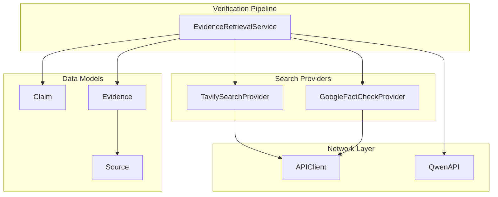
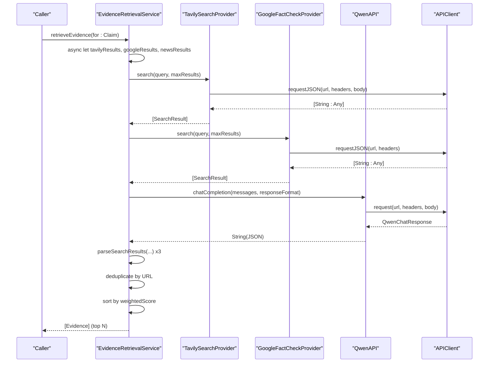
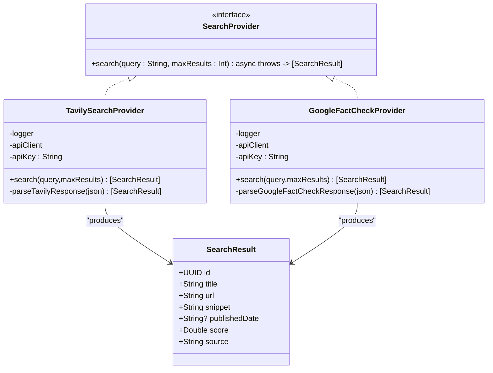
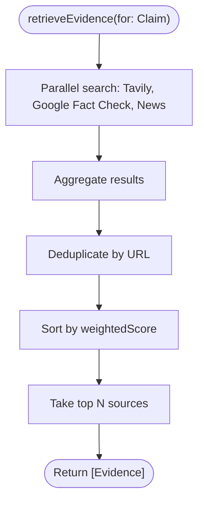
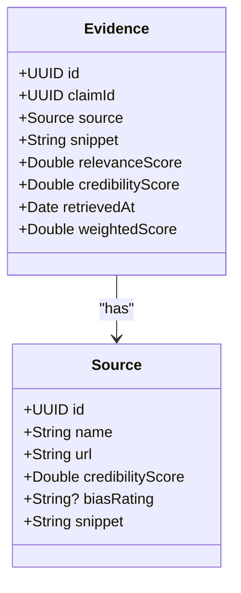
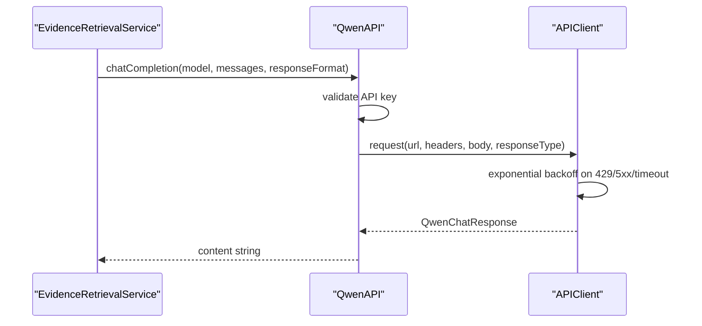
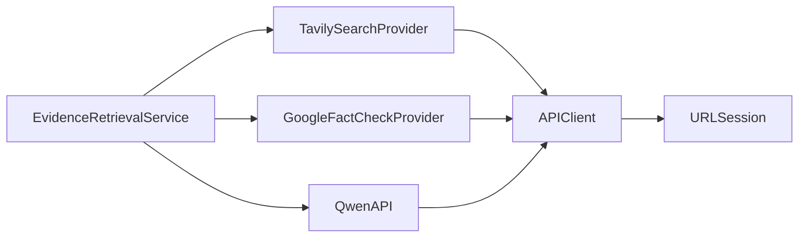

# Search API Integration

<cite>
**Referenced Files in This Document**
- [SearchAPI.swift](file://FactShield/FactShield/Core/Network/SearchAPI.swift)
- [EvidencRetrievalService.swift](file://FactShield/FactShield/Core/Verification/EvidenceRetrievalService.swift)
- [APIClient.swift](file://FactShield/FactShield/Core/Network/APIClient.swift)
- [QwenAPI.swift](file://FactShield/FactShield/Core/Network/QwenAPI.swift)
- [Evidence.swift](file://FactShield/FactShield/Core/Verification/Evidence.swift)
- [Source.swift](file://FactShield/FactShield/Models/Source.swift)
- [Claim.swift](file://FactShield/FactShield/Core/Claims/Claim.swift)
- [Constants.swift](file://FactShield/FactShield/Utilities/Constants.swift)
- [Logger.swift](file://FactShield/FactShield/Utilities/Logger.swift)
- [Enums.swift](file://FactShield/FactShield/Models/Enums.swift)
</cite>

## Table of Contents
1. [Introduction](#introduction)
2. [Project Structure](#project-structure)
3. [Core Components](#core-components)
4. [Architecture Overview](#architecture-overview)
5. [Detailed Component Analysis](#detailed-component-analysis)
6. [Dependency Analysis](#dependency-analysis)
7. [Performance Considerations](#performance-considerations)
8. [Troubleshooting Guide](#troubleshooting-guide)
9. [Conclusion](#conclusion)
10. [Appendices](#appendices)

## Introduction
This document describes the web search API integration used for evidence retrieval and cross-verification within the FactShield iOS application. It covers the search endpoint configuration, query construction patterns, result processing workflows, authentication and API key management, rate limiting considerations, error handling, performance optimization, caching strategies, result deduplication, and debugging approaches.

The system currently integrates two providers:
- Tavily Web Search API (configured for future production use)
- Google Fact Check Tools API (configured for future production use)

In the current development phase, search requests are simulated using the Qwen LLM to produce structured evidence results. Production-ready implementations are stubbed and ready to integrate.

## Project Structure
The search integration spans several modules:
- Network layer: APIClient and QwenAPI handle HTTP requests, retries, timeouts, and authentication.
- Search providers: TavilySearchProvider and GoogleFactCheckProvider encapsulate provider-specific endpoints and response parsing.
- Evidence pipeline: EvidenceRetrievalService orchestrates parallel search across providers, deduplicates results, ranks by weighted scores, and limits output count.
- Data models: Claim, Evidence, Source define the core data structures used throughout the verification pipeline.

**Diagram sources**
- [SearchAPI.swift:36-104](file://FactShield/FactShield/Core/Network/SearchAPI.swift#L36-L104)
- [SearchAPI.swift:108-163](file://FactShield/FactShield/Core/Network/SearchAPI.swift#L108-L163)
- [EvidencRetrievalService.swift:16-63](file://FactShield/FactShield/Core/Verification/EvidenceRetrievalService.swift#L16-L63)
- [APIClient.swift:32-47](file://FactShield/FactShield/Core/Network/APIClient.swift#L32-L47)
- [QwenAPI.swift:68-82](file://FactShield/FactShield/Core/Network/QwenAPI.swift#L68-L82)
- [Evidence.swift:3-15](file://FactShield/FactShield/Core/Verification/Evidence.swift#L3-L15)
- [Source.swift:3-10](file://FactShield/FactShield/Models/Source.swift#L3-L10)
- [Claim.swift:3-25](file://FactShield/FactShield/Core/Claims/Claim.swift#L3-L25)

**Section sources**
- [SearchAPI.swift:1-165](file://FactShield/FactShield/Core/Network/SearchAPI.swift#L1-L165)
- [EvidencRetrievalService.swift:1-233](file://FactShield/FactShield/Core/Verification/EvidenceRetrievalService.swift#L1-L233)
- [APIClient.swift:1-234](file://FactShield/FactShield/Core/Network/APIClient.swift#L1-L234)
- [QwenAPI.swift:1-199](file://FactShield/FactShield/Core/Network/QwenAPI.swift#L1-L199)
- [Evidence.swift:1-16](file://FactShield/FactShield/Core/Verification/Evidence.swift#L1-L16)
- [Source.swift:1-11](file://FactShield/FactShield/Models/Source.swift#L1-L11)
- [Claim.swift:1-37](file://FactShield/FactShield/Core/Claims/Claim.swift#L1-L37)

## Core Components
- SearchProvider protocol defines a uniform interface for search providers.
- SearchResult is a generic representation of a search hit with metadata and scoring.
- TavilySearchProvider implements POST to the Tavily search endpoint with configurable parameters.
- GoogleFactCheckProvider implements GET to the Google Fact Check Tools endpoint with query encoding.
- APIClient centralizes HTTP request handling, retries, timeouts, and error classification.
- QwenAPI wraps the DashScope-compatible Qwen chat completions endpoint with bearer token authentication.
- EvidenceRetrievalService coordinates parallel search across providers, deduplication, sorting, and selection of top results.
- Evidence and Source models represent retrieved evidence with weighted scoring and source metadata.

**Section sources**
- [SearchAPI.swift:8-32](file://FactShield/FactShield/Core/Network/SearchAPI.swift#L8-L32)
- [SearchAPI.swift:36-104](file://FactShield/FactShield/Core/Network/SearchAPI.swift#L36-L104)
- [SearchAPI.swift:108-163](file://FactShield/FactShield/Core/Network/SearchAPI.swift#L108-L163)
- [APIClient.swift:6-28](file://FactShield/FactShield/Core/Network/APIClient.swift#L6-L28)
- [APIClient.swift:32-103](file://FactShield/FactShield/Core/Network/APIClient.swift#L32-L103)
- [QwenAPI.swift:68-151](file://FactShield/FactShield/Core/Network/QwenAPI.swift#L68-L151)
- [EvidencRetrievalService.swift:4-63](file://FactShield/FactShield/Core/Verification/EvidenceRetrievalService.swift#L4-L63)
- [Evidence.swift:3-15](file://FactShield/FactShield/Core/Verification/Evidence.swift#L3-L15)
- [Source.swift:3-10](file://FactShield/FactShield/Models/Source.swift#L3-L10)

## Architecture Overview
The search pipeline follows a staged approach:
- Input: A Claim text is provided to the EvidenceRetrievalService.
- Parallel search: The service concurrently invokes Tavily, Google Fact Check, and a news-like provider (via Qwen).
- Provider-specific parsing: Results are normalized into a generic SearchResult and then mapped to Evidence with provider-specific credibility weights.
- Deduplication: Evidence entries are filtered by URL to remove duplicates.
- Ranking: Evidence is sorted by a weighted score combining relevance and credibility.
- Selection: Top N results are selected based on configured limits.

**Diagram sources**
- [EvidencRetrievalService.swift:16-63](file://FactShield/FactShield/Core/Verification/EvidenceRetrievalService.swift#L16-L63)
- [SearchAPI.swift:45-77](file://FactShield/FactShield/Core/Network/SearchAPI.swift#L45-L77)
- [SearchAPI.swift:117-137](file://FactShield/FactShield/Core/Network/SearchAPI.swift#L117-L137)
- [QwenAPI.swift:133-151](file://FactShield/FactShield/Core/Network/QwenAPI.swift#L133-L151)
- [APIClient.swift:107-157](file://FactShield/FactShield/Core/Network/APIClient.swift#L107-L157)

## Detailed Component Analysis

### Search Provider Interface and Implementations
- SearchProvider protocol defines a single asynchronous search method returning an array of SearchResult.
- SearchResult includes identifiers, title, URL, snippet, published date, score, and source label.
- TavilySearchProvider:
  - Endpoint: POST to the Tavily search API.
  - Authentication: Loads API key from environment or UserDefaults.
  - Body: Includes api_key, query, search_depth, include_answer, and max_results.
  - Response parsing: Extracts title, url, content, published_date, and score; defaults if missing.
- GoogleFactCheckProvider:
  - Endpoint: GET to the Google Fact Check Tools claims:search endpoint.
  - Authentication: Loads API key from environment or UserDefaults.
  - Query encoding: Percent-encodes the query string.
  - Response parsing: Extracts claim text and review metadata; constructs a snippet summarizing rating and publisher.

**Diagram sources**
- [SearchAPI.swift:8-32](file://FactShield/FactShield/Core/Network/SearchAPI.swift#L8-L32)
- [SearchAPI.swift:14-32](file://FactShield/FactShield/Core/Network/SearchAPI.swift#L14-L32)
- [SearchAPI.swift:36-104](file://FactShield/FactShield/Core/Network/SearchAPI.swift#L36-L104)
- [SearchAPI.swift:108-163](file://FactShield/FactShield/Core/Network/SearchAPI.swift#L108-L163)

**Section sources**
- [SearchAPI.swift:8-32](file://FactShield/FactShield/Core/Network/SearchAPI.swift#L8-L32)
- [SearchAPI.swift:36-104](file://FactShield/FactShield/Core/Network/SearchAPI.swift#L36-L104)
- [SearchAPI.swift:108-163](file://FactShield/FactShield/Core/Network/SearchAPI.swift#L108-L163)

### Evidence Retrieval Service
- Orchestrates parallel search across Tavily, Google Fact Check, and a news-like provider (via Qwen).
- Aggregates results, logs provider failures, and continues with available results.
- Deduplicates evidence entries by source URL.
- Sorts by weightedScore (relevance × 0.6 + credibility × 0.4).
- Limits output to a maximum number of sources.

**Diagram sources**
- [EvidencRetrievalService.swift:16-63](file://FactShield/FactShield/Core/Verification/EvidenceRetrievalService.swift#L16-L63)

**Section sources**
- [EvidencRetrievalService.swift:16-63](file://FactShield/FactShield/Core/Verification/EvidenceRetrievalService.swift#L16-L63)

### Data Models and Weighted Scoring
- Evidence includes relevanceScore and credibilityScore; weightedScore is computed as 0.6 × relevance + 0.4 × credibility.
- Source includes name, URL, credibilityScore, optional bias rating, and snippet.
- Claim includes check worthiness and status, enabling prioritization and lifecycle tracking.

**Diagram sources**
- [Evidence.swift:3-15](file://FactShield/FactShield/Core/Verification/Evidence.swift#L3-L15)
- [Source.swift:3-10](file://FactShield/FactShield/Models/Source.swift#L3-L10)

**Section sources**
- [Evidence.swift:3-15](file://FactShield/FactShield/Core/Verification/Evidence.swift#L3-L15)
- [Source.swift:3-10](file://FactShield/FactShield/Models/Source.swift#L3-L10)
- [Claim.swift:3-25](file://FactShield/FactShield/Core/Claims/Claim.swift#L3-L25)

### API Clients and Authentication
- APIClient:
  - Implements generic request and JSON request helpers.
  - Applies exponential backoff for rate limits, server errors, and timeouts.
  - Validates HTTP responses and raises typed APIError variants.
- QwenAPI:
  - Sends chat completion requests to the DashScope-compatible endpoint.
  - Loads API key from environment or UserDefaults; logs usage metrics.
  - Supports JSON object response format for structured outputs.

**Diagram sources**
- [QwenAPI.swift:94-151](file://FactShield/FactShield/Core/Network/QwenAPI.swift#L94-L151)
- [APIClient.swift:51-103](file://FactShield/FactShield/Core/Network/APIClient.swift#L51-L103)

**Section sources**
- [APIClient.swift:6-28](file://FactShield/FactShield/Core/Network/APIClient.swift#L6-L28)
- [APIClient.swift:32-103](file://FactShield/FactShield/Core/Network/APIClient.swift#L32-L103)
- [QwenAPI.swift:68-151](file://FactShield/FactShield/Core/Network/QwenAPI.swift#L68-L151)

## Dependency Analysis
- EvidenceRetrievalService depends on QwenAPI for simulated search results and on SearchProvider implementations for real providers.
- SearchProvider implementations depend on APIClient for HTTP transport and on provider-specific endpoints.
- APIClient depends on URLSession and validates HTTP responses, raising structured errors.
- QwenAPI depends on Constants for base URL and on APIClient for request execution.

**Diagram sources**
- [EvidencRetrievalService.swift:8-9](file://FactShield/FactShield/Core/Verification/EvidenceRetrievalService.swift#L8-L9)
- [SearchAPI.swift:38-43](file://FactShield/FactShield/Core/Network/SearchAPI.swift#L38-L43)
- [SearchAPI.swift:110-115](file://FactShield/FactShield/Core/Network/SearchAPI.swift#L110-L115)
- [QwenAPI.swift:73-82](file://FactShield/FactShield/Core/Network/QwenAPI.swift#L73-L82)
- [APIClient.swift:35-47](file://FactShield/FactShield/Core/Network/APIClient.swift#L35-L47)

**Section sources**
- [EvidencRetrievalService.swift:8-9](file://FactShield/FactShield/Core/Verification/EvidenceRetrievalService.swift#L8-L9)
- [SearchAPI.swift:38-43](file://FactShield/FactShield/Core/Network/SearchAPI.swift#L38-L43)
- [SearchAPI.swift:110-115](file://FactShield/FactShield/Core/Network/SearchAPI.swift#L110-L115)
- [QwenAPI.swift:73-82](file://FactShield/FactShield/Core/Network/QwenAPI.swift#L73-L82)
- [APIClient.swift:35-47](file://FactShield/FactShield/Core/Network/APIClient.swift#L35-L47)

## Performance Considerations
- Parallelism: EvidenceRetrievalService performs concurrent searches across providers to reduce latency.
- Deduplication: Filters duplicate URLs to avoid redundant processing and improve result quality.
- Ranking: Uses a weighted score to prioritize high-relevance, high-credibility sources.
- Limits: Enforces a maximum number of sources to cap downstream processing costs.
- Retries: APIClient applies exponential backoff for transient failures and rate limiting.
- Timeout tuning: URLSession timeouts are configured to balance responsiveness and reliability.

[No sources needed since this section provides general guidance]

## Troubleshooting Guide
Common issues and diagnostics:
- API key not configured:
  - Symptoms: Empty results from providers; warnings logged indicating missing keys.
  - Resolution: Set environment variables or UserDefaults keys for the respective providers.
- Rate limiting:
  - Symptoms: APIError.rateLimited with retry-after guidance.
  - Resolution: Respect Retry-After header or exponential backoff; consider reducing request frequency.
- Network failures:
  - Symptoms: HTTP errors, timeouts, or invalid responses.
  - Resolution: Inspect logs, verify connectivity, and confirm endpoint availability.
- Empty result sets:
  - Symptoms: No evidence returned for a claim.
  - Resolution: Adjust query phrasing, increase maxResults, or expand provider coverage.
- JSON parsing errors:
  - Symptoms: Decoding errors or invalid JSON.
  - Resolution: Verify response format, enable logging, and sanitize JSON strings.

**Section sources**
- [SearchAPI.swift:46-49](file://FactShield/FactShield/Core/Network/SearchAPI.swift#L46-L49)
- [SearchAPI.swift:118-121](file://FactShield/FactShield/Core/Network/SearchAPI.swift#L118-L121)
- [APIClient.swift:221-232](file://FactShield/FactShield/Core/Network/APIClient.swift#L221-L232)
- [EvidencRetrievalService.swift:28-44](file://FactShield/FactShield/Core/Verification/EvidenceRetrievalService.swift#L28-L44)
- [QwenAPI.swift:101-103](file://FactShield/FactShield/Core/Network/QwenAPI.swift#L101-L103)

## Conclusion
The search API integration is designed to be extensible and robust. Current development uses Qwen to simulate provider responses, enabling rapid iteration. Production integration is straightforward: wire Tavily and Google Fact Check providers behind the SearchProvider interface and configure API keys. The EvidenceRetrievalService provides a scalable pipeline for cross-verification with deduplication, ranking, and result limits.

[No sources needed since this section summarizes without analyzing specific files]

## Appendices

### API Endpoints and Configuration
- Tavily Search
  - Method: POST
  - Endpoint: https://api.tavily.com/search
  - Headers: Content-Type: application/json
  - Body fields: api_key, query, search_depth, include_answer, max_results
  - Response: Array of results with title, url, content, published_date, score
- Google Fact Check Tools
  - Method: GET
  - Endpoint: https://factchecktools.googleapis.com/v1alpha1/claims:search
  - Query parameters: query (percent-encoded), key (API key), pageSize
  - Response: Array of claims with claimReview metadata

**Section sources**
- [SearchAPI.swift:55-61](file://FactShield/FactShield/Core/Network/SearchAPI.swift#L55-L61)
- [SearchAPI.swift:123-124](file://FactShield/FactShield/Core/Network/SearchAPI.swift#L123-L124)

### Authentication Methods and API Key Management
- Environment variables:
  - TAVILY_API_KEY
  - GOOGLE_FACTCHECK_API_KEY
  - QWEN_API_KEY
- UserDefaults fallback:
  - tavily_api_key
  - google_factcheck_api_key
  - qwen_api_key
- Recommendations:
  - Prefer environment variables for runtime configuration.
  - Store sensitive keys securely (e.g., Keychain) in production.
  - Validate presence of keys before issuing requests.

**Section sources**
- [SearchAPI.swift:40-43](file://FactShield/FactShield/Core/Network/SearchAPI.swift#L40-L43)
- [SearchAPI.swift:112-115](file://FactShield/FactShield/Core/Network/SearchAPI.swift#L112-L115)
- [QwenAPI.swift:76-82](file://FactShield/FactShield/Core/Network/QwenAPI.swift#L76-L82)

### Rate Limiting Considerations
- APIClient detects HTTP 429 and parses Retry-After header.
- Exponential backoff is applied for 429, 5xx, and timeout conditions.
- Suggested mitigation:
  - Reduce concurrent requests.
  - Increase backoff multiplier.
  - Implement client-side quotas per provider.

**Section sources**
- [APIClient.swift:221-232](file://FactShield/FactShield/Core/Network/APIClient.swift#L221-L232)
- [APIClient.swift:74-91](file://FactShield/FactShield/Core/Network/APIClient.swift#L74-L91)

### Result Filtering and Ranking
- Deduplication: Filter by source URL to eliminate duplicates.
- Ranking: Sort by weightedScore = 0.6 × relevance + 0.4 × credibility.
- Selection: Limit to a maximum number of sources to control downstream processing.

**Section sources**
- [EvidencRetrievalService.swift:46-60](file://FactShield/FactShield/Core/Verification/EvidenceRetrievalService.swift#L46-L60)
- [Evidence.swift:12-14](file://FactShield/FactShield/Core/Verification/Evidence.swift#L12-L14)

### Data Extraction Patterns
- EvidenceRetrievalService constructs structured prompts for Qwen to return JSON with results.
- Responses are sanitized to remove code fences and parsed into Evidence objects.
- Provider credibility scores are embedded to influence ranking.

**Section sources**
- [EvidencRetrievalService.swift:73-98](file://FactShield/FactShield/Core/Verification/EvidenceRetrievalService.swift#L73-L98)
- [EvidencRetrievalService.swift:106-133](file://FactShield/FactShield/Core/Verification/EvidenceRetrievalService.swift#L106-L133)
- [EvidencRetrievalService.swift:141-166](file://FactShield/FactShield/Core/Verification/EvidenceRetrievalService.swift#L141-L166)
- [EvidencRetrievalService.swift:170-214](file://FactShield/FactShield/Core/Verification/EvidenceRetrievalService.swift#L170-L214)

### Error Handling Reference
- APIError variants include invalidURL, invalidResponse, httpError, invalidJSON, decodingError, timeout, noAPIKey, rateLimited.
- APIClient translates HTTP responses into typed errors and applies retry logic accordingly.

**Section sources**
- [APIClient.swift:6-28](file://FactShield/FactShield/Core/Network/APIClient.swift#L6-L28)
- [APIClient.swift:221-232](file://FactShield/FactShield/Core/Network/APIClient.swift#L221-L232)

### Logging and Monitoring
- Centralized logging via OSLog categories for API, verification, and other subsystems.
- Logs include request metadata, usage metrics, and error details for debugging.

**Section sources**
- [Logger.swift:3-17](file://FactShield/FactShield/Utilities/Logger.swift#L3-L17)
- [QwenAPI.swift:131-148](file://FactShield/FactShield/Core/Network/QwenAPI.swift#L131-L148)