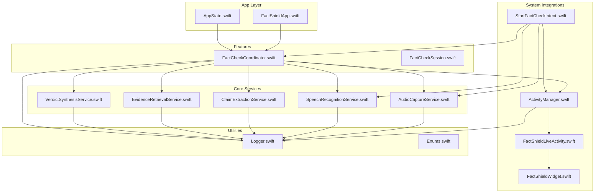
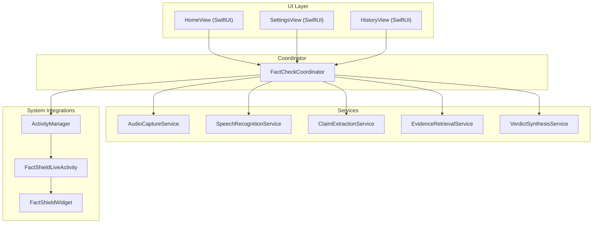
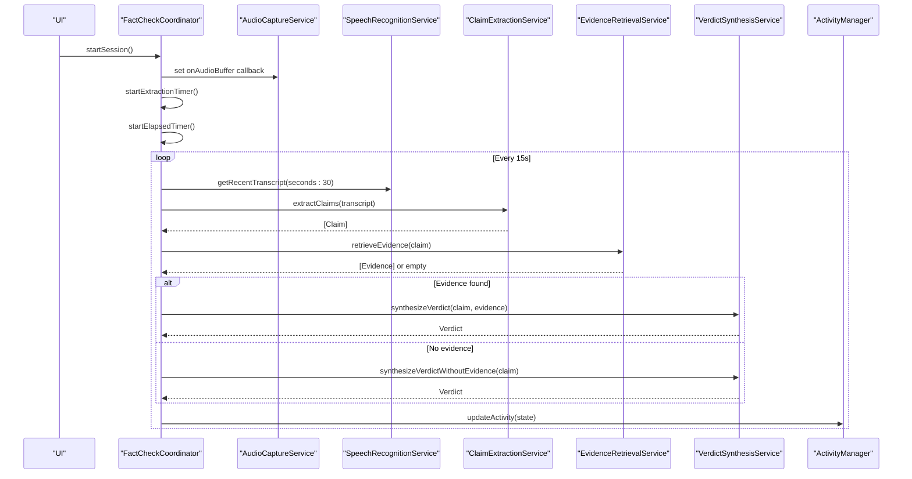
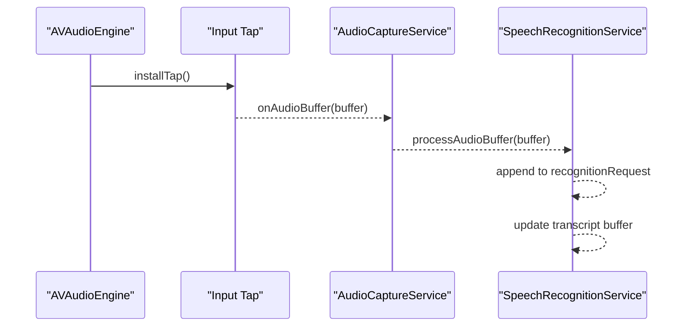
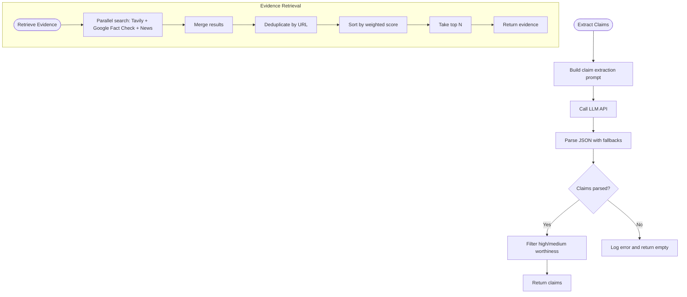
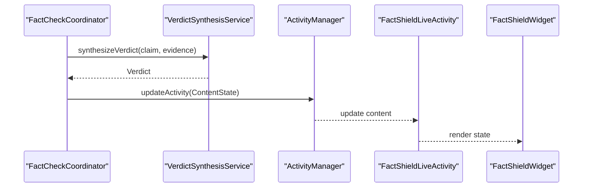
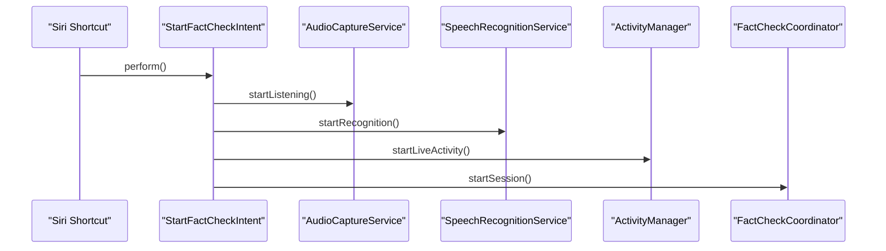
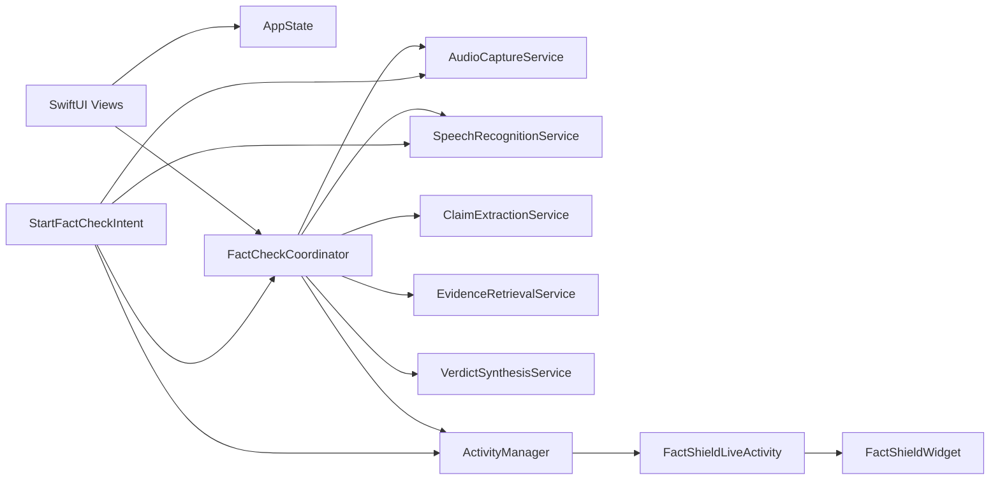

# Architecture Overview

<cite>
**Referenced Files in This Document**
- [FactShieldApp.swift](file://FactShield/FactShield/App/FactShieldApp.swift)
- [AppState.swift](file://FactShield/FactShield/App/AppState.swift)
- [FactCheckCoordinator.swift](file://FactShield/FactShield/Features/FactCheck/FactCheckCoordinator.swift)
- [FactCheckSession.swift](file://FactShield/FactShield/Models/FactCheckSession.swift)
- [AudioCaptureService.swift](file://FactShield/FactShield/Core/Audio/AudioCaptureService.swift)
- [SpeechRecognitionService.swift](file://FactShield/FactShield/Core/Speech/SpeechRecognitionService.swift)
- [ClaimExtractionService.swift](file://FactShield/FactShield/Core/Claims/ClaimExtractionService.swift)
- [EvidenceRetrievalService.swift](file://FactShield/FactShield/Core/Verification/EvidenceRetrievalService.swift)
- [VerdictSynthesisService.swift](file://FactShield/FactShield/Core/Verification/VerdictSynthesisService.swift)
- [ActivityManager.swift](file://FactShield/FactShield/Widgets/ActivityManager.swift)
- [FactShieldLiveActivity.swift](file://FactShield/FactShield/Widgets/FactShieldLiveActivity.swift)
- [FactShieldWidget.swift](file://FactShield/FactShield/Widgets/FactShieldWidget.swift)
- [StartFactCheckIntent.swift](file://FactShield/FactShield/Intents/StartFactCheckIntent.swift)
- [Enums.swift](file://FactShield/FactShield/Models/Enums.swift)
- [Logger.swift](file://FactShield/FactShield/Utilities/Logger.swift)
</cite>

## Table of Contents
1. [Introduction](#introduction)
2. [Project Structure](#project-structure)
3. [Core Components](#core-components)
4. [Architecture Overview](#architecture-overview)
5. [Detailed Component Analysis](#detailed-component-analysis)
6. [Dependency Analysis](#dependency-analysis)
7. [Performance Considerations](#performance-considerations)
8. [Troubleshooting Guide](#troubleshooting-guide)
9. [Conclusion](#conclusion)
10. [Appendices](#appendices)

## Introduction
This document describes the FactChecking Live system architecture. It is a modular, MVVM-inspired application centered around a coordinator-driven pipeline that captures audio, recognizes speech, extracts verifiable claims, retrieves supporting or conflicting evidence, synthesizes a verdict, and surfaces real-time progress via Apple’s ActivityKit Live Activity and WidgetKit widgets. The system emphasizes centralized state management, service-layer modularity, and Apple ecosystem integration.

## Project Structure
The project is organized into distinct layers:
- App: Application lifecycle, global state, and SwiftUI views
- Features: Feature-specific orchestration and UI (e.g., FactCheck)
- Core: Service layer implementing audio capture, speech recognition, claim extraction, evidence retrieval, and verdict synthesis
- Models: Domain models and enums
- Utilities: Shared utilities like logging
- Widgets: Live Activity and Widget definitions
- Intents: Siri Shortcuts integration

**Diagram sources**
- [FactShieldApp.swift:1-127](file://FactShield/FactShield/App/FactShieldApp.swift#L1-L127)
- [AppState.swift:1-30](file://FactShield/FactShield/App/AppState.swift#L1-L30)
- [FactCheckCoordinator.swift:1-216](file://FactShield/FactShield/Features/FactCheck/FactCheckCoordinator.swift#L1-L216)
- [FactCheckSession.swift:1-54](file://FactShield/FactShield/Models/FactCheckSession.swift#L1-L54)
- [AudioCaptureService.swift:1-51](file://FactShield/FactShield/Core/Audio/AudioCaptureService.swift#L1-L51)
- [SpeechRecognitionService.swift:1-138](file://FactShield/FactShield/Core/Speech/SpeechRecognitionService.swift#L1-L138)
- [ClaimExtractionService.swift:1-152](file://FactShield/FactShield/Core/Claims/ClaimExtractionService.swift#L1-L152)
- [EvidenceRetrievalService.swift:1-233](file://FactShield/FactShield/Core/Verification/EvidenceRetrievalService.swift#L1-L233)
- [VerdictSynthesisService.swift:1-184](file://FactShield/FactShield/Core/Verification/VerdictSynthesisService.swift#L1-L184)
- [ActivityManager.swift:1-87](file://FactShield/FactShield/Widgets/ActivityManager.swift#L1-L87)
- [FactShieldLiveActivity.swift:1-44](file://FactShield/FactShield/Widgets/FactShieldLiveActivity.swift#L1-L44)
- [FactShieldWidget.swift:1-218](file://FactShield/FactShield/Widgets/FactShieldWidget.swift#L1-L218)
- [StartFactCheckIntent.swift:1-29](file://FactShield/FactShield/Intents/StartFactCheckIntent.swift#L1-L29)
- [Logger.swift:1-18](file://FactShield/FactShield/Utilities/Logger.swift#L1-L18)
- [Enums.swift:1-48](file://FactShield/FactShield/Models/Enums.swift#L1-L48)

**Section sources**
- [FactShieldApp.swift:1-127](file://FactShield/FactShield/App/FactShieldApp.swift#L1-L127)
- [AppState.swift:1-30](file://FactShield/FactShield/App/AppState.swift#L1-L30)
- [FactCheckCoordinator.swift:1-216](file://FactShield/FactShield/Features/FactCheck/FactCheckCoordinator.swift#L1-L216)
- [FactCheckSession.swift:1-54](file://FactShield/FactShield/Models/FactCheckSession.swift#L1-L54)
- [AudioCaptureService.swift:1-51](file://FactShield/FactShield/Core/Audio/AudioCaptureService.swift#L1-L51)
- [SpeechRecognitionService.swift:1-138](file://FactShield/FactShield/Core/Speech/SpeechRecognitionService.swift#L1-L138)
- [ClaimExtractionService.swift:1-152](file://FactShield/FactShield/Core/Claims/ClaimExtractionService.swift#L1-L152)
- [EvidenceRetrievalService.swift:1-233](file://FactShield/FactShield/Core/Verification/EvidenceRetrievalService.swift#L1-L233)
- [VerdictSynthesisService.swift:1-184](file://FactShield/FactShield/Core/Verification/VerdictSynthesisService.swift#L1-L184)
- [ActivityManager.swift:1-87](file://FactShield/FactShield/Widgets/ActivityManager.swift#L1-L87)
- [FactShieldLiveActivity.swift:1-44](file://FactShield/FactShield/Widgets/FactShieldLiveActivity.swift#L1-L44)
- [FactShieldWidget.swift:1-218](file://FactShield/FactShield/Widgets/FactShieldWidget.swift#L1-L218)
- [StartFactCheckIntent.swift:1-29](file://FactShield/FactShield/Intents/StartFactCheckIntent.swift#L1-L29)
- [Logger.swift:1-18](file://FactShield/FactShield/Utilities/Logger.swift#L1-L18)
- [Enums.swift:1-48](file://FactShield/FactShield/Models/Enums.swift#L1-L48)

## Core Components
- FactCheckCoordinator: Central orchestrator managing the pipeline, timers, and state propagation to ActivityKit. It coordinates audio capture, speech recognition, claim extraction, evidence retrieval, and verdict synthesis.
- AudioCaptureService: AVFoundation-based audio capture with tap installation and buffer delivery callbacks.
- SpeechRecognitionService: Apple Speech recognition integration with rolling transcript buffer and partial/final results handling.
- ClaimExtractionService: LLM-powered claim extraction with robust JSON parsing and fallback strategies.
- EvidenceRetrievalService: Multi-source evidence retrieval with parallelization, deduplication, scoring, and structured parsing.
- VerdictSynthesisService: Chain-of-thought reasoning with structured JSON output and confidence scoring.
- ActivityManager: ActivityKit Live Activity lifecycle management and state updates.
- FactShieldLiveActivity: Attributes and ContentState definitions for Live Activity and Widget.
- FactShieldWidget: Widget rendering across lock screen, Dynamic Island, and expanded layouts.
- StartFactCheckIntent: Siri Shortcut entry-point to launch a background fact-check session.
- AppState: Global observable state for permissions, errors, and UI state.
- Logger: Centralized OSLog categories for subsystems.

**Section sources**
- [FactCheckCoordinator.swift:5-202](file://FactShield/FactShield/Features/FactCheck/FactCheckCoordinator.swift#L5-L202)
- [AudioCaptureService.swift:4-50](file://FactShield/FactShield/Core/Audio/AudioCaptureService.swift#L4-L50)
- [SpeechRecognitionService.swift:5-137](file://FactShield/FactShield/Core/Speech/SpeechRecognitionService.swift#L5-L137)
- [ClaimExtractionService.swift:4-151](file://FactShield/FactShield/Core/Claims/ClaimExtractionService.swift#L4-L151)
- [EvidenceRetrievalService.swift:4-232](file://FactShield/FactShield/Core/Verification/EvidenceRetrievalService.swift#L4-L232)
- [VerdictSynthesisService.swift:22-183](file://FactShield/FactShield/Core/Verification/VerdictSynthesisService.swift#L22-L183)
- [ActivityManager.swift:4-86](file://FactShield/FactShield/Widgets/ActivityManager.swift#L4-L86)
- [FactShieldLiveActivity.swift:5-43](file://FactShield/FactShield/Widgets/FactShieldLiveActivity.swift#L5-L43)
- [FactShieldWidget.swift:5-218](file://FactShield/FactShield/Widgets/FactShieldWidget.swift#L5-L218)
- [StartFactCheckIntent.swift:4-28](file://FactShield/FactShield/Intents/StartFactCheckIntent.swift#L4-L28)
- [AppState.swift:3-29](file://FactShield/FactShield/App/AppState.swift#L3-L29)
- [Logger.swift:3-17](file://FactShield/FactShield/Utilities/Logger.swift#L3-L17)

## Architecture Overview
The system follows an MVVM-inspired architecture with a coordinator-driven pipeline:
- Observable state: @Observable classes encapsulate state and notify observers.
- Coordinator pattern: FactCheckCoordinator orchestrates the end-to-end pipeline.
- Service locator pattern: Services are accessed via shared singletons, simplifying dependency access.
- Pipeline pattern: Stages are chained (audio → speech → claims → evidence → verdict) with periodic triggers and error resilience.

**Diagram sources**
- [FactShieldApp.swift:28-127](file://FactShield/FactShield/App/FactShieldApp.swift#L28-L127)
- [FactCheckCoordinator.swift:5-202](file://FactShield/FactShield/Features/FactCheck/FactCheckCoordinator.swift#L5-L202)
- [AudioCaptureService.swift:4-50](file://FactShield/FactShield/Core/Audio/AudioCaptureService.swift#L4-L50)
- [SpeechRecognitionService.swift:5-137](file://FactShield/FactShield/Core/Speech/SpeechRecognitionService.swift#L5-L137)
- [ClaimExtractionService.swift:4-151](file://FactShield/FactShield/Core/Claims/ClaimExtractionService.swift#L4-L151)
- [EvidenceRetrievalService.swift:4-232](file://FactShield/FactShield/Core/Verification/EvidenceRetrievalService.swift#L4-L232)
- [VerdictSynthesisService.swift:22-183](file://FactShield/FactShield/Core/Verification/VerdictSynthesisService.swift#L22-L183)
- [ActivityManager.swift:4-86](file://FactShield/FactShield/Widgets/ActivityManager.swift#L4-L86)
- [FactShieldLiveActivity.swift:5-43](file://FactShield/FactShield/Widgets/FactShieldLiveActivity.swift#L5-L43)
- [FactShieldWidget.swift:5-218](file://FactShield/FactShield/Widgets/FactShieldWidget.swift#L5-L218)

## Detailed Component Analysis

### FactCheckCoordinator
- Responsibilities:
  - Manages audio buffer callbacks and wires them to the audio buffer processor.
  - Periodically triggers claim extraction and verification loop.
  - Maintains current claim, verdict, session transcript, and runtime metrics.
  - Updates ActivityKit Live Activity with current state.
- Patterns:
  - Observer pattern: @Observable state updates propagate to UI and ActivityKit.
  - Pipeline pattern: Staged processing with error handling and fallbacks.
- Key flows:
  - Start session: configures audio, starts timers, logs start.
  - Stop session: cancels timers and logs stop.
  - Periodic extraction: collects recent transcript, extracts claims, retrieves evidence, synthesizes verdict, updates ActivityKit.

**Diagram sources**
- [FactCheckCoordinator.swift:38-161](file://FactShield/FactShield/Features/FactCheck/FactCheckCoordinator.swift#L38-L161)
- [SpeechRecognitionService.swift:132-136](file://FactShield/FactShield/Core/Speech/SpeechRecognitionService.swift#L132-L136)
- [ClaimExtractionService.swift:18-56](file://FactShield/FactShield/Core/Claims/ClaimExtractionService.swift#L18-L56)
- [EvidenceRetrievalService.swift:16-63](file://FactShield/FactShield/Core/Verification/EvidenceRetrievalService.swift#L16-L63)
- [VerdictSynthesisService.swift:30-80](file://FactShield/FactShield/Core/Verification/VerdictSynthesisService.swift#L30-L80)
- [ActivityManager.swift:51-57](file://FactShield/FactShield/Widgets/ActivityManager.swift#L51-L57)

**Section sources**
- [FactCheckCoordinator.swift:5-202](file://FactShield/FactShield/Features/FactCheck/FactCheckCoordinator.swift#L5-L202)

### Audio and Speech Recognition
- AudioCaptureService:
  - Installs an AVAudioEngine tap on the input node to stream PCM buffers.
  - Emits buffers via a callback to the pipeline.
- SpeechRecognitionService:
  - Uses SFSpeech to transcribe audio buffers.
  - Maintains a rolling transcript buffer capped at a word limit.
  - Handles partial and final results, and restarts on error.

**Diagram sources**
- [AudioCaptureService.swift:19-40](file://FactShield/FactShield/Core/Audio/AudioCaptureService.swift#L19-L40)
- [SpeechRecognitionService.swift:41-101](file://FactShield/FactShield/Core/Speech/SpeechRecognitionService.swift#L41-L101)

**Section sources**
- [AudioCaptureService.swift:1-51](file://FactShield/FactShield/Core/Audio/AudioCaptureService.swift#L1-L51)
- [SpeechRecognitionService.swift:1-138](file://FactShield/FactShield/Core/Speech/SpeechRecognitionService.swift#L1-L138)

### Claim Extraction and Evidence Retrieval
- ClaimExtractionService:
  - Prompts an LLM to extract verifiable claims with check-worthiness.
  - Robust JSON parsing with fallbacks for malformed responses.
- EvidenceRetrievalService:
  - Parallelizes retrieval from multiple providers.
  - Deduplicates by URL, sorts by weighted score, and returns top-N results.
  - Parses structured results into Evidence domain objects.

**Diagram sources**
- [ClaimExtractionService.swift:18-107](file://FactShield/FactShield/Core/Claims/ClaimExtractionService.swift#L18-L107)
- [EvidenceRetrievalService.swift:16-63](file://FactShield/FactShield/Core/Verification/EvidenceRetrievalService.swift#L16-L63)

**Section sources**
- [ClaimExtractionService.swift:1-152](file://FactShield/FactShield/Core/Claims/ClaimExtractionService.swift#L1-L152)
- [EvidenceRetrievalService.swift:1-233](file://FactShield/FactShield/Core/Verification/EvidenceRetrievalService.swift#L1-L233)

### Verdict Synthesis and Live Activity
- VerdictSynthesisService:
  - Generates structured verdicts with confidence scores and reasoning.
  - Supports fallback synthesis when no external evidence is available.
- ActivityManager and FactShieldLiveActivity:
  - Define attributes and content state for Live Activity.
  - Start, update, and end activities with push token support.
- FactShieldWidget:
  - Renders Live Activity across lock screen, Dynamic Island, and expanded regions.

**Diagram sources**
- [VerdictSynthesisService.swift:30-80](file://FactShield/FactShield/Core/Verification/VerdictSynthesisService.swift#L30-L80)
- [ActivityManager.swift:51-57](file://FactShield/FactShield/Widgets/ActivityManager.swift#L51-L57)
- [FactShieldLiveActivity.swift:10-20](file://FactShield/FactShield/Widgets/FactShieldLiveActivity.swift#L10-L20)
- [FactShieldWidget.swift:37-162](file://FactShield/FactShield/Widgets/FactShieldWidget.swift#L37-L162)

**Section sources**
- [VerdictSynthesisService.swift:1-184](file://FactShield/FactShield/Core/Verification/VerdictSynthesisService.swift#L1-L184)
- [ActivityManager.swift:1-87](file://FactShield/FactShield/Widgets/ActivityManager.swift#L1-L87)
- [FactShieldLiveActivity.swift:1-44](file://FactShield/FactShield/Widgets/FactShieldLiveActivity.swift#L1-L44)
- [FactShieldWidget.swift:1-218](file://FactShield/FactShield/Widgets/FactShieldWidget.swift#L1-L218)

### Siri Shortcuts Integration
- StartFactCheckIntent:
  - Configures audio session, starts audio capture and speech recognition, launches Live Activity, and initiates the coordinator pipeline.

**Diagram sources**
- [StartFactCheckIntent.swift:10-27](file://FactShield/FactShield/Intents/StartFactCheckIntent.swift#L10-L27)
- [AudioCaptureService.swift:19-40](file://FactShield/FactShield/Core/Audio/AudioCaptureService.swift#L19-L40)
- [SpeechRecognitionService.swift:41-84](file://FactShield/FactShield/Core/Speech/SpeechRecognitionService.swift#L41-L84)
- [ActivityManager.swift:16-48](file://FactShield/FactShield/Widgets/ActivityManager.swift#L16-L48)
- [FactCheckCoordinator.swift:38-55](file://FactShield/FactShield/Features/FactCheck/FactCheckCoordinator.swift#L38-L55)

**Section sources**
- [StartFactCheckIntent.swift:1-29](file://FactShield/FactShield/Intents/StartFactCheckIntent.swift#L1-L29)

## Dependency Analysis
- Internal dependencies:
  - FactCheckCoordinator depends on all core services and ActivityManager.
  - Services depend on shared QwenAPI via APIClient abstraction.
  - UI depends on AppState and FactCheckCoordinator for state.
- External dependencies:
  - AVFoundation for audio capture.
  - Speech framework for on-device/off-device recognition.
  - ActivityKit and WidgetKit for Live Activity and widgets.
  - AppIntents for Siri Shortcuts.

**Diagram sources**
- [FactShieldApp.swift:28-127](file://FactShield/FactShield/App/FactShieldApp.swift#L28-L127)
- [AppState.swift:3-29](file://FactShield/FactShield/App/AppState.swift#L3-L29)
- [FactCheckCoordinator.swift:11-17](file://FactShield/FactShield/Features/FactCheck/FactCheckCoordinator.swift#L11-L17)
- [ActivityManager.swift:4-86](file://FactShield/FactShield/Widgets/ActivityManager.swift#L4-L86)
- [FactShieldLiveActivity.swift:5-43](file://FactShield/FactShield/Widgets/FactShieldLiveActivity.swift#L5-L43)
- [FactShieldWidget.swift:5-218](file://FactShield/FactShield/Widgets/FactShieldWidget.swift#L5-L218)
- [StartFactCheckIntent.swift:4-28](file://FactShield/FactShield/Intents/StartFactCheckIntent.swift#L4-L28)

**Section sources**
- [FactShieldApp.swift:1-127](file://FactShield/FactShield/App/FactShieldApp.swift#L1-L127)
- [FactCheckCoordinator.swift:1-216](file://FactShield/FactShield/Features/FactCheck/FactCheckCoordinator.swift#L1-L216)
- [ActivityManager.swift:1-87](file://FactShield/FactShield/Widgets/ActivityManager.swift#L1-L87)

## Performance Considerations
- Audio capture:
  - Uses a dedicated queue for buffer delivery to avoid UI thread blocking.
  - Buffer size tuned for responsiveness.
- Speech recognition:
  - Prefers on-device recognition when available to reduce latency.
  - Rolling transcript buffer prevents memory bloat while maintaining context.
- Evidence retrieval:
  - Parallel requests to multiple providers improve throughput.
  - Deduplication and top-N selection bound resource usage.
- Verdict synthesis:
  - Structured prompts with JSON responses reduce parsing overhead.
  - Confidence and reasoning returned in a single call minimize round-trips.
- Live Activity updates:
  - Batched updates on a timer to reduce churn and preserve battery life.

[No sources needed since this section provides general guidance]

## Troubleshooting Guide
- Logging:
  - Centralized categories per subsystem enable targeted diagnostics.
- Error handling patterns:
  - Services wrap parsing and network errors into domain-specific errors.
  - Coordinator catches and logs pipeline errors without halting the session.
  - AppState exposes a flag and message for UI-level error surfacing.
- Common issues:
  - Microphone permission denied: handled during app launch and reflected in AppState.
  - Speech recognition unavailable or denied: surfaced via FactShieldError and logged.
  - Live Activity disabled: ActivityManager throws a descriptive error.
  - Network/API errors: Evidence and Verdict services log warnings and continue with fallbacks.

**Section sources**
- [Logger.swift:3-17](file://FactShield/FactShield/Utilities/Logger.swift#L3-L17)
- [FactCheckCoordinator.swift:158-161](file://FactShield/FactShield/Features/FactCheck/FactCheckCoordinator.swift#L158-L161)
- [AppState.swift:16-29](file://FactShield/FactShield/App/AppState.swift#L16-L29)
- [Enums.swift:25-47](file://FactShield/FactShield/Models/Enums.swift#L25-L47)
- [ActivityManager.swift:17-20](file://FactShield/FactShield/Widgets/ActivityManager.swift#L17-L20)

## Conclusion
The FactChecking Live system employs a clean, modular architecture with a coordinator-driven pipeline, centralized observable state, and strong Apple ecosystem integration. The design balances responsiveness, reliability, and user visibility through Live Activity and widgets, while leveraging service-layer abstractions for maintainability and testability.

[No sources needed since this section summarizes without analyzing specific files]

## Appendices
- System boundaries:
  - Audio capture and speech recognition operate within the app sandbox.
  - Evidence retrieval integrates with external APIs via a unified client interface.
  - Live Activity and widgets are managed by Apple frameworks and require explicit user authorization.
- Cross-cutting concerns:
  - Logging spans all subsystems for observability.
  - Error modeling enables consistent user feedback and recovery strategies.
  - Performance tuning focuses on buffering, parallelism, and UI responsiveness.

[No sources needed since this section provides general guidance]