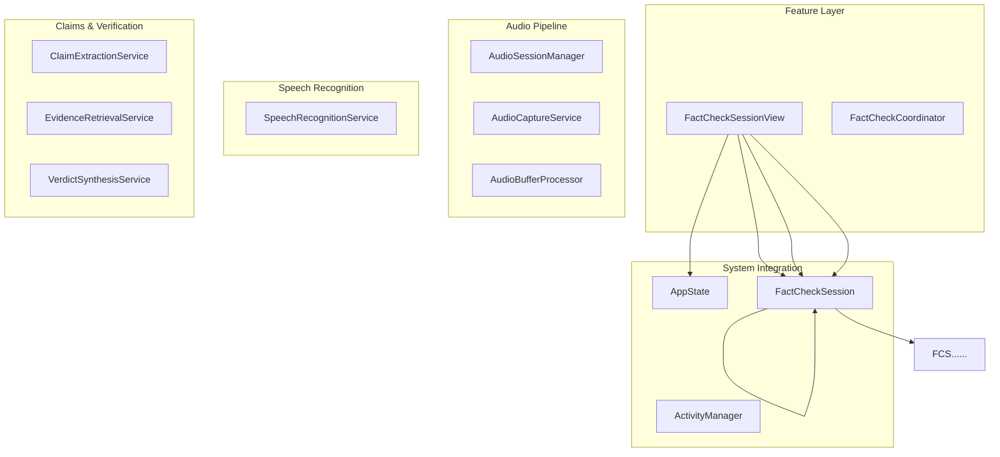
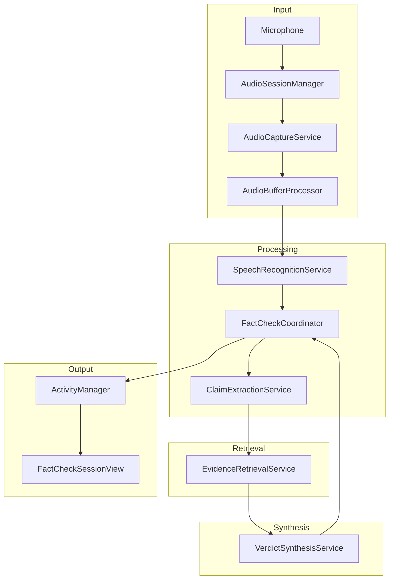
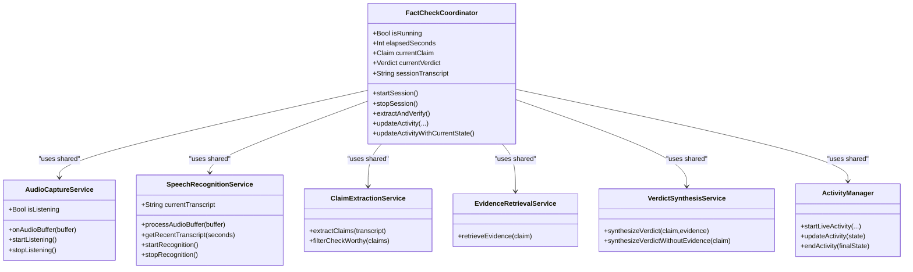
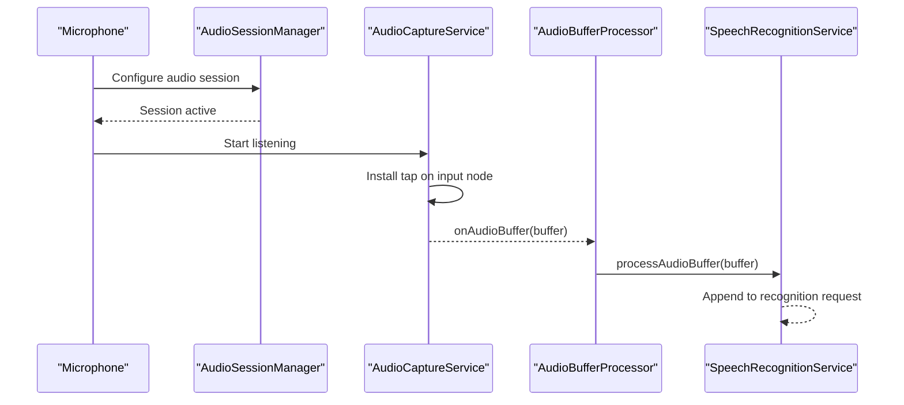
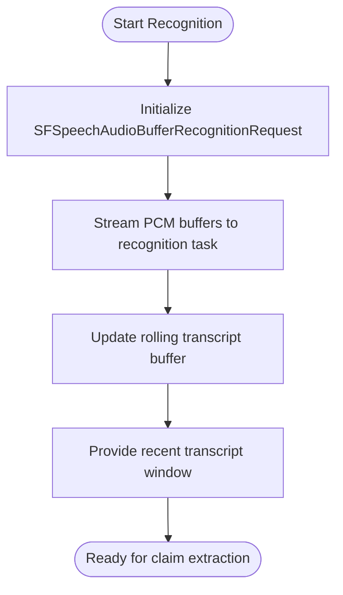
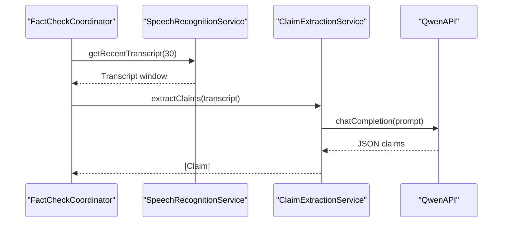
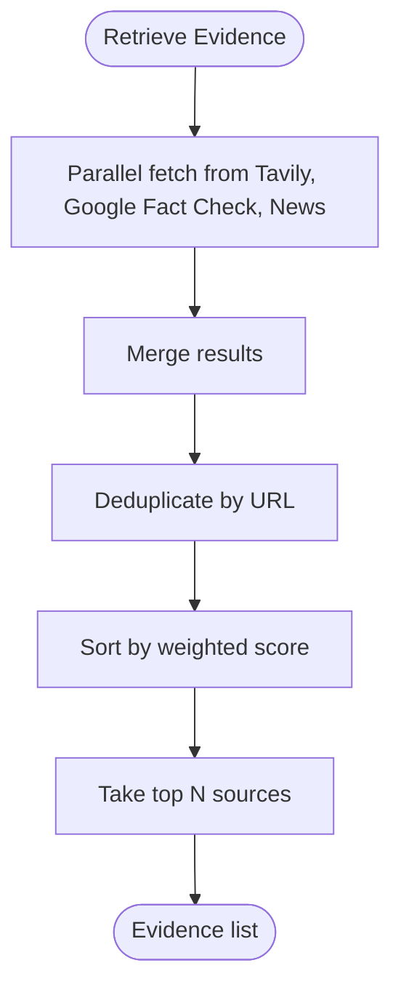
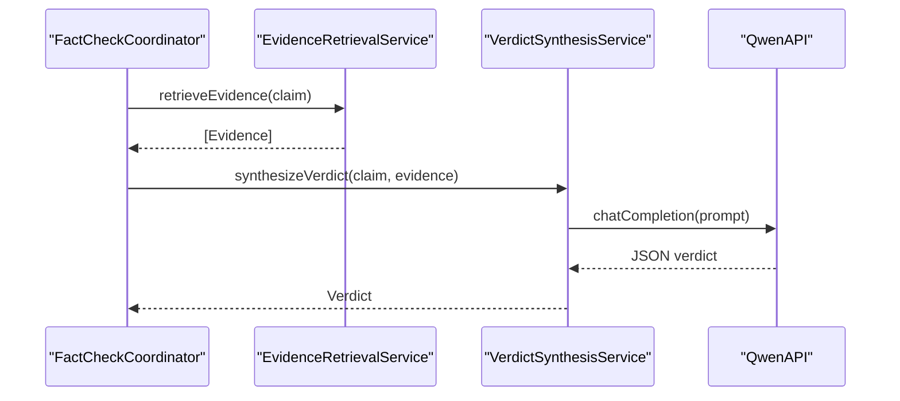
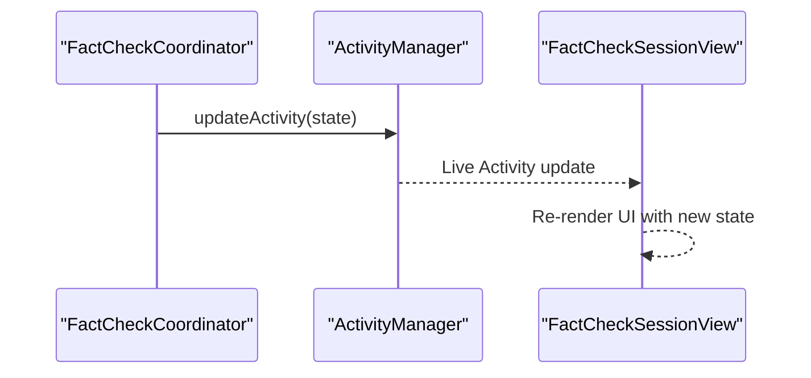
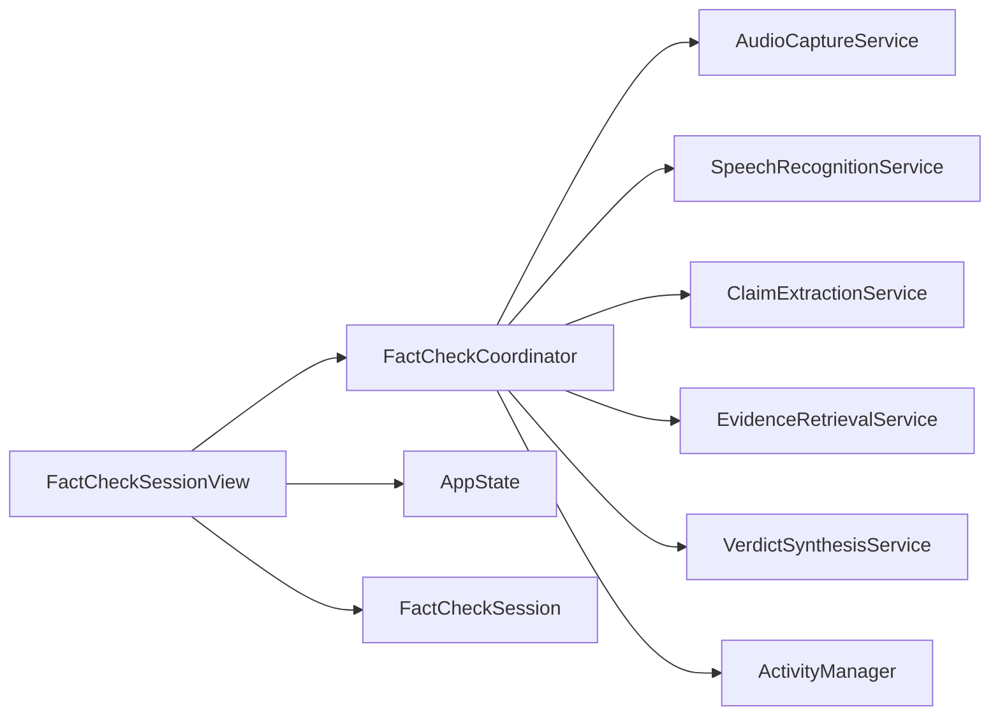

# Component Relationships

<cite>
**Referenced Files in This Document**
- [FactCheckCoordinator.swift](file://FactShield/FactShield/Features/FactCheck/FactCheckCoordinator.swift)
- [AppState.swift](file://FactShield/FactShield/App/AppState.swift)
- [FactCheckSessionView.swift](file://FactShield/FactShield/Features/FactCheck/FactCheckSessionView.swift)
- [AudioCaptureService.swift](file://FactShield/FactShield/Core/Audio/AudioCaptureService.swift)
- [AudioBufferProcessor.swift](file://FactShield/FactShield/Core/Audio/AudioBufferProcessor.swift)
- [AudioSessionManager.swift](file://FactShield/FactShield/Core/Audio/AudioSessionManager.swift)
- [SpeechRecognitionService.swift](file://FactShield/FactShield/Core/Speech/SpeechRecognitionService.swift)
- [ClaimExtractionService.swift](file://FactShield/FactShield/Core/Claims/ClaimExtractionService.swift)
- [EvidenceRetrievalService.swift](file://FactShield/FactShield/Core/Verification/EvidenceRetrievalService.swift)
- [VerdictSynthesisService.swift](file://FactShield/FactShield/Core/Verification/VerdictSynthesisService.swift)
- [ActivityManager.swift](file://FactShield/FactShield/Widgets/ActivityManager.swift)
- [FactCheckSession.swift](file://FactShield/FactShield/Models/FactCheckSession.swift)
</cite>

## Table of Contents
1. [Introduction](#introduction)
2. [Project Structure](#project-structure)
3. [Core Components](#core-components)
4. [Architecture Overview](#architecture-overview)
5. [Detailed Component Analysis](#detailed-component-analysis)
6. [Dependency Analysis](#dependency-analysis)
7. [Performance Considerations](#performance-considerations)
8. [Troubleshooting Guide](#troubleshooting-guide)
9. [Conclusion](#conclusion)

## Introduction
This document explains the component relationships and interactions within the FactChecking Live architecture. The FactCheckCoordinator acts as the central orchestrator managing the end-to-end verification pipeline: audio capture, speech recognition, claim extraction, evidence retrieval, and verdict synthesis. It coordinates with AppState for global state and integrates with UI components and Live Activity for real-time feedback. The system emphasizes loose coupling through protocol-based interfaces and dependency injection patterns, enabling modularity and testability.

## Project Structure
The architecture is organized around a feature-centric layout with clear separation of concerns:
- Feature layer: FactCheckCoordinator and UI views
- Core services: Audio, Speech, Claims, Verification, and Network
- Application state and models: AppState and FactCheckSession
- Live Activity integration: ActivityManager

[No sources needed since this diagram shows conceptual structure, not a direct code mapping]

## Core Components
- FactCheckCoordinator: Central orchestrator that wires audio capture, speech recognition, claim extraction, evidence retrieval, and verdict synthesis. Manages timers, state, and Live Activity updates.
- AppState: Global observable state for permissions, errors, and broadcast status.
- FactCheckSessionView: SwiftUI UI that renders live status, claims, verdicts, and transcript; triggers lifecycle actions.
- Audio subsystem: AudioSessionManager configures the audio session; AudioCaptureService captures PCM buffers; AudioBufferProcessor feeds speech recognition and maintains a rolling buffer.
- SpeechRecognitionService: Streams audio buffers to on-device speech recognition and maintains a rolling transcript.
- ClaimExtractionService: Uses an LLM to extract verifiable claims from transcript segments.
- EvidenceRetrievalService: Retrieves evidence from multiple providers concurrently and deduplicates results.
- VerdictSynthesisService: Synthesizes a structured verdict with confidence and reasoning using chain-of-thought prompting.
- ActivityManager: Starts, updates, and ends Live Activity with current verification state.

**Section sources**
- [FactCheckCoordinator.swift:1-216](file://FactShield/FactShield/Features/FactCheck/FactCheckCoordinator.swift#L1-L216)
- [AppState.swift:1-30](file://FactShield/FactShield/App/AppState.swift#L1-L30)
- [FactCheckSessionView.swift:1-506](file://FactShield/FactShield/Features/FactCheck/FactCheckSessionView.swift#L1-L506)
- [AudioCaptureService.swift:1-51](file://FactShield/FactShield/Core/Audio/AudioCaptureService.swift#L1-L51)
- [AudioBufferProcessor.swift:1-42](file://FactShield/FactShield/Core/Audio/AudioBufferProcessor.swift#L1-L42)
- [AudioSessionManager.swift:1-23](file://FactShield/FactShield/Core/Audio/AudioSessionManager.swift#L1-L23)
- [SpeechRecognitionService.swift:1-138](file://FactShield/FactShield/Core/Speech/SpeechRecognitionService.swift#L1-L138)
- [ClaimExtractionService.swift:1-152](file://FactShield/FactShield/Core/Claims/ClaimExtractionService.swift#L1-L152)
- [EvidenceRetrievalService.swift:1-233](file://FactShield/FactShield/Core/Verification/EvidenceRetrievalService.swift#L1-L233)
- [VerdictSynthesisService.swift:1-184](file://FactShield/FactShield/Core/Verification/VerdictSynthesisService.swift#L1-L184)
- [ActivityManager.swift:1-87](file://FactShield/FactShield/Widgets/ActivityManager.swift#L1-L87)
- [FactCheckSession.swift:1-54](file://FactShield/FactShield/Models/FactCheckSession.swift#L1-L54)

## Architecture Overview
The system follows a pipeline-driven architecture:
- Input: Microphone audio captured via AVAudioEngine and streamed to speech recognition.
- Processing: Rolling transcript maintained by SpeechRecognitionService; periodic claim extraction by ClaimExtractionService.
- Retrieval: EvidenceRetrievalService concurrently queries multiple sources and deduplicates results.
- Synthesis: VerdictSynthesisService produces structured verdicts with confidence and reasoning.
- Output: Live Activity updates and UI rendering via FactCheckSessionView.

**Diagram sources**
- [AudioCaptureService.swift:19-49](file://FactShield/FactShield/Core/Audio/AudioCaptureService.swift#L19-L49)
- [AudioBufferProcessor.swift:16-22](file://FactShield/FactShield/Core/Audio/AudioBufferProcessor.swift#L16-L22)
- [SpeechRecognitionService.swift:86-88](file://FactShield/FactShield/Core/Speech/SpeechRecognitionService.swift#L86-L88)
- [FactCheckCoordinator.swift:44-46](file://FactShield/FactShield/Features/FactCheck/FactCheckCoordinator.swift#L44-L46)
- [ClaimExtractionService.swift:18-56](file://FactShield/FactShield/Core/Claims/ClaimExtractionService.swift#L18-L56)
- [EvidenceRetrievalService.swift:16-63](file://FactShield/FactShield/Core/Verification/EvidenceRetrievalService.swift#L16-L63)
- [VerdictSynthesisService.swift:30-80](file://FactShield/FactShield/Core/Verification/VerdictSynthesisService.swift#L30-L80)
- [ActivityManager.swift:51-57](file://FactShield/FactShield/Widgets/ActivityManager.swift#L51-L57)
- [FactCheckSessionView.swift:47-76](file://FactShield/FactShield/Features/FactCheck/FactCheckSessionView.swift#L47-L76)

## Detailed Component Analysis

### FactCheckCoordinator
Responsibilities:
- Orchestrates the verification pipeline: audio capture, speech recognition, claim extraction, evidence retrieval, and verdict synthesis.
- Manages timers for periodic claim extraction and elapsed time tracking.
- Updates Live Activity with current state and verdict metadata.
- Maintains session history and current state for UI rendering.

Key behaviors:
- startSession wires the audio buffer callback and starts periodic extraction and elapsed timers.
- extractAndVerify retrieves recent transcript, extracts high-priority claims, retrieves evidence, synthesizes verdict, and updates Live Activity.
- updateActivity and updateActivityWithCurrentState encapsulate Live Activity updates.

**Diagram sources**
- [FactCheckCoordinator.swift:6-18](file://FactShield/FactShield/Features/FactCheck/FactCheckCoordinator.swift#L6-L18)
- [AudioCaptureService.swift:5-16](file://FactShield/FactShield/Core/Audio/AudioCaptureService.swift#L5-L16)
- [SpeechRecognitionService.swift:6-17](file://FactShield/FactShield/Core/Speech/SpeechRecognitionService.swift#L6-L17)
- [ClaimExtractionService.swift:5-14](file://FactShield/FactShield/Core/Claims/ClaimExtractionService.swift#L5-L14)
- [EvidenceRetrievalService.swift:5-14](file://FactShield/FactShield/Core/Verification/EvidenceRetrievalService.swift#L5-L14)
- [VerdictSynthesisService.swift:23-28](file://FactShield/FactShield/Core/Verification/VerdictSynthesisService.swift#L23-L28)
- [ActivityManager.swift:5-14](file://FactShield/FactShield/Widgets/ActivityManager.swift#L5-L14)

**Section sources**
- [FactCheckCoordinator.swift:38-201](file://FactShield/FactShield/Features/FactCheck/FactCheckCoordinator.swift#L38-L201)

### Audio Pipeline
- AudioSessionManager configures the audio session for optimal capture conditions.
- AudioCaptureService installs a tap on the input node to stream PCM buffers.
- AudioBufferProcessor accumulates recent buffers and forwards them to the speech recognizer.

**Diagram sources**
- [AudioSessionManager.swift:8-17](file://FactShield/FactShield/Core/Audio/AudioSessionManager.swift#L8-L17)
- [AudioCaptureService.swift:26-30](file://FactShield/FactShield/Core/Audio/AudioCaptureService.swift#L26-L30)
- [AudioBufferProcessor.swift:16-22](file://FactShield/FactShield/Core/Audio/AudioBufferProcessor.swift#L16-L22)
- [SpeechRecognitionService.swift:86-88](file://FactShield/FactShield/Core/Speech/SpeechRecognitionService.swift#L86-L88)

**Section sources**
- [AudioSessionManager.swift:1-23](file://FactShield/FactShield/Core/Audio/AudioSessionManager.swift#L1-L23)
- [AudioCaptureService.swift:19-51](file://FactShield/FactShield/Core/Audio/AudioCaptureService.swift#L19-L51)
- [AudioBufferProcessor.swift:16-42](file://FactShield/FactShield/Core/Audio/AudioBufferProcessor.swift#L16-L42)

### Speech Recognition
- SpeechRecognitionService initializes on-device recognition, streams audio buffers, and maintains a rolling transcript.
- Provides recent transcript windows for periodic claim extraction.

**Diagram sources**
- [SpeechRecognitionService.swift:51-84](file://FactShield/FactShield/Core/Speech/SpeechRecognitionService.swift#L51-L84)
- [SpeechRecognitionService.swift:116-136](file://FactShield/FactShield/Core/Speech/SpeechRecognitionService.swift#L116-L136)

**Section sources**
- [SpeechRecognitionService.swift:41-138](file://FactShield/FactShield/Core/Speech/SpeechRecognitionService.swift#L41-L138)

### Claim Extraction
- ClaimExtractionService sends a transcript segment to an LLM to extract verifiable claims with check-worthiness ratings.
- Parses JSON responses robustly, handling code fences and fallback arrays.

**Diagram sources**
- [FactCheckCoordinator.swift:88-99](file://FactShield/FactShield/Features/FactCheck/FactCheckCoordinator.swift#L88-L99)
- [SpeechRecognitionService.swift:132-136](file://FactShield/FactShield/Core/Speech/SpeechRecognitionService.swift#L132-L136)
- [ClaimExtractionService.swift:42-56](file://FactShield/FactShield/Core/Claims/ClaimExtractionService.swift#L42-L56)

**Section sources**
- [ClaimExtractionService.swift:18-152](file://FactShield/FactShield/Core/Claims/ClaimExtractionService.swift#L18-L152)

### Evidence Retrieval
- EvidenceRetrievalService concurrently queries multiple providers, deduplicates by URL, sorts by weighted score, and returns top results.
- Uses an LLM to simulate provider responses during Phase 1.

**Diagram sources**
- [EvidenceRetrievalService.swift:16-63](file://FactShield/FactShield/Core/Verification/EvidenceRetrievalService.swift#L16-L63)

**Section sources**
- [EvidenceRetrievalService.swift:16-233](file://FactShield/FactShield/Core/Verification/EvidenceRetrievalService.swift#L16-L233)

### Verdict Synthesis
- VerdictSynthesisService constructs a chain-of-thought prompt using evidence and returns a structured verdict with confidence and reasoning.
- Includes a fallback path when no evidence is available.

**Diagram sources**
- [FactCheckCoordinator.swift:118-144](file://FactShield/FactShield/Features/FactCheck/FactCheckCoordinator.swift#L118-L144)
- [EvidenceRetrievalService.swift:16-63](file://FactShield/FactShield/Core/Verification/EvidenceRetrievalService.swift#L16-L63)
- [VerdictSynthesisService.swift:67-80](file://FactShield/FactShield/Core/Verification/VerdictSynthesisService.swift#L67-L80)

**Section sources**
- [VerdictSynthesisService.swift:30-184](file://FactShield/FactShield/Core/Verification/VerdictSynthesisService.swift#L30-L184)

### Live Activity and UI Coordination
- ActivityManager starts and updates Live Activity with current verification state.
- FactCheckSessionView renders status, claims, verdicts, and transcript; controls lifecycle actions.

**Diagram sources**
- [FactCheckCoordinator.swift:164-201](file://FactShield/FactShield/Features/FactCheck/FactCheckCoordinator.swift#L164-L201)
- [ActivityManager.swift:51-57](file://FactShield/FactShield/Widgets/ActivityManager.swift#L51-L57)
- [FactCheckSessionView.swift:14-76](file://FactShield/FactShield/Features/FactCheck/FactCheckSessionView.swift#L14-L76)

**Section sources**
- [ActivityManager.swift:15-67](file://FactShield/FactShield/Widgets/ActivityManager.swift#L15-L67)
- [FactCheckSessionView.swift:3-76](file://FactShield/FactShield/Features/FactCheck/FactCheckSessionView.swift#L3-L76)

## Dependency Analysis
- Loose coupling is achieved through shared singletons and dependency injection via property initialization in FactCheckCoordinator.
- Observable state via @Observable enables reactive updates across UI and services.
- Protocol-based interfaces are implicit through shared service instances and callbacks (e.g., onAudioBuffer).

**Diagram sources**
- [FactCheckCoordinator.swift:12-17](file://FactShield/FactShield/Features/FactCheck/FactCheckCoordinator.swift#L12-L17)
- [FactCheckSessionView.swift:4-6](file://FactShield/FactShield/Features/FactCheck/FactCheckSessionView.swift#L4-L6)

**Section sources**
- [FactCheckCoordinator.swift:12-17](file://FactShield/FactShield/Features/FactCheck/FactCheckCoordinator.swift#L12-L17)
- [FactCheckSessionView.swift:4-6](file://FactShield/FactShield/Features/FactCheck/FactCheckSessionView.swift#L4-L6)

## Performance Considerations
- Asynchronous orchestration: FactCheckCoordinator uses async tasks for extraction and synthesis to avoid blocking the main thread.
- Concurrency: EvidenceRetrievalService performs parallel retrievals from multiple providers to reduce latency.
- Rolling buffers: AudioBufferProcessor and SpeechRecognitionService maintain bounded buffers to control memory usage.
- Timers: Extraction interval and elapsed timer balance responsiveness with resource usage.

[No sources needed since this section provides general guidance]

## Troubleshooting Guide
Common issues and diagnostics:
- Audio session configuration: Verify AudioSessionManager configuration and activation.
- Speech recognition availability: Ensure on-device recognition is supported and authorized.
- Live Activity permissions: Confirm activities are enabled and push tokens are available.
- Error propagation: AppState exposes lastError and showError flags for UI presentation.

**Section sources**
- [AudioSessionManager.swift:8-17](file://FactShield/FactShield/Core/Audio/AudioSessionManager.swift#L8-L17)
- [SpeechRecognitionService.swift:28-39](file://FactShield/FactShield/Core/Speech/SpeechRecognitionService.swift#L28-L39)
- [ActivityManager.swift:17-20](file://FactShield/FactShield/Widgets/ActivityManager.swift#L17-L20)
- [AppState.swift:16-28](file://FactShield/FactShield/App/AppState.swift#L16-L28)

## Conclusion
The FactChecking Live architecture centers on FactCheckCoordinator as the orchestrator that integrates audio capture, speech recognition, claim extraction, evidence retrieval, and verdict synthesis. Loose coupling is achieved through shared singletons and observable state, while dependency injection simplifies instantiation and testing. The combination of Live Activity and SwiftUI ensures timely, user-friendly feedback throughout the verification lifecycle.