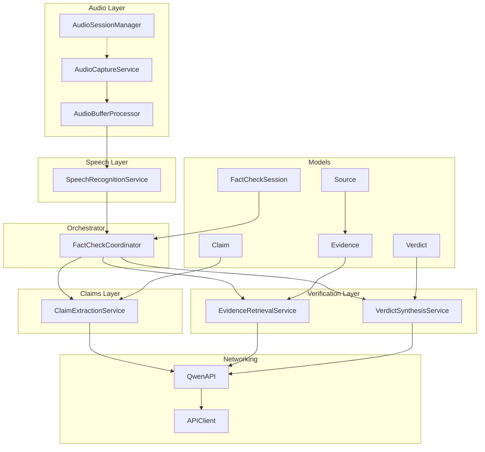
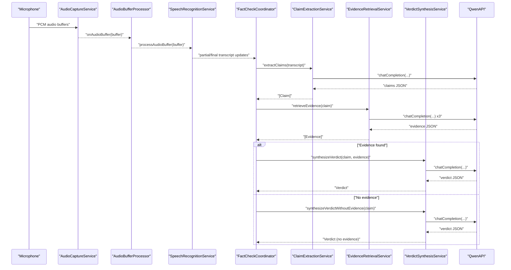
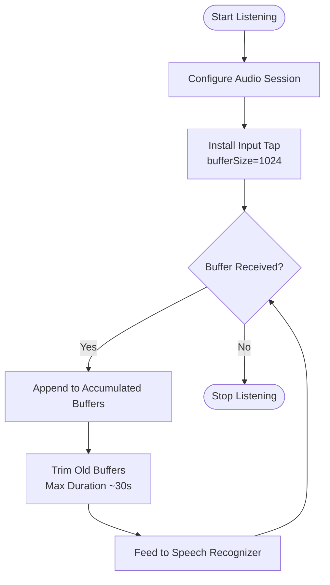
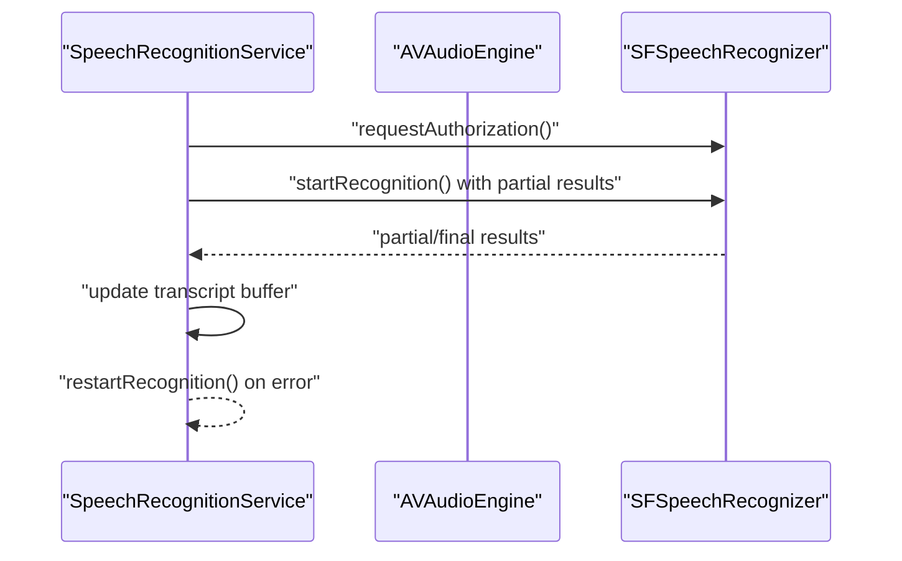
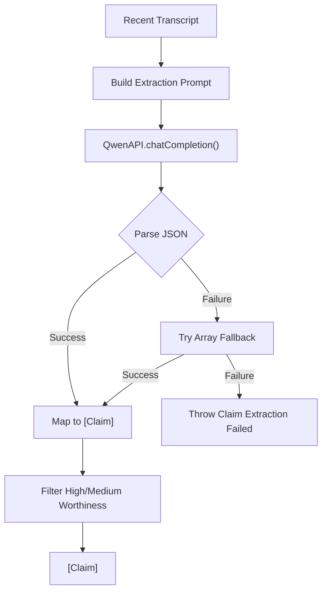
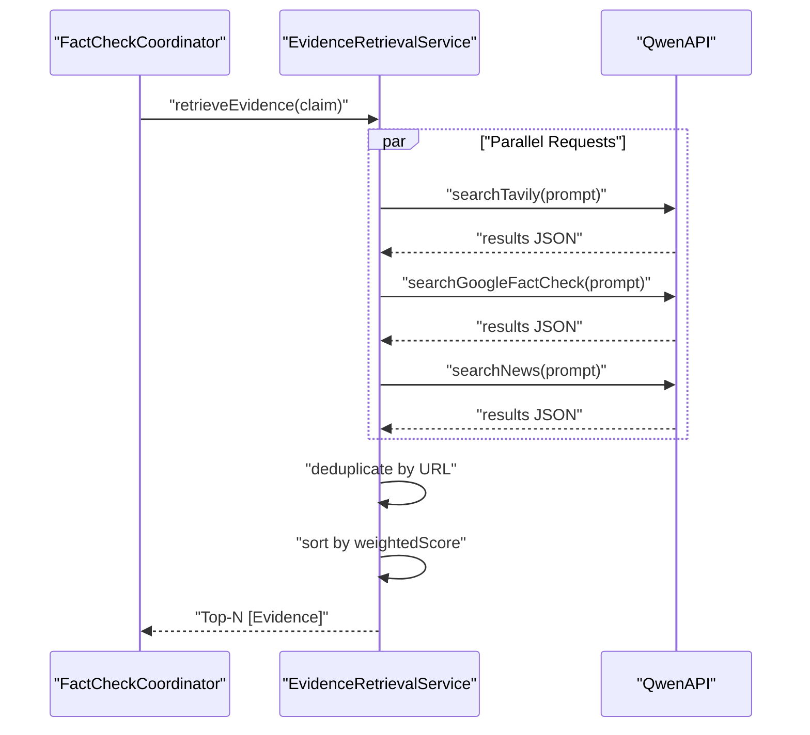
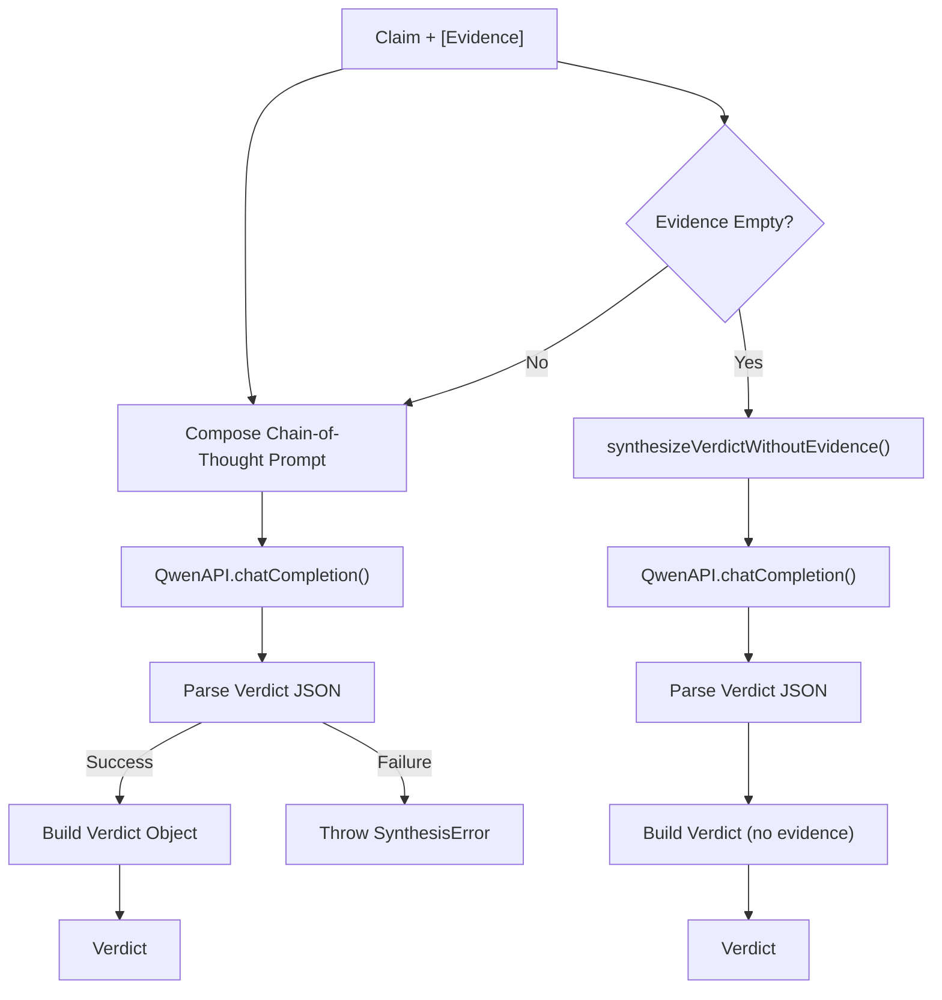
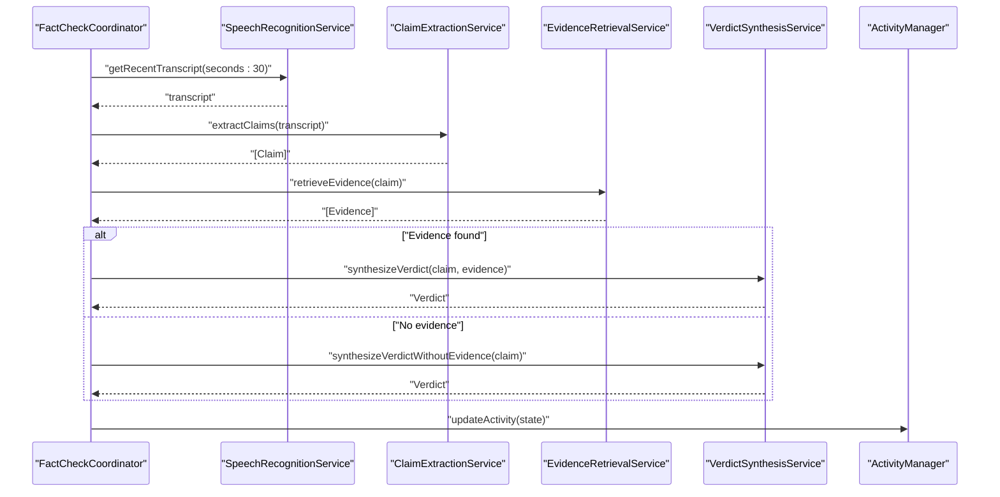
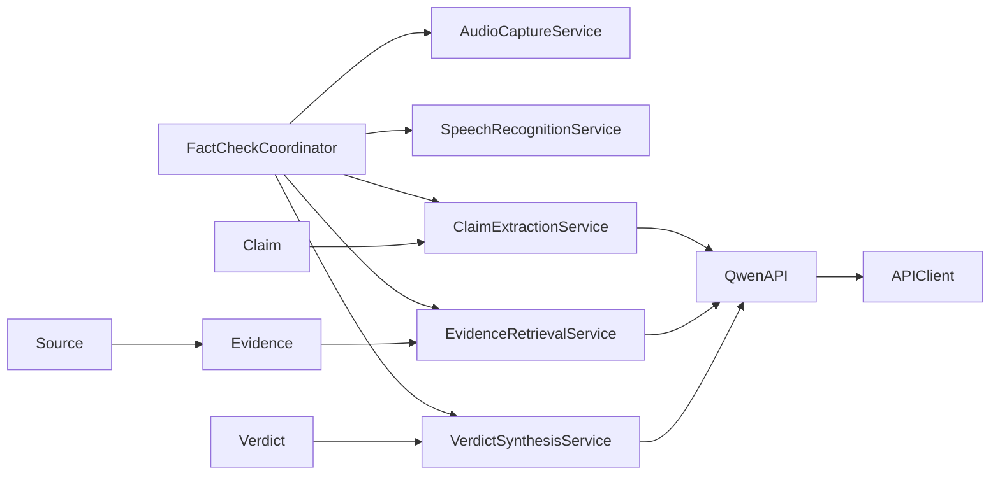

# Data Flow Architecture

<cite>
**Referenced Files in This Document**
- [AudioCaptureService.swift](file://FactShield/FactShield/Core/Audio/AudioCaptureService.swift)
- [AudioBufferProcessor.swift](file://FactShield/FactShield/Core/Audio/AudioBufferProcessor.swift)
- [AudioSessionManager.swift](file://FactShield/FactShield/Core/Audio/AudioSessionManager.swift)
- [SpeechRecognitionService.swift](file://FactShield/FactShield/Core/Speech/SpeechRecognitionService.swift)
- [ClaimExtractionService.swift](file://FactShield/FactShield/Core/Claims/ClaimExtractionService.swift)
- [EvidenceRetrievalService.swift](file://FactShield/FactShield/Core/Verification/EvidenceRetrievalService.swift)
- [VerdictSynthesisService.swift](file://FactShield/FactShield/Core/Verification/VerdictSynthesisService.swift)
- [QwenAPI.swift](file://FactShield/FactShield/Core/Network/QwenAPI.swift)
- [APIClient.swift](file://FactShield/FactShield/Core/Network/APIClient.swift)
- [Claim.swift](file://FactShield/FactShield/Core/Claims/Claim.swift)
- [Evidence.swift](file://FactShield/FactShield/Core/Verification/Evidence.swift)
- [Verdict.swift](file://FactShield/FactShield/Core/Verification/Verdict.swift)
- [Source.swift](file://FactShield/FactShield/Models/Source.swift)
- [FactCheckSession.swift](file://FactShield/FactShield/Models/FactCheckSession.swift)
- [FactCheckCoordinator.swift](file://FactShield/FactShield/Features/FactCheck/FactCheckCoordinator.swift)
- [Constants.swift](file://FactShield/FactShield/Utilities/Constants.swift)
</cite>

## Table of Contents
1. [Introduction](#introduction)
2. [Project Structure](#project-structure)
3. [Core Components](#core-components)
4. [Architecture Overview](#architecture-overview)
5. [Detailed Component Analysis](#detailed-component-analysis)
6. [Dependency Analysis](#dependency-analysis)
7. [Performance Considerations](#performance-considerations)
8. [Troubleshooting Guide](#troubleshooting-guide)
9. [Conclusion](#conclusion)

## Introduction
This document describes the end-to-end data flow architecture for FactChecking Live, from real-time audio input through a complete fact-checking pipeline. It explains how audio buffers are captured and streamed, transformed into a continuous transcript, parsed into verifiable claims, augmented with external evidence, and culminating in a structured verdict. The document details the evolving data models (Claim, Evidence, Verdict), buffering and streaming mechanisms, error propagation and fallback strategies, and performance considerations for each stage.

## Project Structure
The system is organized around a set of focused services and models:
- Audio capture and buffering: AudioCaptureService, AudioBufferProcessor, AudioSessionManager
- Speech recognition: SpeechRecognitionService
- Claim extraction: ClaimExtractionService
- Evidence retrieval: EvidenceRetrievalService
- Verdict synthesis: VerdictSynthesisService
- Networking: QwenAPI, APIClient
- Data models: Claim, Evidence, Verdict, Source, FactCheckSession
- Orchestration: FactCheckCoordinator

**Diagram sources**
- [AudioCaptureService.swift:1-51](file://FactShield/FactShield/Core/Audio/AudioCaptureService.swift#L1-L51)
- [AudioBufferProcessor.swift:1-42](file://FactShield/FactShield/Core/Audio/AudioBufferProcessor.swift#L1-L42)
- [AudioSessionManager.swift:1-23](file://FactShield/FactShield/Core/Audio/AudioSessionManager.swift#L1-L23)
- [SpeechRecognitionService.swift:1-138](file://FactShield/FactShield/Core/Speech/SpeechRecognitionService.swift#L1-L138)
- [ClaimExtractionService.swift:1-152](file://FactShield/FactShield/Core/Claims/ClaimExtractionService.swift#L1-L152)
- [EvidenceRetrievalService.swift:1-233](file://FactShield/FactShield/Core/Verification/EvidenceRetrievalService.swift#L1-L233)
- [VerdictSynthesisService.swift:1-184](file://FactShield/FactShield/Core/Verification/VerdictSynthesisService.swift#L1-L184)
- [QwenAPI.swift:1-199](file://FactShield/FactShield/Core/Network/QwenAPI.swift#L1-L199)
- [APIClient.swift:32-74](file://FactShield/FactShield/Core/Network/APIClient.swift#L32-L74)
- [Claim.swift:1-37](file://FactShield/FactShield/Core/Claims/Claim.swift#L1-L37)
- [Evidence.swift:1-16](file://FactShield/FactShield/Core/Verification/Evidence.swift#L1-L16)
- [Verdict.swift:1-31](file://FactShield/FactShield/Core/Verification/Verdict.swift#L1-L31)
- [Source.swift:1-11](file://FactShield/FactShield/Models/Source.swift#L1-L11)
- [FactCheckSession.swift:1-54](file://FactShield/FactShield/Models/FactCheckSession.swift#L1-L54)
- [FactCheckCoordinator.swift:1-216](file://FactShield/FactShield/Features/FactCheck/FactCheckCoordinator.swift#L1-L216)

**Section sources**
- [FactCheckCoordinator.swift:1-216](file://FactShield/FactShield/Features/FactCheck/FactCheckCoordinator.swift#L1-L216)
- [Constants.swift:1-37](file://FactShield/FactShield/Utilities/Constants.swift#L1-L37)

## Core Components
- AudioCaptureService: Captures PCM audio buffers from the device’s input node and emits them asynchronously to downstream processors.
- AudioBufferProcessor: Maintains a rolling buffer of recent audio and feeds it to the speech recognizer.
- SpeechRecognitionService: Streams audio buffers to Apple’s Speech framework, maintains a rolling transcript, and exposes partial and final results.
- ClaimExtractionService: Sends recent transcript segments to a language model to extract verifiable claims with check-worthiness ratings.
- EvidenceRetrievalService: Retrieves supporting or conflicting evidence from multiple simulated providers, deduplicates, sorts, and returns top-ranked results.
- VerdictSynthesisService: Synthesizes a structured verdict from evidence using chain-of-thought prompting; falls back to model-knowledge-only synthesis when no evidence is available.
- QwenAPI and APIClient: Provide robust HTTP client wrappers with retries and timeouts for LLM and search requests.
- Data models: Claim, Evidence, Verdict, Source, and FactCheckSession define the canonical data structures and their relationships.

**Section sources**
- [AudioCaptureService.swift:1-51](file://FactShield/FactShield/Core/Audio/AudioCaptureService.swift#L1-L51)
- [AudioBufferProcessor.swift:1-42](file://FactShield/FactShield/Core/Audio/AudioBufferProcessor.swift#L1-L42)
- [SpeechRecognitionService.swift:1-138](file://FactShield/FactShield/Core/Speech/SpeechRecognitionService.swift#L1-L138)
- [ClaimExtractionService.swift:1-152](file://FactShield/FactShield/Core/Claims/ClaimExtractionService.swift#L1-L152)
- [EvidenceRetrievalService.swift:1-233](file://FactShield/FactShield/Core/Verification/EvidenceRetrievalService.swift#L1-L233)
- [VerdictSynthesisService.swift:1-184](file://FactShield/FactShield/Core/Verification/VerdictSynthesisService.swift#L1-L184)
- [QwenAPI.swift:1-199](file://FactShield/FactShield/Core/Network/QwenAPI.swift#L1-L199)
- [APIClient.swift:32-74](file://FactShield/FactShield/Core/Network/APIClient.swift#L32-L74)
- [Claim.swift:1-37](file://FactShield/FactShield/Core/Claims/Claim.swift#L1-L37)
- [Evidence.swift:1-16](file://FactShield/FactShield/Core/Verification/Evidence.swift#L1-L16)
- [Verdict.swift:1-31](file://FactShield/FactShield/Core/Verification/Verdict.swift#L1-L31)
- [Source.swift:1-11](file://FactShield/FactShield/Models/Source.swift#L1-L11)
- [FactCheckSession.swift:1-54](file://FactShield/FactShield/Models/FactCheckSession.swift#L1-L54)

## Architecture Overview
The pipeline is orchestrated by FactCheckCoordinator, which:
- Wires audio capture callbacks to the buffer processor
- Periodically extracts claims from the recent transcript
- Filters high-priority claims and retrieves evidence
- Synthesizes a verdict, falling back to model-knowledge-only when needed
- Updates live activity and tracks session state

**Diagram sources**
- [AudioCaptureService.swift:19-40](file://FactShield/FactShield/Core/Audio/AudioCaptureService.swift#L19-L40)
- [AudioBufferProcessor.swift:16-22](file://FactShield/FactShield/Core/Audio/AudioBufferProcessor.swift#L16-L22)
- [SpeechRecognitionService.swift:63-84](file://FactShield/FactShield/Core/Speech/SpeechRecognitionService.swift#L63-L84)
- [FactCheckCoordinator.swift:87-161](file://FactShield/FactShield/Features/FactCheck/FactCheckCoordinator.swift#L87-L161)
- [ClaimExtractionService.swift:18-56](file://FactShield/FactShield/Core/Claims/ClaimExtractionService.swift#L18-L56)
- [EvidenceRetrievalService.swift:16-63](file://FactShield/FactShield/Core/Verification/EvidenceRetrievalService.swift#L16-L63)
- [VerdictSynthesisService.swift:30-80](file://FactShield/FactShield/Core/Verification/VerdictSynthesisService.swift#L30-L80)
- [QwenAPI.swift:94-151](file://FactShield/FactShield/Core/Network/QwenAPI.swift#L94-L151)

## Detailed Component Analysis

### Audio Input and Streaming
- AudioCaptureService installs an AVAudioEngine tap on the input node and dispatches buffers to a dedicated queue, emitting them via a callback.
- AudioBufferProcessor accumulates recent buffers and trims older ones to maintain a bounded duration window, feeding the speech recognizer incrementally.
- AudioSessionManager configures the audio session for voice-chat mode to enable acoustic echo cancellation and appropriate routing.

**Diagram sources**
- [AudioCaptureService.swift:19-40](file://FactShield/FactShield/Core/Audio/AudioCaptureService.swift#L19-L40)
- [AudioBufferProcessor.swift:16-36](file://FactShield/FactShield/Core/Audio/AudioBufferProcessor.swift#L16-L36)
- [AudioSessionManager.swift:8-17](file://FactShield/FactShield/Core/Audio/AudioSessionManager.swift#L8-L17)

**Section sources**
- [AudioCaptureService.swift:1-51](file://FactShield/FactShield/Core/Audio/AudioCaptureService.swift#L1-L51)
- [AudioBufferProcessor.swift:1-42](file://FactShield/FactShield/Core/Audio/AudioBufferProcessor.swift#L1-L42)
- [AudioSessionManager.swift:1-23](file://FactShield/FactShield/Core/Audio/AudioSessionManager.swift#L1-L23)

### Speech Recognition and Transcript Management
- SpeechRecognitionService initializes Apple’s SFSpeechRecognizer, requests authorization, and starts a streaming recognition task with partial results enabled.
- It maintains a rolling transcript buffer capped at a word limit and exposes recent transcript windows for periodic claim extraction.
- On errors, it restarts the recognition task after a brief delay to recover from transient failures.

**Diagram sources**
- [SpeechRecognitionService.swift:23-84](file://FactShield/FactShield/Core/Speech/SpeechRecognitionService.swift#L23-L84)
- [SpeechRecognitionService.swift:103-114](file://FactShield/FactShield/Core/Speech/SpeechRecognitionService.swift#L103-L114)

**Section sources**
- [SpeechRecognitionService.swift:1-138](file://FactShield/FactShield/Core/Speech/SpeechRecognitionService.swift#L1-L138)
- [Constants.swift:19-22](file://FactShield/FactShield/Utilities/Constants.swift#L19-L22)

### Claim Extraction and Filtering
- ClaimExtractionService sends a structured prompt to QwenAPI to extract verifiable claims from the recent transcript.
- It parses the returned JSON (with optional markdown fences), maps to Claim objects, and filters to high/medium check-worthiness.
- It resets internal state when needed and logs extraction outcomes.

**Diagram sources**
- [ClaimExtractionService.swift:18-56](file://FactShield/FactShield/Core/Claims/ClaimExtractionService.swift#L18-L56)
- [ClaimExtractionService.swift:70-132](file://FactShield/FactShield/Core/Claims/ClaimExtractionService.swift#L70-L132)
- [QwenAPI.swift:94-151](file://FactShield/FactShield/Core/Network/QwenAPI.swift#L94-L151)

**Section sources**
- [ClaimExtractionService.swift:1-152](file://FactShield/FactShield/Core/Claims/ClaimExtractionService.swift#L1-L152)
- [Claim.swift:1-37](file://FactShield/FactShield/Core/Claims/Claim.swift#L1-L37)

### Evidence Retrieval and Cross-Verification
- EvidenceRetrievalService concurrently queries multiple simulated providers (Tavily, Google Fact Check, News) using QwenAPI.
- It merges results, deduplicates by URL, sorts by a weighted score (relevance × 0.6 + credibility × 0.4), and returns a capped top-N set.
- It gracefully handles provider failures by logging warnings and continuing with available results.

**Diagram sources**
- [EvidenceRetrievalService.swift:16-63](file://FactShield/FactShield/Core/Verification/EvidenceRetrievalService.swift#L16-L63)
- [EvidenceRetrievalService.swift:67-166](file://FactShield/FactShield/Core/Verification/EvidenceRetrievalService.swift#L67-L166)
- [Evidence.swift:1-16](file://FactShield/FactShield/Core/Verification/Evidence.swift#L1-L16)
- [Source.swift:1-11](file://FactShield/FactShield/Models/Source.swift#L1-L11)

**Section sources**
- [EvidenceRetrievalService.swift:1-233](file://FactShield/FactShield/Core/Verification/EvidenceRetrievalService.swift#L1-L233)
- [Evidence.swift:1-16](file://FactShield/FactShield/Core/Verification/Evidence.swift#L1-L16)
- [Source.swift:1-11](file://FactShield/FactShield/Models/Source.swift#L1-L11)
- [Constants.swift:25-26](file://FactShield/FactShield/Utilities/Constants.swift#L25-L26)

### Verdict Synthesis and Fallback
- VerdictSynthesisService composes a chain-of-thought prompt from the claim and evidence, requesting a structured JSON response.
- It validates and parses the response into a Verdict, capturing elapsed time and source metadata.
- If no evidence is available, it synthesizes a model-knowledge-only verdict with reduced confidence and logs the fallback.

**Diagram sources**
- [VerdictSynthesisService.swift:30-80](file://FactShield/FactShield/Core/Verification/VerdictSynthesisService.swift#L30-L80)
- [VerdictSynthesisService.swift:82-121](file://FactShield/FactShield/Core/Verification/VerdictSynthesisService.swift#L82-L121)
- [VerdictSynthesisService.swift:125-165](file://FactShield/FactShield/Core/Verification/VerdictSynthesisService.swift#L125-L165)
- [Verdict.swift:1-31](file://FactShield/FactShield/Core/Verification/Verdict.swift#L1-L31)

**Section sources**
- [VerdictSynthesisService.swift:1-184](file://FactShield/FactShield/Core/Verification/VerdictSynthesisService.swift#L1-L184)
- [Verdict.swift:1-31](file://FactShield/FactShield/Core/Verification/Verdict.swift#L1-L31)

### Orchestrator and Session State
- FactCheckCoordinator wires audio callbacks, periodically triggers claim extraction, and orchestrates evidence retrieval and verdict synthesis.
- It updates Live Activity with current status, claim text, verdict type, confidence, and reasoning summary.
- It tracks elapsed time and maintains session-wide transcript and history.

**Diagram sources**
- [FactCheckCoordinator.swift:87-201](file://FactShield/FactShield/Features/FactCheck/FactCheckCoordinator.swift#L87-L201)

**Section sources**
- [FactCheckCoordinator.swift:1-216](file://FactShield/FactShield/Features/FactCheck/FactCheckCoordinator.swift#L1-L216)
- [FactCheckSession.swift:1-54](file://FactShield/FactShield/Models/FactCheckSession.swift#L1-L54)

## Dependency Analysis
- FactCheckCoordinator depends on all core services and coordinates their interactions.
- ClaimExtractionService, EvidenceRetrievalService, and VerdictSynthesisService depend on QwenAPI for LLM interactions.
- QwenAPI delegates HTTP requests to APIClient, which applies retry/backoff and timeout policies.
- Data models (Claim, Evidence, Verdict, Source) are immutable and serializable, enabling safe sharing across threads and persistence.

**Diagram sources**
- [FactCheckCoordinator.swift:12-17](file://FactShield/FactShield/Features/FactCheck/FactCheckCoordinator.swift#L12-L17)
- [ClaimExtractionService.swift](file://FactShield/FactShield/Core/Claims/ClaimExtractionService.swift#L8)
- [EvidenceRetrievalService.swift](file://FactShield/FactShield/Core/Verification/EvidenceRetrievalService.swift#L9)
- [VerdictSynthesisService.swift](file://FactShield/FactShield/Core/Verification/VerdictSynthesisService.swift#L26)
- [QwenAPI.swift](file://FactShield/FactShield/Core/Network/QwenAPI.swift#L73)
- [APIClient.swift:32-74](file://FactShield/FactShield/Core/Network/APIClient.swift#L32-L74)
- [Claim.swift:1-37](file://FactShield/FactShield/Core/Claims/Claim.swift#L1-L37)
- [Evidence.swift:1-16](file://FactShield/FactShield/Core/Verification/Evidence.swift#L1-L16)
- [Verdict.swift:1-31](file://FactShield/FactShield/Core/Verification/Verdict.swift#L1-L31)
- [Source.swift:1-11](file://FactShield/FactShield/Models/Source.swift#L1-L11)

**Section sources**
- [FactCheckCoordinator.swift:1-216](file://FactShield/FactShield/Features/FactCheck/FactCheckCoordinator.swift#L1-L216)
- [QwenAPI.swift:1-199](file://FactShield/FactShield/Core/Network/QwenAPI.swift#L1-L199)
- [APIClient.swift:32-74](file://FactShield/FactShield/Core/Network/APIClient.swift#L32-L74)

## Performance Considerations
- Audio buffering
  - Buffer size and sample rate are tuned for low-latency capture; the rolling buffer caps memory usage while preserving recent audio context.
  - Consider adjusting buffer size and trimming policy based on CPU headroom and latency targets.
- Speech recognition
  - Partial results reduce perceived latency; on-device recognition is preferred when available.
  - Restart on error prevents stalls; tune restart delays to balance resilience and overhead.
- Claim extraction
  - Batch extraction intervals (every 15 seconds) balance freshness and cost; adjust based on desired responsiveness vs. API budget.
  - JSON parsing includes robust cleanup for fenced code blocks to minimize retries.
- Evidence retrieval
  - Parallel provider queries maximize throughput; deduplication and weighted scoring reduce downstream processing.
  - Cap the number of returned sources to keep synthesis tractable.
- Verdict synthesis
  - Chain-of-thought prompts increase accuracy at higher token costs; consider model selection and response format to constrain output.
  - Fallback synthesis ensures progress even without external evidence.
- Networking
  - APIClient retries with exponential backoff mitigate transient network issues; timeouts prevent hanging requests.
- UI/activity updates
  - Live Activity updates are throttled to 1 Hz to avoid excessive work; batch state changes to main actor.

[No sources needed since this section provides general guidance]

## Troubleshooting Guide
- Audio capture fails to start
  - Verify audio session configuration and permissions; confirm the engine prepares and starts without throwing.
  - Check that the input tap is installed and buffers are dispatched to the queue.
- Speech recognition not authorized or unavailable
  - Ensure authorization request completes successfully; fall back to local recognition when supported.
  - Restart recognition on error to recover from transient failures.
- Claim extraction errors
  - Inspect JSON cleaning and fallback parsing paths; log invalid encodings and decoding failures.
  - Validate API key presence and endpoint reachability.
- Evidence retrieval failures
  - Provider-specific failures are logged as warnings; ensure deduplication and sorting still produce results.
  - Confirm JSON parsing handles both object and array forms.
- Verdict synthesis errors
  - Catch invalid JSON and unsupported verdict types; prefer conservative defaults (e.g., UNVERIFIABLE).
  - Use fallback synthesis when no evidence is available.
- Networking issues
  - APIClient applies retries and timeouts; inspect HTTP status codes and error bodies for diagnostics.
  - Ensure API key is configured and reachable endpoints are used.

**Section sources**
- [AudioCaptureService.swift:33-39](file://FactShield/FactShield/Core/Audio/AudioCaptureService.swift#L33-L39)
- [SpeechRecognitionService.swift:28-39](file://FactShield/FactShield/Core/Speech/SpeechRecognitionService.swift#L28-L39)
- [SpeechRecognitionService.swift:76-80](file://FactShield/FactShield/Core/Speech/SpeechRecognitionService.swift#L76-L80)
- [ClaimExtractionService.swift:84-86](file://FactShield/FactShield/Core/Claims/ClaimExtractionService.swift#L84-L86)
- [EvidenceRetrievalService.swift:28-44](file://FactShield/FactShield/Core/Verification/EvidenceRetrievalService.swift#L28-L44)
- [VerdictSynthesisService.swift:148-150](file://FactShield/FactShield/Core/Verification/VerdictSynthesisService.swift#L148-L150)
- [APIClient.swift:57-74](file://FactShield/FactShield/Core/Network/APIClient.swift#L57-L74)
- [QwenAPI.swift:101-103](file://FactShield/FactShield/Core/Network/QwenAPI.swift#L101-L103)

## Conclusion
FactChecking Live implements a robust, streaming fact-checking pipeline that transforms real-time audio into structured verdicts. The architecture balances responsiveness with reliability through careful buffering, resilient speech recognition, modular claim extraction, parallel evidence retrieval, and deterministic verdict synthesis with fallbacks. Clear data models and orchestration ensure predictable state transitions and actionable outputs for users.