# Integration Points

<cite>
**Referenced Files in This Document**
- [FactShield.entitlements](file://FactShield/FactShield/Resources/FactShield.entitlements)
- [FactShieldBroadcast.entitlements](file://FactShield/FactShield/BroadcastExtension/FactShieldBroadcast.entitlements)
- [Info.plist (App)](file://FactShield/FactShield/Resources/Info.plist)
- [Info.plist (Broadcast Extension)](file://FactShield/FactShield/BroadcastExtension/Info.plist)
- [AudioSessionManager.swift](file://FactShield/FactShield/Core/Audio/AudioSessionManager.swift)
- [AudioCaptureService.swift](file://FactShield/FactShield/Core/Audio/AudioCaptureService.swift)
- [AudioBufferProcessor.swift](file://FactShield/FactShield/Core/Audio/AudioBufferProcessor.swift)
- [ActivityManager.swift](file://FactShield/FactShield/Widgets/ActivityManager.swift)
- [FactShieldWidget.swift](file://FactShield/FactShield/Widgets/FactShieldWidget.swift)
- [FactShieldLiveActivity.swift](file://FactShield/FactShield/Widgets/FactShieldLiveActivity.swift)
- [SampleHandler.swift](file://FactShield/FactShield/BroadcastExtension/SampleHandler.swift)
- [APIClient.swift](file://FactShield/FactShield/Core/Network/APIClient.swift)
- [QwenAPI.swift](file://FactShield/FactShield/Core/Network/QwenAPI.swift)
- [SearchAPI.swift](file://FactShield/FactShield/Core/Network/SearchAPI.swift)
- [StartFactCheckIntent.swift](file://FactShield/FactShield/Intents/StartFactCheckIntent.swift)
- [FactShieldShortcuts.swift](file://FactShield/FactShield/Intents/FactShieldShortcuts.swift)
</cite>

## Table of Contents
1. [Introduction](#introduction)
2. [Project Structure](#project-structure)
3. [Core Components](#core-components)
4. [Architecture Overview](#architecture-overview)
5. [Detailed Component Analysis](#detailed-component-analysis)
6. [Dependency Analysis](#dependency-analysis)
7. [Performance Considerations](#performance-considerations)
8. [Troubleshooting Guide](#troubleshooting-guide)
9. [Conclusion](#conclusion)
10. [Appendices](#appendices)

## Introduction
This document details the system integration points and external dependencies in FactChecking Live (FactShield). It covers Apple ecosystem integrations (AVFoundation for audio capture and processing, ActivityKit for Live Activities, WidgetKit for Dynamic Island widgets, and ReplayKit for broadcast extension), external API integrations (Qwen API for language model processing and web search providers), interprocess communication via app groups between the main app and broadcast extension, permissions and entitlements, Siri Shortcuts and App Intents integration, security and privacy considerations, and configuration and troubleshooting guidance.

## Project Structure
The integration surface spans several modules:
- Audio pipeline: AVFoundation-backed capture, buffering, and streaming to speech recognition and downstream processors.
- Live Activity and Widget: ActivityKit attributes and content state, WidgetKit Dynamic Island rendering.
- Broadcast Extension: ReplayKit sample handler writing audio samples to a shared container.
- Network stack: Unified APIClient with retry/backoff, Qwen API client, and pluggable search providers.
- Siri Shortcuts: App Intents intents and App Shortcuts provider.

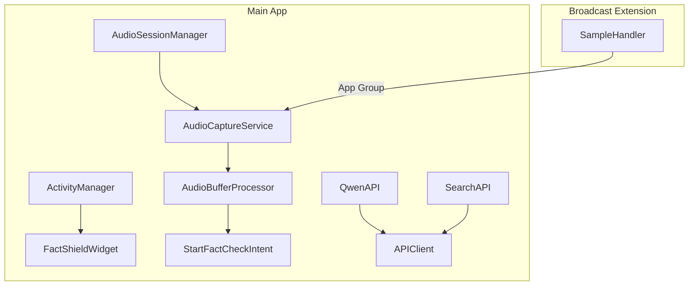

**Diagram sources**
- [AudioSessionManager.swift:1-23](file://FactShield/FactShield/Core/Audio/AudioSessionManager.swift#L1-L23)
- [AudioCaptureService.swift:1-51](file://FactShield/FactShield/Core/Audio/AudioCaptureService.swift#L1-L51)
- [AudioBufferProcessor.swift:1-42](file://FactShield/FactShield/Core/Audio/AudioBufferProcessor.swift#L1-L42)
- [ActivityManager.swift:1-87](file://FactShield/FactShield/Widgets/ActivityManager.swift#L1-L87)
- [FactShieldWidget.swift:1-218](file://FactShield/FactShield/Widgets/FactShieldWidget.swift#L1-L218)
- [SampleHandler.swift:1-85](file://FactShield/FactShield/BroadcastExtension/SampleHandler.swift#L1-L85)
- [APIClient.swift:1-234](file://FactShield/FactShield/Core/Network/APIClient.swift#L1-L234)
- [QwenAPI.swift:1-199](file://FactShield/FactShield/Core/Network/QwenAPI.swift#L1-L199)
- [SearchAPI.swift:1-165](file://FactShield/FactShield/Core/Network/SearchAPI.swift#L1-L165)

**Section sources**
- [AudioSessionManager.swift:1-23](file://FactShield/FactShield/Core/Audio/AudioSessionManager.swift#L1-L23)
- [AudioCaptureService.swift:1-51](file://FactShield/FactShield/Core/Audio/AudioCaptureService.swift#L1-L51)
- [AudioBufferProcessor.swift:1-42](file://FactShield/FactShield/Core/Audio/AudioBufferProcessor.swift#L1-L42)
- [ActivityManager.swift:1-87](file://FactShield/FactShield/Widgets/ActivityManager.swift#L1-L87)
- [FactShieldWidget.swift:1-218](file://FactShield/FactShield/Widgets/FactShieldWidget.swift#L1-L218)
- [SampleHandler.swift:1-85](file://FactShield/FactShield/BroadcastExtension/SampleHandler.swift#L1-L85)
- [APIClient.swift:1-234](file://FactShield/FactShield/Core/Network/APIClient.swift#L1-L234)
- [QwenAPI.swift:1-199](file://FactShield/FactShield/Core/Network/QwenAPI.swift#L1-L199)
- [SearchAPI.swift:1-165](file://FactShield/FactShield/Core/Network/SearchAPI.swift#L1-L165)

## Core Components
- Audio subsystem: Configures AVAudioSession, runs AVAudioEngine taps, and streams PCM buffers to speech recognition and processors.
- Live Activity and Widget: Defines Activity attributes and content state, starts/updates/end Live Activities, and renders Dynamic Island views.
- Broadcast Extension: Receives ReplayKit audio samples, writes raw audio to a shared container, and communicates broadcast state via UserDefaults in the app group.
- Network stack: Centralized APIClient with exponential backoff and robust error handling; Qwen API client; pluggable search providers (Tavily, Google Fact Check Tools).
- Siri Shortcuts: App Intents to start/stop fact-checking sessions without opening the app, backed by ActivityKit and audio capture.

**Section sources**
- [AudioSessionManager.swift:1-23](file://FactShield/FactShield/Core/Audio/AudioSessionManager.swift#L1-L23)
- [AudioCaptureService.swift:1-51](file://FactShield/FactShield/Core/Audio/AudioCaptureService.swift#L1-L51)
- [AudioBufferProcessor.swift:1-42](file://FactShield/FactShield/Core/Audio/AudioBufferProcessor.swift#L1-L42)
- [ActivityManager.swift:1-87](file://FactShield/FactShield/Widgets/ActivityManager.swift#L1-L87)
- [FactShieldWidget.swift:1-218](file://FactShield/FactShield/Widgets/FactShieldWidget.swift#L1-L218)
- [SampleHandler.swift:1-85](file://FactShield/FactShield/BroadcastExtension/SampleHandler.swift#L1-L85)
- [APIClient.swift:1-234](file://FactShield/FactShield/Core/Network/APIClient.swift#L1-L234)
- [QwenAPI.swift:1-199](file://FactShield/FactShield/Core/Network/QwenAPI.swift#L1-L199)
- [SearchAPI.swift:1-165](file://FactShield/FactShield/Core/Network/SearchAPI.swift#L1-L165)
- [StartFactCheckIntent.swift:1-29](file://FactShield/FactShield/Intents/StartFactCheckIntent.swift#L1-L29)
- [FactShieldShortcuts.swift:1-27](file://FactShield/FactShield/Intents/FactShieldShortcuts.swift#L1-L27)

## Architecture Overview
The system integrates Apple’s frameworks for real-time audio capture and live UI, and external APIs for language understanding and web search. The broadcast extension extends the main app to capture system audio and write it to a shared location for later processing. Siri Shortcuts trigger the end-to-end pipeline without launching the app.

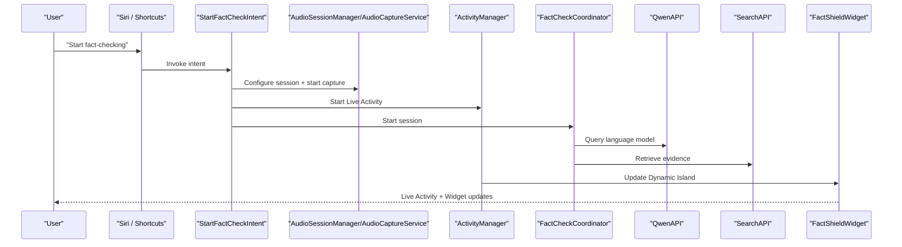

**Diagram sources**
- [StartFactCheckIntent.swift:1-29](file://FactShield/FactShield/Intents/StartFactCheckIntent.swift#L1-L29)
- [AudioSessionManager.swift:1-23](file://FactShield/FactShield/Core/Audio/AudioSessionManager.swift#L1-L23)
- [AudioCaptureService.swift:1-51](file://FactShield/FactShield/Core/Audio/AudioCaptureService.swift#L1-L51)
- [ActivityManager.swift:1-87](file://FactShield/FactShield/Widgets/ActivityManager.swift#L1-L87)
- [QwenAPI.swift:1-199](file://FactShield/FactShield/Core/Network/QwenAPI.swift#L1-L199)
- [SearchAPI.swift:1-165](file://FactShield/FactShield/Core/Network/SearchAPI.swift#L1-L165)
- [FactShieldWidget.swift:1-218](file://FactShield/FactShield/Widgets/FactShieldWidget.swift#L1-L218)

## Detailed Component Analysis

### Apple Ecosystem Integrations

#### AVFoundation Audio Pipeline
- Audio session configuration sets up a voice-chat mode suitable for capture and enables automatic echo cancellation.
- An AVAudioEngine tap captures PCM buffers at a fixed size and forwards them asynchronously to registered callbacks.
- A rolling buffer accumulates recent PCM buffers for speech recognition while enforcing a maximum duration and size limit.

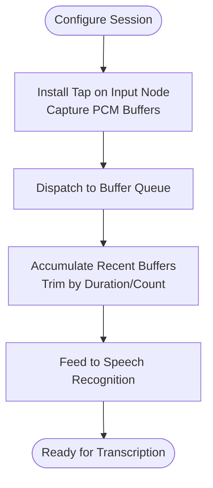

**Diagram sources**
- [AudioSessionManager.swift:8-17](file://FactShield/FactShield/Core/Audio/AudioSessionManager.swift#L8-L17)
- [AudioCaptureService.swift:19-40](file://FactShield/FactShield/Core/Audio/AudioCaptureService.swift#L19-L40)
- [AudioBufferProcessor.swift:16-36](file://FactShield/FactShield/Core/Audio/AudioBufferProcessor.swift#L16-L36)

**Section sources**
- [AudioSessionManager.swift:1-23](file://FactShield/FactShield/Core/Audio/AudioSessionManager.swift#L1-L23)
- [AudioCaptureService.swift:1-51](file://FactShield/FactShield/Core/Audio/AudioCaptureService.swift#L1-L51)
- [AudioBufferProcessor.swift:1-42](file://FactShield/FactShield/Core/Audio/AudioBufferProcessor.swift#L1-L42)

#### ActivityKit Live Activities
- Defines attributes and content state for verification status, verdict, confidence, sources, reasoning summary, claim text, elapsed time, and timestamps.
- Starts a Live Activity with push token support, updates content dynamically, and ends the activity with immediate dismissal policy.
- Provides error handling when Live Activities are disabled or conflicts arise.

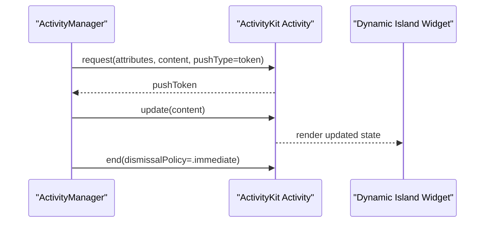

**Diagram sources**
- [ActivityManager.swift:16-67](file://FactShield/FactShield/Widgets/ActivityManager.swift#L16-L67)
- [FactShieldLiveActivity.swift:5-43](file://FactShield/FactShield/Widgets/FactShieldLiveActivity.swift#L5-L43)
- [FactShieldWidget.swift:5-33](file://FactShield/FactShield/Widgets/FactShieldWidget.swift#L5-L33)

**Section sources**
- [ActivityManager.swift:1-87](file://FactShield/FactShield/Widgets/ActivityManager.swift#L1-L87)
- [FactShieldLiveActivity.swift:1-44](file://FactShield/FactShield/Widgets/FactShieldLiveActivity.swift#L1-L44)
- [FactShieldWidget.swift:1-218](file://FactShield/FactShield/Widgets/FactShieldWidget.swift#L1-L218)

#### WidgetKit Dynamic Island
- Renders lock-screen and expanded layouts for the Live Activity, including compact and minimal variants.
- Uses color-coded verdict badges and status indicators aligned with verification stages.

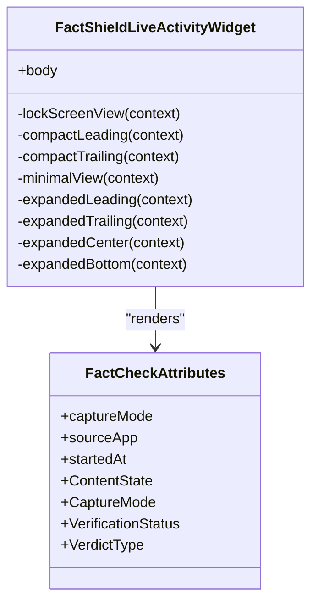

**Diagram sources**
- [FactShieldWidget.swift:5-218](file://FactShield/FactShield/Widgets/FactShieldWidget.swift#L5-L218)
- [FactShieldLiveActivity.swift:5-43](file://FactShield/FactShield/Widgets/FactShieldLiveActivity.swift#L5-L43)

**Section sources**
- [FactShieldWidget.swift:1-218](file://FactShield/FactShield/Widgets/FactShieldWidget.swift#L1-L218)
- [FactShieldLiveActivity.swift:1-44](file://FactShield/FactShield/Widgets/FactShieldLiveActivity.swift#L1-L44)

#### ReplayKit Broadcast Extension
- Implements a sample handler that receives audio samples from the system during broadcasts.
- Writes raw audio data to a shared container under the app group identifier.
- Updates UserDefaults in the app group to signal broadcast state transitions to the main app.

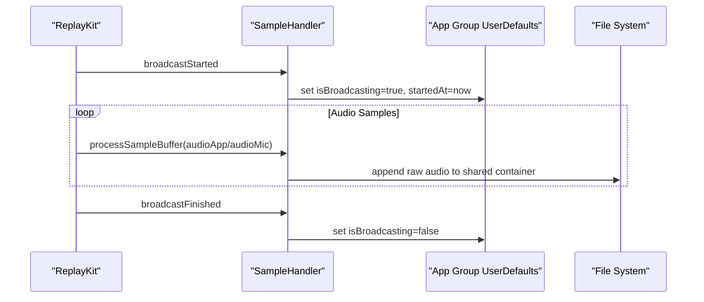

**Diagram sources**
- [SampleHandler.swift:10-34](file://FactShield/FactShield/BroadcastExtension/SampleHandler.swift#L10-L34)
- [SampleHandler.swift:57-83](file://FactShield/FactShield/BroadcastExtension/SampleHandler.swift#L57-L83)

**Section sources**
- [SampleHandler.swift:1-85](file://FactShield/FactShield/BroadcastExtension/SampleHandler.swift#L1-L85)
- [Info.plist (Broadcast Extension):1-16](file://FactShield/FactShield/BroadcastExtension/Info.plist#L1-L16)

### External API Integrations

#### Qwen API
- Encodes chat requests with model, messages, temperature, max tokens, and optional response format.
- Authenticates via Authorization header using an API key loaded from environment or user defaults.
- Delegates HTTP transport to APIClient with retries and exponential backoff.
- Emits usage metrics and logs request details.

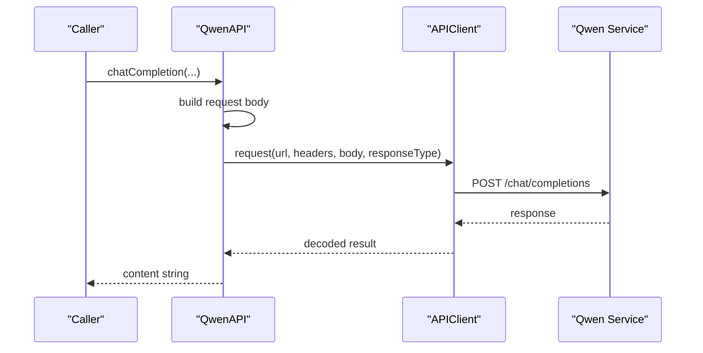

**Diagram sources**
- [QwenAPI.swift:94-151](file://FactShield/FactShield/Core/Network/QwenAPI.swift#L94-L151)
- [APIClient.swift:51-103](file://FactShield/FactShield/Core/Network/APIClient.swift#L51-L103)

**Section sources**
- [QwenAPI.swift:1-199](file://FactShield/FactShield/Core/Network/QwenAPI.swift#L1-L199)
- [APIClient.swift:1-234](file://FactShield/FactShield/Core/Network/APIClient.swift#L1-L234)

#### Web Search APIs
- Tavily provider: Sends POST to https://api.tavily.com/search with API key, query, depth, and result count; parses structured results.
- Google Fact Check Tools provider: GETs https://factchecktools.googleapis.com/v1alpha1/claims:search with query and API key; maps to generic search results.

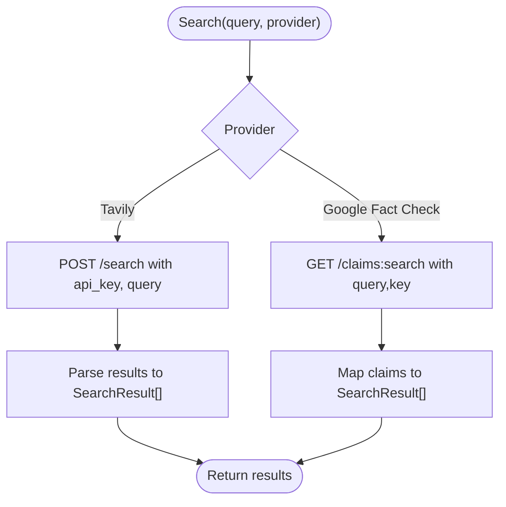

**Diagram sources**
- [SearchAPI.swift:45-104](file://FactShield/FactShield/Core/Network/SearchAPI.swift#L45-L104)
- [SearchAPI.swift:117-163](file://FactShield/FactShield/Core/Network/SearchAPI.swift#L117-L163)

**Section sources**
- [SearchAPI.swift:1-165](file://FactShield/FactShield/Core/Network/SearchAPI.swift#L1-L165)

### App Group Communication (Main App ↔ Broadcast Extension)
- Both the main app and broadcast extension declare the same application group identifier in their entitlements.
- The broadcast extension writes broadcast state and raw audio to the shared container and UserDefaults under the app group.
- The main app reads these signals to coordinate UI and processing.

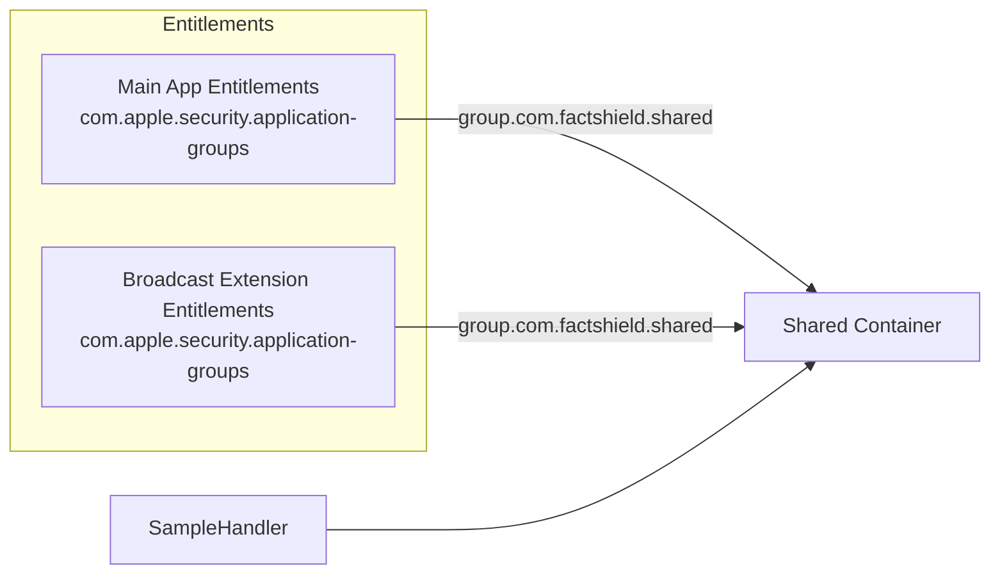

**Diagram sources**
- [FactShield.entitlements:5-8](file://FactShield/FactShield/Resources/FactShield.entitlements#L5-L8)
- [FactShieldBroadcast.entitlements:5-8](file://FactShield/FactShield/BroadcastExtension/FactShieldBroadcast.entitlements#L5-L8)
- [SampleHandler.swift:7-17](file://FactShield/FactShield/BroadcastExtension/SampleHandler.swift#L7-L17)

**Section sources**
- [FactShield.entitlements:1-11](file://FactShield/FactShield/Resources/FactShield.entitlements#L1-L11)
- [FactShieldBroadcast.entitlements:1-11](file://FactShield/FactShield/BroadcastExtension/FactShieldBroadcast.entitlements#L1-L11)
- [SampleHandler.swift:1-85](file://FactShield/FactShield/BroadcastExtension/SampleHandler.swift#L1-L85)

### Siri Shortcuts and App Intents
- App Shortcuts define “Start fact-checking” and “Stop fact-checking” shortcuts with natural language phrases and icons.
- StartFactCheckIntent performs audio session configuration, starts capture and speech recognition, initiates Live Activity, and launches the fact-checking pipeline without opening the app.

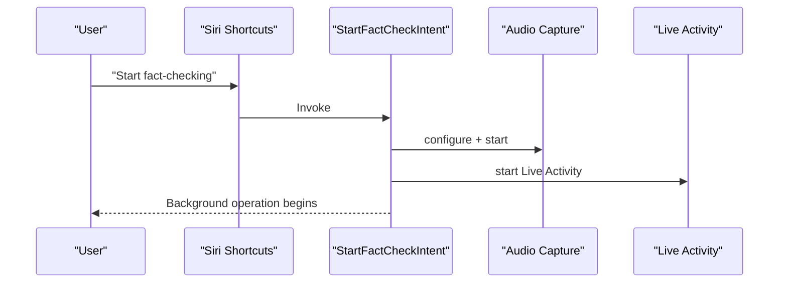

**Diagram sources**
- [FactShieldShortcuts.swift:3-26](file://FactShield/FactShield/Intents/FactShieldShortcuts.swift#L3-L26)
- [StartFactCheckIntent.swift:10-27](file://FactShield/FactShield/Intents/StartFactCheckIntent.swift#L10-L27)

**Section sources**
- [FactShieldShortcuts.swift:1-27](file://FactShield/FactShield/Intents/FactShieldShortcuts.swift#L1-L27)
- [StartFactCheckIntent.swift:1-29](file://FactShield/FactShield/Intents/StartFactCheckIntent.swift#L1-L29)
- [Info.plist (App):11-15](file://FactShield/FactShield/Resources/Info.plist#L11-L15)

### Permissions and Entitlements
- Microphone and speech recognition usage descriptions are declared in the app Info.plist.
- Background modes include audio, fetch, and remote-notification.
- Application group entitlements are present in both main app and broadcast extension entitlements.

**Section sources**
- [Info.plist (App):5-22](file://FactShield/FactShield/Resources/Info.plist#L5-L22)
- [FactShield.entitlements:1-11](file://FactShield/FactShield/Resources/FactShield.entitlements#L1-L11)
- [FactShieldBroadcast.entitlements:1-11](file://FactShield/FactShield/BroadcastExtension/FactShieldBroadcast.entitlements#L1-L11)

## Dependency Analysis
- Audio pipeline depends on AVFoundation and Speech frameworks; integrates with ActivityKit for live UI.
- Network layer depends on Foundation and OSLog; QwenAPI and SearchAPI depend on APIClient.
- Broadcast extension depends on ReplayKit and shares data via the app group.
- Siri Shortcuts depend on AppIntents and trigger the audio and Live Activity lifecycle.

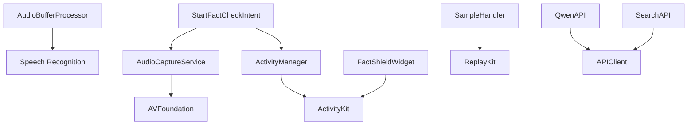

**Diagram sources**
- [AudioCaptureService.swift:1-51](file://FactShield/FactShield/Core/Audio/AudioCaptureService.swift#L1-L51)
- [AudioBufferProcessor.swift:1-42](file://FactShield/FactShield/Core/Audio/AudioBufferProcessor.swift#L1-L42)
- [ActivityManager.swift:1-87](file://FactShield/FactShield/Widgets/ActivityManager.swift#L1-L87)
- [FactShieldWidget.swift:1-218](file://FactShield/FactShield/Widgets/FactShieldWidget.swift#L1-L218)
- [SampleHandler.swift:1-85](file://FactShield/FactShield/BroadcastExtension/SampleHandler.swift#L1-L85)
- [QwenAPI.swift:1-199](file://FactShield/FactShield/Core/Network/QwenAPI.swift#L1-L199)
- [SearchAPI.swift:1-165](file://FactShield/FactShield/Core/Network/SearchAPI.swift#L1-L165)
- [StartFactCheckIntent.swift:1-29](file://FactShield/FactShield/Intents/StartFactCheckIntent.swift#L1-L29)

**Section sources**
- [AudioCaptureService.swift:1-51](file://FactShield/FactShield/Core/Audio/AudioCaptureService.swift#L1-L51)
- [AudioBufferProcessor.swift:1-42](file://FactShield/FactShield/Core/Audio/AudioBufferProcessor.swift#L1-L42)
- [ActivityManager.swift:1-87](file://FactShield/FactShield/Widgets/ActivityManager.swift#L1-L87)
- [FactShieldWidget.swift:1-218](file://FactShield/FactShield/Widgets/FactShieldWidget.swift#L1-L218)
- [SampleHandler.swift:1-85](file://FactShield/FactShield/BroadcastExtension/SampleHandler.swift#L1-L85)
- [QwenAPI.swift:1-199](file://FactShield/FactShield/Core/Network/QwenAPI.swift#L1-L199)
- [SearchAPI.swift:1-165](file://FactShield/FactShield/Core/Network/SearchAPI.swift#L1-L165)
- [StartFactCheckIntent.swift:1-29](file://FactShield/FactShield/Intents/StartFactCheckIntent.swift#L1-L29)

## Performance Considerations
- Audio capture uses a dedicated queue for buffer dispatch to maintain responsiveness.
- Rolling buffer trimming prevents unbounded memory growth during continuous capture.
- APIClient applies exponential backoff and waits for connectivity to reduce load and improve reliability.
- Widget updates are asynchronous and rely on ActivityKit push tokens for timely refresh.

[No sources needed since this section provides general guidance]

## Troubleshooting Guide
- Live Activities disabled: Starting a Live Activity throws a specific error when activities are not enabled on the device.
- No API keys configured: QwenAPI and SearchAPI clients check for presence of API keys and return appropriate errors; ensure environment variables or user defaults are set.
- Rate limiting and server errors: APIClient retries on 5xx and rate-limited responses with exponential backoff; inspect logs for retry delays.
- Broadcast audio missing: Verify app group entitlements match in main app and extension, and that the shared container path exists and is writable.
- Microphone access denied: Confirm NSMicrophoneUsageDescription and NSSpeechRecognitionUsageDescription are present in Info.plist.

**Section sources**
- [ActivityManager.swift:70-80](file://FactShield/FactShield/Widgets/ActivityManager.swift#L70-L80)
- [QwenAPI.swift:101-103](file://FactShield/FactShield/Core/Network/QwenAPI.swift#L101-L103)
- [SearchAPI.swift:46-49](file://FactShield/FactShield/Core/Network/SearchAPI.swift#L46-L49)
- [APIClient.swift:74-91](file://FactShield/FactShield/Core/Network/APIClient.swift#L74-L91)
- [SampleHandler.swift:66-83](file://FactShield/FactShield/BroadcastExtension/SampleHandler.swift#L66-L83)
- [Info.plist (App):5-9](file://FactShield/FactShield/Resources/Info.plist#L5-L9)

## Conclusion
FactChecking Live integrates tightly with Apple’s media and live UI frameworks to deliver a responsive, observable fact-checking experience, while leveraging external language and search APIs for intelligent processing. The broadcast extension extends functionality to capture system audio via ReplayKit, and Siri Shortcuts enable hands-free initiation. Robust error handling, app group coordination, and explicit permissions ensure reliable operation across contexts.

[No sources needed since this section summarizes without analyzing specific files]

## Appendices

### Configuration Examples
- App group entitlements:
  - Main app and broadcast extension must declare the same application group identifier.
  - Example key/value in entitlements: com.apple.security.application-groups with array containing the group string.
- API keys:
  - Qwen API key can be provided via environment variable or user defaults.
  - Search providers require their respective API keys configured similarly.
- Info.plist entries:
  - NSMicrophoneUsageDescription and NSSpeechRecognitionUsageDescription for audio capture and transcription.
  - NSUserActivityTypes for App Intents identifiers.
  - UIBackgroundModes for audio, fetch, and remote notifications.

**Section sources**
- [FactShield.entitlements:5-8](file://FactShield/FactShield/Resources/FactShield.entitlements#L5-L8)
- [FactShieldBroadcast.entitlements:5-8](file://FactShield/FactShield/BroadcastExtension/FactShieldBroadcast.entitlements#L5-L8)
- [QwenAPI.swift:76-82](file://FactShield/FactShield/Core/Network/QwenAPI.swift#L76-L82)
- [SearchAPI.swift:40-43](file://FactShield/FactShield/Core/Network/SearchAPI.swift#L40-L43)
- [Info.plist (App):5-22](file://FactShield/FactShield/Resources/Info.plist#L5-L22)