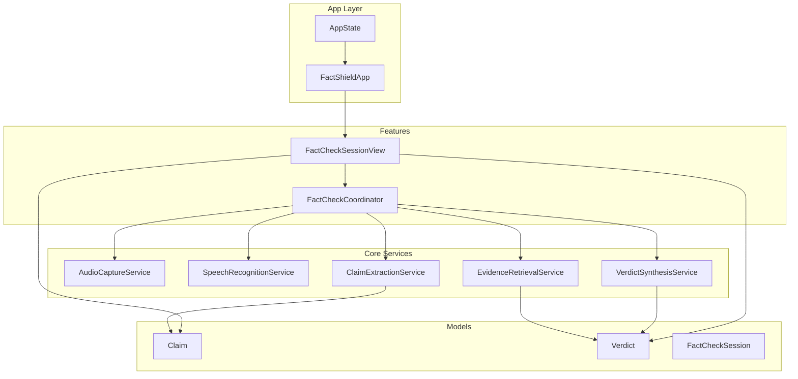
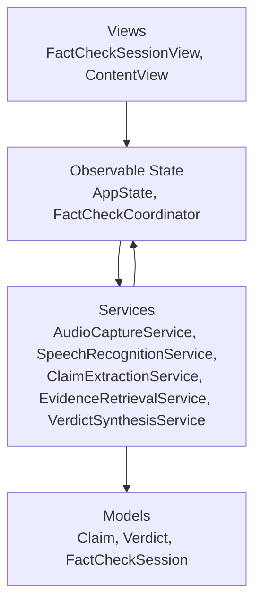
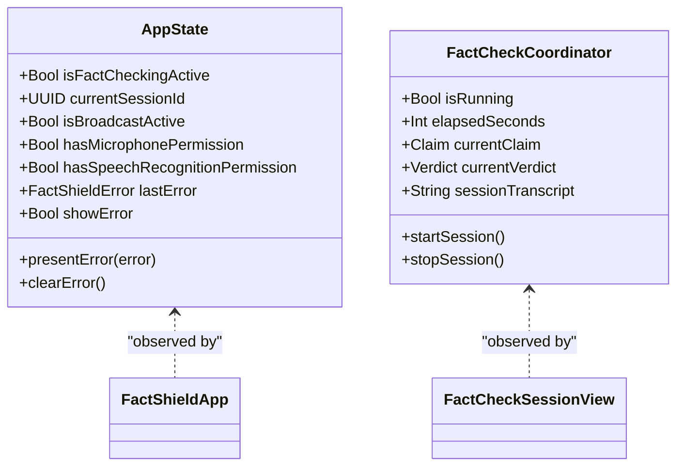
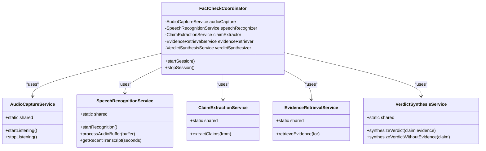
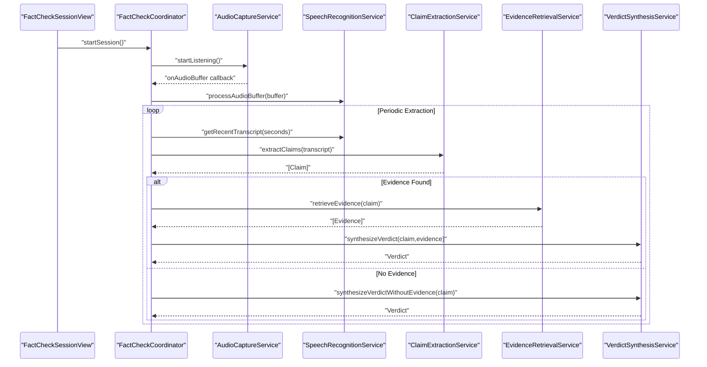
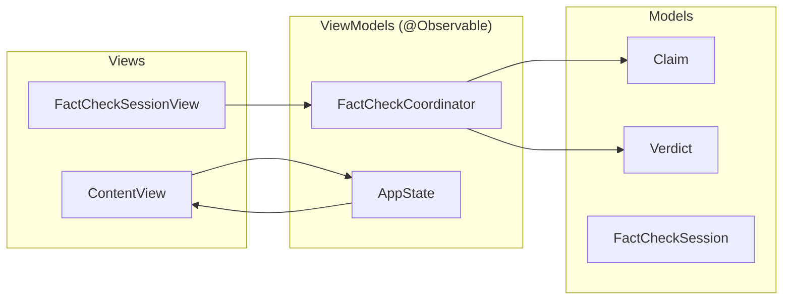
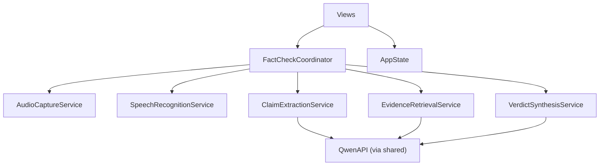

# System Design Patterns

<cite>
**Referenced Files in This Document**
- [AppState.swift](file://FactShield/FactShield/App/AppState.swift)
- [FactShieldApp.swift](file://FactShield/FactShield/App/FactShieldApp.swift)
- [FactCheckCoordinator.swift](file://FactShield/FactShield/Features/FactCheck/FactCheckCoordinator.swift)
- [FactCheckSessionView.swift](file://FactShield/FactShield/Features/FactCheck/FactCheckSessionView.swift)
- [AudioCaptureService.swift](file://FactShield/FactShield/Core/Audio/AudioCaptureService.swift)
- [SpeechRecognitionService.swift](file://FactShield/FactShield/Core/Speech/SpeechRecognitionService.swift)
- [ClaimExtractionService.swift](file://FactShield/FactShield/Core/Claims/ClaimExtractionService.swift)
- [EvidenceRetrievalService.swift](file://FactShield/FactShield/Core/Verification/EvidenceRetrievalService.swift)
- [VerdictSynthesisService.swift](file://FactShield/FactShield/Core/Verification/VerdictSynthesisService.swift)
- [Claim.swift](file://FactShield/FactShield/Core/Claims/Claim.swift)
- [Verdict.swift](file://FactShield/FactShield/Core/Verification/Verdict.swift)
- [FactCheckSession.swift](file://FactShield/FactShield/Models/FactCheckSession.swift)
- [Constants.swift](file://FactShield/FactShield/Utilities/Constants.swift)
</cite>

## Table of Contents
1. [Introduction](#introduction)
2. [Project Structure](#project-structure)
3. [Core Components](#core-components)
4. [Architecture Overview](#architecture-overview)
5. [Detailed Component Analysis](#detailed-component-analysis)
6. [Dependency Analysis](#dependency-analysis)
7. [Performance Considerations](#performance-considerations)
8. [Troubleshooting Guide](#troubleshooting-guide)
9. [Conclusion](#conclusion)

## Introduction
This document explains the architectural design patterns used in FactChecking Live, focusing on:
- Observer pattern for state management via @Observable and AppState
- Service locator pattern for dependency injection using shared singletons
- Pipeline pattern for sequential processing from audio capture through verdict synthesis
- MVVM-inspired architecture separating views, view models, and data models

We provide concrete examples from the codebase, including the FactCheckCoordinator as the central orchestrator and the role of singleton patterns for service management. We also discuss the benefits and trade-offs of each pattern choice.

## Project Structure
The project follows a feature-centric layout with clear separation of concerns:
- App layer: global state and app lifecycle
- Features: feature-specific UI and orchestration
- Core: domain services and models
- Models: data transfer and persistence models
- Utilities: constants and helpers

**Diagram sources**
- [FactShieldApp.swift:1-127](file://FactShield/FactShield/App/FactShieldApp.swift#L1-L127)
- [FactCheckCoordinator.swift:1-216](file://FactShield/FactShield/Features/FactCheck/FactCheckCoordinator.swift#L1-L216)
- [FactCheckSessionView.swift:1-506](file://FactShield/FactShield/Features/FactCheck/FactCheckSessionView.swift#L1-L506)
- [AudioCaptureService.swift:1-51](file://FactShield/FactShield/Core/Audio/AudioCaptureService.swift#L1-L51)
- [SpeechRecognitionService.swift:1-138](file://FactShield/FactShield/Core/Speech/SpeechRecognitionService.swift#L1-L138)
- [ClaimExtractionService.swift:1-152](file://FactShield/FactShield/Core/Claims/ClaimExtractionService.swift#L1-L152)
- [EvidenceRetrievalService.swift:1-233](file://FactShield/FactShield/Core/Verification/EvidenceRetrievalService.swift#L1-L233)
- [VerdictSynthesisService.swift:1-184](file://FactShield/FactShield/Core/Verification/VerdictSynthesisService.swift#L1-L184)
- [Claim.swift:1-37](file://FactShield/FactShield/Core/Claims/Claim.swift#L1-L37)
- [Verdict.swift:1-31](file://FactShield/FactShield/Core/Verification/Verdict.swift#L1-L31)
- [FactCheckSession.swift:1-54](file://FactShield/FactShield/Models/FactCheckSession.swift#L1-L54)

**Section sources**
- [FactShieldApp.swift:1-127](file://FactShield/FactShield/App/FactShieldApp.swift#L1-L127)
- [FactCheckCoordinator.swift:1-216](file://FactShield/FactShield/Features/FactCheck/FactCheckCoordinator.swift#L1-L216)
- [FactCheckSessionView.swift:1-506](file://FactShield/FactShield/Features/FactCheck/FactCheckSessionView.swift#L1-L506)

## Core Components
- AppState: Global observable state container with shared singleton, exposing flags for permissions, errors, and UI state.
- FactCheckCoordinator: Central orchestrator coordinating audio capture, speech recognition, claim extraction, evidence retrieval, and verdict synthesis.
- Core Services: Singleton services implementing specialized responsibilities (audio capture, speech recognition, claim extraction, evidence retrieval, verdict synthesis).
- Data Models: Immutable structs representing Claim, Verdict, and FactCheckSession.

Benefits and trade-offs:
- @Observable and AppState enable reactive UI updates with minimal boilerplate but require disciplined mutation patterns to avoid unexpected re-renders.
- Shared singletons simplify service access and reduce constructor complexity but can complicate testing and introduce hidden coupling.

**Section sources**
- [AppState.swift:1-30](file://FactShield/FactShield/App/AppState.swift#L1-L30)
- [FactCheckCoordinator.swift:1-216](file://FactShield/FactShield/Features/FactCheck/FactCheckCoordinator.swift#L1-L216)
- [AudioCaptureService.swift:1-51](file://FactShield/FactShield/Core/Audio/AudioCaptureService.swift#L1-L51)
- [SpeechRecognitionService.swift:1-138](file://FactShield/FactShield/Core/Speech/SpeechRecognitionService.swift#L1-L138)
- [ClaimExtractionService.swift:1-152](file://FactShield/FactShield/Core/Claims/ClaimExtractionService.swift#L1-L152)
- [EvidenceRetrievalService.swift:1-233](file://FactShield/FactShield/Core/Verification/EvidenceRetrievalService.swift#L1-L233)
- [VerdictSynthesisService.swift:1-184](file://FactShield/FactShield/Core/Verification/VerdictSynthesisService.swift#L1-L184)
- [Claim.swift:1-37](file://FactShield/FactShield/Core/Claims/Claim.swift#L1-L37)
- [Verdict.swift:1-31](file://FactShield/FactShield/Core/Verification/Verdict.swift#L1-L31)
- [FactCheckSession.swift:1-54](file://FactShield/FactShield/Models/FactCheckSession.swift#L1-L54)

## Architecture Overview
The system uses an MVVM-inspired architecture:
- Views observe state from FactCheckCoordinator and AppState
- View models are implicit through @Observable state holders
- Data models encapsulate immutable domain data

**Diagram sources**
- [FactShieldApp.swift:1-127](file://FactShield/FactShield/App/FactShieldApp.swift#L1-L127)
- [FactCheckSessionView.swift:1-506](file://FactShield/FactShield/Features/FactCheck/FactCheckSessionView.swift#L1-L506)
- [FactCheckCoordinator.swift:1-216](file://FactShield/FactShield/Features/FactCheck/FactCheckCoordinator.swift#L1-L216)
- [AudioCaptureService.swift:1-51](file://FactShield/FactShield/Core/Audio/AudioCaptureService.swift#L1-L51)
- [SpeechRecognitionService.swift:1-138](file://FactShield/FactShield/Core/Speech/SpeechRecognitionService.swift#L1-L138)
- [ClaimExtractionService.swift:1-152](file://FactShield/FactShield/Core/Claims/ClaimExtractionService.swift#L1-L152)
- [EvidenceRetrievalService.swift:1-233](file://FactShield/FactShield/Core/Verification/EvidenceRetrievalService.swift#L1-L233)
- [VerdictSynthesisService.swift:1-184](file://FactShield/FactShield/Core/Verification/VerdictSynthesisService.swift#L1-L184)
- [Claim.swift:1-37](file://FactShield/FactShield/Core/Claims/Claim.swift#L1-L37)
- [Verdict.swift:1-31](file://FactShield/FactShield/Core/Verification/Verdict.swift#L1-L31)
- [FactCheckSession.swift:1-54](file://FactShield/FactShield/Models/FactCheckSession.swift#L1-L54)

## Detailed Component Analysis

### Observer Pattern: State Management with @Observable and AppState
- AppState is a singleton @Observable class holding global flags and error state. It exposes methods to present/clear errors and is observed by the app’s root view.
- FactCheckCoordinator is also @Observable and acts as the primary state holder for the fact-check session, including timers, current claim/verdict, and history arrays.
- Views bind to coordinator state to render live updates (elapsed time, current claim, current verdict, transcript).

Implementation highlights:
- Single-source-of-truth state via shared instances
- Automatic UI updates when observable properties change
- Minimal boilerplate compared to explicit publishers/subscribers

Trade-offs:
- Risk of scattered mutations across the app
- Testing challenges without dependency inversion

**Diagram sources**
- [AppState.swift:1-30](file://FactShield/FactShield/App/AppState.swift#L1-L30)
- [FactCheckCoordinator.swift:1-216](file://FactShield/FactShield/Features/FactCheck/FactCheckCoordinator.swift#L1-L216)
- [FactShieldApp.swift:1-127](file://FactShield/FactShield/App/FactShieldApp.swift#L1-L127)
- [FactCheckSessionView.swift:1-506](file://FactShield/FactShield/Features/FactCheck/FactCheckSessionView.swift#L1-L506)

**Section sources**
- [AppState.swift:1-30](file://FactShield/FactShield/App/AppState.swift#L1-L30)
- [FactCheckCoordinator.swift:1-216](file://FactShield/FactShield/Features/FactCheck/FactCheckCoordinator.swift#L1-L216)
- [FactShieldApp.swift:1-127](file://FactShield/FactShield/App/FactShieldApp.swift#L1-L127)
- [FactCheckSessionView.swift:1-506](file://FactShield/FactShield/Features/FactCheck/FactCheckSessionView.swift#L1-L506)

### Service Locator Pattern: Dependency Injection via Shared Singletons
- Services are accessed through shared singletons (e.g., AudioCaptureService.shared, SpeechRecognitionService.shared, ClaimExtractionService.shared, EvidenceRetrievalService.shared, VerdictSynthesisService.shared).
- FactCheckCoordinator locates and composes these services internally, acting as a service locator in the orchestration layer.

Benefits:
- Simplified instantiation and wiring
- Consistent service instances across the app

Trade-offs:
- Tight coupling to concrete service types
- Difficult unit testing without mocks or DI frameworks

**Diagram sources**
- [FactCheckCoordinator.swift:1-216](file://FactShield/FactShield/Features/FactCheck/FactCheckCoordinator.swift#L1-L216)
- [AudioCaptureService.swift:1-51](file://FactShield/FactShield/Core/Audio/AudioCaptureService.swift#L1-L51)
- [SpeechRecognitionService.swift:1-138](file://FactShield/FactShield/Core/Speech/SpeechRecognitionService.swift#L1-L138)
- [ClaimExtractionService.swift:1-152](file://FactShield/FactShield/Core/Claims/ClaimExtractionService.swift#L1-L152)
- [EvidenceRetrievalService.swift:1-233](file://FactShield/FactShield/Core/Verification/EvidenceRetrievalService.swift#L1-L233)
- [VerdictSynthesisService.swift:1-184](file://FactShield/FactShield/Core/Verification/VerdictSynthesisService.swift#L1-L184)

**Section sources**
- [FactCheckCoordinator.swift:1-216](file://FactShield/FactShield/Features/FactCheck/FactCheckCoordinator.swift#L1-L216)
- [AudioCaptureService.swift:1-51](file://FactShield/FactShield/Core/Audio/AudioCaptureService.swift#L1-L51)
- [SpeechRecognitionService.swift:1-138](file://FactShield/FactShield/Core/Speech/SpeechRecognitionService.swift#L1-L138)
- [ClaimExtractionService.swift:1-152](file://FactShield/FactShield/Core/Claims/ClaimExtractionService.swift#L1-L152)
- [EvidenceRetrievalService.swift:1-233](file://FactShield/FactShield/Core/Verification/EvidenceRetrievalService.swift#L1-L233)
- [VerdictSynthesisService.swift:1-184](file://FactShield/FactShield/Core/Verification/VerdictSynthesisService.swift#L1-L184)

### Pipeline Pattern: Sequential Processing Stages
The pipeline orchestrates a series of asynchronous stages:
1. Audio capture → buffer callback
2. Speech recognition → rolling transcript
3. Claim extraction → high-check-worthiness claims
4. Evidence retrieval → multi-source search
5. Verdict synthesis → reasoning and confidence

**Diagram sources**
- [FactCheckCoordinator.swift:1-216](file://FactShield/FactShield/Features/FactCheck/FactCheckCoordinator.swift#L1-L216)
- [AudioCaptureService.swift:1-51](file://FactShield/FactShield/Core/Audio/AudioCaptureService.swift#L1-L51)
- [SpeechRecognitionService.swift:1-138](file://FactShield/FactShield/Core/Speech/SpeechRecognitionService.swift#L1-L138)
- [ClaimExtractionService.swift:1-152](file://FactShield/FactShield/Core/Claims/ClaimExtractionService.swift#L1-L152)
- [EvidenceRetrievalService.swift:1-233](file://FactShield/FactShield/Core/Verification/EvidenceRetrievalService.swift#L1-L233)
- [VerdictSynthesisService.swift:1-184](file://FactShield/FactShield/Core/Verification/VerdictSynthesisService.swift#L1-L184)

**Section sources**
- [FactCheckCoordinator.swift:38-161](file://FactShield/FactShield/Features/FactCheck/FactCheckCoordinator.swift#L38-L161)
- [AudioCaptureService.swift:19-40](file://FactShield/FactShield/Core/Audio/AudioCaptureService.swift#L19-L40)
- [SpeechRecognitionService.swift:41-101](file://FactShield/FactShield/Core/Speech/SpeechRecognitionService.swift#L41-L101)
- [ClaimExtractionService.swift:18-56](file://FactShield/FactShield/Core/Claims/ClaimExtractionService.swift#L18-L56)
- [EvidenceRetrievalService.swift:16-63](file://FactShield/FactShield/Core/Verification/EvidenceRetrievalService.swift#L16-L63)
- [VerdictSynthesisService.swift:30-80](file://FactShield/FactShield/Core/Verification/VerdictSynthesisService.swift#L30-L80)

### MVVM-Inspired Architecture: Views, View Models, Data Models
- Views: SwiftUI views (FactCheckSessionView, ContentView, HomeView, SettingsView) observe state from FactCheckCoordinator and AppState.
- View models: Implicit through @Observable state holders; FactCheckCoordinator holds session state and orchestrates services.
- Data models: Immutable structs (Claim, Verdict, FactCheckSession) carry domain data and metadata.

**Diagram sources**
- [FactCheckSessionView.swift:1-506](file://FactShield/FactShield/Features/FactCheck/FactCheckSessionView.swift#L1-L506)
- [FactShieldApp.swift:1-127](file://FactShield/FactShield/App/FactShieldApp.swift#L1-L127)
- [FactCheckCoordinator.swift:1-216](file://FactShield/FactShield/Features/FactCheck/FactCheckCoordinator.swift#L1-L216)
- [Claim.swift:1-37](file://FactShield/FactShield/Core/Claims/Claim.swift#L1-L37)
- [Verdict.swift:1-31](file://FactShield/FactShield/Core/Verification/Verdict.swift#L1-L31)
- [FactCheckSession.swift:1-54](file://FactShield/FactShield/Models/FactCheckSession.swift#L1-L54)

**Section sources**
- [FactCheckSessionView.swift:1-506](file://FactShield/FactShield/Features/FactCheck/FactCheckSessionView.swift#L1-L506)
- [FactShieldApp.swift:1-127](file://FactShield/FactShield/App/FactShieldApp.swift#L1-L127)
- [Claim.swift:1-37](file://FactShield/FactShield/Core/Claims/Claim.swift#L1-L37)
- [Verdict.swift:1-31](file://FactShield/FactShield/Core/Verification/Verdict.swift#L1-L31)
- [FactCheckSession.swift:1-54](file://FactShield/FactShield/Models/FactCheckSession.swift#L1-L54)

## Dependency Analysis
- FactCheckCoordinator depends on all core services via shared singletons.
- Services depend on QwenAPI (via shared) for LLM interactions.
- Views depend on FactCheckCoordinator and AppState for rendering.
- Data models are consumed by views and produced by services.

**Diagram sources**
- [FactCheckCoordinator.swift:1-216](file://FactShield/FactShield/Features/FactCheck/FactCheckCoordinator.swift#L1-L216)
- [ClaimExtractionService.swift:1-152](file://FactShield/FactShield/Core/Claims/ClaimExtractionService.swift#L1-L152)
- [EvidenceRetrievalService.swift:1-233](file://FactShield/FactShield/Core/Verification/EvidenceRetrievalService.swift#L1-L233)
- [VerdictSynthesisService.swift:1-184](file://FactShield/FactShield/Core/Verification/VerdictSynthesisService.swift#L1-L184)
- [FactCheckSessionView.swift:1-506](file://FactShield/FactShield/Features/FactCheck/FactCheckSessionView.swift#L1-L506)
- [AppState.swift:1-30](file://FactShield/FactShield/App/AppState.swift#L1-L30)

**Section sources**
- [FactCheckCoordinator.swift:1-216](file://FactShield/FactShield/Features/FactCheck/FactCheckCoordinator.swift#L1-L216)
- [ClaimExtractionService.swift:1-152](file://FactShield/FactShield/Core/Claims/ClaimExtractionService.swift#L1-L152)
- [EvidenceRetrievalService.swift:1-233](file://FactShield/FactShield/Core/Verification/EvidenceRetrievalService.swift#L1-L233)
- [VerdictSynthesisService.swift:1-184](file://FactShield/FactShield/Core/Verification/VerdictSynthesisService.swift#L1-L184)
- [FactCheckSessionView.swift:1-506](file://FactShield/FactShield/Features/FactCheck/FactCheckSessionView.swift#L1-L506)
- [AppState.swift:1-30](file://FactShield/FactShield/App/AppState.swift#L1-L30)

## Performance Considerations
- Asynchronous pipeline stages: Each stage is async; ensure non-blocking UI updates and proper concurrency (e.g., timers, async tasks).
- Rolling transcript buffer: SpeechRecognitionService maintains a bounded rolling buffer to limit memory usage.
- Evidence retrieval: Parallel retrieval across multiple providers reduces latency while ignoring individual failures.
- Observation overhead: @Observable simplifies state updates but monitor frequent property changes to avoid excessive UI refreshes.

[No sources needed since this section provides general guidance]

## Troubleshooting Guide
Common issues and diagnostics:
- Audio capture not starting: Verify engine preparation and tap installation; check logging for failure messages.
- Speech recognition errors: Inspect authorization status and error handling; the service attempts restarts on transient errors.
- Claim extraction failures: Validate API responses and JSON cleaning; fallback parsing handles arrays.
- Evidence retrieval partial failures: The pipeline continues even if one provider fails; review logs for warnings.
- Verdict synthesis errors: Validate JSON schema and verdict type mapping; handle invalid types gracefully.

**Section sources**
- [AudioCaptureService.swift:19-40](file://FactShield/FactShield/Core/Audio/AudioCaptureService.swift#L19-L40)
- [SpeechRecognitionService.swift:28-39](file://FactShield/FactShield/Core/Speech/SpeechRecognitionService.swift#L28-L39)
- [SpeechRecognitionService.swift:76-80](file://FactShield/FactShield/Core/Speech/SpeechRecognitionService.swift#L76-L80)
- [ClaimExtractionService.swift:80-107](file://FactShield/FactShield/Core/Claims/ClaimExtractionService.swift#L80-L107)
- [EvidenceRetrievalService.swift:25-44](file://FactShield/FactShield/Core/Verification/EvidenceRetrievalService.swift#L25-L44)
- [VerdictSynthesisService.swift:144-150](file://FactShield/FactShield/Core/Verification/VerdictSynthesisService.swift#L144-L150)

## Conclusion
FactChecking Live employs:
- Observer pattern via @Observable and AppState for reactive state management
- Service locator pattern with shared singletons for simplified dependency access
- Pipeline pattern for structured, sequential processing from audio to verdict
- MVVM-inspired architecture with clear separation between views, state holders, and data models

These patterns collectively enable a responsive, modular, and maintainable system. However, careful attention to testing strategies and state mutation discipline is essential to mitigate the trade-offs associated with shared singletons and centralized state.