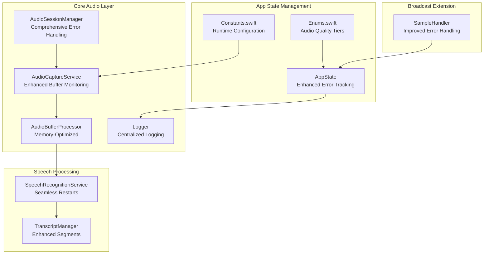
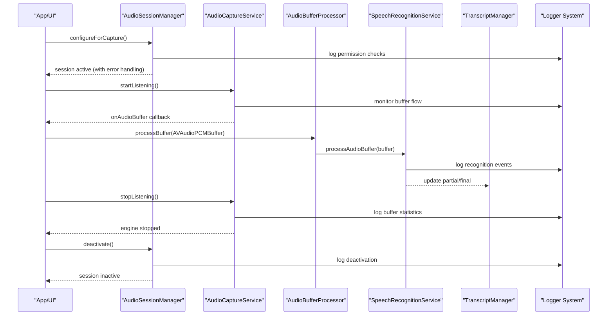
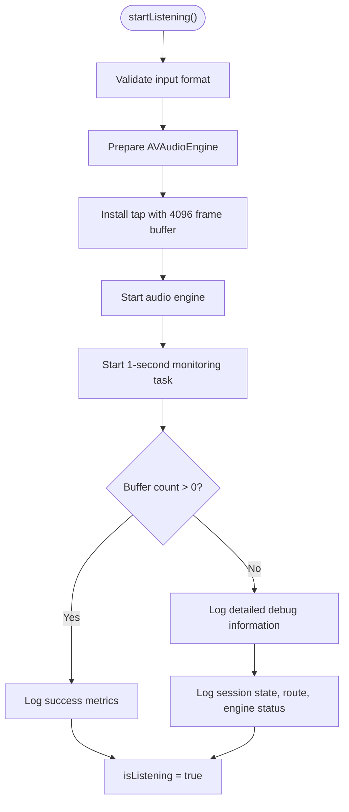
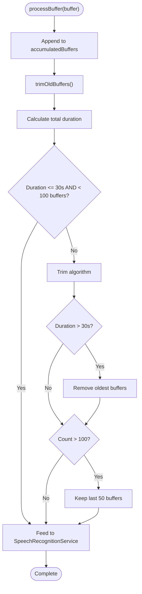
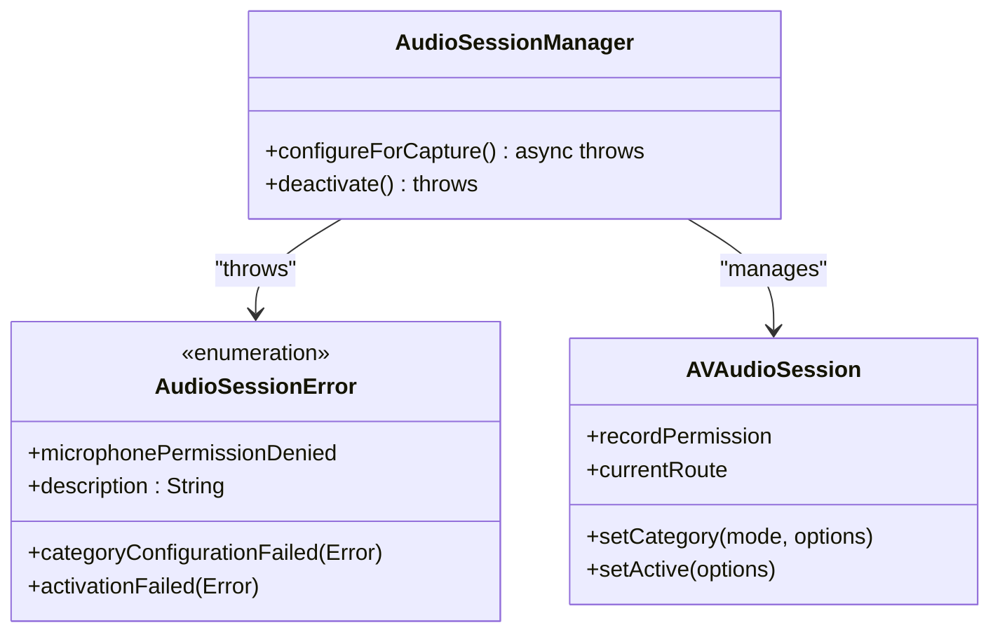
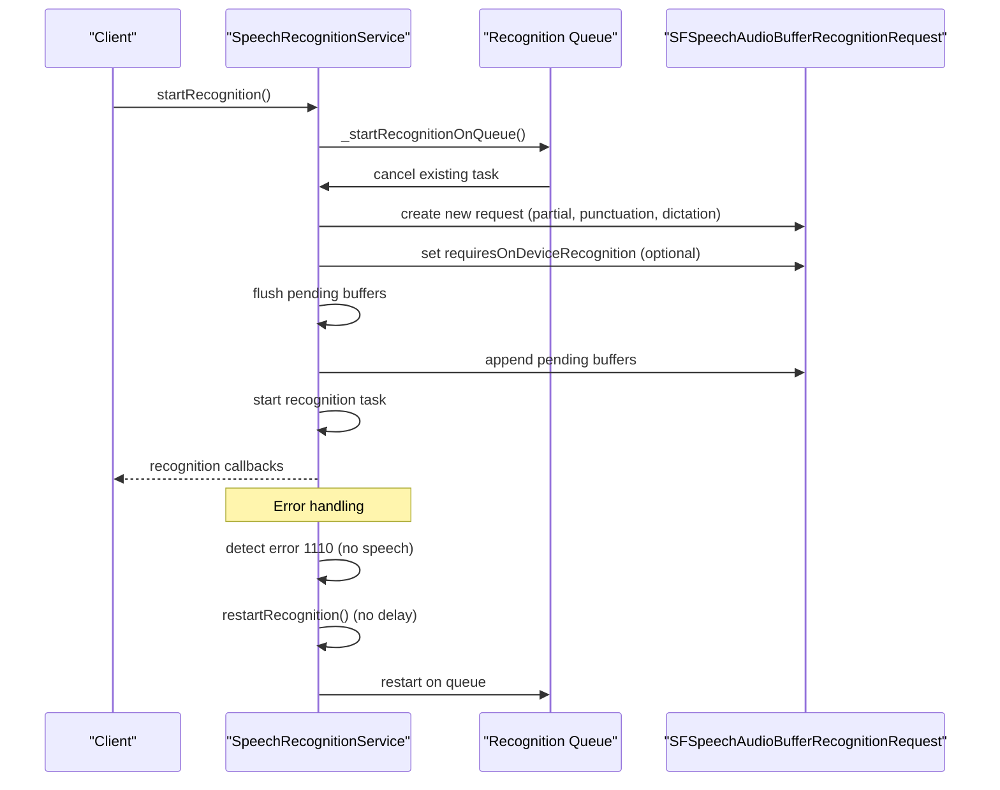

# Audio Processing

<cite>
**Referenced Files in This Document**
- [AudioCaptureService.swift](file://FactShield/FactShield/Core/Audio/AudioCaptureService.swift)
- [AudioBufferProcessor.swift](file://FactShield/FactShield/Core/Audio/AudioBufferProcessor.swift)
- [AudioSessionManager.swift](file://FactShield/FactShield/Core/Audio/AudioSessionManager.swift)
- [SpeechRecognitionService.swift](file://FactShield/FactShield/Core/Speech/SpeechRecognitionService.swift)
- [TranscriptManager.swift](file://FactShield/FactShield/Core/Speech/TranscriptManager.swift)
- [Enums.swift](file://FactShield/FactShield/Models/Enums.swift)
- [Constants.swift](file://FactShield/FactShield/Utilities/Constants.swift)
- [AppState.swift](file://FactShield/FactShield/App/AppState.swift)
- [SampleHandler.swift](file://FactShield/FactShield/BroadcastExtension/SampleHandler.swift)
- [Logger.swift](file://FactShield/FactShield/Utilities/Logger.swift)
- [FactShield-iOS-BuildInstructions.md](file://FactShield-iOS-BuildInstructions.md)
</cite>

## Update Summary
**Changes Made**
- Enhanced AudioCaptureService with improved buffer monitoring and debugging capabilities
- Updated AudioSessionManager with comprehensive error handling and permission management
- Improved SpeechRecognitionService with seamless restart mechanisms and buffer management
- Added centralized logging infrastructure with structured categories
- Enhanced buffer processing with optimized memory management
- Updated system audio capture capabilities in Broadcast Extension

## Table of Contents
1. [Introduction](#introduction)
2. [Project Structure](#project-structure)
3. [Core Components](#core-components)
4. [Architecture Overview](#architecture-overview)
5. [Detailed Component Analysis](#detailed-component-analysis)
6. [Enhanced Error Handling and Debugging](#enhanced-error-handling-and-debugging)
7. [Performance Optimizations](#performance-optimizations)
8. [Troubleshooting Guide](#troubleshooting-guide)
9. [Conclusion](#conclusion)
10. [Appendices](#appendices)

## Introduction
This document explains the enhanced audio processing services responsible for real-time audio capture and processing in the FactShield iOS application. The system has been significantly improved with enhanced reliability, comprehensive error handling, and advanced debugging capabilities. Key improvements include:

- **Enhanced AudioCaptureService**: Improved buffer monitoring with automatic detection of audio flow issues
- **Comprehensive AudioSessionManager**: Advanced permission handling and error management
- **Robust SpeechRecognitionService**: Seamless restart mechanisms and buffer management
- **Centralized Logging Infrastructure**: Structured logging across all audio components
- **Optimized Buffer Processing**: Memory-efficient buffer management with configurable limits
- **Enhanced System Audio Capture**: Improved Broadcast Extension with better error handling

## Project Structure
The audio pipeline now features enhanced modularity with comprehensive error handling and debugging:



**Diagram sources**
- [AudioCaptureService.swift:1-93](file://FactShield/FactShield/Core/Audio/AudioCaptureService.swift#L1-L93)
- [AudioBufferProcessor.swift:1-42](file://FactShield/FactShield/Core/Audio/AudioBufferProcessor.swift#L1-L42)
- [AudioSessionManager.swift:1-91](file://FactShield/FactShield/Core/Audio/AudioSessionManager.swift#L1-L91)
- [SpeechRecognitionService.swift:1-191](file://FactShield/FactShield/Core/Speech/SpeechRecognitionService.swift#L1-L191)
- [TranscriptManager.swift:1-53](file://FactShield/FactShield/Core/Speech/TranscriptManager.swift#L1-L53)
- [SampleHandler.swift:1-85](file://FactShield/FactShield/BroadcastExtension/SampleHandler.swift#L1-L85)
- [AppState.swift:1-30](file://FactShield/FactShield/App/AppState.swift#L1-L30)
- [Logger.swift:1-18](file://FactShield/FactShield/Utilities/Logger.swift#L1-L18)
- [Enums.swift:1-48](file://FactShield/FactShield/Models/Enums.swift#L1-L48)
- [Constants.swift:1-37](file://FactShield/FactShield/Utilities/Constants.swift#L1-L37)

## Core Components
The enhanced audio processing system now includes:

- **AudioCaptureService**: Enhanced with automatic buffer monitoring, improved error logging, and larger buffer sizes for reliable delivery
- **AudioBufferProcessor**: Memory-optimized with configurable duration limits and efficient trimming algorithms
- **AudioSessionManager**: Comprehensive error handling with permission management and detailed debugging
- **SpeechRecognitionService**: Seamless restart mechanisms with buffer preservation and enhanced error recovery
- **TranscriptManager**: Enhanced segment management with timestamp-based filtering and memory optimization
- **AppState**: Improved error tracking with structured error reporting
- **Logger**: Centralized logging infrastructure with categorized subsystems
- **Enums and Constants**: Enhanced configuration with quality tiers and runtime parameters

**Section sources**
- [AudioCaptureService.swift:1-93](file://FactShield/FactShield/Core/Audio/AudioCaptureService.swift#L1-L93)
- [AudioBufferProcessor.swift:1-42](file://FactShield/FactShield/Core/Audio/AudioBufferProcessor.swift#L1-L42)
- [AudioSessionManager.swift:1-91](file://FactShield/FactShield/Core/Audio/AudioSessionManager.swift#L1-L91)
- [SpeechRecognitionService.swift:1-191](file://FactShield/FactShield/Core/Speech/SpeechRecognitionService.swift#L1-L191)
- [TranscriptManager.swift:1-53](file://FactShield/FactShield/Core/Speech/TranscriptManager.swift#L1-L53)
- [AppState.swift:1-30](file://FactShield/FactShield/App/AppState.swift#L1-L30)
- [Logger.swift:1-18](file://FactShield/FactShield/Utilities/Logger.swift#L1-L18)
- [Enums.swift:1-48](file://FactShield/FactShield/Models/Enums.swift#L1-L48)
- [Constants.swift:1-37](file://FactShield/FactShield/Utilities/Constants.swift#L1-L37)

## Architecture Overview
The enhanced audio pipeline provides robust error handling, comprehensive debugging, and optimized performance:



**Diagram sources**
- [AudioSessionManager.swift:27-83](file://FactShield/FactShield/Core/Audio/AudioSessionManager.swift#L27-L83)
- [AudioCaptureService.swift:21-77](file://FactShield/FactShield/Core/Audio/AudioCaptureService.swift#L21-L77)
- [AudioBufferProcessor.swift:16-22](file://FactShield/FactShield/Core/Audio/AudioBufferProcessor.swift#L16-L22)
- [SpeechRecognitionService.swift:48-114](file://FactShield/FactShield/Core/Speech/SpeechRecognitionService.swift#L48-L114)
- [TranscriptManager.swift:26-41](file://FactShield/FactShield/Core/Speech/TranscriptManager.swift#L26-L41)
- [Logger.swift:4-17](file://FactShield/FactShield/Utilities/Logger.swift#L4-L17)

## Detailed Component Analysis

### Enhanced AudioCaptureService
**Updated** Improved with comprehensive buffer monitoring, enhanced error handling, and optimized buffer sizes.

Key enhancements:
- **Automatic Buffer Monitoring**: 1-second monitoring task detects zero-buffer scenarios with detailed debugging information
- **Enhanced Error Logging**: Comprehensive logging of audio session state, input routes, and engine status
- **Optimized Buffer Size**: Increased from 1024 to 4096 frames for more reliable delivery
- **Improved Format Validation**: Pre-start validation of input format with detailed error reporting
- **Structured Buffer Counting**: Track and report total buffers processed for debugging



**Diagram sources**
- [AudioCaptureService.swift:21-77](file://FactShield/FactShield/Core/Audio/AudioCaptureService.swift#L21-L77)

**Section sources**
- [AudioCaptureService.swift:1-93](file://FactShield/FactShield/Core/Audio/AudioCaptureService.swift#L1-L93)

### Enhanced AudioBufferProcessor
**Updated** Memory-optimized with configurable duration limits and efficient trimming algorithms.

Key improvements:
- **Configurable Duration Limits**: 30-second maximum accumulation duration
- **Efficient Memory Management**: Automatic trimming when exceeding 100 buffers or duration limits
- **Optimized Trimming Algorithm**: Smart trimming that preserves recent audio while removing older data
- **Thread-Safe Processing**: Queue-based processing with proper synchronization



**Diagram sources**
- [AudioBufferProcessor.swift:16-36](file://FactShield/FactShield/Core/Audio/AudioBufferProcessor.swift#L16-L36)

**Section sources**
- [AudioBufferProcessor.swift:1-42](file://FactShield/FactShield/Core/Audio/AudioBufferProcessor.swift#L1-L42)

### Enhanced AudioSessionManager
**Updated** Comprehensive error handling with permission management and detailed debugging capabilities.

Key enhancements:
- **Structured Error Types**: Dedicated `AudioSessionError` enum with specific error cases
- **Permission Management**: Complete microphone permission handling with user prompts
- **Comprehensive Logging**: Detailed session state logging with input port information
- **Enhanced Activation**: Explicit session activation with notification options
- **Post-Activation Delay**: 0.1-second delay to allow iOS audio routing completion



**Diagram sources**
- [AudioSessionManager.swift:4-83](file://FactShield/FactShield/Core/Audio/AudioSessionManager.swift#L4-L83)

**Section sources**
- [AudioSessionManager.swift:1-91](file://FactShield/FactShield/Core/Audio/AudioSessionManager.swift#L1-L91)

### Enhanced SpeechRecognitionService
**Updated** Seamless restart mechanisms with buffer preservation and enhanced error recovery.

Key improvements:
- **Seamless Restart Mechanisms**: No delay restarts to prevent audio loss
- **Buffer Preservation**: Pending buffer management during recognition restarts
- **Enhanced Error Handling**: Specific handling for "No speech detected" errors (1110)
- **Optimized Recognition Mode**: Dictation mode for better silence tolerance
- **Thread-Safe Operations**: Queue-based processing for thread safety



**Diagram sources**
- [SpeechRecognitionService.swift:48-167](file://FactShield/FactShield/Core/Speech/SpeechRecognitionService.swift#L48-L167)

**Section sources**
- [SpeechRecognitionService.swift:1-191](file://FactShield/FactShield/Core/Speech/SpeechRecognitionService.swift#L1-L191)

### Enhanced TranscriptManager
**Updated** Timestamp-based segment management with enhanced filtering and memory optimization.

Key improvements:
- **Timestamp-Based Filtering**: Time-based transcript segment filtering
- **Memory Optimization**: Automatic trimming of segments older than 5 minutes
- **Enhanced Segment Management**: Structured transcript segment handling
- **Flexible Access Patterns**: Both full and recent transcript retrieval

**Section sources**
- [TranscriptManager.swift:1-53](file://FactShield/FactShield/Core/Speech/TranscriptManager.swift#L1-L53)

### Enhanced Broadcast Extension
**Updated** Improved error handling and system audio capture capabilities.

Key enhancements:
- **Robust Error Handling**: Better validation of sample buffers and data pointers
- **Enhanced File Writing**: Improved file handling with proper existence checking
- **Centralized App Group Management**: Consistent app group identifier usage
- **Structured Logging**: Comprehensive logging for broadcast lifecycle events

**Section sources**
- [SampleHandler.swift:1-85](file://FactShield/FactShield/BroadcastExtension/SampleHandler.swift#L1-L85)

## Enhanced Error Handling and Debugging
**New Section** The enhanced system provides comprehensive error handling and debugging capabilities.

### Centralized Logging Infrastructure
The system now features a centralized logging approach with structured categories:

- **Audio Subsystem**: Dedicated logging for capture, buffer processing, and session management
- **Speech Recognition**: Comprehensive logging for recognition events and errors
- **Broadcast Extension**: Detailed logging for system audio capture
- **Structured Categories**: Organized logging by functional area

### Enhanced Error Types
- **AudioSessionError**: Specific error handling for audio session issues
- **FactShieldError**: Application-level error management
- **Structured Error Messages**: Descriptive error messages with actionable information

### Debugging Capabilities
- **Buffer Flow Monitoring**: Automatic detection of audio flow issues
- **Session State Logging**: Detailed audio session state information
- **Performance Metrics**: Buffer count tracking and processing statistics
- **Route Information**: Comprehensive audio input/output routing details

**Section sources**
- [Logger.swift:1-18](file://FactShield/FactShield/Utilities/Logger.swift#L1-L18)
- [AudioSessionManager.swift:4-19](file://FactShield/FactShield/Core/Audio/AudioSessionManager.swift#L4-L19)
- [AppState.swift:16-28](file://FactShield/FactShield/App/AppState.swift#L16-L28)
- [AudioCaptureService.swift:59-76](file://FactShield/FactShield/Core/Audio/AudioCaptureService.swift#L59-L76)

## Performance Optimizations
**Updated** Enhanced performance through optimized buffer management, reduced latency, and improved resource utilization.

### Buffer Optimization
- **Larger Buffer Sizes**: 4096-frame buffers for more reliable delivery
- **Memory-Efficient Trimming**: Smart buffer trimming to prevent unbounded growth
- **Configurable Duration Limits**: 30-second maximum accumulation duration
- **Thread-Safe Processing**: Queue-based processing to prevent race conditions

### Recognition Optimization
- **Seamless Restarts**: Immediate restarts without audio loss
- **Buffer Preservation**: Pending buffer management during restarts
- **Optimized Recognition Mode**: Dictation mode for better silence handling
- **Reduced Latency**: Elimination of restart delays

### Resource Management
- **Automatic Cleanup**: Proper resource cleanup on stop and error conditions
- **Memory Bounds**: Configurable limits to prevent memory exhaustion
- **Efficient Logging**: Structured logging with minimal performance impact
- **Optimized File I/O**: Efficient system audio file writing

## Troubleshooting Guide
**Updated** Enhanced troubleshooting with comprehensive error handling and debugging information.

### Common Issues and Solutions
- **Audio Session Activation Failures**: Check microphone permissions and session configuration
- **Zero Buffer Detection**: Monitor buffer flow with automatic warnings and detailed debugging
- **Permission Denials**: Handle microphone and speech recognition permission prompts
- **Recognition Errors**: Automatic restart handling for common errors like "No speech detected"
- **System Audio Capture Issues**: Enhanced error handling for broadcast extension

### Enhanced Error Types and Handling
- **AudioSessionError**: Microphone permission denied, category configuration failed, activation failed
- **FactShieldError**: Application-level error management with descriptive messages
- **Structured Error Reporting**: Detailed error information for debugging

### Debugging Strategies
- **Buffer Flow Monitoring**: Use automatic monitoring to detect audio flow issues
- **Session State Inspection**: Check detailed session state information
- **Performance Metrics**: Monitor buffer counts and processing statistics
- **Logging Analysis**: Use structured logs to identify issues systematically

**Section sources**
- [AudioSessionManager.swift:34-51](file://FactShield/FactShield/Core/Audio/AudioSessionManager.swift#L34-L51)
- [AudioCaptureService.swift:65-75](file://FactShield/FactShield/Core/Audio/AudioCaptureService.swift#L65-L75)
- [SpeechRecognitionService.swift:101-109](file://FactShield/FactShield/Core/Speech/SpeechRecognitionService.swift#L101-L109)
- [AppState.swift:20-28](file://FactShield/FactShield/App/AppState.swift#L20-L28)

## Conclusion
The enhanced audio processing subsystem provides a robust, real-time pipeline with comprehensive error handling, debugging capabilities, and optimized performance. Key improvements include automatic buffer monitoring, structured error handling, seamless recognition restarts, and centralized logging infrastructure. These enhancements enable reliable fact-checking workflows with improved reliability and maintainability.

## Appendices

### Enhanced Audio Formats and Quality
**Updated** Enhanced configuration with quality tiers and runtime parameters.

- **Audio Quality Tiers**: Low (16kHz), Medium (44.1kHz), High (48kHz) sample rates
- **Default Runtime Constants**: 16kHz sample rate, 1024 frame buffer size, 5-minute maximum recording
- **Enhanced Buffer Configuration**: 4096-frame buffers for improved reliability
- **Memory Management**: Configurable duration and count limits for optimal performance

**Section sources**
- [Enums.swift:11-23](file://FactShield/FactShield/Models/Enums.swift#L11-L23)
- [Constants.swift:14-21](file://FactShield/FactShield/Utilities/Constants.swift#L14-L21)
- [AudioCaptureService.swift:38-46](file://FactShield/FactShield/Core/Audio/AudioCaptureService.swift#L38-L46)

### Enhanced Practical Setup Examples
**Updated** Comprehensive setup examples with error handling and debugging.

#### Enhanced Audio Session Configuration
```swift
// Configure audio session with comprehensive error handling
do {
    try await AudioSessionManager.shared.configureForCapture()
    print("Audio session configured successfully")
} catch AudioSessionError.microphonePermissionDenied {
    print("Microphone permission required")
    AppState.shared.presentError(.audioSessionFailed("Microphone permission denied"))
} catch {
    print("Audio session configuration failed: \(error)")
    AppState.shared.presentError(.audioSessionFailed(error.localizedDescription))
}
```

#### Enhanced Audio Capture Setup
```swift
// Start audio capture with monitoring
AudioCaptureService.shared.onAudioBuffer = { buffer in
    // Process audio buffer
    AudioBufferProcessor.shared.processBuffer(buffer)
}

do {
    try await AudioSessionManager.shared.configureForCapture()
    AudioCaptureService.shared.startListening()
} catch {
    print("Failed to start audio capture: \(error)")
}
```

#### Enhanced Speech Recognition Integration
```swift
// Enhanced speech recognition with error handling
SpeechRecognitionService.shared.startRecognition()

// Handle recognition callbacks
SpeechRecognitionService.shared.$currentTranscript.sink { transcript in
    print("Current transcript: \(transcript)")
    
    // Update UI or trigger fact-checking
    if transcript.count > 100 {
        // Trigger fact-checking workflow
    }
}.store(in: &cancellables)
```

**Section sources**
- [AudioSessionManager.swift:27-83](file://FactShield/FactShield/Core/Audio/AudioSessionManager.swift#L27-L83)
- [AudioCaptureService.swift:21-77](file://FactShield/FactShield/Core/Audio/AudioCaptureService.swift#L21-L77)
- [SpeechRecognitionService.swift:48-114](file://FactShield/FactShield/Core/Speech/SpeechRecognitionService.swift#L48-L114)

### Enhanced System Audio Capture
**Updated** Improved system audio capture with better error handling and configuration.

#### Broadcast Extension Configuration
```swift
// Enhanced broadcast extension setup
override func broadcastStarted(withSetupInfo setupInfo: [String: NSObject]?) {
    logger.info("Broadcast started with enhanced error handling")
    
    // Notify main app with error checking
    if let defaults = UserDefaults(suiteName: appGroup) {
        defaults.set(true, forKey: "isBroadcasting")
        defaults.set(Date(), forKey: "broadcastStartedAt")
    }
}

override func processSampleBuffer(_ sampleBuffer: CMSampleBuffer, with sampleBufferType: RPSampleBufferType) {
    switch sampleBufferType {
    case .audioApp, .audioMic:
        processAudioSampleBuffer(sampleBuffer)
    default:
        break
    }
}
```

**Section sources**
- [SampleHandler.swift:10-55](file://FactShield/FactShield/BroadcastExtension/SampleHandler.swift#L10-L55)
- [SampleHandler.swift:57-83](file://FactShield/FactShield/BroadcastExtension/SampleHandler.swift#L57-L83)