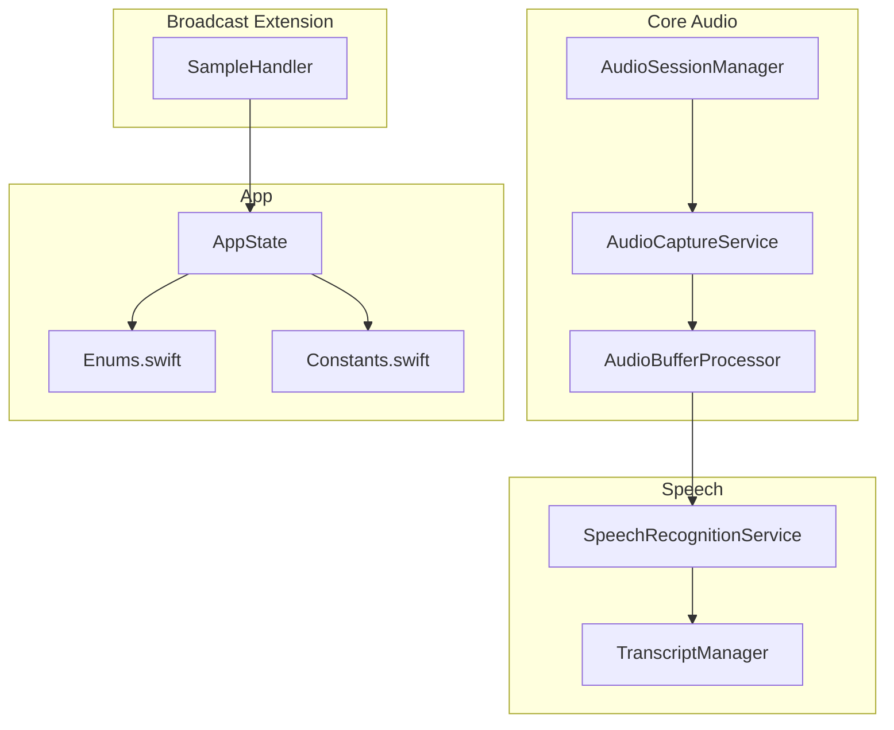
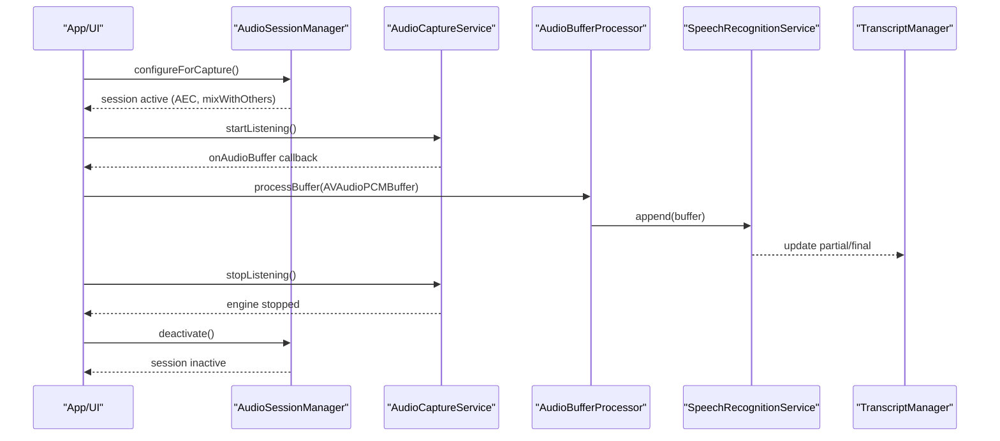
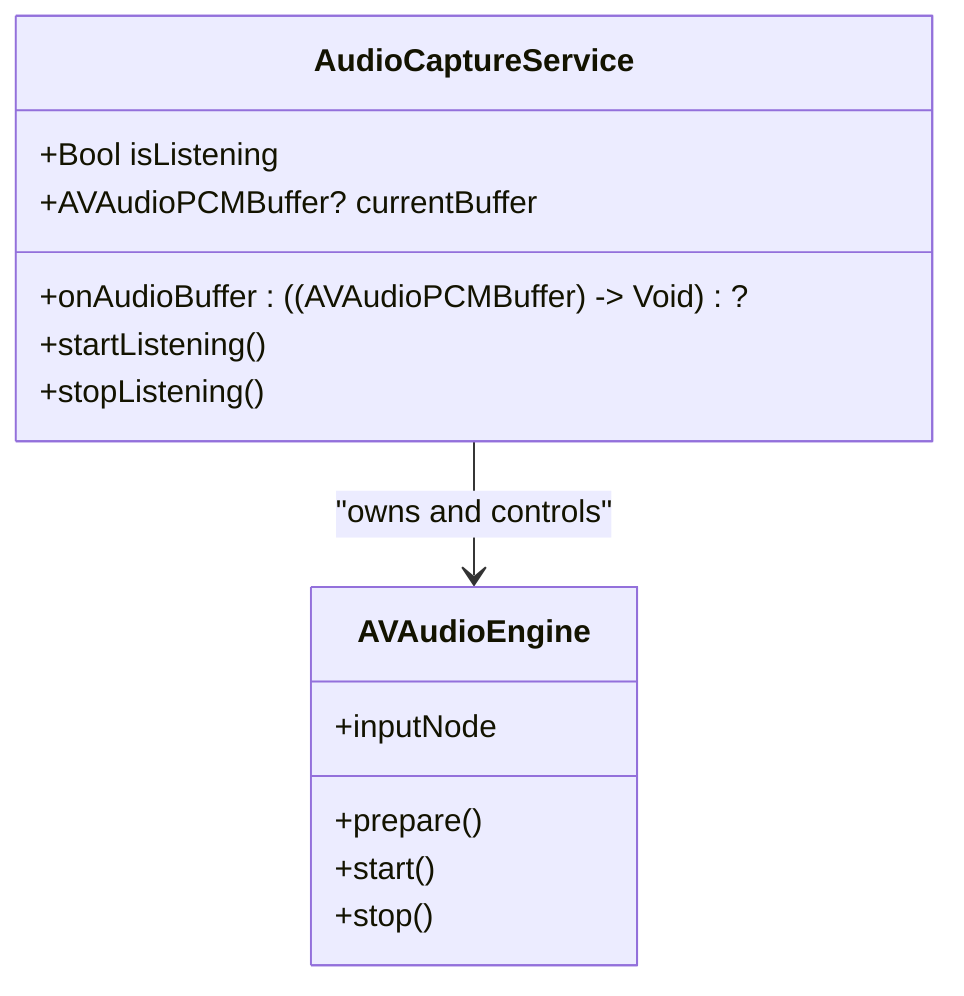
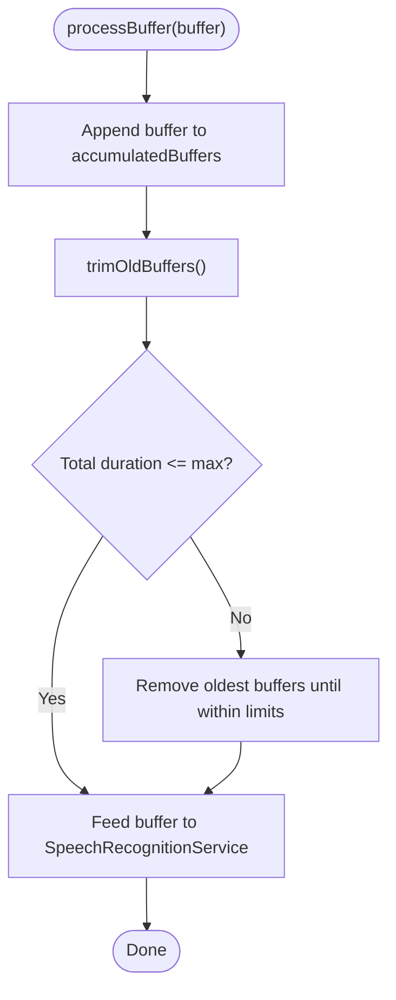
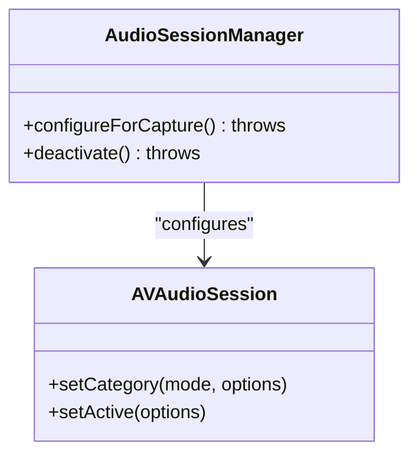
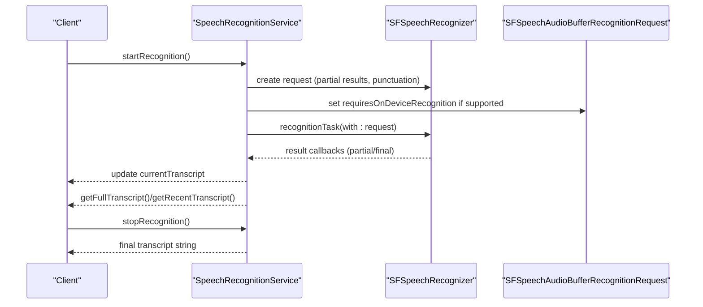
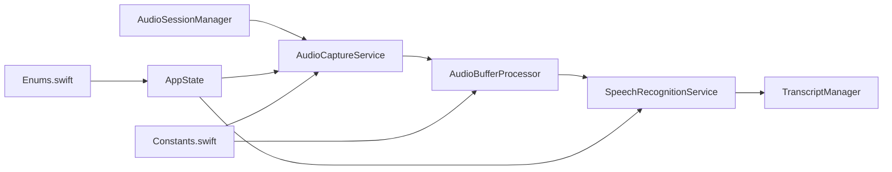

# Audio Processing

<cite>
**Referenced Files in This Document**
- [AudioCaptureService.swift](file://FactShield/FactShield/Core/Audio/AudioCaptureService.swift)
- [AudioBufferProcessor.swift](file://FactShield/FactShield/Core/Audio/AudioBufferProcessor.swift)
- [AudioSessionManager.swift](file://FactShield/FactShield/Core/Audio/AudioSessionManager.swift)
- [SpeechRecognitionService.swift](file://FactShield/FactShield/Core/Speech/SpeechRecognitionService.swift)
- [TranscriptManager.swift](file://FactShield/FactShield/Core/Speech/TranscriptManager.swift)
- [Enums.swift](file://FactShield/FactShield/Models/Enums.swift)
- [Constants.swift](file://FactShield/FactShield/Utilities/Constants.swift)
- [AppState.swift](file://FactShield/FactShield/App/AppState.swift)
- [SampleHandler.swift](file://FactShield/FactShield/BroadcastExtension/SampleHandler.swift)
- [FactShield-iOS-BuildInstructions.md](file://FactShield-iOS-BuildInstructions.md)
</cite>

## Table of Contents
1. [Introduction](#introduction)
2. [Project Structure](#project-structure)
3. [Core Components](#core-components)
4. [Architecture Overview](#architecture-overview)
5. [Detailed Component Analysis](#detailed-component-analysis)
6. [Dependency Analysis](#dependency-analysis)
7. [Performance Considerations](#performance-considerations)
8. [Troubleshooting Guide](#troubleshooting-guide)
9. [Conclusion](#conclusion)
10. [Appendices](#appendices)

## Introduction
This document explains the audio processing services responsible for real-time audio capture and processing in the FactShield iOS application. It covers:
- Audio capture via the microphone using AVAudioEngine and a tap installed on the input node
- Buffer management and format handling for speech recognition
- Audio session lifecycle management with echo cancellation and concurrent playback support
- Integration with speech recognition and transcript management
- Practical setup examples, buffer processing workflows, and integration patterns
- Error handling strategies for interruptions, permissions, and hardware conflicts

## Project Structure
The audio pipeline spans several modules:
- Core Audio: capture, buffer processing, and session management
- Speech: speech recognition and transcript management
- Broadcast Extension: system audio capture for screen broadcasts
- App state and models: global state and audio quality configuration

**Diagram sources**
- [AudioCaptureService.swift:1-51](file://FactShield/FactShield/Core/Audio/AudioCaptureService.swift#L1-L51)
- [AudioBufferProcessor.swift:1-42](file://FactShield/FactShield/Core/Audio/AudioBufferProcessor.swift#L1-L42)
- [AudioSessionManager.swift:1-23](file://FactShield/FactShield/Core/Audio/AudioSessionManager.swift#L1-L23)
- [SpeechRecognitionService.swift:1-138](file://FactShield/FactShield/Core/Speech/SpeechRecognitionService.swift#L1-L138)
- [TranscriptManager.swift:1-53](file://FactShield/FactShield/Core/Speech/TranscriptManager.swift#L1-L53)
- [SampleHandler.swift:1-84](file://FactShield/FactShield/BroadcastExtension/SampleHandler.swift#L1-L84)
- [AppState.swift:1-30](file://FactShield/FactShield/App/AppState.swift#L1-L30)
- [Enums.swift:1-48](file://FactShield/FactShield/Models/Enums.swift#L1-L48)
- [Constants.swift:1-37](file://FactShield/FactShield/Utilities/Constants.swift#L1-L37)

**Section sources**
- [AudioCaptureService.swift:1-51](file://FactShield/FactShield/Core/Audio/AudioCaptureService.swift#L1-L51)
- [AudioBufferProcessor.swift:1-42](file://FactShield/FactShield/Core/Audio/AudioBufferProcessor.swift#L1-L42)
- [AudioSessionManager.swift:1-23](file://FactShield/FactShield/Core/Audio/AudioSessionManager.swift#L1-L23)
- [SpeechRecognitionService.swift:1-138](file://FactShield/FactShield/Core/Speech/SpeechRecognitionService.swift#L1-L138)
- [TranscriptManager.swift:1-53](file://FactShield/FactShield/Core/Speech/TranscriptManager.swift#L1-L53)
- [SampleHandler.swift:1-84](file://FactShield/FactShield/BroadcastExtension/SampleHandler.swift#L1-L84)
- [AppState.swift:1-30](file://FactShield/FactShield/App/AppState.swift#L1-L30)
- [Enums.swift:1-48](file://FactShield/FactShield/Models/Enums.swift#L1-L48)
- [Constants.swift:1-37](file://FactShield/FactShield/Utilities/Constants.swift#L1-L37)

## Core Components
- AudioCaptureService: Installs a tap on the AVAudioEngine input node to receive PCM buffers at a fixed buffer size and forwards them to subscribers on a dedicated queue.
- AudioBufferProcessor: Accumulates recent buffers up to a duration limit, trims older buffers, and feeds them to the speech recognition service.
- AudioSessionManager: Configures the AVAudioSession for capture with voice chat mode (enabling AEC) and allows mixing with others.
- SpeechRecognitionService: Manages SFSpeech recognition requests, partial and final results, on-device preference, and automatic restart on errors.
- TranscriptManager: Maintains a rolling set of transcript segments with timestamps and provides recent and full transcripts.
- AppState: Tracks global state including permissions and errors.
- Enums and Constants: Define audio quality tiers and default runtime constants.

**Section sources**
- [AudioCaptureService.swift:1-51](file://FactShield/FactShield/Core/Audio/AudioCaptureService.swift#L1-L51)
- [AudioBufferProcessor.swift:1-42](file://FactShield/FactShield/Core/Audio/AudioBufferProcessor.swift#L1-L42)
- [AudioSessionManager.swift:1-23](file://FactShield/FactShield/Core/Audio/AudioSessionManager.swift#L1-L23)
- [SpeechRecognitionService.swift:1-138](file://FactShield/FactShield/Core/Speech/SpeechRecognitionService.swift#L1-L138)
- [TranscriptManager.swift:1-53](file://FactShield/FactShield/Core/Speech/TranscriptManager.swift#L1-L53)
- [AppState.swift:1-30](file://FactShield/FactShield/App/AppState.swift#L1-L30)
- [Enums.swift:1-48](file://FactShield/FactShield/Models/Enums.swift#L1-L48)
- [Constants.swift:1-37](file://FactShield/FactShield/Utilities/Constants.swift#L1-L37)

## Architecture Overview
The audio pipeline integrates capture, buffering, and speech recognition with robust error handling and session management.

**Diagram sources**
- [AudioSessionManager.swift:8-17](file://FactShield/FactShield/Core/Audio/AudioSessionManager.swift#L8-L17)
- [AudioCaptureService.swift:19-40](file://FactShield/FactShield/Core/Audio/AudioCaptureService.swift#L19-L40)
- [AudioBufferProcessor.swift:16-22](file://FactShield/FactShield/Core/Audio/AudioBufferProcessor.swift#L16-L22)
- [SpeechRecognitionService.swift:41-84](file://FactShield/FactShield/Core/Speech/SpeechRecognitionService.swift#L41-L84)
- [TranscriptManager.swift:26-41](file://FactShield/FactShield/Core/Speech/TranscriptManager.swift#L26-L41)

## Detailed Component Analysis

### AudioCaptureService
Responsibilities:
- Configure and start AVAudioEngine input node tap
- Deliver PCM buffers to subscribers on a user interactive queue
- Manage lifecycle with safe start/stop and logging

Key behaviors:
- Uses the input node’s output format for the tap to avoid unnecessary conversions
- Buffer size is fixed at 1024 frames
- Subscribers receive buffers asynchronously on a dedicated queue
- On start failure, logs an error and remains inactive

**Diagram sources**
- [AudioCaptureService.swift:5-50](file://FactShield/FactShield/Core/Audio/AudioCaptureService.swift#L5-L50)

**Section sources**
- [AudioCaptureService.swift:1-51](file://FactShield/FactShield/Core/Audio/AudioCaptureService.swift#L1-L51)

### AudioBufferProcessor
Responsibilities:
- Maintain a rolling window of recent buffers
- Trim old buffers based on duration and count thresholds
- Forward buffers to the speech recognition service

Processing logic:
- Accumulates buffers and computes total duration
- Trims to keep under a maximum duration threshold
- Limits array size to prevent unbounded growth
- Calls into the speech recognition service for continuous processing

**Diagram sources**
- [AudioBufferProcessor.swift:16-36](file://FactShield/FactShield/Core/Audio/AudioBufferProcessor.swift#L16-L36)

**Section sources**
- [AudioBufferProcessor.swift:1-42](file://FactShield/FactShield/Core/Audio/AudioBufferProcessor.swift#L1-L42)

### AudioSessionManager
Responsibilities:
- Configure the audio session for capture
- Enable AEC via voice chat mode
- Allow mixing with other audio and Bluetooth A2DP
- Deactivate session cleanly

**Diagram sources**
- [AudioSessionManager.swift:4-22](file://FactShield/FactShield/Core/Audio/AudioSessionManager.swift#L4-L22)

**Section sources**
- [AudioSessionManager.swift:1-23](file://FactShield/FactShield/Core/Audio/AudioSessionManager.swift#L1-L23)

### SpeechRecognitionService
Responsibilities:
- Initialize and authorize speech recognition
- Manage SFSpeechAudioBufferRecognitionRequest
- Prefer on-device recognition when available
- Handle partial and final results, errors, and restarts

Behavior highlights:
- Cancels previous tasks before starting a new recognition
- Enables partial results and punctuation
- Restarts recognition after transient errors with a small delay
- Exposes methods to stop recognition and retrieve final/full transcripts

**Diagram sources**
- [SpeechRecognitionService.swift:41-101](file://FactShield/FactShield/Core/Speech/SpeechRecognitionService.swift#L41-L101)

**Section sources**
- [SpeechRecognitionService.swift:1-138](file://FactShield/FactShield/Core/Speech/SpeechRecognitionService.swift#L1-L138)

### TranscriptManager
Responsibilities:
- Maintain transcript segments with timestamps
- Provide recent transcript excerpts and full transcript
- Trim old segments to bound memory usage

**Section sources**
- [TranscriptManager.swift:1-53](file://FactShield/FactShield/Core/Speech/TranscriptManager.swift#L1-L53)

### Broadcast Extension (System Audio Capture)
The Broadcast Upload Extension captures system audio during screen recordings and writes raw PCM data to a shared container for later processing by the main app.

Highlights:
- Receives audioApp and audioMic sample buffers
- Extracts PCM data from CMSampleBuffer
- Writes to a shared “broadcast_audio.raw” file in the app group container

**Section sources**
- [SampleHandler.swift:36-84](file://FactShield/FactShield/BroadcastExtension/SampleHandler.swift#L36-L84)
- [FactShield-iOS-BuildInstructions.md:1941-2029](file://FactShield-iOS-BuildInstructions.md#L1941-L2029)

## Dependency Analysis
- AudioCaptureService depends on AVAudioEngine and dispatch queues for thread-safe buffer delivery
- AudioBufferProcessor depends on SpeechRecognitionService for transcription
- SpeechRecognitionService depends on SFSpeechRecognizer and manages its own lifecycle
- AudioSessionManager coordinates session configuration for capture scenarios
- AppState tracks permissions and errors surfaced to the UI
- Enums and Constants define quality and runtime configuration

**Diagram sources**
- [AudioSessionManager.swift:1-23](file://FactShield/FactShield/Core/Audio/AudioSessionManager.swift#L1-L23)
- [AudioCaptureService.swift:1-51](file://FactShield/FactShield/Core/Audio/AudioCaptureService.swift#L1-L51)
- [AudioBufferProcessor.swift:1-42](file://FactShield/FactShield/Core/Audio/AudioBufferProcessor.swift#L1-L42)
- [SpeechRecognitionService.swift:1-138](file://FactShield/FactShield/Core/Speech/SpeechRecognitionService.swift#L1-L138)
- [TranscriptManager.swift:1-53](file://FactShield/FactShield/Core/Speech/TranscriptManager.swift#L1-L53)
- [AppState.swift:1-30](file://FactShield/FactShield/App/AppState.swift#L1-L30)
- [Enums.swift:1-48](file://FactShield/FactShield/Models/Enums.swift#L1-L48)
- [Constants.swift:1-37](file://FactShield/FactShield/Utilities/Constants.swift#L1-L37)

**Section sources**
- [AudioSessionManager.swift:1-23](file://FactShield/FactShield/Core/Audio/AudioSessionManager.swift#L1-L23)
- [AudioCaptureService.swift:1-51](file://FactShield/FactShield/Core/Audio/AudioCaptureService.swift#L1-L51)
- [AudioBufferProcessor.swift:1-42](file://FactShield/FactShield/Core/Audio/AudioBufferProcessor.swift#L1-L42)
- [SpeechRecognitionService.swift:1-138](file://FactShield/FactShield/Core/Speech/SpeechRecognitionService.swift#L1-L138)
- [TranscriptManager.swift:1-53](file://FactShield/FactShield/Core/Speech/TranscriptManager.swift#L1-L53)
- [AppState.swift:1-30](file://FactShield/FactShield/App/AppState.swift#L1-L30)
- [Enums.swift:1-48](file://FactShield/FactShield/Models/Enums.swift#L1-L48)
- [Constants.swift:1-37](file://FactShield/FactShield/Utilities/Constants.swift#L1-L37)

## Performance Considerations
- Buffer size: Fixed at 1024 frames for consistent processing cadence
- Latency: Tap-based capture introduces minimal latency; voice chat mode enables AEC without extra CPU overhead
- Throughput: Buffers are forwarded asynchronously to avoid blocking the audio thread
- Memory: Rolling buffer trimming prevents unbounded growth; transcript segments are trimmed to a time window
- Quality: On-device recognition reduces latency and privacy risk; speech quality can be tuned via audio quality enums

[No sources needed since this section provides general guidance]

## Troubleshooting Guide
Common issues and strategies:
- Audio session activation failures: Wrap configuration in a do-catch and surface errors via AppState
- Permission denials: Check microphone and speech recognition permissions; prompt users accordingly
- Interruptions: Restart speech recognition after transient errors; ensure session reconfiguration on interruption
- Hardware conflicts: Use mixWithOthers to avoid pausing other audio; verify Bluetooth A2DP availability

Error types and handling:
- Audio session errors and speech recognition availability/denial are represented by domain-specific errors
- Speech recognition service automatically restarts on error with a brief delay

**Section sources**
- [AppState.swift:16-28](file://FactShield/FactShield/App/AppState.swift#L16-L28)
- [Enums.swift:25-47](file://FactShield/FactShield/Models/Enums.swift#L25-L47)
- [SpeechRecognitionService.swift:28-39](file://FactShield/FactShield/Core/Speech/SpeechRecognitionService.swift#L28-L39)
- [SpeechRecognitionService.swift:76-80](file://FactShield/FactShield/Core/Speech/SpeechRecognitionService.swift#L76-L80)
- [SpeechRecognitionService.swift:103-114](file://FactShield/FactShield/Core/Speech/SpeechRecognitionService.swift#L103-L114)

## Conclusion
The audio processing subsystem provides a robust, real-time pipeline for capturing microphone audio, buffering PCM data, and feeding it into speech recognition with AEC-enabled sessions. The design emphasizes thread safety, memory bounds, and resilience against interruptions, enabling reliable fact-checking workflows.

[No sources needed since this section summarizes without analyzing specific files]

## Appendices

### Audio Formats and Quality
- Audio quality tiers define sample rates suitable for different quality targets
- Default runtime constants specify buffer size and maximum recording duration

**Section sources**
- [Enums.swift:11-23](file://FactShield/FactShield/Models/Enums.swift#L11-L23)
- [Constants.swift:14-17](file://FactShield/FactShield/Utilities/Constants.swift#L14-L17)

### Practical Setup Examples
- Configure audio session for capture with AEC and mixing
- Start and stop audio capture
- Integrate with speech recognition and retrieve transcripts

**Section sources**
- [AudioSessionManager.swift:8-17](file://FactShield/FactShield/Core/Audio/AudioSessionManager.swift#L8-L17)
- [AudioCaptureService.swift:19-40](file://FactShield/FactShield/Core/Audio/AudioCaptureService.swift#L19-L40)
- [SpeechRecognitionService.swift:41-84](file://FactShield/FactShield/Core/Speech/SpeechRecognitionService.swift#L41-L84)
- [TranscriptManager.swift:14-24](file://FactShield/FactShield/Core/Speech/TranscriptManager.swift#L14-L24)