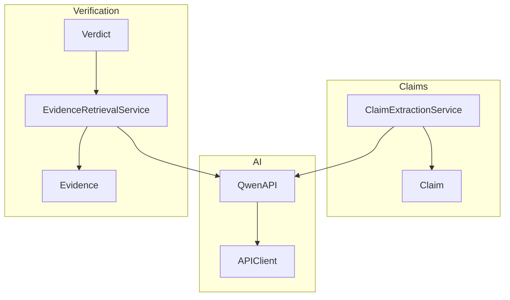
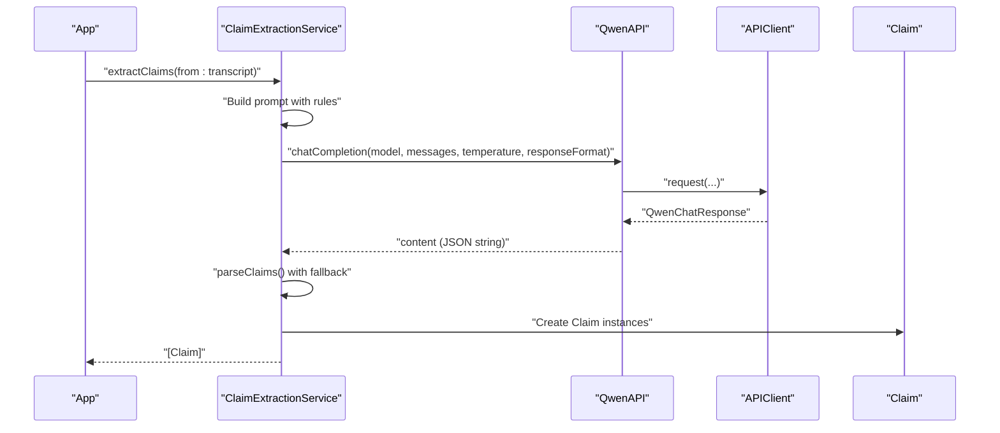
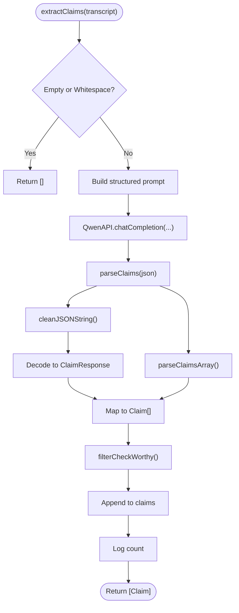
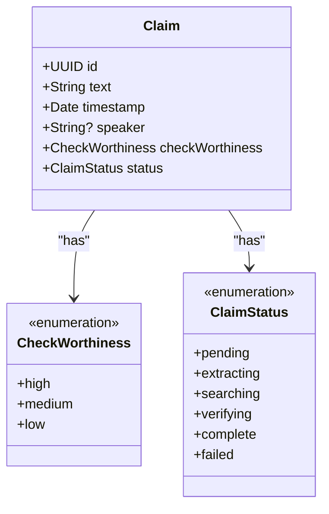
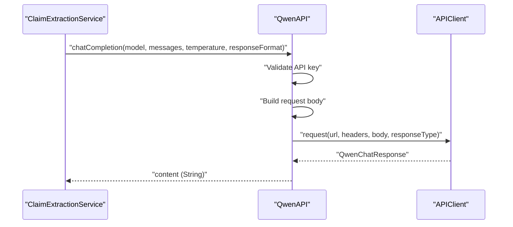
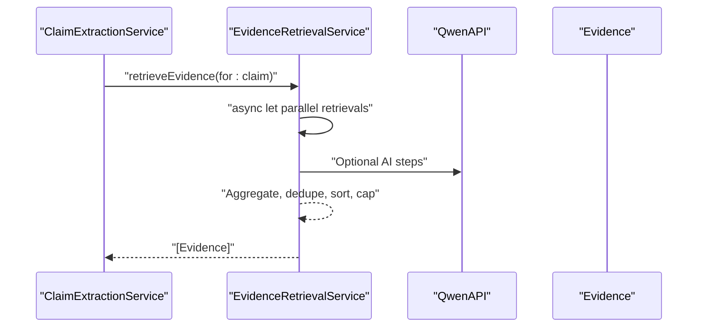
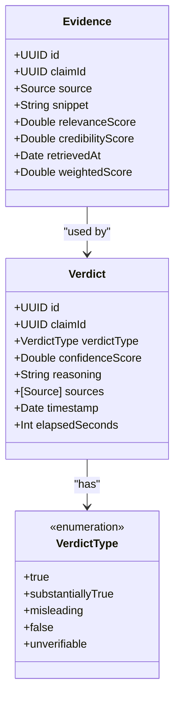
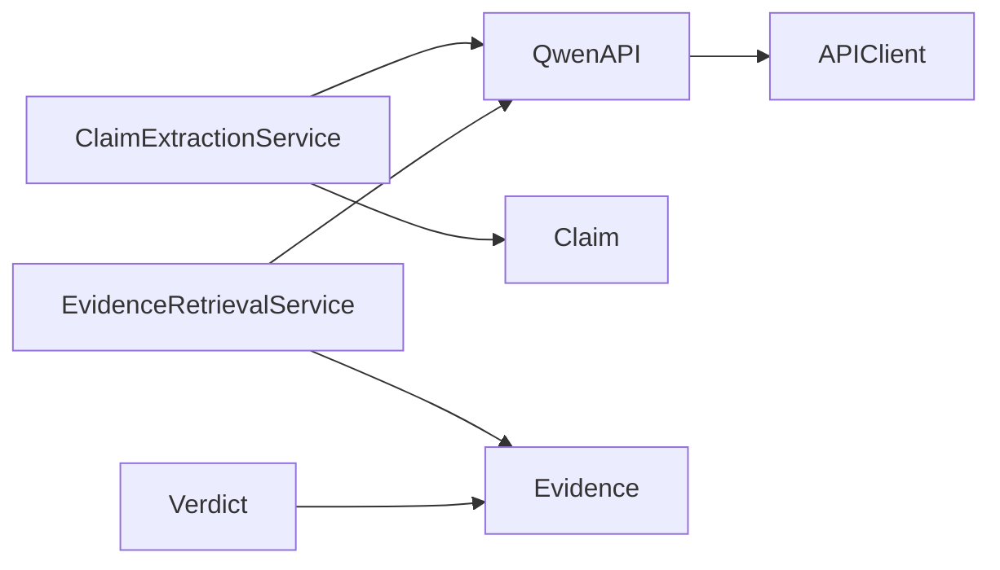

# Claim Extraction

<cite>
**Referenced Files in This Document**
- [ClaimExtractionService.swift](file://FactShield/FactShield/Core/Claims/ClaimExtractionService.swift)
- [Claim.swift](file://FactShield/FactShield/Core/Claims/Claim.swift)
- [QwenAPI.swift](file://FactShield/FactShield/Core/Network/QwenAPI.swift)
- [APIClient.swift](file://FactShield/FactShield/Core/Network/APIClient.swift)
- [Constants.swift](file://FactShield/FactShield/Utilities/Constants.swift)
- [Logger.swift](file://FactShield/FactShield/Utilities/Logger.swift)
- [EvidenceRetrievalService.swift](file://FactShield/FactShield/Core/Verification/EvidenceRetrievalService.swift)
- [Evidence.swift](file://FactShield/FactShield/Core/Verification/Evidence.swift)
- [Verdict.swift](file://FactShield/FactShield/Core/Verification/Verdict.swift)
- [Enums.swift](file://FactShield/FactShield/Models/Enums.swift)
</cite>

## Table of Contents
1. [Introduction](#introduction)
2. [Project Structure](#project-structure)
3. [Core Components](#core-components)
4. [Architecture Overview](#architecture-overview)
5. [Detailed Component Analysis](#detailed-component-analysis)
6. [Dependency Analysis](#dependency-analysis)
7. [Performance Considerations](#performance-considerations)
8. [Troubleshooting Guide](#troubleshooting-guide)
9. [Conclusion](#conclusion)
10. [Appendices](#appendices)

## Introduction
This document describes the claim extraction service that identifies factual claims from transcribed speech using AI-powered processing. It covers the ClaimExtractionService implementation, Qwen API integration, claim detection prompts and parsing, quality assessment via check-worthiness, and integration with downstream services for evidence retrieval and verdict synthesis. It also documents the Claim data model, API configuration and authentication, response processing, filtering thresholds, and error handling strategies.

## Project Structure
The claim extraction capability resides in the iOS application’s Swift codebase under the FactShield module. The primary components involved are:
- ClaimExtractionService: orchestrates claim extraction from transcript chunks
- QwenAPI: wraps the DashScope-compatible Qwen API
- APIClient: generic HTTP client with retries and robust error handling
- Claim: the data model representing extracted claims
- EvidenceRetrievalService: retrieves supporting or conflicting evidence for claims
- Evidence and Verdict: models for structured evidence and final verdicts
- Constants and Logger: configuration and logging utilities

**Diagram sources**
- [ClaimExtractionService.swift:1-152](file://FactShield/FactShield/Core/Claims/ClaimExtractionService.swift#L1-L152)
- [Claim.swift:1-37](file://FactShield/FactShield/Core/Claims/Claim.swift#L1-L37)
- [QwenAPI.swift:1-199](file://FactShield/FactShield/Core/Network/QwenAPI.swift#L1-L199)
- [APIClient.swift:1-234](file://FactShield/FactShield/Core/Network/APIClient.swift#L1-L234)
- [EvidenceRetrievalService.swift:1-35](file://FactShield/FactShield/Core/Verification/EvidenceRetrievalService.swift#L1-L35)
- [Evidence.swift:1-16](file://FactShield/FactShield/Core/Verification/Evidence.swift#L1-L16)
- [Verdict.swift:1-31](file://FactShield/FactShield/Core/Verification/Verdict.swift#L1-L31)

**Section sources**
- [ClaimExtractionService.swift:1-152](file://FactShield/FactShield/Core/Claims/ClaimExtractionService.swift#L1-L152)
- [QwenAPI.swift:1-199](file://FactShield/FactShield/Core/Network/QwenAPI.swift#L1-L199)
- [APIClient.swift:1-234](file://FactShield/FactShield/Core/Network/APIClient.swift#L1-L234)
- [Claim.swift:1-37](file://FactShield/FactShield/Core/Claims/Claim.swift#L1-L37)
- [EvidenceRetrievalService.swift:1-35](file://FactShield/FactShield/Core/Verification/EvidenceRetrievalService.swift#L1-L35)
- [Evidence.swift:1-16](file://FactShield/FactShield/Core/Verification/Evidence.swift#L1-L16)
- [Verdict.swift:1-31](file://FactShield/FactShield/Core/Verification/Verdict.swift#L1-L31)
- [Constants.swift:1-37](file://FactShield/FactShield/Utilities/Constants.swift#L1-L37)
- [Logger.swift:1-18](file://FactShield/FactShield/Utilities/Logger.swift#L1-L18)

## Core Components
- ClaimExtractionService: extracts claims from transcript segments using a carefully designed prompt, invokes Qwen API, parses JSON responses, and filters claims by check-worthiness.
- QwenAPI: encapsulates chat completion requests to the DashScope-compatible endpoint, manages authentication, and returns either parsed JSON or raw JSON depending on the caller’s needs.
- APIClient: provides a robust HTTP client with exponential backoff, timeouts, and standardized error handling for all API calls.
- Claim: the canonical data model for a claim, including textual content, temporal anchoring, speaker attribution, check-worthiness classification, and lifecycle status.
- EvidenceRetrievalService: retrieves evidence from multiple sources in parallel and synthesizes a ranked set of Evidence items for a given claim.
- Evidence and Verdict: structured models for evidence snippets and final verdict synthesis.

**Section sources**
- [ClaimExtractionService.swift:1-152](file://FactShield/FactShield/Core/Claims/ClaimExtractionService.swift#L1-L152)
- [QwenAPI.swift:1-199](file://FactShield/FactShield/Core/Network/QwenAPI.swift#L1-L199)
- [APIClient.swift:1-234](file://FactShield/FactShield/Core/Network/APIClient.swift#L1-L234)
- [Claim.swift:1-37](file://FactShield/FactShield/Core/Claims/Claim.swift#L1-L37)
- [EvidenceRetrievalService.swift:1-35](file://FactShield/FactShield/Core/Verification/EvidenceRetrievalService.swift#L1-L35)
- [Evidence.swift:1-16](file://FactShield/FactShield/Core/Verification/Evidence.swift#L1-L16)
- [Verdict.swift:1-31](file://FactShield/FactShield/Core/Verification/Verdict.swift#L1-L31)

## Architecture Overview
The claim extraction pipeline integrates speech transcription with AI-powered extraction and subsequent verification.

**Diagram sources**
- [ClaimExtractionService.swift:17-56](file://FactShield/FactShield/Core/Claims/ClaimExtractionService.swift#L17-L56)
- [QwenAPI.swift:86-151](file://FactShield/FactShield/Core/Network/QwenAPI.swift#L86-L151)
- [APIClient.swift:51-103](file://FactShield/FactShield/Core/Network/APIClient.swift#L51-L103)

## Detailed Component Analysis

### ClaimExtractionService
Responsibilities:
- Accepts a transcript segment and returns newly extracted claims.
- Builds a structured prompt instructing the model to extract only verifiable factual claims and to rate check-worthiness.
- Invokes Qwen chat completion with a strict JSON response format.
- Parses the returned JSON, tolerating markdown fences and attempting a fallback array parsing.
- Filters claims by check-worthiness and maintains an internal list of claims.

Key behaviors:
- Guard clause for empty transcripts.
- Uses a deterministic, low-temperature generation to improve consistency.
- Tracks extraction state and logs progress and errors.
- Converts API-provided check-worthiness strings into strongly typed enums, defaulting to medium when unknown.

**Diagram sources**
- [ClaimExtractionService.swift:17-151](file://FactShield/FactShield/Core/Claims/ClaimExtractionService.swift#L17-L151)

**Section sources**
- [ClaimExtractionService.swift:1-152](file://FactShield/FactShield/Core/Claims/ClaimExtractionService.swift#L1-L152)

### Claim Data Model
The Claim struct captures:
- Identity: UUID
- Text: the extracted factual claim
- Timestamp: creation time
- Speaker: optional speaker identifier
- CheckWorthiness: high/medium/low classification
- Status: lifecycle of the claim through extraction, searching, verifying, and completion

**Diagram sources**
- [Claim.swift:3-25](file://FactShield/FactShield/Core/Claims/Claim.swift#L3-L25)

**Section sources**
- [Claim.swift:1-37](file://FactShield/FactShield/Core/Claims/Claim.swift#L1-L37)

### Qwen API Integration
QwenAPI provides:
- chatCompletion: constructs a request body, sets Authorization and Content-Type headers, and returns the model’s content string.
- chatCompletionRaw: returns the raw JSON response as a dictionary for callers needing full control.
- Authentication: loads the API key from environment or UserDefaults (placeholder for Keychain in production).
- Endpoint: DashScope-compatible base URL with /chat/completions path.

**Diagram sources**
- [QwenAPI.swift:86-151](file://FactShield/FactShield/Core/Network/QwenAPI.swift#L86-L151)
- [APIClient.swift:51-103](file://FactShield/FactShield/Core/Network/APIClient.swift#L51-L103)

**Section sources**
- [QwenAPI.swift:1-199](file://FactShield/FactShield/Core/Network/QwenAPI.swift#L1-L199)
- [APIClient.swift:1-234](file://FactShield/FactShield/Core/Network/APIClient.swift#L1-L234)
- [Constants.swift:11-12](file://FactShield/FactShield/Utilities/Constants.swift#L11-L12)

### API Configuration and Authentication
- Base URL: configured centrally and used by QwenAPI.
- Authentication: Bearer token via Authorization header; API key loaded from environment variable or UserDefaults (recommended to use Keychain in production).
- Headers: Content-Type application/json.
- Rate limiting and retries: handled by APIClient with exponential backoff and jitter.

**Section sources**
- [QwenAPI.swift:76-82](file://FactShield/FactShield/Core/Network/QwenAPI.swift#L76-L82)
- [QwenAPI.swift:126-129](file://FactShield/FactShield/Core/Network/QwenAPI.swift#L126-L129)
- [Constants.swift:11-12](file://FactShield/FactShield/Utilities/Constants.swift#L11-L12)
- [APIClient.swift:38-47](file://FactShield/FactShield/Core/Network/APIClient.swift#L38-L47)

### Response Processing and Parsing
- Strict JSON object response is requested from the model.
- Parser trims whitespace and removes markdown code fences.
- Two-phase decoding: attempts to decode as a JSON object with a claims array; falls back to decoding as a bare array.
- On failure, throws a domain-specific error indicating parsing failure.

**Section sources**
- [ClaimExtractionService.swift:26-50](file://FactShield/FactShield/Core/Claims/ClaimExtractionService.swift#L26-L50)
- [ClaimExtractionService.swift:80-132](file://FactShield/FactShield/Core/Claims/ClaimExtractionService.swift#L80-L132)

### Quality Assessment and Filtering
- Check-worthiness: provided by the model and mapped to Claim.CheckWorthiness.
- Filtering threshold: claims with check-worthiness low are excluded from further processing.
- Temporal positioning: claims are timestamped upon creation; speaker is optional and can be populated later by higher-level orchestration.

**Section sources**
- [ClaimExtractionService.swift:58-61](file://FactShield/FactShield/Core/Claims/ClaimExtractionService.swift#L58-L61)
- [Claim.swift:11-15](file://FactShield/FactShield/Core/Claims/Claim.swift#L11-L15)

### Integration with Evidence Retrieval Services
EvidenceRetrievalService:
- Retrieves evidence for a given claim from multiple sources in parallel.
- Aggregates, deduplicates by URL, sorts by a weighted score, and returns the top-N results.
- Integrates with QwenAPI for any AI-assisted steps and uses constants for minimum/maximum sources.

**Diagram sources**
- [EvidenceRetrievalService.swift:15-35](file://FactShield/FactShield/Core/Verification/EvidenceRetrievalService.swift#L15-L35)
- [Evidence.swift:12-14](file://FactShield/FactShield/Core/Verification/Evidence.swift#L12-L14)

**Section sources**
- [EvidenceRetrievalService.swift:1-35](file://FactShield/FactShield/Core/Verification/EvidenceRetrievalService.swift#L1-L35)
- [Evidence.swift:1-16](file://FactShield/FactShield/Core/Verification/Evidence.swift#L1-L16)
- [Constants.swift:25-26](file://FactShield/FactShield/Utilities/Constants.swift#L25-L26)

### Verdict Synthesis (Integration Point)
While not part of the extraction service itself, the Verdict model and synthesis service consume evidence to produce a final verdict with confidence and reasoning. This completes the pipeline from claim to actionable result.

**Diagram sources**
- [Evidence.swift:1-16](file://FactShield/FactShield/Core/Verification/Evidence.swift#L1-L16)
- [Verdict.swift:3-29](file://FactShield/FactShield/Core/Verification/Verdict.swift#L3-L29)

**Section sources**
- [Verdict.swift:1-31](file://FactShield/FactShield/Core/Verification/Verdict.swift#L1-L31)

## Dependency Analysis
- ClaimExtractionService depends on QwenAPI and uses Logger for diagnostics.
- QwenAPI depends on APIClient for HTTP transport and Constants for the base URL.
- EvidenceRetrievalService depends on QwenAPI and Evidence models.
- Verdict depends on Evidence and Source models.

**Diagram sources**
- [ClaimExtractionService.swift:1-152](file://FactShield/FactShield/Core/Claims/ClaimExtractionService.swift#L1-L152)
- [QwenAPI.swift:1-199](file://FactShield/FactShield/Core/Network/QwenAPI.swift#L1-L199)
- [APIClient.swift:1-234](file://FactShield/FactShield/Core/Network/APIClient.swift#L1-L234)
- [EvidenceRetrievalService.swift:1-35](file://FactShield/FactShield/Core/Verification/EvidenceRetrievalService.swift#L1-L35)
- [Evidence.swift:1-16](file://FactShield/FactShield/Core/Verification/Evidence.swift#L1-L16)
- [Verdict.swift:1-31](file://FactShield/FactShield/Core/Verification/Verdict.swift#L1-L31)

**Section sources**
- [ClaimExtractionService.swift:1-152](file://FactShield/FactShield/Core/Claims/ClaimExtractionService.swift#L1-L152)
- [QwenAPI.swift:1-199](file://FactShield/FactShield/Core/Network/QwenAPI.swift#L1-L199)
- [APIClient.swift:1-234](file://FactShield/FactShield/Core/Network/APIClient.swift#L1-L234)
- [EvidenceRetrievalService.swift:1-35](file://FactShield/FactShield/Core/Verification/EvidenceRetrievalService.swift#L1-L35)
- [Evidence.swift:1-16](file://FactShield/FactShield/Core/Verification/Evidence.swift#L1-L16)
- [Verdict.swift:1-31](file://FactShield/FactShield/Core/Verification/Verdict.swift#L1-L31)

## Performance Considerations
- Prompt design: Using a low temperature reduces randomness and improves consistency of claim extraction.
- Response format: Requesting JSON object format helps reduce parsing ambiguity.
- Logging: Structured logs enable monitoring of token usage and extraction throughput.
- Parallelism: Evidence retrieval uses async/await to parallelize multiple sources, reducing latency.
- Backoff: APIClient applies exponential backoff to handle transient errors gracefully.

[No sources needed since this section provides general guidance]

## Troubleshooting Guide
Common issues and resolutions:
- No API key configured: Ensure the environment variable or UserDefaults contains a valid key. QwenAPI guards against empty keys.
- Invalid or unexpected JSON: The parser trims and cleans JSON and attempts a fallback array decoding; repeated failures raise a domain-specific error.
- Rate limiting: APIClient detects 429 and retries with backoff; respect the Retry-After header when present.
- Timeout or server errors: APIClient retries with exponential backoff; investigate network connectivity and endpoint availability.
- Empty transcript: The extractor returns immediately without invoking the API.

**Section sources**
- [QwenAPI.swift:76-82](file://FactShield/FactShield/Core/Network/QwenAPI.swift#L76-L82)
- [QwenAPI.swift:101-103](file://FactShield/FactShield/Core/Network/QwenAPI.swift#L101-L103)
- [ClaimExtractionService.swift:83-86](file://FactShield/FactShield/Core/Claims/ClaimExtractionService.swift#L83-L86)
- [ClaimExtractionService.swift:129-131](file://FactShield/FactShield/Core/Claims/ClaimExtractionService.swift#L129-L131)
- [APIClient.swift:73-91](file://FactShield/FactShield/Core/Network/APIClient.swift#L73-L91)
- [APIClient.swift:127-145](file://FactShield/FactShield/Core/Network/APIClient.swift#L127-L145)

## Conclusion
The claim extraction service provides a robust, AI-driven mechanism to identify verifiable factual claims from speech transcripts. By combining a precise prompt, strict JSON formatting, resilient parsing, and strong typing for quality assessment, it forms a solid foundation for downstream verification and verdict synthesis. The modular design enables easy extension to additional sources and improved filtering strategies.

[No sources needed since this section summarizes without analyzing specific files]

## Appendices

### Practical Workflows and Integration Patterns
- Claim extraction workflow:
  - Segment the transcript periodically.
  - Invoke ClaimExtractionService.extractClaims.
  - Filter claims by check-worthiness.
  - Pass filtered claims to EvidenceRetrievalService for sourcing.
  - Optionally synthesize a Verdict from the resulting Evidence.

- API integration pattern:
  - Configure the base URL and API key.
  - Use QwenAPI.chatCompletion with a JSON response format.
  - Wrap calls with APIClient for retries and error handling.

- Evidence retrieval integration:
  - Use EvidenceRetrievalService.retrieveEvidence to gather and rank sources.
  - Deduplicate and cap results according to configured limits.

**Section sources**
- [ClaimExtractionService.swift:17-56](file://FactShield/FactShield/Core/Claims/ClaimExtractionService.swift#L17-L56)
- [QwenAPI.swift:86-151](file://FactShield/FactShield/Core/Network/QwenAPI.swift#L86-L151)
- [EvidenceRetrievalService.swift:15-35](file://FactShield/FactShield/Core/Verification/EvidenceRetrievalService.swift#L15-L35)
- [Constants.swift:24-26](file://FactShield/FactShield/Utilities/Constants.swift#L24-L26)