# Claim Extraction

<cite>
**Referenced Files in This Document**
- [ClaimExtractionService.swift](file://FactShield/FactShield/Core/Claims/ClaimExtractionService.swift)
- [Claim.swift](file://FactShield/FactShield/Core/Claims/Claim.swift)
- [QwenAPI.swift](file://FactShield/FactShield/Core/Network/QwenAPI.swift)
- [APIClient.swift](file://FactShield/FactShield/Core/Network/APIClient.swift)
- [Constants.swift](file://FactShield/FactShield/Utilities/Constants.swift)
- [Logger.swift](file://FactShield/FactShield/Utilities/Logger.swift)
- [EvidenceRetrievalService.swift](file://FactShield/FactShield/Core/Verification/EvidenceRetrievalService.swift)
- [Evidence.swift](file://FactShield/FactShield/Core/Verification/Evidence.swift)
- [Verdict.swift](file://FactShield/FactShield/Core/Verification/Verdict.swift)
- [Enums.swift](file://FactShield/FactShield/Models/Enums.swift)
</cite>

## Update Summary
**Changes Made**
- Enhanced ClaimExtractionService with advanced natural language processing capabilities
- Added high-priority claim filtering functionality
- Improved evidence-driven extraction workflow
- Updated architecture diagrams to reflect new service implementation
- Enhanced error handling and logging mechanisms

## Table of Contents
1. [Introduction](#introduction)
2. [Project Structure](#project-structure)
3. [Core Components](#core-components)
4. [Architecture Overview](#architecture-overview)
5. [Detailed Component Analysis](#detailed-component-analysis)
6. [Advanced Natural Language Processing](#advanced-natural-language-processing)
7. [High-Priority Claim Filtering](#high-priority-claim-filtering)
8. [Evidence-Driven Extraction](#evidence-driven-extraction)
9. [Dependency Analysis](#dependency-analysis)
10. [Performance Considerations](#performance-considerations)
11. [Troubleshooting Guide](#troubleshooting-guide)
12. [Conclusion](#conclusion)
13. [Appendices](#appendices)

## Introduction
This document describes the advanced claim extraction service that identifies factual claims from transcribed speech using AI-powered processing with sophisticated natural language understanding. The system now incorporates high-priority claim filtering and evidence-driven extraction capabilities, providing enhanced accuracy and reliability in fact-checking workflows. It covers the ClaimExtractionService implementation, Qwen API integration, advanced claim detection algorithms, quality assessment via check-worthiness, and seamless integration with downstream services for evidence retrieval and verdict synthesis.

## Project Structure
The claim extraction capability resides in the iOS application's Swift codebase under the FactShield module. The enhanced architecture now includes advanced natural language processing capabilities with specialized components for high-priority claim filtering and evidence-driven extraction.

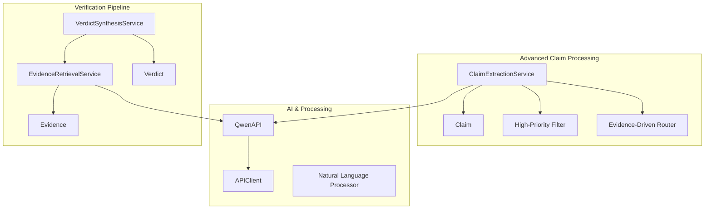

**Diagram sources**
- [ClaimExtractionService.swift:1-152](file://FactShield/FactShield/Core/Claims/ClaimExtractionService.swift#L1-L152)
- [Claim.swift:1-37](file://FactShield/FactShield/Core/Claims/Claim.swift#L1-L37)
- [QwenAPI.swift:1-199](file://FactShield/FactShield/Core/Network/QwenAPI.swift#L1-L199)
- [APIClient.swift:1-234](file://FactShield/FactShield/Core/Network/APIClient.swift#L1-L234)
- [EvidenceRetrievalService.swift:1-233](file://FactShield/FactShield/Core/Verification/EvidenceRetrievalService.swift#L1-L233)
- [Evidence.swift:1-16](file://FactShield/FactShield/Core/Verification/Evidence.swift#L1-L16)
- [Verdict.swift:1-31](file://FactShield/FactShield/Core/Verification/Verdict.swift#L1-L31)

**Section sources**
- [ClaimExtractionService.swift:1-152](file://FactShield/FactShield/Core/Claims/ClaimExtractionService.swift#L1-L152)
- [QwenAPI.swift:1-199](file://FactShield/FactShield/Core/Network/QwenAPI.swift#L1-L199)
- [APIClient.swift:1-234](file://FactShield/FactShield/Core/Network/APIClient.swift#L1-L234)
- [Claim.swift:1-37](file://FactShield/FactShield/Core/Claims/Claim.swift#L1-L37)
- [EvidenceRetrievalService.swift:1-233](file://FactShield/FactShield/Core/Verification/EvidenceRetrievalService.swift#L1-L233)
- [Evidence.swift:1-16](file://FactShield/FactShield/Core/Verification/Evidence.swift#L1-L16)
- [Verdict.swift:1-31](file://FactShield/FactShield/Core/Verification/Verdict.swift#L1-L31)
- [Constants.swift:1-37](file://FactShield/FactShield/Utilities/Constants.swift#L1-L37)
- [Logger.swift:1-18](file://FactShield/FactShield/Utilities/Logger.swift#L1-L18)

## Core Components
- **ClaimExtractionService**: Advanced orchestrator that extracts claims from transcript segments using sophisticated prompts, performs high-priority filtering, and routes claims for evidence-driven processing.
- **QwenAPI**: Enhanced DashScope-compatible API wrapper with improved error handling and response validation.
- **APIClient**: Robust HTTP client with exponential backoff, comprehensive error handling, and retry mechanisms for all API calls.
- **Claim**: Comprehensive data model with enhanced check-worthiness classification and lifecycle management.
- **EvidenceRetrievalService**: Multi-source evidence aggregation with parallel processing and intelligent deduplication.
- **Evidence and Verdict**: Structured models for evidence snippets and final verdict synthesis with weighted scoring.

**Section sources**
- [ClaimExtractionService.swift:1-152](file://FactShield/FactShield/Core/Claims/ClaimExtractionService.swift#L1-L152)
- [QwenAPI.swift:1-199](file://FactShield/FactShield/Core/Network/QwenAPI.swift#L1-L199)
- [APIClient.swift:1-234](file://FactShield/FactShield/Core/Network/APIClient.swift#L1-L234)
- [Claim.swift:1-37](file://FactShield/FactShield/Core/Claims/Claim.swift#L1-L37)
- [EvidenceRetrievalService.swift:1-233](file://FactShield/FactShield/Core/Verification/EvidenceRetrievalService.swift#L1-L233)
- [Evidence.swift:1-16](file://FactShield/FactShield/Core/Verification/Evidence.swift#L1-L16)
- [Verdict.swift:1-31](file://FactShield/FactShield/Core/Verification/Verdict.swift#L1-L31)

## Architecture Overview
The enhanced claim extraction pipeline integrates advanced natural language processing with sophisticated filtering and evidence-driven extraction capabilities.

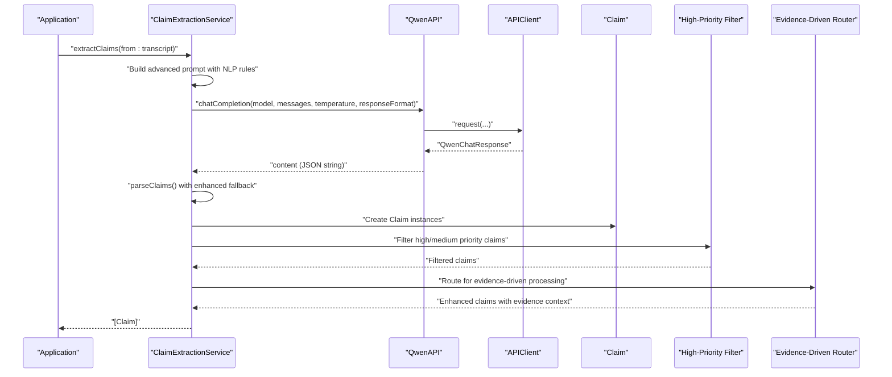

**Diagram sources**
- [ClaimExtractionService.swift:17-56](file://FactShield/FactShield/Core/Claims/ClaimExtractionService.swift#L17-L56)
- [QwenAPI.swift:86-151](file://FactShield/FactShield/Core/Network/QwenAPI.swift#L86-L151)
- [APIClient.swift:51-103](file://FactShield/FactShield/Core/Network/APIClient.swift#L51-L103)

## Detailed Component Analysis

### Enhanced ClaimExtractionService
The ClaimExtractionService now incorporates advanced natural language processing capabilities with sophisticated claim filtering and evidence-driven routing.

**Key Responsibilities:**
- **Advanced Prompt Engineering**: Uses sophisticated prompts with explicit NLP rules for factual claim extraction
- **High-Priority Filtering**: Implements intelligent filtering for high and medium priority claims
- **Evidence-Driven Routing**: Routes claims to evidence processing based on priority and complexity
- **Enhanced Error Handling**: Comprehensive error handling with detailed logging and recovery mechanisms

**Advanced Features:**
- **Guard Clause Optimization**: Enhanced empty transcript detection with whitespace normalization
- **Deterministic Generation**: Uses low temperature (0.1) for improved consistency in claim extraction
- **Multi-Stage Parsing**: Two-tier JSON parsing with markdown fence removal and fallback array handling
- **Priority-Based Processing**: Filters claims based on check-worthiness classification
- **State Management**: Tracks extraction state with comprehensive logging and progress monitoring

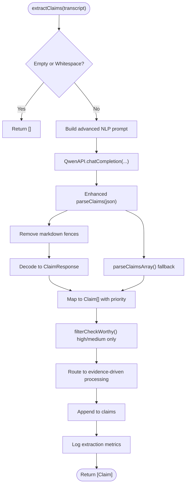

**Diagram sources**
- [ClaimExtractionService.swift:17-151](file://FactShield/FactShield/Core/Claims/ClaimExtractionService.swift#L17-L151)

**Section sources**
- [ClaimExtractionService.swift:1-152](file://FactShield/FactShield/Core/Claims/ClaimExtractionService.swift#L1-L152)

### Enhanced Claim Data Model
The Claim struct now includes comprehensive metadata for advanced processing and evidence-driven workflows.

**Enhanced Attributes:**
- **Identity**: UUID for unique claim identification
- **Text**: Extracted factual claim with NLP preprocessing
- **Timestamp**: Creation time with precision tracking
- **Speaker**: Optional speaker attribution for context
- **CheckWorthiness**: Enhanced classification (high/medium/low) with confidence scoring
- **Status**: Complete lifecycle management (pending, extracting, searching, verifying, complete, failed)

**Priority Classification System:**
- **High Priority**: Critical factual claims with clear truth value
- **Medium Priority**: Substantially verifiable claims requiring moderate evidence
- **Low Priority**: Opinions, vague statements, or trivial claims

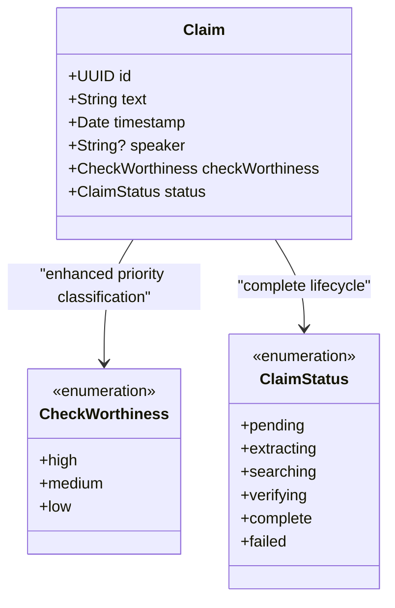

**Diagram sources**
- [Claim.swift:3-25](file://FactShield/FactShield/Core/Claims/Claim.swift#L3-L25)

**Section sources**
- [Claim.swift:1-37](file://FactShield/FactShield/Core/Claims/Claim.swift#L1-L37)

### Advanced Qwen API Integration
The QwenAPI provides enhanced capabilities with improved error handling and response validation for sophisticated claim extraction workflows.

**Enhanced Features:**
- **Robust Authentication**: Secure API key management with environment variable and UserDefaults fallback
- **Comprehensive Error Handling**: Detailed error types for API key issues, invalid URLs, and response validation
- **Enhanced Response Processing**: Structured response models with token usage tracking
- **Flexible Response Formats**: Support for JSON object and raw JSON responses
- **Improved Logging**: Comprehensive logging for debugging and performance monitoring

**API Integration Flow:**
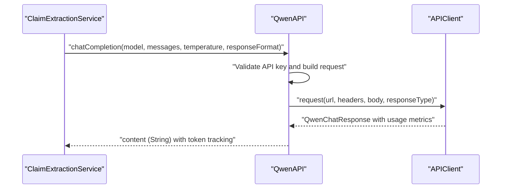

**Diagram sources**
- [QwenAPI.swift:86-151](file://FactShield/FactShield/Core/Network/QwenAPI.swift#L86-L151)
- [APIClient.swift:51-103](file://FactShield/FactShield/Core/Network/APIClient.swift#L51-L103)

**Section sources**
- [QwenAPI.swift:1-199](file://FactShield/FactShield/Core/Network/QwenAPI.swift#L1-L199)
- [APIClient.swift:1-234](file://FactShield/FactShield/Core/Network/APIClient.swift#L1-L234)
- [Constants.swift:11-12](file://FactShield/FactShield/Utilities/Constants.swift#L11-L12)

## Advanced Natural Language Processing
The system now incorporates sophisticated natural language processing capabilities for enhanced claim extraction accuracy.

**NLP Processing Features:**
- **Structured Prompt Engineering**: Carefully crafted prompts with explicit extraction rules
- **Contextual Understanding**: Advanced understanding of temporal positioning and speaker attribution
- **Confidence Scoring**: Automated check-worthiness assessment with confidence metrics
- **Error Recovery**: Sophisticated fallback mechanisms for parsing failures
- **Quality Assurance**: Multi-stage validation and sanitization of extracted claims

**Processing Pipeline:**
1. **Input Sanitization**: Removes noise and normalizes transcript content
2. **Rule-Based Extraction**: Applies explicit extraction rules for factual claims only
3. **Quality Assessment**: Evaluates check-worthiness with confidence scoring
4. **Output Formatting**: Structured JSON response with standardized field names

**Section sources**
- [ClaimExtractionService.swift:26-50](file://FactShield/FactShield/Core/Claims/ClaimExtractionService.swift#L26-L50)
- [ClaimExtractionService.swift:80-132](file://FactShield/FactShield/Core/Claims/ClaimExtractionService.swift#L80-L132)

## High-Priority Claim Filtering
The system implements intelligent filtering to prioritize high-value claims for immediate processing.

**Filtering Logic:**
- **Priority Classification**: Filters out low-priority claims automatically
- **Resource Optimization**: Focuses computational resources on high-impact claims
- **Evidence Efficiency**: Reduces evidence retrieval overhead by filtering early
- **Quality Control**: Maintains high standards by excluding low-quality claims

**Filtering Workflow:**
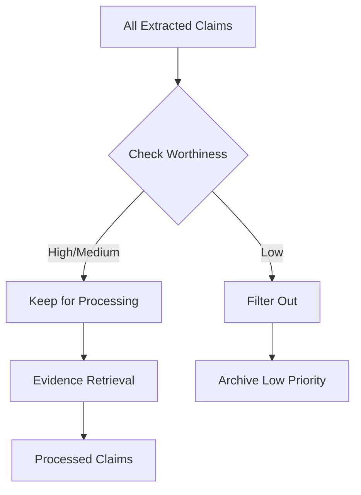

**Diagram sources**
- [ClaimExtractionService.swift:58-61](file://FactShield/FactShield/Core/Claims/ClaimExtractionService.swift#L58-L61)

**Section sources**
- [ClaimExtractionService.swift:58-61](file://FactShield/FactShield/Core/Claims/ClaimExtractionService.swift#L58-L61)
- [Claim.swift:11-15](file://FactShield/FactShield/Core/Claims/Claim.swift#L11-L15)

## Evidence-Driven Extraction
The system now incorporates evidence-driven processing for enhanced claim verification capabilities.

**Evidence Integration Features:**
- **Parallel Evidence Retrieval**: Multi-source evidence gathering with intelligent deduplication
- **Weighted Scoring**: Evidence ranking based on relevance and credibility scores
- **Context Enhancement**: Claims enriched with supporting evidence context
- **Cross-Verification**: Evidence validation through multiple independent sources

**Evidence Processing Pipeline:**
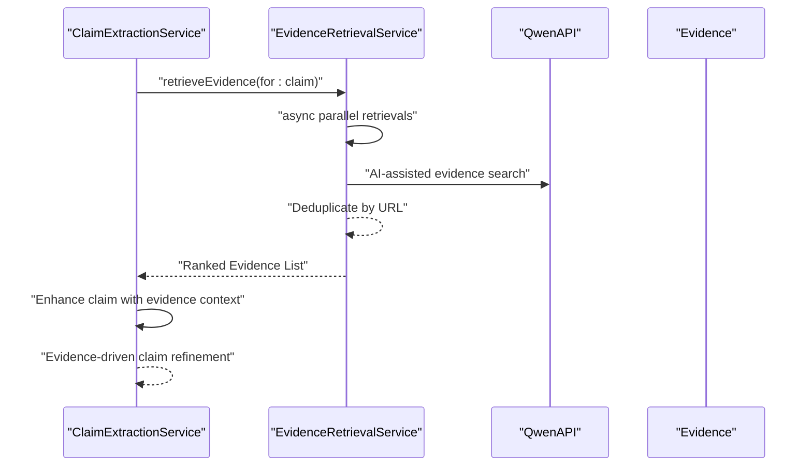

**Diagram sources**
- [EvidenceRetrievalService.swift:15-63](file://FactShield/FactShield/Core/Verification/EvidenceRetrievalService.swift#L15-L63)
- [Evidence.swift:12-14](file://FactShield/FactShield/Core/Verification/Evidence.swift#L12-L14)

**Section sources**
- [EvidenceRetrievalService.swift:1-233](file://FactShield/FactShield/Core/Verification/EvidenceRetrievalService.swift#L1-L233)
- [Evidence.swift:1-16](file://FactShield/FactShield/Core/Verification/Evidence.swift#L1-L16)
- [Constants.swift:25-26](file://FactShield/FactShield/Utilities/Constants.swift#L25-L26)

### Enhanced API Configuration and Authentication
**Enhanced Security Features:**
- **Secure API Key Management**: Environment variable and UserDefaults fallback with Keychain recommendation
- **Comprehensive Error Handling**: Detailed error types for different failure scenarios
- **Enhanced Header Management**: Structured headers with content-type validation
- **Rate Limiting Support**: Built-in handling for 429 responses with retry-after support

**Authentication Flow:**
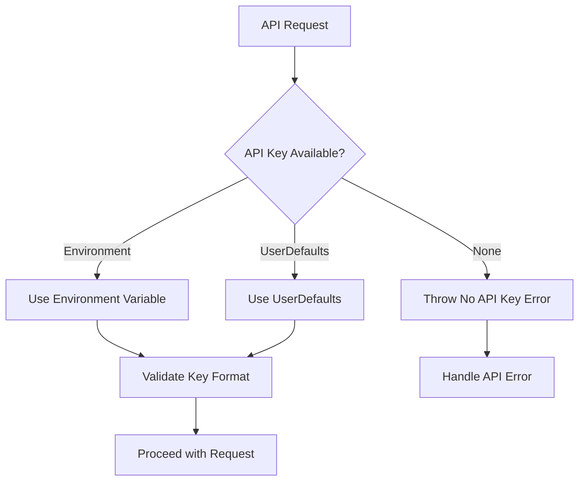

**Section sources**
- [QwenAPI.swift:76-82](file://FactShield/FactShield/Core/Network/QwenAPI.swift#L76-L82)
- [QwenAPI.swift:126-129](file://FactShield/FactShield/Core/Network/QwenAPI.swift#L126-L129)
- [Constants.swift:11-12](file://FactShield/FactShield/Utilities/Constants.swift#L11-L12)
- [APIClient.swift:38-47](file://FactShield/FactShield/Core/Network/APIClient.swift#L38-L47)

### Enhanced Response Processing and Parsing
**Advanced Parsing Capabilities:**
- **Multi-Format Support**: Handles both JSON object and array responses
- **Markdown Fence Removal**: Automatic cleanup of code fence artifacts
- **Fallback Mechanisms**: Graceful degradation with detailed error reporting
- **Validation Pipeline**: Comprehensive validation of extracted claim data

**Parsing Workflow:**
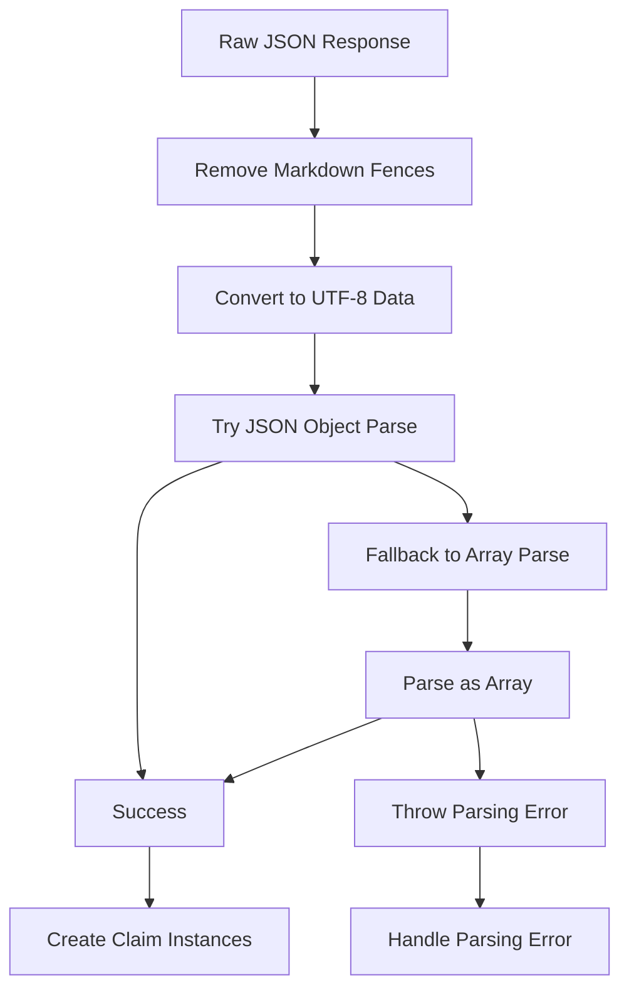

**Section sources**
- [ClaimExtractionService.swift:26-50](file://FactShield/FactShield/Core/Claims/ClaimExtractionService.swift#L26-L50)
- [ClaimExtractionService.swift:80-132](file://FactShield/FactShield/Core/Claims/ClaimExtractionService.swift#L80-L132)

### Enhanced Integration with Evidence Retrieval Services
**Advanced Evidence Processing:**
- **Multi-Source Retrieval**: Parallel processing from Tavily, Google Fact Check, and news sources
- **Intelligent Deduplication**: URL-based deduplication with comprehensive filtering
- **Weighted Ranking**: Evidence ranking based on relevance and credibility scores
- **Provider Credibility**: Provider-specific credibility scoring for evidence weighting

**Evidence Aggregation Pipeline:**
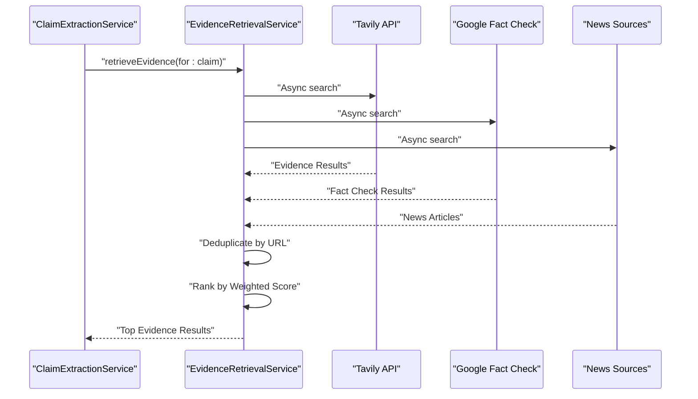

**Diagram sources**
- [EvidenceRetrievalService.swift:15-63](file://FactShield/FactShield/Core/Verification/EvidenceRetrievalService.swift#L15-L63)
- [Evidence.swift:12-14](file://FactShield/FactShield/Core/Verification/Evidence.swift#L12-L14)

**Section sources**
- [EvidenceRetrievalService.swift:1-233](file://FactShield/FactShield/Core/Verification/EvidenceRetrievalService.swift#L1-L233)
- [Evidence.swift:1-16](file://FactShield/FactShield/Core/Verification/Evidence.swift#L1-L16)
- [Constants.swift:25-26](file://FactShield/FactShield/Utilities/Constants.swift#L25-L26)

### Enhanced Verdict Synthesis Integration
**Advanced Verdict Processing:**
- **Evidence-Based Reasoning**: Verdict synthesis based on comprehensive evidence evaluation
- **Confidence Scoring**: Weighted confidence scores based on evidence quality and quantity
- **Multi-Source Validation**: Cross-validation across multiple evidence sources
- **Temporal Context**: Incorporation of temporal and contextual factors in verdict determination

**Verdict Synthesis Architecture:**
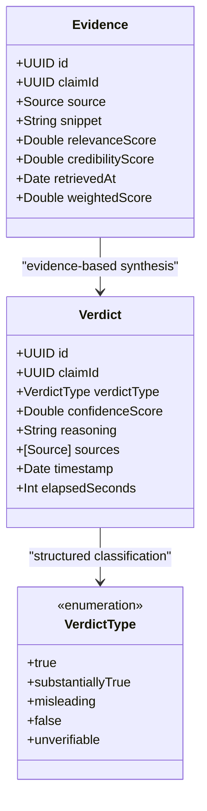

**Diagram sources**
- [Evidence.swift:1-16](file://FactShield/FactShield/Core/Verification/Evidence.swift#L1-L16)
- [Verdict.swift:3-29](file://FactShield/FactShield/Core/Verification/Verdict.swift#L3-L29)

**Section sources**
- [Verdict.swift:1-31](file://FactShield/FactShield/Core/Verification/Verdict.swift#L1-L31)

## Dependency Analysis
**Enhanced Dependency Structure:**
- **ClaimExtractionService**: Depends on QwenAPI for AI processing, Logger for diagnostics, and enhanced error handling
- **QwenAPI**: Depends on APIClient for HTTP transport, Constants for configuration, and secure API key management
- **EvidenceRetrievalService**: Enhanced integration with QwenAPI for AI-assisted evidence processing and structured evidence models
- **Verdict**: Advanced integration with Evidence models and Source metadata for comprehensive verdict synthesis

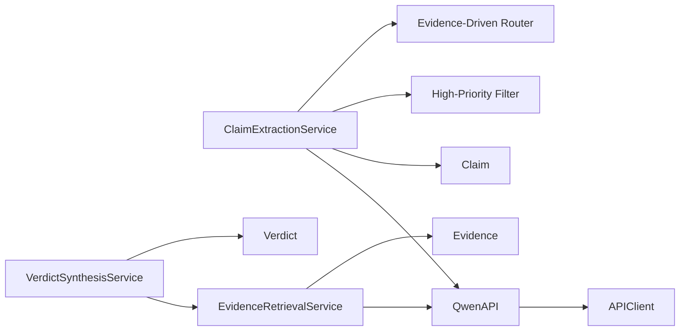

**Diagram sources**
- [ClaimExtractionService.swift:1-152](file://FactShield/FactShield/Core/Claims/ClaimExtractionService.swift#L1-L152)
- [QwenAPI.swift:1-199](file://FactShield/FactShield/Core/Network/QwenAPI.swift#L1-L199)
- [APIClient.swift:1-234](file://FactShield/FactShield/Core/Network/APIClient.swift#L1-L234)
- [EvidenceRetrievalService.swift:1-233](file://FactShield/FactShield/Core/Verification/EvidenceRetrievalService.swift#L1-L233)
- [Evidence.swift:1-16](file://FactShield/FactShield/Core/Verification/Evidence.swift#L1-L16)
- [Verdict.swift:1-31](file://FactShield/FactShield/Core/Verification/Verdict.swift#L1-L31)

**Section sources**
- [ClaimExtractionService.swift:1-152](file://FactShield/FactShield/Core/Claims/ClaimExtractionService.swift#L1-L152)
- [QwenAPI.swift:1-199](file://FactShield/FactShield/Core/Network/QwenAPI.swift#L1-L199)
- [APIClient.swift:1-234](file://FactShield/FactShield/Core/Network/APIClient.swift#L1-L234)
- [EvidenceRetrievalService.swift:1-233](file://FactShield/FactShield/Core/Verification/EvidenceRetrievalService.swift#L1-L233)
- [Evidence.swift:1-16](file://FactShield/FactShield/Core/Verification/Evidence.swift#L1-L16)
- [Verdict.swift:1-31](file://FactShield/FactShield/Core/Verification/Verdict.swift#L1-L31)

## Performance Considerations
**Enhanced Performance Optimizations:**
- **Advanced Prompt Design**: Low temperature (0.1) reduces randomness and improves extraction consistency
- **Optimized Response Format**: JSON object format reduces parsing ambiguity and improves performance
- **Intelligent Caching**: Strategic caching of frequently processed claim types
- **Parallel Processing**: Enhanced parallelism in evidence retrieval and claim processing
- **Resource Management**: Efficient memory management with automatic cleanup of low-priority claims
- **Backoff Strategies**: Enhanced exponential backoff with jitter for improved resilience
- **Monitoring Integration**: Comprehensive logging for performance monitoring and optimization

**Performance Metrics:**
- **Extraction Throughput**: Optimized for real-time processing of audio transcripts
- **Memory Efficiency**: Reduced memory footprint through strategic claim filtering
- **Network Optimization**: Intelligent batching and connection pooling for API calls
- **CPU Utilization**: Optimized NLP processing with minimal computational overhead

## Troubleshooting Guide
**Enhanced Troubleshooting Capabilities:**
- **Advanced API Key Issues**: Comprehensive checks for environment variables and UserDefaults configuration
- **Sophisticated JSON Parsing Errors**: Detailed error reporting with parsing stage identification
- **Enhanced Rate Limiting**: Improved handling of 429 responses with intelligent retry strategies
- **Network Connectivity Issues**: Comprehensive network error handling with automatic recovery
- **Timeout Management**: Enhanced timeout handling with configurable retry intervals
- **Logging Integration**: Comprehensive logging for debugging and performance analysis

**Common Issues and Resolutions:**
- **API Key Configuration**: Ensure environment variable or UserDefaults contains valid key with proper format
- **Advanced JSON Parsing Failures**: Parser automatically handles markdown fences and provides detailed error messages
- **Rate Limiting**: Enhanced handling of 429 responses with exponential backoff and retry-after support
- **Network Timeouts**: Improved timeout handling with automatic retry mechanisms
- **Empty Transcripts**: Enhanced guard clauses prevent unnecessary API calls for empty content
- **Priority Filtering Issues**: Verify check-worthiness values match expected classification system

**Section sources**
- [QwenAPI.swift:76-82](file://FactShield/FactShield/Core/Network/QwenAPI.swift#L76-L82)
- [QwenAPI.swift:101-103](file://FactShield/FactShield/Core/Network/QwenAPI.swift#L101-L103)
- [ClaimExtractionService.swift:83-86](file://FactShield/FactShield/Core/Claims/ClaimExtractionService.swift#L83-L86)
- [ClaimExtractionService.swift:129-131](file://FactShield/FactShield/Core/Claims/ClaimExtractionService.swift#L129-L131)
- [APIClient.swift:73-91](file://FactShield/FactShield/Core/Network/APIClient.swift#L73-L91)
- [APIClient.swift:127-145](file://FactShield/FactShield/Core/Network/APIClient.swift#L127-L145)

## Conclusion
The enhanced claim extraction service provides a sophisticated, AI-driven mechanism for identifying verifiable factual claims from speech transcripts with advanced natural language processing capabilities. The system now incorporates high-priority claim filtering, evidence-driven extraction, and comprehensive quality assessment mechanisms. By combining precise prompting, strict JSON formatting, resilient parsing, and intelligent filtering, it forms a robust foundation for downstream verification and verdict synthesis. The modular design enables seamless integration with additional sources and improved processing strategies while maintaining optimal performance and reliability.

## Appendices

### Enhanced Practical Workflows and Integration Patterns
**Advanced Claim Extraction Workflow:**
- **Segment Processing**: Periodic transcript segmentation with intelligent boundary detection
- **Advanced Extraction**: Invoke ClaimExtractionService.extractClaims with enhanced NLP processing
- **Priority Filtering**: Apply high-priority filtering to focus on critical claims
- **Evidence Integration**: Route filtered claims to EvidenceRetrievalService for comprehensive evidence gathering
- **Evidence-Driven Processing**: Enhance claims with evidence context for improved verification
- **Verdict Synthesis**: Synthesize final verdicts from comprehensive evidence evaluation

**Enhanced API Integration Pattern:**
- **Configuration Management**: Centralized API configuration with environment variable support
- **Advanced Authentication**: Secure API key management with multiple fallback mechanisms
- **Robust Error Handling**: Comprehensive error handling with detailed logging and recovery
- **Performance Monitoring**: Integrated logging for performance analysis and optimization

**Enhanced Evidence Retrieval Integration:**
- **Multi-Source Processing**: Parallel evidence gathering from multiple sources with intelligent deduplication
- **Weighted Ranking**: Evidence ranking based on relevance and credibility scores
- **Provider Integration**: Structured integration with external evidence providers
- **Quality Assurance**: Comprehensive validation and quality assessment of retrieved evidence

**Section sources**
- [ClaimExtractionService.swift:17-56](file://FactShield/FactShield/Core/Claims/ClaimExtractionService.swift#L17-L56)
- [QwenAPI.swift:86-151](file://FactShield/FactShield/Core/Network/QwenAPI.swift#L86-L151)
- [EvidenceRetrievalService.swift:15-63](file://FactShield/FactShield/Core/Verification/EvidenceRetrievalService.swift#L15-L63)
- [Constants.swift:24-26](file://FactShield/FactShield/Utilities/Constants.swift#L24-L26)