# Core Services

<cite>
**Referenced Files in This Document**
- [AudioCaptureService.swift](file://FactShield/FactShield/Core/Audio/AudioCaptureService.swift)
- [AudioBufferProcessor.swift](file://FactShield/FactShield/Core/Audio/AudioBufferProcessor.swift)
- [AudioSessionManager.swift](file://FactShield/FactShield/Core/Audio/AudioSessionManager.swift)
- [SpeechRecognitionService.swift](file://FactShield/FactShield/Core/Speech/SpeechRecognitionService.swift)
- [TranscriptManager.swift](file://FactShield/FactShield/Core/Speech/TranscriptManager.swift)
- [ClaimExtractionService.swift](file://FactShield/FactShield/Core/Claims/ClaimExtractionService.swift)
- [EvidenceRetrievalService.swift](file://FactShield/FactShield/Core/Verification/EvidenceRetrievalService.swift)
- [VerdictSynthesisService.swift](file://FactShield/FactShield/Core/Verification/VerdictSynthesisService.swift)
- [QwenAPI.swift](file://FactShield/FactShield/Core/Network/QwenAPI.swift)
- [APIClient.swift](file://FactShield/FactShield/Core/Network/APIClient.swift)
- [FactCheckSession.swift](file://FactShield/FactShield/Models/FactCheckSession.swift)
- [Enums.swift](file://FactShield/FactShield/Utilities/Enums.swift)
- [Constants.swift](file://FactShield/FactShield/Utilities/Constants.swift)
- [Logger.swift](file://FactShield/FactShield/Utilities/Logger.swift)
- [extractor.js](file://FactShield-ChromeExtension/src/content/extractor.js)
- [pipeline.js](file://FactShield-ChromeExtension/src/api/pipeline.js)
- [qwen.js](file://FactShield-ChromeExtension/src/api/qwen.js)
- [service-worker.js](file://FactShield-ChromeExtension/src/background/service-worker.js)
- [constants.js](file://FactShield-ChromeExtension/src/shared/constants.js)
- [messages.js](file://FactShield-ChromeExtension/src/shared/messages.js)
</cite>

## Update Summary
**Changes Made**
- Added comprehensive browser extension architecture with multi-platform content extraction
- Integrated AI-powered verification pipeline with YouTube, Twitter/X, Instagram, and generic site support
- Enhanced evidence retrieval service with parallel provider integration
- Added real-time communication flow between extension components
- Updated architecture diagrams to reflect the new distributed system

## Table of Contents
1. [Introduction](#introduction)
2. [Project Structure](#project-structure)
3. [Core Components](#core-components)
4. [Architecture Overview](#architecture-overview)
5. [Detailed Component Analysis](#detailed-component-analysis)
6. [Browser Extension Integration](#browser-extension-integration)
7. [Dependency Analysis](#dependency-analysis)
8. [Performance Considerations](#performance-considerations)
9. [Troubleshooting Guide](#troubleshooting-guide)
10. [Conclusion](#conclusion)
11. [Appendices](#appendices)

## Introduction
This document describes the core services powering the FactChecking Live system, now enhanced with comprehensive browser extension capabilities for multi-platform content extraction and AI-powered verification. The system integrates real-time audio capture, on-device speech recognition, AI-powered claim extraction using Qwen API integration, multi-source evidence retrieval with provider strategies and result validation, and the verdict synthesis service that generates final verdicts with confidence scores and reasoning chains. It also documents service interfaces, dependency injection patterns, error handling, and performance considerations, along with practical usage examples and the new browser extension architecture.

## Project Structure
The core services are organized by domain with enhanced browser extension integration:
- Audio: real-time capture, buffer management, and session configuration
- Speech: on-device recognition, partial results, and transcript management
- Claims: AI-driven claim extraction with quality assessment
- Verification: evidence retrieval across providers and verdict synthesis
- Network: Qwen API client and generic HTTP client
- Browser Extension: Content scripts for multi-platform extraction, background service worker, and side panel UI
- Models and utilities: session models, enums, constants, and logging

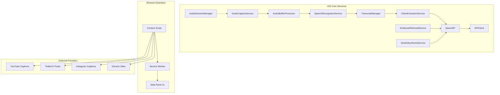

**Diagram sources**
- [AudioCaptureService.swift:1-51](file://FactShield/FactShield/Core/Audio/AudioCaptureService.swift#L1-L51)
- [AudioBufferProcessor.swift:1-42](file://FactShield/FactShield/Core/Audio/AudioBufferProcessor.swift#L1-L42)
- [AudioSessionManager.swift:1-23](file://FactShield/FactShield/Core/Audio/AudioSessionManager.swift#L1-L23)
- [SpeechRecognitionService.swift:1-138](file://FactShield/FactShield/Core/Speech/SpeechRecognitionService.swift#L1-L138)
- [TranscriptManager.swift:1-53](file://FactShield/FactShield/Core/Speech/TranscriptManager.swift#L1-L53)
- [ClaimExtractionService.swift:1-152](file://FactShield/FactShield/Core/Claims/ClaimExtractionService.swift#L1-L152)
- [EvidenceRetrievalService.swift:1-233](file://FactShield/FactShield/Core/Verification/EvidenceRetrievalService.swift#L1-L233)
- [VerdictSynthesisService.swift:1-184](file://FactShield/FactShield/Core/Verification/VerdictSynthesisService.swift#L1-L184)
- [QwenAPI.swift:1-199](file://FactShield/FactShield/Core/Network/QwenAPI.swift#L1-L199)
- [APIClient.swift](file://FactShield/FactShield/Core/Network/APIClient.swift)
- [extractor.js:14-21](file://FactShield-ChromeExtension/src/content/extractor.js#L14-L21)
- [service-worker.js:17-18](file://FactShield-ChromeExtension/src/background/service-worker.js#L17-L18)

**Section sources**
- [AudioCaptureService.swift:1-51](file://FactShield/FactShield/Core/Audio/AudioCaptureService.swift#L1-L51)
- [AudioBufferProcessor.swift:1-42](file://FactShield/FactShield/Core/Audio/AudioBufferProcessor.swift#L1-L42)
- [AudioSessionManager.swift:1-23](file://FactShield/FactShield/Core/Audio/AudioSessionManager.swift#L1-L23)
- [SpeechRecognitionService.swift:1-138](file://FactShield/FactShield/Core/Speech/SpeechRecognitionService.swift#L1-L138)
- [TranscriptManager.swift:1-53](file://FactShield/FactShield/Core/Speech/TranscriptManager.swift#L1-L53)
- [ClaimExtractionService.swift:1-152](file://FactShield/FactShield/Core/Claims/ClaimExtractionService.swift#L1-L152)
- [EvidenceRetrievalService.swift:1-233](file://FactShield/FactShield/Core/Verification/EvidenceRetrievalService.swift#L1-L233)
- [VerdictSynthesisService.swift:1-184](file://FactShield/FactShield/Core/Verification/VerdictSynthesisService.swift#L1-L184)
- [QwenAPI.swift:1-199](file://FactShield/FactShield/Core/Network/QwenAPI.swift#L1-L199)
- [APIClient.swift](file://FactShield/FactShield/Core/Network/APIClient.swift)
- [FactCheckSession.swift:1-54](file://FactShield/FactShield/Models/FactCheckSession.swift#L1-L54)
- [Enums.swift:1-48](file://FactShield/FactShield/Utilities/Enums.swift#L1-L48)
- [Constants.swift:1-37](file://FactShield/FactShield/Utilities/Constants.swift#L1-L37)
- [Logger.swift:1-18](file://FactShield/FactShield/Utilities/Logger.swift#L1-L18)
- [extractor.js:14-21](file://FactShield-ChromeExtension/src/content/extractor.js#L14-L21)
- [service-worker.js:17-18](file://FactShield-ChromeExtension/src/background/service-worker.js#L17-L18)

## Core Components
- AudioCaptureService: Real-time audio capture via AVAudioEngine, tap installation, and buffer dispatch to a dedicated queue.
- AudioBufferProcessor: Accumulates recent buffers up to a duration limit and forwards them to the speech recognizer.
- AudioSessionManager: Configures the audio session for capture with echo cancellation and Bluetooth A2DP support.
- SpeechRecognitionService: On-device speech recognition with partial results, rolling transcript buffer, and automatic restart on errors.
- TranscriptManager: Maintains a rolling set of transcript segments with timestamps and confidence, enabling recent-window queries.
- ClaimExtractionService: AI-powered claim extraction using Qwen API, with robust JSON parsing and filtering by check-worthiness.
- EvidenceRetrievalService: Multi-source evidence gathering (simulated via Qwen in phase 1), deduplication, sorting, and top-N selection.
- VerdictSynthesisService: Final verdict generation with confidence scoring, reasoning chain, and optional evidence-less synthesis.
- QwenAPI: Generic client for DashScope-compatible Qwen chat completions with JSON response support and usage logging.
- APIClient: Generic HTTP client used by QwenAPI for requests.
- FactCheckSession: Session model capturing transcript, claims, verdicts, and status.
- Enums and Constants: Shared enums (e.g., audio quality), app-wide constants, and centralized error types.
- Logger: Centralized logging categories for subsystems.
- **New**: ContentExtractor: Multi-platform content extraction for YouTube captions, Twitter/X posts, Instagram captions, and generic websites.
- **New**: FactCheckPipeline: Orchestrates the complete verification pipeline with claim extraction, evidence gathering, and verdict synthesis.
- **New**: ServiceWorker: Manages extension lifecycle, routes messages between components, and coordinates the verification process.
- **New**: Browser Extension Architecture: Complete system for real-time content extraction and AI-powered fact-checking across platforms.

**Section sources**
- [AudioCaptureService.swift:1-51](file://FactShield/FactShield/Core/Audio/AudioCaptureService.swift#L1-L51)
- [AudioBufferProcessor.swift:1-42](file://FactShield/FactShield/Core/Audio/AudioBufferProcessor.swift#L1-L42)
- [AudioSessionManager.swift:1-23](file://FactShield/FactShield/Core/Audio/AudioSessionManager.swift#L1-L23)
- [SpeechRecognitionService.swift:1-138](file://FactShield/FactShield/Core/Speech/SpeechRecognitionService.swift#L1-L138)
- [TranscriptManager.swift:1-53](file://FactShield/FactShield/Core/Speech/TranscriptManager.swift#L1-L53)
- [ClaimExtractionService.swift:1-152](file://FactShield/FactShield/Core/Claims/ClaimExtractionService.swift#L1-L152)
- [EvidenceRetrievalService.swift:1-233](file://FactShield/FactShield/Core/Verification/EvidenceRetrievalService.swift#L1-L233)
- [VerdictSynthesisService.swift:1-184](file://FactShield/FactShield/Core/Verification/VerdictSynthesisService.swift#L1-L184)
- [QwenAPI.swift:1-199](file://FactShield/FactShield/Core/Network/QwenAPI.swift#L1-L199)
- [APIClient.swift](file://FactShield/FactShield/Core/Network/APIClient.swift)
- [FactCheckSession.swift:1-54](file://FactShield/FactShield/Models/FactCheckSession.swift#L1-L54)
- [Enums.swift:1-48](file://FactShield/FactShield/Utilities/Enums.swift#L1-L48)
- [Constants.swift:1-37](file://FactShield/FactShield/Utilities/Constants.swift#L1-L37)
- [Logger.swift:1-18](file://FactShield/FactShield/Utilities/Logger.swift#L1-L18)
- [extractor.js:14-21](file://FactShield-ChromeExtension/src/content/extractor.js#L14-L21)
- [pipeline.js:13-20](file://FactShield-ChromeExtension/src/api/pipeline.js#L13-L20)
- [service-worker.js:8-18](file://FactShield-ChromeExtension/src/background/service-worker.js#L8-L18)

## Architecture Overview
The system integrates real-time audio capture with on-device speech recognition, followed by AI-assisted claim extraction, evidence gathering, and final verdict synthesis. The architecture now includes a comprehensive browser extension that provides multi-platform content extraction capabilities. Services are loosely coupled via dependency injection (shared singletons) and communicate primarily through structured prompts and JSON responses.

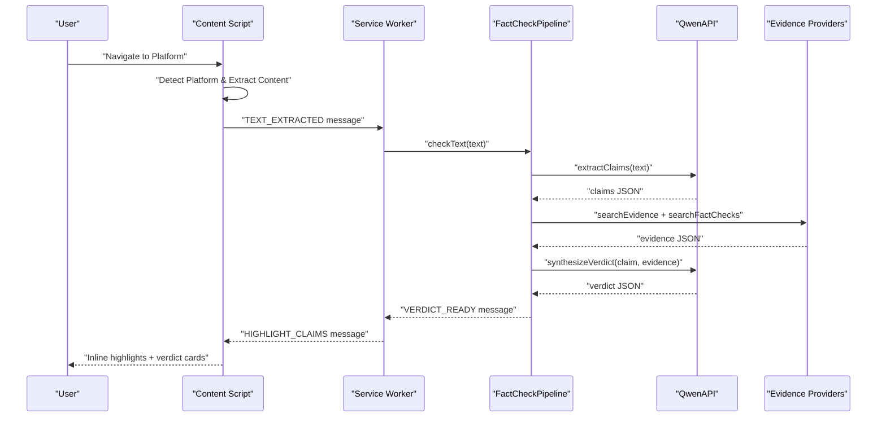

**Diagram sources**
- [extractor.js:181-196](file://FactShield-ChromeExtension/src/content/extractor.js#L181-L196)
- [service-worker.js:197-240](file://FactShield-ChromeExtension/src/background/service-worker.js#L197-L240)
- [pipeline.js:71-113](file://FactShield-ChromeExtension/src/api/pipeline.js#L71-L113)
- [messages.js:4-26](file://FactShield-ChromeExtension/src/shared/messages.js#L4-L26)

## Detailed Component Analysis

### Audio Processing Pipeline
- Real-time capture: AudioCaptureService configures an AVAudioEngine input node, installs a tap with a fixed buffer size, and dispatches buffers to a user-interactive queue. It logs engine preparation and start/stop lifecycle.
- Buffer management: AudioBufferProcessor maintains a rolling accumulation of recent buffers, trims by duration and count thresholds, and forwards each buffer to the speech recognizer.
- Quality optimization: AudioSessionManager sets the audio session category to play-and-record with voice-chat mode to enable AEC and allows Bluetooth A2DP. Constants define default sample rate and buffer size.

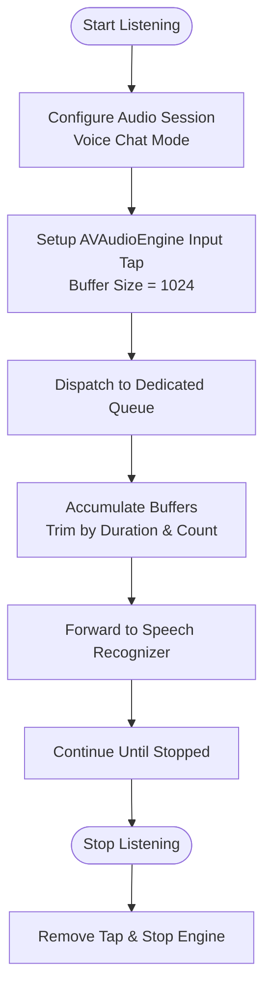

**Diagram sources**
- [AudioCaptureService.swift:19-40](file://FactShield/FactShield/Core/Audio/AudioCaptureService.swift#L19-L40)
- [AudioBufferProcessor.swift:16-36](file://FactShield/FactShield/Core/Audio/AudioBufferProcessor.swift#L16-L36)
- [AudioSessionManager.swift:8-17](file://FactShield/FactShield/Core/Audio/AudioSessionManager.swift#L8-L17)
- [Constants.swift:14-17](file://FactShield/FactShield/Utilities/Constants.swift#L14-L17)

**Section sources**
- [AudioCaptureService.swift:1-51](file://FactShield/FactShield/Core/Audio/AudioCaptureService.swift#L1-L51)
- [AudioBufferProcessor.swift:1-42](file://FactShield/FactShield/Core/Audio/AudioBufferProcessor.swift#L1-L42)
- [AudioSessionManager.swift:1-23](file://FactShield/FactShield/Core/Audio/AudioSessionManager.swift#L1-L23)
- [Constants.swift:14-17](file://FactShield/FactShield/Utilities/Constants.swift#L14-L17)

### Speech Recognition Service
- On-device transcription: SpeechRecognitionService initializes SFSpeechRecognizer with en-US locale, requests authorization, and starts a recognition task with partial results enabled. It prefers on-device recognition when supported.
- Rolling transcript: Maintains a word-buffer capped at a maximum count and exposes recent transcript windows. Partial results update the current transcript and trigger downstream processing.
- Error handling: Catches recognition errors and restarts the recognition task after a brief delay to recover from transient issues.

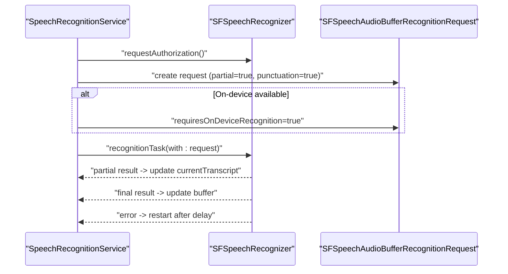

**Diagram sources**
- [SpeechRecognitionService.swift:23-84](file://FactShield/FactShield/Core/Speech/SpeechRecognitionService.swift#L23-L84)
- [SpeechRecognitionService.swift:116-130](file://FactShield/FactShield/Core/Speech/SpeechRecognitionService.swift#L116-L130)

**Section sources**
- [SpeechRecognitionService.swift:1-138](file://FactShield/FactShield/Core/Speech/SpeechRecognitionService.swift#L1-L138)
- [TranscriptManager.swift:1-53](file://FactShield/FactShield/Core/Speech/TranscriptManager.swift#L1-L53)
- [Constants.swift:19-21](file://FactShield/FactShield/Utilities/Constants.swift#L19-L21)

### Claim Extraction Service
- AI-powered extraction: Sends a structured prompt to Qwen API requesting verifiable claims with check-worthiness ratings. Parses JSON with robust cleaning and fallback parsing for arrays.
- Filtering: Filters out low check-worthiness claims and maintains a growing list of extracted claims.
- Reliability: Logs extraction counts and handles decoding errors with clear failure modes.

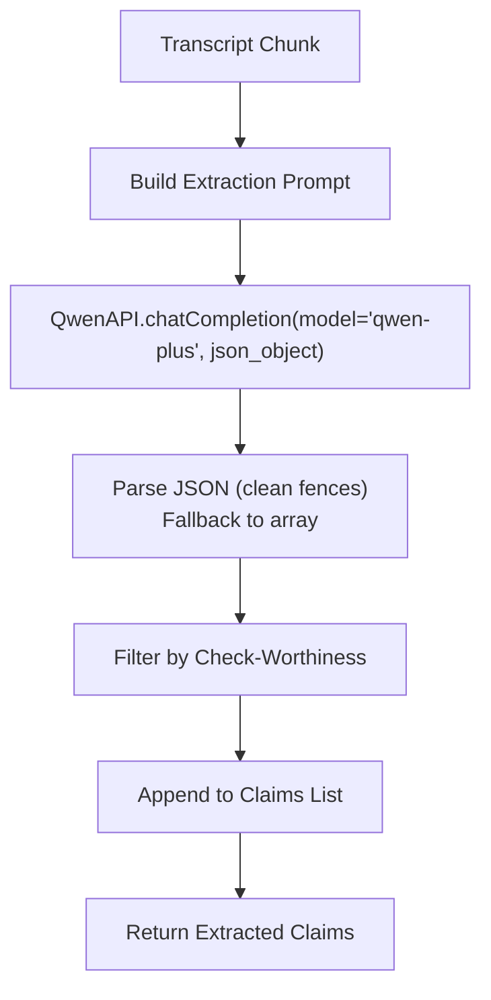

**Diagram sources**
- [ClaimExtractionService.swift:18-56](file://FactShield/FactShield/Core/Claims/ClaimExtractionService.swift#L18-L56)
- [ClaimExtractionService.swift:70-132](file://FactShield/FactShield/Core/Claims/ClaimExtractionService.swift#L70-L132)
- [QwenAPI.swift:94-151](file://FactShield/FactShield/Core/Network/QwenAPI.swift#L94-L151)

**Section sources**
- [ClaimExtractionService.swift:1-152](file://FactShield/FactShield/Core/Claims/ClaimExtractionService.swift#L1-L152)
- [QwenAPI.swift:1-199](file://FactShield/FactShield/Core/Network/QwenAPI.swift#L1-L199)

### Evidence Retrieval Service
- Multi-source gathering: Concurrently queries three simulated providers (Tavily, Google Fact Check, News) using Qwen chat completions. Aggregates, deduplicates by URL, sorts by weighted score, and selects top-N.
- Provider integration strategy: Uses provider-specific prompts and assigns credibility scores; results include relevance and credibility for downstream synthesis.
- Validation: Cleans JSON responses and validates structure; logs warnings on provider failures while continuing with available results.

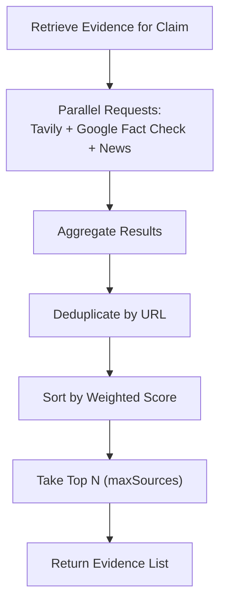

**Diagram sources**
- [EvidenceRetrievalService.swift:15-63](file://FactShield/FactShield/Core/Verification/EvidenceRetrievalService.swift#L15-L63)
- [EvidenceRetrievalService.swift:67-166](file://FactShield/FactShield/Core/Verification/EvidenceRetrievalService.swift#L67-L166)

**Section sources**
- [EvidenceRetrievalService.swift:1-233](file://FactShield/FactShield/Core/Verification/EvidenceRetrievalService.swift#L1-L233)
- [Constants.swift:23-26](file://FactShield/FactShield/Utilities/Constants.swift#L23-L26)

### Verdict Synthesis Service
- Chain-of-thought synthesis: Builds a structured prompt that asks the model to reason step-by-step, compare evidence, consider source credibility and bias, and produce a verdict with confidence and reasoning.
- Evidence-less synthesis: Provides a fallback prompt when no external evidence is available, emphasizing caution and transparency.
- Parsing and validation: Validates JSON structure, maps verdict types, clamps confidence, and records elapsed time for performance tracking.

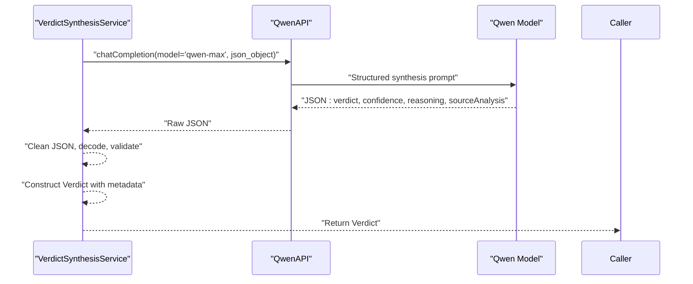

**Diagram sources**
- [VerdictSynthesisService.swift:30-80](file://FactShield/FactShield/Core/Verification/VerdictSynthesisService.swift#L30-L80)
- [VerdictSynthesisService.swift:82-121](file://FactShield/FactShield/Core/Verification/VerdictSynthesisService.swift#L82-L121)
- [VerdictSynthesisService.swift:125-165](file://FactShield/FactShield/Core/Verification/VerdictSynthesisService.swift#L125-L165)
- [QwenAPI.swift:94-151](file://FactShield/FactShield/Core/Network/QwenAPI.swift#L94-L151)

**Section sources**
- [VerdictSynthesisService.swift:1-184](file://FactShield/FactShield/Core/Verification/VerdictSynthesisService.swift#L1-L184)

### Network Layer: Qwen API Client
- Request construction: Converts message arrays to Qwen-compatible request bodies, applies response format hints, and attaches authorization headers.
- Response handling: Extracts content from the first choice, logs token usage, and surfaces structured errors for missing keys or invalid JSON.
- Raw JSON convenience: Provides a variant that returns the full JSON response as a dictionary for advanced parsing needs.

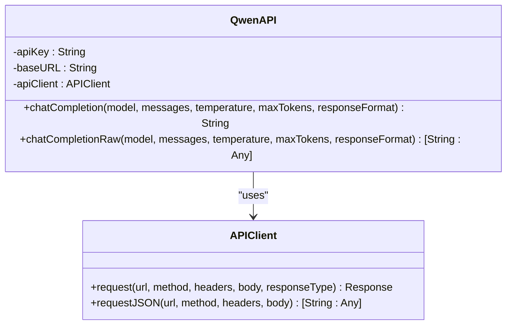

**Diagram sources**
- [QwenAPI.swift:68-199](file://FactShield/FactShield/Core/Network/QwenAPI.swift#L68-L199)
- [APIClient.swift](file://FactShield/FactShield/Core/Network/APIClient.swift)

**Section sources**
- [QwenAPI.swift:1-199](file://FactShield/FactShield/Core/Network/QwenAPI.swift#L1-L199)

### Session and Data Models
- FactCheckSession: Captures session lifecycle, transcript, claims, verdicts, and status. Includes capture mode enumeration.
- TranscriptSegment: Encapsulates per-segment text, timestamp, speaker, confidence, and finalization flag.
- Enums: App-wide enums for tabs, audio quality, and centralized error types.
- Constants: Centralized configuration for API base URL, audio defaults, speech limits, and pipeline intervals.

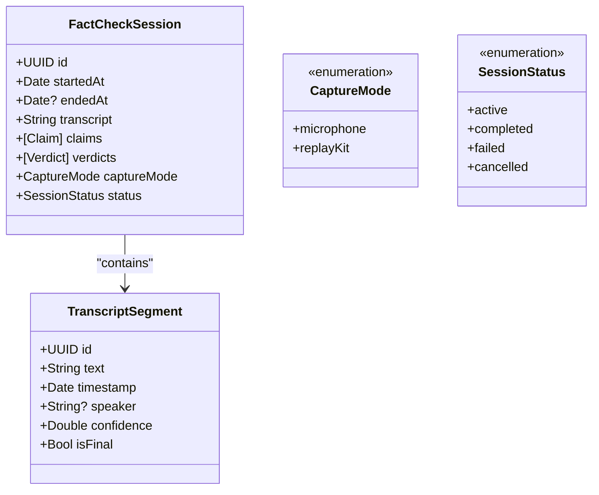

**Diagram sources**
- [FactCheckSession.swift:3-35](file://FactShield/FactShield/Models/FactCheckSession.swift#L3-L35)
- [FactCheckSession.swift:37-53](file://FactShield/FactShield/Models/FactCheckSession.swift#L37-L53)

**Section sources**
- [FactCheckSession.swift:1-54](file://FactShield/FactShield/Models/FactCheckSession.swift#L1-L54)
- [Enums.swift:1-48](file://FactShield/FactShield/Utilities/Enums.swift#L1-L48)
- [Constants.swift:1-37](file://FactShield/FactShield/Utilities/Constants.swift#L1-L37)

## Browser Extension Integration

### Multi-Platform Content Extraction
The browser extension provides comprehensive content extraction capabilities across multiple platforms:

- **YouTube Extraction**: Detects YouTube URLs and extracts visible caption segments, video metadata (title, description), and combines them into coherent text for fact-checking.
- **Twitter/X Extraction**: Identifies tweet containers and extracts recent tweet text, filtering for meaningful content with minimum length thresholds.
- **Instagram Extraction**: Extracts post captions and relevant text content from Instagram posts, focusing on meaningful textual content.
- **Generic Site Extraction**: Implements intelligent content detection using CSS selectors targeting main article content, largest text blocks, and structural elements.

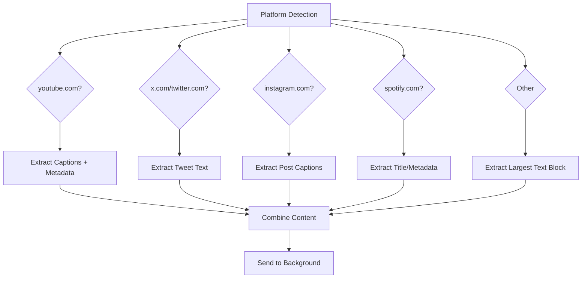

**Diagram sources**
- [extractor.js:14-21](file://FactShield-ChromeExtension/src/content/extractor.js#L14-L21)
- [extractor.js:25-59](file://FactShield-ChromeExtension/src/content/extractor.js#L25-L59)
- [extractor.js:140-149](file://FactShield-ChromeExtension/src/content/extractor.js#L140-L149)
- [extractor.js:153-166](file://FactShield-ChromeExtension/src/content/extractor.js#L153-L166)
- [extractor.js:63-86](file://FactShield-ChromeExtension/src/content/extractor.js#L63-L86)

### AI-Powered Verification Pipeline
The FactCheckPipeline orchestrates the complete verification workflow:

- **Initialization**: Loads API keys from chrome.storage.local and prepares the pipeline for operation.
- **Claim Extraction**: Uses Qwen API to identify verifiable claims from extracted content with check-worthiness assessment.
- **Evidence Gathering**: Concurrently searches multiple evidence sources (Tavily, Google Fact Check) with parallel processing.
- **Verdict Synthesis**: Generates comprehensive verdicts with confidence scores, reasoning chains, and source analysis.

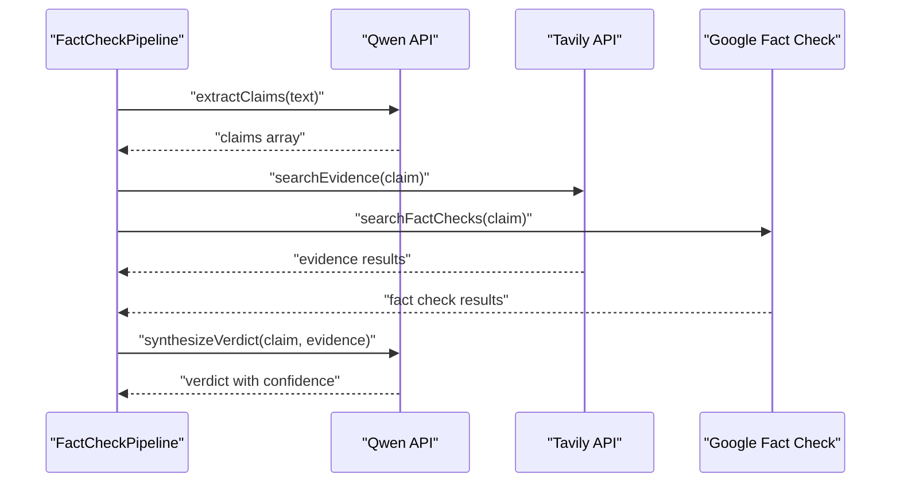

**Diagram sources**
- [pipeline.js:71-113](file://FactShield-ChromeExtension/src/api/pipeline.js#L71-L113)
- [pipeline.js:144-203](file://FactShield-ChromeExtension/src/api/pipeline.js#L144-L203)
- [qwen.js:82-94](file://FactShield-ChromeExtension/src/api/qwen.js#L82-L94)
- [qwen.js:103-178](file://FactShield-ChromeExtension/src/api/qwen.js#L103-L178)

### Service Worker Architecture
The background service worker manages the extension lifecycle and coordinates communication between components:

- **Message Routing**: Handles all inter-component communication via standardized message types.
- **State Management**: Tracks active tabs, pipeline states, and collected claims/verdicts.
- **Real-time Updates**: Streams pipeline progress to the side panel and content script.
- **API Key Management**: Loads and validates API credentials from storage.

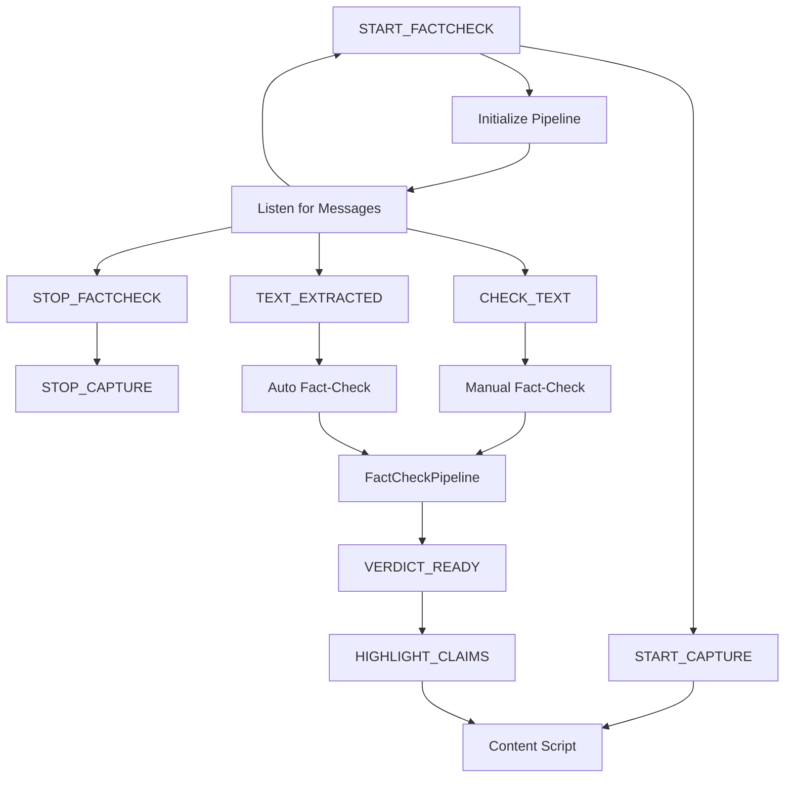

**Diagram sources**
- [service-worker.js:22-32](file://FactShield-ChromeExtension/src/background/service-worker.js#L22-L32)
- [service-worker.js:62-86](file://FactShield-ChromeExtension/src/background/service-worker.js#L62-L86)
- [service-worker.js:197-240](file://FactShield-ChromeExtension/src/background/service-worker.js#L197-L240)

**Section sources**
- [extractor.js:1-341](file://FactShield-ChromeExtension/src/content/extractor.js#L1-L341)
- [pipeline.js:1-205](file://FactShield-ChromeExtension/src/api/pipeline.js#L1-L205)
- [qwen.js:77-178](file://FactShield-ChromeExtension/src/api/qwen.js#L77-L178)
- [service-worker.js:1-250](file://FactShield-ChromeExtension/src/background/service-worker.js#L1-L250)
- [constants.js:1-38](file://FactShield-ChromeExtension/src/shared/constants.js#L1-L38)
- [messages.js:1-40](file://FactShield-ChromeExtension/src/shared/messages.js#L1-L40)

## Dependency Analysis
- Service coupling: Services rely on shared singletons for QwenAPI and SpeechRecognitionService, minimizing explicit constructor dependencies. Audio services depend on AVFoundation; speech depends on Speech framework; network depends on APIClient.
- Cohesion: Each service encapsulates a cohesive responsibility (capture, recognition, extraction, retrieval, synthesis).
- External dependencies: Qwen API for LLM inference; Apple frameworks for audio and speech; OSLog for structured logging.
- **New**: Browser extension dependencies: Chrome extension APIs for messaging, storage, and tab management; external APIs for YouTube captions, Twitter/X posts, and generic site extraction.

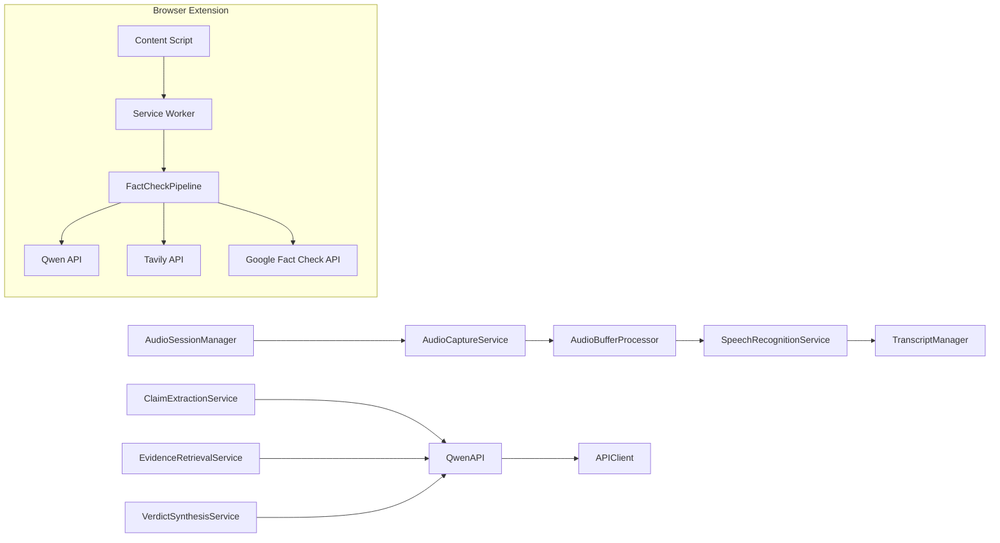

**Diagram sources**
- [AudioCaptureService.swift:1-51](file://FactShield/FactShield/Core/Audio/AudioCaptureService.swift#L1-L51)
- [AudioBufferProcessor.swift:1-42](file://FactShield/FactShield/Core/Audio/AudioBufferProcessor.swift#L1-L42)
- [AudioSessionManager.swift:1-23](file://FactShield/FactShield/Core/Audio/AudioSessionManager.swift#L1-L23)
- [SpeechRecognitionService.swift:1-138](file://FactShield/FactShield/Core/Speech/SpeechRecognitionService.swift#L1-L138)
- [TranscriptManager.swift:1-53](file://FactShield/FactShield/Core/Speech/TranscriptManager.swift#L1-L53)
- [ClaimExtractionService.swift:1-152](file://FactShield/FactShield/Core/Claims/ClaimExtractionService.swift#L1-L152)
- [EvidenceRetrievalService.swift:1-233](file://FactShield/FactShield/Core/Verification/EvidenceRetrievalService.swift#L1-L233)
- [VerdictSynthesisService.swift:1-184](file://FactShield/FactShield/Core/Verification/VerdictSynthesisService.swift#L1-L184)
- [QwenAPI.swift:1-199](file://FactShield/FactShield/Core/Network/QwenAPI.swift#L1-L199)
- [APIClient.swift](file://FactShield/FactShield/Core/Network/APIClient.swift)
- [extractor.js:14-21](file://FactShield-ChromeExtension/src/content/extractor.js#L14-L21)
- [service-worker.js:17-18](file://FactShield-ChromeExtension/src/background/service-worker.js#L17-L18)

**Section sources**
- [QwenAPI.swift:68-199](file://FactShield/FactShield/Core/Network/QwenAPI.swift#L68-L199)
- [extractor.js:14-21](file://FactShield-ChromeExtension/src/content/extractor.js#L14-L21)
- [service-worker.js:17-18](file://FactShield-ChromeExtension/src/background/service-worker.js#L17-L18)

## Performance Considerations
- Audio capture: Fixed buffer size and user-interactive queue keep latency low; ensure appropriate sample rate selection via AudioQuality enum and AudioSessionManager configuration.
- Speech recognition: On-device recognition reduces latency and improves privacy; partial results enable responsive UI updates.
- Buffer trimming: AudioBufferProcessor caps accumulated duration and count to prevent memory growth; SpeechRecognitionService caps transcript word count.
- Evidence retrieval: Parallel provider calls reduce total latency; deduplication and top-N selection bound result size.
- Verdict synthesis: JSON response format and strict parsing minimize overhead; chain-of-thought prompts are designed to be deterministic and concise.
- **New**: Browser extension performance: Content scripts use MutationObserver for efficient YouTube caption monitoring; throttled extraction prevents excessive API calls; parallel evidence gathering optimizes response times.

## Troubleshooting Guide
- Speech recognition not authorized: Verify permissions and locale availability; the service logs warnings when authorization is denied or restricted.
- Speech recognition unavailable: The service checks availability and logs errors; ensure device supports SFSpeechRecognizer.
- API key missing: QwenAPI throws a specific error when the key is empty; configure via environment variable or user defaults.
- JSON parsing failures: Claim extraction and evidence retrieval services include robust cleaning and fallback parsing; log detailed errors for diagnosis.
- Restart loops: SpeechRecognitionService automatically restarts on error after a short delay; monitor logs for recurring failures.
- Logging: Use centralized categories for audio, speech, claims, verification, and API to quickly locate issues.
- **New**: Extension troubleshooting: Verify content script injection, check API key configuration in extension settings, monitor message routing between components, and ensure proper platform detection.

**Section sources**
- [SpeechRecognitionService.swift:28-39](file://FactShield/FactShield/Core/Speech/SpeechRecognitionService.swift#L28-L39)
- [SpeechRecognitionService.swift:42-45](file://FactShield/FactShield/Core/Speech/SpeechRecognitionService.swift#L42-L45)
- [QwenAPI.swift:76-82](file://FactShield/FactShield/Core/Network/QwenAPI.swift#L76-L82)
- [QwenAPI.swift:101-103](file://FactShield/FactShield/Core/Network/QwenAPI.swift#L101-L103)
- [ClaimExtractionService.swift:80-106](file://FactShield/FactShield/Core/Claims/ClaimExtractionService.swift#L80-L106)
- [EvidenceRetrievalService.swift:182-214](file://FactShield/FactShield/Core/Verification/EvidenceRetrievalService.swift#L182-L214)
- [SpeechRecognitionService.swift:103-114](file://FactShield/FactShield/Core/Speech/SpeechRecognitionService.swift#L103-L114)
- [Logger.swift:1-18](file://FactShield/FactShield/Utilities/Logger.swift#L1-L18)

## Conclusion
The FactChecking Live system now provides a comprehensive, multi-platform solution for real-time fact-checking. The integration of browser extension capabilities enables seamless content extraction from YouTube, Twitter/X, Instagram, and generic websites, while the AI-powered verification pipeline delivers reliable, evidence-based verdicts. The system maintains modularity through dependency injection, emphasizes resilience via partial results and automatic recovery, and supports scalable enhancements through parallel processing and structured logging. The architecture successfully bridges native iOS audio processing with browser-based content extraction, creating a unified fact-checking experience across platforms.

## Appendices

### Practical Usage Examples and Integration Patterns
- Starting a live session:
  - Configure audio session, start audio capture, and connect the buffer processor to the speech recognizer.
  - Begin speech recognition and maintain a rolling transcript.
- Periodic claim extraction:
  - Poll recent transcript segments at a fixed interval and send chunks to the claim extraction service.
- Evidence retrieval:
  - For each high/medium check-worthiness claim, retrieve evidence from multiple providers concurrently, deduplicate, and sort by weighted score.
- Verdict synthesis:
  - Synthesize a final verdict with confidence and reasoning; fall back to evidence-less synthesis when needed.
- Error handling:
  - Wrap service calls with try-catch, handle specific errors, and log using centralized categories.
- **New**: Browser extension usage:
  - Navigate to supported platforms (YouTube, Twitter/X, Instagram, generic sites) for automatic content extraction.
  - Use extension action button to start manual fact-checking on selected text.
  - Monitor real-time progress through the side panel interface with status updates and verdict cards.