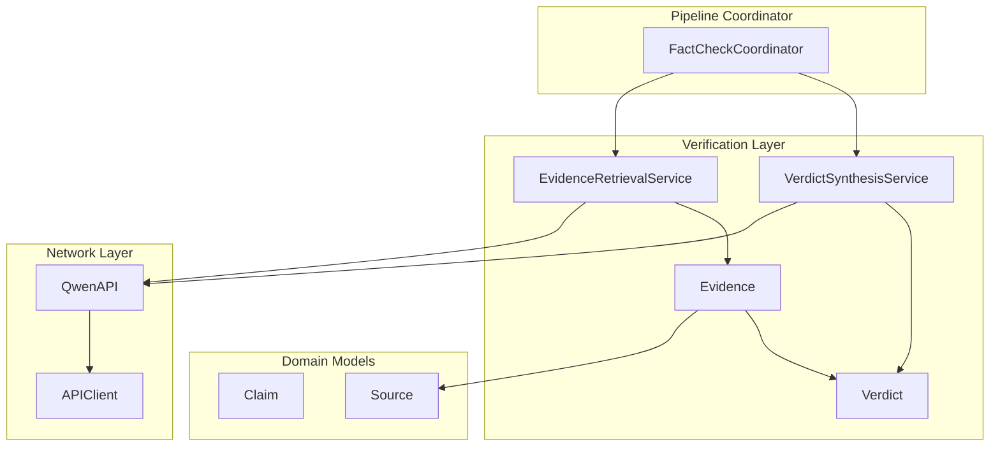
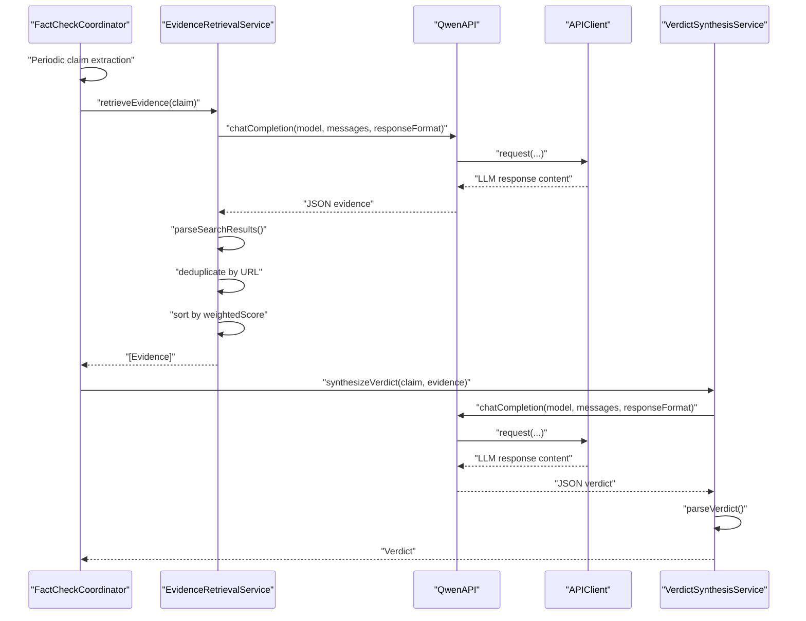
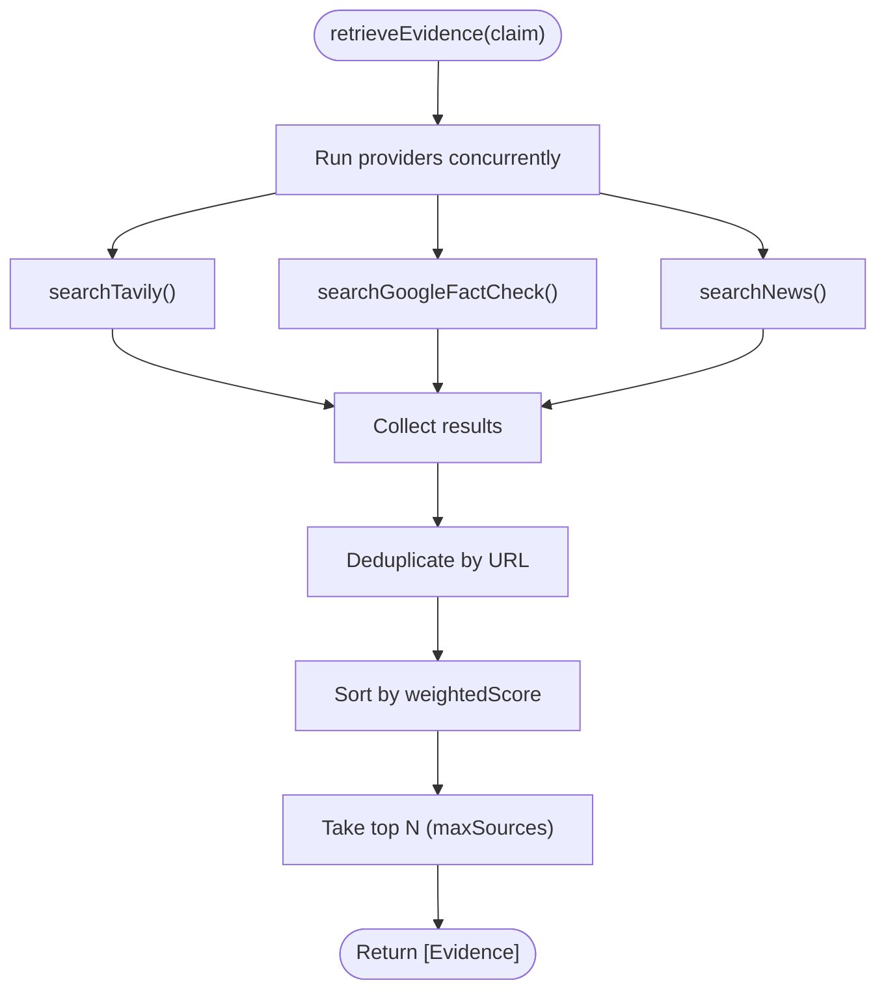
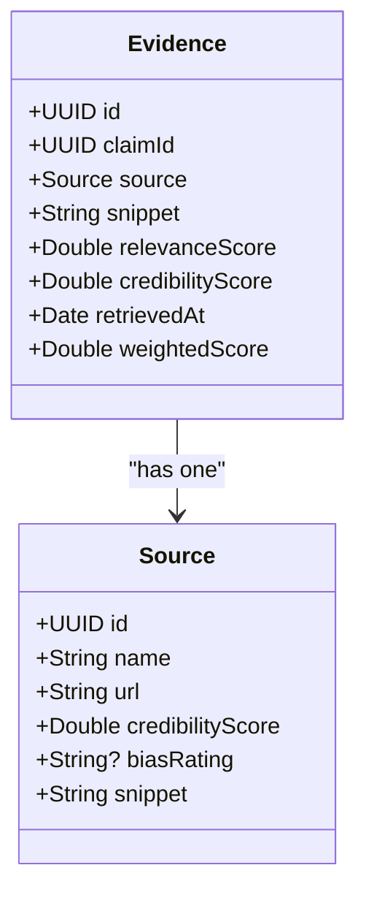
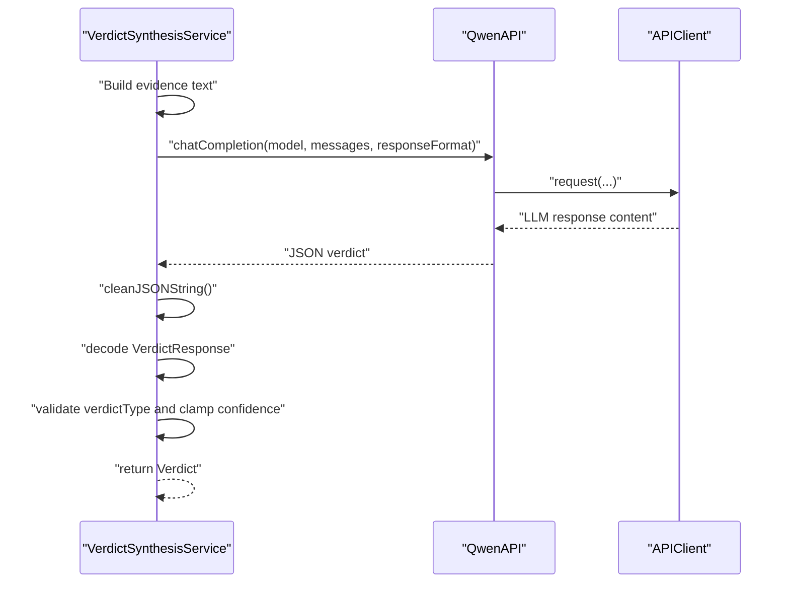
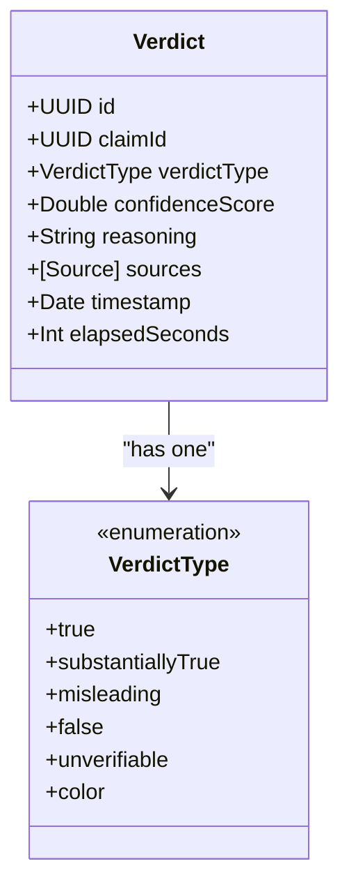
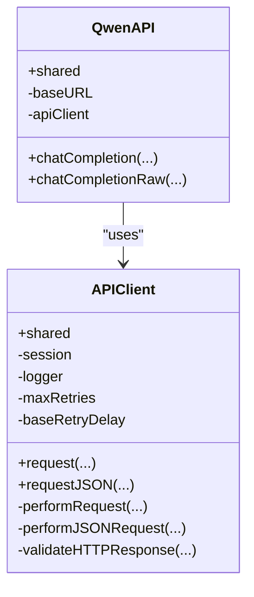
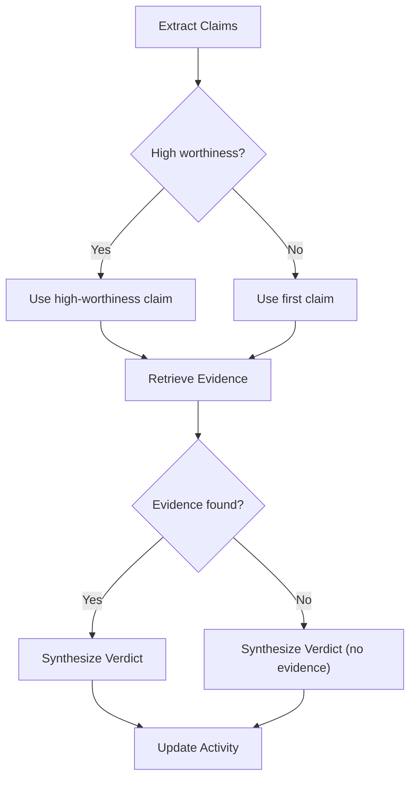
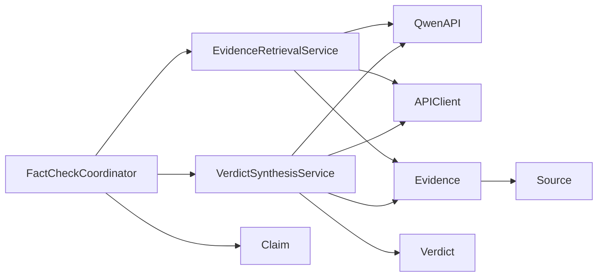

# Evidence Retrieval

<cite>
**Referenced Files in This Document**
- [EvidenceRetrievalService.swift](file://FactShield/FactShield/Core/Verification/EvidenceRetrievalService.swift)
- [Evidence.swift](file://FactShield/FactShield/Core/Verification/Evidence.swift)
- [VerdictSynthesisService.swift](file://FactShield/FactShield/Core/Verification/VerdictSynthesisService.swift)
- [Verdict.swift](file://FactShield/FactShield/Core/Verification/Verdict.swift)
- [QwenAPI.swift](file://FactShield/FactShield/Core/Network/QwenAPI.swift)
- [APIClient.swift](file://FactShield/FactShield/Core/Network/APIClient.swift)
- [Constants.swift](file://FactShield/FactShield/Utilities/Constants.swift)
- [Claim.swift](file://FactShield/FactShield/Core/Claims/Claim.swift)
- [Source.swift](file://FactShield/FactShield/Models/Source.swift)
- [FactCheckCoordinator.swift](file://FactShield/FactShield/Features/FactCheck/FactCheckCoordinator.swift)
</cite>

## Table of Contents
1. [Introduction](#introduction)
2. [Project Structure](#project-structure)
3. [Core Components](#core-components)
4. [Architecture Overview](#architecture-overview)
5. [Detailed Component Analysis](#detailed-component-analysis)
6. [Dependency Analysis](#dependency-analysis)
7. [Performance Considerations](#performance-considerations)
8. [Troubleshooting Guide](#troubleshooting-guide)
9. [Conclusion](#conclusion)
10. [Appendices](#appendices)

## Introduction
This document describes the Evidence Retrieval service that gathers supporting and contradicting evidence from multiple sources for fact-checking. It explains the EvidenceRetrievalService implementation, including multi-source evidence gathering, provider integration strategies, and result validation mechanisms. It documents the Evidence data model, the evidence gathering pipeline (claim processing, source querying, result filtering, and cross-verification), integration strategies for different evidence providers, rate limiting, and caching mechanisms. It also covers evidence quality assessment, source credibility evaluation, and result aggregation techniques, and provides practical examples of evidence retrieval workflows and integration with verdict synthesis services.

## Project Structure
The evidence retrieval capability is part of the verification subsystem and integrates with claim extraction and verdict synthesis. The primary files involved are:
- EvidenceRetrievalService: orchestrates multi-source evidence gathering and post-processing
- Evidence: the evidence record model
- VerdictSynthesisService: synthesizes verdicts from evidence
- Verdict: the verdict model
- QwenAPI and APIClient: network layer for LLM-based search and robust HTTP requests
- Constants: configuration values for source limits and API base URL
- Claim and Source: domain models used throughout the pipeline
- FactCheckCoordinator: coordinates the end-to-end pipeline from audio to verdict

**Diagram sources**
- [EvidenceRetrievalService.swift:15-63](file://FactShield/FactShield/Core/Verification/EvidenceRetrievalService.swift#L15-L63)
- [Evidence.swift:3-15](file://FactShield/FactShield/Core/Verification/Evidence.swift#L3-L15)
- [VerdictSynthesisService.swift:30-80](file://FactShield/FactShield/Core/Verification/VerdictSynthesisService.swift#L30-L80)
- [Verdict.swift:3-30](file://FactShield/FactShield/Core/Verification/Verdict.swift#L3-L30)
- [QwenAPI.swift:68-151](file://FactShield/FactShield/Core/Network/QwenAPI.swift#L68-L151)
- [APIClient.swift:32-103](file://FactShield/FactShield/Core/Network/APIClient.swift#L32-L103)
- [FactCheckCoordinator.swift:86-161](file://FactShield/FactShield/Features/FactCheck/FactCheckCoordinator.swift#L86-L161)

**Section sources**
- [EvidenceRetrievalService.swift:15-63](file://FactShield/FactShield/Core/Verification/EvidenceRetrievalService.swift#L15-L63)
- [FactCheckCoordinator.swift:86-161](file://FactShield/FactShield/Features/FactCheck/FactCheckCoordinator.swift#L86-L161)

## Core Components
- EvidenceRetrievalService: central orchestrator for retrieving evidence from multiple providers, deduplicating, sorting, and limiting results.
- Evidence: immutable record containing source metadata, snippet, relevance and credibility scores, and retrieval timestamp.
- VerdictSynthesisService: synthesizes a structured verdict from evidence using chain-of-thought prompts and validates JSON responses.
- Verdict: immutable verdict record with type, confidence, reasoning, and source references.
- QwenAPI and APIClient: robust HTTP client with retries, timeouts, and rate-limit handling.
- Claim and Source: domain models used across the pipeline.

**Section sources**
- [EvidenceRetrievalService.swift:4-63](file://FactShield/FactShield/Core/Verification/EvidenceRetrievalService.swift#L4-L63)
- [Evidence.swift:3-15](file://FactShield/FactShield/Core/Verification/Evidence.swift#L3-L15)
- [VerdictSynthesisService.swift:22-80](file://FactShield/FactShield/Core/Verification/VerdictSynthesisService.swift#L22-L80)
- [Verdict.swift:3-30](file://FactShield/FactShield/Core/Verification/Verdict.swift#L3-L30)
- [QwenAPI.swift:68-151](file://FactShield/FactShield/Core/Network/QwenAPI.swift#L68-L151)
- [APIClient.swift:32-103](file://FactShield/FactShield/Core/Network/APIClient.swift#L32-L103)
- [Claim.swift:3-25](file://FactShield/FactShield/Core/Claims/Claim.swift#L3-L25)
- [Source.swift:3-10](file://FactShield/FactShield/Models/Source.swift#L3-L10)

## Architecture Overview
The evidence retrieval pipeline is invoked by the FactCheckCoordinator during live sessions. It extracts claims periodically, retrieves evidence from multiple providers concurrently, filters and ranks results, and passes them to the verdict synthesizer. The network layer handles retries, timeouts, and rate limits.

**Diagram sources**
- [FactCheckCoordinator.swift:117-142](file://FactShield/FactShield/Features/FactCheck/FactCheckCoordinator.swift#L117-L142)
- [EvidenceRetrievalService.swift:16-63](file://FactShield/FactShield/Core/Verification/EvidenceRetrievalService.swift#L16-L63)
- [QwenAPI.swift:94-151](file://FactShield/FactShield/Core/Network/QwenAPI.swift#L94-L151)
- [APIClient.swift:51-103](file://FactShield/FactShield/Core/Network/APIClient.swift#L51-L103)
- [VerdictSynthesisService.swift:30-80](file://FactShield/FactShield/Core/Verification/VerdictSynthesisService.swift#L30-L80)

## Detailed Component Analysis

### EvidenceRetrievalService
Responsibilities:
- Multi-source evidence gathering: Tavily, Google Fact Check, and News APIs (currently simulated via Qwen prompts).
- Parallel execution: concurrent retrieval from multiple providers.
- Result validation and normalization: JSON parsing, cleaning, and error handling.
- Deduplication: remove duplicate URLs across providers.
- Ranking and selection: sort by weighted score and limit to maximum sources.

Key behaviors:
- Uses async/await with Task group semantics to run providers concurrently.
- Catches and logs provider errors individually, continuing with remaining results.
- Parses provider JSON into Evidence records with normalized relevance scores.
- Applies provider-specific credibility scores and weights evidence by relevance and credibility.

Provider integration strategies:
- Tavily: simulated via Qwen with a structured prompt returning JSON evidence entries.
- Google Fact Check: simulated via Qwen with a structured prompt returning fact-check entries.
- News: simulated via Qwen with a structured prompt returning news article entries.

Result validation mechanisms:
- JSON cleaning removes markdown code fences.
- Structured decoding with strict types and bounds checking for relevance scores.
- Logging warnings for provider failures and errors for parsing failures.

**Diagram sources**
- [EvidenceRetrievalService.swift:16-63](file://FactShield/FactShield/Core/Verification/EvidenceRetrievalService.swift#L16-L63)

**Section sources**
- [EvidenceRetrievalService.swift:15-63](file://FactShield/FactShield/Core/Verification/EvidenceRetrievalService.swift#L15-L63)
- [EvidenceRetrievalService.swift:67-166](file://FactShield/FactShield/Core/Verification/EvidenceRetrievalService.swift#L67-L166)
- [EvidenceRetrievalService.swift:170-214](file://FactShield/FactShield/Core/Verification/EvidenceRetrievalService.swift#L170-L214)
- [EvidenceRetrievalService.swift:216-231](file://FactShield/FactShield/Core/Verification/EvidenceRetrievalService.swift#L216-L231)

### Evidence Data Model
Evidence encapsulates:
- Identity and linkage: id, claimId
- Source: Source object with name, URL, credibility score, bias rating, snippet
- Content: snippet text
- Scores: relevanceScore (0..1), credibilityScore (0..1)
- Timestamp: retrievedAt
- Weighted score: relevanceWeighted + credibilityWeighted

Evidence ranking:
- weightedScore = relevanceScore * 0.6 + credibilityScore * 0.4

**Diagram sources**
- [Evidence.swift:3-15](file://FactShield/FactShield/Core/Verification/Evidence.swift#L3-L15)
- [Source.swift:3-10](file://FactShield/FactShield/Models/Source.swift#L3-L10)

**Section sources**
- [Evidence.swift:3-15](file://FactShield/FactShield/Core/Verification/Evidence.swift#L3-L15)
- [Source.swift:3-10](file://FactShield/FactShield/Models/Source.swift#L3-L10)

### VerdictSynthesisService
Responsibilities:
- Chain-of-thought synthesis of verdict from evidence.
- JSON parsing with cleaning and validation.
- Confidence scoring and reasoning generation.
- Fallback synthesis when no external evidence is available.

Key behaviors:
- Builds a structured prompt enumerating evidence with source credibility and bias.
- Requests JSON with verdict type, confidence, reasoning, and optional source analysis.
- Validates verdict type against known enumeration and clamps confidence to [0,1].
- Computes elapsed time for logging.

**Diagram sources**
- [VerdictSynthesisService.swift:30-80](file://FactShield/FactShield/Core/Verification/VerdictSynthesisService.swift#L30-L80)
- [QwenAPI.swift:94-151](file://FactShield/FactShield/Core/Network/QwenAPI.swift#L94-L151)
- [APIClient.swift:51-103](file://FactShield/FactShield/Core/Network/APIClient.swift#L51-L103)

**Section sources**
- [VerdictSynthesisService.swift:22-80](file://FactShield/FactShield/Core/Verification/VerdictSynthesisService.swift#L22-L80)
- [VerdictSynthesisService.swift:125-165](file://FactShield/FactShield/Core/Verification/VerdictSynthesisService.swift#L125-L165)
- [VerdictSynthesisService.swift:167-182](file://FactShield/FactShield/Core/Verification/VerdictSynthesisService.swift#L167-L182)

### Verdict Data Model
Verdict includes:
- Identity and linkage: id, claimId
- Verdict type: enumeration with color mapping
- Confidence: 0..1
- Reasoning: textual explanation
- Sources: list of Source objects used
- Timestamp and elapsed seconds

**Diagram sources**
- [Verdict.swift:3-30](file://FactShield/FactShield/Core/Verification/Verdict.swift#L3-L30)

**Section sources**
- [Verdict.swift:3-30](file://FactShield/FactShield/Core/Verification/Verdict.swift#L3-L30)

### Network Layer: QwenAPI and APIClient
- QwenAPI: wraps APIClient to send chat completions with structured messages and response formats, returning content strings or raw JSON.
- APIClient: provides robust HTTP request handling with exponential backoff, timeouts, and rate-limit-aware retries.

**Diagram sources**
- [QwenAPI.swift:68-151](file://FactShield/FactShield/Core/Network/QwenAPI.swift#L68-L151)
- [APIClient.swift:32-103](file://FactShield/FactShield/Core/Network/APIClient.swift#L32-L103)

**Section sources**
- [QwenAPI.swift:68-151](file://FactShield/FactShield/Core/Network/QwenAPI.swift#L68-L151)
- [APIClient.swift:32-103](file://FactShield/FactShield/Core/Network/APIClient.swift#L32-L103)

### Evidence Gathering Pipeline
End-to-end flow:
- FactCheckCoordinator periodically extracts claims from recent transcripts.
- For each high-priority or first claim, it triggers evidence retrieval.
- EvidenceRetrievalService concurrently queries providers, parses results, deduplicates, sorts, and limits.
- If evidence exists, VerdictSynthesisService synthesizes a verdict; otherwise, it synthesizes a verdict without external evidence.

**Diagram sources**
- [FactCheckCoordinator.swift:86-161](file://FactShield/FactShield/Features/FactCheck/FactCheckCoordinator.swift#L86-L161)
- [EvidenceRetrievalService.swift:16-63](file://FactShield/FactShield/Core/Verification/EvidenceRetrievalService.swift#L16-L63)
- [VerdictSynthesisService.swift:30-80](file://FactShield/FactShield/Core/Verification/VerdictSynthesisService.swift#L30-L80)

**Section sources**
- [FactCheckCoordinator.swift:86-161](file://FactShield/FactShield/Features/FactCheck/FactCheckCoordinator.swift#L86-L161)

## Dependency Analysis
- EvidenceRetrievalService depends on QwenAPI and APIClient for network operations and on Constants for source limits.
- Evidence depends on Source for provenance and on Claim for linkage.
- VerdictSynthesisService depends on QwenAPI and APIClient and consumes Evidence and Claim.
- FactCheckCoordinator composes all services and coordinates the pipeline.

**Diagram sources**
- [EvidenceRetrievalService.swift:9-13](file://FactShield/FactShield/Core/Verification/EvidenceRetrievalService.swift#L9-L13)
- [Evidence.swift:6](file://FactShield/FactShield/Core/Verification/Evidence.swift#L6)
- [VerdictSynthesisService.swift:26](file://FactShield/FactShield/Core/Verification/VerdictSynthesisService.swift#L26)
- [FactCheckCoordinator.swift:15-16](file://FactShield/FactShield/Features/FactCheck/FactCheckCoordinator.swift#L15-L16)

**Section sources**
- [EvidenceRetrievalService.swift:9-13](file://FactShield/FactShield/Core/Verification/EvidenceRetrievalService.swift#L9-L13)
- [Evidence.swift:6](file://FactShield/FactShield/Core/Verification/Evidence.swift#L6)
- [VerdictSynthesisService.swift:26](file://FactShield/FactShield/Core/Verification/VerdictSynthesisService.swift#L26)
- [FactCheckCoordinator.swift:15-16](file://FactShield/FactShield/Features/FactCheck/FactCheckCoordinator.swift#L15-L16)

## Performance Considerations
- Concurrency: Evidence retrieval runs providers concurrently to reduce latency.
- Deduplication: URL-based deduplication prevents redundant processing and improves ranking quality.
- Ranking: Weighted score prioritizes high-relevance, high-credibility sources.
- Limits: Upper bound on sources reduces downstream processing overhead.
- Network resilience: APIClient retries and backoff mitigate transient failures.
- Prompt engineering: Lower temperatures and explicit JSON formatting improve reliability.

[No sources needed since this section provides general guidance]

## Troubleshooting Guide
Common issues and remedies:
- Provider failures: EvidenceRetrievalService logs warnings and continues with remaining results; ensure API keys and network connectivity.
- JSON parsing errors: EvidenceRetrievalService and VerdictSynthesisService clean JSON and log errors; verify provider responses conform to expected schema.
- Rate limiting: APIClient detects HTTP 429 and retries with exponential backoff; adjust client-side delays if needed.
- Timeout errors: APIClient retries with exponential backoff; increase timeouts cautiously.
- Invalid verdict types: VerdictSynthesisService falls back to unverifiable; validate prompt outputs.

**Section sources**
- [EvidenceRetrievalService.swift:28-44](file://FactShield/FactShield/Core/Verification/EvidenceRetrievalService.swift#L28-L44)
- [VerdictSynthesisService.swift:144-150](file://FactShield/FactShield/Core/Verification/VerdictSynthesisService.swift#L144-L150)
- [APIClient.swift:74-91](file://FactShield/FactShield/Core/Network/APIClient.swift#L74-L91)
- [APIClient.swift:221-232](file://FactShield/FactShield/Core/Network/APIClient.swift#L221-L232)

## Conclusion
The Evidence Retrieval service provides a robust, extensible framework for gathering, validating, and ranking evidence across multiple sources. Its integration with Qwen-based providers, deduplication, and weighted scoring ensures high-quality inputs for verdict synthesis. The pipeline’s concurrency, resilience, and structured prompts enable scalable, real-time fact-checking workflows.

[No sources needed since this section summarizes without analyzing specific files]

## Appendices

### Practical Workflows and Patterns
- Evidence retrieval workflow:
  - Claim extraction → Evidence retrieval → Deduplication and ranking → Verdict synthesis
- Provider integration patterns:
  - Simulated providers via Qwen prompts with structured JSON outputs
  - Future integration: replace prompts with direct API calls while preserving Evidence model
- Integration with verdict synthesis:
  - Evidence list passed to VerdictSynthesisService for chain-of-thought reasoning
  - Fallback synthesis when no external evidence is available

**Section sources**
- [FactCheckCoordinator.swift:117-142](file://FactShield/FactShield/Features/FactCheck/FactCheckCoordinator.swift#L117-L142)
- [EvidenceRetrievalService.swift:67-166](file://FactShield/FactShield/Core/Verification/EvidenceRetrievalService.swift#L67-L166)
- [VerdictSynthesisService.swift:30-80](file://FactShield/FactShield/Core/Verification/VerdictSynthesisService.swift#L30-L80)