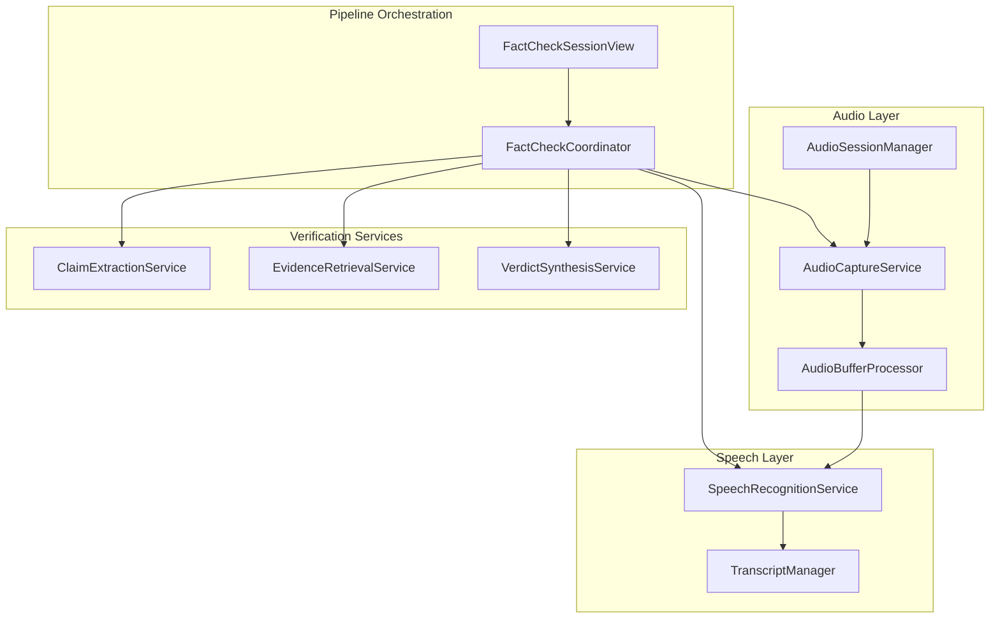
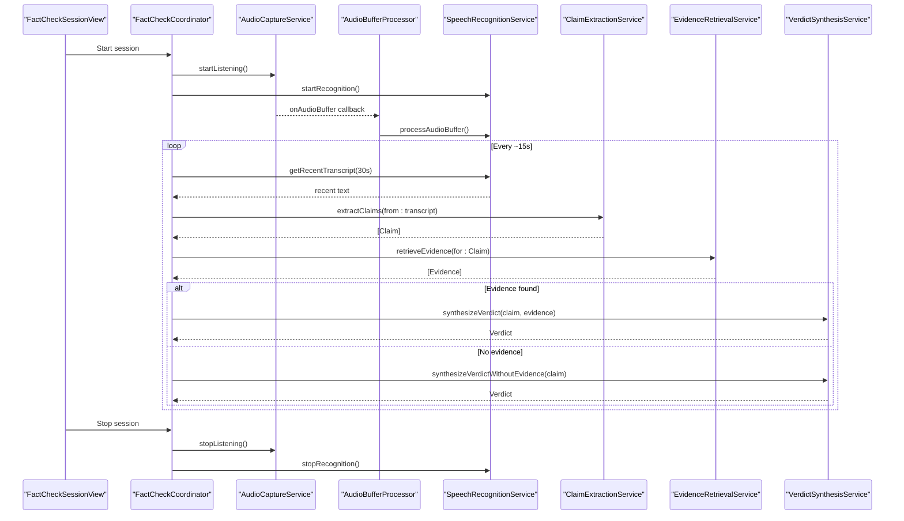
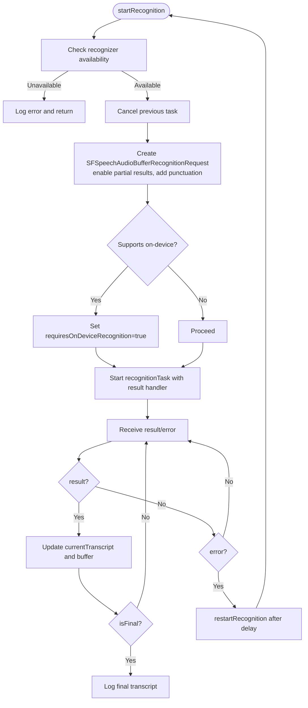
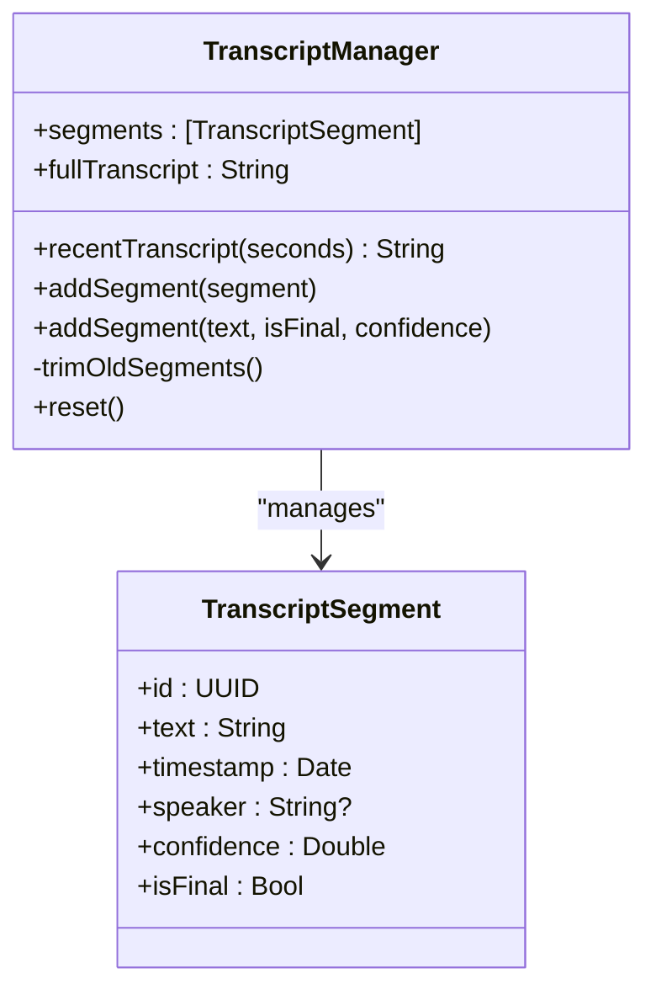
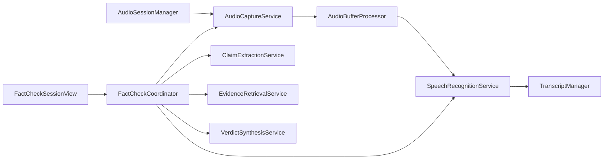

# Speech Recognition

<cite>
**Referenced Files in This Document**
- [SpeechRecognitionService.swift](file://FactShield/FactShield/Core/Speech/SpeechRecognitionService.swift)
- [TranscriptManager.swift](file://FactShield/FactShield/Core/Speech/TranscriptManager.swift)
- [AudioCaptureService.swift](file://FactShield/FactShield/Core/Audio/AudioCaptureService.swift)
- [AudioBufferProcessor.swift](file://FactShield/FactShield/Core/Audio/AudioBufferProcessor.swift)
- [AudioSessionManager.swift](file://FactShield/FactShield/Core/Audio/AudioSessionManager.swift)
- [FactCheckCoordinator.swift](file://FactShield/FactShield/Features/FactCheck/FactCheckCoordinator.swift)
- [FactCheckSessionView.swift](file://FactShield/FactShield/Features/FactCheck/FactCheckSessionView.swift)
- [FactCheckSession.swift](file://FactShield/FactShield/Models/FactCheckSession.swift)
- [ClaimExtractionService.swift](file://FactShield/FactShield/Core/Claims/ClaimExtractionService.swift)
- [EvidenceRetrievalService.swift](file://FactShield/FactShield/Core/Verification/EvidenceRetrievalService.swift)
- [VerdictSynthesisService.swift](file://FactShield/FactShield/Core/Verification/VerdictSynthesisService.swift)
- [Claim.swift](file://FactShield/FactShield/Core/Claims/Claim.swift)
- [Logger.swift](file://FactShield/FactShield/Utilities/Logger.swift)
- [Enums.swift](file://FactShield/FactShield/Models/Enums.swift)
</cite>

## Table of Contents
1. [Introduction](#introduction)
2. [Project Structure](#project-structure)
3. [Core Components](#core-components)
4. [Architecture Overview](#architecture-overview)
5. [Detailed Component Analysis](#detailed-component-analysis)
6. [Dependency Analysis](#dependency-analysis)
7. [Performance Considerations](#performance-considerations)
8. [Troubleshooting Guide](#troubleshooting-guide)
9. [Conclusion](#conclusion)
10. [Appendices](#appendices)

## Introduction
This document explains the on-device speech recognition services that power live transcription in the FactShield iOS application. It covers how audio is captured and preprocessed, how the Speech framework performs on-device recognition, and how transcripts are managed and refined over time. It also documents the integration with claim extraction and verification services to form a complete real-time fact-checking pipeline.

## Project Structure
The speech recognition subsystem is organized around three core areas:
- Audio capture and buffering: capturing microphone PCM buffers and delivering them to the recognizer.
- Speech recognition: configuring and running on-device recognition with partial results.
- Transcript management: maintaining a rolling transcript buffer and exposing recent segments.

**Diagram sources**
- [AudioCaptureService.swift:1-51](file://FactShield/FactShield/Core/Audio/AudioCaptureService.swift#L1-L51)
- [AudioBufferProcessor.swift:1-42](file://FactShield/FactShield/Core/Audio/AudioBufferProcessor.swift#L1-L42)
- [AudioSessionManager.swift:1-23](file://FactShield/FactShield/Core/Audio/AudioSessionManager.swift#L1-L23)
- [SpeechRecognitionService.swift:1-138](file://FactShield/FactShield/Core/Speech/SpeechRecognitionService.swift#L1-L138)
- [TranscriptManager.swift:1-53](file://FactShield/FactShield/Core/Speech/TranscriptManager.swift#L1-L53)
- [FactCheckCoordinator.swift:1-216](file://FactShield/FactShield/Features/FactCheck/FactCheckCoordinator.swift#L1-L216)
- [FactCheckSessionView.swift:1-506](file://FactShield/FactShield/Features/FactCheck/FactCheckSessionView.swift#L1-L506)
- [ClaimExtractionService.swift:1-152](file://FactShield/FactShield/Core/Claims/ClaimExtractionService.swift#L1-L152)
- [EvidenceRetrievalService.swift:1-233](file://FactShield/FactShield/Core/Verification/EvidenceRetrievalService.swift#L1-L233)
- [VerdictSynthesisService.swift:1-184](file://FactShield/FactShield/Core/Verification/VerdictSynthesisService.swift#L1-L184)

**Section sources**
- [AudioCaptureService.swift:1-51](file://FactShield/FactShield/Core/Audio/AudioCaptureService.swift#L1-L51)
- [AudioBufferProcessor.swift:1-42](file://FactShield/FactShield/Core/Audio/AudioBufferProcessor.swift#L1-L42)
- [AudioSessionManager.swift:1-23](file://FactShield/FactShield/Core/Audio/AudioSessionManager.swift#L1-L23)
- [SpeechRecognitionService.swift:1-138](file://FactShield/FactShield/Core/Speech/SpeechRecognitionService.swift#L1-L138)
- [TranscriptManager.swift:1-53](file://FactShield/FactShield/Core/Speech/TranscriptManager.swift#L1-L53)
- [FactCheckCoordinator.swift:1-216](file://FactShield/FactShield/Features/FactCheck/FactCheckCoordinator.swift#L1-L216)
- [FactCheckSessionView.swift:1-506](file://FactShield/FactShield/Features/FactCheck/FactCheckSessionView.swift#L1-L506)
- [ClaimExtractionService.swift:1-152](file://FactShield/FactShield/Core/Claims/ClaimExtractionService.swift#L1-L152)
- [EvidenceRetrievalService.swift:1-233](file://FactShield/FactShield/Core/Verification/EvidenceRetrievalService.swift#L1-L233)
- [VerdictSynthesisService.swift:1-184](file://FactShield/FactShield/Core/Verification/VerdictSynthesisService.swift#L1-L184)

## Core Components
- SpeechRecognitionService: Orchestrates on-device speech recognition, manages partial and final results, and maintains a rolling transcript buffer.
- TranscriptManager: Provides segmented transcript management with timestamps, confidence, and filtering by recency.
- AudioCaptureService: Captures PCM audio from the microphone and streams buffers to the processor.
- AudioBufferProcessor: Accumulates recent buffers and forwards them to the speech recognizer.
- AudioSessionManager: Configures the audio session for optimal capture conditions (e.g., voice chat with AEC).
- FactCheckCoordinator: Wires audio capture, speech recognition, and periodic claim extraction into a cohesive pipeline.
- ClaimExtractionService, EvidenceRetrievalService, VerdictSynthesisService: Provide downstream processing of recognized text into actionable claims and verifiable conclusions.

**Section sources**
- [SpeechRecognitionService.swift:1-138](file://FactShield/FactShield/Core/Speech/SpeechRecognitionService.swift#L1-L138)
- [TranscriptManager.swift:1-53](file://FactShield/FactShield/Core/Speech/TranscriptManager.swift#L1-L53)
- [AudioCaptureService.swift:1-51](file://FactShield/FactShield/Core/Audio/AudioCaptureService.swift#L1-L51)
- [AudioBufferProcessor.swift:1-42](file://FactShield/FactShield/Core/Audio/AudioBufferProcessor.swift#L1-L42)
- [AudioSessionManager.swift:1-23](file://FactShield/FactShield/Core/Audio/AudioSessionManager.swift#L1-L23)
- [FactCheckCoordinator.swift:1-216](file://FactShield/FactShield/Features/FactCheck/FactCheckCoordinator.swift#L1-L216)
- [ClaimExtractionService.swift:1-152](file://FactShield/FactShield/Core/Claims/ClaimExtractionService.swift#L1-L152)
- [EvidenceRetrievalService.swift:1-233](file://FactShield/FactShield/Core/Verification/EvidenceRetrievalService.swift#L1-L233)
- [VerdictSynthesisService.swift:1-184](file://FactShield/FactShield/Core/Verification/VerdictSynthesisService.swift#L1-L184)

## Architecture Overview
The system captures audio, feeds it to the speech recognizer, and continuously updates a rolling transcript. The FactCheckCoordinator periodically extracts claims from recent speech and drives the verification pipeline.

**Diagram sources**
- [FactCheckSessionView.swift:57-76](file://FactShield/FactShield/Features/FactCheck/FactCheckSessionView.swift#L57-L76)
- [FactCheckCoordinator.swift:38-161](file://FactShield/FactShield/Features/FactCheck/FactCheckCoordinator.swift#L38-L161)
- [AudioCaptureService.swift:19-49](file://FactShield/FactShield/Core/Audio/AudioCaptureService.swift#L19-L49)
- [AudioBufferProcessor.swift:16-22](file://FactShield/FactShield/Core/Audio/AudioBufferProcessor.swift#L16-L22)
- [SpeechRecognitionService.swift:41-101](file://FactShield/FactShield/Core/Speech/SpeechRecognitionService.swift#L41-L101)
- [ClaimExtractionService.swift:18-56](file://FactShield/FactShield/Core/Claims/ClaimExtractionService.swift#L18-L56)
- [EvidenceRetrievalService.swift:16-63](file://FactShield/FactShield/Core/Verification/EvidenceRetrievalService.swift#L16-L63)
- [VerdictSynthesisService.swift:30-80](file://FactShield/FactShield/Core/Verification/VerdictSynthesisService.swift#L30-L80)

## Detailed Component Analysis

### SpeechRecognitionService
Responsibilities:
- Initialize and authorize the speech recognizer for the desired locale.
- Configure requests for partial results and punctuation, preferring on-device recognition when available.
- Manage recognition lifecycle: start, append buffers, handle callbacks, and stop.
- Maintain a rolling transcript buffer capped by word count and expose recent text windows.

Key behaviors:
- Partial result handling: updates current transcript and appends to rolling buffer on each interim result.
- Final result handling: logs final transcript when received.
- Error handling: logs errors and restarts recognition after a brief delay to recover from transient issues.
- On-device preference: sets requiresOnDeviceRecognition when supported by the device.

Configuration highlights:
- Locale set during initialization.
- Partial results enabled.
- Punctuation enabled.
- On-device recognition preferred when available.

Processing logic:
- startRecognition creates a request, cancels any existing task, and starts a new recognition task.
- processAudioBuffer appends captured PCM buffers to the active request.
- stopRecognition ends audio, cancels the task, and returns the full transcript.

**Diagram sources**
- [SpeechRecognitionService.swift:23-114](file://FactShield/FactShield/Core/Speech/SpeechRecognitionService.swift#L23-L114)

**Section sources**
- [SpeechRecognitionService.swift:1-138](file://FactShield/FactShield/Core/Speech/SpeechRecognitionService.swift#L1-L138)

### TranscriptManager
Responsibilities:
- Maintain a list of TranscriptSegment entries with text, timestamp, speaker, confidence, and finality flag.
- Provide recent transcript text filtered by a configurable time window.
- Enforce a maximum retention period to keep memory bounded.

Key behaviors:
- addSegment accepts either a structured segment or convenience parameters and appends to the list.
- recentTranscript filters segments newer than a cutoff and joins their text.
- trimOldSegments ensures segments older than five minutes are removed.

**Diagram sources**
- [TranscriptManager.swift:1-53](file://FactShield/FactShield/Core/Speech/TranscriptManager.swift#L1-L53)
- [FactCheckSession.swift:37-53](file://FactShield/FactShield/Models/FactCheckSession.swift#L37-L53)

**Section sources**
- [TranscriptManager.swift:1-53](file://FactShield/FactShield/Core/Speech/TranscriptManager.swift#L1-L53)
- [FactCheckSession.swift:37-53](file://FactShield/FactShield/Models/FactCheckSession.swift#L37-L53)

### AudioCaptureService
Responsibilities:
- Configure an AVAudioEngine input node tap to stream PCM buffers.
- Expose a callback for downstream processing.
- Start and stop listening safely, managing engine lifecycle.

Key behaviors:
- Uses a dedicated queue for buffer delivery to maintain responsiveness.
- Logs session format and errors during engine preparation/start.

Integration:
- Provides buffers to AudioBufferProcessor via onAudioBuffer callback.

**Section sources**
- [AudioCaptureService.swift:1-51](file://FactShield/FactShield/Core/Audio/AudioCaptureService.swift#L1-L51)

### AudioBufferProcessor
Responsibilities:
- Accumulate recent audio buffers to maintain context for recognition.
- Trim accumulation to limit memory/duration.
- Forward buffers to the speech recognizer.

Key behaviors:
- Maintains a rolling list of buffers and trims by duration or count thresholds.
- Immediately forwards each incoming buffer to the speech recognizer.

**Section sources**
- [AudioBufferProcessor.swift:1-42](file://FactShield/FactShield/Core/Audio/AudioBufferProcessor.swift#L1-L42)

### AudioSessionManager
Responsibilities:
- Configure the audio session for capture with appropriate category, mode, and options.
- Deactivate the session when stopping.

Key behaviors:
- Sets category to play-and-record with voice-chat mode to enable AEC.
- Enables Bluetooth A2DP and mix-with-others options.
- Logs configuration and deactivation outcomes.

**Section sources**
- [AudioSessionManager.swift:1-23](file://FactShield/FactShield/Core/Audio/AudioSessionManager.swift#L1-L23)

### FactCheckCoordinator
Responsibilities:
- Wire audio capture, speech recognition, and periodic claim extraction.
- Drive the end-to-end pipeline: extract claims from recent transcript, retrieve evidence, synthesize verdict, and update Live Activity.

Key behaviors:
- Starts timers to periodically extract claims from the last 30 seconds of speech.
- Filters claims by check-worthiness and proceeds with verification.
- Updates Live Activity with current state and results.

Integration points:
- Subscribes to AudioCaptureService.onAudioBuffer to feed the speech recognizer.
- Uses SpeechRecognitionService.getRecentTranscript(seconds:) for periodic extraction.

**Section sources**
- [FactCheckCoordinator.swift:1-216](file://FactShield/FactShield/Features/FactCheck/FactCheckCoordinator.swift#L1-L216)

### ClaimExtractionService
Responsibilities:
- Transform recent transcript text into structured claims using an LLM.
- Parse and validate JSON responses, with fallback parsing strategies.
- Track extracted claims and expose filtering helpers.

Key behaviors:
- Sends a curated prompt to the LLM to extract verifiable claims.
- Parses responses into Claim objects with check-worthiness and status.
- Cleans JSON responses to handle markdown fences.

**Section sources**
- [ClaimExtractionService.swift:1-152](file://FactShield/FactShield/Core/Claims/ClaimExtractionService.swift#L1-L152)
- [Claim.swift:1-37](file://FactShield/FactShield/Core/Claims/Claim.swift#L1-L37)

### EvidenceRetrievalService
Responsibilities:
- Aggregate evidence from multiple providers asynchronously.
- Deduplicate by URL, sort by weighted scores, and return top results.

Key behaviors:
- Executes parallel searches against simulated providers using the LLM.
- Parses provider responses into Evidence objects with relevance and credibility.
- Returns top-N results respecting configured limits.

**Section sources**
- [EvidenceRetrievalService.swift:1-233](file://FactShield/FactShield/Core/Verification/EvidenceRetrievalService.swift#L1-L233)

### VerdictSynthesisService
Responsibilities:
- Synthesize a final verdict from a claim and supporting evidence.
- Support a fallback mode when no external evidence is available.

Key behaviors:
- Builds a structured prompt with claim and evidence.
- Parses JSON responses into Verdict objects with confidence and reasoning.
- Handles missing content and invalid JSON gracefully.

**Section sources**
- [VerdictSynthesisService.swift:1-184](file://FactShield/FactShield/Core/Verification/VerdictSynthesisService.swift#L1-L184)

## Dependency Analysis
The following diagram shows the primary runtime dependencies among the speech and pipeline components.

**Diagram sources**
- [AudioCaptureService.swift:1-51](file://FactShield/FactShield/Core/Audio/AudioCaptureService.swift#L1-L51)
- [AudioBufferProcessor.swift:1-42](file://FactShield/FactShield/Core/Audio/AudioBufferProcessor.swift#L1-L42)
- [AudioSessionManager.swift:1-23](file://FactShield/FactShield/Core/Audio/AudioSessionManager.swift#L1-L23)
- [SpeechRecognitionService.swift:1-138](file://FactShield/FactShield/Core/Speech/SpeechRecognitionService.swift#L1-L138)
- [TranscriptManager.swift:1-53](file://FactShield/FactShield/Core/Speech/TranscriptManager.swift#L1-L53)
- [FactCheckCoordinator.swift:1-216](file://FactShield/FactShield/Features/FactCheck/FactCheckCoordinator.swift#L1-L216)
- [FactCheckSessionView.swift:1-506](file://FactShield/FactShield/Features/FactCheck/FactCheckSessionView.swift#L1-L506)
- [ClaimExtractionService.swift:1-152](file://FactShield/FactShield/Core/Claims/ClaimExtractionService.swift#L1-L152)
- [EvidenceRetrievalService.swift:1-233](file://FactShield/FactShield/Core/Verification/EvidenceRetrievalService.swift#L1-L233)
- [VerdictSynthesisService.swift:1-184](file://FactShield/FactShield/Core/Verification/VerdictSynthesisService.swift#L1-L184)

**Section sources**
- [FactCheckCoordinator.swift:1-216](file://FactShield/FactShield/Features/FactCheck/FactCheckCoordinator.swift#L1-L216)
- [SpeechRecognitionService.swift:1-138](file://FactShield/FactShield/Core/Speech/SpeechRecognitionService.swift#L1-L138)
- [AudioCaptureService.swift:1-51](file://FactShield/FactShield/Core/Audio/AudioCaptureService.swift#L1-L51)
- [AudioBufferProcessor.swift:1-42](file://FactShield/FactShield/Core/Audio/AudioBufferProcessor.swift#L1-L42)
- [AudioSessionManager.swift:1-23](file://FactShield/FactShield/Core/Audio/AudioSessionManager.swift#L1-L23)
- [TranscriptManager.swift:1-53](file://FactShield/FactShield/Core/Speech/TranscriptManager.swift#L1-L53)
- [ClaimExtractionService.swift:1-152](file://FactShield/FactShield/Core/Claims/ClaimExtractionService.swift#L1-L152)
- [EvidenceRetrievalService.swift:1-233](file://FactShield/FactShield/Core/Verification/EvidenceRetrievalService.swift#L1-L233)
- [VerdictSynthesisService.swift:1-184](file://FactShield/FactShield/Core/Verification/VerdictSynthesisService.swift#L1-L184)

## Performance Considerations
- On-device recognition: Enabled when supported to reduce latency and preserve privacy.
- Partial results: Enabled to provide near-real-time feedback while minimizing restarts.
- Buffer management: AudioBufferProcessor trims accumulated buffers by duration and count to bound memory usage.
- Rolling transcript: SpeechRecognitionService caps word count and TranscriptManager caps retention time to prevent unbounded growth.
- Concurrency: Audio buffers are delivered on a high-priority queue to minimize UI stalls.
- Session configuration: Voice-chat mode enables AEC and optimizes for speech quality.

[No sources needed since this section provides general guidance]

## Troubleshooting Guide
Common issues and diagnostics:
- Speech recognition not authorized: The service logs warnings when authorization is denied or restricted. Ensure permissions are granted in Settings.
- Speech recognizer unavailable: The service logs an error and avoids starting recognition. Check device compatibility and OS version.
- Recognition errors: The service attempts to restart recognition after a short delay. Persistent errors indicate underlying audio or system issues.
- Audio session configuration: Errors during session activation are logged. Verify Bluetooth connectivity and other audio interruptions.
- Claim extraction failures: JSON parsing errors trigger fallback strategies. Review prompt formatting and API responses.
- Evidence retrieval failures: Provider calls are retried independently; failures are logged as warnings. Inspect network connectivity and provider quotas.
- Verdict synthesis failures: Invalid JSON or unexpected verdict types are handled with explicit errors. Validate provider outputs and decoding logic.

**Section sources**
- [SpeechRecognitionService.swift:28-39](file://FactShield/FactShield/Core/Speech/SpeechRecognitionService.swift#L28-L39)
- [SpeechRecognitionService.swift:42-45](file://FactShield/FactShield/Core/Speech/SpeechRecognitionService.swift#L42-L45)
- [SpeechRecognitionService.swift:76-78](file://FactShield/FactShield/Core/Speech/SpeechRecognitionService.swift#L76-L78)
- [AudioSessionManager.swift:34-39](file://FactShield/FactShield/Core/Audio/AudioSessionManager.swift#L34-L39)
- [ClaimExtractionService.swift:80-106](file://FactShield/FactShield/Core/Claims/ClaimExtractionService.swift#L80-L106)
- [EvidenceRetrievalService.swift:28-44](file://FactShield/FactShield/Core/Verification/EvidenceRetrievalService.swift#L28-L44)
- [VerdictSynthesisService.swift:144-150](file://FactShield/FactShield/Core/Verification/VerdictSynthesisService.swift#L144-L150)

## Conclusion
The speech recognition subsystem integrates audio capture, on-device recognition, and rolling transcript management to deliver responsive, privacy-preserving transcription. Combined with periodic claim extraction and robust verification services, it forms a complete pipeline for live fact-checking. The design emphasizes resilience, performance, and modularity, enabling straightforward extension and maintenance.

[No sources needed since this section summarizes without analyzing specific files]

## Appendices

### Practical Setup Examples
- Starting a session:
  - Configure audio session, start audio capture, start speech recognition, and launch the Live Activity.
  - Stop the session by canceling timers, stopping audio capture, stopping recognition, and deactivating the audio session.
- Transcript processing:
  - Use recent transcript windows to extract claims periodically and refine the rolling buffer.
- Integration with claim extraction:
  - Extract claims from recent speech, filter by check-worthiness, and proceed with evidence retrieval and verdict synthesis.

**Section sources**
- [FactCheckSessionView.swift:57-76](file://FactShield/FactShield/Features/FactCheck/FactCheckSessionView.swift#L57-L76)
- [FactCheckCoordinator.swift:87-161](file://FactShield/FactShield/Features/FactCheck/FactCheckCoordinator.swift#L87-L161)
- [SpeechRecognitionService.swift:132-136](file://FactShield/FactShield/Core/Speech/SpeechRecognitionService.swift#L132-L136)
- [ClaimExtractionService.swift:18-56](file://FactShield/FactShield/Core/Claims/ClaimExtractionService.swift#L18-L56)

### Configuration Options
- Recognition language and locale:
  - Set during initialization of the speech recognizer.
- Acoustic model preferences:
  - Prefers on-device recognition when available; otherwise falls back to cloud-based recognition.
- Performance tuning:
  - Partial results enabled for responsiveness.
  - Rolling buffers trimmed by duration and word count to balance accuracy and memory usage.
  - Audio session configured for voice chat with AEC and Bluetooth support.

**Section sources**
- [SpeechRecognitionService.swift:24-26](file://FactShield/FactShield/Core/Speech/SpeechRecognitionService.swift#L24-L26)
- [SpeechRecognitionService.swift:56-59](file://FactShield/FactShield/Core/Speech/SpeechRecognitionService.swift#L56-L59)
- [AudioBufferProcessor.swift:14-36](file://FactShield/FactShield/Core/Audio/AudioBufferProcessor.swift#L14-L36)
- [AudioSessionManager.swift:10-16](file://FactShield/FactShield/Core/Audio/AudioSessionManager.swift#L10-L16)