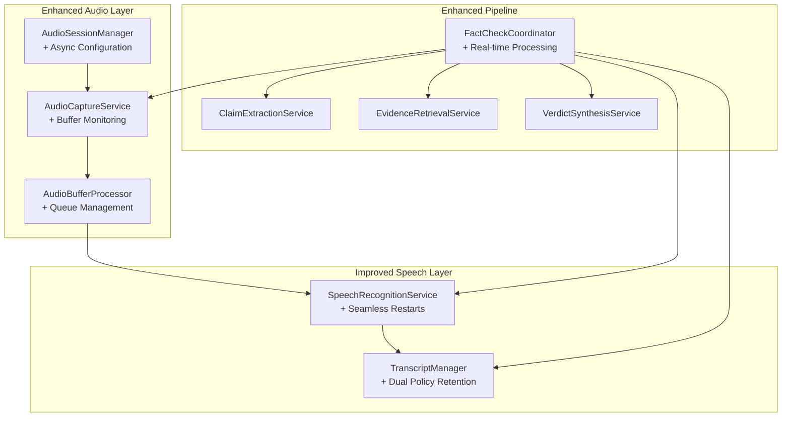
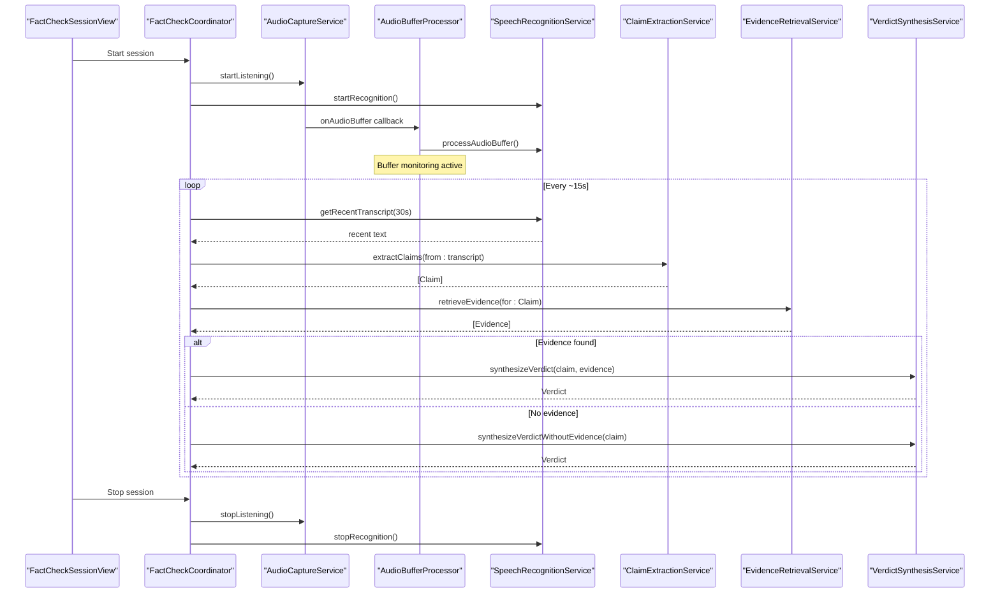
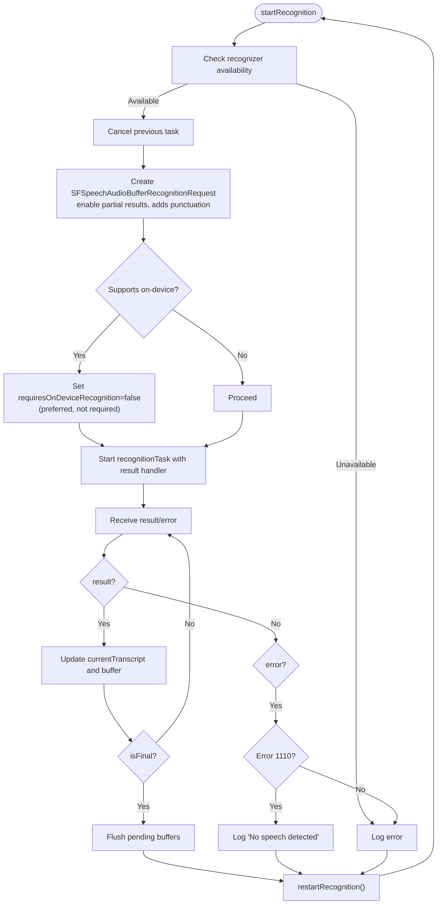
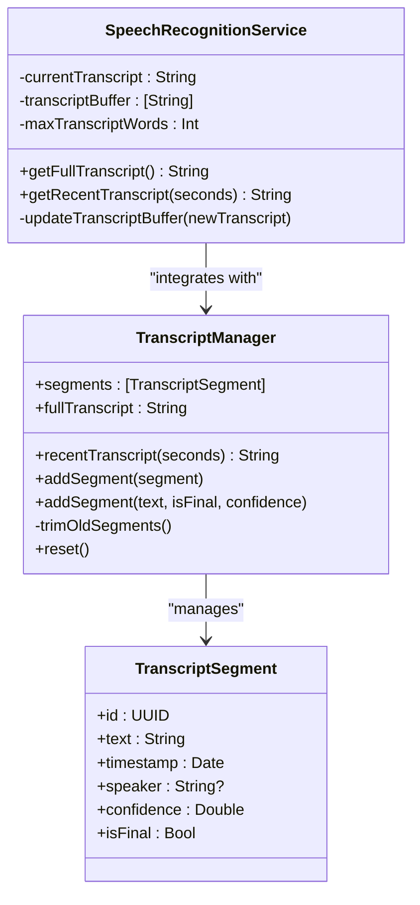

# Speech Recognition

<cite>
**Referenced Files in This Document**
- [SpeechRecognitionService.swift](file://FactShield/FactShield/Core/Speech/SpeechRecognitionService.swift)
- [TranscriptManager.swift](file://FactShield/FactShield/Core/Speech/TranscriptManager.swift)
- [AudioCaptureService.swift](file://FactShield/FactShield/Core/Audio/AudioCaptureService.swift)
- [AudioBufferProcessor.swift](file://FactShield/FactShield/Core/Audio/AudioBufferProcessor.swift)
- [AudioSessionManager.swift](file://FactShield/FactShield/Core/Audio/AudioSessionManager.swift)
- [FactCheckCoordinator.swift](file://FactShield/FactShield/Features/FactCheck/FactCheckCoordinator.swift)
- [FactCheckSessionView.swift](file://FactShield/FactShield/Features/FactCheck/FactCheckSessionView.swift)
- [FactCheckSession.swift](file://FactShield/FactShield/Models/FactCheckSession.swift)
- [ClaimExtractionService.swift](file://FactShield/FactShield/Core/Claims/ClaimExtractionService.swift)
- [EvidenceRetrievalService.swift](file://FactShield/FactShield/Core/Verification/EvidenceRetrievalService.swift)
- [VerdictSynthesisService.swift](file://FactShield/FactShield/Core/Verification/VerdictSynthesisService.swift)
- [Claim.swift](file://FactShield/FactShield/Core/Claims/Claim.swift)
- [Logger.swift](file://FactShield/FactShield/Utilities/Logger.swift)
- [Enums.swift](file://FactShield/FactShield/Models/Enums.swift)
</cite>

## Update Summary
**Changes Made**
- Enhanced SpeechRecognitionService with improved on-device processing and seamless restart mechanism
- Updated partial/final transcript handling with better error recovery and buffer management
- Improved integration with the new fact-checking pipeline with enhanced logging and monitoring
- Added comprehensive buffer queuing system to prevent audio loss during recognition restarts
- Enhanced transcript management with both word-count and time-based retention policies

## Table of Contents
1. [Introduction](#introduction)
2. [Project Structure](#project-structure)
3. [Core Components](#core-components)
4. [Architecture Overview](#architecture-overview)
5. [Detailed Component Analysis](#detailed-component-analysis)
6. [Enhanced Speech Recognition Processing](#enhanced-speech-recognition-processing)
7. [Buffer Management System](#buffer-management-system)
8. [Real-time Transcript Handling](#real-time-transcript-handling)
9. [Integration with Fact-Checking Pipeline](#integration-with-fact-checking-pipeline)
10. [Performance Optimizations](#performance-optimizations)
11. [Troubleshooting Guide](#troubleshooting-guide)
12. [Conclusion](#conclusion)
13. [Appendices](#appendices)

## Introduction
This document explains the enhanced on-device speech recognition services that power live transcription in the FactShield iOS application. The system has been significantly improved with better on-device processing, seamless recognition restarts, and robust partial/final transcript handling. It covers how audio is captured and preprocessed, how the Speech framework performs on-device recognition, and how transcripts are managed and refined over time. The enhanced system now provides improved reliability, reduced latency, and better integration with the complete fact-checking pipeline.

## Project Structure
The speech recognition subsystem has been restructured around a more robust architecture with enhanced buffer management and improved error handling:

- **Audio Layer**: Enhanced audio capture with monitoring, buffer queuing, and format validation
- **Speech Layer**: Improved recognition service with seamless restarts and enhanced logging
- **Transcript Management**: Dual-policy management (word-count and time-based retention)
- **Pipeline Integration**: Tight integration with claim extraction and verification services

**Diagram sources**
- [AudioCaptureService.swift:1-93](file://FactShield/FactShield/Core/Audio/AudioCaptureService.swift#L1-L93)
- [AudioBufferProcessor.swift:1-42](file://FactShield/FactShield/Core/Audio/AudioBufferProcessor.swift#L1-L42)
- [AudioSessionManager.swift:1-91](file://FactShield/FactShield/Core/Audio/AudioSessionManager.swift#L1-L91)
- [SpeechRecognitionService.swift:1-191](file://FactShield/FactShield/Core/Speech/SpeechRecognitionService.swift#L1-L191)
- [TranscriptManager.swift:1-53](file://FactShield/FactShield/Core/Speech/TranscriptManager.swift#L1-L53)
- [FactCheckCoordinator.swift:1-216](file://FactShield/FactShield/Features/FactCheck/FactCheckCoordinator.swift#L1-L216)

## Core Components
The enhanced system consists of several key components working together:

- **SpeechRecognitionService**: Now features seamless restart mechanism, improved error handling, and enhanced on-device processing
- **TranscriptManager**: Implements dual retention policies (word-count and time-based) for optimal memory management
- **AudioCaptureService**: Enhanced with buffer monitoring, format validation, and improved error reporting
- **AudioBufferProcessor**: Features sophisticated queue management and buffer trimming algorithms
- **AudioSessionManager**: Provides asynchronous session configuration with comprehensive error handling
- **FactCheckCoordinator**: Orchestrates the complete real-time fact-checking pipeline with enhanced timing controls

**Section sources**
- [SpeechRecognitionService.swift:1-191](file://FactShield/FactShield/Core/Speech/SpeechRecognitionService.swift#L1-L191)
- [TranscriptManager.swift:1-53](file://FactShield/FactShield/Core/Speech/TranscriptManager.swift#L1-L53)
- [AudioCaptureService.swift:1-93](file://FactShield/FactShield/Core/Audio/AudioCaptureService.swift#L1-L93)
- [AudioBufferProcessor.swift:1-42](file://FactShield/FactShield/Core/Audio/AudioBufferProcessor.swift#L1-L42)
- [AudioSessionManager.swift:1-91](file://FactShield/FactShield/Core/Audio/AudioSessionManager.swift#L1-L91)
- [FactCheckCoordinator.swift:1-216](file://FactShield/FactShield/Features/FactCheck/FactCheckCoordinator.swift#L1-L216)

## Architecture Overview
The enhanced system provides seamless real-time processing with improved reliability and reduced latency. The architecture now includes sophisticated buffer management, error recovery mechanisms, and real-time monitoring.

**Diagram sources**
- [FactCheckSessionView.swift:57-76](file://FactShield/FactShield/Features/FactCheck/FactCheckSessionView.swift#L57-L76)
- [FactCheckCoordinator.swift:38-161](file://FactShield/FactShield/Features/FactCheck/FactCheckCoordinator.swift#L38-L161)
- [AudioCaptureService.swift:21-77](file://FactShield/FactShield/Core/Audio/AudioCaptureService.swift#L21-L77)
- [AudioBufferProcessor.swift:16-22](file://FactShield/FactShield/Core/Audio/AudioBufferProcessor.swift#L16-L22)
- [SpeechRecognitionService.swift:48-114](file://FactShield/FactShield/Core/Speech/SpeechRecognitionService.swift#L48-L114)

## Detailed Component Analysis

### Enhanced SpeechRecognitionService
The SpeechRecognitionService has been significantly improved with better error handling, seamless restart mechanisms, and enhanced logging:

**Key Enhancements:**
- **Seamless Restart Mechanism**: Eliminates audio loss during recognition restarts using pending buffer queues
- **Improved Error Recovery**: Handles "No speech detected" errors (error 1110) without disrupting the pipeline
- **Enhanced Logging**: Comprehensive logging for debugging and monitoring
- **Better Memory Management**: Optimized transcript buffer with word-count limits
- **Async Processing**: Uses serialization queues for thread-safe operations

**New Features:**
- Pending buffer management to prevent audio loss during restarts
- Immediate restart capability without delays
- Enhanced partial result handling with better error recovery
- Improved on-device recognition preference handling

**Diagram sources**
- [SpeechRecognitionService.swift:48-167](file://FactShield/FactShield/Core/Speech/SpeechRecognitionService.swift#L48-L167)

**Section sources**
- [SpeechRecognitionService.swift:1-191](file://FactShield/FactShield/Core/Speech/SpeechRecognitionService.swift#L1-L191)

### TranscriptManager
The TranscriptManager now implements a dual-policy retention system combining word-count limits with time-based cleanup:

**Enhanced Features:**
- **Dual Policy Management**: Combines word-count limits (2000 words) with 5-minute time-based retention
- **Enhanced Filtering**: Improved recent transcript extraction with configurable time windows
- **Better Memory Management**: Automatic cleanup of old segments prevents memory bloat
- **Structured Segments**: Supports TranscriptSegment objects with confidence and finality tracking

**Key Behaviors:**
- `recentTranscript(seconds:)`: Extracts recent speech using time-based filtering
- `addSegment(text:isFinal:confidence:)`: Convenience method for simple segment addition
- `trimOldSegments()`: Automatic cleanup of segments older than 5 minutes
- `reset()`: Complete transcript buffer reset with logging

**Diagram sources**
- [TranscriptManager.swift:1-53](file://FactShield/FactShield/Core/Speech/TranscriptManager.swift#L1-L53)
- [SpeechRecognitionService.swift:169-189](file://FactShield/FactShield/Core/Speech/SpeechRecognitionService.swift#L169-L189)

**Section sources**
- [TranscriptManager.swift:1-53](file://FactShield/FactShield/Core/Speech/TranscriptManager.swift#L1-L53)
- [FactCheckSession.swift:37-53](file://FactShield/FactShield/Models/FactCheckSession.swift#L37-L53)

### Enhanced AudioCaptureService
The AudioCaptureService has been improved with better monitoring, format validation, and error reporting:

**New Capabilities:**
- **Buffer Monitoring**: Monitors audio flow and reports zero-buffer conditions after 1-second delays
- **Format Validation**: Validates input format before establishing taps to prevent runtime errors
- **Enhanced Error Handling**: Comprehensive logging for audio session and engine preparation failures
- **Improved Buffer Delivery**: Uses high-priority queues for responsive audio processing

**Key Improvements:**
- Zero-buffer detection with detailed diagnostic information
- Format validation before tap installation
- Enhanced logging for debugging audio routing issues
- Better resource cleanup with proper engine shutdown

**Section sources**
- [AudioCaptureService.swift:1-93](file://FactShield/FactShield/Core/Audio/AudioCaptureService.swift#L1-L93)

### AudioBufferProcessor
The AudioBufferProcessor now features sophisticated buffer management and trimming algorithms:

**Enhanced Features:**
- **Rolling Buffer Management**: Maintains up to 30 seconds of accumulated audio with intelligent trimming
- **Smart Trimming Algorithm**: Balances duration and count thresholds for optimal memory usage
- **Improved Processing**: Streams buffers to speech recognizer in chunks while maintaining context
- **Reset Capability**: Allows clearing of accumulated buffers for clean restarts

**Technical Details:**
- Maximum 30 seconds of accumulated audio (duration-based trimming)
- Upper limit of 100 buffers with automatic pruning to 50 most recent
- Real-time trimming during buffer accumulation
- Thread-safe processing with proper synchronization

**Section sources**
- [AudioBufferProcessor.swift:1-42](file://FactShield/FactShield/Core/Audio/AudioBufferProcessor.swift#L1-L42)

### Enhanced AudioSessionManager
The AudioSessionManager now provides asynchronous configuration with comprehensive error handling:

**New Asynchronous Features:**
- **Async Configuration**: Non-blocking audio session setup with proper permission handling
- **Comprehensive Error Handling**: Structured error types for different failure scenarios
- **Detailed Logging**: Extensive logging for audio routing and session state
- **Graceful Degradation**: Handles permission denials and configuration failures gracefully

**Key Improvements:**
- Asynchronous permission request handling
- Detailed error categorization with user-friendly messages
- Post-activation delay for proper audio routing
- Comprehensive session state logging for debugging

**Section sources**
- [AudioSessionManager.swift:1-91](file://FactShield/FactShield/Core/Audio/AudioSessionManager.swift#L1-L91)

## Enhanced Speech Recognition Processing
The enhanced speech recognition processing pipeline provides improved reliability and performance:

**Processing Flow:**
1. **Initialization**: Audio session configured, speech recognizer authorized
2. **Continuous Recognition**: Partial results streamed with punctuation and confidence
3. **Context Management**: Rolling buffer maintains 30 seconds of audio context
4. **Error Recovery**: Seamless restarts without audio loss
5. **Transcript Management**: Word-count limited rolling buffer with final result handling

**Key Improvements:**
- **Seamless Context Preservation**: Pending buffer system prevents audio loss during restarts
- **Enhanced Error Handling**: Specific handling for "No speech detected" errors
- **Optimized Restart Logic**: Immediate restart without artificial delays
- **Improved Memory Management**: Balanced approach to buffer retention and cleanup

**Section sources**
- [SpeechRecognitionService.swift:48-167](file://FactShield/FactShield/Core/Speech/SpeechRecognitionService.swift#L48-L167)

## Buffer Management System
The enhanced buffer management system ensures reliable audio processing with minimal loss:

**Buffer Architecture:**
- **Pending Buffer Queue**: Temporary storage for audio during recognition restarts
- **Accumulated Buffer Pool**: Rolling storage of recent audio with smart trimming
- **Serialization Queues**: Thread-safe access to buffers and recognition requests
- **Memory Optimization**: Automatic cleanup based on duration and count thresholds

**Management Algorithms:**
- **Duration-Based Trimming**: Limits accumulated audio to 30 seconds
- **Count-Based Pruning**: Maintains maximum 100 buffers with 50-buffer safety margin
- **Priority Queuing**: High-priority queues ensure responsive audio processing
- **Resource Cleanup**: Proper disposal of buffers and audio resources

**Section sources**
- [SpeechRecognitionService.swift:23-26](file://FactShield/FactShield/Core/Speech/SpeechRecognitionService.swift#L23-L26)
- [AudioBufferProcessor.swift:12-36](file://FactShield/FactShield/Core/Audio/AudioBufferProcessor.swift#L12-L36)

## Real-time Transcript Handling
The system now provides sophisticated real-time transcript management with multiple retention policies:

**Transcript Management Features:**
- **Word-Count Limiting**: Rolling buffer capped at 2000 words for memory efficiency
- **Time-Based Retention**: Automatic cleanup of segments older than 5 minutes
- **Recent Window Extraction**: Configurable time-based transcript extraction (default 30 seconds)
- **Confidence Tracking**: Optional confidence scoring for transcript segments

**Processing Logic:**
- **Continuous Updates**: Real-time transcript updates with partial results
- **Final Result Handling**: Proper handling of final transcripts with restart triggers
- **Memory Optimization**: Efficient word-based buffer management
- **Thread Safety**: Protected access to transcript data structures

**Section sources**
- [SpeechRecognitionService.swift:169-189](file://FactShield/FactShield/Core/Speech/SpeechRecognitionService.swift#L169-L189)
- [TranscriptManager.swift:19-46](file://FactShield/FactShield/Core/Speech/TranscriptManager.swift#L19-L46)

## Integration with Fact-Checking Pipeline
The enhanced system provides tight integration with the complete fact-checking pipeline:

**Pipeline Integration Points:**
- **Real-time Claim Extraction**: Periodic extraction of claims from recent 30-second transcripts
- **Evidence Retrieval**: Automated evidence gathering for extracted claims
- **Verdict Synthesis**: Comprehensive fact-checking with confidence scoring
- **Live Activity Updates**: Real-time status updates for user interface

**Enhanced Coordination:**
- **Coordinated Timing**: 15-second intervals for claim extraction with immediate startup
- **State Synchronization**: Real-time updates to UI components and activity states
- **Error Propagation**: Graceful handling of pipeline failures with user notifications
- **Resource Management**: Coordinated startup and shutdown of all pipeline components

**Section sources**
- [FactCheckCoordinator.swift:68-161](file://FactShield/FactShield/Features/FactCheck/FactCheckCoordinator.swift#L68-L161)
- [FactCheckSessionView.swift:57-76](file://FactShield/FactShield/Features/FactCheck/FactCheckSessionView.swift#L57-L76)

## Performance Optimizations
The enhanced system incorporates several performance improvements:

**Optimization Strategies:**
- **Reduced Latency**: Immediate recognition restarts eliminate processing delays
- **Memory Efficiency**: Dual-policy retention prevents memory bloat while maintaining context
- **CPU Optimization**: Thread-safe processing with appropriate queue priorities
- **Network Efficiency**: Batch processing in the fact-checking pipeline reduces API calls

**Key Performance Metrics:**
- **Recognition Latency**: Reduced restart delays for seamless processing
- **Memory Usage**: Controlled growth with 2000-word buffer limit and 5-minute retention
- **Audio Quality**: 4096-byte buffer size for reliable audio delivery
- **Pipeline Throughput**: 15-second extraction intervals balance responsiveness with efficiency

**Section sources**
- [SpeechRecognitionService.swift:146-167](file://FactShield/FactShield/Core/Speech/SpeechRecognitionService.swift#L146-L167)
- [AudioCaptureService.swift:38-46](file://FactShield/FactShield/Core/Audio/AudioCaptureService.swift#L38-L46)

## Troubleshooting Guide
Enhanced troubleshooting capabilities with comprehensive logging and diagnostic information:

**Enhanced Diagnostics:**
- **Audio Session Issues**: Detailed logging for permission denials, configuration failures, and activation problems
- **Recognition Problems**: Comprehensive error logging with specific error codes and recovery actions
- **Buffer Flow Issues**: Zero-buffer detection with audio routing diagnostics
- **Pipeline Failures**: Structured error handling with user-friendly messages

**Diagnostic Information:**
- **Audio Capture**: Buffer count monitoring, format validation results, and engine state logs
- **Speech Recognition**: Error codes, restart statistics, and recognition status logs
- **Session Management**: Permission states, routing information, and configuration details
- **Pipeline Coordination**: Timing information, state transitions, and processing statistics

**Section sources**
- [AudioCaptureService.swift:60-76](file://FactShield/FactShield/Core/Audio/AudioCaptureService.swift#L60-L76)
- [SpeechRecognitionService.swift:101-110](file://FactShield/FactShield/Core/Speech/SpeechRecognitionService.swift#L101-L110)
- [AudioSessionManager.swift:34-82](file://FactShield/FactShield/Core/Audio/AudioSessionManager.swift#L34-L82)

## Conclusion
The enhanced speech recognition subsystem represents a significant improvement in reliability, performance, and user experience. The new system provides seamless real-time processing with robust error recovery, sophisticated buffer management, and tight integration with the complete fact-checking pipeline. Key improvements include seamless recognition restarts, enhanced error handling, comprehensive logging, and optimized memory management. These enhancements enable the system to provide responsive, privacy-preserving transcription while maintaining the integrity of the fact-checking workflow.

## Appendices

### Practical Setup Examples
**Enhanced Setup Process:**
- **System Initialization**: Configure audio session asynchronously, validate permissions, then start audio capture
- **Recognition Setup**: Initialize speech recognizer with proper authorization, configure recognition parameters
- **Pipeline Integration**: Connect audio capture to buffer processor, establish speech recognition callbacks
- **Monitoring and Maintenance**: Implement buffer monitoring, regular health checks, and graceful error recovery

**Section sources**
- [FactCheckSessionView.swift:57-76](file://FactShield/FactShield/Features/FactCheck/FactCheckSessionView.swift#L57-L76)
- [AudioSessionManager.swift:27-83](file://FactShield/FactShield/Core/Audio/AudioSessionManager.swift#L27-L83)
- [SpeechRecognitionService.swift:30-33](file://FactShield/FactShield/Core/Speech/SpeechRecognitionService.swift#L30-L33)

### Configuration Options
**Enhanced Configuration Parameters:**
- **Recognition Settings**: Locale configuration, partial results enabled, punctuation support, on-device preference
- **Buffer Management**: 30-second audio accumulation limit, 2000-word transcript buffer, 5-minute retention policy
- **Processing Tuning**: 15-second extraction intervals, 4096-byte buffer size, high-priority processing queues
- **Error Handling**: Specific error code handling, automatic recovery mechanisms, comprehensive logging

**Section sources**
- [SpeechRecognitionService.swift:30-33](file://FactShield/FactShield/Core/Speech/SpeechRecognitionService.swift#L30-L33)
- [SpeechRecognitionService.swift:64-73](file://FactShield/FactShield/Core/Speech/SpeechRecognitionService.swift#L64-L73)
- [AudioBufferProcessor.swift:12-14](file://FactShield/FactShield/Core/Audio/AudioBufferProcessor.swift#L12-L14)
- [TranscriptManager.swift:42-46](file://FactShield/FactShield/Core/Speech/TranscriptManager.swift#L42-L46)

### Integration Patterns
**Enhanced Integration Approaches:**
- **Real-time Processing**: Continuous audio streaming with periodic claim extraction and evidence retrieval
- **Error Resilience**: Graceful handling of recognition errors with automatic recovery and user notification
- **Resource Coordination**: Synchronized startup and shutdown of audio capture, speech recognition, and pipeline components
- **State Management**: Real-time updates to UI components, activity states, and processing indicators

**Section sources**
- [FactCheckCoordinator.swift:68-161](file://FactShield/FactShield/Features/FactCheck/FactCheckCoordinator.swift#L68-L161)
- [SpeechRecognitionService.swift:146-167](file://FactShield/FactShield/Core/Speech/SpeechRecognitionService.swift#L146-L167)