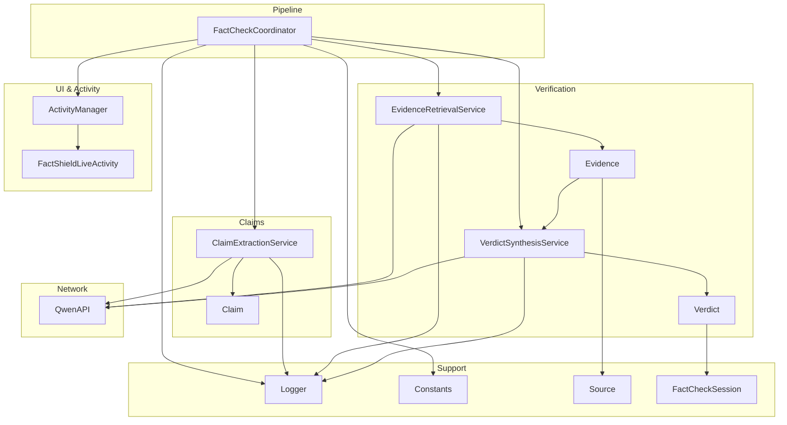
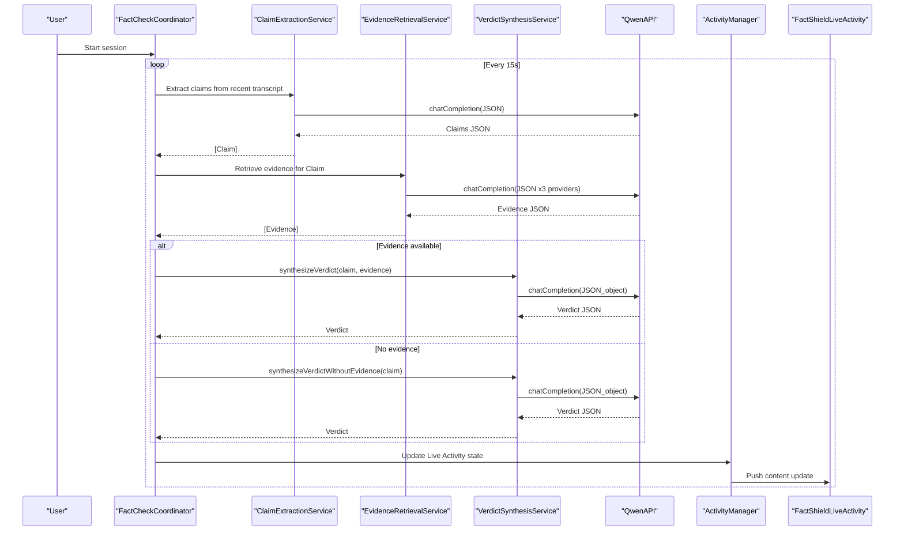
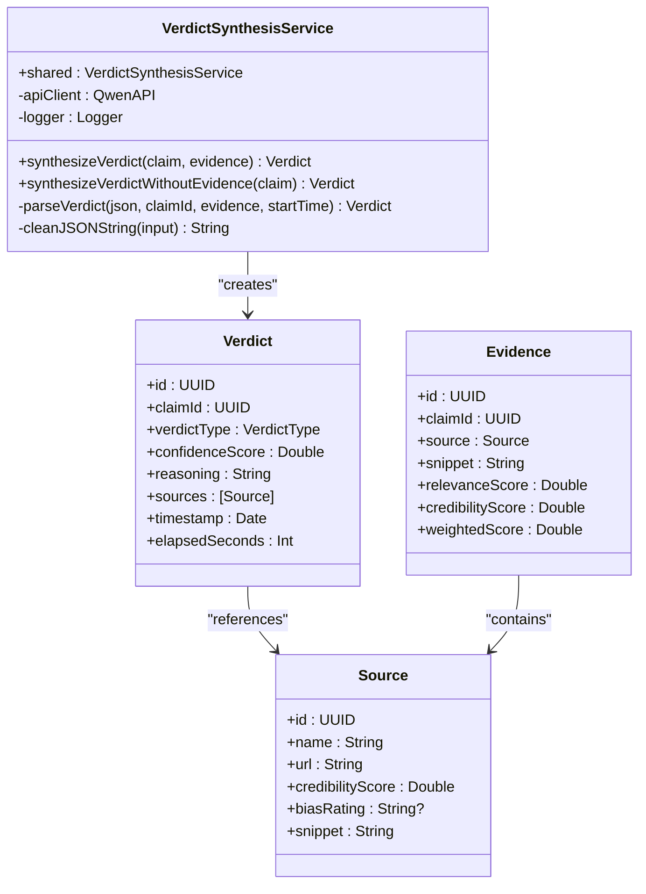
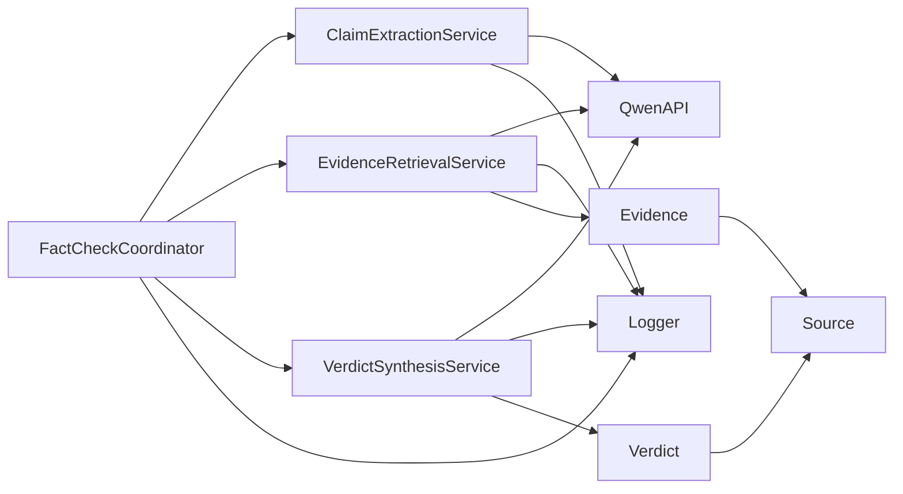

# Verdict Synthesis

<cite>
**Referenced Files in This Document**
- [VerdictSynthesisService.swift](file://FactShield/FactShield/Core/Verification/VerdictSynthesisService.swift)
- [Verdict.swift](file://FactShield/FactShield/Core/Verification/Verdict.swift)
- [Evidence.swift](file://FactShield/FactShield/Core/Verification/Evidence.swift)
- [EvidenceRetrievalService.swift](file://FactShield/FactShield/Core/Verification/EvidenceRetrievalService.swift)
- [Claim.swift](file://FactShield/FactShield/Core/Claims/Claim.swift)
- [ClaimExtractionService.swift](file://FactShield/FactShield/Core/Claims/ClaimExtractionService.swift)
- [FactCheckCoordinator.swift](file://FactShield/FactShield/Features/FactCheck/FactCheckCoordinator.swift)
- [FactShieldLiveActivity.swift](file://FactShield/FactShield/Widgets/FactShieldLiveActivity.swift)
- [ActivityManager.swift](file://FactShield/FactShield/Widgets/ActivityManager.swift)
- [QwenAPI.swift](file://FactShield/FactShield/Core/Network/QwenAPI.swift)
- [Logger.swift](file://FactShield/FactShield/Utilities/Logger.swift)
- [Constants.swift](file://FactShield/FactShield/Utilities/Constants.swift)
- [FactCheckSession.swift](file://FactShield/FactShield/Models/FactCheckSession.swift)
- [Source.swift](file://FactShield/FactShield/Models/Source.swift)
</cite>

## Table of Contents
1. [Introduction](#introduction)
2. [Project Structure](#project-structure)
3. [Core Components](#core-components)
4. [Architecture Overview](#architecture-overview)
5. [Detailed Component Analysis](#detailed-component-analysis)
6. [Dependency Analysis](#dependency-analysis)
7. [Performance Considerations](#performance-considerations)
8. [Troubleshooting Guide](#troubleshooting-guide)
9. [Conclusion](#conclusion)
10. [Appendices](#appendices)

## Introduction
This document describes the verdict synthesis service that generates final fact-checking results with confidence scoring. It explains how the VerdictSynthesisService orchestrates evidence evaluation, applies chain-of-thought reasoning prompts, parses structured JSON outputs, and produces a Verdict with confidence, reasoning, and supporting sources. It also documents the Verdict data model, the end-to-end synthesis pipeline, and the integration with Live Activity and UI components.

## Project Structure
The verdict synthesis capability spans several modules:
- Verification: Evidence and verdict models, synthesis service
- Claims: Claim extraction and model
- FactCheck: Orchestration of the end-to-end pipeline
- Widgets: Live Activity and Activity Manager
- Network: Qwen API client
- Utilities: Logging and constants

**Diagram sources**
- [FactCheckCoordinator.swift:1-216](file://FactShield/FactShield/Features/FactCheck/FactCheckCoordinator.swift#L1-L216)
- [VerdictSynthesisService.swift:1-184](file://FactShield/FactShield/Core/Verification/VerdictSynthesisService.swift#L1-L184)
- [EvidenceRetrievalService.swift:1-233](file://FactShield/FactShield/Core/Verification/EvidenceRetrievalService.swift#L1-L233)
- [ClaimExtractionService.swift:1-152](file://FactShield/FactShield/Core/Claims/ClaimExtractionService.swift#L1-L152)
- [ActivityManager.swift:1-87](file://FactShield/FactShield/Widgets/ActivityManager.swift#L1-L87)
- [FactShieldLiveActivity.swift:1-44](file://FactShield/FactShield/Widgets/FactShieldLiveActivity.swift#L1-L44)
- [QwenAPI.swift:1-199](file://FactShield/FactShield/Core/Network/QwenAPI.swift#L1-L199)
- [Logger.swift:1-18](file://FactShield/FactShield/Utilities/Logger.swift#L1-L18)
- [Constants.swift:1-37](file://FactShield/FactShield/Utilities/Constants.swift#L1-L37)
- [Evidence.swift:1-16](file://FactShield/FactShield/Core/Verification/Evidence.swift#L1-L16)
- [Verdict.swift:1-31](file://FactShield/FactShield/Core/Verification/Verdict.swift#L1-L31)
- [Claim.swift:1-37](file://FactShield/FactShield/Core/Claims/Claim.swift#L1-L37)
- [FactCheckSession.swift:1-54](file://FactShield/FactShield/Models/FactCheckSession.swift#L1-L54)
- [Source.swift:1-11](file://FactShield/FactShield/Models/Source.swift#L1-L11)

**Section sources**
- [FactCheckCoordinator.swift:1-216](file://FactShield/FactShield/Features/FactCheck/FactCheckCoordinator.swift#L1-L216)
- [VerdictSynthesisService.swift:1-184](file://FactShield/FactShield/Core/Verification/VerdictSynthesisService.swift#L1-L184)
- [EvidenceRetrievalService.swift:1-233](file://FactShield/FactShield/Core/Verification/EvidenceRetrievalService.swift#L1-L233)
- [ClaimExtractionService.swift:1-152](file://FactShield/FactShield/Core/Claims/ClaimExtractionService.swift#L1-L152)
- [ActivityManager.swift:1-87](file://FactShield/FactShield/Widgets/ActivityManager.swift#L1-L87)
- [FactShieldLiveActivity.swift:1-44](file://FactShield/FactShield/Widgets/FactShieldLiveActivity.swift#L1-L44)
- [QwenAPI.swift:1-199](file://FactShield/FactShield/Core/Network/QwenAPI.swift#L1-L199)
- [Logger.swift:1-18](file://FactShield/FactShield/Utilities/Logger.swift#L1-L18)
- [Constants.swift:1-37](file://FactShield/FactShield/Utilities/Constants.swift#L1-L37)
- [Evidence.swift:1-16](file://FactShield/FactShield/Core/Verification/Evidence.swift#L1-L16)
- [Verdict.swift:1-31](file://FactShield/FactShield/Core/Verification/Verdict.swift#L1-L31)
- [Claim.swift:1-37](file://FactShield/FactShield/Core/Claims/Claim.swift#L1-L37)
- [FactCheckSession.swift:1-54](file://FactShield/FactShield/Models/FactCheckSession.swift#L1-L54)
- [Source.swift:1-11](file://FactShield/FactShield/Models/Source.swift#L1-L11)

## Core Components
- VerdictSynthesisService: Generates final verdicts using LLM prompts with chain-of-thought reasoning, parses JSON outputs, and constructs Verdict instances.
- Verdict: Immutable data model representing the final judgment with type, confidence, reasoning, sources, timestamps, and elapsed time.
- Evidence: Represents retrieved evidence with relevance and credibility scores and a derived weighted score.
- FactCheckCoordinator: Orchestrates the full pipeline: claim extraction → evidence retrieval → verdict synthesis → Live Activity updates.
- ActivityManager and FactShieldLiveActivity: Manage Live Activity lifecycle and content state for real-time UI updates.
- QwenAPI: Provides chat completion with JSON response formatting and usage logging.
- Supporting models: Claim, Source, and FactCheckSession define claim metadata, source characteristics, and session state.

**Section sources**
- [VerdictSynthesisService.swift:22-184](file://FactShield/FactShield/Core/Verification/VerdictSynthesisService.swift#L22-L184)
- [Verdict.swift:3-31](file://FactShield/FactShield/Core/Verification/Verdict.swift#L3-L31)
- [Evidence.swift:3-16](file://FactShield/FactShield/Core/Verification/Evidence.swift#L3-L16)
- [FactCheckCoordinator.swift:5-216](file://FactShield/FactShield/Features/FactCheck/FactCheckCoordinator.swift#L5-L216)
- [ActivityManager.swift:4-87](file://FactShield/FactShield/Widgets/ActivityManager.swift#L4-L87)
- [FactShieldLiveActivity.swift:5-44](file://FactShield/FactShield/Widgets/FactShieldLiveActivity.swift#L5-L44)
- [QwenAPI.swift:68-199](file://FactShield/FactShield/Core/Network/QwenAPI.swift#L68-L199)
- [Claim.swift:3-37](file://FactShield/FactShield/Core/Claims/Claim.swift#L3-L37)
- [Source.swift:3-11](file://FactShield/FactShield/Models/Source.swift#L3-L11)
- [FactCheckSession.swift:3-54](file://FactShield/FactShield/Models/FactCheckSession.swift#L3-L54)

## Architecture Overview
The verdict synthesis pipeline integrates claim extraction, evidence retrieval, and LLM-driven reasoning into a cohesive workflow. Live Activity receives continuous updates reflecting the current state, verdict, confidence, and reasoning summary.

**Diagram sources**
- [FactCheckCoordinator.swift:67-161](file://FactShield/FactShield/Features/FactCheck/FactCheckCoordinator.swift#L67-L161)
- [ClaimExtractionService.swift:17-56](file://FactShield/FactShield/Core/Claims/ClaimExtractionService.swift#L17-L56)
- [EvidenceRetrievalService.swift:15-63](file://FactShield/FactShield/Core/Verification/EvidenceRetrievalService.swift#L15-L63)
- [VerdictSynthesisService.swift:30-121](file://FactShield/FactShield/Core/Verification/VerdictSynthesisService.swift#L30-L121)
- [QwenAPI.swift:84-151](file://FactShield/FactShield/Core/Network/QwenAPI.swift#L84-L151)
- [ActivityManager.swift:50-67](file://FactShield/FactShield/Widgets/ActivityManager.swift#L50-L67)
- [FactShieldLiveActivity.swift:10-20](file://FactShield/FactShield/Widgets/FactShieldLiveActivity.swift#L10-L20)

## Detailed Component Analysis

### VerdictSynthesisService
Responsibilities:
- Build evidence-aware and evidence-free prompts for chain-of-thought reasoning
- Call QwenAPI chat completion with JSON object response format
- Parse and validate JSON, normalize verdict types, clamp confidence to [0,1]
- Construct Verdict with claim identity, reasoning, sources, timestamps, and elapsed time
- Log synthesis outcomes and errors

Key behaviors:
- Evidence-aware synthesis composes a structured prompt that instructs the model to compare the claim against each piece of evidence, consider source credibility and bias, resolve conflicts, and return a strict set of verdict types along with a confidence score and reasoning summary.
- Evidence-free synthesis uses model knowledge only, with explicit instructions to mark claims as UNVERIFIABLE when insufficient evidence exists and to lower confidence accordingly.
- JSON cleaning removes markdown fences commonly returned by LLMs.
- Error handling distinguishes missing content, invalid JSON, and invalid verdict types.

Confidence scoring:
- Confidence is parsed as a numeric value and clamped to [0,1].
- Evidence-free synthesis lowers expected confidence due to lack of external evidence.

Reasoning chain documentation:
- The prompt explicitly instructs stepwise analysis, conflict resolution, and a concise reasoning summary.

Integration points:
- Uses QwenAPI.shared for chat completion.
- Logs via Logger(subsystem, category) for VerdictSynthesis.

**Section sources**
- [VerdictSynthesisService.swift:22-184](file://FactShield/FactShield/Core/Verification/VerdictSynthesisService.swift#L22-L184)
- [QwenAPI.swift:68-151](file://FactShield/FactShield/Core/Network/QwenAPI.swift#L68-L151)
- [Logger.swift:10-11](file://FactShield/FactShield/Utilities/Logger.swift#L10-L11)

#### Class Diagram: VerdictSynthesisService and Related Types

**Diagram sources**
- [VerdictSynthesisService.swift:22-184](file://FactShield/FactShield/Core/Verification/VerdictSynthesisService.swift#L22-L184)
- [Verdict.swift:3-31](file://FactShield/FactShield/Core/Verification/Verdict.swift#L3-L31)
- [Evidence.swift:3-16](file://FactShield/FactShield/Core/Verification/Evidence.swift#L3-L16)
- [Source.swift:3-11](file://FactShield/FactShield/Models/Source.swift#L3-L11)

### Verdict Data Model
Fields:
- id: Unique identifier for the verdict
- claimId: Links verdict to the originating claim
- verdictType: Enumerated type from a fixed set of categories
- confidenceScore: Numeric confidence in [0,1]
- reasoning: Human-readable explanation of the decision
- sources: List of Source objects used to support the verdict
- timestamp: Creation time
- elapsedSeconds: Duration of synthesis in seconds

VerdictType categories:
- TRUE, SUBSTANTIALLY TRUE, MISLEADING, FALSE, UNVERIFIABLE

Color mapping:
- Associated color per verdict type for UI representation.

**Section sources**
- [Verdict.swift:3-31](file://FactShield/FactShield/Core/Verification/Verdict.swift#L3-L31)

### Evidence Model and Weight Assignment
Evidence carries:
- Relevance and credibility scores
- A derived weightedScore combining relevance (0.6) and credibility (0.4)

Weighted scoring rationale:
- Balances how closely a snippet supports the claim with the trustworthiness of the source.

**Section sources**
- [Evidence.swift:3-16](file://FactShield/FactShield/Core/Verification/Evidence.swift#L3-L16)

### Evidence Retrieval Service (Context for Synthesis)
While not part of synthesis itself, EvidenceRetrievalService supplies the evidence used by VerdictSynthesisService:
- Retrieves evidence from multiple providers concurrently
- Deduplicates by URL
- Sorts by weightedScore and limits to configured maximum
- Parses provider responses into Evidence objects with provider-specific credibility

**Section sources**
- [EvidenceRetrievalService.swift:15-63](file://FactShield/FactShield/Core/Verification/EvidenceRetrievalService.swift#L15-L63)
- [EvidenceRetrievalService.swift:170-214](file://FactShield/FactShield/Core/Verification/EvidenceRetrievalService.swift#L170-L214)

### Claim and Claim Extraction
Claims are extracted from recent transcripts and filtered by check-worthiness:
- Extraction uses a structured prompt returning JSON with claims and check-worthiness
- Filtering prioritizes high/medium worthiness for verification

**Section sources**
- [ClaimExtractionService.swift:17-56](file://FactShield/FactShield/Core/Claims/ClaimExtractionService.swift#L17-L56)
- [Claim.swift:3-37](file://FactShield/FactShield/Core/Claims/Claim.swift#L3-L37)

### Live Activity Integration
FactCheckCoordinator updates Live Activity with:
- Current status (listening, extracting, searching, verifying, complete)
- Verdict type, confidence, source count, reasoning summary, claim text, elapsed time
ActivityManager manages creation, updates, and termination of the Live Activity.

**Section sources**
- [FactCheckCoordinator.swift:163-201](file://FactShield/FactShield/Features/FactCheck/FactCheckCoordinator.swift#L163-L201)
- [ActivityManager.swift:15-67](file://FactShield/FactShield/Widgets/ActivityManager.swift#L15-L67)
- [FactShieldLiveActivity.swift:10-43](file://FactShield/FactShield/Widgets/FactShieldLiveActivity.swift#L10-L43)

### End-to-End Synthesis Pipeline
The pipeline stages:
1. Claim extraction from recent transcript
2. Evidence retrieval from multiple sources
3. Evidence-free fallback when no evidence is found
4. Verdict synthesis with chain-of-thought reasoning
5. Live Activity updates reflecting current state and results

Decision-making highlights:
- Evidence-free synthesis marks UNVERIFIABLE and reduces confidence expectations
- Evidence sorting and weighting guide model reasoning
- Live Activity reflects progress and final verdict

**Section sources**
- [FactCheckCoordinator.swift:87-161](file://FactShield/FactShield/Features/FactCheck/FactCheckCoordinator.swift#L87-L161)

## Dependency Analysis
High-level dependencies:
- VerdictSynthesisService depends on QwenAPI and Logger
- FactCheckCoordinator orchestrates ClaimExtractionService, EvidenceRetrievalService, and VerdictSynthesisService
- ActivityManager depends on FactShieldLiveActivity attributes
- EvidenceRetrievalService and ClaimExtractionService depend on QwenAPI
- Verdict references Source; Evidence aggregates Source

**Diagram sources**
- [FactCheckCoordinator.swift:11-16](file://FactShield/FactShield/Features/FactCheck/FactCheckCoordinator.swift#L11-L16)
- [VerdictSynthesisService.swift:26-27](file://FactShield/FactShield/Core/Verification/VerdictSynthesisService.swift#L26-L27)
- [EvidenceRetrievalService.swift:8-9](file://FactShield/FactShield/Core/Verification/EvidenceRetrievalService.swift#L8-L9)
- [ClaimExtractionService.swift:8-9](file://FactShield/FactShield/Core/Claims/ClaimExtractionService.swift#L8-L9)
- [QwenAPI.swift:68-73](file://FactShield/FactShield/Core/Network/QwenAPI.swift#L68-L73)
- [Logger.swift:10-11](file://FactShield/FactShield/Utilities/Logger.swift#L10-L11)
- [Verdict.swift:9-11](file://FactShield/FactShield/Core/Verification/Verdict.swift#L9-L11)
- [Evidence.swift:6-9](file://FactShield/FactShield/Core/Verification/Evidence.swift#L6-L9)
- [Source.swift:3-9](file://FactShield/FactShield/Models/Source.swift#L3-L9)

**Section sources**
- [FactCheckCoordinator.swift:11-16](file://FactShield/FactShield/Features/FactCheck/FactCheckCoordinator.swift#L11-L16)
- [VerdictSynthesisService.swift:26-27](file://FactShield/FactShield/Core/Verification/VerdictSynthesisService.swift#L26-L27)
- [EvidenceRetrievalService.swift:8-9](file://FactShield/FactShield/Core/Verification/EvidenceRetrievalService.swift#L8-L9)
- [ClaimExtractionService.swift:8-9](file://FactShield/FactShield/Core/Claims/ClaimExtractionService.swift#L8-L9)
- [QwenAPI.swift:68-73](file://FactShield/FactShield/Core/Network/QwenAPI.swift#L68-L73)
- [Logger.swift:10-11](file://FactShield/FactShield/Utilities/Logger.swift#L10-L11)
- [Verdict.swift:9-11](file://FactShield/FactShield/Core/Verification/Verdict.swift#L9-L11)
- [Evidence.swift:6-9](file://FactShield/FactShield/Core/Verification/Evidence.swift#L6-L9)
- [Source.swift:3-9](file://FactShield/FactShield/Models/Source.swift#L3-L9)

## Performance Considerations
- Concurrency: Evidence retrieval uses concurrent tasks to parallelize multiple providers, reducing latency.
- Sorting and limiting: Top-N evidence selection prevents excessive LLM context length and speeds synthesis.
- Temperature tuning: Lower temperatures reduce variability in JSON output for more deterministic parsing.
- Logging overhead: Structured logs help diagnose bottlenecks without impacting runtime performance significantly.
- Token usage: QwenAPI logs usage metrics to monitor cost and optimize prompt sizes.

[No sources needed since this section provides general guidance]

## Troubleshooting Guide
Common issues and resolutions:
- No content in API response: Indicates network or provider failure; retry or fallback to evidence-free synthesis.
- Invalid JSON: LLM may return fenced code blocks or malformed JSON; the parser cleans fences and validates structure.
- Invalid verdict type: Ensures robust defaults and logging for unexpected values.
- Live Activity not enabled: Requires user permission; handle gracefully and log the error.
- Low confidence without evidence: Expected behavior; consider prompting model to be more conservative.

**Section sources**
- [VerdictSynthesisService.swift:6-18](file://FactShield/FactShield/Core/Verification/VerdictSynthesisService.swift#L6-L18)
- [VerdictSynthesisService.swift:125-165](file://FactShield/FactShield/Core/Verification/VerdictSynthesisService.swift#L125-L165)
- [ActivityManager.swift:17-20](file://FactShield/FactShield/Widgets/ActivityManager.swift#L17-L20)
- [Logger.swift:10-11](file://FactShield/FactShield/Utilities/Logger.swift#L10-L11)

## Conclusion
The verdict synthesis service provides a robust, chain-of-thought–driven approach to generating fact-checking conclusions with confidence scoring. By structuring prompts, validating JSON outputs, and integrating tightly with Live Activity, it delivers timely, transparent results to users. The pipeline’s concurrency, deduplication, and weighting mechanisms ensure efficient and high-quality evidence evaluation.

[No sources needed since this section summarizes without analyzing specific files]

## Appendices

### Practical Workflows and Examples
- Evidence-aware synthesis:
  - Input: Claim text and Evidence list with relevance and credibility scores
  - Process: Prompt instructs stepwise comparison, conflict resolution, and JSON output
  - Output: Verdict with type, confidence, reasoning, and supporting sources
- Evidence-free synthesis:
  - Input: Claim text only
  - Process: Prompt emphasizes uncertainty and conservativeness
  - Output: Verdict with lower confidence and reasoning acknowledging limitations
- Live Activity updates:
  - Continuous updates reflect current status, verdict, confidence, and reasoning summary

**Section sources**
- [VerdictSynthesisService.swift:30-121](file://FactShield/FactShield/Core/Verification/VerdictSynthesisService.swift#L30-L121)
- [FactCheckCoordinator.swift:163-201](file://FactShield/FactShield/Features/FactCheck/FactCheckCoordinator.swift#L163-L201)
- [ActivityManager.swift:50-67](file://FactShield/FactShield/Widgets/ActivityManager.swift#L50-L67)

### Confidence Scoring and Thresholding
- Confidence range: Normalized to [0,1]
- Evidence-free lowering: Model is prompted to be more conservative when no external evidence is available
- Category mapping: VerdictType enumerates categories suitable for UI and analytics

**Section sources**
- [VerdictSynthesisService.swift:152-164](file://FactShield/FactShield/Core/Verification/VerdictSynthesisService.swift#L152-L164)
- [Verdict.swift:13-29](file://FactShield/FactShield/Core/Verification/Verdict.swift#L13-L29)

### Reasoning Chain Construction
- Prompt structure:
  - Stepwise analysis of each evidence item
  - Comparison against the claim
  - Consideration of source credibility and bias
  - Conflict resolution rationale
  - Strict verdict type set and confidence score
  - Concise reasoning summary

**Section sources**
- [VerdictSynthesisService.swift:41-65](file://FactShield/FactShield/Core/Verification/VerdictSynthesisService.swift#L41-L65)

### Integration Notes
- QwenAPI: Centralized chat completion with JSON response format and usage logging
- Constants: Pipeline thresholds (min/max sources) and intervals
- FactCheckSession: Session-level storage for claims, verdicts, and status

**Section sources**
- [QwenAPI.swift:84-151](file://FactShield/FactShield/Core/Network/QwenAPI.swift#L84-L151)
- [Constants.swift:23-26](file://FactShield/FactShield/Utilities/Constants.swift#L23-L26)
- [FactCheckSession.swift:3-35](file://FactShield/FactShield/Models/FactCheckSession.swift#L3-L35)