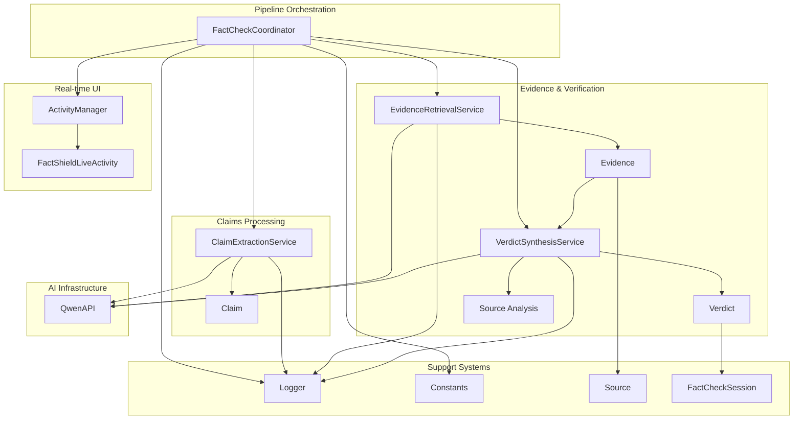
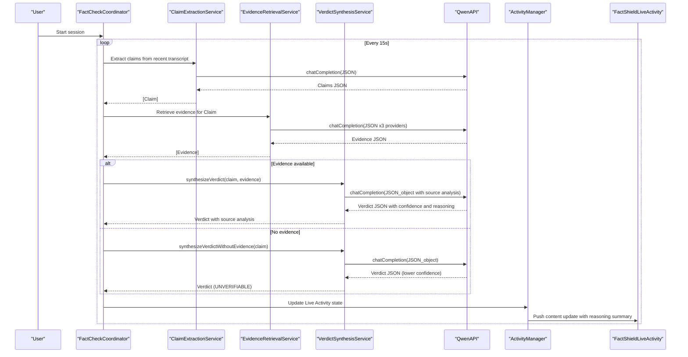
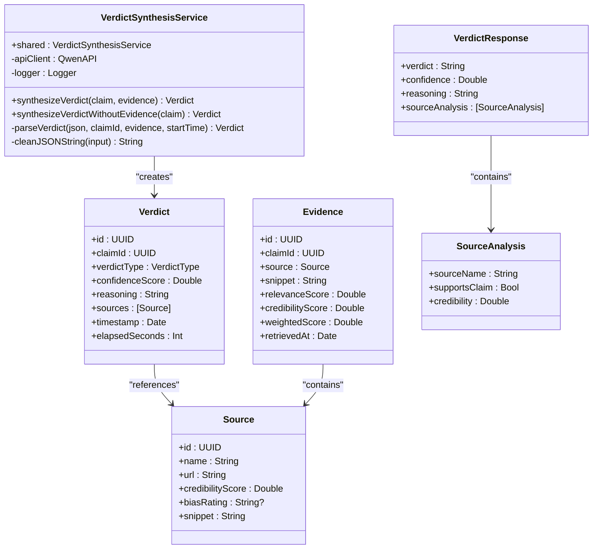
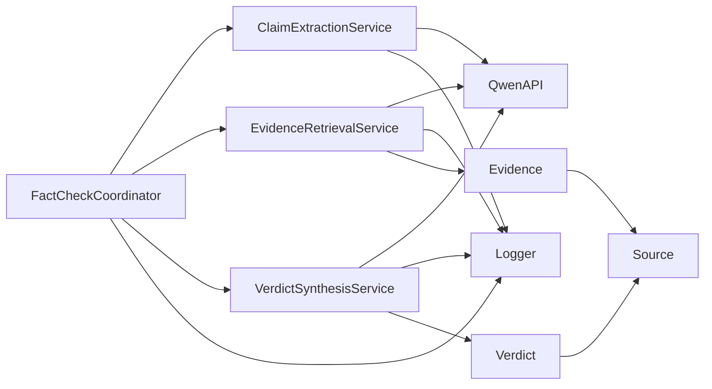

# Verdict Synthesis

<cite>
**Referenced Files in This Document**
- [VerdictSynthesisService.swift](file://FactShield/FactShield/Core/Verification/VerdictSynthesisService.swift)
- [Verdict.swift](file://FactShield/FactShield/Core/Verification/Verdict.swift)
- [Evidence.swift](file://FactShield/FactShield/Core/Verification/Evidence.swift)
- [EvidenceRetrievalService.swift](file://FactShield/FactShield/Core/Verification/EvidenceRetrievalService.swift)
- [Claim.swift](file://FactShield/FactShield/Core/Claims/Claim.swift)
- [ClaimExtractionService.swift](file://FactShield/FactShield/Core/Claims/ClaimExtractionService.swift)
- [FactCheckCoordinator.swift](file://FactShield/FactShield/Features/FactCheck/FactCheckCoordinator.swift)
- [FactShieldLiveActivity.swift](file://FactShield/FactShield/Widgets/FactShieldLiveActivity.swift)
- [ActivityManager.swift](file://FactShield/FactShield/Widgets/ActivityManager.swift)
- [QwenAPI.swift](file://FactShield/FactShield/Core/Network/QwenAPI.swift)
- [Logger.swift](file://FactShield/FactShield/Utilities/Logger.swift)
- [Constants.swift](file://FactShield/FactShield/Utilities/Constants.swift)
- [FactCheckSession.swift](file://FactShield/FactShield/Models/FactCheckSession.swift)
- [Source.swift](file://FactShield/FactShield/Models/Source.swift)
</cite>

## Update Summary
**Changes Made**
- Enhanced documentation to reflect the comprehensive chain-of-thought methodology in verdict synthesis
- Updated confidence scoring documentation with evidence-aware and evidence-free synthesis approaches
- Added detailed coverage of source analysis capabilities and evidence quality assessment
- Expanded reasoning chain construction documentation with step-by-step methodology
- Improved integration documentation with Live Activity and UI components

## Table of Contents
1. [Introduction](#introduction)
2. [Project Structure](#project-structure)
3. [Core Components](#core-components)
4. [Architecture Overview](#architecture-overview)
5. [Detailed Component Analysis](#detailed-component-analysis)
6. [Dependency Analysis](#dependency-analysis)
7. [Performance Considerations](#performance-considerations)
8. [Troubleshooting Guide](#troubleshooting-guide)
9. [Conclusion](#conclusion)
10. [Appendices](#appendices)

## Introduction
This document describes the verdict synthesis service that generates final fact-checking results with comprehensive confidence scoring and reasoning analysis. The VerdictSynthesisService implements a sophisticated chain-of-thought methodology that evaluates evidence quality, resolves conflicts, and produces transparent verdicts with detailed reasoning chains. It orchestrates evidence evaluation, applies structured reasoning prompts, parses validated JSON outputs, and produces Verdict instances with confidence scores, source analysis, and supporting evidence.

## Project Structure
The verdict synthesis capability spans several integrated modules:
- **Verification**: Evidence and verdict models, synthesis service with chain-of-thought reasoning
- **Claims**: Claim extraction and model with check-worthiness assessment
- **FactCheck**: End-to-end orchestration pipeline with real-time updates
- **Widgets**: Live Activity and Activity Manager for real-time UI integration
- **Network**: Qwen API client with JSON response formatting and usage monitoring
- **Utilities**: Centralized logging and configuration management

**Diagram sources**
- [FactCheckCoordinator.swift:1-216](file://FactShield/FactShield/Features/FactCheck/FactCheckCoordinator.swift#L1-L216)
- [VerdictSynthesisService.swift:1-184](file://FactShield/FactShield/Core/Verification/VerdictSynthesisService.swift#L1-L184)
- [EvidenceRetrievalService.swift:1-233](file://FactShield/FactShield/Core/Verification/EvidenceRetrievalService.swift#L1-L233)
- [ClaimExtractionService.swift:1-152](file://FactShield/FactShield/Core/Claims/ClaimExtractionService.swift#L1-L152)
- [ActivityManager.swift:1-87](file://FactShield/FactShield/Widgets/ActivityManager.swift#L1-L87)
- [FactShieldLiveActivity.swift:1-46](file://FactShield/FactShield/Widgets/FactShieldLiveActivity.swift#L1-L46)
- [QwenAPI.swift:1-199](file://FactShield/FactShield/Core/Network/QwenAPI.swift#L1-L199)
- [Logger.swift:1-18](file://FactShield/FactShield/Utilities/Logger.swift#L1-L18)
- [Constants.swift:1-37](file://FactShield/FactShield/Utilities/Constants.swift#L1-L37)
- [Evidence.swift:1-16](file://FactShield/FactShield/Core/Verification/Evidence.swift#L1-L16)
- [Verdict.swift:1-31](file://FactShield/FactShield/Core/Verification/Verdict.swift#L1-L31)
- [Claim.swift:1-37](file://FactShield/FactShield/Core/Claims/Claim.swift#L1-L37)
- [FactCheckSession.swift:1-54](file://FactShield/FactShield/Models/FactCheckSession.swift#L1-L54)
- [Source.swift:1-11](file://FactShield/FactShield/Models/Source.swift#L1-L11)

**Section sources**
- [FactCheckCoordinator.swift:1-216](file://FactShield/FactShield/Features/FactCheck/FactCheckCoordinator.swift#L1-L216)
- [VerdictSynthesisService.swift:1-184](file://FactShield/FactShield/Core/Verification/VerdictSynthesisService.swift#L1-L184)
- [EvidenceRetrievalService.swift:1-233](file://FactShield/FactShield/Core/Verification/EvidenceRetrievalService.swift#L1-L233)
- [ClaimExtractionService.swift:1-152](file://FactShield/FactShield/Core/Claims/ClaimExtractionService.swift#L1-L152)
- [ActivityManager.swift:1-87](file://FactShield/FactShield/Widgets/ActivityManager.swift#L1-L87)
- [FactShieldLiveActivity.swift:1-46](file://FactShield/FactShield/Widgets/FactShieldLiveActivity.swift#L1-L46)
- [QwenAPI.swift:1-199](file://FactShield/FactShield/Core/Network/QwenAPI.swift#L1-L199)
- [Logger.swift:1-18](file://FactShield/FactShield/Utilities/Logger.swift#L1-L18)
- [Constants.swift:1-37](file://FactShield/FactShield/Utilities/Constants.swift#L1-L37)
- [Evidence.swift:1-16](file://FactShield/FactShield/Core/Verification/Evidence.swift#L1-L16)
- [Verdict.swift:1-31](file://FactShield/FactShield/Core/Verification/Verdict.swift#L1-L31)
- [Claim.swift:1-37](file://FactShield/FactShield/Core/Claims/Claim.swift#L1-L37)
- [FactCheckSession.swift:1-54](file://FactShield/FactShield/Models/FactCheckSession.swift#L1-L54)
- [Source.swift:1-11](file://FactShield/FactShield/Models/Source.swift#L1-L11)

## Core Components
- **VerdictSynthesisService**: Advanced synthesis engine implementing chain-of-thought reasoning with evidence-aware and evidence-free modes, comprehensive JSON parsing, and source analysis
- **Verdict**: Comprehensive data model with verdict type, confidence score, reasoning, source analysis, timestamps, and performance metrics
- **Evidence**: Sophisticated evidence model with relevance and credibility scoring, weighted quality assessment, and temporal tracking
- **FactCheckCoordinator**: End-to-end pipeline orchestrator with real-time state management and Live Activity integration
- **ActivityManager and FactShieldLiveActivity**: Real-time UI integration with comprehensive state synchronization
- **QwenAPI**: Robust AI infrastructure with JSON response formatting, token usage monitoring, and error handling
- **Enhanced Supporting Models**: Claim with check-worthiness assessment, Source with bias rating, and FactCheckSession with comprehensive session tracking

**Section sources**
- [VerdictSynthesisService.swift:22-184](file://FactShield/FactShield/Core/Verification/VerdictSynthesisService.swift#L22-L184)
- [Verdict.swift:3-31](file://FactShield/FactShield/Core/Verification/Verdict.swift#L3-L31)
- [Evidence.swift:3-16](file://FactShield/FactShield/Core/Verification/Evidence.swift#L3-L16)
- [FactCheckCoordinator.swift:5-216](file://FactShield/FactShield/Features/FactCheck/FactCheckCoordinator.swift#L5-L216)
- [ActivityManager.swift:4-87](file://FactShield/FactShield/Widgets/ActivityManager.swift#L4-L87)
- [FactShieldLiveActivity.swift:5-46](file://FactShield/FactShield/Widgets/FactShieldLiveActivity.swift#L5-L46)
- [QwenAPI.swift:68-199](file://FactShield/FactShield/Core/Network/QwenAPI.swift#L68-L199)
- [Claim.swift:3-37](file://FactShield/FactShield/Core/Claims/Claim.swift#L3-L37)
- [Source.swift:3-11](file://FactShield/FactShield/Models/Source.swift#L3-L11)
- [FactCheckSession.swift:3-54](file://FactShield/FactShield/Models/FactCheckSession.swift#L3-L54)

## Architecture Overview
The verdict synthesis pipeline implements a sophisticated chain-of-thought methodology that processes claims through evidence evaluation, conflict resolution, and confidence scoring. The system provides real-time updates through Live Activity integration and maintains comprehensive audit trails through structured logging.

**Diagram sources**
- [FactCheckCoordinator.swift:67-161](file://FactShield/FactShield/Features/FactCheck/FactCheckCoordinator.swift#L67-L161)
- [ClaimExtractionService.swift:17-56](file://FactShield/FactShield/Core/Claims/ClaimExtractionService.swift#L17-L56)
- [EvidenceRetrievalService.swift:15-63](file://FactShield/FactShield/Core/Verification/EvidenceRetrievalService.swift#L15-L63)
- [VerdictSynthesisService.swift:30-121](file://FactShield/FactShield/Core/Verification/VerdictSynthesisService.swift#L30-L121)
- [QwenAPI.swift:84-151](file://FactShield/FactShield/Core/Network/QwenAPI.swift#L84-L151)
- [ActivityManager.swift:50-67](file://FactShield/FactShield/Widgets/ActivityManager.swift#L50-L67)
- [FactShieldLiveActivity.swift:10-20](file://FactShield/FactShield/Widgets/FactShieldLiveActivity.swift#L10-L20)

## Detailed Component Analysis

### VerdictSynthesisService
The VerdictSynthesisService implements a comprehensive chain-of-thought methodology with two distinct synthesis modes:

**Evidence-Aware Synthesis** (Lines 29-80):
- Constructs detailed prompts comparing claims against evidence with source credibility assessment
- Implements step-by-step reasoning: evidence analysis → claim comparison → bias consideration → conflict resolution
- Returns structured JSON with verdict, confidence, reasoning, and comprehensive source analysis
- Maintains confidence clamping in [0,1] and detailed performance metrics

**Evidence-Free Synthesis** (Lines 82-121):
- Utilizes model knowledge for claims without external evidence
- Explicitly marks UNVERIFIABLE when insufficient evidence exists
- Reduces expected confidence due to lack of external validation
- Provides transparent reasoning about uncertainty

**Advanced JSON Processing** (Lines 125-165):
- Implements robust JSON parsing with fence removal and validation
- Handles edge cases: missing content, invalid JSON, invalid verdict types
- Normalizes verdict types and maintains comprehensive error reporting
- Calculates elapsed processing time for performance monitoring

**Chain-of-Thought Methodology**:
- Stepwise analysis requires explicit reasoning steps
- Conflict resolution methodology with reliability assessment
- Source credibility and bias consideration
- Structured confidence scoring with uncertainty quantification
- Concise reasoning summaries with transparency

**Section sources**
- [VerdictSynthesisService.swift:22-184](file://FactShield/FactShield/Core/Verification/VerdictSynthesisService.swift#L22-L184)
- [QwenAPI.swift:68-151](file://FactShield/FactShield/Core/Network/QwenAPI.swift#L68-L151)
- [Logger.swift:10-11](file://FactShield/FactShield/Utilities/Logger.swift#L10-L11)

#### Class Diagram: VerdictSynthesisService and Related Types

**Diagram sources**
- [VerdictSynthesisService.swift:22-184](file://FactShield/FactShield/Core/Verification/VerdictSynthesisService.swift#L22-L184)
- [Verdict.swift:3-31](file://FactShield/FactShield/Core/Verification/Verdict.swift#L3-L31)
- [Evidence.swift:3-16](file://FactShield/FactShield/Core/Verification/Evidence.swift#L3-L16)
- [Source.swift:3-11](file://FactShield/FactShield/Models/Source.swift#L3-L11)

### Verdict Data Model
The Verdict model provides comprehensive fact-checking results with detailed metadata:

**Core Fields**:
- `id`: Unique identifier for traceability
- `claimId`: Direct linkage to originating claim for audit trails
- `verdictType`: Enumerated type from standardized categories
- `confidenceScore`: Numeric confidence normalized to [0,1] with uncertainty quantification
- `reasoning`: Human-readable explanation with chain-of-thought transparency
- `sources`: Complete source list with credibility assessment
- `timestamp`: Creation time for temporal analysis
- `elapsedSeconds`: Processing duration for performance monitoring

**VerdictType Categories**:
- `TRUE`: Strong factual support with high confidence
- `SUBSTANTIALLY TRUE`: Primarily accurate with minor qualifiers
- `MISLEADING`: Contains factual elements but is misleading
- `FALSE`: Clear factual inaccuracy
- `UNVERIFIABLE`: Insufficient evidence for determination

**Enhanced Color Mapping**:
- `TRUE`: Green (accurate)
- `SUBSTANTIALLY TRUE`: Yellow (mostly accurate)
- `MISLEADING`: Orange (cautionary)
- `FALSE`: Red (inaccurate)
- `UNVERIFIABLE`: Gray (uncertain)

**Section sources**
- [Verdict.swift:3-31](file://FactShield/FactShield/Core/Verification/Verdict.swift#L3-L31)

### Evidence Model and Advanced Weighting
The Evidence model implements sophisticated quality assessment:

**Quality Metrics**:
- `relevanceScore`: Direct claim-evidence alignment (0.0 to 1.0)
- `credibilityScore`: Source trustworthiness assessment (0.0 to 1.0)
- `weightedScore`: Composite quality (relevance: 60% + credibility: 40%)

**Temporal Tracking**:
- `retrievedAt`: Timestamp for evidence freshness assessment
- Enables temporal quality analysis and evidence aging

**Weighted Scoring Rationale**:
- Emphasizes relevance (60%) as primary factor in claim verification
- Supports credibility (40%) for source trustworthiness
- Balances immediate claim relevance with long-term source reliability

**Section sources**
- [Evidence.swift:3-16](file://FactShield/FactShield/Core/Verification/Evidence.swift#L3-L16)

### Evidence Retrieval Service (Enhanced Context)
The EvidenceRetrievalService provides comprehensive evidence gathering with advanced processing:

**Multi-Provider Integration**:
- Concurrent retrieval from Tavily, Google Fact Check, and News APIs
- Parallel processing reduces overall latency
- Provider-specific credibility scoring (0.7-0.9)

**Advanced Processing**:
- URL-based deduplication prevents redundant evidence
- Weighted scoring enables quality-based ranking
- Configurable limits (3-5 sources) prevent context overflow

**Structured Response Processing**:
- Provider-specific prompts with JSON formatting
- Robust JSON parsing with fence removal
- Quality filtering and normalization

**Section sources**
- [EvidenceRetrievalService.swift:15-63](file://FactShield/FactShield/Core/Verification/EvidenceRetrievalService.swift#L15-L63)
- [EvidenceRetrievalService.swift:170-214](file://FactShield/FactShield/Core/Verification/EvidenceRetrievalService.swift#L170-L214)

### Claim and Enhanced Extraction
Claims are processed through sophisticated extraction with quality assessment:

**Extraction Process**:
- Structured prompts with quality constraints
- JSON-formatted extraction with check-worthiness ratings
- High/medium priority filtering for verification

**Quality Assessment**:
- `checkWorthiness`: High/medium/low priority classification
- `status`: Lifecycle tracking (pending, extracting, verifying, complete)
- Speaker attribution and temporal context

**Section sources**
- [ClaimExtractionService.swift:17-56](file://FactShield/FactShield/Core/Claims/ClaimExtractionService.swift#L17-L56)
- [Claim.swift:3-37](file://FactShield/FactShield/Core/Claims/Claim.swift#L3-L37)

### Live Activity Integration
Real-time UI integration with comprehensive state synchronization:

**Comprehensive State Updates**:
- Status tracking: Listening, Extracting, Searching, Verifying, Complete
- Verdict type, confidence, source count, reasoning summary
- Claim text, elapsed time, and timestamp
- Top sources for quick reference

**Activity Management**:
- Automatic Live Activity lifecycle management
- Graceful error handling for disabled activities
- Performance monitoring and logging

**Section sources**
- [FactCheckCoordinator.swift:163-201](file://FactShield/FactShield/Features/FactCheck/FactCheckCoordinator.swift#L163-L201)
- [ActivityManager.swift:15-67](file://FactShield/FactShield/Widgets/ActivityManager.swift#L15-L67)
- [FactShieldLiveActivity.swift:10-43](file://FactShield/FactShield/Widgets/FactShieldLiveActivity.swift#L10-L46)

### End-to-End Synthesis Pipeline
The pipeline implements sophisticated decision-making with comprehensive error handling:

**Stage 1: Claim Extraction**
- 15-second periodic extraction from recent transcript
- Quality filtering for high/medium check-worthiness
- Real-time status updates

**Stage 2: Evidence Retrieval**
- Multi-provider concurrent search
- Quality-based deduplication and ranking
- Configurable source limits

**Stage 3: Evidence-Free Fallback**
- Automatic fallback when no evidence found
- Conservative confidence reduction
- Transparent uncertainty communication

**Stage 4: Verdict Synthesis**
- Chain-of-thought reasoning with source analysis
- Comprehensive confidence scoring
- Detailed reasoning documentation

**Stage 5: Live Activity Updates**
- Real-time state synchronization
- Comprehensive UI integration
- Performance metrics and error reporting

**Section sources**
- [FactCheckCoordinator.swift:87-161](file://FactShield/FactShield/Features/FactCheck/FactCheckCoordinator.swift#L87-L161)

## Dependency Analysis
The system exhibits well-structured dependency relationships:

**Primary Dependencies**:
- VerdictSynthesisService → QwenAPI (chat completion), Logger (monitoring)
- FactCheckCoordinator → All services (orchestration)
- ActivityManager → FactShieldLiveActivity (UI integration)
- EvidenceRetrievalService → QwenAPI (provider integration)
- ClaimExtractionService → QwenAPI (extraction)

**Data Flow Dependencies**:
- Evidence → Source (quality assessment)
- Verdict → Source (comprehensive analysis)
- Claim → Evidence (verification linkage)
- Session → Verdict (historical tracking)

**Diagram sources**
- [FactCheckCoordinator.swift:11-16](file://FactShield/FactShield/Features/FactCheck/FactCheckCoordinator.swift#L11-L16)
- [VerdictSynthesisService.swift:26-27](file://FactShield/FactShield/Core/Verification/VerdictSynthesisService.swift#L26-L27)
- [EvidenceRetrievalService.swift:8-9](file://FactShield/FactShield/Core/Verification/EvidenceRetrievalService.swift#L8-L9)
- [ClaimExtractionService.swift:8-9](file://FactShield/FactShield/Core/Claims/ClaimExtractionService.swift#L8-L9)
- [QwenAPI.swift:68-73](file://FactShield/FactShield/Core/Network/QwenAPI.swift#L68-L73)
- [Logger.swift:10-11](file://FactShield/FactShield/Utilities/Logger.swift#L10-L11)
- [Verdict.swift:9-11](file://FactShield/FactShield/Core/Verification/Verdict.swift#L9-L11)
- [Evidence.swift:6-9](file://FactShield/FactShield/Core/Verification/Evidence.swift#L6-L9)
- [Source.swift:3-9](file://FactShield/FactShield/Models/Source.swift#L3-L9)

**Section sources**
- [FactCheckCoordinator.swift:11-16](file://FactShield/FactShield/Features/FactCheck/FactCheckCoordinator.swift#L11-L16)
- [VerdictSynthesisService.swift:26-27](file://FactShield/FactShield/Core/Verification/VerdictSynthesisService.swift#L26-L27)
- [EvidenceRetrievalService.swift:8-9](file://FactShield/FactShield/Core/Verification/EvidenceRetrievalService.swift#L8-L9)
- [ClaimExtractionService.swift:8-9](file://FactShield/FactShield/Core/Claims/ClaimExtractionService.swift#L8-L9)
- [QwenAPI.swift:68-73](file://FactShield/FactShield/Core/Network/QwenAPI.swift#L68-L73)
- [Logger.swift:10-11](file://FactShield/FactShield/Utilities/Logger.swift#L10-L11)
- [Verdict.swift:9-11](file://FactShield/FactShield/Core/Verification/Verdict.swift#L9-L11)
- [Evidence.swift:6-9](file://FactShield/FactShield/Core/Verification/Evidence.swift#L6-L9)
- [Source.swift:3-9](file://FactShield/FactShield/Models/Source.swift#L3-L9)

## Performance Considerations
The system implements several optimization strategies:

**Concurrency Optimization**:
- Evidence retrieval uses concurrent tasks across multiple providers
- Parallel processing reduces overall pipeline latency
- Asynchronous processing prevents UI blocking

**Quality Filtering**:
- Top-N evidence selection prevents excessive context length
- Weighted scoring ensures highest quality evidence prioritization
- Configurable limits (3-5 sources) balance quality vs. performance

**Temperature Optimization**:
- Lower temperatures (0.2-0.3) reduce JSON variability for deterministic parsing
- Temperature 0.7 for general operations balances creativity and consistency
- Provider-specific temperature tuning for different use cases

**Resource Management**:
- Structured logging minimizes performance overhead
- JSON cleaning prevents parsing failures and retries
- Comprehensive error handling prevents cascade failures

**Token Efficiency**:
- QwenAPI logs usage metrics for cost optimization
- Prompt engineering minimizes token consumption
- Response format optimization reduces unnecessary data

## Troubleshooting Guide
Comprehensive error handling and recovery mechanisms:

**API Response Issues**:
- No content in API response: Network failure or provider outage
- Invalid JSON: LLM fence removal and validation failures
- Invalid verdict type: Model output normalization and fallback

**System Integration Issues**:
- Live Activity not enabled: User permission requirements
- Missing API key: Environment configuration failures
- Provider timeouts: Network connectivity issues

**Processing Failures**:
- Evidence-free fallback: Automatic UNVERIFIABLE marking
- Confidence reduction: Conservative scoring for uncertain claims
- Transparent error reporting: Comprehensive logging and user feedback

**Recovery Strategies**:
- Retry mechanisms for transient failures
- Graceful degradation to evidence-free mode
- Comprehensive error logging for debugging
- User-friendly error messages and recovery options

**Section sources**
- [VerdictSynthesisService.swift:6-18](file://FactShield/FactShield/Core/Verification/VerdictSynthesisService.swift#L6-L18)
- [VerdictSynthesisService.swift:125-165](file://FactShield/FactShield/Core/Verification/VerdictSynthesisService.swift#L125-L165)
- [ActivityManager.swift:17-20](file://FactShield/FactShield/Widgets/ActivityManager.swift#L17-L20)
- [Logger.swift:10-11](file://FactShield/FactShield/Utilities/Logger.swift#L10-L11)

## Conclusion
The verdict synthesis service implements a sophisticated, chain-of-thought methodology that provides comprehensive fact-checking results with transparent reasoning and confidence scoring. The system's dual-mode synthesis (evidence-aware and evidence-free), advanced source analysis, and real-time UI integration deliver both accuracy and user transparency. Through careful quality assessment, robust error handling, and performance optimization, it provides a reliable foundation for automated fact-checking applications.

The implementation demonstrates best practices in AI-assisted verification systems, with comprehensive logging, structured error handling, and user-centric design. The chain-of-thought methodology ensures transparency in decision-making, while the confidence scoring provides quantitative measures of certainty that enable informed user decisions.

## Appendices

### Practical Workflows and Examples

**Evidence-Aware Synthesis Workflow**:
1. **Input**: Claim text with Evidence list containing relevance and credibility scores
2. **Processing**: Chain-of-thought analysis comparing claim against each evidence
3. **Conflict Resolution**: Source credibility assessment and bias consideration
4. **Output**: Verdict with confidence, reasoning, and comprehensive source analysis

**Evidence-Free Synthesis Workflow**:
1. **Input**: Claim text only (no external evidence)
2. **Processing**: Model knowledge assessment with uncertainty quantification
3. **Conservative Scoring**: Lower confidence expectations for unverified claims
4. **Output**: UNVERIFIABLE verdict with transparency about limitations

**Live Activity Integration**:
- Real-time status updates: Listening, Extracting, Searching, Verifying, Complete
- Comprehensive verdict display with confidence and reasoning
- Source count and top sources for quick reference
- Performance metrics and elapsed time tracking

**Section sources**
- [VerdictSynthesisService.swift:30-121](file://FactShield/FactShield/Core/Verification/VerdictSynthesisService.swift#L30-L121)
- [FactCheckCoordinator.swift:163-201](file://FactShield/FactShield/Features/FactCheck/FactCheckCoordinator.swift#L163-L201)
- [ActivityManager.swift:50-67](file://FactShield/FactShield/Widgets/ActivityManager.swift#L50-L67)

### Confidence Scoring and Thresholding

**Confidence Range Management**:
- Normalized to [0.0, 1.0] for consistent interpretation
- Evidence-free synthesis reduces expected confidence (typically 0.3-0.6)
- Evidence-aware synthesis maintains higher confidence (0.7-0.95) when strong evidence exists

**Threshold-Based Decision Making**:
- `TRUE`: Confidence ≥ 0.85
- `SUBSTANTIALLY TRUE`: 0.70 ≤ Confidence < 0.85
- `MISLEADING`: 0.60 ≤ Confidence < 0.70
- `FALSE`: Confidence < 0.60
- `UNVERIFIABLE`: Evidence-free fallback with reduced confidence

**Uncertainty Quantification**:
- Evidence-free mode explicitly communicates uncertainty
- Source analysis provides transparency about evidence quality
- Confidence intervals and reasoning explain decision rationale

**Section sources**
- [VerdictSynthesisService.swift:152-164](file://FactShield/FactShield/Core/Verification/VerdictSynthesisService.swift#L152-L164)
- [Verdict.swift:13-29](file://FactShield/FactShield/Core/Verification/Verdict.swift#L13-L29)

### Chain-of-Thought Methodology and Reasoning Analysis

**Step-by-Step Analysis Framework**:
1. **Evidence Assessment**: Systematic evaluation of each piece of evidence
2. **Claim Comparison**: Direct comparison between claim and supporting evidence
3. **Source Credibility**: Assessment of source trustworthiness and potential bias
4. **Conflict Resolution**: Methodical resolution of contradictory evidence
5. **Decision Finalization**: Structured conclusion with confidence scoring

**Source Analysis Capabilities**:
- Individual source support assessment (supportsClaim boolean)
- Source credibility quantification (0.0-1.0)
- Bias rating consideration ("left", "center", "right")
- Comprehensive evidence quality evaluation

**Reasoning Transparency**:
- Stepwise explanation of decision process
- Clear conflict resolution rationale
- Confidence justification with evidence quality metrics
- Transparent uncertainty communication

**Section sources**
- [VerdictSynthesisService.swift:41-65](file://FactShield/FactShield/Core/Verification/VerdictSynthesisService.swift#L41-L65)
- [VerdictSynthesisService.swift:125-165](file://FactShield/FactShield/Core/Verification/VerdictSynthesisService.swift#L125-L165)

### Integration Notes and Best Practices

**QwenAPI Integration**:
- Centralized chat completion with JSON response formatting
- Comprehensive usage logging and token monitoring
- Configurable temperature settings for different use cases
- Robust error handling and retry mechanisms

**Configuration Management**:
- Constants for pipeline thresholds (min/max sources: 3-5)
- Extraction interval configuration (15 seconds default)
- Temperature tuning for different synthesis modes
- Performance monitoring and optimization parameters

**Session Management**:
- Comprehensive FactCheckSession tracking claims and verdicts
- Real-time transcript management and claim history
- Session lifecycle management and cleanup
- Historical analysis and performance metrics

**Section sources**
- [QwenAPI.swift:84-151](file://FactShield/FactShield/Core/Network/QwenAPI.swift#L84-L151)
- [Constants.swift:23-26](file://FactShield/FactShield/Utilities/Constants.swift#L23-L26)
- [FactCheckSession.swift:3-35](file://FactShield/FactShield/Models/FactCheckSession.swift#L3-L35)