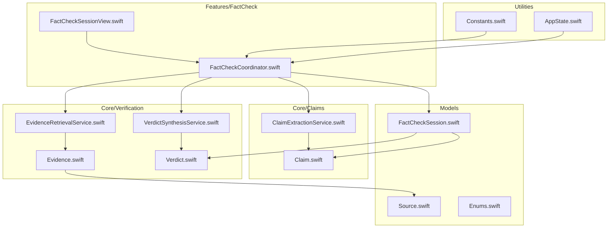
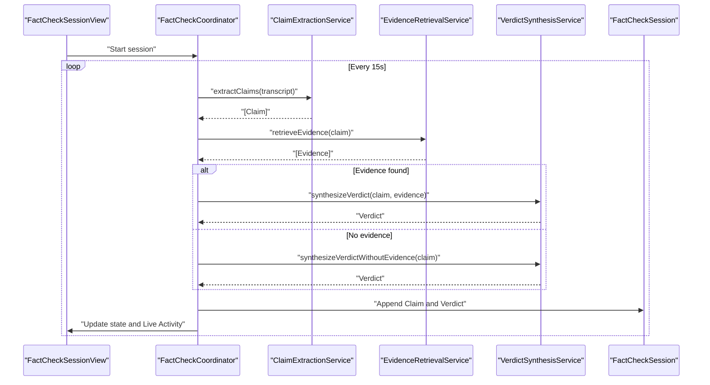
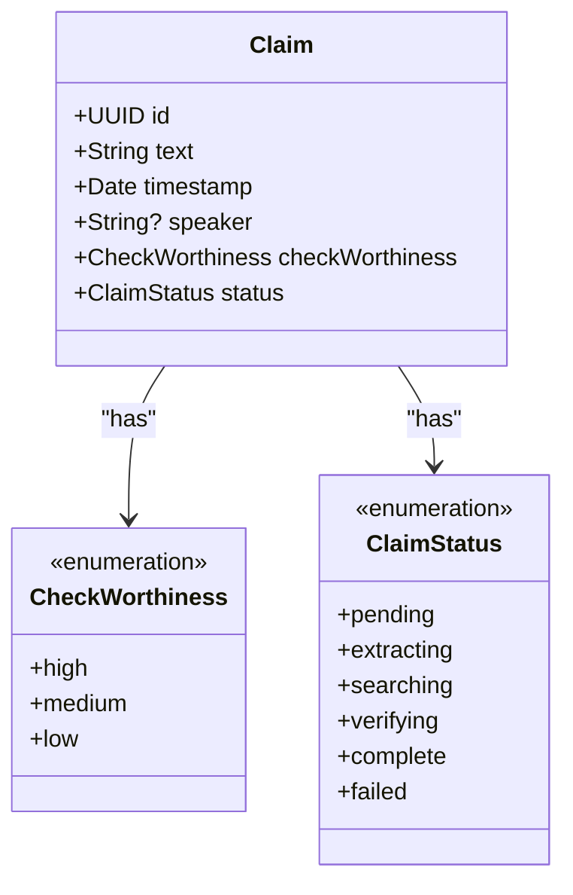
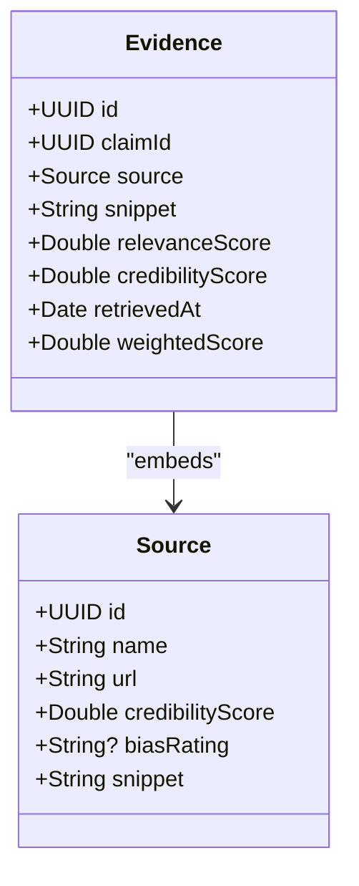
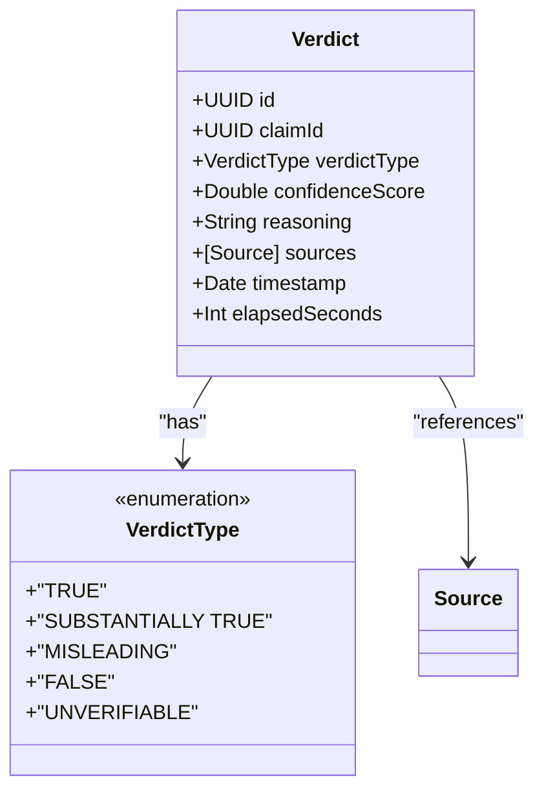
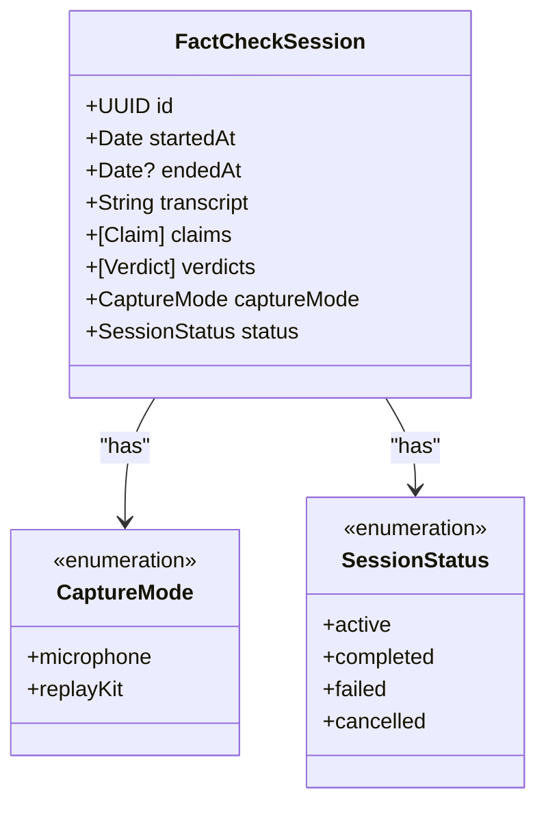
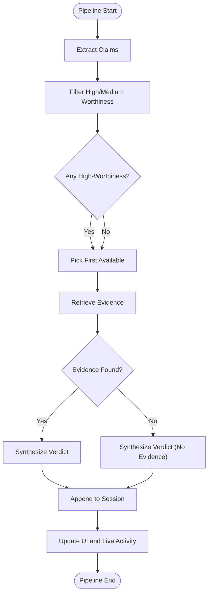
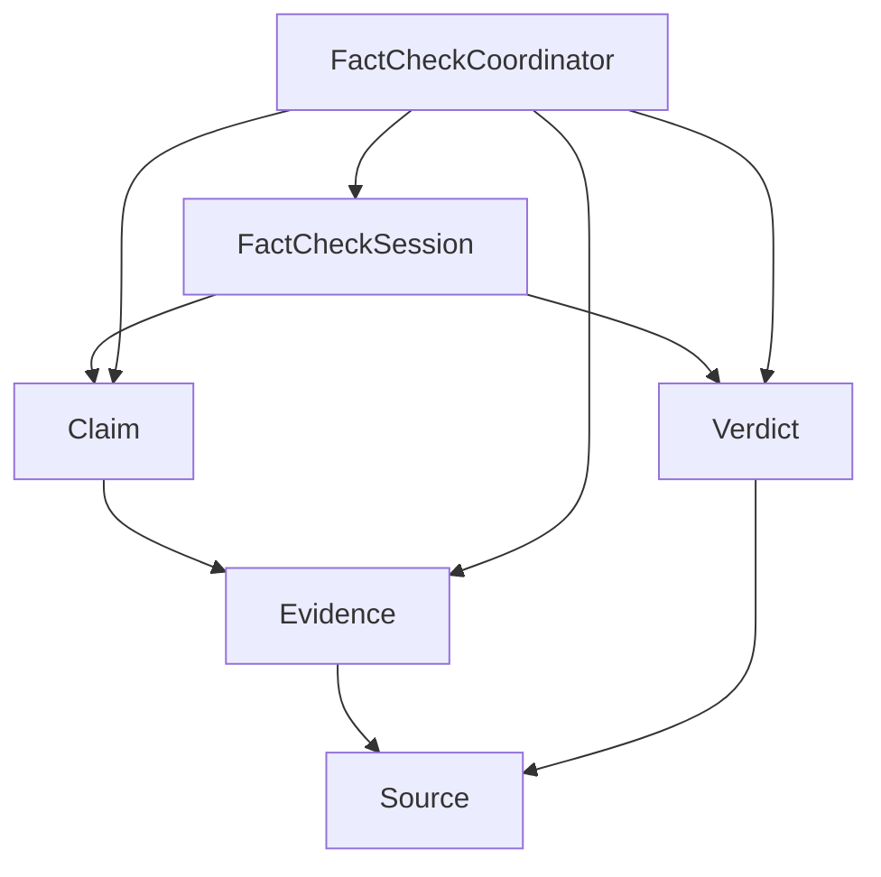
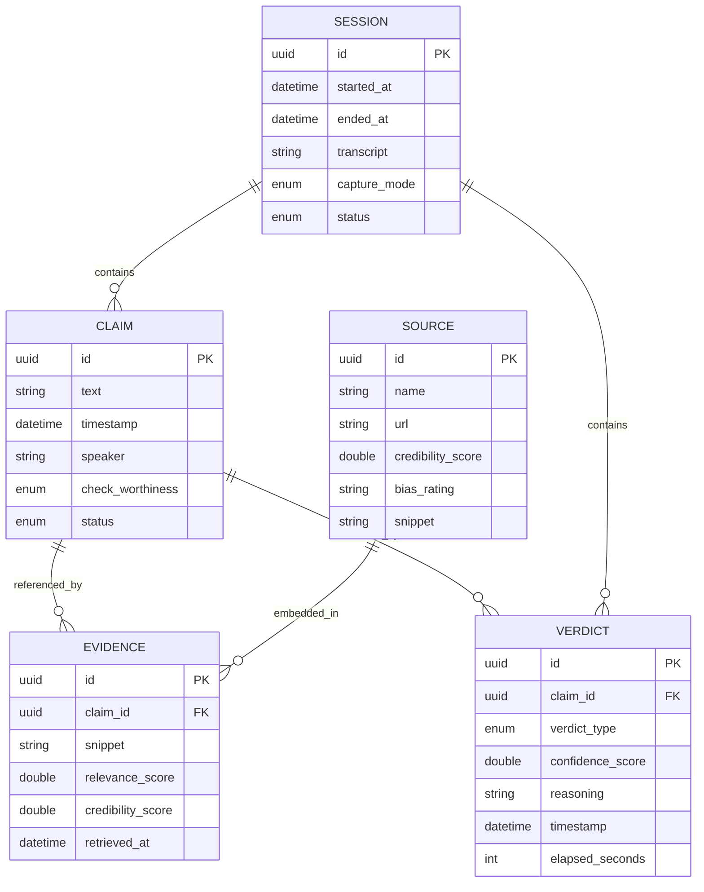

# Core Data Models

<cite>
**Referenced Files in This Document**
- [FactCheckSession.swift](file://FactShield/FactShield/Models/FactCheckSession.swift)
- [Source.swift](file://FactShield/FactShield/Models/Source.swift)
- [Enums.swift](file://FactShield/FactShield/Models/Enums.swift)
- [Claim.swift](file://FactShield/FactShield/Core/Claims/Claim.swift)
- [Evidence.swift](file://FactShield/FactShield/Core/Verification/Evidence.swift)
- [Verdict.swift](file://FactShield/FactShield/Core/Verification/Verdict.swift)
- [ClaimExtractionService.swift](file://FactShield/FactShield/Core/Claims/ClaimExtractionService.swift)
- [EvidenceRetrievalService.swift](file://FactShield/FactShield/Core/Verification/EvidenceRetrievalService.swift)
- [VerdictSynthesisService.swift](file://FactShield/FactShield/Core/Verification/VerdictSynthesisService.swift)
- [FactCheckCoordinator.swift](file://FactShield/FactShield/Features/FactCheck/FactCheckCoordinator.swift)
- [FactCheckSessionView.swift](file://FactShield/FactShield/Features/FactCheck/FactCheckSessionView.swift)
- [Constants.swift](file://FactShield/FactShield/Utilities/Constants.swift)
- [AppState.swift](file://FactShield/FactShield/App/AppState.swift)
</cite>

## Table of Contents
1. [Introduction](#introduction)
2. [Project Structure](#project-structure)
3. [Core Components](#core-components)
4. [Architecture Overview](#architecture-overview)
5. [Detailed Component Analysis](#detailed-component-analysis)
6. [Dependency Analysis](#dependency-analysis)
7. [Performance Considerations](#performance-considerations)
8. [Troubleshooting Guide](#troubleshooting-guide)
9. [Conclusion](#conclusion)
10. [Appendices](#appendices)

## Introduction
This document describes the core data models that power FactChecking Live: Claim, Evidence, Verdict, and FactCheckSession. It defines each model’s fields, data types, validation rules, and business constraints, and explains how they relate to each other. It also documents serialization formats (Codable), initialization patterns, and transformation flows used by the verification pipeline. Examples of instantiation and persistence patterns are included to help developers integrate these models consistently.

## Project Structure
The data models are defined under the Models folder and integrated with services under Core/Claims and Core/Verification. The FactCheckCoordinator orchestrates the end-to-end pipeline, while FactCheckSessionView renders the session state. Constants and AppState provide global configuration and runtime state.

**Diagram sources**
- [FactCheckSession.swift:1-54](file://FactShield/FactShield/Models/FactCheckSession.swift#L1-L54)
- [Source.swift:1-11](file://FactShield/FactShield/Models/Source.swift#L1-L11)
- [Enums.swift:1-48](file://FactShield/FactShield/Models/Enums.swift#L1-L48)
- [Claim.swift:1-37](file://FactShield/FactShield/Core/Claims/Claim.swift#L1-L37)
- [Evidence.swift:1-16](file://FactShield/FactShield/Core/Verification/Evidence.swift#L1-L16)
- [Verdict.swift:1-31](file://FactShield/FactShield/Core/Verification/Verdict.swift#L1-L31)
- [ClaimExtractionService.swift:1-152](file://FactShield/FactShield/Core/Claims/ClaimExtractionService.swift#L1-L152)
- [EvidenceRetrievalService.swift:1-233](file://FactShield/FactShield/Core/Verification/EvidenceRetrievalService.swift#L1-L233)
- [VerdictSynthesisService.swift:1-184](file://FactShield/FactShield/Core/Verification/VerdictSynthesisService.swift#L1-L184)
- [FactCheckCoordinator.swift:1-216](file://FactShield/FactShield/Features/FactCheck/FactCheckCoordinator.swift#L1-L216)
- [FactCheckSessionView.swift:1-506](file://FactShield/FactShield/Features/FactCheck/FactCheckSessionView.swift#L1-L506)
- [Constants.swift:1-37](file://FactShield/FactShield/Utilities/Constants.swift#L1-L37)
- [AppState.swift:1-30](file://FactShield/FactShield/App/AppState.swift#L1-L30)

**Section sources**
- [FactCheckSession.swift:1-54](file://FactShield/FactShield/Models/FactCheckSession.swift#L1-L54)
- [Claim.swift:1-37](file://FactShield/FactShield/Core/Claims/Claim.swift#L1-L37)
- [Evidence.swift:1-16](file://FactShield/FactShield/Core/Verification/Evidence.swift#L1-L16)
- [Verdict.swift:1-31](file://FactShield/FactShield/Core/Verification/Verdict.swift#L1-L31)
- [Source.swift:1-11](file://FactShield/FactShield/Models/Source.swift#L1-L11)
- [FactCheckCoordinator.swift:1-216](file://FactShield/FactShield/Features/FactCheck/FactCheckCoordinator.swift#L1-L216)
- [FactCheckSessionView.swift:1-506](file://FactShield/FactShield/Features/FactCheck/FactCheckSessionView.swift#L1-L506)
- [Constants.swift:1-37](file://FactShield/FactShield/Utilities/Constants.swift#L1-L37)
- [AppState.swift:1-30](file://FactShield/FactShield/App/AppState.swift#L1-L30)

## Core Components
This section documents the four primary models and their roles in the system.

- FactCheckSession
  - Purpose: Encapsulates a single fact-checking session lifecycle, including capture mode, status, timestamps, transcript, and aggregated claims and verdicts.
  - Key fields:
    - id: UUID (unique identifier)
    - startedAt: Date (session start)
    - endedAt: Date? (optional end timestamp)
    - transcript: String (aggregated live transcript)
    - claims: [Claim] (detected claims)
    - verdicts: [Verdict] (synthesized conclusions)
    - captureMode: CaptureMode (enumeration)
    - status: SessionStatus (enumeration)
  - Initialization: Default initializer sets id, timestamps, empty transcript and arrays, default capture mode, and active status.
  - Validation and constraints:
    - endedAt is nil until set upon completion.
    - status transitions from active to completed/failed/cancelled.
    - captureMode restricts to microphone or replayKit.
  - Serialization: Codable and Identifiable.

- Claim
  - Purpose: Represents a verifiable statement extracted from audio transcription.
  - Key fields:
    - id: UUID
    - text: String (claim content)
    - timestamp: Date (when extracted)
    - speaker: String? (optional speaker attribution)
    - checkWorthiness: CheckWorthiness (enumeration)
    - status: ClaimStatus (enumeration)
  - Initialization: Structured with explicit defaults and an empty static factory.
  - Validation and constraints:
    - checkWorthiness categorized as high/medium/low.
    - status progresses through pending → extracting → searching → verifying → complete/failed.
  - Serialization: Codable and Hashable.

- Evidence
  - Purpose: Stores a single supporting or contradicting piece of information for a claim.
  - Key fields:
    - id: UUID
    - claimId: UUID (foreign key to Claim)
    - source: Source (embedded source record)
    - snippet: String (quoted text)
    - relevanceScore: Double (0.0–1.0)
    - credibilityScore: Double (0.0–1.0)
    - retrievedAt: Date (timestamp)
    - weightedScore: Double (computed property)
  - Computed property: weightedScore = relevanceScore × 0.6 + credibilityScore × 0.4.
  - Validation and constraints:
    - Scores clamped to [0.0, 1.0] during construction.
    - Deduplication occurs by source URL in retrieval service.
  - Serialization: Codable and Hashable.

- Verdict
  - Purpose: Final conclusion for a claim, including confidence, reasoning, and cited sources.
  - Key fields:
    - id: UUID
    - claimId: UUID (foreign key to Claim)
    - verdictType: VerdictType (enumeration)
    - confidenceScore: Double (0.0–1.0)
    - reasoning: String (chain-of-thought summary)
    - sources: [Source] (cited sources)
    - timestamp: Date (when synthesized)
    - elapsedSeconds: Int (processing duration)
  - Enumerations:
    - VerdictType: TRUE, SUBSTANTIALLY TRUE, MISLEADING, FALSE, UNVERIFIABLE with color mapping.
  - Validation and constraints:
    - confidenceScore clamped to [0.0, 1.0].
    - elapsedSeconds derived from timing around synthesis.
  - Serialization: Codable and Hashable.

- Source
  - Purpose: Lightweight, embedded source record attached to Evidence and Verdict.
  - Key fields:
    - id: UUID
    - name: String
    - url: String
    - credibilityScore: Double (0.0–1.0)
    - biasRating: String? ("left", "center", "right")
    - snippet: String
  - Validation and constraints:
    - credibilityScore constrained to [0.0, 1.0].
    - biasRating optional and restricted to predefined values.
  - Serialization: Codable and Hashable.

**Section sources**
- [FactCheckSession.swift:3-35](file://FactShield/FactShield/Models/FactCheckSession.swift#L3-L35)
- [Claim.swift:3-25](file://FactShield/FactShield/Core/Claims/Claim.swift#L3-L25)
- [Evidence.swift:3-15](file://FactShield/FactShield/Core/Verification/Evidence.swift#L3-L15)
- [Verdict.swift:3-30](file://FactShield/FactShield/Core/Verification/Verdict.swift#L3-L30)
- [Source.swift:3-10](file://FactShield/FactShield/Models/Source.swift#L3-L10)

## Architecture Overview
The FactCheckCoordinator drives the pipeline: periodically extracting claims from recent transcript segments, retrieving evidence from multiple providers, synthesizing a verdict, and updating the session and UI. Evidence and Verdict embed Source records, and FactCheckSession aggregates Claims and Verdicts.

**Diagram sources**
- [FactCheckCoordinator.swift:38-161](file://FactShield/FactShield/Features/FactCheck/FactCheckCoordinator.swift#L38-L161)
- [ClaimExtractionService.swift:18-56](file://FactShield/FactShield/Core/Claims/ClaimExtractionService.swift#L18-L56)
- [EvidenceRetrievalService.swift:16-63](file://FactShield/FactShield/Core/Verification/EvidenceRetrievalService.swift#L16-L63)
- [VerdictSynthesisService.swift:30-80](file://FactShield/FactShield/Core/Verification/VerdictSynthesisService.swift#L30-L80)
- [FactCheckSession.swift:8-11](file://FactShield/FactShield/Models/FactCheckSession.swift#L8-L11)

**Section sources**
- [FactCheckCoordinator.swift:1-216](file://FactShield/FactShield/Features/FactCheck/FactCheckCoordinator.swift#L1-L216)
- [FactCheckSessionView.swift:1-77](file://FactShield/FactShield/Features/FactCheck/FactCheckSessionView.swift#L1-L77)

## Detailed Component Analysis

### Claim Model
- Structure and purpose:
  - Represents a verifiable statement extracted from audio transcripts.
  - Includes speaker attribution, timestamp, and status progression.
- Field definitions and types:
  - id: UUID
  - text: String
  - timestamp: Date
  - speaker: String?
  - checkWorthiness: CheckWorthiness (high/medium/low)
  - status: ClaimStatus (pending/extracting/searching/verifying/complete/failed)
- Validation and constraints:
  - checkWorthiness determines downstream filtering.
  - status machine enforces logical ordering.
- Serialization: Codable and Hashable.
- Instantiation patterns:
  - Factory default via empty static member.
  - Construction from API parsing with safe defaults for unknown values.
- Persistence patterns:
  - Stored in FactCheckSession.claims and appended by FactCheckCoordinator.

**Diagram sources**
- [Claim.swift:3-25](file://FactShield/FactShield/Core/Claims/Claim.swift#L3-L25)

**Section sources**
- [Claim.swift:1-37](file://FactShield/FactShield/Core/Claims/Claim.swift#L1-L37)
- [ClaimExtractionService.swift:70-132](file://FactShield/FactShield/Core/Claims/ClaimExtractionService.swift#L70-L132)
- [FactCheckSession.swift:8](file://FactShield/FactShield/Models/FactCheckSession.swift#L8)

### Evidence Model
- Structure and purpose:
  - Encapsulates a single evidence item with source attribution and quality metrics.
- Field definitions and types:
  - id: UUID
  - claimId: UUID (links to Claim)
  - source: Source (embedded)
  - snippet: String
  - relevanceScore: Double (0.0–1.0)
  - credibilityScore: Double (0.0–1.0)
  - retrievedAt: Date
  - weightedScore: Double (computed)
- Validation and constraints:
  - Scores are normalized during construction.
  - Deduplication by source URL in retrieval service.
- Serialization: Codable and Hashable.
- Transformation patterns:
  - Evidence constructed from parsed search results with provider-specific credibility.
- Persistence patterns:
  - Aggregated per claim and later associated with Verdict.

**Diagram sources**
- [Evidence.swift:3-15](file://FactShield/FactShield/Core/Verification/Evidence.swift#L3-L15)
- [Source.swift:3-10](file://FactShield/FactShield/Models/Source.swift#L3-L10)

**Section sources**
- [Evidence.swift:1-16](file://FactShield/FactShield/Core/Verification/Evidence.swift#L1-L16)
- [EvidenceRetrievalService.swift:170-214](file://FactShield/FactShield/Core/Verification/EvidenceRetrievalService.swift#L170-L214)
- [FactCheckCoordinator.swift:117-144](file://FactShield/FactShield/Features/FactCheck/FactCheckCoordinator.swift#L117-L144)

### Verdict Model
- Structure and purpose:
  - Final outcome of the verification process with confidence, reasoning, and cited sources.
- Field definitions and types:
  - id: UUID
  - claimId: UUID
  - verdictType: VerdictType (TRUE, SUBSTANTIALLY TRUE, MISLEADING, FALSE, UNVERIFIABLE)
  - confidenceScore: Double (0.0–1.0)
  - reasoning: String
  - sources: [Source]
  - timestamp: Date
  - elapsedSeconds: Int
- Validation and constraints:
  - VerdictType mapped to UI colors; confidence clamped to [0.0, 1.0]; elapsedSeconds computed.
- Serialization: Codable and Hashable.
- Transformation patterns:
  - Constructed from synthesis service with chain-of-thought reasoning and source analysis.
- Persistence patterns:
  - Stored in FactCheckSession.verdicts and rendered in UI.

**Diagram sources**
- [Verdict.swift:3-30](file://FactShield/FactShield/Core/Verification/Verdict.swift#L3-L30)
- [Source.swift:3-10](file://FactShield/FactShield/Models/Source.swift#L3-L10)

**Section sources**
- [Verdict.swift:1-31](file://FactShield/FactShield/Core/Verification/Verdict.swift#L1-L31)
- [VerdictSynthesisService.swift:125-165](file://FactShield/FactShield/Core/Verification/VerdictSynthesisService.swift#L125-L165)
- [FactCheckCoordinator.swift:142-156](file://FactShield/FactShield/Features/FactCheck/FactCheckCoordinator.swift#L142-L156)

### FactCheckSession Model
- Structure and purpose:
  - Root container for a single fact-checking session, aggregating transcript, claims, and verdicts.
- Field definitions and types:
  - id: UUID
  - startedAt: Date
  - endedAt: Date?
  - transcript: String
  - claims: [Claim]
  - verdicts: [Verdict]
  - captureMode: CaptureMode (microphone/replayKit)
  - status: SessionStatus (active/completed/failed/cancelled)
- Validation and constraints:
  - Defaults initialized in constructor; endedAt remains nil until set.
- Serialization: Codable and Identifiable.
- Persistence patterns:
  - Updated by FactCheckCoordinator; used by UI to render session state.

**Diagram sources**
- [FactCheckSession.swift:3-23](file://FactShield/FactShield/Models/FactCheckSession.swift#L3-L23)

**Section sources**
- [FactCheckSession.swift:1-54](file://FactShield/FactShield/Models/FactCheckSession.swift#L1-L54)
- [FactCheckCoordinator.swift:26-28](file://FactShield/FactShield/Features/FactCheck/FactCheckCoordinator.swift#L26-L28)

### Data Flow and Transformations
- Claim extraction:
  - Input: transcript segment; Output: [Claim] filtered by check-worthiness.
- Evidence retrieval:
  - Input: Claim; Output: [Evidence] deduplicated and sorted by weightedScore.
- Verdict synthesis:
  - Input: Claim + [Evidence]; Output: Verdict with confidence and reasoning.
- Session aggregation:
  - FactCheckCoordinator appends Claims and Verdicts to FactCheckSession.

**Diagram sources**
- [ClaimExtractionService.swift:18-61](file://FactShield/FactShield/Core/Claims/ClaimExtractionService.swift#L18-L61)
- [EvidenceRetrievalService.swift:16-63](file://FactShield/FactShield/Core/Verification/EvidenceRetrievalService.swift#L16-L63)
- [VerdictSynthesisService.swift:30-80](file://FactShield/FactShield/Core/Verification/VerdictSynthesisService.swift#L30-L80)
- [FactCheckCoordinator.swift:87-161](file://FactShield/FactShield/Features/FactCheck/FactCheckCoordinator.swift#L87-L161)

**Section sources**
- [ClaimExtractionService.swift:1-152](file://FactShield/FactShield/Core/Claims/ClaimExtractionService.swift#L1-L152)
- [EvidenceRetrievalService.swift:1-233](file://FactShield/FactShield/Core/Verification/EvidenceRetrievalService.swift#L1-L233)
- [VerdictSynthesisService.swift:1-184](file://FactShield/FactShield/Core/Verification/VerdictSynthesisService.swift#L1-L184)
- [FactCheckCoordinator.swift:1-216](file://FactShield/FactShield/Features/FactCheck/FactCheckCoordinator.swift#L1-L216)

## Dependency Analysis
- Cohesion and coupling:
  - Models are cohesive and loosely coupled; Evidence embeds Source to avoid external references.
  - FactCheckCoordinator orchestrates services and maintains session state.
- External dependencies:
  - Services depend on QwenAPI for LLM-based extraction, retrieval, and synthesis.
  - Constants define pipeline thresholds and intervals.
- Potential circular dependencies:
  - None observed among models and services.

**Diagram sources**
- [Claim.swift:3-25](file://FactShield/FactShield/Core/Claims/Claim.swift#L3-L25)
- [Evidence.swift:3-15](file://FactShield/FactShield/Core/Verification/Evidence.swift#L3-L15)
- [Verdict.swift:3-30](file://FactShield/FactShield/Core/Verification/Verdict.swift#L3-L30)
- [Source.swift:3-10](file://FactShield/FactShield/Models/Source.swift#L3-L10)
- [FactCheckSession.swift:8-11](file://FactShield/FactShield/Models/FactCheckSession.swift#L8-L11)
- [FactCheckCoordinator.swift:11-28](file://FactShield/FactShield/Features/FactCheck/FactCheckCoordinator.swift#L11-L28)

**Section sources**
- [FactCheckCoordinator.swift:1-216](file://FactShield/FactShield/Features/FactCheck/FactCheckCoordinator.swift#L1-L216)
- [Constants.swift:24-26](file://FactShield/FactShield/Utilities/Constants.swift#L24-L26)

## Performance Considerations
- Asynchronous retrieval:
  - Evidence retrieval uses concurrent tasks to parallelize multiple providers.
- Scoring and sorting:
  - Evidence ranked by weightedScore; capped to a fixed maximum per claim.
- JSON parsing robustness:
  - Services include cleaning and fallback parsing to handle varied API responses.
- UI responsiveness:
  - FactCheckCoordinator updates state on main actor and Live Activity periodically.

[No sources needed since this section provides general guidance]

## Troubleshooting Guide
- Claim extraction failures:
  - Symptoms: Empty claim arrays or errors during extraction.
  - Causes: Empty transcript, invalid JSON, or API errors.
  - Mitigations: Verify transcript availability, check API keys, and review logs.
- Evidence retrieval failures:
  - Symptoms: No evidence returned or warnings in logs.
  - Causes: Provider API errors or malformed JSON.
  - Mitigations: Inspect parsed results and confirm provider credibility settings.
- Verdict synthesis failures:
  - Symptoms: Invalid JSON or unrecognized verdict type.
  - Causes: Malformed LLM response.
  - Mitigations: Validate response format and clamp confidence scores.
- Session state anomalies:
  - Symptoms: Inconsistent endedAt or status transitions.
  - Mitigations: Ensure proper session lifecycle management and status updates.

**Section sources**
- [ClaimExtractionService.swift:80-132](file://FactShield/FactShield/Core/Claims/ClaimExtractionService.swift#L80-L132)
- [EvidenceRetrievalService.swift:170-214](file://FactShield/FactShield/Core/Verification/EvidenceRetrievalService.swift#L170-L214)
- [VerdictSynthesisService.swift:125-165](file://FactShield/FactShield/Core/Verification/VerdictSynthesisService.swift#L125-L165)
- [FactCheckCoordinator.swift:57-65](file://FactShield/FactShield/Features/FactCheck/FactCheckCoordinator.swift#L57-L65)

## Conclusion
The core data models—Claim, Evidence, Verdict, and FactCheckSession—are designed for clarity, composability, and resilience. They support a robust asynchronous verification pipeline, maintain strong typing via enumerations, and serialize seamlessly for UI rendering and potential persistence. The FactCheckCoordinator coordinates transformations and ensures consistent state propagation across the system.

[No sources needed since this section summarizes without analyzing specific files]

## Appendices

### Model Relationships and Inheritance
- Claims and Verdicts are linked by claimId.
- Evidence embeds Source; Verdict references [Source].
- FactCheckSession aggregates Claims and Verdicts.

**Diagram sources**
- [Claim.swift:3-25](file://FactShield/FactShield/Core/Claims/Claim.swift#L3-L25)
- [Evidence.swift:3-15](file://FactShield/FactShield/Core/Verification/Evidence.swift#L3-L15)
- [Source.swift:3-10](file://FactShield/FactShield/Models/Source.swift#L3-L10)
- [Verdict.swift:3-30](file://FactShield/FactShield/Core/Verification/Verdict.swift#L3-L30)
- [FactCheckSession.swift:3-11](file://FactShield/FactShield/Models/FactCheckSession.swift#L3-L11)

### Example Patterns
- Instantiating a Claim:
  - Use the empty static factory for default-initialized claims.
  - Construct from parsed API responses with safe defaults for unknown values.
- Creating Evidence:
  - Build Source with provider-specific credibility and snippet; compute relevanceScore; derive weightedScore.
- Synthesizing a Verdict:
  - Pass Claim and [Evidence] to synthesis service; clamp confidenceScore; capture elapsedSeconds.
- Persisting a Session:
  - Append Claims and Verdicts to FactCheckSession arrays; update status and endedAt when stopping.

**Section sources**
- [Claim.swift:27-36](file://FactShield/FactShield/Core/Claims/Claim.swift#L27-L36)
- [ClaimExtractionService.swift:91-100](file://FactShield/FactShield/Core/Claims/ClaimExtractionService.swift#L91-L100)
- [EvidenceRetrievalService.swift:190-209](file://FactShield/FactShield/Core/Verification/EvidenceRetrievalService.swift#L190-L209)
- [VerdictSynthesisService.swift:155-164](file://FactShield/FactShield/Core/Verification/VerdictSynthesisService.swift#L155-L164)
- [FactCheckCoordinator.swift:110-112](file://FactShield/FactShield/Features/FactCheck/FactCheckCoordinator.swift#L110-L112)