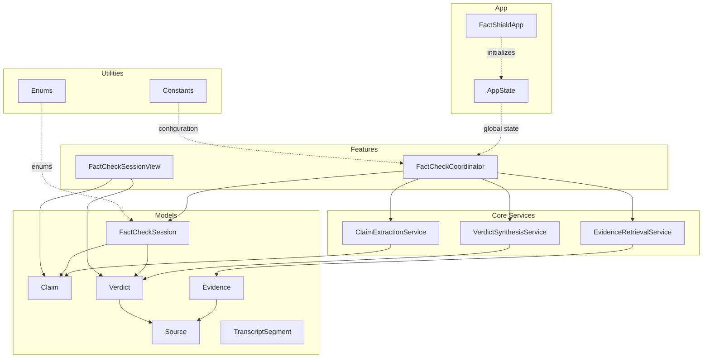
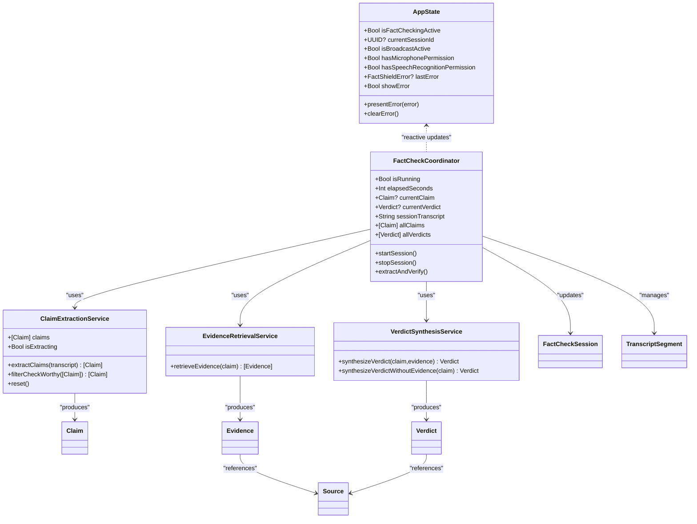
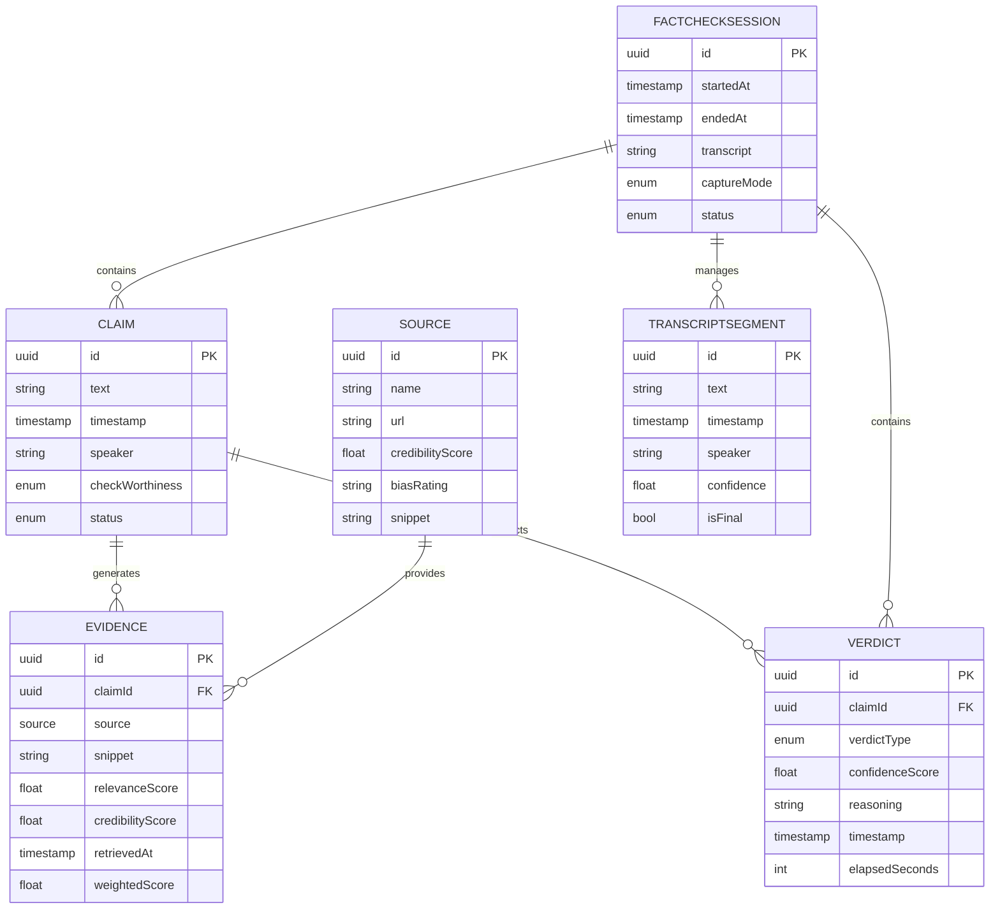
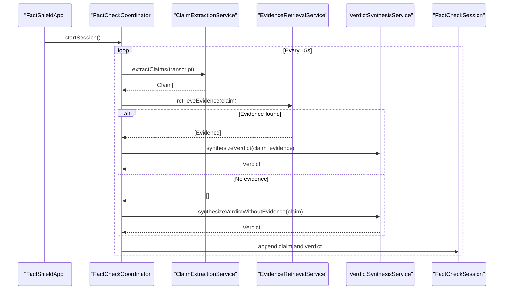
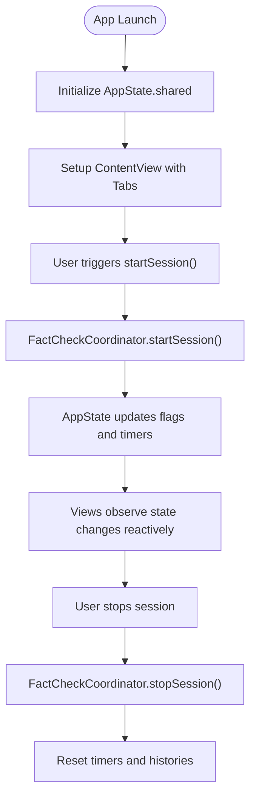
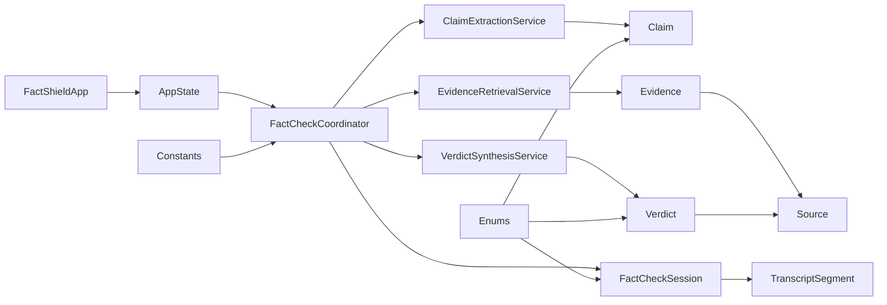

# Data Models and State Management

<cite>
**Referenced Files in This Document**
- [FactCheckSession.swift](file://FactShield/FactShield/Models/FactCheckSession.swift)
- [Source.swift](file://FactShield/FactShield/Models/Source.swift)
- [Enums.swift](file://FactShield/FactShield/Models/Enums.swift)
- [Claim.swift](file://FactShield/FactShield/Core/Claims/Claim.swift)
- [Evidence.swift](file://FactShield/FactShield/Core/Verification/Evidence.swift)
- [Verdict.swift](file://FactShield/FactShield/Core/Verification/Verdict.swift)
- [AppState.swift](file://FactShield/FactShield/App/AppState.swift)
- [FactShieldApp.swift](file://FactShield/FactShield/App/FactShieldApp.swift)
- [ClaimExtractionService.swift](file://FactShield/FactShield/Core/Claims/ClaimExtractionService.swift)
- [EvidenceRetrievalService.swift](file://FactShield/FactShield/Core/Verification/EvidenceRetrievalService.swift)
- [VerdictSynthesisService.swift](file://FactShield/FactShield/Core/Verification/VerdictSynthesisService.swift)
- [FactCheckCoordinator.swift](file://FactShield/FactShield/Features/FactCheck/FactCheckCoordinator.swift)
- [FactCheckSessionView.swift](file://FactShield/FactShield/Features/FactCheck/FactCheckSessionView.swift)
- [Constants.swift](file://FactShield/FactShield/Utilities/Constants.swift)
</cite>

## Update Summary
**Changes Made**
- Enhanced FactCheckSession model documentation with new CaptureMode and SessionStatus enums
- Added comprehensive Source model definition with credibility scoring and bias ratings
- Expanded enum structures documentation including new AppTab, AudioQuality, and FactShieldError enums
- Updated data validation rules to reflect new Source and FactCheckSession constraints
- Added TranscriptSegment model documentation for enhanced transcript management
- Updated state management architecture to reflect comprehensive enum support

## Table of Contents
1. [Introduction](#introduction)
2. [Project Structure](#project-structure)
3. [Core Components](#core-components)
4. [Architecture Overview](#architecture-overview)
5. [Detailed Component Analysis](#detailed-component-analysis)
6. [Dependency Analysis](#dependency-analysis)
7. [Performance Considerations](#performance-considerations)
8. [Troubleshooting Guide](#troubleshooting-guide)
9. [Conclusion](#conclusion)
10. [Appendices](#appendices)

## Introduction
This document provides comprehensive data model documentation for FactChecking Live, focusing on the core data structures and state management architecture. It covers:
- Data models: Claim, Evidence, Verdict, Source, FactCheckSession, and TranscriptSegment
- Business logic constraints and validation rules
- Data lifecycle through the fact-checking pipeline
- Observable state management via AppState and FactCheckCoordinator
- Reactive updates and cross-component synchronization
- Examples of data transformation, persistence patterns, and state synchronization

**Updated** Enhanced with new data models including comprehensive enum structures supporting the enhanced verification pipeline.

## Project Structure
The data models and state management are organized by domain:
- Models: Core data structures (Claim, Evidence, Verdict, Source, FactCheckSession, TranscriptSegment)
- App: Global state (AppState) and application entry (FactShieldApp)
- Core: Fact-checking pipeline services (Claim extraction, Evidence retrieval, Verdict synthesis)
- Features: Orchestration (FactCheckCoordinator) and UI integration
- Utilities: Constants and shared configuration

**Diagram sources**
- [FactCheckSession.swift:3-54](file://FactShield/FactShield/Models/FactCheckSession.swift#L3-L54)
- [Source.swift:3-11](file://FactShield/FactShield/Models/Source.swift#L3-L11)
- [Claim.swift:3-37](file://FactShield/FactShield/Core/Claims/Claim.swift#L3-L37)
- [Evidence.swift:3-16](file://FactShield/FactShield/Core/Verification/Evidence.swift#L3-L16)
- [Verdict.swift:3-31](file://FactShield/FactShield/Core/Verification/Verdict.swift#L3-L31)
- [AppState.swift:4-30](file://FactShield/FactShield/App/AppState.swift#L4-L30)
- [FactShieldApp.swift:5-127](file://FactShield/FactShield/App/FactShieldApp.swift#L5-L127)
- [ClaimExtractionService.swift:4-152](file://FactShield/FactShield/Core/Claims/ClaimExtractionService.swift#L4-L152)
- [EvidenceRetrievalService.swift:4-233](file://FactShield/FactShield/Core/Verification/EvidenceRetrievalService.swift#L4-L233)
- [VerdictSynthesisService.swift:22-184](file://FactShield/FactShield/Core/Verification/VerdictSynthesisService.swift#L22-L184)
- [FactCheckCoordinator.swift:5-216](file://FactShield/FactShield/Features/FactCheck/FactCheckCoordinator.swift#L5-L216)
- [FactCheckSessionView.swift:3-506](file://FactShield/FactShield/Features/FactCheck/FactCheckSessionView.swift#L3-L506)
- [Constants.swift:3-37](file://FactShield/FactShield/Utilities/Constants.swift#L3-L37)
- [Enums.swift:5-48](file://FactShield/FactShield/Models/Enums.swift#L5-L48)

**Section sources**
- [FactShieldApp.swift:5-127](file://FactShield/FactShield/App/FactShieldApp.swift#L5-L127)
- [Constants.swift:3-37](file://FactShield/FactShield/Utilities/Constants.swift#L3-L37)

## Core Components
This section documents the primary data models and their roles in the system.

### Enhanced Data Models

- **Claim**
  - Purpose: Represents a verifiable factual assertion extracted from audio transcripts.
  - Key attributes: Unique identifier, textual content, timestamp, speaker attribution, check-worthiness classification, and lifecycle status.
  - Validation rules:
    - Check worthiness is constrained to high, medium, or low.
    - Status transitions follow a defined lifecycle from pending to complete or failed.
  - Business logic:
    - Filter to high/medium worthiness for targeted verification.
    - Empty placeholder for initial state.

- **Evidence**
  - Purpose: Stores supporting or contradicting information for a given claim.
  - Key attributes: Claim linkage, Source, snippet, relevance score, credibility score, retrieval timestamp, and computed weighted score.
  - Validation rules:
    - Scores are clamped between 0.0 and 1.0.
    - Weighted score is a linear combination of relevance (60%) and credibility (40%).
  - Business logic:
    - Deduplication by source URL during retrieval.
    - Sorting by weighted score and limiting to a maximum number of sources.

- **Verdict**
  - Purpose: Final assessment of a claim's accuracy with confidence scoring and reasoning.
  - Key attributes: Claim linkage, verdict type (TRUE, SUBSTANTIALLY TRUE, MISLEADING, FALSE, UNVERIFIABLE), confidence score, reasoning summary, associated sources, timestamp, and elapsed processing time.
  - Validation rules:
    - Verdict type is validated against allowed enumerations.
    - Confidence score is normalized to [0.0, 1.0].
  - Business logic:
    - Color mapping for UI presentation.
    - Optional synthesis without external evidence using model knowledge.

- **Source**
  - Purpose: Provenance and metadata for evidence with comprehensive credibility assessment.
  - Key attributes: Unique identifier, name, URL, credibility score (0.0 to 1.0), optional bias rating ("left", "center", "right"), and snippet.
  - Validation rules:
    - Credibility score is constrained to [0.0, 1.0].
    - Bias rating is optional and can be null.
  - Business logic:
    - Used for evidence provenance tracking.
    - Supports credibility-based color coding in UI.

- **FactCheckSession**
  - Purpose: Tracks a single fact-checking session with comprehensive history and status management.
  - Key attributes: Unique identifier, timestamps, transcript text, lists of claims and verdicts, capture mode, and session status.
  - Nested enums:
    - **CaptureMode**: microphone | replayKit
    - **SessionStatus**: active | completed | failed | cancelled
  - Validation rules:
    - Status transitions are constrained to active, completed, failed, or cancelled.
    - Capture mode is constrained to microphone or replayKit.
  - Business logic:
    - Initializes with defaults and active status upon creation.
    - Aggregates claims and verdicts per session.

- **TranscriptSegment**
  - Purpose: Individual segment of a live transcript with detailed metadata.
  - Key attributes: Unique identifier, text content, timestamp, speaker attribution, confidence score, and finalization status.
  - Validation rules:
    - Confidence score is constrained to [0.0, 1.0].
    - Timestamps track segment timing.
  - Business logic:
    - Supports real-time transcript visualization.
    - Enables segment-based claim extraction.

**Updated** Added comprehensive Source model with credibility scoring and bias ratings, enhanced FactCheckSession with dedicated enums, and introduced TranscriptSegment for detailed transcript management.

**Section sources**
- [Claim.swift:3-37](file://FactShield/FactShield/Core/Claims/Claim.swift#L3-L37)
- [Evidence.swift:3-16](file://FactShield/FactShield/Core/Verification/Evidence.swift#L3-L16)
- [Verdict.swift:3-31](file://FactShield/FactShield/Core/Verification/Verdict.swift#L3-L31)
- [Source.swift:3-11](file://FactShield/FactShield/Models/Source.swift#L3-L11)
- [FactCheckSession.swift:3-54](file://FactShield/FactShield/Models/FactCheckSession.swift#L3-L54)

## Architecture Overview
The system follows an observable state architecture with a coordinator orchestrating the pipeline:
- FactCheckCoordinator manages the end-to-end flow, updating current claim, verdict, and session history.
- Services encapsulate domain logic: ClaimExtractionService, EvidenceRetrievalService, and VerdictSynthesisService.
- AppState holds global state for permissions, errors, and UI flags.
- FactShieldApp initializes AppState and sets up the UI.

**Diagram sources**
- [AppState.swift:4-30](file://FactShield/FactShield/App/AppState.swift#L4-L30)
- [FactCheckCoordinator.swift:5-216](file://FactShield/FactShield/Features/FactCheck/FactCheckCoordinator.swift#L5-L216)
- [ClaimExtractionService.swift:4-152](file://FactShield/FactShield/Core/Claims/ClaimExtractionService.swift#L4-L152)
- [EvidenceRetrievalService.swift:4-233](file://FactShield/FactShield/Core/Verification/EvidenceRetrievalService.swift#L4-L233)
- [VerdictSynthesisService.swift:22-184](file://FactShield/FactShield/Core/Verification/VerdictSynthesisService.swift#L22-L184)
- [Claim.swift:3-37](file://FactShield/FactShield/Core/Claims/Claim.swift#L3-L37)
- [Evidence.swift:3-16](file://FactShield/FactShield/Core/Verification/Evidence.swift#L3-L16)
- [Verdict.swift:3-31](file://FactShield/FactShield/Core/Verification/Verdict.swift#L3-L31)
- [Source.swift:3-11](file://FactShield/FactShield/Models/Source.swift#L3-L11)
- [FactCheckSession.swift:3-54](file://FactShield/FactShield/Models/FactCheckSession.swift#L3-L54)
- [FactCheckSessionView.swift:3-506](file://FactShield/FactShield/Features/FactCheck/FactCheckSessionView.swift#L3-L506)

## Detailed Component Analysis

### Data Model Relationships and Lifecycle
The data models form a directed acyclic graph centered around a Claim, with Evidence and Verdict as downstream artifacts. FactCheckSession aggregates claims and verdicts per session, while TranscriptSegment provides granular transcript management.

**Diagram sources**
- [Claim.swift:3-37](file://FactShield/FactShield/Core/Claims/Claim.swift#L3-L37)
- [Evidence.swift:3-16](file://FactShield/FactShield/Core/Verification/Evidence.swift#L3-L16)
- [Verdict.swift:3-31](file://FactShield/FactShield/Core/Verification/Verdict.swift#L3-L31)
- [Source.swift:3-11](file://FactShield/FactShield/Models/Source.swift#L3-L11)
- [FactCheckSession.swift:3-54](file://FactShield/FactShield/Models/FactCheckSession.swift#L3-L54)
- [FactCheckSessionView.swift:37-53](file://FactShield/FactShield/Models/FactCheckSession.swift#L37-L53)

### Fact-Checking Pipeline Flow
The pipeline transforms raw audio transcripts into structured claims, retrieves supporting or contradicting evidence, synthesizes a verdict, and updates session history with comprehensive state management.

**Diagram sources**
- [FactShieldApp.swift:5-127](file://FactShield/FactShield/App/FactShieldApp.swift#L5-L127)
- [FactCheckCoordinator.swift:38-161](file://FactShield/FactShield/Features/FactCheck/FactCheckCoordinator.swift#L38-L161)
- [ClaimExtractionService.swift:18-56](file://FactShield/FactShield/Core/Claims/ClaimExtractionService.swift#L18-L56)
- [EvidenceRetrievalService.swift:16-63](file://FactShield/FactShield/Core/Verification/EvidenceRetrievalService.swift#L16-L63)
- [VerdictSynthesisService.swift:30-80](file://FactShield/FactShield/Core/Verification/VerdictSynthesisService.swift#L30-L80)
- [FactCheckSession.swift:3-54](file://FactShield/FactShield/Models/FactCheckSession.swift#L3-L54)

### State Management Architecture
Global state is centralized in AppState, while FactCheckCoordinator maintains orchestration state. Both leverage SwiftUI's @Observable for reactive updates with comprehensive enum support.

**Diagram sources**
- [AppState.swift:4-30](file://FactShield/FactShield/App/AppState.swift#L4-L30)
- [FactShieldApp.swift:5-127](file://FactShield/FactShield/App/FactShieldApp.swift#L5-L127)
- [FactCheckCoordinator.swift:38-65](file://FactShield/FactShield/Features/FactCheck/FactCheckCoordinator.swift#L38-L65)

### Data Validation Rules and Constraints
- **Score normalization**:
  - Evidence.relevanceScore and credibilityScore are clamped to [0.0, 1.0].
  - Verdict.confidenceScore is normalized similarly.
  - Source.credibilityScore is constrained to [0.0, 1.0].
- **Enumerations**:
  - Claim.CheckWorthiness restricted to high, medium, low.
  - Claim.ClaimStatus restricted to pending, extracting, searching, verifying, complete, failed.
  - Verdict.VerdictType restricted to TRUE, SUBSTANTIALLY TRUE, MISLEADING, FALSE, UNVERIFIABLE.
  - FactCheckSession.CaptureMode restricted to microphone, replayKit.
  - FactCheckSession.SessionStatus restricted to active, completed, failed, cancelled.
  - AppTab restricted to home, history, settings.
  - AudioQuality restricted to low, medium, high.
  - FactShieldError encompasses comprehensive error types.
- **Deduplication and limits**:
  - EvidenceRetrievalService deduplicates by source URL and caps results by Constants.maxSourcesForVerification.

**Updated** Enhanced validation rules to include new Source model constraints and comprehensive enum structures.

**Section sources**
- [Evidence.swift:12-14](file://FactShield/FactShield/Core/Verification/Evidence.swift#L12-L14)
- [Verdict.swift:7](file://FactShield/FactShield/Core/Verification/Verdict.swift#L7)
- [Source.swift:7-8](file://FactShield/FactShield/Models/Source.swift#L7-L8)
- [Claim.swift:11-24](file://FactShield/FactShield/Core/Claims/Claim.swift#L11-L24)
- [FactCheckSession.swift:13-23](file://FactShield/FactShield/Models/FactCheckSession.swift#L13-L23)
- [Enums.swift:5-48](file://FactShield/FactShield/Models/Enums.swift#L5-L48)
- [EvidenceRetrievalService.swift:46-62](file://FactShield/FactShield/Core/Verification/EvidenceRetrievalService.swift#L46-L62)
- [Constants.swift:24-26](file://FactShield/FactShield/Utilities/Constants.swift#L24-L26)

### Data Transformation Examples
- **Evidence weighting**:
  - Weighted score calculation combines relevance (60%) and credibility (40%) with fixed weights.
- **Verdict synthesis**:
  - Chain-of-thought prompting produces structured JSON; parsing validates verdict type and normalizes confidence.
- **Claim extraction**:
  - Prompt enforces extraction rules; JSON cleaning removes code fences; fallback parsing accommodates arrays.
- **Source credibility mapping**:
  - Credibility scores mapped to color-coded UI indicators (green ≥ 0.8, yellow ≥ 0.5, red < 0.5).

**Updated** Added Source credibility mapping and enhanced evidence weighting calculations.

**Section sources**
- [Evidence.swift:12-14](file://FactShield/FactShield/Core/Verification/Evidence.swift#L12-L14)
- [VerdictSynthesisService.swift:125-165](file://FactShield/FactShield/Core/Verification/VerdictSynthesisService.swift#L125-L165)
- [ClaimExtractionService.swift:70-152](file://FactShield/FactShield/Core/Claims/ClaimExtractionService.swift#L70-L152)
- [Source.swift:7](file://FactShield/FactShield/Models/Source.swift#L7)

### Persistence Patterns and State Synchronization
- **In-memory aggregation**:
  - FactCheckCoordinator maintains in-memory histories for claims and verdicts during a session.
  - FactCheckSession stores session-level data for historical tracking.
- **UI synchronization**:
  - Views bind to FactCheckCoordinator's currentClaim/currentVerdict and FactShieldApp's AppState for reactive updates.
  - Comprehensive enum states drive UI state management.
- **Cross-component coordination**:
  - Services publish state changes via @Observable; AppState centralizes error and permission flags for global visibility.
  - TranscriptSegment management enables real-time transcript visualization.

**Updated** Enhanced persistence patterns to include FactCheckSession aggregation and TranscriptSegment management.

**Section sources**
- [FactCheckCoordinator.swift:27-28](file://FactShield/FactShield/Features/FactCheck/FactCheckCoordinator.swift#L27-L28)
- [FactShieldApp.swift:28-127](file://FactShield/FactShield/App/FactShieldApp.swift#L28-L127)
- [AppState.swift:8-28](file://FactShield/FactShield/App/AppState.swift#L8-L28)
- [FactCheckSession.swift:8-9](file://FactShield/FactShield/Models/FactCheckSession.swift#L8-L9)
- [FactCheckSessionView.swift:37-53](file://FactShield/FactShield/Models/FactCheckSession.swift#L37-L53)

## Dependency Analysis
The following diagram highlights module-level dependencies among core components with enhanced enum support.

**Diagram sources**
- [FactShieldApp.swift:5-127](file://FactShield/FactShield/App/FactShieldApp.swift#L5-L127)
- [AppState.swift:4-30](file://FactShield/FactShield/App/AppState.swift#L4-L30)
- [FactCheckCoordinator.swift:5-216](file://FactShield/FactShield/Features/FactCheck/FactCheckCoordinator.swift#L5-L216)
- [ClaimExtractionService.swift:4-152](file://FactShield/FactShield/Core/Claims/ClaimExtractionService.swift#L4-L152)
- [EvidenceRetrievalService.swift:4-233](file://FactShield/FactShield/Core/Verification/EvidenceRetrievalService.swift#L4-L233)
- [VerdictSynthesisService.swift:22-184](file://FactShield/FactShield/Core/Verification/VerdictSynthesisService.swift#L22-L184)
- [Claim.swift:3-37](file://FactShield/FactShield/Core/Claims/Claim.swift#L3-L37)
- [Evidence.swift:3-16](file://FactShield/FactShield/Core/Verification/Evidence.swift#L3-L16)
- [Verdict.swift:3-31](file://FactShield/FactShield/Core/Verification/Verdict.swift#L3-L31)
- [Source.swift:3-11](file://FactShield/FactShield/Models/Source.swift#L3-L11)
- [FactCheckSession.swift:3-54](file://FactShield/FactShield/Models/FactCheckSession.swift#L3-L54)
- [FactCheckSessionView.swift:37-53](file://FactShield/FactShield/Models/FactCheckSession.swift#L37-L53)
- [Constants.swift:3-37](file://FactShield/FactShield/Utilities/Constants.swift#L3-L37)
- [Enums.swift:5-48](file://FactShield/FactShield/Models/Enums.swift#L5-L48)

**Section sources**
- [FactCheckCoordinator.swift:5-216](file://FactShield/FactShield/Features/FactCheck/FactCheckCoordinator.swift#L5-L216)
- [Constants.swift:24-26](file://FactShield/FactShield/Utilities/Constants.swift#L24-L26)

## Performance Considerations
- **Asynchronous retrieval**:
  - Evidence retrieval uses concurrent tasks to parallelize multiple providers, reducing latency.
- **Batching and throttling**:
  - Periodic claim extraction runs every 15 seconds to balance responsiveness and resource usage.
- **Deduplication and capping**:
  - Duplicate URLs are removed, and results are capped to a fixed maximum to control memory and UI load.
- **Normalization**:
  - Scores are clamped early to avoid expensive corrections later in the pipeline.
- **Real-time transcript processing**:
  - TranscriptSegment management enables efficient real-time transcript visualization and claim extraction.

**Updated** Added real-time transcript processing considerations with TranscriptSegment management.

## Troubleshooting Guide
Common issues and diagnostics:
- **Claim extraction failures**:
  - Symptoms: Empty claim list or parsing errors.
  - Causes: Malformed JSON, missing API keys, or transcription gaps.
  - Actions: Inspect logs, validate JSON cleaning, and confirm API availability.
- **Evidence retrieval failures**:
  - Symptoms: No evidence returned despite valid claims.
  - Causes: Provider API errors or empty results.
  - Actions: Review warnings in logs and fall back to model-knowledge synthesis.
- **Verdict synthesis failures**:
  - Symptoms: Invalid verdict type or JSON parsing errors.
  - Causes: Unexpected API response format.
  - Actions: Validate response cleaning and decoding logic.
- **Global state errors**:
  - Symptoms: Persistent error banners or incorrect UI state.
  - Actions: Use AppState.presentError and AppState.clearError to surface and dismiss errors.
- **Source credibility issues**:
  - Symptoms: Incorrect color coding or bias rating display.
  - Causes: Invalid credibility scores or bias ratings.
  - Actions: Validate Source model constraints and enum values.

**Updated** Added troubleshooting guidance for new Source model and enhanced enum structures.

**Section sources**
- [ClaimExtractionService.swift:80-152](file://FactShield/FactShield/Core/Claims/ClaimExtractionService.swift#L80-L152)
- [EvidenceRetrievalService.swift:24-44](file://FactShield/FactShield/Core/Verification/EvidenceRetrievalService.swift#L24-L44)
- [VerdictSynthesisService.swift:144-150](file://FactShield/FactShield/Core/Verification/VerdictSynthesisService.swift#L144-L150)
- [AppState.swift:20-28](file://FactShield/FactShield/App/AppState.swift#L20-L28)

## Conclusion
FactChecking Live employs a clean separation of concerns with observable state and a well-defined data model. Claims, Evidence, and Verdict form a cohesive pipeline, while FactCheckSession aggregates session-level history with comprehensive enum support. The enhanced Source model provides detailed provenance tracking with credibility scoring. Services encapsulate domain logic, and AppState/FactCheckCoordinator coordinate state and UI updates. Validation rules and constraints ensure robustness, and asynchronous patterns optimize throughput. The addition of TranscriptSegment enables sophisticated real-time transcript management.

## Appendices

### Appendix A: Enumerations and Constraints Reference
- **Claim.CheckWorthiness**: high | medium | low
- **Claim.ClaimStatus**: pending | extracting | searching | verifying | complete | failed
- **Verdict.VerdictType**: TRUE | SUBSTANTIALLY TRUE | MISLEADING | FALSE | UNVERIFIABLE
- **FactCheckSession.CaptureMode**: microphone | replayKit
- **FactCheckSession.SessionStatus**: active | completed | failed | cancelled
- **AppTab**: home | history | settings
- **AudioQuality**: low | medium | high
- **FactShieldError**: audioSessionFailed | speechRecognitionUnavailable | speechRecognitionDenied | networkError | apiKeyMissing | claimExtractionFailed | verdictSynthesisFailed | liveActivityFailed

**Updated** Added comprehensive enum structures including new AppTab, AudioQuality, and FactShieldError enumerations.

**Section sources**
- [Claim.swift:11-24](file://FactShield/FactShield/Core/Claims/Claim.swift#L11-L24)
- [Verdict.swift:13-29](file://FactShield/FactShield/Core/Verification/Verdict.swift#L13-L29)
- [FactCheckSession.swift:13-23](file://FactShield/FactShield/Models/FactCheckSession.swift#L13-L23)
- [Enums.swift:5-48](file://FactShield/FactShield/Models/Enums.swift#L5-L48)

### Appendix B: Data Model Validation Rules
- **Score constraints**:
  - Evidence.relevanceScore: [0.0, 1.0]
  - Evidence.credibilityScore: [0.0, 1.0]
  - Verdict.confidenceScore: [0.0, 1.0]
  - Source.credibilityScore: [0.0, 1.0]
- **Weighted scoring**:
  - Evidence.weightedScore: relevanceScore × 0.6 + credibilityScore × 0.4
- **Bias ratings**: left | center | right
- **Session constraints**:
  - FactCheckSession.captureMode: microphone | replayKit
  - FactCheckSession.status: active | completed | failed | cancelled

**Updated** Added Source credibility constraints and enhanced weighted scoring calculations.

**Section sources**
- [Evidence.swift:12-14](file://FactShield/FactShield/Core/Verification/Evidence.swift#L12-L14)
- [Verdict.swift:7](file://FactShield/FactShield/Core/Verification/Verdict.swift#L7)
- [Source.swift:7-8](file://FactShield/FactShield/Models/Source.swift#L7-L8)
- [FactCheckSession.swift:13-23](file://FactShield/FactShield/Models/FactCheckSession.swift#L13-L23)