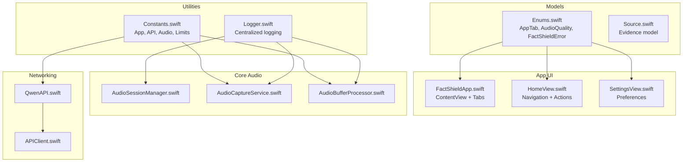
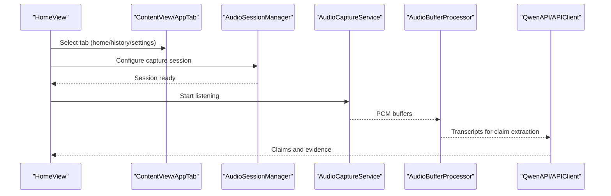
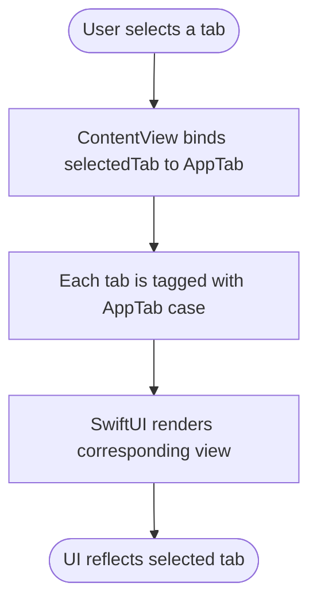
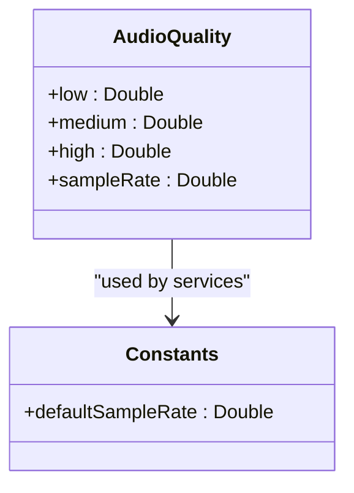
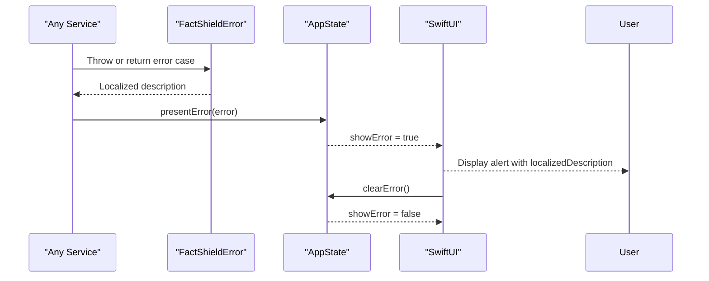
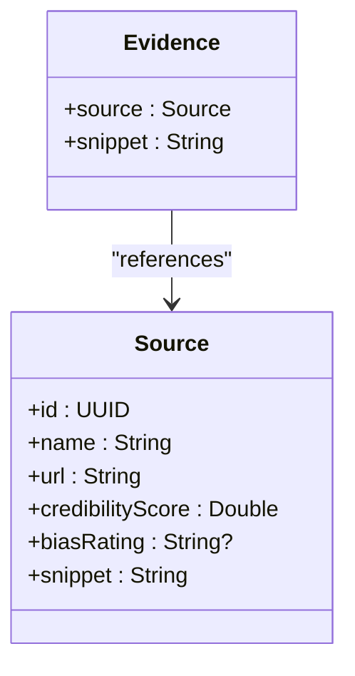
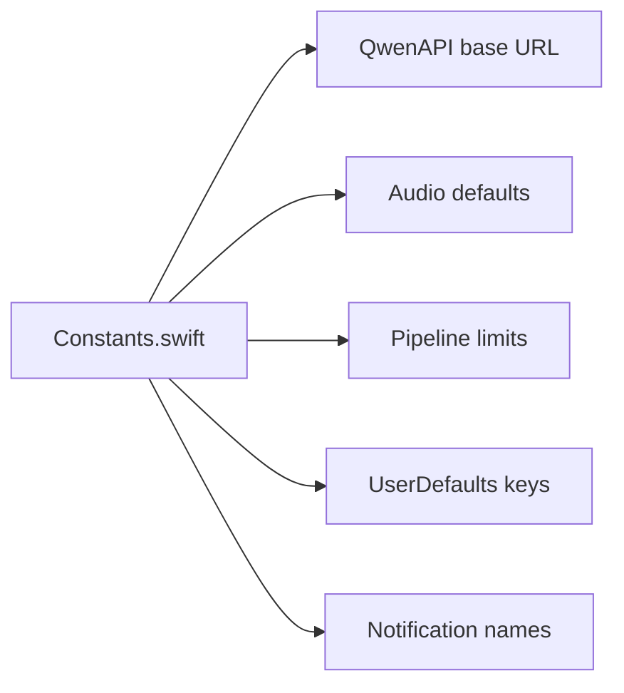
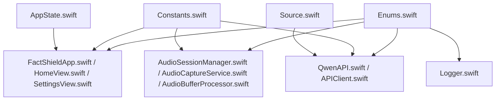

# Enumerations and Constants

<cite>
**Referenced Files in This Document**
- [Enums.swift](file://FactShield/FactShield/Models/Enums.swift)
- [Constants.swift](file://FactShield/FactShield/Utilities/Constants.swift)
- [FactShieldApp.swift](file://FactShield/FactShield/App/FactShieldApp.swift)
- [AppState.swift](file://FactShield/FactShield/App/AppState.swift)
- [SettingsView.swift](file://FactShield/FactShield/Features/Settings/SettingsView.swift)
- [HomeView.swift](file://FactShield/FactShield/Features/Home/HomeView.swift)
- [AudioSessionManager.swift](file://FactShield/FactShield/Core/Audio/AudioSessionManager.swift)
- [AudioCaptureService.swift](file://FactShield/FactShield/Core/Audio/AudioCaptureService.swift)
- [AudioBufferProcessor.swift](file://FactShield/FactShield/Core/Audio/AudioBufferProcessor.swift)
- [QwenAPI.swift](file://FactShield-iOS-BuildInstructions.md)
- [APIClient.swift](file://FactShield/FactShield/Core/Network/APIClient.swift)
- [Logger.swift](file://FactShield/FactShield/Utilities/Logger.swift)
- [ClaimExtractionService.swift](file://FactShield/FactShield/Core/Claims/ClaimExtractionService.swift)
- [VerdictSynthesisService.swift](file://FactShield-iOS-BuildInstructions.md)
- [Source.swift](file://FactShield/FactShield/Models/Source.swift)
</cite>

## Table of Contents
1. [Introduction](#introduction)
2. [Project Structure](#project-structure)
3. [Core Components](#core-components)
4. [Architecture Overview](#architecture-overview)
5. [Detailed Component Analysis](#detailed-component-analysis)
6. [Dependency Analysis](#dependency-analysis)
7. [Performance Considerations](#performance-considerations)
8. [Troubleshooting Guide](#troubleshooting-guide)
9. [Conclusion](#conclusion)

## Introduction
This document provides comprehensive documentation for FactChecking Live’s enumeration systems and constants. It covers:
- AppTab for navigation tabs and their UI behaviors
- AudioQuality for audio sampling and quality implications
- FactShieldError for error types, localized descriptions, and handling strategies
- Source for evidence categorization and provenance
- Application-wide constants for endpoints, configuration, and system limits
- Usage patterns, error propagation, and best practices across the architecture

## Project Structure
The enumerations and constants are defined in focused locations:
- App-wide enums and errors: Models/Enums.swift
- Application constants: Utilities/Constants.swift
- UI integration: App/FactShieldApp.swift, Features/Home/HomeView.swift, Features/Settings/SettingsView.swift
- Audio subsystem: Core/Audio/*
- Networking and logging: Core/Network/*, Utilities/Logger.swift
- Evidence model: Models/Source.swift

**Diagram sources**
- [Enums.swift:5-47](file://FactShield/FactShield/Models/Enums.swift#L5-L47)
- [Constants.swift:3-36](file://FactShield/FactShield/Utilities/Constants.swift#L3-L36)
- [FactShieldApp.swift:28-54](file://FactShield/FactShield/App/FactShieldApp.swift#L28-L54)
- [HomeView.swift:3-58](file://FactShield/FactShield/Features/Home/HomeView.swift#L3-L58)
- [SettingsView.swift:3-110](file://FactShield/FactShield/Features/Settings/SettingsView.swift#L3-L110)
- [AudioSessionManager.swift:4-22](file://FactShield/FactShield/Core/Audio/AudioSessionManager.swift#L4-L22)
- [AudioCaptureService.swift:5-50](file://FactShield/FactShield/Core/Audio/AudioCaptureService.swift#L5-L50)
- [AudioBufferProcessor.swift:5-41](file://FactShield/FactShield/Core/Audio/AudioBufferProcessor.swift#L5-L41)
- [QwenAPI.swift:571-632](file://FactShield-iOS-BuildInstructions.md#L571-L632)
- [APIClient.swift:32-74](file://FactShield/FactShield/Core/Network/APIClient.swift#L32-L74)
- [Logger.swift:4-17](file://FactShield/FactShield/Utilities/Logger.swift#L4-L17)

**Section sources**
- [Enums.swift:1-48](file://FactShield/FactShield/Models/Enums.swift#L1-L48)
- [Constants.swift:1-37](file://FactShield/FactShield/Utilities/Constants.swift#L1-L37)
- [FactShieldApp.swift:1-56](file://FactShield/FactShield/App/FactShieldApp.swift#L1-L56)
- [HomeView.swift:1-233](file://FactShield/FactShield/Features/Home/HomeView.swift#L1-L233)
- [SettingsView.swift:1-172](file://FactShield/FactShield/Features/Settings/SettingsView.swift#L1-L172)

## Core Components

### AppTab Enumeration
AppTab defines the primary navigation tabs used in the application’s tabbed interface. It is used to bind the TabView selection and tag each tab item.

- Cases: home, history, settings
- Integration: Selected via a binding in ContentView and tagged to each tab item
- UI behavior: Switching tabs navigates between HomeView, a placeholder for HistoryView, and SettingsView

Usage example paths:
- [ContentView selection binding](file://FactShield/FactShield/App/FactShieldApp.swift#L29)
- [Tagging AppTab cases to views:32-51](file://FactShield/FactShield/App/FactShieldApp.swift#L32-L51)

Best practices:
- Keep cases minimal and aligned with feature boundaries
- Use CaseIterable for dynamic UI generation when needed
- Ensure each tag corresponds to a visible view in the TabView

**Section sources**
- [Enums.swift:5-9](file://FactShield/FactShield/Models/Enums.swift#L5-L9)
- [FactShieldApp.swift:28-54](file://FactShield/FactShield/App/FactShieldApp.swift#L28-L54)

### AudioQuality Enumeration
AudioQuality encapsulates quality presets with associated sample rates. It is used to configure audio capture and processing characteristics.

- Cases: low, medium, high
- Associated mapping: low (16000 Hz), medium (44100 Hz), high (48000 Hz)
- Implications:
  - Lower sample rates reduce CPU and bandwidth usage
  - Higher sample rates improve fidelity but increase resource consumption
- Usage: Access the sampleRate property to set capture or processing formats

Usage example paths:
- [AudioQuality definition and sampleRate mapping:11-23](file://FactShield/FactShield/Models/Enums.swift#L11-L23)
- [Default sample rate constant](file://FactShield/FactShield/Utilities/Constants.swift#L15)

Best practices:
- Choose quality based on target environment (e.g., constrained devices vs. broadcast mode)
- Align UI controls (e.g., SettingsView) with these cases for user preference persistence

**Section sources**
- [Enums.swift:11-23](file://FactShield/FactShield/Models/Enums.swift#L11-L23)
- [Constants.swift](file://FactShield/FactShield/Utilities/Constants.swift#L15)

### FactShieldError Enumeration
FactShieldError defines all domain-specific error types surfaced to users. It conforms to LocalizedError for automatic user-presentable descriptions.

Cases and localized meanings:
- audioSessionFailed: Audio session configuration or activation failure
- speechRecognitionUnavailable: Device lacks speech recognition capability
- speechRecognitionDenied: Permission denied for speech recognition
- networkError: General network failure with a message
- apiKeyMissing: Required API key not configured
- claimExtractionFailed: Failure extracting claims from transcripts
- verdictSynthesisFailed: Failure synthesizing a verdict from evidence
- liveActivityFailed: Live Activity (Dynamic Island) initialization or update failure

Usage example paths:
- [FactShieldError definition and localized descriptions:25-47](file://FactShield/FactShield/Models/Enums.swift#L25-L47)
- [AppState error presentation and clearing:16-29](file://FactShield/FactShield/App/AppState.swift#L16-L29)
- [Propagation in claim extraction](file://FactShield/FactShield/Core/Claims/ClaimExtractionService.swift#L130)
- [Propagation in verdict synthesis:846-848](file://FactShield-iOS-BuildInstructions.md#L846-L848)

Error handling strategies:
- Surface localized descriptions via SwiftUI alerts or toasts
- Persist lastError in AppState for centralized UI handling
- Distinguish between transient (retry) and permanent (configuration) failures

**Section sources**
- [Enums.swift:25-47](file://FactShield/FactShield/Models/Enums.swift#L25-L47)
- [AppState.swift:16-29](file://FactShield/FactShield/App/AppState.swift#L16-L29)
- [ClaimExtractionService.swift](file://FactShield/FactShield/Core/Claims/ClaimExtractionService.swift#L130)
- [VerdictSynthesisService.swift:846-848](file://FactShield-iOS-BuildInstructions.md#L846-L848)

### Source Model
Source represents a single evidence item with metadata for provenance and trust assessment.

Fields:
- id: Unique identifier
- name: Source name
- url: Canonical URL
- credibilityScore: Numerical score from 0.0 to 1.0
- biasRating: Optional directional bias ("left", "center", "right")
- snippet: Short excerpt used for verification

Usage example paths:
- [Source definition:3-10](file://FactShield/FactShield/Models/Source.swift#L3-L10)

Integration:
- Used within Evidence and VerdictSynthesisService to contextualize findings
- Supports multi-source verification and bias-aware reasoning

**Section sources**
- [Source.swift:3-10](file://FactShield/FactShield/Models/Source.swift#L3-L10)

### Application-Wide Constants
Constants centralize environment-specific and system-level values.

Categories and examples:
- App Group: group identifiers for shared containers
- Bundle IDs: main and broadcast bundle identifiers
- API Base URL: Qwen API base endpoint
- Audio Defaults: default sample rate, buffer size, max recording duration
- Speech Limits: max transcript words and recent window size
- Pipeline: claim extraction interval and source limits for verification
- UserDefaults Keys: keys for broadcasting state and session tracking
- Notification Names: app-group notifications for inter-process signaling

Usage example paths:
- [Constants enum:3-36](file://FactShield/FactShield/Utilities/Constants.swift#L3-L36)
- [Qwen API base URL](file://FactShield-iOS-BuildInstructions.md#L574)
- [Broadcast extension app group](file://FactShield-iOS-BuildInstructions.md#L1953)

Best practices:
- Keep all external endpoints and limits in Constants for easy maintenance
- Use descriptive keys and names for UserDefaults and Notifications
- Reference Constants instead of hardcoding values across modules

**Section sources**
- [Constants.swift:3-36](file://FactShield/FactShield/Utilities/Constants.swift#L3-L36)
- [QwenAPI.swift](file://FactShield-iOS-BuildInstructions.md#L574)
- [SampleHandler.swift](file://FactShield-iOS-BuildInstructions.md#L1953)

## Architecture Overview
The enumerations and constants underpin UI navigation, audio configuration, error handling, and networking. They connect to core services for audio capture, speech recognition, and API interactions.

**Diagram sources**
- [FactShieldApp.swift:28-54](file://FactShield/FactShield/App/FactShieldApp.swift#L28-L54)
- [HomeView.swift:16-25](file://FactShield/FactShield/Features/Home/HomeView.swift#L16-L25)
- [AudioSessionManager.swift:8-17](file://FactShield/FactShield/Core/Audio/AudioSessionManager.swift#L8-L17)
- [AudioCaptureService.swift:19-40](file://FactShield/FactShield/Core/Audio/AudioCaptureService.swift#L19-L40)
- [AudioBufferProcessor.swift:16-22](file://FactShield/FactShield/Core/Audio/AudioBufferProcessor.swift#L16-L22)
- [QwenAPI.swift:583-632](file://FactShield-iOS-BuildInstructions.md#L583-L632)

## Detailed Component Analysis

### AppTab: Navigation and UI Behaviors
AppTab drives the tabbed interface. The selected tab is bound to a state variable and used to tag each tab item. This ensures consistent navigation semantics across the app.

**Diagram sources**
- [FactShieldApp.swift:28-54](file://FactShield/FactShield/App/FactShieldApp.swift#L28-L54)

**Section sources**
- [Enums.swift:5-9](file://FactShield/FactShield/Models/Enums.swift#L5-L9)
- [FactShieldApp.swift:28-54](file://FactShield/FactShield/App/FactShieldApp.swift#L28-L54)

### AudioQuality: Sampling and Quality Implications
AudioQuality provides a concise mapping of quality presets to sample rates. This informs audio capture and processing services.

**Diagram sources**
- [Enums.swift:11-23](file://FactShield/FactShield/Models/Enums.swift#L11-L23)
- [Constants.swift](file://FactShield/FactShield/Utilities/Constants.swift#L15)

**Section sources**
- [Enums.swift:11-23](file://FactShield/FactShield/Models/Enums.swift#L11-L23)
- [Constants.swift](file://FactShield/FactShield/Utilities/Constants.swift#L15)

### FactShieldError: Error Types, Descriptions, and Handling
FactShieldError centralizes error semantics and user-facing messages. AppState coordinates error presentation and clearing.

**Diagram sources**
- [Enums.swift:25-47](file://FactShield/FactShield/Models/Enums.swift#L25-L47)
- [AppState.swift:20-28](file://FactShield/FactShield/App/AppState.swift#L20-L28)

**Section sources**
- [Enums.swift:25-47](file://FactShield/FactShield/Models/Enums.swift#L25-L47)
- [AppState.swift:16-29](file://FactShield/FactShield/App/AppState.swift#L16-L29)

### Source: Evidence Categorization and Provenance
Source encapsulates evidence metadata used throughout the verification pipeline.

**Diagram sources**
- [Source.swift:3-10](file://FactShield/FactShield/Models/Source.swift#L3-L10)

**Section sources**
- [Source.swift:3-10](file://FactShield/FactShield/Models/Source.swift#L3-L10)

### Constants: Endpoints, Configuration, and Limits
Constants define shared configuration across modules.

**Diagram sources**
- [Constants.swift:3-36](file://FactShield/FactShield/Utilities/Constants.swift#L3-L36)
- [QwenAPI.swift](file://FactShield-iOS-BuildInstructions.md#L574)

**Section sources**
- [Constants.swift:3-36](file://FactShield/FactShield/Utilities/Constants.swift#L3-L36)
- [QwenAPI.swift](file://FactShield-iOS-BuildInstructions.md#L574)

## Dependency Analysis
Enumerations and constants influence multiple subsystems. The following diagram shows key dependencies:

**Diagram sources**
- [Enums.swift:5-47](file://FactShield/FactShield/Models/Enums.swift#L5-L47)
- [Constants.swift:3-36](file://FactShield/FactShield/Utilities/Constants.swift#L3-L36)
- [FactShieldApp.swift:28-54](file://FactShield/FactShield/App/FactShieldApp.swift#L28-L54)
- [HomeView.swift:3-58](file://FactShield/FactShield/Features/Home/HomeView.swift#L3-L58)
- [SettingsView.swift:3-110](file://FactShield/FactShield/Features/Settings/SettingsView.swift#L3-L110)
- [AudioSessionManager.swift:4-22](file://FactShield/FactShield/Core/Audio/AudioSessionManager.swift#L4-L22)
- [AudioCaptureService.swift:5-50](file://FactShield/FactShield/Core/Audio/AudioCaptureService.swift#L5-L50)
- [AudioBufferProcessor.swift:5-41](file://FactShield/FactShield/Core/Audio/AudioBufferProcessor.swift#L5-L41)
- [QwenAPI.swift:571-632](file://FactShield-iOS-BuildInstructions.md#L571-L632)
- [APIClient.swift:32-74](file://FactShield/FactShield/Core/Network/APIClient.swift#L32-L74)
- [Logger.swift:4-17](file://FactShield/FactShield/Utilities/Logger.swift#L4-L17)
- [AppState.swift:16-29](file://FactShield/FactShield/App/AppState.swift#L16-L29)
- [Source.swift:3-10](file://FactShield/FactShield/Models/Source.swift#L3-L10)

**Section sources**
- [Enums.swift:1-48](file://FactShield/FactShield/Models/Enums.swift#L1-L48)
- [Constants.swift:1-37](file://FactShield/FactShield/Utilities/Constants.swift#L1-L37)
- [FactShieldApp.swift:1-56](file://FactShield/FactShield/App/FactShieldApp.swift#L1-L56)
- [HomeView.swift:1-233](file://FactShield/FactShield/Features/Home/HomeView.swift#L1-L233)
- [SettingsView.swift:1-172](file://FactShield/FactShield/Features/Settings/SettingsView.swift#L1-L172)
- [AudioSessionManager.swift:1-22](file://FactShield/FactShield/Core/Audio/AudioSessionManager.swift#L1-L22)
- [AudioCaptureService.swift:1-50](file://FactShield/FactShield/Core/Audio/AudioCaptureService.swift#L1-L50)
- [AudioBufferProcessor.swift:1-41](file://FactShield/FactShield/Core/Audio/AudioBufferProcessor.swift#L1-L41)
- [QwenAPI.swift:565-649](file://FactShield-iOS-BuildInstructions.md#L565-L649)
- [APIClient.swift:32-74](file://FactShield/FactShield/Core/Network/APIClient.swift#L32-L74)
- [Logger.swift:1-17](file://FactShield/FactShield/Utilities/Logger.swift#L1-L17)
- [AppState.swift:1-29](file://FactShield/FactShield/App/AppState.swift#L1-L29)
- [Source.swift:1-11](file://FactShield/FactShield/Models/Source.swift#L1-L11)

## Performance Considerations
- AudioQuality impacts CPU and memory usage; prefer lower sample rates for constrained environments
- Use Constants.maxRecordingDuration and similar limits to cap resource usage
- Batch and throttle API requests; APIClient retries and backoff reduce load spikes
- Cache frequently accessed data and reuse audio buffers to minimize allocations

## Troubleshooting Guide
Common scenarios and strategies:
- Audio session failures: Verify AudioSessionManager configuration and permissions; surface localized messages via AppState
- Speech recognition denied/unavailable: Prompt users to enable permissions; provide fallback mechanisms
- Network errors: Inspect APIClient logs and retry policies; surface user-friendly messages
- API key missing: Validate UserDefaults keys and environment configuration; guide users to SettingsView
- Verdict synthesis failures: Check QwenAPI responses and JSON parsing; log with Logger for diagnostics

**Section sources**
- [AppState.swift:16-29](file://FactShield/FactShield/App/AppState.swift#L16-L29)
- [APIClient.swift:32-74](file://FactShield/FactShield/Core/Network/APIClient.swift#L32-L74)
- [QwenAPI.swift:583-632](file://FactShield-iOS-BuildInstructions.md#L583-L632)
- [Logger.swift:4-17](file://FactShield/FactShield/Utilities/Logger.swift#L4-L17)

## Conclusion
FactChecking Live’s enumerations and constants form a cohesive foundation for navigation, audio configuration, error handling, and system limits. By centralizing these definitions and consistently referencing them across UI, audio, and networking layers, the app maintains clarity, reliability, and maintainability. Adopt the documented usage patterns and best practices to ensure robust behavior and predictable user experiences.