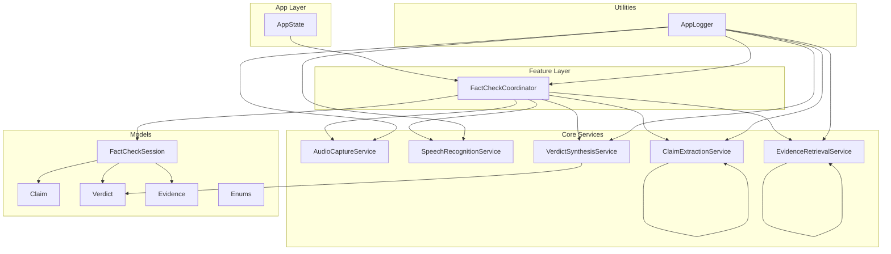
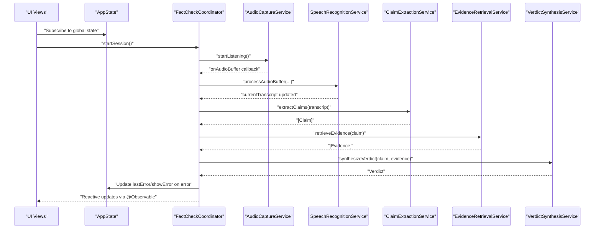
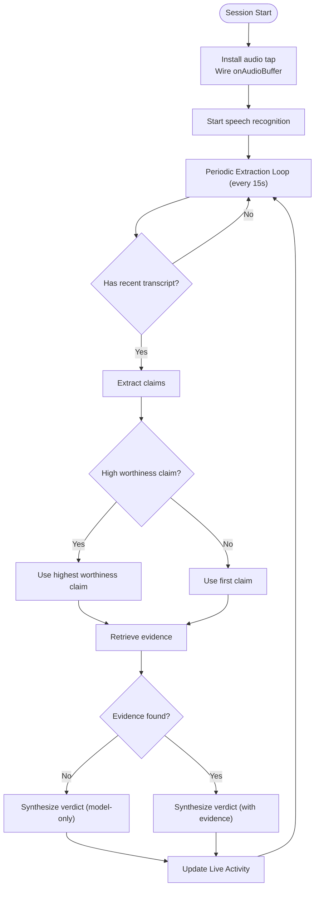
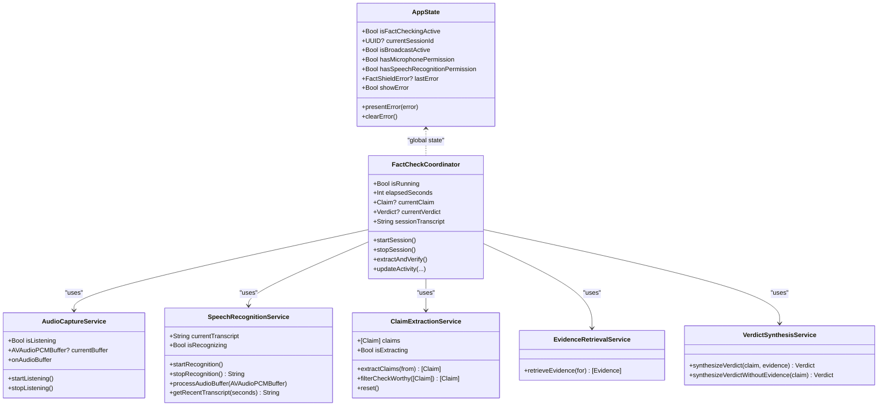

# State Management Architecture

<cite>
**Referenced Files in This Document**
- [AppState.swift](file://FactShield/FactShield/App/AppState.swift)
- [FactCheckCoordinator.swift](file://FactShield/FactShield/Features/FactCheck/FactCheckCoordinator.swift)
- [AudioCaptureService.swift](file://FactShield/FactShield/Core/Audio/AudioCaptureService.swift)
- [SpeechRecognitionService.swift](file://FactShield/FactShield/Core/Speech/SpeechRecognitionService.swift)
- [ClaimExtractionService.swift](file://FactShield/FactShield/Core/Claims/ClaimExtractionService.swift)
- [EvidenceRetrievalService.swift](file://FactShield/FactShield/Core/Verification/EvidenceRetrievalService.swift)
- [VerdictSynthesisService.swift](file://FactShield/FactShield/Core/Verification/VerdictSynthesisService.swift)
- [FactCheckSession.swift](file://FactShield/FactShield/Models/FactCheckSession.swift)
- [Enums.swift](file://FactShield/FactShield/Models/Enums.swift)
- [Logger.swift](file://FactShield/FactShield/Utilities/Logger.swift)
</cite>

## Table of Contents
1. [Introduction](#introduction)
2. [Project Structure](#project-structure)
3. [Core Components](#core-components)
4. [Architecture Overview](#architecture-overview)
5. [Detailed Component Analysis](#detailed-component-analysis)
6. [Dependency Analysis](#dependency-analysis)
7. [Performance Considerations](#performance-considerations)
8. [Troubleshooting Guide](#troubleshooting-guide)
9. [Conclusion](#conclusion)
10. [Appendices](#appendices)

## Introduction
This document explains the reactive state management architecture of FactChecking Live. It focuses on the observable state pattern implemented with Swift’s @Observable macro, the global AppState coordinator, and the FactCheckCoordinator’s orchestration of session state across audio capture, speech recognition, claim extraction, evidence retrieval, and verdict synthesis. It also covers state persistence, synchronization across components, error handling, and practical patterns for debugging and optimizing reactive state interactions.

## Project Structure
The state management spans several layers:
- Application-wide state: AppState
- Feature-level orchestration: FactCheckCoordinator
- Domain services: AudioCaptureService, SpeechRecognitionService, ClaimExtractionService, EvidenceRetrievalService, VerdictSynthesisService
- Models and enums: Claim, Verdict, Evidence, FactCheckSession, FactShieldError, and related enumerations
- Logging: AppLogger for centralized diagnostics

**Diagram sources**
- [AppState.swift:1-30](file://FactShield/FactShield/App/AppState.swift#L1-L30)
- [FactCheckCoordinator.swift:1-216](file://FactShield/FactShield/Features/FactCheck/FactCheckCoordinator.swift#L1-L216)
- [AudioCaptureService.swift:1-51](file://FactShield/FactShield/Core/Audio/AudioCaptureService.swift#L1-L51)
- [SpeechRecognitionService.swift:1-138](file://FactShield/FactShield/Core/Speech/SpeechRecognitionService.swift#L1-L138)
- [ClaimExtractionService.swift:1-152](file://FactShield/FactShield/Core/Claims/ClaimExtractionService.swift#L1-L152)
- [EvidenceRetrievalService.swift:1-233](file://FactShield/FactShield/Core/Verification/EvidenceRetrievalService.swift#L1-L233)
- [VerdictSynthesisService.swift:1-184](file://FactShield/FactShield/Core/Verification/VerdictSynthesisService.swift#L1-L184)
- [FactCheckSession.swift:1-54](file://FactShield/FactShield/Models/FactCheckSession.swift#L1-L54)
- [Enums.swift:1-48](file://FactShield/FactShield/Models/Enums.swift#L1-L48)
- [Logger.swift:1-18](file://FactShield/FactShield/Utilities/Logger.swift#L1-L18)

**Section sources**
- [AppState.swift:1-30](file://FactShield/FactShield/App/AppState.swift#L1-L30)
- [FactCheckCoordinator.swift:1-216](file://FactShield/FactShield/Features/FactCheck/FactCheckCoordinator.swift#L1-L216)
- [AudioCaptureService.swift:1-51](file://FactShield/FactShield/Core/Audio/AudioCaptureService.swift#L1-L51)
- [SpeechRecognitionService.swift:1-138](file://FactShield/FactShield/Core/Speech/SpeechRecognitionService.swift#L1-L138)
- [ClaimExtractionService.swift:1-152](file://FactShield/FactShield/Core/Claims/ClaimExtractionService.swift#L1-L152)
- [EvidenceRetrievalService.swift:1-233](file://FactShield/FactShield/Core/Verification/EvidenceRetrievalService.swift#L1-L233)
- [VerdictSynthesisService.swift:1-184](file://FactShield/FactShield/Core/Verification/VerdictSynthesisService.swift#L1-L184)
- [FactCheckSession.swift:1-54](file://FactShield/FactShield/Models/FactCheckSession.swift#L1-L54)
- [Enums.swift:1-48](file://FactShield/FactShield/Models/Enums.swift#L1-L48)
- [Logger.swift:1-18](file://FactShield/FactShield/Utilities/Logger.swift#L1-L18)

## Core Components
- AppState: Global, observable state container holding flags for active sessions, permissions, and error visibility. Provides helpers to present and clear errors.
- FactCheckCoordinator: Central orchestrator for a fact-check session. Manages timers, wires audio buffers to the buffer processor, periodically extracts claims from recent transcripts, retrieves evidence, synthesizes verdicts, and updates Live Activity.
- AudioCaptureService: Observable audio capture with a buffer tap callback; exposes isListening and currentBuffer.
- SpeechRecognitionService: Observable speech-to-text with rolling transcript buffer, partial and final results, and automatic restart on error.
- ClaimExtractionService: Observable claim extraction using an LLM API client; tracks extraction state and parses structured JSON.
- EvidenceRetrievalService: Observable evidence retrieval from multiple providers in parallel; deduplicates and sorts by weighted scores.
- VerdictSynthesisService: Observable verdict synthesis with chain-of-thought prompting and robust JSON parsing.
- Models: Claim, Verdict, Evidence, FactCheckSession, and FactShieldError define the domain state and error taxonomy.
- Logger: Centralized logging categories for each subsystem.

Key reactive characteristics:
- All major state holders are annotated with @Observable, enabling SwiftUI-driven reactivity.
- FactCheckCoordinator coordinates state transitions and broadcasts updates to Live Activity.
- Services expose observable properties and asynchronous operations, enabling compositional state updates.

**Section sources**
- [AppState.swift:3-29](file://FactShield/FactShield/App/AppState.swift#L3-L29)
- [FactCheckCoordinator.swift:5-202](file://FactShield/FactShield/Features/FactCheck/FactCheckCoordinator.swift#L5-L202)
- [AudioCaptureService.swift:4-50](file://FactShield/FactShield/Core/Audio/AudioCaptureService.swift#L4-L50)
- [SpeechRecognitionService.swift:5-137](file://FactShield/FactShield/Core/Speech/SpeechRecognitionService.swift#L5-L137)
- [ClaimExtractionService.swift:4-152](file://FactShield/FactShield/Core/Claims/ClaimExtractionService.swift#L4-L152)
- [EvidenceRetrievalService.swift:4-233](file://FactShield/FactShield/Core/Verification/EvidenceRetrievalService.swift#L4-L233)
- [VerdictSynthesisService.swift:22-184](file://FactShield/FactShield/Core/Verification/VerdictSynthesisService.swift#L22-L184)
- [FactCheckSession.swift:3-54](file://FactShield/FactShield/Models/FactCheckSession.swift#L3-L54)
- [Enums.swift:25-47](file://FactShield/FactShield/Models/Enums.swift#L25-L47)
- [Logger.swift:3-17](file://FactShield/FactShield/Utilities/Logger.swift#L3-L17)

## Architecture Overview
The system follows a layered reactive architecture:
- Observability: @Observable on AppState and core services enables SwiftUI views to subscribe and react automatically.
- Orchestration: FactCheckCoordinator manages the lifecycle and state transitions across the pipeline.
- Persistence: FactCheckSession persists session metadata, claims, and verdicts.
- Error Coordination: AppState holds lastError and showError; FactCheckCoordinator logs and surfaces errors via AppState.

**Diagram sources**
- [AppState.swift:3-29](file://FactShield/FactShield/App/AppState.swift#L3-L29)
- [FactCheckCoordinator.swift:38-161](file://FactShield/FactShield/Features/FactCheck/FactCheckCoordinator.swift#L38-L161)
- [AudioCaptureService.swift:19-40](file://FactShield/FactShield/Core/Audio/AudioCaptureService.swift#L19-L40)
- [SpeechRecognitionService.swift:63-80](file://FactShield/FactShield/Core/Speech/SpeechRecognitionService.swift#L63-L80)
- [ClaimExtractionService.swift:18-56](file://FactShield/FactShield/Core/Claims/ClaimExtractionService.swift#L18-L56)
- [EvidenceRetrievalService.swift:16-63](file://FactShield/FactShield/Core/Verification/EvidenceRetrievalService.swift#L16-L63)
- [VerdictSynthesisService.swift:30-80](file://FactShield/FactShield/Core/Verification/VerdictSynthesisService.swift#L30-L80)

## Detailed Component Analysis

### Observable State Pattern and AppState
- Global state container with observable properties for session flags, permissions, and error visibility.
- Helper methods to present and clear errors unify error handling across the app.
- SwiftUI views can subscribe to AppState for global UI state (e.g., showing alerts, enabling/disabling controls).

Best practices:
- Keep AppState minimal and focused on cross-cutting concerns.
- Use presentError/clearError to centralize error propagation to UI.

**Section sources**
- [AppState.swift:3-29](file://FactShield/FactShield/App/AppState.swift#L3-L29)

### FactCheckCoordinator: Central Orchestrator
Responsibilities:
- Starts/stops a session, wires audio callbacks, and maintains session state (currentClaim, currentVerdict, sessionTranscript, elapsedSeconds).
- Runs periodic timers to extract claims from recent transcripts and update Live Activity.
- Coordinates the full pipeline: audio → speech → claims → evidence → verdict.
- Handles fallback when no evidence is found by synthesizing a verdict using model knowledge.
- Logs each stage and propagates errors via AppState.

State flow:
- Audio buffers feed the speech recognizer.
- Speech updates the rolling transcript.
- Periodic extraction filters high check-worthiness claims.
- Evidence retrieval aggregates sources from multiple providers.
- Verdict synthesis produces a structured result with confidence and reasoning.
- Live Activity receives continuous updates reflecting current status.

**Diagram sources**
- [FactCheckCoordinator.swift:38-161](file://FactShield/FactShield/Features/FactCheck/FactCheckCoordinator.swift#L38-L161)

**Section sources**
- [FactCheckCoordinator.swift:5-202](file://FactShield/FactShield/Features/FactCheck/FactCheckCoordinator.swift#L5-L202)

### Audio Capture Pipeline
- Installs an AVAudioEngine tap to stream PCM buffers to the coordinator.
- Exposes isListening and currentBuffer for diagnostics.
- onAudioBuffer callback is invoked on a dedicated queue to avoid UI thread contention.

Integration:
- FactCheckCoordinator sets onAudioBuffer to forward buffers to the buffer processor.

**Section sources**
- [AudioCaptureService.swift:4-50](file://FactShield/FactShield/Core/Audio/AudioCaptureService.swift#L4-L50)
- [FactCheckCoordinator.swift:44-46](file://FactShield/FactShield/Features/FactCheck/FactCheckCoordinator.swift#L44-L46)

### Speech Recognition Pipeline
- Uses SFSpeechRecognizer with on-device preference when available.
- Maintains a rolling transcript buffer capped at a word limit.
- Emits partial and final transcripts; restarts automatically on error.
- Provides recent transcript windows for periodic claim extraction.

**Section sources**
- [SpeechRecognitionService.swift:5-137](file://FactShield/FactShield/Core/Speech/SpeechRecognitionService.swift#L5-L137)

### Claim Extraction Pipeline
- Sends a structured prompt to the LLM API to extract verifiable claims.
- Parses JSON with robust cleanup and fallback parsing.
- Tracks extraction state and appends results to the in-memory claims list.

**Section sources**
- [ClaimExtractionService.swift:4-152](file://FactShield/FactShield/Core/Claims/ClaimExtractionService.swift#L4-L152)

### Evidence Retrieval Pipeline
- Performs parallel retrieval from multiple providers.
- Deduplicates by URL, sorts by weighted score, and limits to a maximum count.
- Parses provider responses into Evidence records with relevance and credibility.

**Section sources**
- [EvidenceRetrievalService.swift:4-233](file://FactShield/FactShield/Core/Verification/EvidenceRetrievalService.swift#L4-L233)

### Verdict Synthesis Pipeline
- Constructs a chain-of-thought prompt using evidence and claim.
- Parses structured JSON into a Verdict with confidence and reasoning.
- Includes a fallback path when no evidence is available.

**Section sources**
- [VerdictSynthesisService.swift:22-184](file://FactShield/FactShield/Core/Verification/VerdictSynthesisService.swift#L22-L184)

### Models and State Persistence
- FactCheckSession encapsulates session metadata, transcript, claims, verdicts, and status.
- Claim, Verdict, and Evidence define the domain state with typed enumerations for statuses and verdict types.
- FactShieldError provides a unified error taxonomy for consistent error handling.

Persistence:
- FactCheckSession can be persisted to disk or cloud storage to enable history and post-session analysis.

**Section sources**
- [FactCheckSession.swift:3-54](file://FactShield/FactShield/Models/FactCheckSession.swift#L3-L54)
- [Claim.swift:3-37](file://FactShield/FactShield/Core/Claims/Claim.swift#L3-L37)
- [Verdict.swift:3-31](file://FactShield/FactShield/Core/Verification/Verdict.swift#L3-L31)
- [Evidence.swift:3-16](file://FactShield/FactShield/Core/Verification/Evidence.swift#L3-L16)
- [Enums.swift:25-47](file://FactShield/FactShield/Models/Enums.swift#L25-L47)

## Dependency Analysis
The FactCheckCoordinator depends on multiple services and models. The diagram below highlights the primary dependencies and data flow.

**Diagram sources**
- [AppState.swift:3-29](file://FactShield/FactShield/App/AppState.swift#L3-L29)
- [FactCheckCoordinator.swift:5-202](file://FactShield/FactShield/Features/FactCheck/FactCheckCoordinator.swift#L5-L202)
- [AudioCaptureService.swift:4-50](file://FactShield/FactShield/Core/Audio/AudioCaptureService.swift#L4-L50)
- [SpeechRecognitionService.swift:5-137](file://FactShield/FactShield/Core/Speech/SpeechRecognitionService.swift#L5-L137)
- [ClaimExtractionService.swift:4-152](file://FactShield/FactShield/Core/Claims/ClaimExtractionService.swift#L4-L152)
- [EvidenceRetrievalService.swift:4-233](file://FactShield/FactShield/Core/Verification/EvidenceRetrievalService.swift#L4-L233)
- [VerdictSynthesisService.swift:22-184](file://FactShield/FactShield/Core/Verification/VerdictSynthesisService.swift#L22-L184)

**Section sources**
- [FactCheckCoordinator.swift:11-17](file://FactShield/FactShield/Features/FactCheck/FactCheckCoordinator.swift#L11-L17)
- [AppState.swift:3-29](file://FactShield/FactShield/App/AppState.swift#L3-L29)

## Performance Considerations
- Use @MainActor for UI-related activity updates to ensure thread safety.
- Offload heavy work (LLM calls, parsing) off the main thread; FactCheckCoordinator already uses Task and @MainActor appropriately.
- Control periodic timers carefully; the extraction interval balances responsiveness and resource usage.
- Limit transcript buffer size and evidence counts to cap memory and processing overhead.
- Use parallelism judiciously; EvidenceRetrievalService already uses async let to parallelize provider calls.
- Minimize redundant state updates; FactCheckCoordinator updates Live Activity only when meaningful changes occur.

[No sources needed since this section provides general guidance]

## Troubleshooting Guide
Common issues and debugging techniques:
- Speech recognition not authorized or unavailable: Check permissions and availability; the service logs warnings and attempts restarts.
- Audio engine start failures: Inspect engine preparation and start; the service logs errors and prevents repeated starts.
- Claim extraction JSON parsing failures: The service cleans JSON and falls back to array parsing; review logs for parsing errors.
- Evidence retrieval provider failures: The service continues with available results and logs warnings; verify provider credentials and quotas.
- Verdict synthesis JSON parsing failures: The service throws structured errors; confirm prompt formatting and API responses.
- Error surfacing: Use AppState.presentError to unify error presentation; ensure AppState.showError is bound in UI.

Practical tips:
- Enable logging categories for each subsystem to trace end-to-end flows.
- Use AppState.lastError to display contextual error messages in UI.
- Add breakpoints in FactCheckCoordinator.extractAndVerify to inspect intermediate states.

**Section sources**
- [SpeechRecognitionService.swift:28-39](file://FactShield/FactShield/Core/Speech/SpeechRecognitionService.swift#L28-L39)
- [SpeechRecognitionService.swift:41-84](file://FactShield/FactShield/Core/Speech/SpeechRecognitionService.swift#L41-L84)
- [AudioCaptureService.swift:33-40](file://FactShield/FactShield/Core/Audio/AudioCaptureService.swift#L33-L40)
- [ClaimExtractionService.swift:80-107](file://FactShield/FactShield/Core/Claims/ClaimExtractionService.swift#L80-L107)
- [EvidenceRetrievalService.swift:24-44](file://FactShield/FactShield/Core/Verification/EvidenceRetrievalService.swift#L24-L44)
- [VerdictSynthesisService.swift:144-150](file://FactShield/FactShield/Core/Verification/VerdictSynthesisService.swift#L144-L150)
- [AppState.swift:20-28](file://FactShield/FactShield/App/AppState.swift#L20-L28)
- [Logger.swift:3-17](file://FactShield/FactShield/Utilities/Logger.swift#L3-L17)

## Conclusion
FactChecking Live employs a clean, reactive state architecture centered on @Observable state holders and a dedicated FactCheckCoordinator that orchestrates the end-to-end fact-check pipeline. Global AppState coordinates cross-cutting concerns like permissions and error visibility, while modular services encapsulate domain logic. The design emphasizes observability, resilience, and maintainability, with clear separation of concerns and robust error handling.

[No sources needed since this section summarizes without analyzing specific files]

## Appendices

### State Subscription Patterns
- Subscribe to AppState for global UI state (e.g., permissions, error visibility).
- Observe FactCheckCoordinator for session progress, current claim, and verdict updates.
- Bind service observables (e.g., isRecognizing, isExtracting) to UI indicators.

[No sources needed since this section provides general guidance]

### State Mutation Strategies
- Mutate state within @MainActor closures when updating UI-bound properties.
- Use immutable models (Claim, Verdict, Evidence) to simplify change detection.
- Aggregate state in FactCheckCoordinator to minimize cross-component coupling.

[No sources needed since this section provides general guidance]

### Debugging Techniques
- Use AppLogger categories to trace each stage of the pipeline.
- Inspect FactCheckCoordinator’s timers and state transitions during development.
- Verify JSON parsing paths and error handling in claim extraction and verdict synthesis.

[No sources needed since this section provides general guidance]