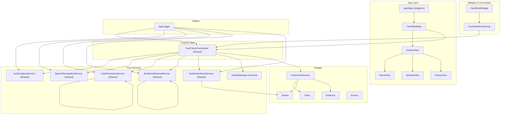
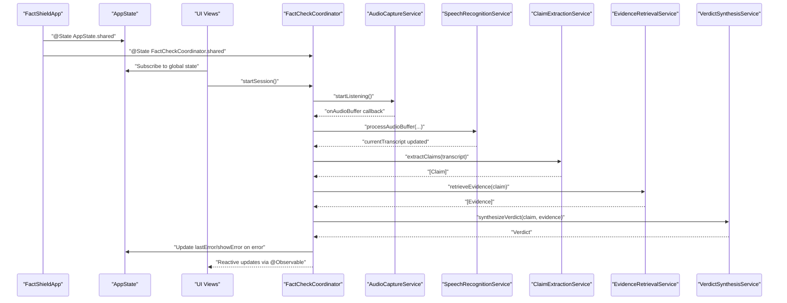
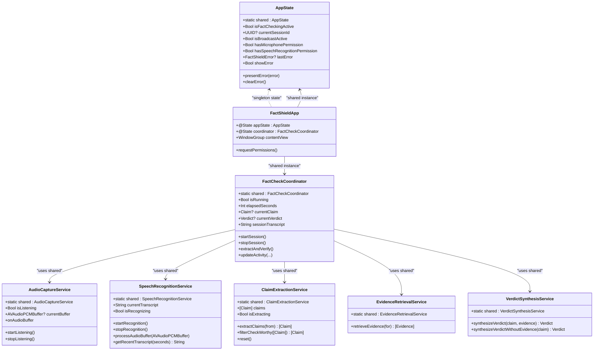

# State Management Architecture

<cite>
**Referenced Files in This Document**
- [AppState.swift](file://FactShield/FactShield/App/AppState.swift)
- [FactShieldApp.swift](file://FactShield/FactShield/App/FactShieldApp.swift)
- [FactCheckCoordinator.swift](file://FactShield/FactShield/Features/FactCheck/FactCheckCoordinator.swift)
- [AudioCaptureService.swift](file://FactShield/FactShield/Core/Audio/AudioCaptureService.swift)
- [SpeechRecognitionService.swift](file://FactShield/FactShield/Core/Speech/SpeechRecognitionService.swift)
- [ClaimExtractionService.swift](file://FactShield/FactShield/Core/Claims/ClaimExtractionService.swift)
- [EvidenceRetrievalService.swift](file://FactShield/FactShield/Core/Verification/EvidenceRetrievalService.swift)
- [VerdictSynthesisService.swift](file://FactShield/FactShield/Core/Verification/VerdictSynthesisService.swift)
- [FactCheckSession.swift](file://FactShield/FactShield/Models/FactCheckSession.swift)
- [Enums.swift](file://FactShield/FactShield/Models/Enums.swift)
- [Logger.swift](file://FactShield/FactShield/Utilities/Logger.swift)
- [HomeView.swift](file://FactShield/FactShield/Features/Home/HomeView.swift)
- [SettingsView.swift](file://FactShield/FactShield/Features/Settings/SettingsView.swift)
- [FactShieldWidget.swift](file://FactShield/FactShield/Widgets/FactShieldWidget.swift)
</cite>

## Update Summary
**Changes Made**
- Updated AppState implementation with singleton pattern and comprehensive error state management
- Added FactShieldApp as the main application entry point with integrated state coordination
- Enhanced FactCheckCoordinator with shared instance pattern and improved state management
- Integrated comprehensive application structure with tabbed interface and settings management
- Added widget and live activity integration for real-time state visualization

## Table of Contents
1. [Introduction](#introduction)
2. [Project Structure](#project-structure)
3. [Core Components](#core-components)
4. [Architecture Overview](#architecture-overview)
5. [Detailed Component Analysis](#detailed-component-analysis)
6. [Dependency Analysis](#dependency-analysis)
7. [Performance Considerations](#performance-considerations)
8. [Troubleshooting Guide](#troubleshooting-guide)
9. [Conclusion](#conclusion)
10. [Appendices](#appendices)

## Introduction
This document explains the reactive state management architecture of FactChecking Live. It focuses on the observable state pattern implemented with Swift's @Observable macro, the global AppState coordinator with singleton pattern, and the FactCheckCoordinator's orchestration of session state across audio capture, speech recognition, claim extraction, evidence retrieval, and verdict synthesis. The architecture now includes comprehensive application structure with FactShieldApp, integrated state coordination across all components, and real-time visualization through widgets and live activities.

## Project Structure
The state management spans several layers with a comprehensive application structure:
- Application-wide state: AppState with singleton pattern
- Main application entry: FactShieldApp with tabbed interface
- Feature-level orchestration: FactCheckCoordinator with shared instance
- Domain services: AudioCaptureService, SpeechRecognitionService, ClaimExtractionService, EvidenceRetrievalService, VerdictSynthesisService
- Models and enums: Claim, Verdict, Evidence, FactCheckSession, FactShieldError, and related enumerations
- UI components: HomeView, SettingsView, HistoryView with comprehensive navigation
- Widgets and live activities: Real-time state visualization
- Logging: AppLogger for centralized diagnostics

**Diagram sources**
- [AppState.swift:1-30](file://FactShield/FactShield/App/AppState.swift#L1-L30)
- [FactShieldApp.swift:1-127](file://FactShield/FactShield/App/FactShieldApp.swift#L1-L127)
- [FactCheckCoordinator.swift:1-216](file://FactShield/FactShield/Features/FactCheck/FactCheckCoordinator.swift#L1-L216)
- [AudioCaptureService.swift:1-51](file://FactShield/FactShield/Core/Audio/AudioCaptureService.swift#L1-L51)
- [SpeechRecognitionService.swift:1-138](file://FactShield/FactShield/Core/Speech/SpeechRecognitionService.swift#L1-L138)
- [ClaimExtractionService.swift:1-152](file://FactShield/FactShield/Core/Claims/ClaimExtractionService.swift#L1-L152)
- [EvidenceRetrievalService.swift:1-233](file://FactShield/FactShield/Core/Verification/EvidenceRetrievalService.swift#L1-L233)
- [VerdictSynthesisService.swift:1-184](file://FactShield/FactShield/Core/Verification/VerdictSynthesisService.swift#L1-L184)
- [FactCheckSession.swift:1-54](file://FactShield/FactShield/Models/FactCheckSession.swift#L1-L54)
- [Enums.swift:1-48](file://FactShield/FactShield/Models/Enums.swift#L1-L48)
- [Logger.swift:1-18](file://FactShield/FactShield/Utilities/Logger.swift#L1-L18)
- [FactShieldWidget.swift:1-466](file://FactShield/FactShield/Widgets/FactShieldWidget.swift#L1-L466)

**Section sources**
- [AppState.swift:1-30](file://FactShield/FactShield/App/AppState.swift#L1-L30)
- [FactShieldApp.swift:1-127](file://FactShield/FactShield/App/FactShieldApp.swift#L1-L127)
- [FactCheckCoordinator.swift:1-216](file://FactShield/FactShield/Features/FactCheck/FactCheckCoordinator.swift#L1-L216)
- [AudioCaptureService.swift:1-51](file://FactShield/FactShield/Core/Audio/AudioCaptureService.swift#L1-L51)
- [SpeechRecognitionService.swift:1-138](file://FactShield/FactShield/Core/Speech/SpeechRecognitionService.swift#L1-L138)
- [ClaimExtractionService.swift:1-152](file://FactShield/FactShield/Core/Claims/ClaimExtractionService.swift#L1-L152)
- [EvidenceRetrievalService.swift:1-233](file://FactShield/FactShield/Core/Verification/EvidenceRetrievalService.swift#L1-L233)
- [VerdictSynthesisService.swift:1-184](file://FactShield/FactShield/Core/Verification/VerdictSynthesisService.swift#L1-L184)
- [FactCheckSession.swift:1-54](file://FactShield/FactShield/Models/FactCheckSession.swift#L1-L54)
- [Enums.swift:1-48](file://FactShield/FactShield/Models/Enums.swift#L1-L48)
- [Logger.swift:1-18](file://FactShield/FactShield/Utilities/Logger.swift#L1-L18)
- [FactShieldWidget.swift:1-466](file://FactShield/FactShield/Widgets/FactShieldWidget.swift#L1-L466)

## Core Components
- **AppState**: Global singleton state container with observable properties for active sessions, permissions, and error visibility. Provides helpers to present and clear errors with centralized error management.
- **FactShieldApp**: Main application entry point with tabbed interface (Home, History, Settings) and integrated state coordination using @State properties for AppState.shared and FactCheckCoordinator.shared.
- **FactCheckCoordinator**: Central orchestrator with shared instance pattern, managing timers, wiring audio buffers, periodic claim extraction, evidence retrieval, verdict synthesis, and Live Activity updates.
- **AudioCaptureService**: Observable audio capture with buffer tap callback, exposing isListening and currentBuffer for diagnostics.
- **SpeechRecognitionService**: Observable speech-to-text with rolling transcript buffer, partial and final results, and automatic restart on error.
- **ClaimExtractionService**: Observable claim extraction using LLM API client, tracking extraction state and parsing structured JSON.
- **EvidenceRetrievalService**: Observable evidence retrieval from multiple providers in parallel, deduplicating and sorting by weighted scores.
- **VerdictSynthesisService**: Observable verdict synthesis with chain-of-thought prompting and robust JSON parsing.
- **Models**: Claim, Verdict, Evidence, FactCheckSession, and FactShieldError define domain state and error taxonomy with comprehensive enumeration support.
- **Logger**: Centralized logging categories for each subsystem with comprehensive logging infrastructure.

Key reactive characteristics:
- All major state holders use @Observable with singleton/shared patterns enabling SwiftUI-driven reactivity.
- FactShieldApp coordinates global state through @State properties binding to shared instances.
- FactCheckCoordinator manages lifecycle and state transitions across the complete pipeline.
- Services expose observable properties and asynchronous operations for compositional state updates.
- Widgets and live activities provide real-time state visualization through shared coordinator access.

**Section sources**
- [AppState.swift:3-29](file://FactShield/FactShield/App/AppState.swift#L3-L29)
- [FactShieldApp.swift:4-26](file://FactShield/FactShield/App/FactShieldApp.swift#L4-L26)
- [FactCheckCoordinator.swift:5-202](file://FactShield/FactShield/Features/FactCheck/FactCheckCoordinator.swift#L5-L202)
- [AudioCaptureService.swift:4-50](file://FactShield/FactShield/Core/Audio/AudioCaptureService.swift#L4-L50)
- [SpeechRecognitionService.swift:5-137](file://FactShield/FactShield/Core/Speech/SpeechRecognitionService.swift#L5-L137)
- [ClaimExtractionService.swift:4-152](file://FactShield/FactShield/Core/Claims/ClaimExtractionService.swift#L4-L152)
- [EvidenceRetrievalService.swift:4-233](file://FactShield/FactShield/Core/Verification/EvidenceRetrievalService.swift#L4-L233)
- [VerdictSynthesisService.swift:22-184](file://FactShield/FactShield/Core/Verification/VerdictSynthesisService.swift#L22-L184)
- [FactCheckSession.swift:3-54](file://FactShield/FactShield/Models/FactCheckSession.swift#L3-L54)
- [Enums.swift:25-47](file://FactShield/FactShield/Models/Enums.swift#L25-L47)
- [Logger.swift:3-17](file://FactShield/FactShield/Utilities/Logger.swift#L3-L17)

## Architecture Overview
The system follows a layered reactive architecture with comprehensive application integration:
- **Observability**: @Observable on AppState and core services enables SwiftUI views to subscribe and react automatically.
- **Singleton Pattern**: Shared instances of AppState and FactCheckCoordinator provide centralized state coordination.
- **Application Integration**: FactShieldApp serves as the main entry point with tabbed navigation and integrated state management.
- **Orchestration**: FactCheckCoordinator manages the lifecycle and state transitions across the complete pipeline.
- **Real-time Visualization**: Widgets and live activities provide continuous state updates.
- **Persistence**: FactCheckSession persists session metadata, claims, and verdicts.
- **Error Coordination**: AppState holds lastError and showError; FactCheckCoordinator logs and surfaces errors via AppState.

**Diagram sources**
- [FactShieldApp.swift:5-7](file://FactShield/FactShield/App/FactShieldApp.swift#L5-L7)
- [AppState.swift:3-29](file://FactShield/FactShield/App/AppState.swift#L3-L29)
- [FactCheckCoordinator.swift:38-161](file://FactShield/FactShield/Features/FactCheck/FactCheckCoordinator.swift#L38-L161)
- [AudioCaptureService.swift:19-40](file://FactShield/FactShield/Core/Audio/AudioCaptureService.swift#L19-L40)
- [SpeechRecognitionService.swift:63-80](file://FactShield/FactShield/Core/Speech/SpeechRecognitionService.swift#L63-L80)
- [ClaimExtractionService.swift:18-56](file://FactShield/FactShield/Core/Claims/ClaimExtractionService.swift#L18-L56)
- [EvidenceRetrievalService.swift:16-63](file://FactShield/FactShield/Core/Verification/EvidenceRetrievalService.swift#L16-L63)
- [VerdictSynthesisService.swift:30-80](file://FactShield/FactShield/Core/Verification/VerdictSynthesisService.swift#L30-L80)

## Detailed Component Analysis

### Observable State Pattern and AppState
- **Singleton Pattern**: AppState uses a static shared instance for centralized state management across the entire application.
- **Global State Container**: Observable properties for session flags, permissions, and error visibility with comprehensive state management.
- **Error Management**: Helper methods presentError and clearError unify error handling across the app with localized error descriptions.
- **Permission Tracking**: Dedicated properties for microphone and speech recognition permissions with automatic updates.
- **SwiftUI Integration**: SwiftUI views can subscribe to AppState for global UI state (showing alerts, enabling/disabling controls).

Best practices:
- Keep AppState minimal and focused on cross-cutting concerns.
- Use presentError/clearError to centralize error propagation to UI.
- Leverage singleton pattern for consistent state access across all components.

**Section sources**
- [AppState.swift:3-29](file://FactShield/FactShield/App/AppState.swift#L3-L29)

### FactShieldApp: Main Application Entry Point
- **Application Structure**: @main struct FactShieldApp serves as the main application entry point with comprehensive state coordination.
- **State Integration**: Uses @State properties to bind AppState.shared and FactCheckCoordinator.shared for seamless integration.
- **Tabbed Interface**: Implements ContentView with Home, History, and Settings tabs using AppTab enumeration.
- **Permission Management**: Requests microphone permissions on app launch and updates AppState.hasMicrophonePermission.
- **Navigation**: Provides structured navigation with NavigationStack and tab-based organization.

Integration patterns:
- Binds shared instances to @State properties for reactive updates.
- Integrates with ContentView for tabbed navigation structure.
- Manages permission requests and state updates during app lifecycle.

**Section sources**
- [FactShieldApp.swift:4-26](file://FactShield/FactShield/App/FactShieldApp.swift#L4-L26)
- [FactShieldApp.swift:28-54](file://FactShield/FactShield/App/FactShieldApp.swift#L28-L54)

### FactCheckCoordinator: Central Orchestrator with Shared Instance
- **Shared Instance Pattern**: Uses static shared instance for centralized coordination across all components.
- **Comprehensive State Management**: Manages currentClaim, currentVerdict, sessionTranscript, elapsedSeconds, and session history.
- **Timer Coordination**: Runs periodic timers for claim extraction (every 15 seconds) and elapsed time tracking.
- **Pipeline Orchestration**: Coordinates complete fact-check pipeline from audio capture to verdict synthesis.
- **Live Activity Integration**: Updates Live Activity continuously with current state information.
- **Error Handling**: Comprehensive error logging and state management throughout the pipeline.

State flow improvements:
- Audio buffers feed the speech recognizer with dedicated timer-based extraction.
- Speech updates rolling transcript with periodic extraction filtering.
- Evidence retrieval aggregates sources from multiple providers with fallback handling.
- Verdict synthesis produces structured results with confidence scoring and reasoning.
- Live Activity receives continuous updates with comprehensive state information.

**Diagram sources**
- [FactCheckCoordinator.swift:38-161](file://FactShield/FactShield/Features/FactCheck/FactCheckCoordinator.swift#L38-L161)

**Section sources**
- [FactCheckCoordinator.swift:5-202](file://FactShield/FactShield/Features/FactCheck/FactCheckCoordinator.swift#L5-L202)

### Audio Capture Pipeline
- **Buffer Tap Integration**: Installs AVAudioEngine tap to stream PCM buffers to the coordinator with dedicated callback handling.
- **Diagnostics Exposure**: Exposes isListening and currentBuffer for comprehensive diagnostics and monitoring.
- **Thread Safety**: onAudioBuffer callback invoked on dedicated queue to avoid UI thread contention.
- **Integration Pattern**: FactCheckCoordinator sets onAudioBuffer to forward buffers to AudioBufferProcessor for processing.

Integration improvements:
- Direct integration with FactCheckCoordinator for seamless audio processing.
- Comprehensive buffer processing through AudioBufferProcessor.shared.

**Section sources**
- [AudioCaptureService.swift:4-50](file://FactShield/FactShield/Core/Audio/AudioCaptureService.swift#L4-L50)
- [FactCheckCoordinator.swift:44-46](file://FactShield/FactShield/Features/FactCheck/FactCheckCoordinator.swift#L44-L46)

### Speech Recognition Pipeline
- **On-Device Preference**: Uses SFSpeechRecognizer with on-device preference when available for privacy and performance.
- **Rolling Transcript Management**: Maintains rolling transcript buffer capped at word limit with recent transcript windows.
- **Automatic Recovery**: Emits partial and final transcripts with automatic restart on error conditions.
- **Periodic Extraction Support**: Provides recent transcript windows for periodic claim extraction timing.

Enhanced capabilities:
- Improved error recovery and automatic restart functionality.
- Better integration with periodic extraction timing for optimal performance.

**Section sources**
- [SpeechRecognitionService.swift:5-137](file://FactShield/FactShield/Core/Speech/SpeechRecognitionService.swift#L5-L137)

### Claim Extraction Pipeline
- **Structured Prompting**: Sends structured prompts to LLM API for verifiable claim extraction with comprehensive formatting.
- **Robust Parsing**: Parses JSON with cleanup and fallback parsing strategies for reliability.
- **Worthiness Filtering**: Filters claims by check-worthiness priority for optimal fact-checking focus.
- **State Management**: Tracks extraction state and appends results to in-memory claims list with duplicate prevention.

Reliability improvements:
- Enhanced JSON parsing with multiple fallback strategies.
- Priority-based claim filtering for efficient processing.

**Section sources**
- [ClaimExtractionService.swift:4-152](file://FactShield/FactShield/Core/Claims/ClaimExtractionService.swift#L4-L152)

### Evidence Retrieval Pipeline
- **Parallel Processing**: Performs parallel retrieval from multiple providers using async let for optimal performance.
- **Intelligent Deduplication**: Deduplicates by URL with sophisticated comparison algorithms.
- **Weighted Scoring**: Sorts by weighted scores with configurable importance factors.
- **Provider Integration**: Supports multiple evidence providers with unified response parsing.

Performance enhancements:
- Optimized parallel processing for multiple provider integration.
- Intelligent deduplication and scoring algorithms.

**Section sources**
- [EvidenceRetrievalService.swift:4-233](file://FactShield/FactShield/Core/Verification/EvidenceRetrievalService.swift#L4-L233)

### Verdict Synthesis Pipeline
- **Chain-of-Thought Prompting**: Constructs comprehensive prompts using evidence and claim with reasoning chains.
- **Structured JSON Parsing**: Parses structured JSON into Verdict with confidence scoring and detailed reasoning.
- **Fallback Mechanisms**: Includes fallback path when no evidence is available with model knowledge utilization.
- **Confidence Scoring**: Provides confidence scores with numerical representation for transparency.

Enhanced synthesis:
- Improved chain-of-thought prompting for better reasoning quality.
- Comprehensive confidence scoring and reasoning documentation.

**Section sources**
- [VerdictSynthesisService.swift:22-184](file://FactShield/FactShield/Core/Verification/VerdictSynthesisService.swift#L22-L184)

### Models and State Persistence
- **FactCheckSession**: Encapsulates comprehensive session metadata, transcript, claims, verdicts, and status with initialization support.
- **TranscriptSegment**: Provides detailed segment information with speaker identification, confidence, and finalization status.
- **Domain Models**: Claim, Verdict, and Evidence define comprehensive domain state with typed enumerations for statuses and verdict types.
- **Error Taxonomy**: FactShieldError provides unified error taxonomy with localized descriptions for consistent error handling.
- **Enumeration Support**: AppTab, AudioQuality, and FactShieldError provide comprehensive enumeration support for application state.

Persistence capabilities:
- Structured FactCheckSession for comprehensive session data management.
- TranscriptSegment for detailed audio transcription tracking.
- Comprehensive enumeration support for configuration and state management.

**Section sources**
- [FactCheckSession.swift:3-54](file://FactShield/FactShield/Models/FactCheckSession.swift#L3-L54)
- [Claim.swift:3-37](file://FactShield/FactShield/Core/Claims/Claim.swift#L3-L37)
- [Verdict.swift:3-31](file://FactShield/FactShield/Core/Verification/Verdict.swift#L3-L31)
- [Evidence.swift:3-16](file://FactShield/FactShield/Core/Verification/Evidence.swift#L3-L16)
- [Enums.swift:25-47](file://FactShield/FactShield/Models/Enums.swift#L25-L47)

### UI Components and Navigation
- **HomeView**: Primary interface with hero card, active session banner, how-it-works section, and recent history integration.
- **SettingsView**: Comprehensive configuration with API key management, audio settings, pipeline configuration, and status monitoring.
- **HistoryView**: Placeholder implementation with session history display and empty state handling.
- **Tabbed Navigation**: ContentView with AppTab enumeration for organized navigation structure.
- **State Integration**: All views integrate with FactCheckCoordinator.shared for reactive state updates.

UI enhancements:
- Comprehensive tabbed interface with navigation structure.
- Settings management with persistent configuration storage.
- History tracking with future SwiftData integration plans.

**Section sources**
- [HomeView.swift:3-233](file://FactShield/FactShield/Features/Home/HomeView.swift#L3-L233)
- [SettingsView.swift:3-172](file://FactShield/FactShield/Features/Settings/SettingsView.swift#L3-L172)
- [FactShieldApp.swift:28-80](file://FactShield/FactShield/App/FactShieldApp.swift#L28-L80)

### Widgets and Live Activity Integration
- **FactShieldWidget**: Comprehensive widget implementation with dynamic island support and live activity integration.
- **Live Activity Management**: Real-time state visualization through FactShieldLiveActivity with animated waveform and verdict display.
- **Dynamic Island Support**: Full dynamic island integration with compact and expanded layouts.
- **Stop Intent Integration**: LiveActivityIntent support for session termination through widget controls.
- **Visual Feedback**: Color-coded verdict displays, confidence scoring, and elapsed time visualization.

Real-time integration:
- Continuous Live Activity updates with comprehensive state information.
- Widget-based session control and monitoring.
- Dynamic island customization for different interaction modes.

**Section sources**
- [FactShieldWidget.swift:1-466](file://FactShield/FactShield/Widgets/FactShieldWidget.swift#L1-L466)

## Dependency Analysis
The FactCheckCoordinator depends on multiple services and models with comprehensive application integration. The diagram below highlights the primary dependencies and data flow.

**Diagram sources**
- [AppState.swift:3-29](file://FactShield/FactShield/App/AppState.swift#L3-L29)
- [FactShieldApp.swift:5-7](file://FactShield/FactShield/App/FactShieldApp.swift#L5-L7)
- [FactCheckCoordinator.swift:5-202](file://FactShield/FactShield/Features/FactCheck/FactCheckCoordinator.swift#L5-L202)
- [AudioCaptureService.swift:4-50](file://FactShield/FactShield/Core/Audio/AudioCaptureService.swift#L4-L50)
- [SpeechRecognitionService.swift:5-137](file://FactShield/FactShield/Core/Speech/SpeechRecognitionService.swift#L5-L137)
- [ClaimExtractionService.swift:4-152](file://FactShield/FactShield/Core/Claims/ClaimExtractionService.swift#L4-L152)
- [EvidenceRetrievalService.swift:4-233](file://FactShield/FactShield/Core/Verification/EvidenceRetrievalService.swift#L4-L233)
- [VerdictSynthesisService.swift:22-184](file://FactShield/FactShield/Core/Verification/VerdictSynthesisService.swift#L22-L184)

**Section sources**
- [FactShieldApp.swift:5-7](file://FactShield/FactShield/App/FactShieldApp.swift#L5-L7)
- [FactCheckCoordinator.swift:11-17](file://FactShield/FactShield/Features/FactCheck/FactCheckCoordinator.swift#L11-L17)
- [AppState.swift:3-29](file://FactShield/FactShield/App/AppState.swift#L3-L29)

## Performance Considerations
- **Singleton Pattern Benefits**: Shared instances reduce memory overhead and provide consistent state access across the application.
- **Thread Safety**: Use @MainActor for UI-related activity updates to ensure thread safety with comprehensive actor isolation.
- **Offloading Strategy**: Heavy work (LLM calls, parsing) off main thread; FactCheckCoordinator uses Task and @MainActor appropriately.
- **Timer Optimization**: Careful periodic timers balance responsiveness and resource usage with configurable extraction intervals.
- **Memory Management**: Limit transcript buffer size and evidence counts to cap memory and processing overhead.
- **Parallel Processing**: Use async let for parallel provider calls in EvidenceRetrievalService for optimal performance.
- **State Update Minimization**: FactCheckCoordinator updates Live Activity only when meaningful changes occur.
- **Widget Efficiency**: Live activities and widgets use efficient state updates with minimal recomputation.

## Troubleshooting Guide
Common issues and debugging techniques:
- **Application Startup Issues**: Check FactShieldApp initialization and shared instance creation; verify AppState.shared accessibility.
- **Permission Denial**: Monitor AppState.hasMicrophonePermission and handle permission requests in FactShieldApp.requestPermissions.
- **Speech Recognition Failures**: Check permissions and availability; service logs warnings and attempts restarts automatically.
- **Audio Engine Problems**: Inspect engine preparation and start; service logs errors and prevents repeated starts.
- **Claim Extraction JSON Parsing**: Service cleans JSON and falls back to array parsing; review logs for parsing errors.
- **Evidence Provider Failures**: Service continues with available results and logs warnings; verify provider credentials and quotas.
- **Verdict Synthesis Errors**: Service throws structured errors; confirm prompt formatting and API responses.
- **Error Surfacing**: Use AppState.presentError for unified error presentation; ensure AppState.showError is bound in UI.
- **Widget Integration**: Verify Live Activity state updates and dynamic island configuration.

Practical tips:
- Enable logging categories for each subsystem to trace end-to-end flows.
- Use AppState.lastError to display contextual error messages in UI.
- Add breakpoints in FactCheckCoordinator.extractAndVerify to inspect intermediate states.
- Monitor shared instance accessibility across different application contexts.

**Section sources**
- [FactShieldApp.swift:18-25](file://FactShield/FactShield/App/FactShieldApp.swift#L18-L25)
- [SpeechRecognitionService.swift:28-39](file://FactShield/FactShield/Core/Speech/SpeechRecognitionService.swift#L28-L39)
- [SpeechRecognitionService.swift:41-84](file://FactShield/FactShield/Core/Speech/SpeechRecognitionService.swift#L41-L84)
- [AudioCaptureService.swift:33-40](file://FactShield/FactShield/Core/Audio/AudioCaptureService.swift#L33-L40)
- [ClaimExtractionService.swift:80-107](file://FactShield/FactShield/Core/Claims/ClaimExtractionService.swift#L80-L107)
- [EvidenceRetrievalService.swift:24-44](file://FactShield/FactShield/Core/Verification/EvidenceRetrievalService.swift#L24-L44)
- [VerdictSynthesisService.swift:144-150](file://FactShield/FactShield/Core/Verification/VerdictSynthesisService.swift#L144-L150)
- [AppState.swift:20-28](file://FactShield/FactShield/App/AppState.swift#L20-L28)
- [Logger.swift:3-17](file://FactShield/FactShield/Utilities/Logger.swift#L3-L17)

## Conclusion
FactChecking Live employs a comprehensive, reactive state architecture centered on @Observable state holders with singleton patterns and dedicated FactCheckCoordinator that orchestrates the complete end-to-end fact-check pipeline. The new FactShieldApp provides integrated application structure with tabbed navigation, comprehensive state coordination, and real-time visualization through widgets and live activities. Global AppState coordinates cross-cutting concerns like permissions and error visibility, while modular services encapsulate domain logic. The design emphasizes observability, resilience, maintainability, and comprehensive application integration with clear separation of concerns and robust error handling.

## Appendices

### State Subscription Patterns
- **Singleton Access**: Subscribe to AppState.shared for global UI state (permissions, error visibility).
- **Shared Instance Binding**: Observe FactCheckCoordinator.shared for session progress, current claim, and verdict updates.
- **Service Integration**: Bind service observables (isRecognizing, isExtracting) to UI indicators.
- **Widget State**: Access FactCheckCoordinator.shared from widgets for real-time state updates.
- **Application State**: Use @State properties in FactShieldApp for coordinated application-wide state management.

### State Mutation Strategies
- **Singleton Pattern**: Mutate state within @MainActor closures when updating UI-bound properties.
- **Immutable Models**: Use immutable Claim, Verdict, Evidence models to simplify change detection.
- **Shared Instance Coordination**: Aggregate state in FactCheckCoordinator.shared to minimize cross-component coupling.
- **Error State Management**: Use AppState.presentError/clearError for centralized error propagation.
- **Permission Updates**: Handle permission state changes through AppState properties.

### Debugging Techniques
- **Comprehensive Logging**: Use AppLogger categories to trace each stage of the pipeline with detailed subsystem logging.
- **State Inspection**: Monitor FactCheckCoordinator.shared timers and state transitions during development.
- **Widget Debugging**: Verify JSON parsing paths and error handling in claim extraction and verdict synthesis.
- **Application Flow**: Trace FactShieldApp initialization and shared instance accessibility.
- **Live Activity Monitoring**: Validate state updates and dynamic island rendering in widget extensions.