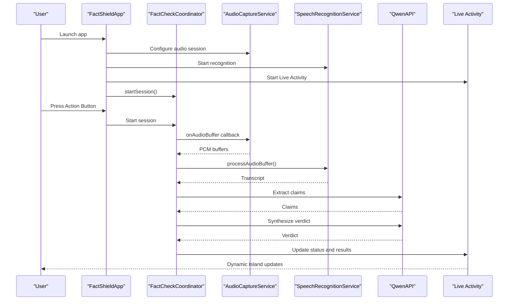
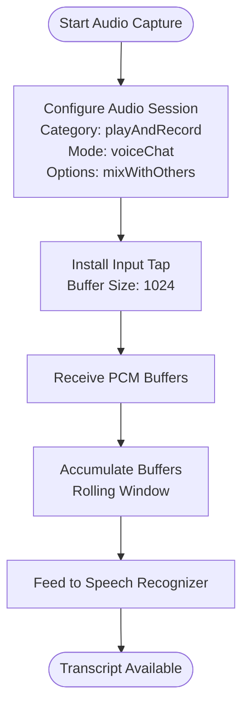
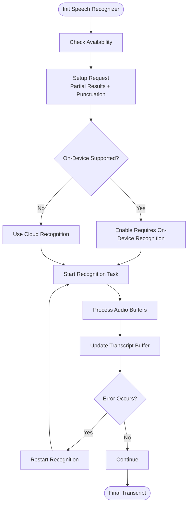
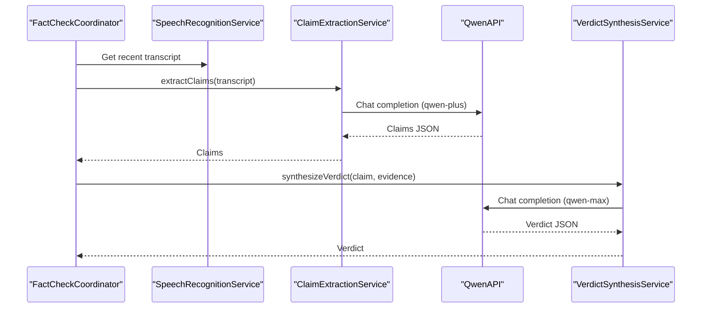
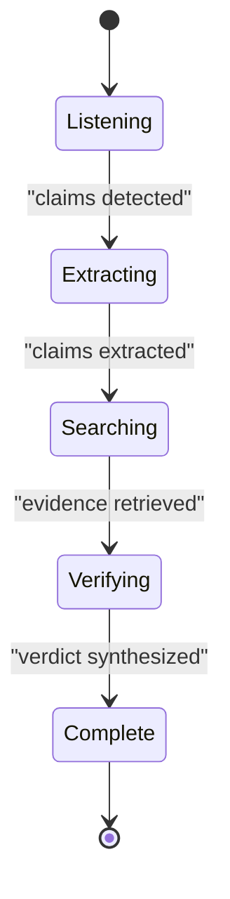
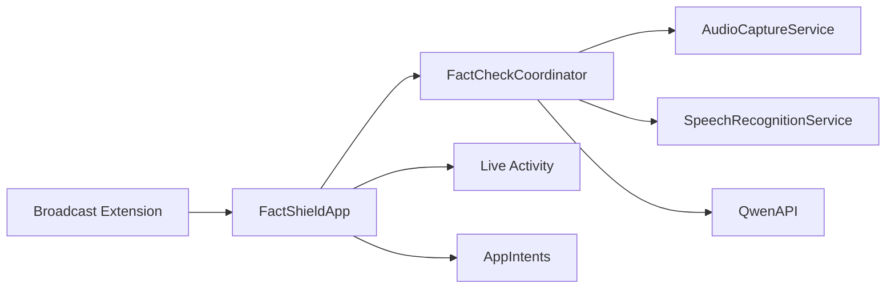

# Getting Started

<cite>
**Referenced Files in This Document**
- [FactShield-iOS-BuildInstructions.md](file://FactShield-iOS-BuildInstructions.md)
- [FactShield-Architecture.md](file://FactShield-Architecture.md)
- [Package.swift](file://FactShield/Package.swift)
- [FactShieldApp.swift](file://FactShield/FactShield/App/FactShieldApp.swift)
- [FactShieldLiveActivity.swift](file://FactShield/FactShield/Widgets/FactShieldLiveActivity.swift)
- [FactCheckCoordinator.swift](file://FactShield/FactShield/Features/FactCheck/FactCheckCoordinator.swift)
- [FactShieldShortcuts.swift](file://FactShield/FactShield/Intents/FactShieldShortcuts.swift)
- [QwenAPI.swift](file://FactShield/FactShield/Core/Network/QwenAPI.swift)
- [Constants.swift](file://FactShield/FactShield/Utilities/Constants.swift)
- [FactShield.entitlements](file://FactShield/FactShield/Resources/FactShield.entitlements)
- [FactShieldBroadcast.entitlements](file://FactShield/FactShield/BroadcastExtension/FactShieldBroadcast.entitlements)
- [HomeView.swift](file://FactShield/FactShield/Features/Home/HomeView.swift)
</cite>

## Table of Contents
1. [Introduction](#introduction)
2. [Prerequisites](#prerequisites)
3. [Installation](#installation)
4. [Build Configuration](#build-configuration)
5. [Initial Setup](#initial-setup)
6. [First-Time User Workflow](#first-time-user-workflow)
7. [Architecture Overview](#architecture-overview)
8. [Detailed Component Analysis](#detailed-component-analysis)
9. [Dependency Analysis](#dependency-analysis)
10. [Performance Considerations](#performance-considerations)
11. [Troubleshooting Guide](#troubleshooting-guide)
12. [Conclusion](#conclusion)

## Introduction
This guide helps you install, configure, and use FactChecking Live (FactShield) on iOS. The app captures audio from any app via the Action Button, transcribes it, extracts verifiable claims, searches evidence, and shows verdicts in the Dynamic Island. It integrates with Qwen API for claim extraction and verdict synthesis, and uses Live Activities, AppIntents, and a Broadcast Upload Extension for ReplayKit audio capture.

## Prerequisites
- macOS: Latest version compatible with Xcode
- Xcode: Latest version supporting iOS 17+ development
- iOS Device: iOS 17.0 or later (required for interactive Dynamic Island and AppIntents)
- Hardware: iPhone with Action Button (iPhone 15 Pro+ and all iPhone 16 models) for the primary “Quick Fact-Check” entry point
- Developer Account: Apple Developer account for signing and entitlements
- Qwen API Access: API key for DashScope Qwen integration

**Section sources**
- [FactShield-iOS-BuildInstructions.md:15](file://FactShield-iOS-BuildInstructions.md#L15)
- [FactShield-iOS-BuildInstructions.md:119](file://FactShield-iOS-BuildInstructions.md#L119)
- [FactShield-Architecture.md:382](file://FactShield-Architecture.md#L382)

## Installation
Follow these steps to clone the repository and prepare the project:

1. Clone the repository to your local machine.
2. Open the project in Xcode using the package manifest located at FactShield/Package.swift.
3. Ensure the minimum deployment target is iOS 17.0 as defined in the package manifest.
4. Verify the project builds successfully with Swift Package Manager.

Notes:
- The project uses Swift Package Manager exclusively; no CocoaPods or Carthage is required.
- The package manifest defines the iOS 17+ platform requirement.

**Section sources**
- [Package.swift:6-9](file://FactShield/Package.swift#L6-L9)
- [Package.swift:16-24](file://FactShield/Package.swift#L16-L24)

## Build Configuration
Configure capabilities, entitlements, and signing for the app and Broadcast Extension:

1. Enable required capabilities for the main app target:
   - Background Modes: Audio, AirPlay, Picture in Picture; Background fetch
   - Push Notifications (APNs) for Live Activity updates
   - App Groups: group identifier used by the app and Broadcast Extension
   - Privacy descriptions: Microphone Usage Description and Speech Recognition Usage Description

2. Configure entitlements:
   - Main app entitlements must include the App Group identifier.
   - Broadcast Extension entitlements must include the same App Group identifier.

3. Create the Broadcast Upload Extension target:
   - Product Name: FactShieldBroadcast
   - Bundle ID suffix: .broadcast
   - App Group: group.com.factshield.shared

4. Signing and Provisioning:
   - Use a development team for local testing.
   - Ensure the App Group and Broadcast Extension have the same Team and App Group identifiers.

**Section sources**
- [FactShield-iOS-BuildInstructions.md:122](file://FactShield-iOS-BuildInstructions.md#L122-L129)
- [FactShield-iOS-BuildInstructions.md:131](file://FactShield-iOS-BuildInstructions.md#L131-L137)
- [FactShield.entitlements:5-8](file://FactShield/FactShield/Resources/FactShield.entitlements#L5-L8)
- [FactShieldBroadcast.entitlements:5-8](file://FactShield/FactShield/BroadcastExtension/FactShieldBroadcast.entitlements#L5-L8)

## Initial Setup
Complete the initial configuration to enable audio capture, Live Activities, and AppIntents:

1. Request permissions on app launch:
   - The app requests microphone permission during startup.
   - Ensure the app’s Info.plist includes the required privacy descriptions.

2. Configure audio session:
   - Use the AudioSessionManager to set the audio session category for voice chat with Acoustic Echo Cancellation enabled.
   - This allows capturing while other apps play audio.

3. Start Live Activity:
   - The app creates and updates a Live Activity for Dynamic Island integration.
   - The activity attributes define status, verdict, confidence, and source counts.

4. Set up AppIntents:
   - Register StartFactCheckIntent and StopFactCheckIntent.
   - Expose these intents via the FactShieldShortcuts provider.

5. Initialize the FactCheckCoordinator:
   - The coordinator wires audio capture, speech recognition, claim extraction, evidence retrieval, and verdict synthesis.
   - It periodically extracts claims from the rolling transcript and updates the Live Activity.

6. Configure Qwen API:
   - Provide the Qwen API key via environment variable or UserDefaults.
   - The API client handles base URL, headers, and request/response serialization.

7. Configure constants:
   - App Group identifier, bundle IDs, API base URL, audio defaults, and pipeline thresholds are centralized in Constants.

**Section sources**
- [FactShieldApp.swift:18](file://FactShield/FactShield/App/FactShieldApp.swift#L18-L25)
- [FactShieldLiveActivity.swift:5](file://FactShield/FactShield/Widgets/FactShieldLiveActivity.swift#L5-L43)
- [FactShieldShortcuts.swift:3](file://FactShield/FactShield/Intents/FactShieldShortcuts.swift#L3-L26)
- [FactCheckCoordinator.swift:38](file://FactShield/FactShield/Features/FactCheck/FactCheckCoordinator.swift#L38-L55)
- [QwenAPI.swift:76](file://FactShield/FactShield/Core/Network/QwenAPI.swift#L76-L82)
- [Constants.swift:4](file://FactShield/FactShield/Utilities/Constants.swift#L4-L36)

## First-Time User Workflow
Follow this end-to-end flow from app launch to completing your first fact-check session:

1. Launch the app:
   - On first launch, the app requests microphone permission.
   - The home screen shows the hero card and instructions.

2. Start a session:
   - Tap the “Start Fact-Checking” button.
   - The app configures the audio session, starts audio capture, begins speech recognition, starts Live Activity, and initializes the FactCheckCoordinator.

3. Use the Action Button:
   - Assign the “Quick Fact-Check” shortcut to your Action Button in Settings > Action Button > Shortcuts.
   - Press the Action Button while watching or listening to content to activate the app.

4. Listen and capture:
   - The app captures audio with Acoustic Echo Cancellation enabled.
   - The Dynamic Island shows “Listening…” with a waveform icon.

5. Stop and analyze:
   - Press the Action Button again or tap Stop in the app.
   - The app sends the transcript to Qwen for claim extraction and verdict synthesis.
   - Live Activity updates to show status, confidence, and sources.

6. Review results:
   - Long-press the Dynamic Island to expand and view the full verdict, reasoning, and sources.
   - The session history appears in the History tab.



**Diagram sources**
- [FactShieldApp.swift:18](file://FactShield/FactShield/App/FactShieldApp.swift#L18-L25)
- [FactCheckCoordinator.swift:38](file://FactShield/FactShield/Features/FactCheck/FactCheckCoordinator.swift#L38-L55)
- [QwenAPI.swift:94](file://FactShield/FactShield/Core/Network/QwenAPI.swift#L94-L151)
- [FactShieldLiveActivity.swift:10](file://FactShield/FactShield/Widgets/FactShieldLiveActivity.swift#L10-L20)

**Section sources**
- [HomeView.swift:12](file://FactShield/FactShield/Features/Home/HomeView.swift#L12-L25)
- [FactShield-iOS-BuildInstructions.md:395](file://FactShield-iOS-BuildInstructions.md#L395-L427)
- [FactShield-iOS-BuildInstructions.md:621](file://FactShield-Architecture.md#L621-L671)

## Architecture Overview
FactShield integrates multiple technologies to deliver real-time fact-checking:

- Audio capture via AVAudioEngine with Acoustic Echo Cancellation
- On-device speech recognition using SFSpeechRecognizer
- Live Activities and widgets for Dynamic Island and Lock Screen
- AppIntents for Action Button integration
- Broadcast Upload Extension for ReplayKit system audio capture
- Qwen API for claim extraction and verdict synthesis

```mermaid
graph TB
subgraph "iOS App"
App["FactShieldApp"]
Views["SwiftUI Views"]
Coordinator["FactCheckCoordinator"]
Audio["AudioCaptureService"]
Speech["SpeechRecognitionService"]
Live["Live Activity"]
Intents["AppIntents"]
end
subgraph "Broadcast Extension"
Broadcast["Broadcast Upload Extension"]
end
subgraph "External Services"
Qwen["Qwen API"]
end
App --> Views
Views --> Coordinator
Coordinator --> Audio
Coordinator --> Speech
Coordinator --> Live
Coordinator --> Intents
Audio <- --> Broadcast
Coordinator --> Qwen
```

**Diagram sources**
- [FactShield-iOS-BuildInstructions.md:507](file://FactShield-Architecture.md#L507-L569)
- [FactShieldApp.swift:5](file://FactShield/FactShield/App/FactShieldApp.swift#L5-L26)
- [FactCheckCoordinator.swift:11](file://FactShield/FactShield/Features/FactCheck/FactCheckCoordinator.swift#L11-L17)

## Detailed Component Analysis

### Audio Pipeline
- AudioSessionManager configures the audio session for voice chat with Acoustic Echo Cancellation and mix-with-others to allow concurrent playback.
- AudioCaptureService installs a tap on the input node to receive PCM buffers and forwards them to the buffer processor.
- AudioBufferProcessor accumulates recent buffers and feeds them to the speech recognizer.



**Diagram sources**
- [FactShield-iOS-BuildInstructions.md:143](file://FactShield-iOS-BuildInstructions.md#L143-L168)
- [FactShield-iOS-BuildInstructions.md:174](file://FactShield-iOS-BuildInstructions.md#L174-L227)
- [FactShield-iOS-BuildInstructions.md:229](file://FactShield-iOS-BuildInstructions.md#L229-L275)

**Section sources**
- [FactShield-iOS-BuildInstructions.md:143](file://FactShield-iOS-BuildInstructions.md#L143-L168)
- [FactShield-iOS-BuildInstructions.md:174](file://FactShield-iOS-BuildInstructions.md#L174-L227)
- [FactShield-iOS-BuildInstructions.md:229](file://FactShield-iOS-BuildInstructions.md#L229-L275)

### Speech Recognition
- SpeechRecognitionService sets up SFSpeechRecognizer with on-device recognition when available, partial results reporting, and punctuation.
- It maintains a rolling transcript buffer and restarts recognition on errors.



**Diagram sources**
- [FactShield-iOS-BuildInstructions.md:281](file://FactShield-iOS-BuildInstructions.md#L281-L420)

**Section sources**
- [FactShield-iOS-BuildInstructions.md:281](file://FactShield-iOS-BuildInstructions.md#L281-L420)

### Claim Extraction and Verdict Synthesis
- ClaimExtractionService sends transcript chunks to Qwen API for structured claim extraction.
- VerdictSynthesisService synthesizes a verdict using chain-of-thought reasoning and evidence ranking.



**Diagram sources**
- [FactShield-iOS-BuildInstructions.md:474](file://FactShield-iOS-BuildInstructions.md#L474-L563)
- [QwenAPI.swift:94](file://FactShield/FactShield/Core/Network/QwenAPI.swift#L94-L151)

**Section sources**
- [FactShield-iOS-BuildInstructions.md:474](file://FactShield-iOS-BuildInstructions.md#L474-L563)
- [QwenAPI.swift:94](file://FactShield/FactShield/Core/Network/QwenAPI.swift#L94-L151)

### Live Activity and Dynamic Island
- Live Activity tracks status, verdict, confidence, and sources.
- The coordinator updates the activity state periodically and on transitions.



**Diagram sources**
- [FactShieldLiveActivity.swift:27](file://FactShield/FactShield/Widgets/FactShieldLiveActivity.swift#L27-L34)
- [FactCheckCoordinator.swift:164](file://FactShield/FactShield/Features/FactCheck/FactCheckCoordinator.swift#L164-L185)

**Section sources**
- [FactShieldLiveActivity.swift:5](file://FactShield/FactShield/Widgets/FactShieldLiveActivity.swift#L5-L43)
- [FactCheckCoordinator.swift:164](file://FactShield/FactShield/Features/FactCheck/FactCheckCoordinator.swift#L164-L185)

## Dependency Analysis
- The app depends on iOS frameworks: AVFoundation (audio), Speech (transcription), ActivityKit/WidgetKit (Live Activity/widgets), AppIntents (shortcuts), and ReplayKit (broadcast extension).
- The Qwen API client encapsulates HTTP requests and response parsing.
- Constants centralize identifiers and thresholds used across components.



**Diagram sources**
- [FactShield-iOS-BuildInstructions.md:507](file://FactShield-Architecture.md#L507-L569)
- [QwenAPI.swift:68](file://FactShield/FactShield/Core/Network/QwenAPI.swift#L68-L73)

**Section sources**
- [QwenAPI.swift:68](file://FactShield/FactShield/Core/Network/QwenAPI.swift#L68-L73)
- [Constants.swift:4](file://FactShield/FactShield/Utilities/Constants.swift#L4-L36)

## Performance Considerations
- Use on-device speech recognition when available to reduce latency and improve offline reliability.
- Keep transcript buffers bounded to avoid excessive memory usage.
- Batch periodic tasks (claim extraction) to balance responsiveness and battery life.
- Minimize network requests by reusing connections and avoiding redundant calls.

## Troubleshooting Guide
Common setup and runtime issues:

- Missing Qwen API key:
  - Symptom: API calls fail with a no-API-key error.
  - Resolution: Set the QWEN_API_KEY environment variable or store it in UserDefaults and load it in the API client.

- Microphone permission denied:
  - Symptom: Audio capture fails or speech recognition unavailable.
  - Resolution: Grant microphone permission in Settings; the app requests permission on launch.

- Live Activity not updating:
  - Symptom: Dynamic Island remains idle or does not reflect status changes.
  - Resolution: Ensure the Live Activity is started and the coordinator updates the activity state with valid status and verdict data.

- Broadcast Extension audio not captured:
  - Symptom: System audio capture does not transmit to the app.
  - Resolution: Confirm the Broadcast Extension target is added, App Group entitlements match, and the user initiates screen recording with the extension selected.

- AppIntents shortcuts not appearing:
  - Symptom: “Quick Fact-Check” shortcut not visible in Action Button settings.
  - Resolution: Verify the StartFactCheckIntent and StopFactCheckIntent are registered via FactShieldShortcuts and the app is rebuilt.

**Section sources**
- [QwenAPI.swift:76](file://FactShield/FactShield/Core/Network/QwenAPI.swift#L76-L82)
- [FactShieldApp.swift:18](file://FactShield/FactShield/App/FactShieldApp.swift#L18-L25)
- [FactCheckCoordinator.swift:164](file://FactShield/FactShield/Features/FactCheck/FactCheckCoordinator.swift#L164-L185)
- [FactShield-iOS-BuildInstructions.md:131](file://FactShield-iOS-BuildInstructions.md#L131-L137)
- [FactShieldShortcuts.swift:3](file://FactShield/FactShield/Intents/FactShieldShortcuts.swift#L3-L26)

## Conclusion
You now have the prerequisites, installation steps, build configuration, and initial setup required to run FactShield locally. Follow the first-time user workflow to capture audio, extract claims, and view verdicts in the Dynamic Island. Use the troubleshooting section to resolve common issues. For deeper implementation details, refer to the architecture and build instruction documents.