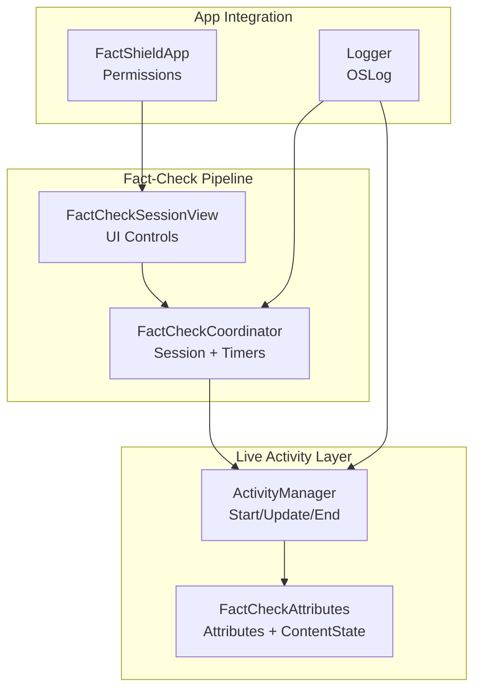
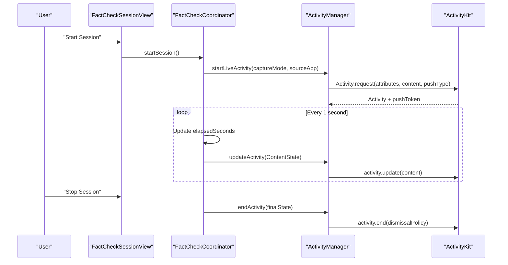
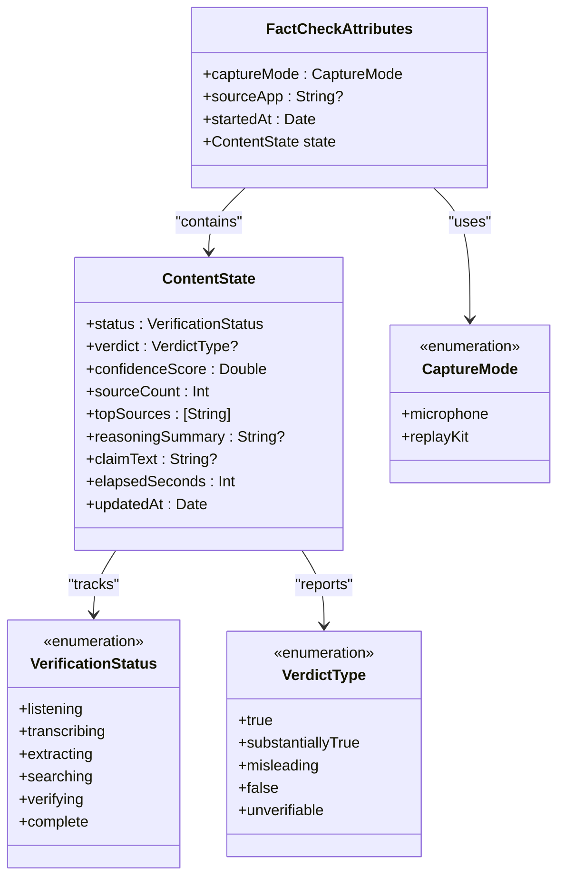
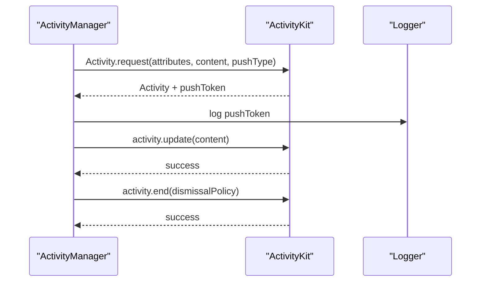
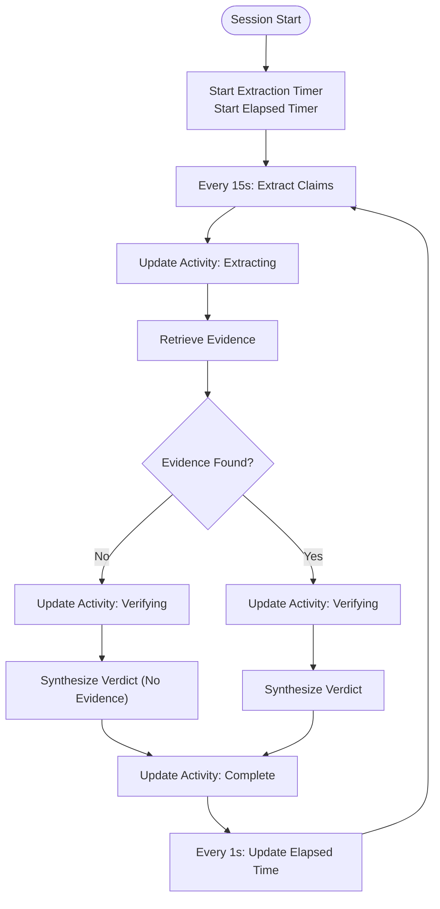
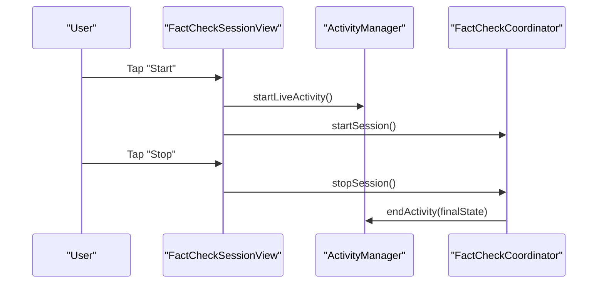
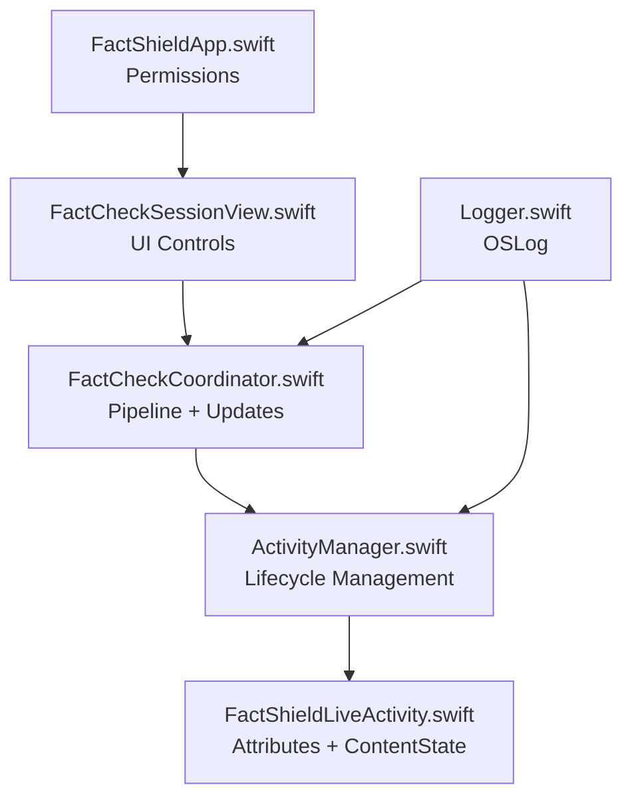

# Dynamic Island Implementation

<cite>
**Referenced Files in This Document**
- [FactShieldLiveActivity.swift](file://FactShield/FactShield/Widgets/FactShieldLiveActivity.swift)
- [ActivityManager.swift](file://FactShield/FactShield/Widgets/ActivityManager.swift)
- [FactCheckCoordinator.swift](file://FactShield/FactShield/Features/FactCheck/FactCheckCoordinator.swift)
- [FactCheckSessionView.swift](file://FactShield/FactShield/Features/FactCheck/FactCheckSessionView.swift)
- [FactShieldApp.swift](file://FactShield/FactShield/App/FactShieldApp.swift)
- [FactShield.entitlements](file://FactShield/FactShield/Resources/FactShield.entitlements)
- [FactShieldBroadcast.entitlements](file://FactShield/FactShield/BroadcastExtension/FactShieldBroadcast.entitlements)
- [Logger.swift](file://FactShield/FactShield/Utilities/Logger.swift)
- [FactShield-iOS-BuildInstructions.md](file://FactShield-iOS-BuildInstructions.md)
- [FactShield-Architecture.md](file://FactShield-Architecture.md)
</cite>

## Table of Contents
1. [Introduction](#introduction)
2. [Project Structure](#project-structure)
3. [Core Components](#core-components)
4. [Architecture Overview](#architecture-overview)
5. [Detailed Component Analysis](#detailed-component-analysis)
6. [Dependency Analysis](#dependency-analysis)
7. [Performance Considerations](#performance-considerations)
8. [Troubleshooting Guide](#troubleshooting-guide)
9. [Conclusion](#conclusion)

## Introduction
This document provides comprehensive documentation for the Dynamic Island implementation using ActivityKit in the FactShield iOS application. It details the Live Activity attributes definition, the ContentState structure, the VerificationStatus and VerdictType enumerations, the ActivityAttributes protocol implementation, content state management, and real-time status updates. It also covers configuration requirements, entitlements setup, and performance optimization strategies for smooth Dynamic Island updates during fact-check sessions.

## Project Structure
The Dynamic Island implementation centers around three primary components:
- Live Activity definition and state model
- Activity lifecycle manager
- Fact-check pipeline coordinator that drives state updates

**Diagram sources**
- [FactShieldLiveActivity.swift:5-43](file://FactShield/FactShield/Widgets/FactShieldLiveActivity.swift#L5-L43)
- [ActivityManager.swift:1-87](file://FactShield/FactShield/Widgets/ActivityManager.swift#L1-L87)
- [FactCheckCoordinator.swift:1-216](file://FactShield/FactShield/Features/FactCheck/FactCheckCoordinator.swift#L1-L216)
- [FactCheckSessionView.swift:1-77](file://FactShield/FactShield/Features/FactCheck/FactCheckSessionView.swift#L1-L77)
- [FactShieldApp.swift:1-127](file://FactShield/FactShield/App/FactShieldApp.swift#L1-L127)
- [Logger.swift:1-18](file://FactShield/FactShield/Utilities/Logger.swift#L1-L18)

**Section sources**
- [FactShieldLiveActivity.swift:5-43](file://FactShield/FactShield/Widgets/FactShieldLiveActivity.swift#L5-L43)
- [ActivityManager.swift:1-87](file://FactShield/FactShield/Widgets/ActivityManager.swift#L1-L87)
- [FactCheckCoordinator.swift:1-216](file://FactShield/FactShield/Features/FactCheck/FactCheckCoordinator.swift#L1-L216)
- [FactCheckSessionView.swift:1-77](file://FactShield/FactShield/Features/FactCheck/FactCheckSessionView.swift#L1-L77)
- [FactShieldApp.swift:1-127](file://FactShield/FactShield/App/FactShieldApp.swift#L1-L127)
- [Logger.swift:1-18](file://FactShield/FactShield/Utilities/Logger.swift#L1-L18)

## Core Components
This section documents the core data structures and enums that define the Live Activity behavior and state updates.

- Live Activity Attributes
  - captureMode: Indicates the audio capture mode used during the session (microphone or system audio).
  - sourceApp: Optional identifier for the app providing the audio source (e.g., Instagram, YouTube, Spotify).
  - startedAt: Timestamp marking the start of the Live Activity.

- ContentState
  - status: Current verification phase (listening, transcribing, extracting, searching, verifying, complete).
  - verdict: Final outcome of the verification (TRUE, SUBSTANTIALLY TRUE, MISLEADING, FALSE, UNVERIFIABLE).
  - confidenceScore: Numerical confidence associated with the verdict (0.0–1.0).
  - sourceCount: Number of sources consulted during verification.
  - topSources: Names of top sources used in verification.
  - reasoningSummary: Brief summary of the reasoning behind the verdict.
  - claimText: The extracted claim being verified.
  - elapsedSeconds: Duration of the session in seconds.
  - updatedAt: Timestamp of the last state update.

- VerificationStatus Enumeration
  - listening: Initial state indicating audio capture is active.
  - transcribing: Audio is being transcribed to text.
  - extracting: Atomic claims are being extracted from the transcript.
  - searching: Evidence is being retrieved from multiple sources.
  - verifying: Retrieved evidence is being cross-checked against the claim.
  - complete: Verification is finished and results are available.

- VerdictType Enumeration
  - true: The claim is accurate and supported by authoritative sources.
  - substantiallyTrue: Mostly accurate with minor omissions or nuances.
  - misleading: Contains elements of truth but is presented in a distorted manner.
  - false: Contradicted by authoritative evidence.
  - unverifiable: Insufficient evidence to confirm or deny the claim.

**Section sources**
- [FactShieldLiveActivity.swift:5-43](file://FactShield/FactShield/Widgets/FactShieldLiveActivity.swift#L5-L43)

## Architecture Overview
The Dynamic Island updates are driven by the FactCheckCoordinator, which periodically constructs a ContentState and delegates updates to ActivityManager. ActivityManager interacts with ActivityKit to request, update, and end the Live Activity.

**Diagram sources**
- [FactCheckSessionView.swift:47-67](file://FactShield/FactShield/Features/FactCheck/FactCheckSessionView.swift#L47-L67)
- [FactCheckCoordinator.swift:38-84](file://FactShield/FactShield/Features/FactCheck/FactCheckCoordinator.swift#L38-L84)
- [ActivityManager.swift:16-67](file://FactShield/FactShield/Widgets/ActivityManager.swift#L16-L67)

## Detailed Component Analysis

### Live Activity Attributes and ContentState
The Live Activity attributes and content state are defined in a single cohesive structure that supports both static metadata and dynamic updates.

**Diagram sources**
- [FactShieldLiveActivity.swift:5-43](file://FactShield/FactShield/Widgets/FactShieldLiveActivity.swift#L5-L43)

**Section sources**
- [FactShieldLiveActivity.swift:5-43](file://FactShield/FactShield/Widgets/FactShieldLiveActivity.swift#L5-L43)

### Activity Lifecycle Management
ActivityManager encapsulates the creation, updating, and termination of the Live Activity, including APNs push token handling and error logging.

**Diagram sources**
- [ActivityManager.swift:16-67](file://FactShield/FactShield/Widgets/ActivityManager.swift#L16-L67)
- [Logger.swift:12](file://FactShield/FactShield/Utilities/Logger.swift#L12)

**Section sources**
- [ActivityManager.swift:1-87](file://FactShield/FactShield/Widgets/ActivityManager.swift#L1-L87)
- [Logger.swift:1-18](file://FactShield/FactShield/Utilities/Logger.swift#L1-L18)

### Fact-Check Coordinator and Real-Time Updates
The FactCheckCoordinator orchestrates the entire verification pipeline and periodically updates the Live Activity with the latest ContentState.

**Diagram sources**
- [FactCheckCoordinator.swift:68-161](file://FactShield/FactShield/Features/FactCheck/FactCheckCoordinator.swift#L68-L161)
- [FactCheckCoordinator.swift:164-201](file://FactShield/FactShield/Features/FactCheck/FactCheckCoordinator.swift#L164-L201)

**Section sources**
- [FactCheckCoordinator.swift:1-216](file://FactShield/FactShield/Features/FactCheck/FactCheckCoordinator.swift#L1-L216)

### UI Integration and Controls
The FactCheckSessionView provides the user interface for starting and stopping sessions and reflects the current state in the Dynamic Island.

**Diagram sources**
- [FactCheckSessionView.swift:47-67](file://FactShield/FactShield/Features/FactCheck/FactCheckSessionView.swift#L47-L67)
- [ActivityManager.swift:59-67](file://FactShield/FactShield/Widgets/ActivityManager.swift#L59-L67)
- [FactCheckCoordinator.swift:57-66](file://FactShield/FactShield/Features/FactCheck/FactCheckCoordinator.swift#L57-L66)

**Section sources**
- [FactCheckSessionView.swift:1-77](file://FactShield/FactShield/Features/FactCheck/FactCheckSessionView.swift#L1-L77)

## Dependency Analysis
The following diagram illustrates the relationships among the key components involved in Dynamic Island updates.

**Diagram sources**
- [FactShieldLiveActivity.swift:5-43](file://FactShield/FactShield/Widgets/FactShieldLiveActivity.swift#L5-L43)
- [ActivityManager.swift:1-87](file://FactShield/FactShield/Widgets/ActivityManager.swift#L1-L87)
- [FactCheckCoordinator.swift:1-216](file://FactShield/FactShield/Features/FactCheck/FactCheckCoordinator.swift#L1-L216)
- [FactCheckSessionView.swift:1-77](file://FactShield/FactShield/Features/FactCheck/FactCheckSessionView.swift#L1-L77)
- [FactShieldApp.swift:1-127](file://FactShield/FactShield/App/FactShieldApp.swift#L1-L127)
- [Logger.swift:1-18](file://FactShield/FactShield/Utilities/Logger.swift#L1-L18)

**Section sources**
- [FactShieldLiveActivity.swift:5-43](file://FactShield/FactShield/Widgets/FactShieldLiveActivity.swift#L5-L43)
- [ActivityManager.swift:1-87](file://FactShield/FactShield/Widgets/ActivityManager.swift#L1-L87)
- [FactCheckCoordinator.swift:1-216](file://FactShield/FactShield/Features/FactCheck/FactCheckCoordinator.swift#L1-L216)
- [FactCheckSessionView.swift:1-77](file://FactShield/FactShield/Features/FactCheck/FactCheckSessionView.swift#L1-L77)
- [FactShieldApp.swift:1-127](file://FactShield/FactShield/App/FactShieldApp.swift#L1-L127)
- [Logger.swift:1-18](file://FactShield/FactShield/Utilities/Logger.swift#L1-L18)

## Performance Considerations
- Update Frequency: The coordinator updates the Live Activity every second for elapsed time and at key stages of the pipeline. This aligns with iOS Live Activity refresh constraints and ensures timely feedback without excessive updates.
- APNs Push Tokens: ActivityManager logs the push token upon starting the Live Activity, enabling push-to-start and push-to-update scenarios as described in the architecture documentation.
- Audio Capture Modes: The implementation supports both microphone-based capture and ReplayKit broadcast extension modes, allowing users to choose the most suitable method for their environment.
- Logging: Centralized logging via OSLog helps diagnose issues and monitor Live Activity lifecycle events.

[No sources needed since this section provides general guidance]

## Troubleshooting Guide
Common issues and their resolutions:
- Live Activities Not Enabled: ActivityManager checks authorization and throws a descriptive error if Live Activities are disabled. Ensure the user grants permission in Settings.
- Already Running: Attempting to start a session when one is already active triggers an error. The UI should prevent overlapping sessions.
- Permission Denial: The app requests microphone permission on launch. If denied, certain features may be unavailable.

**Section sources**
- [ActivityManager.swift:17-20](file://FactShield/FactShield/Widgets/ActivityManager.swift#L17-L20)
- [ActivityManager.swift:70-80](file://FactShield/FactShield/Widgets/ActivityManager.swift#L70-L80)
- [FactShieldApp.swift:18-25](file://FactShield/FactShield/App/FactShieldApp.swift#L18-L25)

## Conclusion
The Dynamic Island implementation leverages ActivityKit to provide real-time feedback during fact-check sessions. The Live Activity attributes and ContentState structure clearly define the session metadata and verification progress. ActivityManager handles the lifecycle, while FactCheckCoordinator orchestrates the pipeline and updates the Live Activity at appropriate intervals. Proper configuration, entitlements, and performance considerations ensure smooth and responsive Dynamic Island updates throughout the user experience.