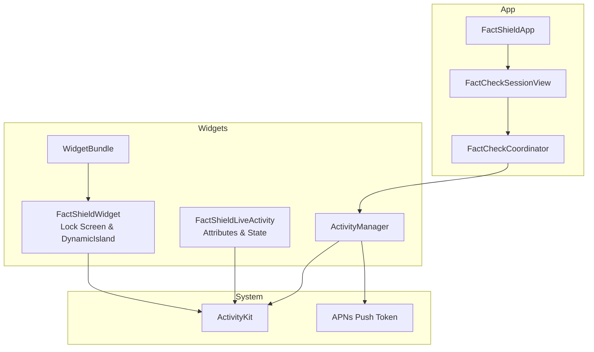
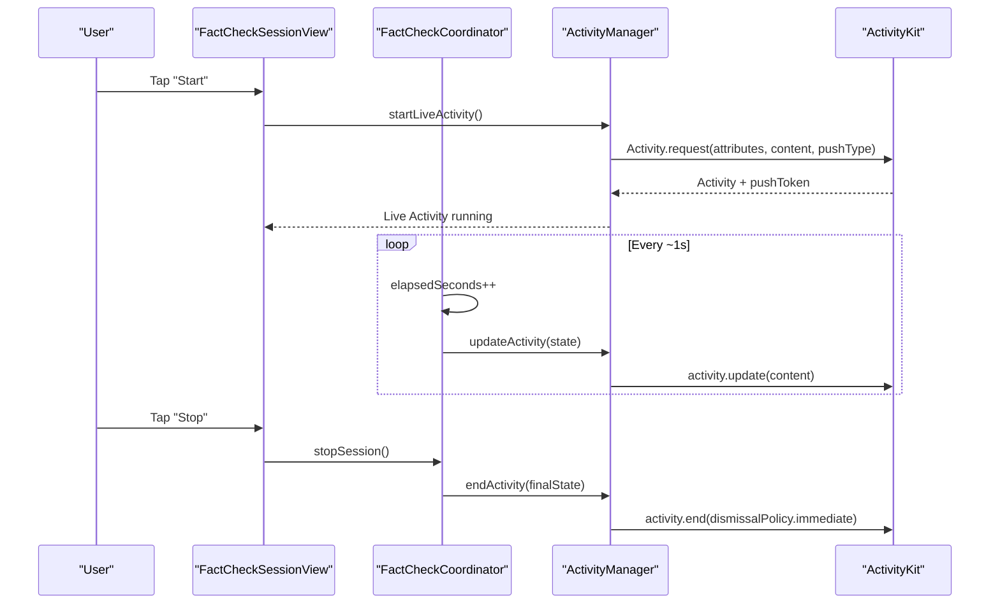
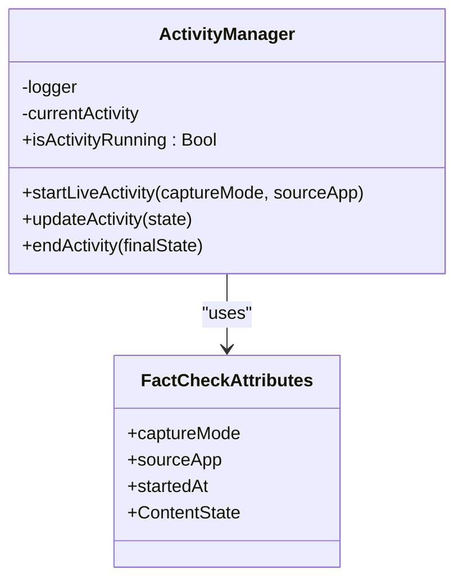
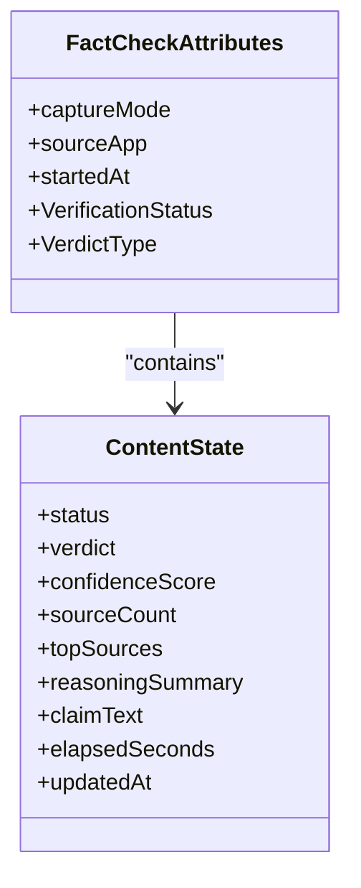
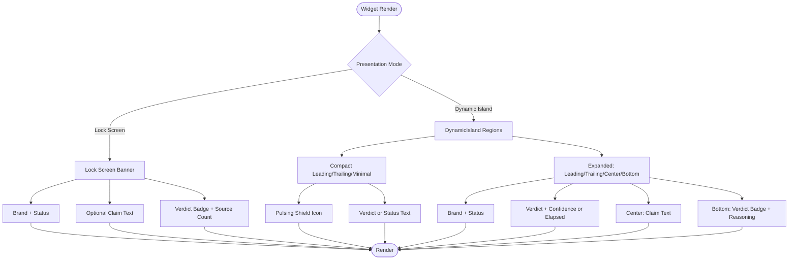
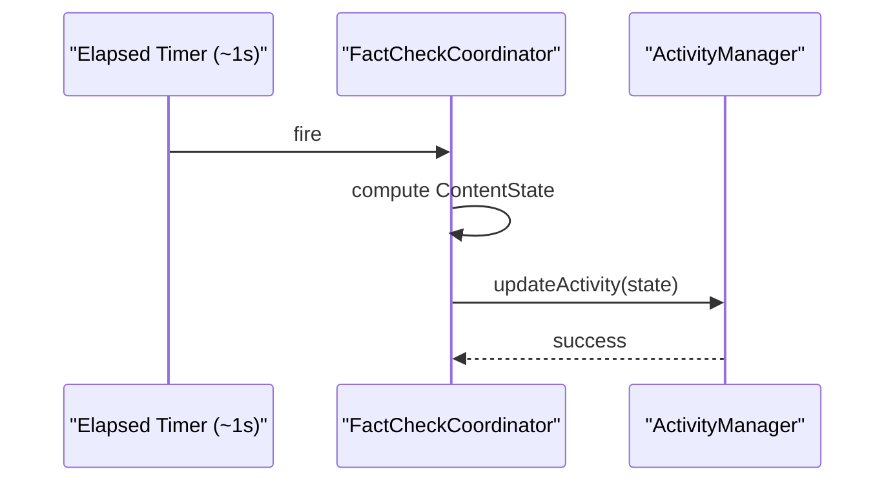
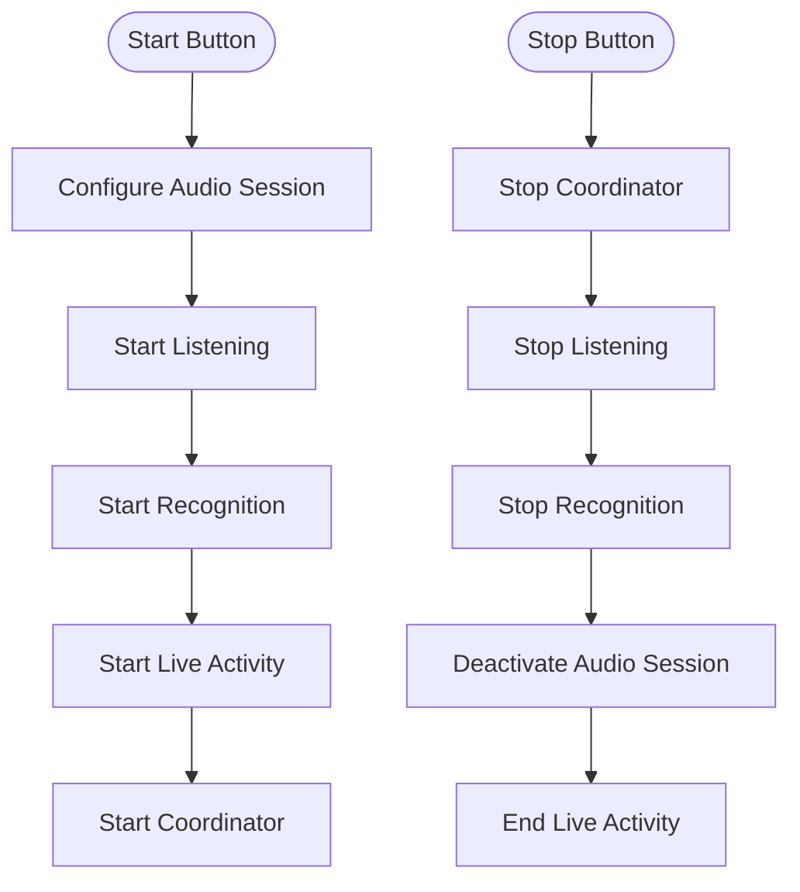
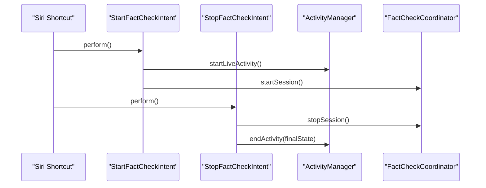
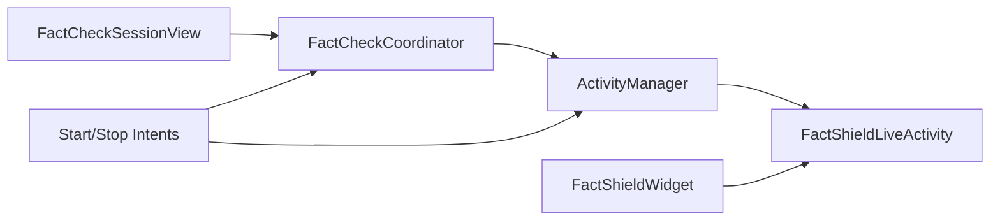

# Live Activity Integration

<cite>
**Referenced Files in This Document**
- [ActivityManager.swift](file://FactShield/FactShield/Widgets/ActivityManager.swift)
- [FactShieldLiveActivity.swift](file://FactShield/FactShield/Widgets/FactShieldLiveActivity.swift)
- [FactShieldWidget.swift](file://FactShield/FactShield/Widgets/FactShieldWidget.swift)
- [WidgetBundle.swift](file://FactShield/FactShield/Widgets/WidgetBundle.swift)
- [FactCheckCoordinator.swift](file://FactShield/FactShield/Features/FactCheck/FactCheckCoordinator.swift)
- [FactCheckSessionView.swift](file://FactShield/FactShield/Features/FactCheck/FactCheckSessionView.swift)
- [FactCheckSession.swift](file://FactShield/FactShield/Models/FactCheckSession.swift)
- [FactShield.entitlements](file://FactShield/FactShield/Resources/FactShield.entitlements)
- [FactShieldBroadcast.entitlements](file://FactShield/FactShield/BroadcastExtension/FactShieldBroadcast.entitlements)
- [FactShieldApp.swift](file://FactShield/FactShield/App/FactShieldApp.swift)
- [Enums.swift](file://FactShield/FactShield/Models/Enums.swift)
- [FactShieldShortcuts.swift](file://FactShield/FactShield/Intents/FactShieldShortcuts.swift)
- [StartFactCheckIntent.swift](file://FactShield/FactShield/Intents/StartFactCheckIntent.swift)
- [StopFactCheckIntent.swift](file://FactShield/FactShield/Intents/StopFactCheckIntent.swift)
</cite>

## Table of Contents
1. [Introduction](#introduction)
2. [Project Structure](#project-structure)
3. [Core Components](#core-components)
4. [Architecture Overview](#architecture-overview)
5. [Detailed Component Analysis](#detailed-component-analysis)
6. [Dependency Analysis](#dependency-analysis)
7. [Performance Considerations](#performance-considerations)
8. [Troubleshooting Guide](#troubleshooting-guide)
9. [Conclusion](#conclusion)
10. [Appendices](#appendices)

## Introduction
This document explains the Live Activity integration in FactChecking Live, focusing on the Dynamic Island implementation using ActivityKit for real-time status display during fact-check sessions. It covers Live Activity setup and management, status display and updates, user interaction handling via widgets, and the ActivityManager role in coordinating updates with the fact-checking process. It also documents configuration requirements, entitlements, performance optimization, examples of status indicators and progress tracking, and troubleshooting techniques.

## Project Structure
The Live Activity implementation spans several modules:
- Widgets: Live Activity attributes, state, and widget definition
- Coordinator: Orchestrates the fact-check pipeline and Live Activity updates
- UI: Session view with controls to start/stop sessions and display progress
- Entitlements: Application group configuration for cross-process sharing
- Intents: Siri Shortcuts to start/stop sessions programmatically

**Diagram sources**
- [FactShieldApp.swift:1-127](file://FactShield/FactShield/App/FactShieldApp.swift#L1-L127)
- [FactCheckSessionView.swift:1-506](file://FactShield/FactShield/Features/FactCheck/FactCheckSessionView.swift#L1-L506)
- [FactCheckCoordinator.swift:1-216](file://FactShield/FactShield/Features/FactCheck/FactCheckCoordinator.swift#L1-L216)
- [ActivityManager.swift:1-87](file://FactShield/FactShield/Widgets/ActivityManager.swift#L1-L87)
- [FactShieldLiveActivity.swift:1-44](file://FactShield/FactShield/Widgets/FactShieldLiveActivity.swift#L1-L44)
- [FactShieldWidget.swift:1-218](file://FactShield/FactShield/Widgets/FactShieldWidget.swift#L1-L218)
- [WidgetBundle.swift:1-10](file://FactShield/FactShield/Widgets/WidgetBundle.swift#L1-L10)

**Section sources**
- [FactShieldApp.swift:1-127](file://FactShield/FactShield/App/FactShieldApp.swift#L1-L127)
- [FactCheckSessionView.swift:1-506](file://FactShield/FactShield/Features/FactCheck/FactCheckSessionView.swift#L1-L506)
- [FactCheckCoordinator.swift:1-216](file://FactShield/FactShield/Features/FactCheck/FactCheckCoordinator.swift#L1-L216)
- [ActivityManager.swift:1-87](file://FactShield/FactShield/Widgets/ActivityManager.swift#L1-L87)
- [FactShieldLiveActivity.swift:1-44](file://FactShield/FactShield/Widgets/FactShieldLiveActivity.swift#L1-L44)
- [FactShieldWidget.swift:1-218](file://FactShield/FactShield/Widgets/FactShieldWidget.swift#L1-L218)
- [WidgetBundle.swift:1-10](file://FactShield/FactShield/Widgets/WidgetBundle.swift#L1-L10)

## Core Components
- ActivityManager: Manages Live Activity lifecycle (start/update/end), validates permissions, logs push tokens, and ensures thread safety.
- FactShieldLiveActivity: Defines Activity attributes and state for Live Activity, including verification status, verdict, confidence, sources, reasoning summary, claim text, elapsed time, and timestamps.
- FactShieldWidget: Implements the Live Activity widget with lock screen banner and Dynamic Island layouts (compact/minimal and expanded regions).
- FactCheckCoordinator: Drives the fact-check pipeline, periodically updates Live Activity state, and coordinates service orchestration.
- FactCheckSessionView: Provides UI controls to start/stop sessions and displays runtime metrics.
- Entitlements: Configure application groups for shared resources.
- Intents: Siri Shortcuts to start/stop sessions and trigger Live Activity updates.

**Section sources**
- [ActivityManager.swift:1-87](file://FactShield/FactShield/Widgets/ActivityManager.swift#L1-L87)
- [FactShieldLiveActivity.swift:1-44](file://FactShield/FactShield/Widgets/FactShieldLiveActivity.swift#L1-L44)
- [FactShieldWidget.swift:1-218](file://FactShield/FactShield/Widgets/FactShieldWidget.swift#L1-L218)
- [FactCheckCoordinator.swift:1-216](file://FactShield/FactShield/Features/FactCheck/FactCheckCoordinator.swift#L1-L216)
- [FactCheckSessionView.swift:1-506](file://FactShield/FactShield/Features/FactCheck/FactCheckSessionView.swift#L1-L506)
- [FactShield.entitlements:1-11](file://FactShield/FactShield/Resources/FactShield.entitlements#L1-L11)
- [FactShieldBroadcast.entitlements:1-11](file://FactShield/FactShield/BroadcastExtension/FactShieldBroadcast.entitlements#L1-L11)
- [StartFactCheckIntent.swift:1270-1301](file://FactShield/FactShield/Intents/StartFactCheckIntent.swift#L1270-L1301)
- [StopFactCheckIntent.swift:1303-1347](file://FactShield/FactShield/Intents/StopFactCheckIntent.swift#L1303-L1347)

## Architecture Overview
The Live Activity architecture integrates UI, coordinator, and ActivityKit:
- UI triggers start/stop actions.
- Coordinator orchestrates services and schedules periodic updates.
- ActivityManager requests, updates, and ends the Live Activity.
- FactShieldWidget renders lock screen and Dynamic Island views.
- Intents enable quick start/stop from Siri Shortcuts.

**Diagram sources**
- [FactCheckSessionView.swift:47-67](file://FactShield/FactShield/Features/FactCheck/FactCheckSessionView.swift#L47-L67)
- [FactCheckCoordinator.swift:76-84](file://FactShield/FactShield/Features/FactCheck/FactCheckCoordinator.swift#L76-L84)
- [ActivityManager.swift:15-48](file://FactShield/FactShield/Widgets/ActivityManager.swift#L15-L48)
- [ActivityManager.swift:50-67](file://FactShield/FactShield/Widgets/ActivityManager.swift#L50-L67)

## Detailed Component Analysis

### ActivityManager
Responsibilities:
- Validate Live Activity authorization.
- Create Activity with initial attributes and state.
- Update Live Activity content on the main actor.
- End Live Activity with dismissal policy.
- Log push token for diagnostics.

Key behaviors:
- Uses Activity.request with pushType set to enable APNs push updates.
- Guards against concurrent runs and missing permissions.
- Emits structured logs for lifecycle events.

**Diagram sources**
- [ActivityManager.swift:4-68](file://FactShield/FactShield/Widgets/ActivityManager.swift#L4-L68)
- [FactShieldLiveActivity.swift:5-43](file://FactShield/FactShield/Widgets/FactShieldLiveActivity.swift#L5-L43)

**Section sources**
- [ActivityManager.swift:1-87](file://FactShield/FactShield/Widgets/ActivityManager.swift#L1-L87)

### FactShieldLiveActivity Attributes and State
Defines the schema for Live Activity:
- Attributes: capture mode, source app, startedAt.
- ContentState: status, verdict, confidenceScore, sourceCount, topSources, reasoningSummary, claimText, elapsedSeconds, updatedAt.

Status and verdict enumerations:
- VerificationStatus: Listening, Transcribing, Extracting, Searching, Verifying, Complete.
- VerdictType: True, SubstantiallyTrue, Misleading, False, Unverifiable.

**Diagram sources**
- [FactShieldLiveActivity.swift:5-43](file://FactShield/FactShield/Widgets/FactShieldLiveActivity.swift#L5-L43)

**Section sources**
- [FactShieldLiveActivity.swift:1-44](file://FactShield/FactShield/Widgets/FactShieldLiveActivity.swift#L1-L44)

### FactShieldWidget: Lock Screen and Dynamic Island
Widget configuration:
- Lock screen banner: App branding, status, optional claim text, verdict badge, and source count.
- Dynamic Island:
  - Compact leading/trailing minimal views.
  - Expanded regions: leading (brand + status), trailing (verdict/confidence or elapsed), center (claim text), bottom (verdict badge + reasoning summary).
- Helper views: VerdictBadge with color-coded verdict and confidence percentage.

Layout customization:
- Uses SwiftUI modifiers for pulse animation on non-complete statuses.
- Applies color scales for status and verdict.

**Diagram sources**
- [FactShieldWidget.swift:5-33](file://FactShield/FactShield/Widgets/FactShieldWidget.swift#L5-L33)
- [FactShieldWidget.swift:35-68](file://FactShield/FactShield/Widgets/FactShieldWidget.swift#L35-L68)
- [FactShieldWidget.swift:70-98](file://FactShield/FactShield/Widgets/FactShieldWidget.swift#L70-L98)
- [FactShieldWidget.swift:100-162](file://FactShield/FactShield/Widgets/FactShieldWidget.swift#L100-L162)
- [FactShieldWidget.swift:187-217](file://FactShield/FactShield/Widgets/FactShieldWidget.swift#L187-L217)

**Section sources**
- [FactShieldWidget.swift:1-218](file://FactShield/FactShield/Widgets/FactShieldWidget.swift#L1-L218)

### FactCheckCoordinator: Pipeline and Updates
Responsibilities:
- Manage audio capture, speech recognition, claim extraction, evidence retrieval, and verdict synthesis.
- Drive periodic updates to Live Activity state.
- Maintain elapsed time and session metadata.

Update mechanism:
- On each tick, constructs ContentState from current pipeline state and delegates to ActivityManager.
- During processing stages, updates status accordingly (e.g., Extracting, Searching, Verifying, Complete).

**Diagram sources**
- [FactCheckCoordinator.swift:76-84](file://FactShield/FactShield/Features/FactCheck/FactCheckCoordinator.swift#L76-L84)
- [FactCheckCoordinator.swift:187-201](file://FactShield/FactShield/Features/FactCheck/FactCheckCoordinator.swift#L187-L201)
- [ActivityManager.swift:50-57](file://FactShield/FactShield/Widgets/ActivityManager.swift#L50-L57)

**Section sources**
- [FactCheckCoordinator.swift:1-216](file://FactShield/FactShield/Features/FactCheck/FactCheckCoordinator.swift#L1-L216)

### FactCheckSessionView: Controls and Metrics
Responsibilities:
- Start/stop controls that initialize audio services, launch Live Activity, and coordinate the pipeline.
- Status card showing active/inactive state, elapsed time, and claim counts.
- Navigation to detailed views and history.

User interaction:
- Start button configures audio session, starts listening/recognition, launches Live Activity, and begins the coordinator.
- Stop button halts the pipeline, stops audio services, and ends Live Activity.

**Diagram sources**
- [FactCheckSessionView.swift:47-67](file://FactShield/FactShield/Features/FactCheck/FactCheckSessionView.swift#L47-L67)
- [FactCheckSessionView.swift:79-125](file://FactShield/FactShield/Features/FactCheck/FactCheckSessionView.swift#L79-L125)

**Section sources**
- [FactCheckSessionView.swift:1-506](file://FactShield/FactShield/Features/FactCheck/FactCheckSessionView.swift#L1-L506)

### Intents: Siri Shortcuts Integration
- StartFactCheckIntent: Configures audio session, starts listening/recognition, launches Live Activity, and starts the coordinator.
- StopFactCheckIntent: Stops the coordinator and services, computes final state, and ends Live Activity.

**Diagram sources**
- [StartFactCheckIntent.swift:1281-1299](file://FactShield/FactShield/Intents/StartFactCheckIntent.swift#L1281-L1299)
- [StopFactCheckIntent.swift:1313-1346](file://FactShield/FactShield/Intents/StopFactCheckIntent.swift#L1313-L1346)
- [ActivityManager.swift:15-48](file://FactShield/FactShield/Widgets/ActivityManager.swift#L15-L48)
- [ActivityManager.swift:59-67](file://FactShield/FactShield/Widgets/ActivityManager.swift#L59-L67)

**Section sources**
- [StartFactCheckIntent.swift:1270-1301](file://FactShield/FactShield/Intents/StartFactCheckIntent.swift#L1270-L1301)
- [StopFactCheckIntent.swift:1303-1347](file://FactShield/FactShield/Intents/StopFactCheckIntent.swift#L1303-L1347)

## Dependency Analysis
- FactCheckCoordinator depends on ActivityManager for Live Activity updates.
- UI invokes ActivityManager and Coordinator methods.
- Widget depends on Activity attributes/state definitions.
- Intents depend on ActivityManager and Coordinator.

**Diagram sources**
- [FactCheckSessionView.swift:3-6](file://FactShield/FactShield/Features/FactCheck/FactCheckSessionView.swift#L3-L6)
- [FactCheckCoordinator.swift:17](file://FactShield/FactShield/Features/FactCheck/FactCheckCoordinator.swift#L17)
- [ActivityManager.swift:9](file://FactShield/FactShield/Widgets/ActivityManager.swift#L9)
- [FactShieldLiveActivity.swift:5-43](file://FactShield/FactShield/Widgets/FactShieldLiveActivity.swift#L5-L43)
- [FactShieldWidget.swift:5-33](file://FactShield/FactShield/Widgets/FactShieldWidget.swift#L5-L33)
- [StartFactCheckIntent.swift:1281-1299](file://FactShield/FactShield/Intents/StartFactCheckIntent.swift#L1281-L1299)
- [StopFactCheckIntent.swift:1313-1346](file://FactShield/FactShield/Intents/StopFactCheckIntent.swift#L1313-L1346)

**Section sources**
- [FactCheckCoordinator.swift:1-216](file://FactShield/FactShield/Features/FactCheck/FactCheckCoordinator.swift#L1-L216)
- [ActivityManager.swift:1-87](file://FactShield/FactShield/Widgets/ActivityManager.swift#L1-L87)
- [FactShieldWidget.swift:1-218](file://FactShield/FactShield/Widgets/FactShieldWidget.swift#L1-L218)
- [StartFactCheckIntent.swift:1270-1301](file://FactShield/FactShield/Intents/StartFactCheckIntent.swift#L1270-L1301)
- [StopFactCheckIntent.swift:1303-1347](file://FactShield/FactShield/Intents/StopFactCheckIntent.swift#L1303-L1347)

## Performance Considerations
- Update cadence: The coordinator updates Live Activity approximately every second. This balances responsiveness with battery usage. Adjust the timer interval thoughtfully to avoid excessive updates.
- Data binding: Keep ContentState lightweight and avoid heavy computations on the main actor when preparing updates.
- Logging: ActivityManager logs push tokens and lifecycle events to aid diagnostics without impacting UI performance.
- Widget rendering: Use compact and minimal Dynamic Island layouts for efficient rendering on small screens.
- APNs push: Enabling pushType reduces latency for remote updates but requires proper server-side configuration.

[No sources needed since this section provides general guidance]

## Troubleshooting Guide
Common issues and resolutions:
- Live Activities not enabled: ActivityManager throws a specific error when activities are disabled. Ensure the user grants permission in Settings.
- Permission errors: Verify microphone and speech recognition permissions are granted before starting sessions.
- No updates in Dynamic Island: Confirm the coordinator is updating state and ActivityManager is receiving updates on the main actor.
- Widget not appearing: Ensure the widget bundle registers the Live Activity widget and that the app is built with the correct target membership.
- Entitlement misconfiguration: Verify application group entitlements match between the app and extensions.

Diagnostics:
- Review ActivityManager logs for push token and lifecycle events.
- Inspect FactShieldError enumeration for categorized errors during Live Activity operations.

**Section sources**
- [ActivityManager.swift:17-20](file://FactShield/FactShield/Widgets/ActivityManager.swift#L17-L20)
- [ActivityManager.swift:70-80](file://FactShield/FactShield/Widgets/ActivityManager.swift#L70-L80)
- [Enums.swift:25-47](file://FactShield/FactShield/Models/Enums.swift#L25-L47)

## Conclusion
The Live Activity integration leverages ActivityKit to deliver a real-time, always-on view of the fact-checking process in the Dynamic Island and lock screen. ActivityManager centralizes lifecycle management, while FactCheckCoordinator continuously updates the display with status, verdict, confidence, and elapsed time. The widget provides flexible layouts for different interaction modes, and Intents enable quick start/stop from Siri. Proper entitlements and careful update scheduling ensure reliability and performance.

[No sources needed since this section summarizes without analyzing specific files]

## Appendices

### Configuration Requirements and Entitlements
- Application Group: Both the main app and broadcast extension share a group identifier to enable cross-process communication.
- Build Targets: Ensure the Live Activity widget target is included and registered in the WidgetBundle.

**Section sources**
- [FactShield.entitlements:5-8](file://FactShield/FactShield/Resources/FactShield.entitlements#L5-L8)
- [FactShieldBroadcast.entitlements:5-8](file://FactShield/FactShield/BroadcastExtension/FactShieldBroadcast.entitlements#L5-L8)
- [WidgetBundle.swift:5-8](file://FactShield/FactShield/Widgets/WidgetBundle.swift#L5-L8)

### Example Status Indicators and Progress Tracking
- Status indicators: Use VerificationStatus to reflect current stage (Listening, Transcribing, Extracting, Searching, Verifying, Complete).
- Progress tracking: Display elapsedSeconds and optionally monospaced digits in the trailing Dynamic Island region.
- Verdict badges: Show verdict type and confidence percentage for completed verifications.

**Section sources**
- [FactShieldLiveActivity.swift:27-34](file://FactShield/FactShield/Widgets/FactShieldLiveActivity.swift#L27-L34)
- [FactShieldWidget.swift:113-127](file://FactShield/FactShield/Widgets/FactShieldWidget.swift#L113-L127)
- [FactShieldWidget.swift:165-184](file://FactShield/FactShield/Widgets/FactShieldWidget.swift#L165-L184)

### User Engagement Patterns
- Tap to expand: Users can press Dynamic Island to reveal expanded regions with richer details.
- Minimal view: Compact minimal layout keeps essential cues visible without clutter.
- Lock screen banner: Provides immediate context and status at a glance.

**Section sources**
- [FactShieldWidget.swift:25-31](file://FactShield/FactShield/Widgets/FactShieldWidget.swift#L25-L31)
- [FactShieldWidget.swift:92-98](file://FactShield/FactShield/Widgets/FactShieldWidget.swift#L92-L98)
- [FactShieldWidget.swift:35-68](file://FactShield/FactShield/Widgets/FactShieldWidget.swift#L35-L68)