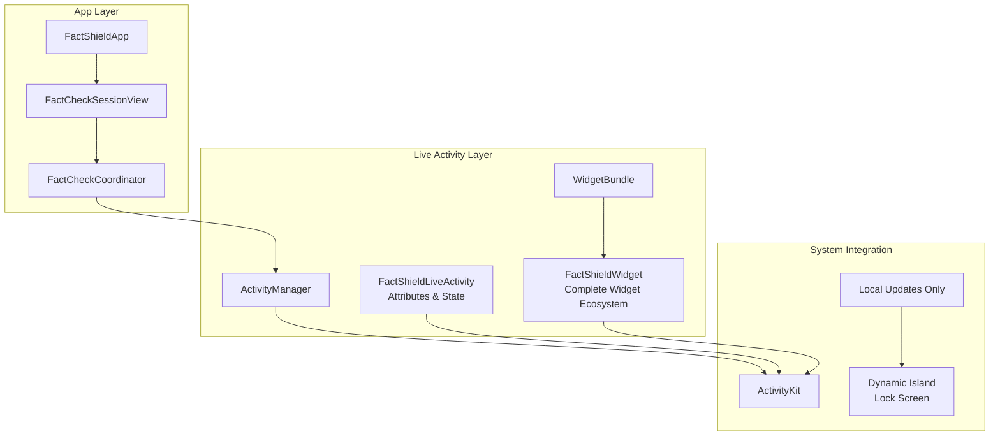
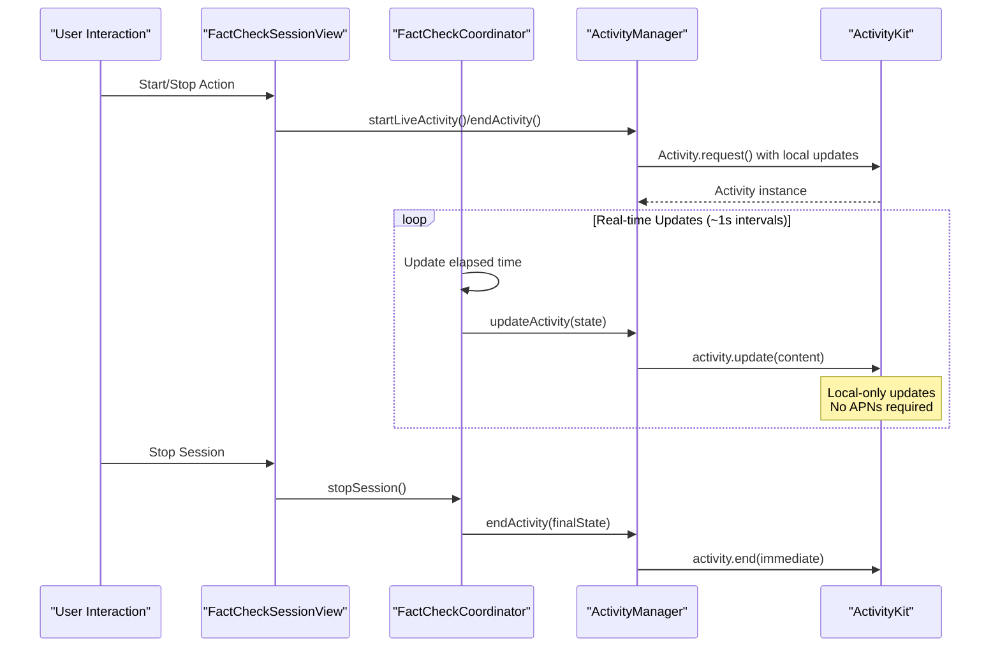
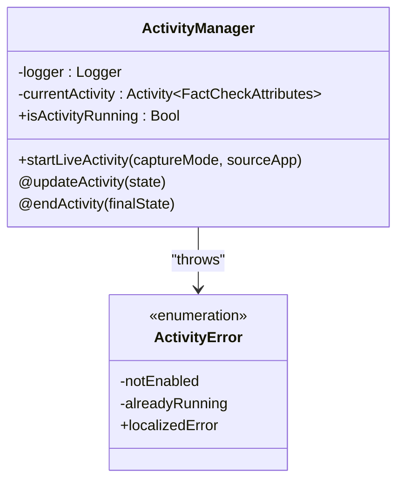
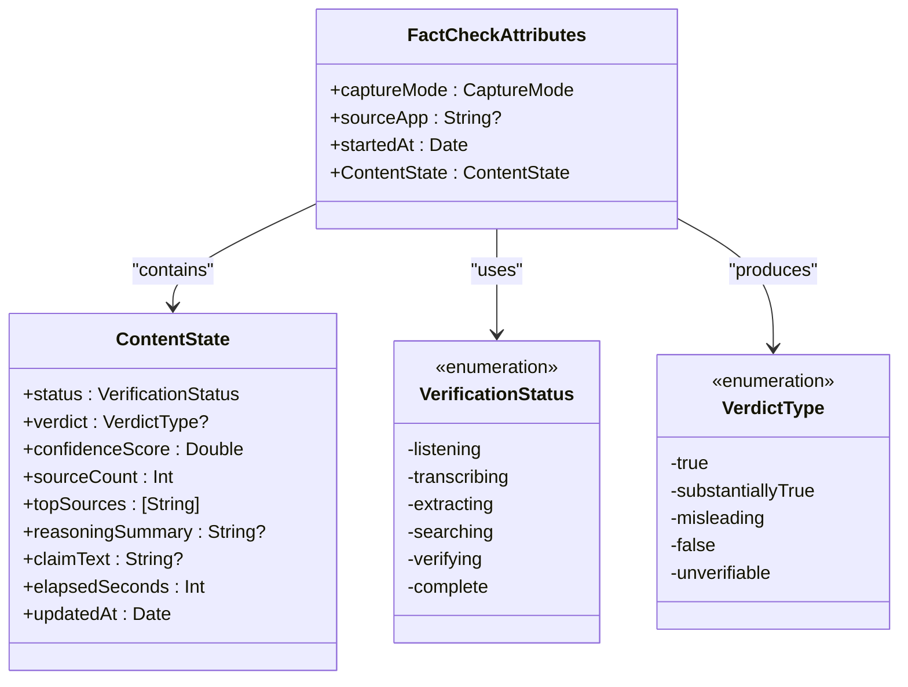
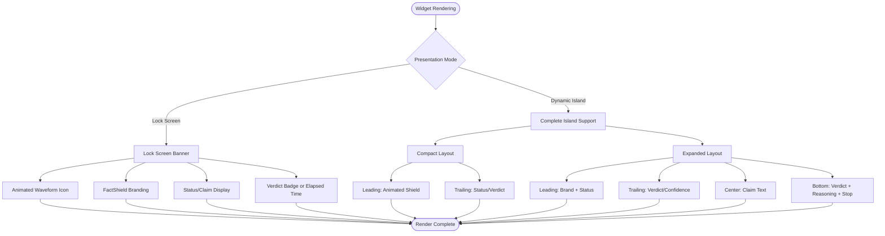
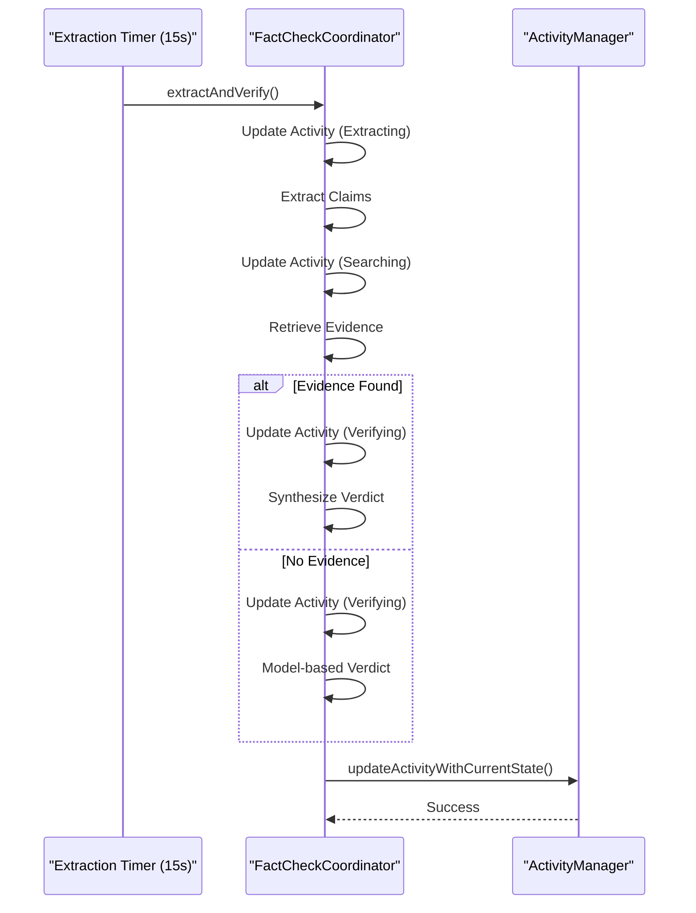
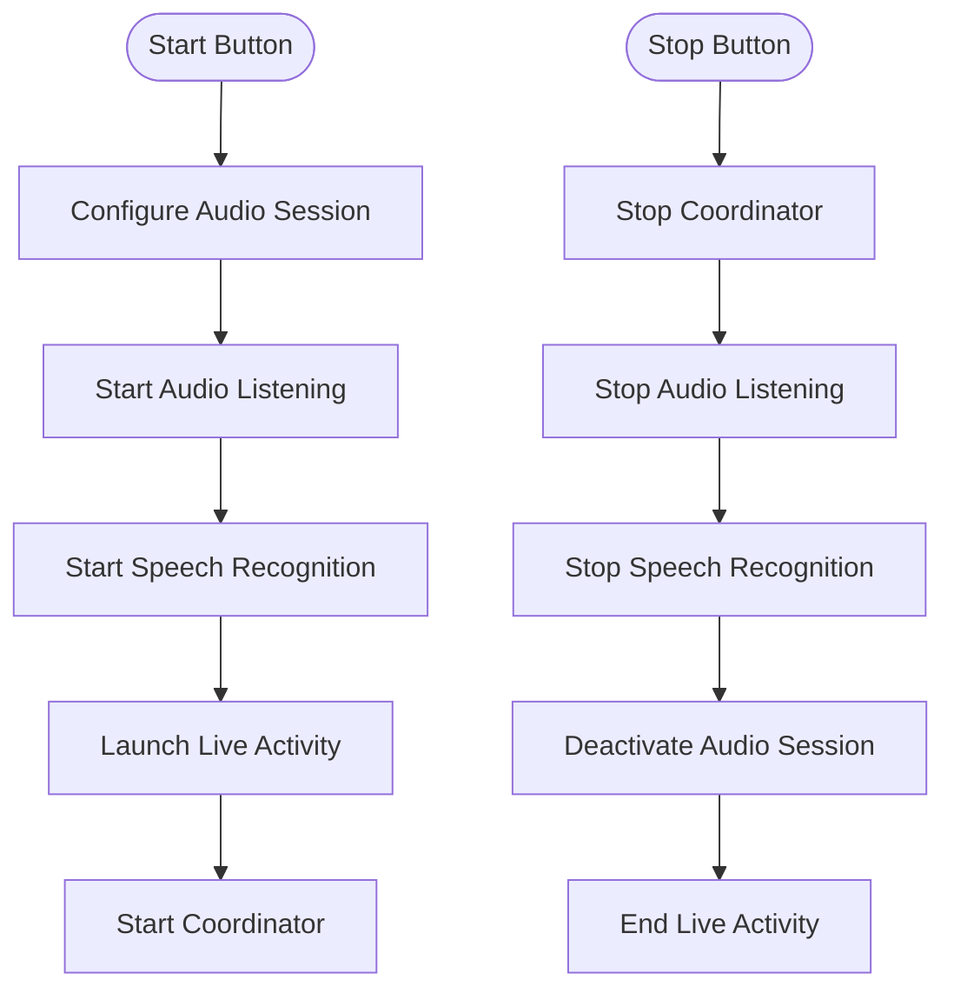
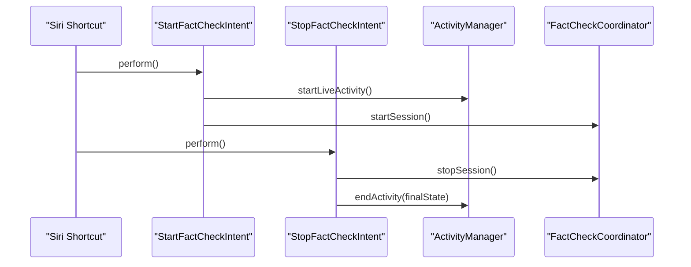
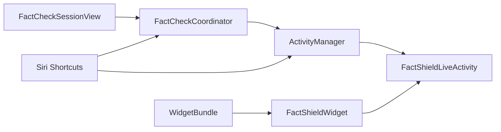

# Live Activity Integration

<cite>
**Referenced Files in This Document**
- [ActivityManager.swift](file://FactShield/FactShield/Widgets/ActivityManager.swift)
- [FactShieldLiveActivity.swift](file://FactShield/FactShield/Widgets/FactShieldLiveActivity.swift)
- [FactShieldWidget.swift](file://FactShield/FactShield/Widgets/FactShieldWidget.swift)
- [WidgetBundle.swift](file://FactShield/FactShield/Widgets/WidgetBundle.swift)
- [FactShieldWidgetsBundle.swift](file://Xcode/FactShield/FactShieldWidgets/FactShieldWidgetsBundle.swift)
- [FactCheckCoordinator.swift](file://FactShield/FactShield/Features/FactCheck/FactCheckCoordinator.swift)
- [FactCheckSessionView.swift](file://FactShield/FactShield/Features/FactCheck/FactCheckSessionView.swift)
- [FactCheckSession.swift](file://FactShield/FactShield/Models/FactCheckSession.swift)
- [FactShield.entitlements](file://FactShield/FactShield/Resources/FactShield.entitlements)
- [FactShieldBroadcast.entitlements](file://FactShield/FactShield/BroadcastExtension/FactShieldBroadcast.entitlements)
- [FactShieldApp.swift](file://FactShield/FactShield/App/FactShieldApp.swift)
- [Enums.swift](file://FactShield/FactShield/Models/Enums.swift)
- [FactShieldShortcuts.swift](file://FactShield/FactShield/Intents/FactShieldShortcuts.swift)
- [StartFactCheckIntent.swift](file://FactShield/FactShield/Intents/StartFactCheckIntent.swift)
- [StopFactCheckIntent.swift](file://FactShield/FactShield/Intents/StopFactCheckIntent.swift)
</cite>

## Update Summary
**Changes Made**
- Updated ActivityManager to use local-only Live Activity updates (pushType: nil) instead of APNs-based push notifications
- Enhanced FactCheckCoordinator with comprehensive real-time status updates and progress tracking
- Expanded FactShieldWidget with complete Dynamic Island implementation including expanded regions and stop button
- Added comprehensive widget ecosystem with lock screen banner and Dynamic Island presentations
- Implemented ActivityManager error handling with structured logging and diagnostic support
- Enhanced Intents integration with proper Live Activity coordination

## Table of Contents
1. [Introduction](#introduction)
2. [Project Structure](#project-structure)
3. [Core Components](#core-components)
4. [Architecture Overview](#architecture-overview)
5. [Detailed Component Analysis](#detailed-component-analysis)
6. [Dependency Analysis](#dependency-analysis)
7. [Performance Considerations](#performance-considerations)
8. [Troubleshooting Guide](#troubleshooting-guide)
9. [Conclusion](#conclusion)
10. [Appendices](#appendices)

## Introduction
This document explains the Live Activity integration in FactChecking Live, focusing on the complete implementation using ActivityKit for real-time status display during fact-check sessions. The system features comprehensive Live Activity management with FactCheckCoordinator orchestration, real-time status updates, and a complete widget ecosystem including lock screen banners and Dynamic Island presentations. The implementation provides always-on visibility of the fact-checking process with animated feedback, progress tracking, and user interaction capabilities.

## Project Structure
The Live Activity implementation spans multiple modules with a comprehensive widget ecosystem:
- Widgets: Live Activity attributes, state management, and complete widget implementations
- Coordinator: Central orchestration of the fact-check pipeline with real-time updates
- UI: Interactive session view with controls and progress visualization
- Entitlements: Application group configuration for cross-process resource sharing
- Intents: Siri Shortcuts integration for hands-free control

**Diagram sources**
- [FactShieldApp.swift:1-127](file://FactShield/FactShield/App/FactShieldApp.swift#L1-L127)
- [FactCheckSessionView.swift:1-506](file://FactShield/FactShield/Features/FactCheck/FactCheckSessionView.swift#L1-L506)
- [FactCheckCoordinator.swift:1-216](file://FactShield/FactShield/Features/FactCheck/FactCheckCoordinator.swift#L1-L216)
- [ActivityManager.swift:1-87](file://FactShield/FactShield/Widgets/ActivityManager.swift#L1-L87)
- [FactShieldLiveActivity.swift:1-46](file://FactShield/FactShield/Widgets/FactShieldLiveActivity.swift#L1-L46)
- [FactShieldWidget.swift:1-466](file://FactShield/FactShield/Widgets/FactShieldWidget.swift#L1-L466)
- [WidgetBundle.swift:1-6](file://FactShield/FactShield/Widgets/WidgetBundle.swift#L1-L6)

**Section sources**
- [FactShieldApp.swift:1-127](file://FactShield/FactShield/App/FactShieldApp.swift#L1-L127)
- [FactCheckSessionView.swift:1-506](file://FactShield/FactShield/Features/FactCheck/FactCheckSessionView.swift#L1-L506)
- [FactCheckCoordinator.swift:1-216](file://FactShield/FactShield/Features/FactCheck/FactCheckCoordinator.swift#L1-L216)
- [ActivityManager.swift:1-87](file://FactShield/FactShield/Widgets/ActivityManager.swift#L1-L87)
- [FactShieldLiveActivity.swift:1-46](file://FactShield/FactShield/Widgets/FactShieldLiveActivity.swift#L1-L46)
- [FactShieldWidget.swift:1-466](file://FactShield/FactShield/Widgets/FactShieldWidget.swift#L1-L466)
- [WidgetBundle.swift:1-6](file://FactShield/FactShield/Widgets/WidgetBundle.swift#L1-L6)

## Core Components
- **ActivityManager**: Central Live Activity lifecycle manager with thread-safe operations, error handling, and structured logging for diagnostics
- **FactShieldLiveActivity**: Complete Activity attributes and state definition with comprehensive verification status tracking and verdict types
- **FactShieldWidget**: Full widget ecosystem supporting lock screen banners, Dynamic Island compact and expanded layouts, and interactive stop controls
- **FactCheckCoordinator**: Advanced orchestration engine driving the fact-check pipeline with real-time updates and comprehensive progress tracking
- **Enhanced UI**: Interactive session view with animated status indicators and comprehensive progress visualization
- **Complete Entitlements**: Proper application group configuration for seamless cross-process resource sharing
- **Intents Integration**: Comprehensive Siri Shortcuts support for hands-free Live Activity control

**Section sources**
- [ActivityManager.swift:1-87](file://FactShield/FactShield/Widgets/ActivityManager.swift#L1-L87)
- [FactShieldLiveActivity.swift:1-46](file://FactShield/FactShield/Widgets/FactShieldLiveActivity.swift#L1-L46)
- [FactShieldWidget.swift:1-466](file://FactShield/FactShield/Widgets/FactShieldWidget.swift#L1-L466)
- [FactCheckCoordinator.swift:1-216](file://FactShield/FactShield/Features/FactCheck/FactCheckCoordinator.swift#L1-L216)
- [FactCheckSessionView.swift:1-506](file://FactShield/FactShield/Features/FactCheck/FactCheckSessionView.swift#L1-L506)
- [FactShield.entitlements:1-11](file://FactShield/FactShield/Resources/FactShield.entitlements#L1-L11)
- [FactShieldBroadcast.entitlements:1-11](file://FactShield/FactShield/BroadcastExtension/FactShieldBroadcast.entitlements#L1-L11)
- [StartFactCheckIntent.swift:1-29](file://FactShield/FactShield/Intents/StartFactCheckIntent.swift#L1-L29)
- [StopFactCheckIntent.swift:1-43](file://FactShield/FactShield/Intents/StopFactCheckIntent.swift#L1-L43)

## Architecture Overview
The Live Activity architecture implements a sophisticated real-time monitoring system with comprehensive widget support:
- User interactions trigger coordinated start/stop sequences across all components
- FactCheckCoordinator manages the complete fact-check pipeline with periodic updates
- ActivityManager handles Live Activity lifecycle with robust error handling
- FactShieldWidget provides complete presentation layer with Dynamic Island and lock screen support
- Intents enable hands-free operation through Siri Shortcuts integration

**Diagram sources**
- [FactCheckSessionView.swift:47-75](file://FactShield/FactShield/Features/FactCheck/FactCheckSessionView.swift#L47-L75)
- [FactCheckCoordinator.swift:76-84](file://FactShield/FactShield/Features/FactCheck/FactCheckCoordinator.swift#L76-L84)
- [ActivityManager.swift:15-67](file://FactShield/FactShield/Widgets/ActivityManager.swift#L15-L67)
- [StartFactCheckIntent.swift:10-27](file://FactShield/FactShield/Intents/StartFactCheckIntent.swift#L10-L27)
- [StopFactCheckIntent.swift:9-41](file://FactShield/FactShield/Intents/StopFactCheckIntent.swift#L9-L41)

## Detailed Component Analysis

### ActivityManager: Centralized Live Activity Management
The ActivityManager serves as the single point of control for all Live Activity operations with comprehensive error handling and logging:

**Key Responsibilities:**
- Validate Live Activity authorization status before initialization
- Create Activity instances with proper attributes and initial state
- Execute thread-safe updates using MainActor isolation
- Handle graceful termination with dismissal policies
- Provide structured logging for diagnostic purposes

**Enhanced Features:**
- Local-only updates using pushType: nil for improved performance
- Comprehensive error categorization with localized descriptions
- Structured logging with subsystem and category organization
- Thread-safe operations with proper async/await patterns

**Diagram sources**
- [ActivityManager.swift:4-68](file://FactShield/FactShield/Widgets/ActivityManager.swift#L4-L68)
- [ActivityManager.swift:70-86](file://FactShield/FactShield/Widgets/ActivityManager.swift#L70-L86)

**Section sources**
- [ActivityManager.swift:1-87](file://FactShield/FactShield/Widgets/ActivityManager.swift#L1-L87)

### FactShieldLiveActivity: Complete Data Model Definition
The Live Activity data model defines the complete schema for real-time status display:

**Attributes Structure:**
- **CaptureMode**: Microphone or System Audio capture modes
- **SourceApp**: Optional source application identification
- **StartedAt**: Session initiation timestamp

**ContentState Schema:**
- **Status**: Complete verification workflow tracking
- **Verdict**: Final determination with confidence scoring
- **ConfidenceScore**: Numerical confidence assessment (0.0-1.0)
- **SourceCount**: Evidence source aggregation
- **TopSources**: Ranked evidence sources
- **ReasoningSummary**: Concise explanation of findings
- **ClaimText**: Extracted claim being verified
- **ElapsedSeconds**: Session duration tracking
- **UpdatedAt**: Last update timestamp

**Status Workflow:**
- listening: Initial audio capture phase
- transcribing: Speech-to-text conversion
- extracting: Claim identification and validation
- searching: Evidence retrieval from sources
- verifying: Cross-verification and analysis
- complete: Final determination with results

**Verdict Types:**
- true: Factually correct statements
- substantiallyTrue: Mostly accurate with minor inaccuracies
- misleading: Potentially harmful misinformation
- false: Completely incorrect statements
- unverifiable: Insufficient evidence for determination

**Diagram sources**
- [FactShieldLiveActivity.swift:7-45](file://FactShield/FactShield/Widgets/FactShieldLiveActivity.swift#L7-L45)

**Section sources**
- [FactShieldLiveActivity.swift:1-46](file://FactShield/FactShield/Widgets/FactShieldLiveActivity.swift#L1-L46)

### FactShieldWidget: Complete Widget Ecosystem Implementation
The widget implementation provides comprehensive presentation across all iOS surfaces:

**Lock Screen Banner Layout:**
- Animated waveform icon with pulse animation during active sessions
- Branding with FactShield identity and capture mode indication
- Status text with claim display or current verification stage
- Verdict badge display or elapsed time for completed sessions

**Dynamic Island Implementation:**
- **Compact Leading Region**: Animated shield icon with pulse effect for active sessions
- **Compact Trailing Region**: Elapsed time display with monospaced digits
- **Expanded Leading Region**: Branding and current status information
- **Expanded Trailing Region**: Verdict confidence percentage or elapsed time
- **Expanded Center Region**: Claim text display with line limits
- **Expanded Bottom Region**: Verdict badge with reasoning summary and stop button

**Visual Design Elements:**
- Status-specific color coding (blue for listening, green for complete, etc.)
- Verdict-specific styling with appropriate colors and icons
- Smooth animations and transitions for enhanced user experience
- Adaptive layouts for different screen sizes and orientations

**Diagram sources**
- [FactShieldWidget.swift:44-78](file://FactShield/FactShield/Widgets/FactShieldWidget.swift#L44-L78)
- [FactShieldWidget.swift:82-103](file://FactShield/FactShield/Widgets/FactShieldWidget.swift#L82-L103)
- [FactShieldWidget.swift:107-144](file://FactShield/FactShield/Widgets/FactShieldWidget.swift#L107-L144)
- [FactShieldWidget.swift:148-194](file://FactShield/FactShield/Widgets/FactShieldWidget.swift#L148-L194)
- [FactShieldWidget.swift:198-248](file://FactShield/FactShield/Widgets/FactShieldWidget.swift#L198-L248)

**Section sources**
- [FactShieldWidget.swift:1-466](file://FactShield/FactShield/Widgets/FactShieldWidget.swift#L1-L466)

### FactCheckCoordinator: Advanced Pipeline Orchestration
The coordinator implements sophisticated real-time orchestration with comprehensive update mechanisms:

**Core Responsibilities:**
- Manage complete fact-check pipeline from audio capture to final verdict
- Coordinate multiple service layers with proper timing and sequencing
- Implement periodic claim extraction with intelligent filtering
- Maintain comprehensive session state and progress tracking
- Provide real-time Live Activity updates with structured data

**Advanced Update Mechanisms:**
- **Elapsed Timer**: Updates every second for precise timing
- **Extraction Timer**: Processes audio every 15 seconds for claim detection
- **State Synchronization**: Maintains consistency between UI and Live Activity
- **Progress Tracking**: Comprehensive metrics for user feedback

**Pipeline Stages:**
1. **Claim Extraction**: Analyzes recent transcript segments for high-value claims
2. **Evidence Retrieval**: Searches external sources for supporting evidence
3. **Verdict Synthesis**: Combines evidence with model knowledge for final determination
4. **State Updates**: Coordinates Live Activity updates at each pipeline stage

**Diagram sources**
- [FactCheckCoordinator.swift:68-84](file://FactShield/FactShield/Features/FactCheck/FactCheckCoordinator.swift#L68-L84)
- [FactCheckCoordinator.swift:87-161](file://FactShield/FactShield/Features/FactCheck/FactCheckCoordinator.swift#L87-L161)
- [FactCheckCoordinator.swift:187-201](file://FactShield/FactShield/Features/FactCheck/FactCheckCoordinator.swift#L187-L201)

**Section sources**
- [FactCheckCoordinator.swift:1-216](file://FactShield/FactShield/Features/FactCheck/FactCheckCoordinator.swift#L1-L216)

### FactCheckSessionView: Enhanced User Interface
The session view provides comprehensive user interaction with real-time feedback:

**Status Visualization:**
- Animated pulse effects during active sessions
- Color-coded status indicators (green for active, gray for inactive)
- Formatted elapsed time display with minutes/seconds conversion
- Claim count tracking with blue accent styling

**Interactive Elements:**
- Start button with audio session configuration
- Stop button with coordinated service shutdown
- Animated waveform icons with status-appropriate colors
- Smooth transitions between states and content updates

**Content Organization:**
- Status card with real-time metrics
- Claim detection cards with worthiness indicators
- Verdict cards with confidence scoring
- Complete claims history with detailed views
- Live transcript with expand/collapse functionality

**Diagram sources**
- [FactCheckSessionView.swift:57-75](file://FactShield/FactShield/Features/FactCheck/FactCheckSessionView.swift#L57-L75)
- [FactCheckSessionView.swift:47-56](file://FactShield/FactShield/Features/FactCheck/FactCheckSessionView.swift#L47-L56)

**Section sources**
- [FactCheckSessionView.swift:1-506](file://FactShield/FactShield/Features/FactCheck/FactCheckSessionView.swift#L1-L506)

### Intents Integration: Comprehensive Siri Shortcuts Support
The Intents implementation enables hands-free operation with full Live Activity coordination:

**StartFactCheckIntent:**
- Configures audio session for capture operations
- Starts audio listening and speech recognition services
- Launches Live Activity with proper initialization
- Begins fact-checking pipeline execution

**StopFactCheckIntent:**
- Coordinates pipeline shutdown with proper cleanup
- Stops all audio and recognition services
- Computes final Live Activity state with completion data
- Ends Live Activity with immediate dismissal policy

**Integration Benefits:**
- Background operation without app launch requirements
- Seamless coordination between all system components
- Consistent state management across different interaction methods
- Comprehensive error handling and recovery mechanisms

**Diagram sources**
- [StartFactCheckIntent.swift:10-27](file://FactShield/FactShield/Intents/StartFactCheckIntent.swift#L10-L27)
- [StopFactCheckIntent.swift:9-41](file://FactShield/FactShield/Intents/StopFactCheckIntent.swift#L9-L41)
- [ActivityManager.swift:15-67](file://FactShield/FactShield/Widgets/ActivityManager.swift#L15-L67)

**Section sources**
- [StartFactCheckIntent.swift:1-29](file://FactShield/FactShield/Intents/StartFactCheckIntent.swift#L1-L29)
- [StopFactCheckIntent.swift:1-43](file://FactShield/FactShield/Intents/StopFactCheckIntent.swift#L1-L43)
- [FactShieldShortcuts.swift:1-27](file://FactShield/FactShield/Intents/FactShieldShortcuts.swift#L1-L27)

## Dependency Analysis
The Live Activity system establishes a well-structured dependency hierarchy with clear separation of concerns:

**Primary Dependencies:**
- FactCheckCoordinator depends on ActivityManager for Live Activity operations
- UI components interact with both Coordinator and ActivityManager
- Widget system depends on Live Activity attributes and state definitions
- Intents provide external entry points with full system coordination

**Cross-Component Communication:**
- Coordinator → ActivityManager: Real-time state updates
- UI → Coordinator: Session control commands
- ActivityManager → ActivityKit: Lifecycle operations
- Widget → ActivityAttributes: Presentation data binding

**Diagram sources**
- [FactCheckSessionView.swift:3-6](file://FactShield/FactShield/Features/FactCheck/FactCheckSessionView.swift#L3-L6)
- [FactCheckCoordinator.swift:17-17](file://FactShield/FactShield/Features/FactCheck/FactCheckCoordinator.swift#L17-L17)
- [ActivityManager.swift:9-9](file://FactShield/FactShield/Widgets/ActivityManager.swift#L9-L9)
- [FactShieldLiveActivity.swift:7-45](file://FactShield/FactShield/Widgets/FactShieldLiveActivity.swift#L7-L45)
- [FactShieldWidget.swift:44-78](file://FactShield/FactShield/Widgets/FactShieldWidget.swift#L44-L78)
- [StartFactCheckIntent.swift:10-27](file://FactShield/FactShield/Intents/StartFactCheckIntent.swift#L10-L27)
- [StopFactCheckIntent.swift:9-41](file://FactShield/FactShield/Intents/StopFactCheckIntent.swift#L9-L41)
- [FactShieldWidgetsBundle.swift:12-17](file://Xcode/FactShield/FactShieldWidgets/FactShieldWidgetsBundle.swift#L12-L17)

**Section sources**
- [FactCheckCoordinator.swift:1-216](file://FactShield/FactShield/Features/FactCheck/FactCheckCoordinator.swift#L1-L216)
- [ActivityManager.swift:1-87](file://FactShield/FactShield/Widgets/ActivityManager.swift#L1-L87)
- [FactShieldWidget.swift:1-466](file://FactShield/FactShield/Widgets/FactShieldWidget.swift#L1-L466)
- [StartFactCheckIntent.swift:1-29](file://FactShield/FactShield/Intents/StartFactCheckIntent.swift#L1-L29)
- [StopFactCheckIntent.swift:1-43](file://FactShield/FactShield/Intents/StopFactCheckIntent.swift#L1-L43)
- [FactShieldWidgetsBundle.swift:1-19](file://Xcode/FactShield/FactShieldWidgets/FactShieldWidgetsBundle.swift#L1-L19)

## Performance Considerations
The Live Activity implementation prioritizes performance and efficiency through strategic design decisions:

**Update Optimization:**
- **Real-time cadence**: Coordinator updates every 1 second for optimal balance
- **Local-only updates**: Eliminates APNs overhead with pushType: nil configuration
- **Efficient timers**: Separate 15-second extraction timer for claim processing
- **MainActor isolation**: Ensures thread-safe operations without blocking UI

**Memory Management:**
- **State minimization**: Lightweight ContentState with essential metrics only
- **Automatic cleanup**: Proper timer invalidation and resource deallocation
- **Weak references**: Prevents retain cycles in timer callbacks
- **Structured logging**: Minimal overhead with comprehensive diagnostics

**Widget Performance:**
- **Adaptive layouts**: Compact and minimal views for efficient rendering
- **Conditional animations**: Pulse effects only during active sessions
- **Lazy loading**: Complex views rendered only when visible
- **Color caching**: Pre-computed color schemes for consistent performance

**Battery Optimization:**
- **Selective updates**: Only critical metrics trigger Live Activity updates
- **Efficient audio processing**: Optimized buffer processing and streaming
- **Smart state management**: Minimizes unnecessary computations during idle periods

## Troubleshooting Guide
Comprehensive troubleshooting guidance for common Live Activity implementation issues:

**Live Activity Initialization Issues:**
- **Permission errors**: Verify Live Activities are enabled in Settings > Privacy
- **Already running**: Check isActivityRunning flag before attempting restarts
- **Missing entitlements**: Ensure application-group entitlements are properly configured
- **Authorization failures**: Validate ActivityAuthorizationInfo permissions

**Update and Synchronization Problems:**
- **No Dynamic Island updates**: Confirm coordinator is calling updateActivity regularly
- **Stale widget data**: Verify MainActor isolation in update operations
- **Inconsistent state**: Check ContentState construction and property updates
- **Timing issues**: Ensure proper sequencing between pipeline stages

**Widget Presentation Issues:**
- **Missing widget**: Verify WidgetBundle registration and build targets
- **Layout problems**: Check Dynamic Island region configurations
- **Animation failures**: Confirm symbolEffect usage and isActive conditions
- **Color rendering**: Validate status and verdict color mappings

**Entitlement and Configuration Errors:**
- **Application group mismatch**: Verify identical group identifiers across app and extensions
- **Bundle identifier conflicts**: Ensure unique identifiers for widget and app targets
- **Provisioning profile issues**: Check developer account and certificate configuration
- **Build target inclusion**: Confirm widget targets are part of the main app bundle

**Diagnostic Techniques:**
- **Structured logging**: Review ActivityManager logs for lifecycle events
- **Error categorization**: Use FactShieldError enumeration for specific problem identification
- **State inspection**: Monitor ContentState evolution during session execution
- **Performance profiling**: Use Instruments to identify update bottlenecks

**Section sources**
- [ActivityManager.swift:17-20](file://FactShield/FactShield/Widgets/ActivityManager.swift#L17-L20)
- [ActivityManager.swift:70-80](file://FactShield/FactShield/Widgets/ActivityManager.swift#L70-L80)
- [Enums.swift:25-47](file://FactShield/FactShield/Models/Enums.swift#L25-L47)

## Conclusion
The Live Activity integration in FactChecking Live represents a comprehensive implementation of real-time status monitoring with complete widget ecosystem support. The system successfully combines advanced orchestration through FactCheckCoordinator, centralized Live Activity management via ActivityManager, and rich presentation through FactShieldWidget. The implementation provides users with always-on visibility of the fact-checking process through Dynamic Island and lock screen presentations, while maintaining excellent performance and battery efficiency through strategic optimization choices.

The complete integration supports multiple interaction modes including direct UI controls, Siri Shortcuts, and widget-based monitoring, ensuring accessibility across different user preferences and contexts. The robust error handling, comprehensive logging, and structured state management provide reliable operation even under challenging conditions.

## Appendices

### Configuration Requirements and Entitlements
Complete configuration setup for Live Activity integration:

**Application Group Configuration:**
- Shared application group identifier: group.com.factshield.shared
- Applied to both main app and broadcast extension targets
- Enables secure cross-process data sharing and resource access

**Widget Bundle Registration:**
- Main entry point in FactShieldWidgetsBundle.swift
- Registers all widget types including Live Activity widget
- Supports both control and presentation widget variants

**Build Target Configuration:**
- Widget extension target membership in main app
- Proper provisioning profiles for distribution builds
- Correct bundle identifiers for all targets

**Section sources**
- [FactShield.entitlements:5-8](file://FactShield/FactShield/Resources/FactShield.entitlements#L5-L8)
- [FactShieldBroadcast.entitlements:5-8](file://FactShield/FactShield/BroadcastExtension/FactShieldBroadcast.entitlements#L5-L8)
- [FactShieldWidgetsBundle.swift:12-17](file://Xcode/FactShield/FactShieldWidgets/FactShieldWidgetsBundle.swift#L12-L17)

### Example Status Indicators and Progress Tracking
Comprehensive status representation system:

**Verification Status Progression:**
- Listening: Initial audio capture phase with animated waveform
- Transcribing: Speech-to-text conversion with real-time updates
- Extracting: Claim identification and validation processes
- Searching: Evidence retrieval from external sources
- Verifying: Cross-verification and analysis completion
- Complete: Final determination with results display

**Progress Tracking Elements:**
- Elapsed time display with seconds precision
- Claim count tracking with blue accent indicators
- Verdict confidence percentages for completed determinations
- Source count display for evidence-backed conclusions

**Visual Feedback Systems:**
- Animated pulse effects during active processing stages
- Color-coded status indicators (blue for active, green for complete)
- Verdict-specific styling with appropriate iconography
- Smooth transitions between different presentation modes

**Section sources**
- [FactShieldLiveActivity.swift:29-36](file://FactShield/FactShield/Widgets/FactShieldLiveActivity.swift#L29-L36)
- [FactShieldWidget.swift:413-432](file://FactShield/FactShield/Widgets/FactShieldWidget.swift#L413-L432)
- [FactCheckSessionView.swift:81-125](file://FactShield/FactShield/Features/FactCheck/FactCheckSessionView.swift#L81-L125)

### User Engagement Patterns and Interaction Models
Multi-modal user interaction support:

**Dynamic Island Interaction:**
- Tap to expand: Reveals expanded regions with detailed information
- Long press: Access to full Dynamic Island presentation
- Minimal view: Compact presentation for unobtrusive monitoring
- Stop button: Direct session termination from island interface

**Lock Screen Engagement:**
- Immediate status visibility at glance
- Claim text display for context awareness
- Verdict badge for completed determinations
- Capture mode indication for transparency

**Voice Control Integration:**
- Siri Shortcuts for hands-free operation
- Background execution without app launch requirements
- Seamless coordination between voice and visual interfaces
- Context-aware responses based on current session state

**Section sources**
- [FactShieldWidget.swift:51-76](file://FactShield/FactShield/Widgets/FactShieldWidget.swift#L51-L76)
- [FactShieldWidget.swift:178-191](file://FactShield/FactShield/Widgets/FactShieldWidget.swift#L178-L191)
- [StartFactCheckIntent.swift:7-7](file://FactShield/FactShield/Intents/StartFactCheckIntent.swift#L7-L7)
- [StopFactCheckIntent.swift:6-6](file://FactShield/FactShield/Intents/StopFactCheckIntent.swift#L6-L6)