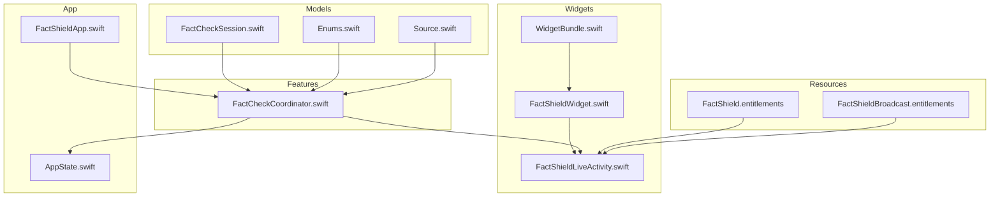
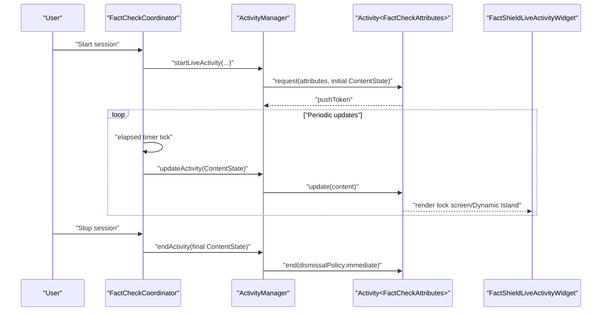
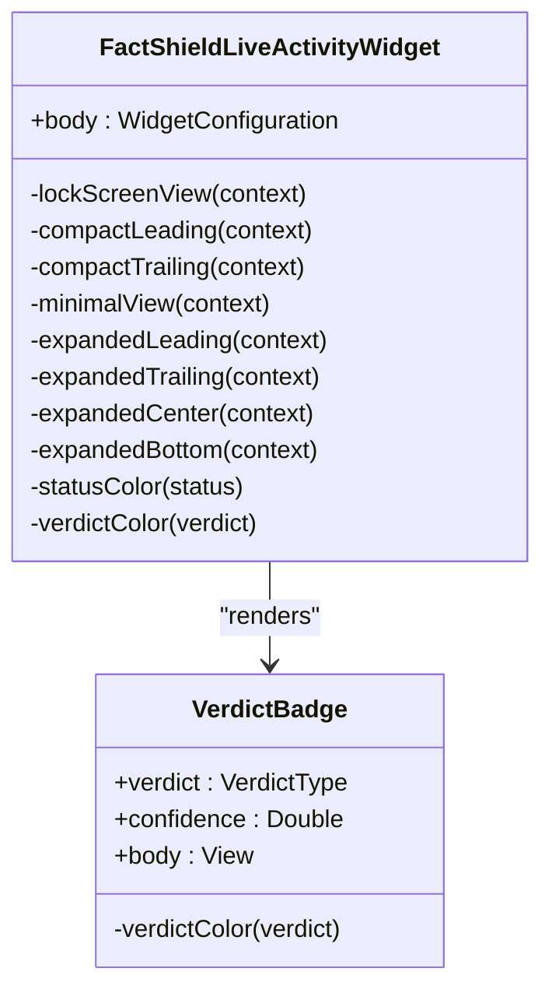
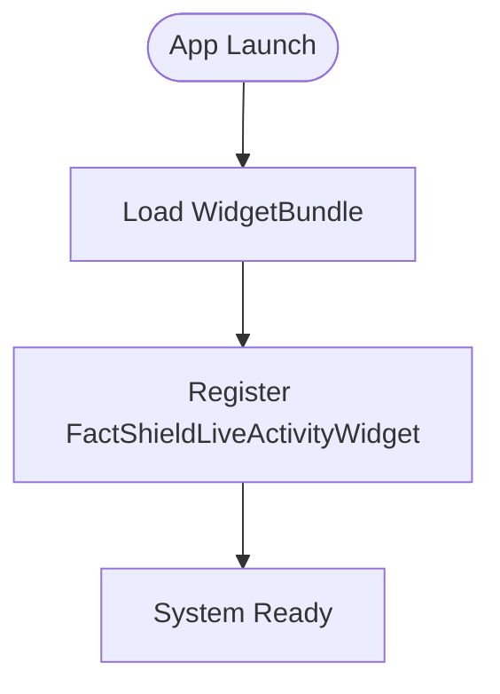
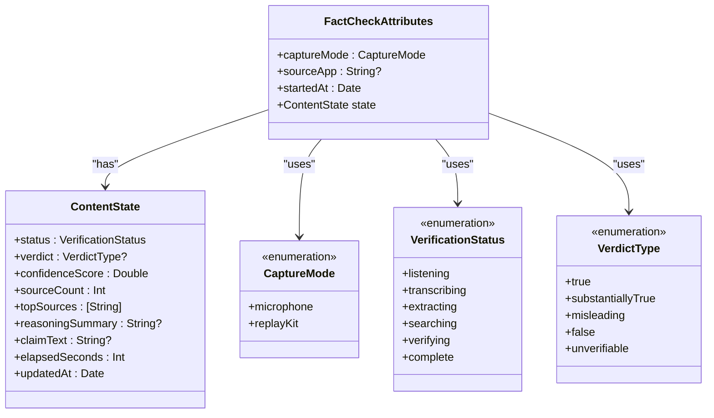
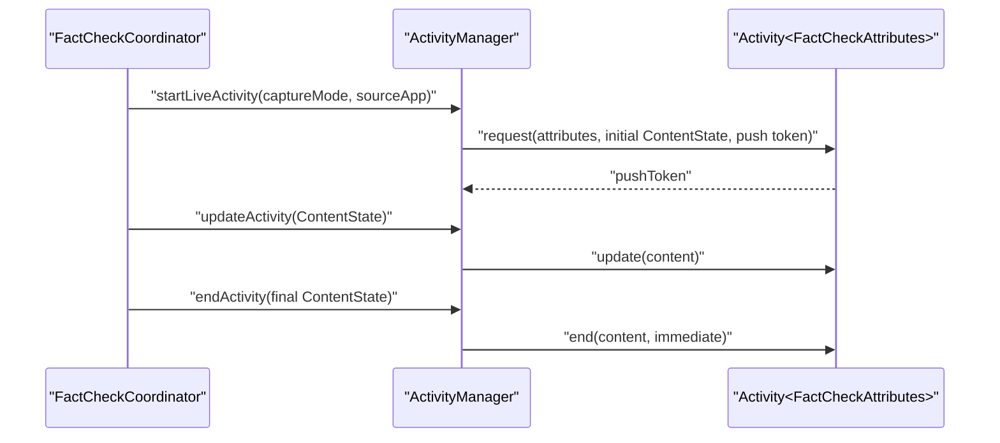
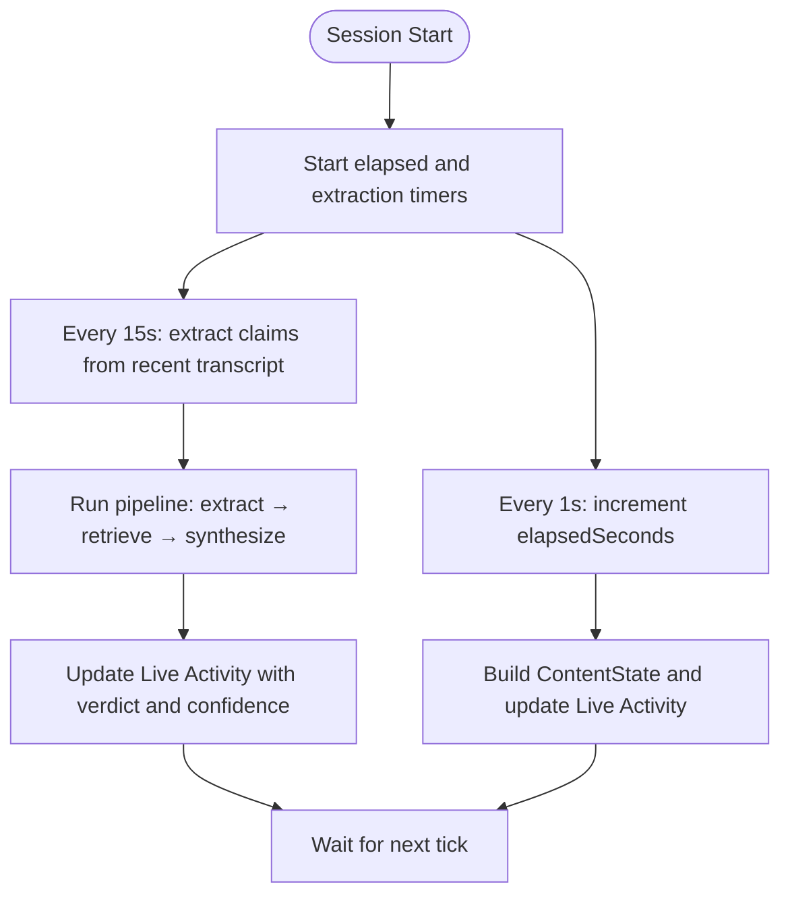
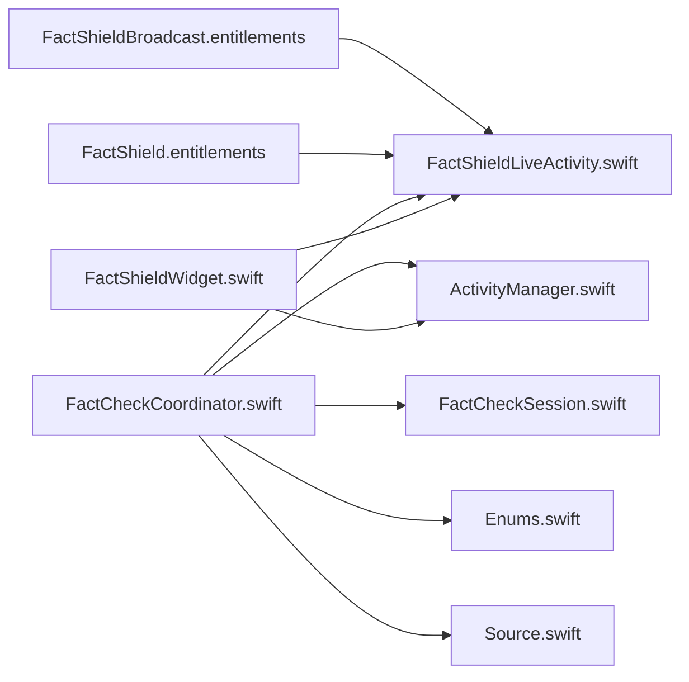

# Widget Development

<cite>
**Referenced Files in This Document**
- [FactShieldWidget.swift](file://FactShield/FactShield/Widgets/FactShieldWidget.swift)
- [WidgetBundle.swift](file://FactShield/FactShield/Widgets/WidgetBundle.swift)
- [FactShieldLiveActivity.swift](file://FactShield/FactShield/Widgets/FactShieldLiveActivity.swift)
- [ActivityManager.swift](file://FactShield/FactShield/Widgets/ActivityManager.swift)
- [FactCheckCoordinator.swift](file://FactShield/FactShield/Features/FactCheck/FactCheckCoordinator.swift)
- [AppState.swift](file://FactShield/FactShield/App/AppState.swift)
- [FactShieldApp.swift](file://FactShield/FactShield/App/FactShieldApp.swift)
- [FactCheckSession.swift](file://FactShield/FactShield/Models/FactCheckSession.swift)
- [Enums.swift](file://FactShield/FactShield/Models/Enums.swift)
- [Source.swift](file://FactShield/FactShield/Models/Source.swift)
- [Package.swift](file://Package.swift)
- [FactShield.entitlements](file://FactShield/FactShield/Resources/FactShield.entitlements)
- [FactShieldBroadcast.entitlements](file://FactShield/FactShield/BroadcastExtension/FactShieldBroadcast.entitlements)
</cite>

## Table of Contents
1. [Introduction](#introduction)
2. [Project Structure](#project-structure)
3. [Core Components](#core-components)
4. [Architecture Overview](#architecture-overview)
5. [Detailed Component Analysis](#detailed-component-analysis)
6. [Dependency Analysis](#dependency-analysis)
7. [Performance Considerations](#performance-considerations)
8. [Troubleshooting Guide](#troubleshooting-guide)
9. [Conclusion](#con conclusion)
10. [Appendices](#appendices)

## Introduction
This document explains the lock screen widget and Dynamic Island layout implementation for the FactShield Live Activity. It covers the FactShieldLiveActivityWidget definition, data binding via ActivityKit content state, refresh logic driven by timers and service orchestration, and presentation across lock screen and Dynamic Island regions. It also documents the WidgetBundle configuration for registration, the integration with the Live Activity system, size variants and layout customization, user interaction patterns, data synchronization between the widget and the main app, cache management and update frequency, content formatting examples, status indicators, progress tracking, performance optimization, memory management, and debugging techniques.

## Project Structure
The widget system is organized under the Widgets target and integrates with the main app and feature modules:
- Widgets: FactShieldLiveActivityWidget, WidgetBundle, FactShieldLiveActivity (attributes and content state)
- Features: FactCheckCoordinator orchestrates the pipeline and updates the Live Activity
- App: AppState and FactShieldApp manage global state and scene setup
- Models: FactCheckSession, Enums, Source define domain types used by the pipeline and widget
- Entitlements: Application group sharing for cross-process communication

**Diagram sources**
- [WidgetBundle.swift:1-10](file://FactShield/FactShield/Widgets/WidgetBundle.swift#L1-L10)
- [FactShieldWidget.swift:1-218](file://FactShield/FactShield/Widgets/FactShieldWidget.swift#L1-L218)
- [FactShieldLiveActivity.swift:1-44](file://FactShield/FactShield/Widgets/FactShieldLiveActivity.swift#L1-L44)
- [FactCheckCoordinator.swift:1-216](file://FactShield/FactShield/Features/FactCheck/FactCheckCoordinator.swift#L1-L216)
- [AppState.swift:1-30](file://FactShield/FactShield/App/AppState.swift#L1-L30)
- [FactShieldApp.swift:1-127](file://FactShield/FactShield/App/FactShieldApp.swift#L1-L127)
- [FactCheckSession.swift:1-54](file://FactShield/FactShield/Models/FactCheckSession.swift#L1-L54)
- [Enums.swift:1-48](file://FactShield/FactShield/Models/Enums.swift#L1-L48)
- [Source.swift:1-11](file://FactShield/FactShield/Models/Source.swift#L1-L11)
- [FactShield.entitlements:1-11](file://FactShield/FactShield/Resources/FactShield.entitlements#L1-L11)
- [FactShieldBroadcast.entitlements:1-11](file://FactShield/FactShield/BroadcastExtension/FactShieldBroadcast.entitlements#L1-L11)

**Section sources**
- [Package.swift:1-25](file://Package.swift#L1-L25)
- [WidgetBundle.swift:1-10](file://FactShield/FactShield/Widgets/WidgetBundle.swift#L1-L10)
- [FactShieldWidget.swift:1-218](file://FactShield/FactShield/Widgets/FactShieldWidget.swift#L1-L218)
- [FactShieldLiveActivity.swift:1-44](file://FactShield/FactShield/Widgets/FactShieldLiveActivity.swift#L1-L44)
- [FactCheckCoordinator.swift:1-216](file://FactShield/FactShield/Features/FactCheck/FactCheckCoordinator.swift#L1-L216)
- [AppState.swift:1-30](file://FactShield/FactShield/App/AppState.swift#L1-L30)
- [FactShieldApp.swift:1-127](file://FactShield/FactShield/App/FactShieldApp.swift#L1-L127)
- [FactCheckSession.swift:1-54](file://FactShield/FactShield/Models/FactCheckSession.swift#L1-L54)
- [Enums.swift:1-48](file://FactShield/FactShield/Models/Enums.swift#L1-L48)
- [Source.swift:1-11](file://FactShield/FactShield/Models/Source.swift#L1-L11)
- [FactShield.entitlements:1-11](file://FactShield/FactShield/Resources/FactShield.entitlements#L1-L11)
- [FactShieldBroadcast.entitlements:1-11](file://FactShield/FactShield/BroadcastExtension/FactShieldBroadcast.entitlements#L1-L11)

## Core Components
- FactShieldLiveActivityWidget: Implements the Widget using ActivityConfiguration with lock screen and Dynamic Island layouts. It binds to ActivityKit’s content state and renders views for each region.
- FactShieldLiveActivity: Defines ActivityAttributes and ContentState for the Live Activity, including verification status, verdict, confidence, sources, reasoning summary, claim text, elapsed time, and timestamps.
- ActivityManager: Manages the lifecycle of the Live Activity, including starting, updating, and ending it, with logging and error handling.
- FactCheckCoordinator: Orchestrates the fact-check pipeline, periodically extracts claims, retrieves evidence, synthesizes verdicts, and pushes updates to the Live Activity.
- WidgetBundle: Registers the widget bundle entry point for the system to load the widget.
- AppState and FactShieldApp: Provide global state and scene setup; the coordinator interacts with AppState indirectly via shared singletons.
- Models: FactCheckSession, Enums, and Source support the pipeline and provide types used in the Live Activity content state.

Key responsibilities:
- Data binding: ContentState fields are mapped from pipeline outputs and updated on schedule.
- Refresh logic: Timers drive periodic updates and incremental state changes.
- Presentation: Lock screen and Dynamic Island regions render contextual information with status and progress indicators.
- Lifecycle: ActivityManager coordinates start/update/end with ActivityKit.

**Section sources**
- [FactShieldWidget.swift:5-185](file://FactShield/FactShield/Widgets/FactShieldWidget.swift#L5-L185)
- [FactShieldLiveActivity.swift:5-43](file://FactShield/FactShield/Widgets/FactShieldLiveActivity.swift#L5-L43)
- [ActivityManager.swift:4-87](file://FactShield/FactShield/Widgets/ActivityManager.swift#L4-L87)
- [FactCheckCoordinator.swift:5-202](file://FactShield/FactShield/Features/FactCheck/FactCheckCoordinator.swift#L5-L202)
- [WidgetBundle.swift:4-9](file://FactShield/FactShield/Widgets/WidgetBundle.swift#L4-L9)
- [AppState.swift:4-29](file://FactShield/FactShield/App/AppState.swift#L4-L29)
- [FactShieldApp.swift:4-26](file://FactShield/FactShield/App/FactShieldApp.swift#L4-L26)
- [FactCheckSession.swift:3-35](file://FactShield/FactShield/Models/FactCheckSession.swift#L3-L35)
- [Enums.swift:25-47](file://FactShield/FactShield/Models/Enums.swift#L25-L47)
- [Source.swift:3-10](file://FactShield/FactShield/Models/Source.swift#L3-L10)

## Architecture Overview
The widget architecture centers on ActivityKit’s Live Activity and WidgetKit’s ActivityConfiguration. The FactCheckCoordinator drives the pipeline and updates the Live Activity via ActivityManager. The widget observes the latest ContentState and renders appropriate views for lock screen and Dynamic Island.

**Diagram sources**
- [FactCheckCoordinator.swift:38-84](file://FactShield/FactShield/Features/FactCheck/FactCheckCoordinator.swift#L38-L84)
- [ActivityManager.swift:16-67](file://FactShield/FactShield/Widgets/ActivityManager.swift#L16-L67)
- [FactShieldWidget.swift:6-33](file://FactShield/FactShield/Widgets/FactShieldWidget.swift#L6-L33)

## Detailed Component Analysis

### FactShieldLiveActivityWidget
- Widget configuration: Uses ActivityConfiguration with lock screen and DynamicIsland regions.
- Lock screen view: Presents header with status badge, claim preview, and verdict badge with source count.
- Dynamic Island:
  - Compact leading: Status-colored shield icon with pulse effect while not complete.
  - Compact trailing: Verdict label or status caption depending on state.
  - Minimal: Compact leading representation.
  - Expanded:
    - Leading: Brand and status caption.
    - Trailing: Verdict label and confidence percentage or elapsed seconds.
    - Center: Claim text centered with line limits.
    - Bottom: Verdict badge and reasoning summary when available.
- Helper views: VerdictBadge displays colored dot, verdict label, and confidence percentage with subtle background.

**Diagram sources**
- [FactShieldWidget.swift:5-218](file://FactShield/FactShield/Widgets/FactShieldWidget.swift#L5-L218)

**Section sources**
- [FactShieldWidget.swift:5-185](file://FactShield/FactShield/Widgets/FactShieldWidget.swift#L5-L185)
- [FactShieldWidget.swift:187-218](file://FactShield/FactShield/Widgets/FactShieldWidget.swift#L187-L218)

### WidgetBundle
- Registers the FactShieldLiveActivityWidget as the single widget in the bundle.
- Acts as the entry point for the system to load the widget.

**Diagram sources**
- [WidgetBundle.swift:4-9](file://FactShield/FactShield/Widgets/WidgetBundle.swift#L4-L9)

**Section sources**
- [WidgetBundle.swift:4-9](file://FactShield/FactShield/Widgets/WidgetBundle.swift#L4-L9)

### FactShieldLiveActivity (Attributes and ContentState)
- Attributes: capture mode, optional source app, and start time.
- ContentState: status, optional verdict and confidence, source count, top sources, reasoning summary, claim text, elapsed seconds, and updated timestamp.
- Enums: CaptureMode, VerificationStatus, VerdictType.

**Diagram sources**
- [FactShieldLiveActivity.swift:5-43](file://FactShield/FactShield/Widgets/FactShieldLiveActivity.swift#L5-L43)

**Section sources**
- [FactShieldLiveActivity.swift:5-43](file://FactShield/FactShield/Widgets/FactShieldLiveActivity.swift#L5-L43)

### ActivityManager
- Starts a Live Activity with initial ContentState and enables push updates.
- Updates the activity content with new state.
- Ends the activity with immediate dismissal policy.
- Provides logging and error handling for disabled activities.

**Diagram sources**
- [ActivityManager.swift:16-67](file://FactShield/FactShield/Widgets/ActivityManager.swift#L16-L67)
- [FactCheckCoordinator.swift:164-201](file://FactShield/FactShield/Features/FactCheck/FactCheckCoordinator.swift#L164-L201)

**Section sources**
- [ActivityManager.swift:4-87](file://FactShield/FactShield/Widgets/ActivityManager.swift#L4-L87)

### FactCheckCoordinator
- Orchestrates the pipeline: audio capture, speech recognition, claim extraction, evidence retrieval, and verdict synthesis.
- Drives periodic updates:
  - Elapsed timer increments every second and triggers state updates.
  - Extraction timer runs every 15 seconds to process recent transcript and run the pipeline.
- Updates the Live Activity with structured ContentState derived from pipeline outputs.
- Converts internal verdict types to Activity-compatible types.

**Diagram sources**
- [FactCheckCoordinator.swift:38-84](file://FactShield/FactShield/Features/FactCheck/FactCheckCoordinator.swift#L38-L84)
- [FactCheckCoordinator.swift:87-161](file://FactShield/FactShield/Features/FactCheck/FactCheckCoordinator.swift#L87-L161)
- [FactCheckCoordinator.swift:164-201](file://FactShield/FactShield/Features/FactCheck/FactCheckCoordinator.swift#L164-L201)

**Section sources**
- [FactCheckCoordinator.swift:5-202](file://FactShield/FactShield/Features/FactCheck/FactCheckCoordinator.swift#L5-L202)

### Widget Content Formatting, Status Indicators, and Progress Tracking
- Status indicators:
  - Pulse symbol effect on the shield icon while verification is not complete.
  - Color-coded status and verdict badges using dedicated color helpers.
- Progress tracking:
  - Elapsed seconds displayed in compact trailing and expanded trailing regions.
  - Verdict confidence percentage shown in expanded trailing region.
- Content formatting:
  - Claim text with line limits and centered alignment in expanded center.
  - Reasoning summary and source counts in expanded bottom region.

**Section sources**
- [FactShieldWidget.swift:72-162](file://FactShield/FactShield/Widgets/FactShieldWidget.swift#L72-L162)
- [FactShieldWidget.swift:165-184](file://FactShield/FactShield/Widgets/FactShieldWidget.swift#L165-L184)

### Widget Size Variants and Layout Customization
- Lock screen view: Full-bleed dark background with status, claim preview, and verdict badge.
- Dynamic Island:
  - Compact leading/trailing/minimal: concise status and verdict indicators.
  - Expanded regions: Leading/Trailing/Center/Bottom for richer context and controls.
- Customization options:
  - Region-specific content tailored to available space.
  - Conditional rendering based on presence of verdict, claim text, and reasoning summary.

**Section sources**
- [FactShieldWidget.swift:36-162](file://FactShield/FactShield/Widgets/FactShieldWidget.swift#L36-L162)

### User Interaction Patterns
- Lock screen: Static presentation of current state; no interactive elements in the widget itself.
- Dynamic Island: Long press expands to reveal additional context; compact forms provide quick status and verdict.
- Tap behavior: No explicit tap handlers in the widget; interactions are handled by the system and app.

**Section sources**
- [FactShieldWidget.swift:6-33](file://FactShield/FactShield/Widgets/FactShieldWidget.swift#L6-L33)

### Data Synchronization Between Widget and Main Application
- Synchronization mechanism:
  - Live Activity content state is the single source of truth for the widget.
  - FactCheckCoordinator builds ContentState from pipeline outputs and delegates updates to ActivityManager.
- Cache management:
  - ContentState includes updatedAt timestamp; the widget re-renders on state changes.
  - No explicit caching layer in the widget; rely on ActivityKit’s content updates.
- Update frequency:
  - Elapsed timer updates every second.
  - Extraction timer runs every 15 seconds to process new claims and evidence.

**Section sources**
- [FactCheckCoordinator.swift:76-84](file://FactShield/FactShield/Features/FactCheck/FactCheckCoordinator.swift#L76-L84)
- [FactCheckCoordinator.swift:164-201](file://FactShield/FactShield/Features/FactCheck/FactCheckCoordinator.swift#L164-L201)
- [FactShieldLiveActivity.swift:10-20](file://FactShield/FactShield/Widgets/FactShieldLiveActivity.swift#L10-L20)

## Dependency Analysis
- Widget depends on ActivityKit for Live Activity and WidgetKit for ActivityConfiguration.
- FactCheckCoordinator depends on ActivityManager and multiple services for the pipeline.
- Models and enums are shared across the pipeline and widget content state.
- Entitlements enable application groups for cross-process sharing.

**Diagram sources**
- [FactShieldWidget.swift:1-3](file://FactShield/FactShield/Widgets/FactShieldWidget.swift#L1-L3)
- [FactShieldLiveActivity.swift:1-3](file://FactShield/FactShield/Widgets/FactShieldLiveActivity.swift#L1-L3)
- [ActivityManager.swift:1-2](file://FactShield/FactShield/Widgets/ActivityManager.swift#L1-L2)
- [FactCheckCoordinator.swift:11-17](file://FactShield/FactShield/Features/FactCheck/FactCheckCoordinator.swift#L11-L17)
- [FactCheckSession.swift:1-2](file://FactShield/FactShield/Models/FactCheckSession.swift#L1-L2)
- [Enums.swift:1-2](file://FactShield/FactShield/Models/Enums.swift#L1-L2)
- [Source.swift:1-2](file://FactShield/FactShield/Models/Source.swift#L1-L2)
- [FactShield.entitlements:5-8](file://FactShield/FactShield/Resources/FactShield.entitlements#L5-L8)
- [FactShieldBroadcast.entitlements:5-8](file://FactShield/FactShield/BroadcastExtension/FactShieldBroadcast.entitlements#L5-L8)

**Section sources**
- [FactShieldWidget.swift:1-3](file://FactShield/FactShield/Widgets/FactShieldWidget.swift#L1-L3)
- [FactShieldLiveActivity.swift:1-3](file://FactShield/FactShield/Widgets/FactShieldLiveActivity.swift#L1-L3)
- [ActivityManager.swift:1-2](file://FactShield/FactShield/Widgets/ActivityManager.swift#L1-L2)
- [FactCheckCoordinator.swift:11-17](file://FactShield/FactShield/Features/FactCheck/FactCheckCoordinator.swift#L11-L17)
- [FactCheckSession.swift:1-2](file://FactShield/FactShield/Models/FactCheckSession.swift#L1-L2)
- [Enums.swift:1-2](file://FactShield/FactShield/Models/Enums.swift#L1-L2)
- [Source.swift:1-2](file://FactShield/FactShield/Models/Source.swift#L1-L2)
- [FactShield.entitlements:5-8](file://FactShield/FactShield/Resources/FactShield.entitlements#L5-L8)
- [FactShieldBroadcast.entitlements:5-8](file://FactShield/FactShield/BroadcastExtension/FactShieldBroadcast.entitlements#L5-L8)

## Performance Considerations
- Minimize heavy work on the main thread; keep UI updates lightweight and delegate computations to background tasks.
- Use timers judiciously; the current 1s elapsed tick and 15s extraction interval balance responsiveness and battery life.
- Avoid unnecessary state churn; batch updates and deduplicate identical ContentState values.
- Keep widget views flat and avoid deep hierarchies to reduce rendering overhead.
- Leverage symbol effects sparingly; consider disabling during low-power modes if needed.
- Monitor logs for repeated errors and backoff strategies for network-dependent steps.

## Troubleshooting Guide
- Live Activity not enabled:
  - Symptom: Start fails with a not-enabled error.
  - Action: Verify Live Activities are enabled in settings; handle the error gracefully and inform the user.
- Activity already running:
  - Symptom: Attempted to start while another session exists.
  - Action: Prevent duplicate sessions and surface a user-facing message.
- No microphone permission:
  - Symptom: Pipeline stalls or errors.
  - Action: Request permission at app launch and gate pipeline initiation until granted.
- Widget not updating:
  - Symptom: Lock screen and Dynamic Island show stale content.
  - Action: Confirm elapsed timer is running and ActivityManager.updateActivity is being called; check ContentState changes.
- Entitlement misconfiguration:
  - Symptom: Cross-process sharing or push updates fail.
  - Action: Verify application group entitlements match between app and extension.

**Section sources**
- [ActivityManager.swift:17-20](file://FactShield/FactShield/Widgets/ActivityManager.swift#L17-L20)
- [ActivityManager.swift:70-80](file://FactShield/FactShield/Widgets/ActivityManager.swift#L70-L80)
- [FactShieldApp.swift:18-24](file://FactShield/FactShield/App/FactShieldApp.swift#L18-L24)
- [FactShield.entitlements:5-8](file://FactShield/FactShield/Resources/FactShield.entitlements#L5-L8)
- [FactShieldBroadcast.entitlements:5-8](file://FactShield/FactShield/BroadcastExtension/FactShieldBroadcast.entitlements#L5-L8)

## Conclusion
The FactShield widget leverages ActivityKit and WidgetKit to deliver a comprehensive, real-time verification experience on the lock screen and Dynamic Island. The FactCheckCoordinator orchestrates the pipeline and synchronizes state via ActivityManager, ensuring the widget remains responsive and informative. With careful attention to update frequency, UI simplicity, and robust error handling, the system provides a reliable and user-friendly interface for ongoing fact-check sessions.

## Appendices
- Example content formatting patterns:
  - VerdictBadge: Colored dot, verdict label, and confidence percentage with capsule background.
  - Status color mapping: Blue for listening, cyan for transcribing, orange for extracting, purple for searching, yellow for verifying, green for complete.
  - Verdict color mapping: Green for true, yellow for substantially true, orange for misleading, red for false, gray for unverifiable.
- Progress tracking:
  - Elapsed seconds monospaced digits in compact trailing and expanded trailing.
  - Confidence percentage displayed alongside verdict in expanded trailing.
- User interaction:
  - Dynamic Island expansion reveals additional context; compact forms summarize key information.

**Section sources**
- [FactShieldWidget.swift:187-218](file://FactShield/FactShield/Widgets/FactShieldWidget.swift#L187-L218)
- [FactShieldWidget.swift:165-184](file://FactShield/FactShield/Widgets/FactShieldWidget.swift#L165-L184)
- [FactShieldWidget.swift:119](file://FactShield/FactShield/Widgets/FactShieldWidget.swift#L119)