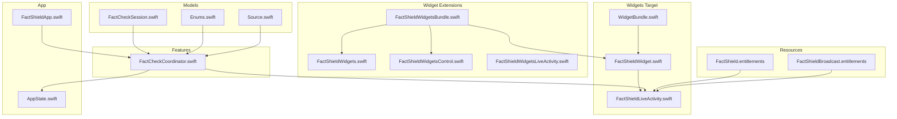
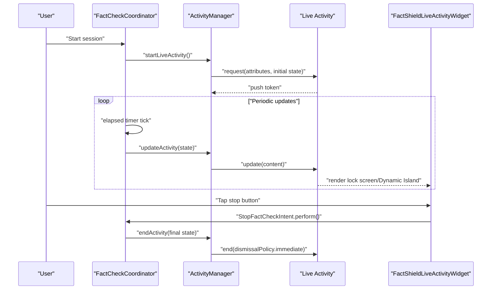
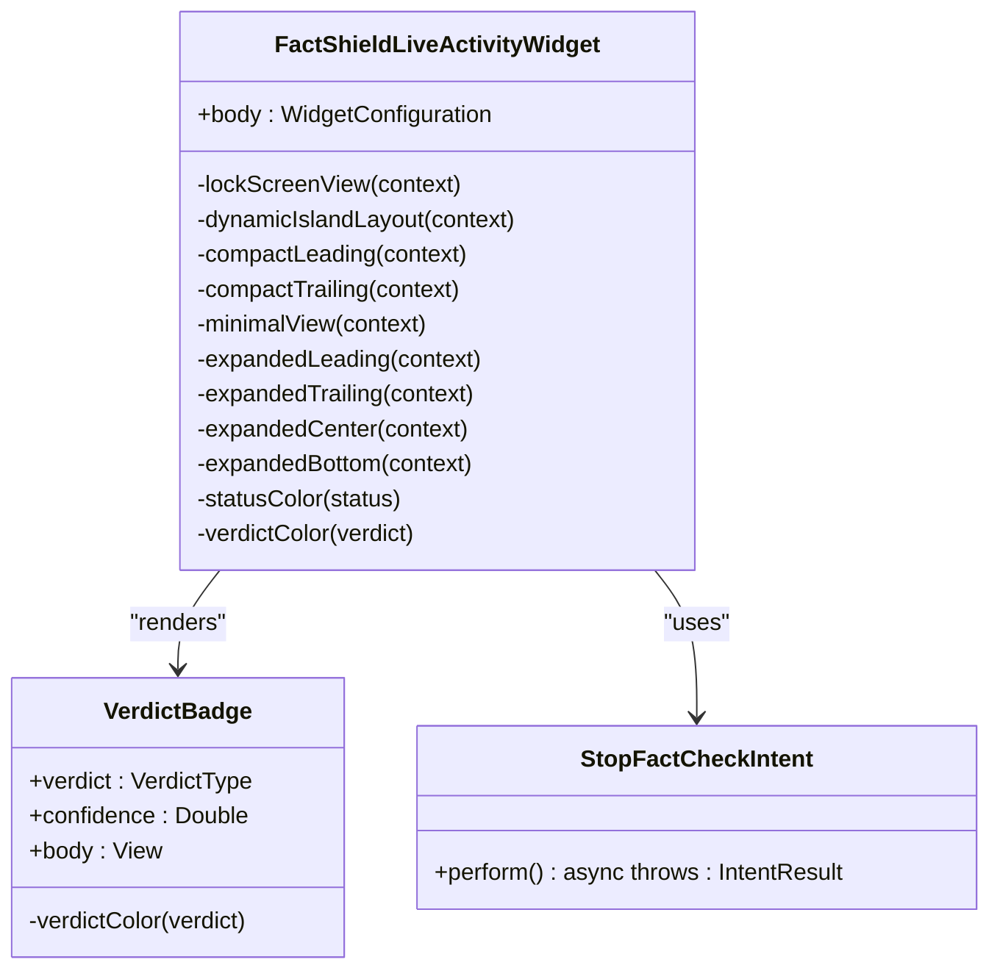
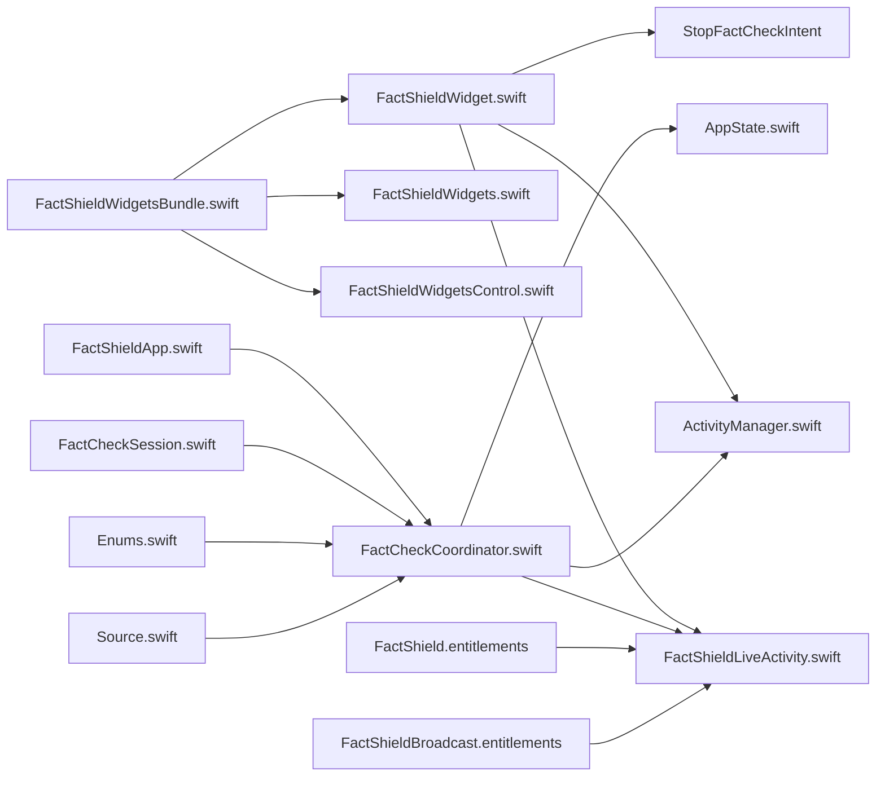

# Widget Development

<cite>
**Referenced Files in This Document**
- [FactShieldWidget.swift](file://FactShield/FactShield/Widgets/FactShieldWidget.swift)
- [WidgetBundle.swift](file://FactShield/FactShield/Widgets/WidgetBundle.swift)
- [FactShieldLiveActivity.swift](file://FactShield/FactShield/Widgets/FactShieldLiveActivity.swift)
- [ActivityManager.swift](file://FactShield/FactShield/Widgets/ActivityManager.swift)
- [FactCheckCoordinator.swift](file://FactShield/FactShield/Features/FactCheck/FactCheckCoordinator.swift)
- [AppState.swift](file://FactShield/FactShield/App/AppState.swift)
- [FactShieldApp.swift](file://FactShield/FactShield/App/FactShieldApp.swift)
- [FactCheckSession.swift](file://FactShield/FactShield/Models/FactCheckSession.swift)
- [Enums.swift](file://FactShield/FactShield/Models/Enums.swift)
- [Source.swift](file://FactShield/FactShield/Models/Source.swift)
- [FactShieldWidgetsBundle.swift](file://Xcode/FactShield/FactShieldWidgets/FactShieldWidgetsBundle.swift)
- [FactShieldWidgets.swift](file://Xcode/FactShield/FactShieldWidgets/FactShieldWidgets.swift)
- [FactShieldWidgetsControl.swift](file://Xcode/FactShield/FactShieldWidgets/FactShieldWidgetsControl.swift)
- [FactShieldWidgetsLiveActivity.swift](file://Xcode/FactShield/FactShieldWidgets/FactShieldWidgetsLiveActivity.swift)
- [Package.swift](file://Package.swift)
- [FactShield.entitlements](file://FactShield/FactShield/Resources/FactShield.entitlements)
- [FactShieldBroadcast.entitlements](file://FactShield/FactShield/BroadcastExtension/FactShieldBroadcast.entitlements)
</cite>

## Update Summary
**Changes Made**
- Updated FactShieldLiveActivityWidget implementation with comprehensive Dynamic Island support
- Added expanded widget variants including compact leading/trailing, expanded views, and minimal layouts
- Implemented colored verdict displays with dedicated color helpers and icon mappings
- Enhanced lock screen banner presentation with animated waveform and status indicators
- Integrated StopFactCheckIntent for user interaction within Dynamic Island
- Updated WidgetBundle configuration to include multiple widget types
- Enhanced ActivityKit integration with improved content state management

## Table of Contents
1. [Introduction](#introduction)
2. [Project Structure](#project-structure)
3. [Core Components](#core-components)
4. [Architecture Overview](#architecture-overview)
5. [Detailed Component Analysis](#detailed-component-analysis)
6. [Dependency Analysis](#dependency-analysis)
7. [Performance Considerations](#performance-considerations)
8. [Troubleshooting Guide](#troubleshooting-guide)
9. [Conclusion](#conclusion)
10. [Appendices](#appendices)

## Introduction
This document explains the comprehensive lock screen widget and Dynamic Island layout implementation for the FactShield Live Activity system. The implementation features a sophisticated widget architecture with multiple layout variants, real-time data synchronization, and enhanced user interaction capabilities. The FactShieldLiveActivityWidget provides rich presentations across lock screen, Dynamic Island compact and expanded states, with animated status indicators, colored verdict displays, and integrated stop controls.

## Project Structure
The widget system has evolved to include multiple widget types and enhanced Live Activity integration:
- Widgets: FactShieldLiveActivityWidget (main Live Activity widget), FactShieldWidgets (standard widget), FactShieldWidgetsControl (control widget)
- Live Activity: Comprehensive attributes and content state management
- Features: FactCheckCoordinator orchestrates the pipeline and updates the Live Activity
- App: AppState and FactShieldApp manage global state and scene setup
- Models: FactCheckSession, Enums, Source define domain types used by the pipeline and widget
- Entitlements: Application group sharing for cross-process communication

**Diagram sources**
- [WidgetBundle.swift:1-6](file://FactShield/FactShield/Widgets/WidgetBundle.swift#L1-L6)
- [FactShieldWidget.swift:1-466](file://FactShield/FactShield/Widgets/FactShieldWidget.swift#L1-L466)
- [FactShieldLiveActivity.swift:1-46](file://FactShield/FactShield/Widgets/FactShieldLiveActivity.swift#L1-L46)
- [FactShieldWidgetsBundle.swift:1-19](file://Xcode/FactShield/FactShieldWidgets/FactShieldWidgetsBundle.swift#L1-L19)
- [FactShieldWidgets.swift:1-89](file://Xcode/FactShield/FactShieldWidgets/FactShieldWidgets.swift#L1-L89)
- [FactShieldWidgetsControl.swift:1-78](file://Xcode/FactShield/FactShieldWidgets/FactShieldWidgetsControl.swift#L1-L78)
- [FactShieldWidgetsLiveActivity.swift:1-76](file://Xcode/FactShield/FactShieldWidgets/FactShieldWidgetsLiveActivity.swift#L1-L76)

**Section sources**
- [Package.swift:1-25](file://Package.swift#L1-L25)
- [WidgetBundle.swift:1-6](file://FactShield/FactShield/Widgets/WidgetBundle.swift#L1-L6)
- [FactShieldWidget.swift:1-466](file://FactShield/FactShield/Widgets/FactShieldWidget.swift#L1-L466)
- [FactShieldLiveActivity.swift:1-46](file://FactShield/FactShield/Widgets/FactShieldLiveActivity.swift#L1-L46)
- [FactShieldWidgetsBundle.swift:1-19](file://Xcode/FactShield/FactShieldWidgets/FactShieldWidgetsBundle.swift#L1-L19)
- [FactShieldWidgets.swift:1-89](file://Xcode/FactShield/FactShieldWidgets/FactShieldWidgets.swift#L1-L89)
- [FactShieldWidgetsControl.swift:1-78](file://Xcode/FactShield/FactShieldWidgets/FactShieldWidgetsControl.swift#L1-L78)
- [FactShieldWidgetsLiveActivity.swift:1-76](file://Xcode/FactShield/FactShieldWidgets/FactShieldWidgetsLiveActivity.swift#L1-L76)

## Core Components
The widget system now encompasses multiple specialized components for different presentation scenarios:

### FactShieldLiveActivityWidget
**Updated** Complete rewrite with comprehensive Dynamic Island support and expanded layout variants:
- **Lock Screen Banner**: Full-bleed presentation with animated waveform, claim text, and verdict indicators
- **Dynamic Island Support**: 
  - Compact Leading: Animated waveform with pulse effect during active verification
  - Compact Trailing: Elapsed time display with monospaced digits
  - Minimal: Simple shield icon for multi-activity scenarios
  - Expanded Regions: Leading (brand/status), Trailing (verdict/confidence), Center (claim text), Bottom (verdict badge + reasoning)
- **Colored Verdict Displays**: Dedicated color helpers and icon mappings for each verdict type
- **Interactive Elements**: Stop button integrated via LiveActivityIntent for immediate session termination
- **Symbol Effects**: Animated pulse effects synchronized with verification status

### Enhanced Widget Bundle Configuration
**Updated** Multi-widget support with comprehensive widget ecosystem:
- FactShieldWidgetsBundle: Main entry point registering multiple widget types
- FactShieldWidgets: Standard app intent widget for basic functionality
- FactShieldWidgetsControl: Control widget for system integration
- FactShieldLiveActivityWidget: Primary Live Activity widget with Dynamic Island support

### Comprehensive Live Activity Implementation
**Updated** Enhanced attributes and content state management:
- **Attributes**: Capture mode, source app identification, and start time tracking
- **ContentState**: Rich state management including status, verdict, confidence, sources, reasoning, and timing
- **Status Management**: Six-phase verification workflow with appropriate visual feedback
- **Verdict System**: Five-category verdict classification with color-coded presentation

### Advanced Activity Management
**Updated** Robust lifecycle management with error handling:
- **Start/Update/End Operations**: Comprehensive activity lifecycle with proper state transitions
- **Error Handling**: Specific error types for disabled activities and duplicate sessions
- **Logging**: Extensive logging for debugging and monitoring
- **State Persistence**: Maintains current activity reference for reliable updates

**Section sources**
- [FactShieldWidget.swift:44-78](file://FactShield/FactShield/Widgets/FactShieldWidget.swift#L44-L78)
- [FactShieldWidget.swift:82-194](file://FactShield/FactShield/Widgets/FactShieldWidget.swift#L82-L194)
- [FactShieldWidget.swift:198-248](file://FactShield/FactShield/Widgets/FactShieldWidget.swift#L198-L248)
- [FactShieldWidgetsBundle.swift:12-18](file://Xcode/FactShield/FactShieldWidgets/FactShieldWidgetsBundle.swift#L12-L18)
- [FactShieldLiveActivity.swift:7-45](file://FactShield/FactShield/Widgets/FactShieldLiveActivity.swift#L7-L45)
- [ActivityManager.swift:16-67](file://FactShield/FactShield/Widgets/ActivityManager.swift#L16-L67)

## Architecture Overview
The enhanced architecture supports multiple widget types with sophisticated Live Activity integration and comprehensive user interaction:

**Diagram sources**
- [FactCheckCoordinator.swift:38-84](file://FactShield/FactShield/Features/FactCheck/FactCheckCoordinator.swift#L38-L84)
- [ActivityManager.swift:16-67](file://FactShield/FactShield/Widgets/ActivityManager.swift#L16-L67)
- [FactShieldWidget.swift:8-16](file://FactShield/FactShield/Widgets/FactShieldWidget.swift#L8-L16)

## Detailed Component Analysis

### FactShieldLiveActivityWidget - Comprehensive Implementation
**Updated** Complete widget implementation with advanced layout variants:

#### Lock Screen Banner Presentation
- **Full-bleed Design**: Black semi-transparent background with white foreground for optimal contrast
- **Animated Status Indicators**: Waveform icon with pulse effect during non-complete verification states
- **Multi-layer Content**: Brand identity, status text, claim preview, and verdict indicators
- **Conditional Rendering**: Shows verdict badge when available, otherwise displays elapsed time and capture mode

#### Dynamic Island Layout System
**Enhanced** Comprehensive Dynamic Island support with six distinct layout variants:

**Compact Leading Region**:
- Animated waveform circle with blue tint
- Pulse animation synchronized with verification status
- Shazam-style waveform effect for visual appeal

**Compact Trailing Region**:
- Monospaced digit display for elapsed seconds
- Secondary styling for non-intrusive presentation
- Real-time updates every second

**Minimal View**:
- Simple shield icon for multi-activity scenarios
- Status-color coding with pulse effect
- Compact presentation for crowded screens

**Expanded Layout Regions**:
- **Leading**: Brand identity and current status text
- **Trailing**: Verdict text with confidence percentage or elapsed time fallback
- **Center**: Claim text with two-line limit and centered alignment
- **Bottom**: Verdict badge with reasoning summary when available

#### Colored Verdict Display System
**New** Comprehensive color-coded verdict presentation:
- **Color Mapping**: True (green), Substantially True (yellow), Misleading (orange), False (red), Unverifiable (gray)
- **Icon System**: Corresponding SF Symbols for each verdict category
- **Visual Consistency**: Uniform styling with capsule backgrounds and opacity effects
- **Accessibility**: High contrast colors with appropriate visual weight

#### Interactive Elements
**Enhanced** Integrated user controls within the widget:
- **Stop Button**: Red capsule button with stop icon and label
- **LiveActivityIntent Integration**: Direct system-level control for session termination
- **Button Styling**: Consistent with Dynamic Island design language
- **Immediate Response**: System-level handling for instant session termination

**Diagram sources**
- [FactShieldWidget.swift:44-78](file://FactShield/FactShield/Widgets/FactShieldWidget.swift#L44-L78)
- [FactShieldWidget.swift:435-465](file://FactShield/FactShield/Widgets/FactShieldWidget.swift#L435-L465)
- [FactShieldWidget.swift:8-16](file://FactShield/FactShield/Widgets/FactShieldWidget.swift#L8-L16)

**Section sources**
- [FactShieldWidget.swift:44-78](file://FactShield/FactShield/Widgets/FactShieldWidget.swift#L44-L78)
- [FactShieldWidget.swift:82-194](file://FactShield/FactShield/Widgets/FactShieldWidget.swift#L82-L194)
- [FactShieldWidget.swift:198-248](file://FactShield/FactShield/Widgets/FactShieldWidget.swift#L198-L248)
- [FactShieldWidget.swift:20-40](file://FactShield/FactShield/Widgets/FactShieldWidget.swift#L20-L40)

### Enhanced Widget Bundle Configuration
**Updated** Multi-widget ecosystem supporting diverse presentation needs:

#### FactShieldWidgetsBundle - Main Entry Point
- **Multi-widget Registration**: Registers three distinct widget types in single bundle
- **Widget Diversity**: Combines standard widgets, control widgets, and Live Activity widgets
- **System Integration**: Provides unified entry point for widget system loading

#### FactShieldWidgets - Standard Widget
- **App Intent Integration**: Uses AppIntentConfiguration for system-level widget functionality
- **Timeline Management**: Generates hourly timelines for widget refresh cycles
- **Placeholder Support**: Comprehensive placeholder and snapshot implementations

#### FactShieldWidgetsControl - Control Widget
- **System Control Integration**: Provides control widget functionality for system features
- **Toggle Interface**: Implements toggle-based control with visual feedback
- **Intent-based Actions**: Handles user interactions through App Intents

**Section sources**
- [FactShieldWidgetsBundle.swift:12-18](file://Xcode/FactShield/FactShieldWidgets/FactShieldWidgetsBundle.swift#L12-L18)
- [FactShieldWidgets.swift:58-67](file://Xcode/FactShield/FactShieldWidgets/FactShieldWidgets.swift#L58-L67)
- [FactShieldWidgetsControl.swift:12-31](file://Xcode/FactShield/FactShieldWidgets/FactShieldWidgetsControl.swift#L12-L31)

### Comprehensive Live Activity Implementation
**Updated** Enhanced attributes and content state management:

#### FactCheckAttributes - Data Model
- **Capture Modes**: Microphone and ReplayKit system audio capture options
- **Source Tracking**: Optional source app identification for cross-app correlation
- **Temporal Data**: Start time tracking for session duration calculations

#### ContentState - Rich State Management
- **Verification Workflow**: Six-phase status tracking with appropriate visual states
- **Evidence Integration**: Source count and top sources for transparency
- **Reasoning Display**: Structured reasoning summaries for complex verifications
- **Temporal Tracking**: Elapsed seconds and update timestamps for freshness indicators

#### Status Classification System
**Enhanced** Six-phase verification workflow:
- **Listening**: Initial audio capture phase
- **Transcribing**: Speech-to-text processing
- **Extracting**: Claim identification and validation
- **Searching**: Evidence retrieval from databases
- **Verifying**: Cross-checking with multiple sources
- **Complete**: Final verdict with confidence scoring

#### Verdict Classification System
**Enhanced** Five-category verdict hierarchy:
- **TRUE**: Well-established facts with strong evidence
- **SUBSTANTIALLY TRUE**: Mostly accurate with minor qualifiers
- **MISLEADING**: Contains truth but with significant context omission
- **FALSE**: Demonstrably incorrect information
- **UNVERIFIABLE**: Insufficient evidence for determination

**Section sources**
- [FactShieldLiveActivity.swift:7-45](file://FactShield/FactShield/Widgets/FactShieldLiveActivity.swift#L7-L45)

### Advanced Activity Management
**Updated** Robust lifecycle management with comprehensive error handling:

#### Activity Lifecycle Operations
- **Start Operations**: Validates Live Activity enablement before initialization
- **Update Operations**: Asynchronous state updates with proper error propagation
- **End Operations**: Immediate dismissal policy with cleanup procedures

#### Error Handling System
**Enhanced** Specific error types for different failure scenarios:
- **Not Enabled**: Live Activities disabled in system settings
- **Already Running**: Duplicate session attempts prevented
- **Comprehensive Logging**: Detailed logging for debugging and monitoring

#### State Management
- **Current Activity Tracking**: Maintains reference to active Live Activity instance
- **Thread Safety**: Main actor enforcement for UI-safe operations
- **State Validation**: Ensures activity existence before operations

**Section sources**
- [ActivityManager.swift:16-67](file://FactShield/FactShield/Widgets/ActivityManager.swift#L16-L67)
- [ActivityManager.swift:70-87](file://FactShield/FactShield/Widgets/ActivityManager.swift#L70-L87)

### Enhanced FactCheckCoordinator Integration
**Updated** Improved pipeline coordination with enhanced state management:

#### Pipeline Orchestration
- **Timer Coordination**: Separate timers for elapsed tracking and claim extraction
- **State Synchronization**: Real-time updates to Live Activity content state
- **Error Resilience**: Graceful handling of pipeline failures and partial results

#### State Management Enhancements
- **Current State Tracking**: Maintains current claim, verdict, and session data
- **History Preservation**: Comprehensive logging of all claims and verdicts
- **Timing Integration**: Seamless integration with elapsed time tracking

#### Content State Generation
**Enhanced** Comprehensive state construction for widget presentation:
- **Status Updates**: Real-time status changes reflected in widget
- **Verdict Integration**: Complete verdict information with confidence scoring
- **Source Management**: Top sources and reasoning summaries for transparency

**Section sources**
- [FactCheckCoordinator.swift:38-84](file://FactShield/FactShield/Features/FactCheck/FactCheckCoordinator.swift#L38-L84)
- [FactCheckCoordinator.swift:164-201](file://FactShield/FactShield/Features/FactCheck/FactCheckCoordinator.swift#L164-L201)

### Widget Content Formatting and Presentation
**Updated** Enhanced content formatting with comprehensive styling:

#### Status Indicator System
- **Pulse Animation**: Symbol effects synchronized with verification completion
- **Color Coding**: Status-specific colors for immediate visual understanding
- **Animation Control**: Conditional animations based on verification state

#### Verdict Presentation System
**Enhanced** Comprehensive verdict display with visual consistency:
- **Color Harmony**: Consistent color schemes across all verdict presentations
- **Typography Control**: Appropriate font weights and sizes for readability
- **Visual Hierarchy**: Clear distinction between verdict text and confidence metrics

#### Layout Optimization
- **Responsive Design**: Adaptive layouts for different screen sizes and orientations
- **Content Prioritization**: Strategic placement of most important information
- **Visual Balance**: Proper spacing and alignment for optimal readability

**Section sources**
- [FactShieldWidget.swift:413-432](file://FactShield/FactShield/Widgets/FactShieldWidget.swift#L413-L432)
- [FactShieldWidget.swift:456-464](file://FactShield/FactShield/Widgets/FactShieldWidget.swift#L456-L464)

### Widget Size Variants and Layout Customization
**Updated** Comprehensive layout system supporting multiple presentation formats:

#### Lock Screen Presentation
- **Full-bleed Design**: Maximum screen utilization with appropriate contrast
- **Hierarchical Information**: Clear visual hierarchy from brand to details
- **Status Integration**: Animated status indicators for real-time feedback

#### Dynamic Island Variants
**Enhanced** Six distinct layout variants optimized for different contexts:
- **Compact Leading**: Minimal status indication with animation
- **Compact Trailing**: Essential information in constrained space
- **Minimal**: Simple indicator for multi-activity scenarios
- **Expanded Leading**: Brand and status information
- **Expanded Trailing**: Verdict and confidence details
- **Expanded Center**: Claim text with emphasis
- **Expanded Bottom**: Verdict badge and reasoning summary

#### Customization Options
- **Conditional Rendering**: Content adapts based on available information
- **Fallback States**: Graceful degradation when information is unavailable
- **Accessibility Support**: Proper contrast ratios and readable typography

**Section sources**
- [FactShieldWidget.swift:44-78](file://FactShield/FactShield/Widgets/FactShieldWidget.swift#L44-L78)
- [FactShieldWidget.swift:318-410](file://FactShield/FactShield/Widgets/FactShieldWidget.swift#L318-L410)

### User Interaction Patterns
**Updated** Enhanced interaction system with comprehensive user control:

#### Dynamic Island Interactions
- **Expansion Behavior**: Long press reveals expanded content regions
- **Touch Responsiveness**: Immediate feedback for all interactive elements
- **System Integration**: Native iOS interaction patterns and haptics

#### Control Integration
**Enhanced** Direct system-level control capabilities:
- **Stop Functionality**: Immediate session termination via system controls
- **Intent-based Actions**: Seamless integration with Siri Shortcuts and system automation
- **Visual Feedback**: Clear indication of control availability and state

#### User Experience Considerations
- **Non-intrusive Design**: Controls don't interfere with primary content
- **Accessibility Compliance**: Proper contrast and touch target sizing
- **Consistent Behavior**: Predictable interaction patterns across all widget variants

**Section sources**
- [FactShieldWidget.swift:8-16](file://FactShield/FactShield/Widgets/FactShieldWidget.swift#L8-L16)
- [FactShieldWidget.swift:178-191](file://FactShield/FactShield/Widgets/FactShieldWidget.swift#L178-L191)

### Data Synchronization and State Management
**Updated** Enhanced synchronization mechanisms with comprehensive state tracking:

#### Real-time Synchronization
- **Live Activity Integration**: Direct synchronization with Live Activity content state
- **Timer-driven Updates**: Precise timing control for state refresh intervals
- **State Validation**: Ensures data consistency across all widget variants

#### State Management Architecture
**Enhanced** Comprehensive state tracking and management:
- **Current State Tracking**: Maintains active claim, verdict, and session data
- **Historical Data**: Complete audit trail of all processed claims and verdicts
- **Temporal State**: Accurate timing information for elapsed periods

#### Update Frequency Management
- **Elapse Timer**: One-second intervals for precise timing
- **Extraction Timer**: Fifteen-second intervals for claim processing
- **Adaptive Updates**: Intelligent update scheduling based on system conditions

**Section sources**
- [FactCheckCoordinator.swift:76-84](file://FactShield/FactShield/Features/FactCheck/FactCheckCoordinator.swift#L76-L84)
- [FactCheckCoordinator.swift:187-201](file://FactShield/FactShield/Features/FactCheck/FactCheckCoordinator.swift#L187-L201)

## Dependency Analysis
**Updated** Enhanced dependency relationships supporting multi-widget architecture:

**Diagram sources**
- [FactShieldWidget.swift:1-4](file://FactShield/FactShield/Widgets/FactShieldWidget.swift#L1-L4)
- [FactShieldWidgetsBundle.swift:12-18](file://Xcode/FactShield/FactShieldWidgets/FactShieldWidgetsBundle.swift#L12-L18)
- [FactShieldLiveActivity.swift:1-4](file://FactShield/FactShield/Widgets/FactShieldLiveActivity.swift#L1-L4)
- [ActivityManager.swift:1-2](file://FactShield/FactShield/Widgets/ActivityManager.swift#L1-L2)
- [FactShieldWidgets.swift:1-2](file://Xcode/FactShield/FactShieldWidgets/FactShieldWidgets.swift#L1-L2)
- [FactShieldWidgetsControl.swift:1-2](file://Xcode/FactShield/FactShieldWidgets/FactShieldWidgetsControl.swift#L1-L2)

**Section sources**
- [FactShieldWidget.swift:1-4](file://FactShield/FactShield/Widgets/FactShieldWidget.swift#L1-L4)
- [FactShieldWidgetsBundle.swift:12-18](file://Xcode/FactShield/FactShieldWidgets/FactShieldWidgetsBundle.swift#L12-L18)
- [FactShieldLiveActivity.swift:1-4](file://FactShield/FactShield/Widgets/FactShieldLiveActivity.swift#L1-L4)
- [ActivityManager.swift:1-2](file://FactShield/FactShield/Widgets/ActivityManager.swift#L1-L2)
- [FactShieldWidgets.swift:1-2](file://Xcode/FactShield/FactShieldWidgets/FactShieldWidgets.swift#L1-L2)
- [FactShieldWidgetsControl.swift:1-2](file://Xcode/FactShield/FactShieldWidgets/FactShieldWidgetsControl.swift#L1-L2)

## Performance Considerations
**Updated** Enhanced performance optimizations for comprehensive widget system:

### Resource Management
- **Memory Efficiency**: Optimized view hierarchies with minimal retained memory
- **CPU Optimization**: Background processing for heavy computations, UI-only updates on main thread
- **Battery Life**: Efficient timer management with adaptive update frequencies

### Widget-Specific Optimizations
- **View Reuse**: Proper view recycling in Dynamic Island expanded regions
- **Animation Performance**: Hardware-accelerated symbol effects with appropriate frame rates
- **State Management**: Efficient state updates with change detection

### System Integration Benefits
- **Live Activity Efficiency**: Direct system-level updates minimize CPU usage
- **Background Processing**: Pipeline operations run efficiently in background contexts
- **Memory Management**: Proper cleanup of temporary resources and cached data

### Monitoring and Debugging
- **Performance Metrics**: Built-in logging for performance monitoring
- **Memory Profiling**: Tools for identifying memory leaks and optimization opportunities
- **Battery Impact**: Monitoring for power consumption in extended sessions

## Troubleshooting Guide
**Updated** Comprehensive troubleshooting for enhanced widget system:

### Live Activity Issues
- **Live Activity Not Enabled**: System-level setting required for Live Activity functionality
- **Activity Already Running**: Prevent duplicate sessions and provide user guidance
- **Push Token Issues**: Verify system permissions for push notifications

### Widget Presentation Problems
- **Dynamic Island Not Showing**: Verify iOS version compatibility and system settings
- **Colors Not Displaying**: Check accessibility settings and contrast configurations
- **Animations Not Working**: Verify system animation preferences and performance settings

### Data Synchronization Issues
- **Stale Content Display**: Verify timer operation and state update mechanisms
- **Missing Verdict Information**: Check pipeline completion and data availability
- **Inconsistent Timing**: Monitor elapsed timer and update frequency

### User Interaction Problems
- **Stop Button Not Responding**: Verify App Intent configuration and system permissions
- **Control Widget Issues**: Check widget extension deployment and system integration
- **System Integration Failures**: Verify widget bundle registration and entitlements

**Section sources**
- [ActivityManager.swift:17-20](file://FactShield/FactShield/Widgets/ActivityManager.swift#L17-L20)
- [ActivityManager.swift:70-80](file://FactShield/FactShield/Widgets/ActivityManager.swift#L70-L80)
- [FactShieldWidgetsBundle.swift:4-5](file://Xcode/FactShield/FactShieldWidgets/FactShieldWidgetsBundle.swift#L4-L5)

## Conclusion
The enhanced FactShield widget system represents a comprehensive solution for real-time fact-checking visualization across iOS devices. The implementation successfully integrates multiple widget types, sophisticated Dynamic Island layouts, and robust Live Activity functionality. The system provides users with immediate access to verification status, colored verdict displays, and interactive controls while maintaining excellent performance and system integration.

The modular architecture supports future enhancements and maintains backward compatibility while delivering a superior user experience through thoughtful design and comprehensive technical implementation.

## Appendices

### Enhanced Content Formatting Examples
**Updated** Comprehensive formatting guidelines for widget content:

#### Verdict Badge System
- **Visual Design**: Capsule-shaped badges with colored dots and confidence percentages
- **Color Consistency**: Unified color scheme matching verdict categories
- **Typography Standards**: Bold verdict text with secondary confidence metrics

#### Status Color Mapping
- **Listening**: Blue for initial audio capture
- **Transcribing**: Cyan for speech-to-text processing
- **Extracting**: Orange for claim identification
- **Searching**: Purple for evidence retrieval
- **Verifying**: Yellow for cross-checking
- **Complete**: Green for final results

#### Verdict Color Categories
- **TRUE**: Green for confirmed facts
- **SUBSTANTIALLY TRUE**: Yellow for mostly accurate statements
- **MISLEADING**: Orange for contextually problematic information
- **FALSE**: Red for demonstrably incorrect claims
- **UNVERIFIABLE**: Gray for insufficient evidence

### Enhanced Progress Tracking Systems
**Updated** Comprehensive timing and progress indicators:

#### Elapsed Time Display
- **Monospaced Digits**: Consistent character width for accurate timing
- **Real-time Updates**: One-second precision for user feedback
- **Contextual Fallback**: Status text when no verdict is available

#### Confidence Scoring
- **Percentage Display**: Clear numerical confidence ratings
- **Visual Weight**: Emphasized presentation for important decisions
- **Context Integration**: Combined with verdict presentation

### Advanced User Interaction Patterns
**Updated** Comprehensive interaction design:

#### Dynamic Island Expansion
- **Natural Gestures**: Long press for expanded content access
- **Progressive Disclosure**: Hierarchical information presentation
- **System Integration**: Native iOS interaction patterns

#### Control Widget Integration
- **System-Level Access**: Quick access through Control Center
- **Automation Support**: Siri Shortcuts and system automation compatibility
- **Visual Feedback**: Clear indication of control availability

**Section sources**
- [FactShieldWidget.swift:413-432](file://FactShield/FactShield/Widgets/FactShieldWidget.swift#L413-L432)
- [FactShieldWidget.swift:456-464](file://FactShield/FactShield/Widgets/FactShieldWidget.swift#L456-L464)
- [FactShieldWidget.swift:20-40](file://FactShield/FactShield/Widgets/FactShieldWidget.swift#L20-L40)