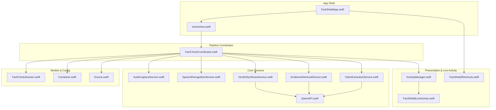
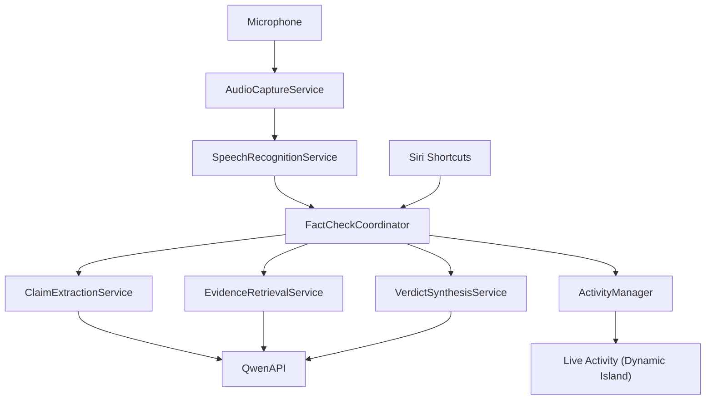
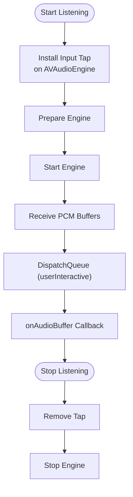
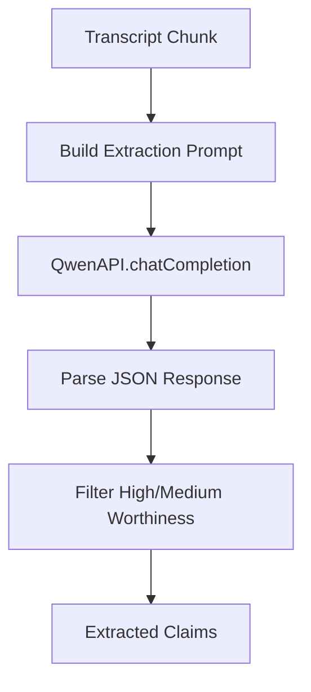
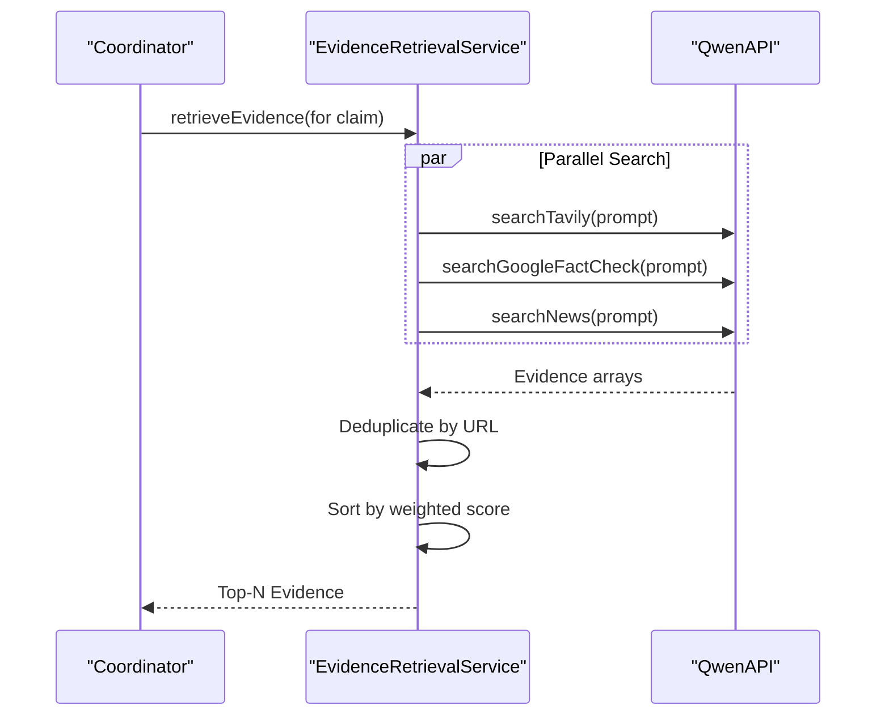
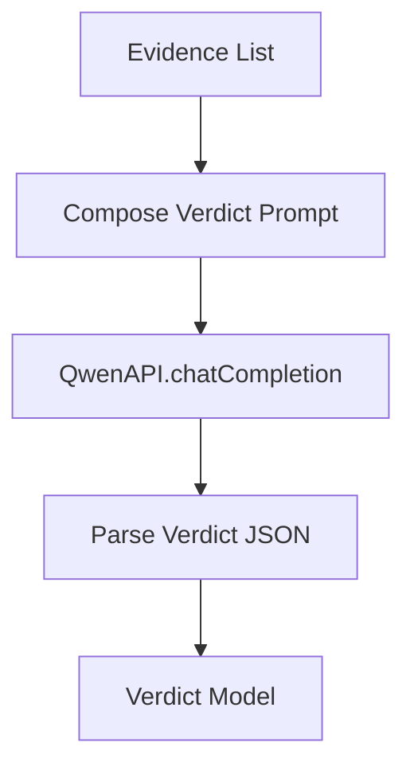
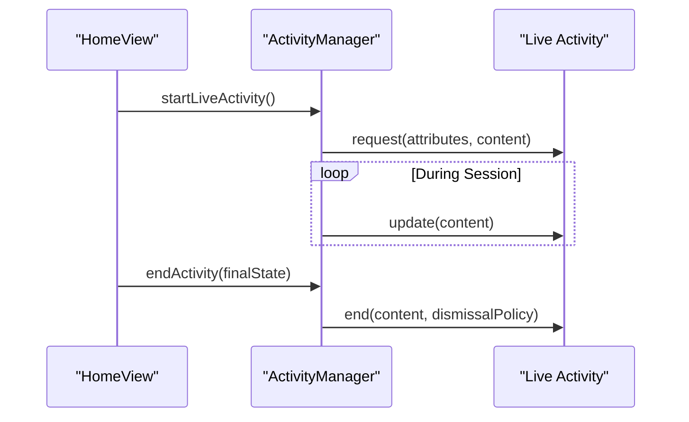
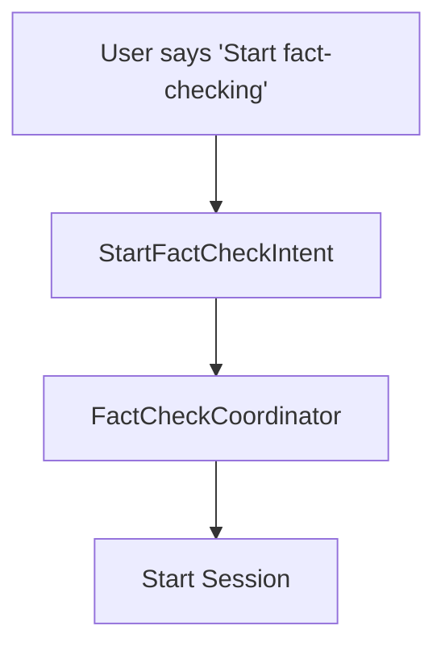
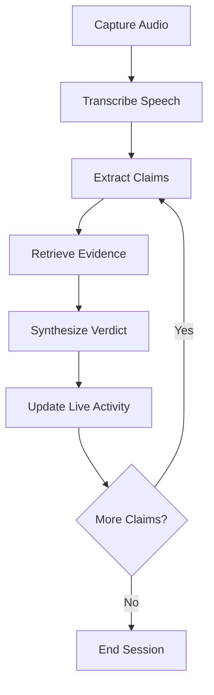
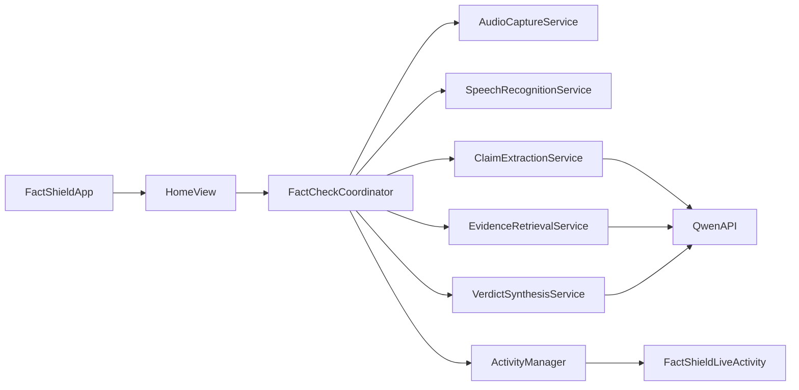

# Project Overview

<cite>
**Referenced Files in This Document**
- [FactShieldApp.swift](file://FactShield/FactShield/App/FactShieldApp.swift)
- [HomeView.swift](file://FactShield/FactShield/Features/Home/HomeView.swift)
- [FactCheckCoordinator.swift](file://FactShield/FactShield/Features/FactCheck/FactCheckCoordinator.swift)
- [FactCheckSession.swift](file://FactShield/FactShield/Models/FactCheckSession.swift)
- [AudioCaptureService.swift](file://FactShield/FactShield/Core/Audio/AudioCaptureService.swift)
- [SpeechRecognitionService.swift](file://FactShield/FactShield/Core/Speech/SpeechRecognitionService.swift)
- [ClaimExtractionService.swift](file://FactShield/FactShield/Core/Claims/ClaimExtractionService.swift)
- [EvidenceRetrievalService.swift](file://FactShield/FactShield/Core/Verification/EvidenceRetrievalService.swift)
- [VerdictSynthesisService.swift](file://FactShield/FactShield/Core/Verification/VerdictSynthesisService.swift)
- [QwenAPI.swift](file://FactShield/FactShield/Core/Network/QwenAPI.swift)
- [ActivityManager.swift](file://FactShield/FactShield/Widgets/ActivityManager.swift)
- [FactShieldLiveActivity.swift](file://FactShield/FactShield/Widgets/FactShieldLiveActivity.swift)
- [FactShieldShortcuts.swift](file://FactShield/FactShield/Intents/FactShieldShortcuts.swift)
- [Constants.swift](file://FactShield/FactShield/Utilities/Constants.swift)
- [Enums.swift](file://FactShield/FactShield/Models/Enums.swift)
</cite>

## Table of Contents
1. [Introduction](#introduction)
2. [Project Structure](#project-structure)
3. [Core Components](#core-components)
4. [Architecture Overview](#architecture-overview)
5. [Detailed Component Analysis](#detailed-component-analysis)
6. [Dependency Analysis](#dependency-analysis)
7. [Performance Considerations](#performance-considerations)
8. [Troubleshooting Guide](#troubleshooting-guide)
9. [Conclusion](#conclusion)
10. [Appendices](#appendices)

## Introduction
FactChecking Live (referred to as FactShield in the codebase) is a real-time fact-checking system designed to capture live audio from the environment, transcribe speech, extract verifiable claims, retrieve supporting or conflicting evidence from multiple sources, and synthesize factual verdicts. It surfaces results instantly via Live Activity with Dynamic Island integration and supports Siri Shortcuts for quick start/stop actions. The system targets users who want immediate, transparent fact-checking while watching videos, listening to podcasts, or participating in live events.

Value proposition:
- Real-time transparency: Instant verdict delivery in Dynamic Island during media consumption.
- Multi-source verification: Cross-checks claims across diverse sources to improve reliability.
- Accessibility: Siri Shortcuts enable hands-free control.
- Privacy-first design: On-device speech recognition preference and minimal data handling.

Target audience:
- General consumers seeking truth in real-time.
- Journalists and researchers needing rapid claim triage.
- Educators and students learning media literacy.

## Project Structure
The project follows a modular SwiftUI application architecture with feature-focused directories and a cohesive core pipeline:
- App entry and scenes define the UI shell and permissions.
- Features encapsulate user-facing flows (Home, FactCheck, Settings).
- Core houses audio capture, speech recognition, claim extraction, verification, and network services.
- Widgets integrate Live Activity and Dynamic Island.
- Intents provide Siri Shortcuts.
- Utilities centralize constants and shared enums.

**Diagram sources**
- [FactShieldApp.swift:1-127](file://FactShield/FactShield/App/FactShieldApp.swift#L1-L127)
- [HomeView.swift:1-233](file://FactShield/FactShield/Features/Home/HomeView.swift#L1-L233)
- [FactCheckCoordinator.swift:1-216](file://FactShield/FactShield/Features/FactCheck/FactCheckCoordinator.swift#L1-L216)
- [AudioCaptureService.swift:1-51](file://FactShield/FactShield/Core/Audio/AudioCaptureService.swift#L1-L51)
- [SpeechRecognitionService.swift:1-138](file://FactShield/FactShield/Core/Speech/SpeechRecognitionService.swift#L1-L138)
- [ClaimExtractionService.swift:1-152](file://FactShield/FactShield/Core/Claims/ClaimExtractionService.swift#L1-L152)
- [EvidenceRetrievalService.swift:1-233](file://FactShield/FactShield/Core/Verification/EvidenceRetrievalService.swift#L1-L233)
- [VerdictSynthesisService.swift:1-184](file://FactShield/FactShield/Core/Verification/VerdictSynthesisService.swift#L1-L184)
- [QwenAPI.swift:1-199](file://FactShield/FactShield/Core/Network/QwenAPI.swift#L1-L199)
- [ActivityManager.swift:1-87](file://FactShield/FactShield/Widgets/ActivityManager.swift#L1-L87)
- [FactShieldLiveActivity.swift:1-44](file://FactShield/FactShield/Widgets/FactShieldLiveActivity.swift#L1-L44)
- [FactShieldShortcuts.swift:1-27](file://FactShield/FactShield/Intents/FactShieldShortcuts.swift#L1-L27)
- [FactCheckSession.swift:1-54](file://FactShield/FactShield/Models/FactCheckSession.swift#L1-L54)
- [Constants.swift:1-37](file://FactShield/FactShield/Utilities/Constants.swift#L1-L37)
- [Enums.swift:1-48](file://FactShield/FactShield/Models/Enums.swift#L1-L48)

**Section sources**
- [FactShieldApp.swift:1-127](file://FactShield/FactShield/App/FactShieldApp.swift#L1-L127)
- [HomeView.swift:1-233](file://FactShield/FactShield/Features/Home/HomeView.swift#L1-L233)
- [FactCheckCoordinator.swift:1-216](file://FactShield/FactShield/Features/FactCheck/FactCheckCoordinator.swift#L1-L216)
- [Constants.swift:1-37](file://FactShield/FactShield/Utilities/Constants.swift#L1-L37)

## Core Components
- Real-time audio capture: Streams PCM buffers from the input node and exposes callbacks for downstream processing.
- Speech recognition: Uses on-device speech recognition when available, maintains a rolling transcript buffer, and reports partial/final results.
- Claim extraction: Sends recent transcript chunks to an LLM to extract verifiable claims with check-worthiness ratings.
- Evidence retrieval: Concurrently queries multiple simulated sources, deduplicates results, sorts by weighted scores, and returns top candidates.
- Verdict synthesis: Performs chain-of-thought reasoning across evidence to produce structured verdicts with confidence and reasoning.
- Live Activity with Dynamic Island: Starts, updates, and ends a Live Activity with status, verdict, confidence, and top sources.
- Siri Shortcuts: Provides “Start fact-checking” and “Stop fact-checking” shortcuts integrated with system intents.
- Session model: Tracks session lifecycle, capture mode, transcript, claims, and verdicts.

**Section sources**
- [AudioCaptureService.swift:1-51](file://FactShield/FactShield/Core/Audio/AudioCaptureService.swift#L1-L51)
- [SpeechRecognitionService.swift:1-138](file://FactShield/FactShield/Core/Speech/SpeechRecognitionService.swift#L1-L138)
- [ClaimExtractionService.swift:1-152](file://FactShield/FactShield/Core/Claims/ClaimExtractionService.swift#L1-L152)
- [EvidenceRetrievalService.swift:1-233](file://FactShield/FactShield/Core/Verification/EvidenceRetrievalService.swift#L1-L233)
- [VerdictSynthesisService.swift:1-184](file://FactShield/FactShield/Core/Verification/VerdictSynthesisService.swift#L1-L184)
- [ActivityManager.swift:1-87](file://FactShield/FactShield/Widgets/ActivityManager.swift#L1-L87)
- [FactShieldLiveActivity.swift:1-44](file://FactShield/FactShield/Widgets/FactShieldLiveActivity.swift#L1-L44)
- [FactShieldShortcuts.swift:1-27](file://FactShield/FactShield/Intents/FactShieldShortcuts.swift#L1-L27)
- [FactCheckSession.swift:1-54](file://FactShield/FactShield/Models/FactCheckSession.swift#L1-L54)

## Architecture Overview
The system orchestrates a real-time pipeline:
- Audio input feeds PCM buffers to the audio engine and is routed to the speech recognition subsystem.
- The speech recognition service builds a rolling transcript and exposes recent text to the coordinator.
- The coordinator periodically triggers claim extraction, evidence retrieval, and verdict synthesis.
- Live Activity receives continuous updates to reflect transcription, extraction, search, verification, and final verdict states.

**Diagram sources**
- [AudioCaptureService.swift:1-51](file://FactShield/FactShield/Core/Audio/AudioCaptureService.swift#L1-L51)
- [SpeechRecognitionService.swift:1-138](file://FactShield/FactShield/Core/Speech/SpeechRecognitionService.swift#L1-L138)
- [FactCheckCoordinator.swift:1-216](file://FactShield/FactShield/Features/FactCheck/FactCheckCoordinator.swift#L1-L216)
- [ClaimExtractionService.swift:1-152](file://FactShield/FactShield/Core/Claims/ClaimExtractionService.swift#L1-L152)
- [EvidenceRetrievalService.swift:1-233](file://FactShield/FactShield/Core/Verification/EvidenceRetrievalService.swift#L1-L233)
- [VerdictSynthesisService.swift:1-184](file://FactShield/FactShield/Core/Verification/VerdictSynthesisService.swift#L1-L184)
- [QwenAPI.swift:1-199](file://FactShield/FactShield/Core/Network/QwenAPI.swift#L1-L199)
- [ActivityManager.swift:1-87](file://FactShield/FactShield/Widgets/ActivityManager.swift#L1-L87)
- [FactShieldLiveActivity.swift:1-44](file://FactShield/FactShield/Widgets/FactShieldLiveActivity.swift#L1-L44)
- [FactShieldShortcuts.swift:1-27](file://FactShield/FactShield/Intents/FactShieldShortcuts.swift#L1-L27)

## Detailed Component Analysis

### Real-Time Audio Capture Modes
- Microphone capture: The audio engine installs a tap on the input node to stream PCM buffers to the pipeline.
- ReplayKit capture: Sessions support a system-audio capture mode, enabling fact-checking during screen recordings or broadcasts.
- Buffering and threading: Buffers are queued on a dedicated interactive QoS queue to keep UI responsive.

**Diagram sources**
- [AudioCaptureService.swift:19-49](file://FactShield/FactShield/Core/Audio/AudioCaptureService.swift#L19-L49)
- [FactCheckSession.swift:13-23](file://FactShield/FactShield/Models/FactCheckSession.swift#L13-L23)

**Section sources**
- [AudioCaptureService.swift:1-51](file://FactShield/FactShield/Core/Audio/AudioCaptureService.swift#L1-L51)
- [FactCheckSession.swift:1-54](file://FactShield/FactShield/Models/FactCheckSession.swift#L1-L54)

### AI-Powered Claim Extraction
- Prompting strategy: A structured prompt asks the LLM to extract verifiable claims and rate check-worthiness.
- Robust parsing: Handles fenced JSON and array fallbacks; cleans and decodes responses safely.
- Filtering: Filters to high/medium check-worthiness for prioritization.

**Diagram sources**
- [ClaimExtractionService.swift:26-56](file://FactShield/FactShield/Core/Claims/ClaimExtractionService.swift#L26-L56)
- [QwenAPI.swift:94-151](file://FactShield/FactShield/Core/Network/QwenAPI.swift#L94-L151)

**Section sources**
- [ClaimExtractionService.swift:1-152](file://FactShield/FactShield/Core/Claims/ClaimExtractionService.swift#L1-L152)
- [QwenAPI.swift:1-199](file://FactShield/FactShield/Core/Network/QwenAPI.swift#L1-L199)

### Multi-Source Evidence Retrieval
- Parallel retrieval: Queries multiple simulated sources concurrently (web search, fact-check databases, news).
- Deduplication: Removes duplicate URLs to avoid redundant presentation.
- Ranking: Sorts by a weighted score and caps the number of sources.
- Fallback: Uses model knowledge when no external evidence is found.

**Diagram sources**
- [EvidenceRetrievalService.swift:15-63](file://FactShield/FactShield/Core/Verification/EvidenceRetrievalService.swift#L15-L63)
- [QwenAPI.swift:86-151](file://FactShield/FactShield/Core/Network/QwenAPI.swift#L86-L151)

**Section sources**
- [EvidenceRetrievalService.swift:1-233](file://FactShield/FactShield/Core/Verification/EvidenceRetrievalService.swift#L1-L233)
- [QwenAPI.swift:1-199](file://FactShield/FactShield/Core/Network/QwenAPI.swift#L1-L199)

### Verdict Synthesis and Chain-of-Thought Reasoning
- Structured prompting: Requests a rigorous, transparent verdict with confidence and reasoning.
- JSON parsing: Validates and parses the response into a strongly-typed verdict model.
- No-evidence fallback: Generates a conservative verdict when external evidence is unavailable.

**Diagram sources**
- [VerdictSynthesisService.swift:41-80](file://FactShield/FactShield/Core/Verification/VerdictSynthesisService.swift#L41-L80)
- [QwenAPI.swift:94-151](file://FactShield/FactShield/Core/Network/QwenAPI.swift#L94-L151)

**Section sources**
- [VerdictSynthesisService.swift:1-184](file://FactShield/FactShield/Core/Verification/VerdictSynthesisService.swift#L1-L184)
- [QwenAPI.swift:1-199](file://FactShield/FactShield/Core/Network/QwenAPI.swift#L1-L199)

### Live Activity Integration with Dynamic Island
- Lifecycle: Starts a Live Activity with initial state, updates continuously, and ends upon session completion.
- State machine: Reflects listening, transcribing, extracting, searching, verifying, and complete stages.
- Push updates: Enables APNs push updates for timely UI refresh.

**Diagram sources**
- [ActivityManager.swift:16-67](file://FactShield/FactShield/Widgets/ActivityManager.swift#L16-L67)
- [FactShieldLiveActivity.swift:5-44](file://FactShield/FactShield/Widgets/FactShieldLiveActivity.swift#L5-L44)

**Section sources**
- [ActivityManager.swift:1-87](file://FactShield/FactShield/Widgets/ActivityManager.swift#L1-L87)
- [FactShieldLiveActivity.swift:1-44](file://FactShield/FactShield/Widgets/FactShieldLiveActivity.swift#L1-L44)

### Siri Shortcuts Support
- Intent definitions: Start and stop intents with natural-language phrases.
- App shortcut registration: Exposes “Fact-Check” and “Stop Fact-Check” to Siri and Shortcuts.

**Diagram sources**
- [FactShieldShortcuts.swift:3-25](file://FactShield/FactShield/Intents/FactShieldShortcuts.swift#L3-L25)
- [FactCheckCoordinator.swift:38-55](file://FactShield/FactShield/Features/FactCheck/FactCheckCoordinator.swift#L38-L55)

**Section sources**
- [FactShieldShortcuts.swift:1-27](file://FactShield/FactShield/Intents/FactShieldShortcuts.swift#L1-L27)
- [FactCheckCoordinator.swift:1-216](file://FactShield/FactShield/Features/FactCheck/FactCheckCoordinator.swift#L1-L216)

### Conceptual Overview
The end-to-end workflow is a continuous loop:
- Capture audio → Transcribe → Extract claims → Retrieve evidence → Synthesize verdict → Update Live Activity → Repeat.

[No sources needed since this diagram shows conceptual workflow, not actual code structure]

## Dependency Analysis
- Centralized orchestration: FactCheckCoordinator composes all services and timers.
- Network abstraction: QwenAPI encapsulates chat completions and response parsing.
- Live Activity state: FactShieldLiveActivity defines the schema for ActivityKit content.
- Permissions and UI: App requests microphone permission; HomeView controls session lifecycle and displays status.

**Diagram sources**
- [FactCheckCoordinator.swift:11-17](file://FactShield/FactShield/Features/FactCheck/FactCheckCoordinator.swift#L11-L17)
- [QwenAPI.swift:68-82](file://FactShield/FactShield/Core/Network/QwenAPI.swift#L68-L82)
- [ActivityManager.swift:9-13](file://FactShield/FactShield/Widgets/ActivityManager.swift#L9-L13)
- [FactShieldLiveActivity.swift:5-20](file://FactShield/FactShield/Widgets/FactShieldLiveActivity.swift#L5-L20)
- [FactShieldApp.swift:5-26](file://FactShield/FactShield/App/FactShieldApp.swift#L5-L26)
- [HomeView.swift:3-25](file://FactShield/FactShield/Features/Home/HomeView.swift#L3-L25)

**Section sources**
- [FactCheckCoordinator.swift:1-216](file://FactShield/FactShield/Features/FactCheck/FactCheckCoordinator.swift#L1-L216)
- [QwenAPI.swift:1-199](file://FactShield/FactShield/Core/Network/QwenAPI.swift#L1-L199)
- [ActivityManager.swift:1-87](file://FactShield/FactShield/Widgets/ActivityManager.swift#L1-L87)
- [FactShieldLiveActivity.swift:1-44](file://FactShield/FactShield/Widgets/FactShieldLiveActivity.swift#L1-L44)
- [FactShieldApp.swift:1-127](file://FactShield/FactShield/App/FactShieldApp.swift#L1-L127)
- [HomeView.swift:1-233](file://FactShield/FactShield/Features/Home/HomeView.swift#L1-L233)

## Performance Considerations
- On-device speech recognition: Preferred when available to reduce latency and preserve privacy.
- Rolling transcript buffer: Limits memory footprint and focuses recent context for claim extraction.
- Concurrency: Evidence retrieval runs in parallel across providers to minimize end-to-end latency.
- Throttled extraction: Periodic extraction prevents redundant processing and conserves resources.
- Live Activity updates: Coalesced updates reduce unnecessary UI churn.

[No sources needed since this section provides general guidance]

## Troubleshooting Guide
Common issues and diagnostics:
- Speech recognition not authorized: The app requests authorization at launch; ensure permissions are granted.
- Live Activities disabled: ActivityManager validates availability and surfaces errors when not enabled.
- API key missing: QwenAPI requires a configured key; otherwise, requests fail early.
- Audio engine start failure: Logs indicate engine preparation/start errors; verify hardware and permissions.

**Section sources**
- [FactShieldApp.swift:18-25](file://FactShield/FactShield/App/FactShieldApp.swift#L18-L25)
- [ActivityManager.swift:17-20](file://FactShield/FactShield/Widgets/ActivityManager.swift#L17-L20)
- [QwenAPI.swift:76-82](file://FactShield/FactShield/Core/Network/QwenAPI.swift#L76-L82)
- [AudioCaptureService.swift:33-39](file://FactShield/FactShield/Core/Audio/AudioCaptureService.swift#L33-L39)

## Conclusion
FactChecking Live delivers a practical, real-time fact-checking pipeline that turns ambient audio into actionable insights. Its modular architecture, Live Activity integration, and Siri Shortcuts make it both powerful and accessible. The system balances accuracy with responsiveness, leveraging on-device speech recognition and robust AI-driven extraction, retrieval, and synthesis to provide transparent, verifiable results in Dynamic Island.

[No sources needed since this section summarizes without analyzing specific files]

## Appendices

### Technology Stack Overview
- Platform: iOS with SwiftUI and UIKit components.
- Audio: AVFoundation for capture and AVAudioEngine.
- Speech: Speech framework for on-device recognition.
- AI/LLM: Qwen-compatible chat completions via a local client wrapper.
- Live Activity: ActivityKit for Dynamic Island updates.
- Siri Shortcuts: AppIntents for voice-driven controls.
- Networking: Encapsulated HTTP client with JSON parsing.

**Section sources**
- [QwenAPI.swift:1-199](file://FactShield/FactShield/Core/Network/QwenAPI.swift#L1-L199)
- [ActivityManager.swift:1-87](file://FactShield/FactShield/Widgets/ActivityManager.swift#L1-L87)
- [FactShieldShortcuts.swift:1-27](file://FactShield/FactShield/Intents/FactShieldShortcuts.swift#L1-L27)

### System Capabilities
- Real-time transcription and rolling claim extraction.
- Multi-source evidence aggregation with deduplication and ranking.
- Structured verdict synthesis with confidence and reasoning.
- Persistent Live Activity with push updates.
- Siri Shortcuts for quick start/stop.
- ReplayKit capture mode for system audio.

**Section sources**
- [SpeechRecognitionService.swift:116-136](file://FactShield/FactShield/Core/Speech/SpeechRecognitionService.swift#L116-L136)
- [EvidenceRetrievalService.swift:46-62](file://FactShield/FactShield/Core/Verification/EvidenceRetrievalService.swift#L46-L62)
- [VerdictSynthesisService.swift:30-80](file://FactShield/FactShield/Core/Verification/VerdictSynthesisService.swift#L30-L80)
- [ActivityManager.swift:40-47](file://FactShield/FactShield/Widgets/ActivityManager.swift#L40-L47)
- [FactShieldShortcuts.swift:4-25](file://FactShield/FactShield/Intents/FactShieldShortcuts.swift#L4-L25)
- [FactCheckSession.swift:13-23](file://FactShield/FactShield/Models/FactCheckSession.swift#L13-L23)