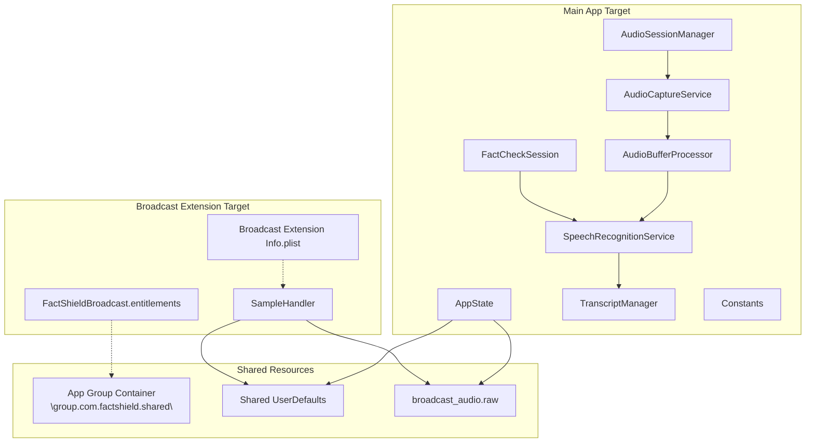
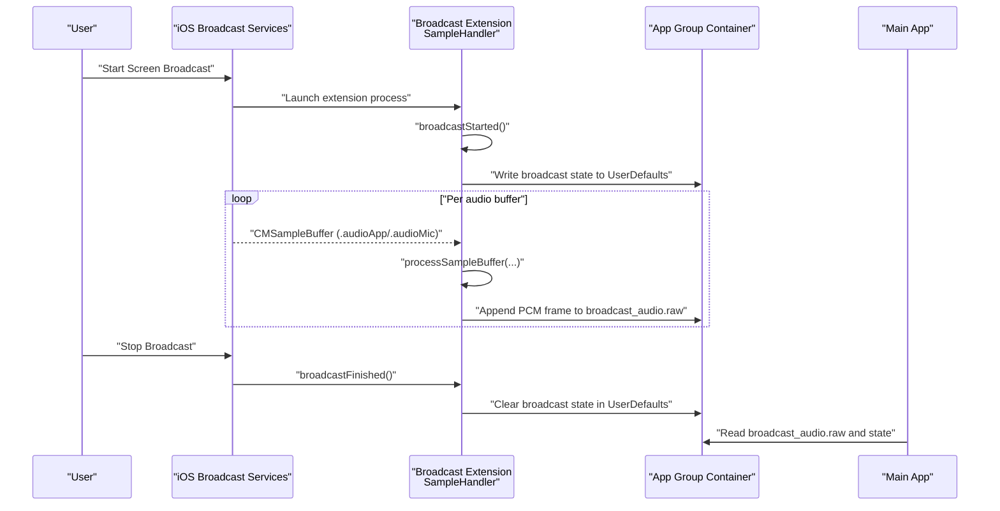
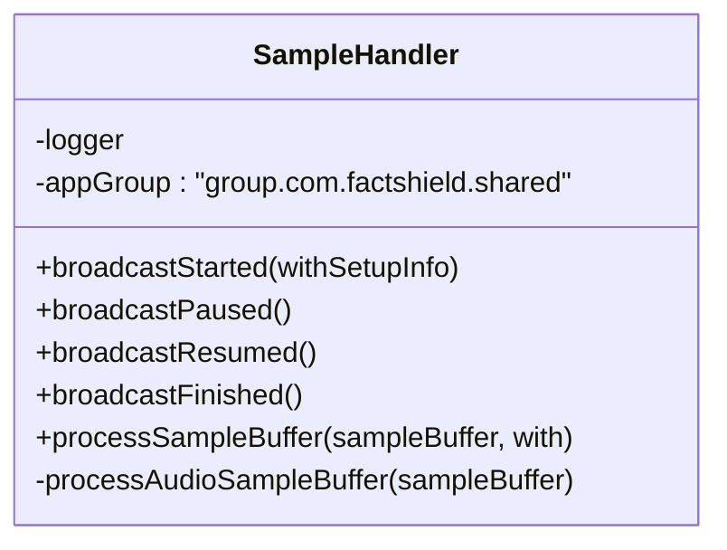
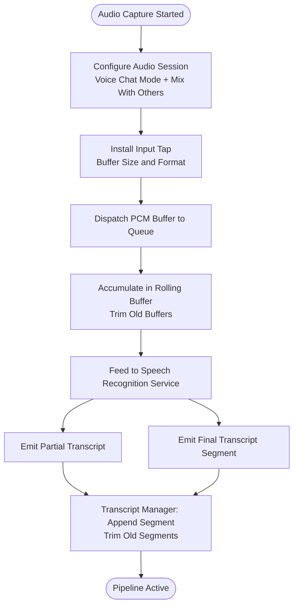
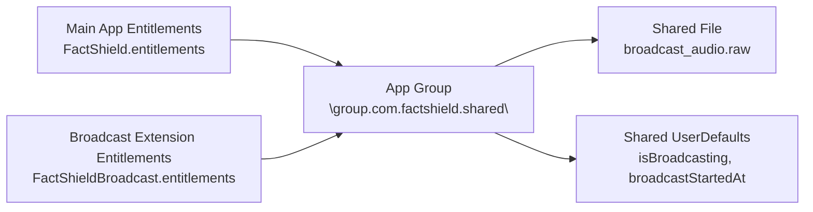
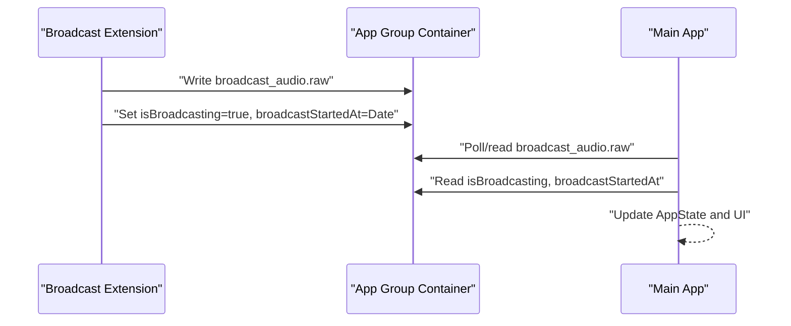
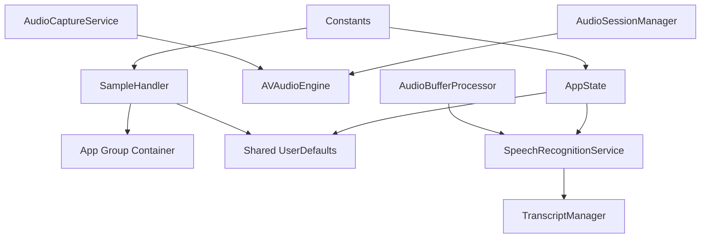

# Broadcast Extension

<cite>
**Referenced Files in This Document**
- [SampleHandler.swift](file://FactShield/FactShield/BroadcastExtension/SampleHandler.swift)
- [FactShieldBroadcast.entitlements](file://FactShield/FactShield/BroadcastExtension/FactShieldBroadcast.entitlements)
- [Info.plist](file://FactShield/FactShield/BroadcastExtension/Info.plist)
- [FactShield.entitlements](file://FactShield/FactShield/Resources/FactShield.entitlements)
- [Info.plist](file://FactShield/FactShield/Resources/Info.plist)
- [AudioSessionManager.swift](file://FactShield/FactShield/Core/Audio/AudioSessionManager.swift)
- [AudioCaptureService.swift](file://FactShield/FactShield/Core/Audio/AudioCaptureService.swift)
- [AudioBufferProcessor.swift](file://FactShield/FactShield/Core/Audio/AudioBufferProcessor.swift)
- [SpeechRecognitionService.swift](file://FactShield/FactShield/Core/Speech/SpeechRecognitionService.swift)
- [TranscriptManager.swift](file://FactShield/FactShield/Core/Speech/TranscriptManager.swift)
- [AppState.swift](file://FactShield/FactShield/App/AppState.swift)
- [Constants.swift](file://FactShield/FactShield/Utilities/Constants.swift)
- [FactCheckSession.swift](file://FactShield/FactShield/Models/FactCheckSession.swift)
- [FactShield-iOS-BuildInstructions.md](file://FactShield-iOS-BuildInstructions.md)
- [FactShield-Architecture.md](file://FactShield-Architecture.md)
</cite>

## Table of Contents
1. [Introduction](#introduction)
2. [Project Structure](#project-structure)
3. [Core Components](#core-components)
4. [Architecture Overview](#architecture-overview)
5. [Detailed Component Analysis](#detailed-component-analysis)
6. [Dependency Analysis](#dependency-analysis)
7. [Performance Considerations](#performance-considerations)
8. [Troubleshooting Guide](#troubleshooting-guide)
9. [Conclusion](#conclusion)
10. [Appendices](#appendices)

## Introduction
This document explains the ReplayKit broadcast extension implementation in FactChecking Live. It covers the SampleHandler class architecture, broadcast session lifecycle, audio processing pipeline, and system audio capture. It documents entitlements configuration, inter-app communication via App Groups, setup instructions for broadcast extension capabilities, audio processing constraints, and troubleshooting guidance grounded in the repository’s source files.

## Project Structure
The broadcast extension is implemented as a ReplayKit Broadcast Upload Extension with a dedicated SampleHandler entry point. Supporting audio and speech components reside in the main app target. App Group entitlements enable secure data exchange between the main app and the extension.

**Diagram sources**
- [SampleHandler.swift:1-85](file://FactShield/FactShield/BroadcastExtension/SampleHandler.swift#L1-L85)
- [FactShieldBroadcast.entitlements:1-11](file://FactShield/FactShield/BroadcastExtension/FactShieldBroadcast.entitlements#L1-L11)
- [Info.plist:1-16](file://FactShield/FactShield/BroadcastExtension/Info.plist#L1-L16)
- [AudioSessionManager.swift:1-23](file://FactShield/FactShield/Core/Audio/AudioSessionManager.swift#L1-L23)
- [AudioCaptureService.swift:1-51](file://FactShield/FactShield/Core/Audio/AudioCaptureService.swift#L1-L51)
- [AudioBufferProcessor.swift:1-42](file://FactShield/FactShield/Core/Audio/AudioBufferProcessor.swift#L1-L42)
- [SpeechRecognitionService.swift:1-138](file://FactShield/FactShield/Core/Speech/SpeechRecognitionService.swift#L1-L138)
- [TranscriptManager.swift:1-53](file://FactShield/FactShield/Core/Speech/TranscriptManager.swift#L1-L53)
- [AppState.swift:1-29](file://FactShield/FactShield/App/AppState.swift#L1-L29)
- [Constants.swift:1-36](file://FactShield/FactShield/Utilities/Constants.swift#L1-L36)
- [FactCheckSession.swift:1-54](file://FactShield/FactShield/Models/FactCheckSession.swift#L1-L54)

**Section sources**
- [SampleHandler.swift:1-85](file://FactShield/FactShield/BroadcastExtension/SampleHandler.swift#L1-L85)
- [Info.plist:1-16](file://FactShield/FactShield/BroadcastExtension/Info.plist#L1-L16)
- [FactShieldBroadcast.entitlements:1-11](file://FactShield/FactShield/BroadcastExtension/FactShieldBroadcast.entitlements#L1-L11)
- [FactShield.entitlements:1-11](file://FactShield/FactShield/Resources/FactShield.entitlements#L1-L11)
- [Info.plist:1-25](file://FactShield/FactShield/Resources/Info.plist#L1-L25)

## Core Components
- SampleHandler: Implements the ReplayKit broadcast extension entry point, manages broadcast lifecycle events, and streams audio buffers to the main app via App Group shared storage.
- AudioSessionManager: Configures the audio session for capture with AEC and mixing options suitable for concurrent playback.
- AudioCaptureService: Installs an AVAudioEngine input tap to deliver PCM buffers to the processing pipeline.
- AudioBufferProcessor: Maintains a rolling buffer of recent PCM audio and forwards buffers to the speech recognizer.
- SpeechRecognitionService: Orchestrates on-device speech recognition, partial and final results, and restart logic.
- TranscriptManager: Maintains a segmented transcript with timestamps and rolling trimming.
- AppState: Global state holder for permissions, broadcast state, and errors.
- Constants: Centralized identifiers and configuration values including App Group, bundle IDs, audio defaults, and UserDefaults keys.
- FactCheckSession: Data model representing a fact-check session with capture mode and status.

**Section sources**
- [SampleHandler.swift:1-85](file://FactShield/FactShield/BroadcastExtension/SampleHandler.swift#L1-L85)
- [AudioSessionManager.swift:1-23](file://FactShield/FactShield/Core/Audio/AudioSessionManager.swift#L1-L23)
- [AudioCaptureService.swift:1-51](file://FactShield/FactShield/Core/Audio/AudioCaptureService.swift#L1-L51)
- [AudioBufferProcessor.swift:1-42](file://FactShield/FactShield/Core/Audio/AudioBufferProcessor.swift#L1-L42)
- [SpeechRecognitionService.swift:1-138](file://FactShield/FactShield/Core/Speech/SpeechRecognitionService.swift#L1-L138)
- [TranscriptManager.swift:1-53](file://FactShield/FactShield/Core/Speech/TranscriptManager.swift#L1-L53)
- [AppState.swift:1-29](file://FactShield/FactShield/App/AppState.swift#L1-L29)
- [Constants.swift:1-36](file://FactShield/FactShield/Utilities/Constants.swift#L1-L36)
- [FactCheckSession.swift:1-54](file://FactShield/FactShield/Models/FactCheckSession.swift#L1-L54)

## Architecture Overview
The broadcast extension captures system audio delivered by iOS during a screen broadcast and writes raw PCM frames to a shared file in the App Group container. The main app monitors the shared container and UserDefaults to synchronize broadcast state and consume audio for transcription and verification.

**Diagram sources**
- [SampleHandler.swift:10-34](file://FactShield/FactShield/BroadcastExtension/SampleHandler.swift#L10-L34)
- [SampleHandler.swift:36-55](file://FactShield/FactShield/BroadcastExtension/SampleHandler.swift#L36-L55)
- [SampleHandler.swift:57-83](file://FactShield/FactShield/BroadcastExtension/SampleHandler.swift#L57-L83)
- [Info.plist:5-13](file://FactShield/FactShield/BroadcastExtension/Info.plist#L5-L13)
- [FactShieldBroadcast.entitlements:5-8](file://FactShield/FactShield/BroadcastExtension/FactShieldBroadcast.entitlements#L5-L8)

## Detailed Component Analysis

### SampleHandler Class
Responsibilities:
- Broadcast lifecycle management: start, pause, resume, finish.
- Audio buffer processing: handles .audioApp and .audioMic sample buffer types.
- Inter-process communication: writes audio frames to a shared file and updates shared UserDefaults to signal broadcast state.

Key behaviors:
- On broadcast start, sets a flag and timestamp in shared UserDefaults.
- On broadcast finish, clears the broadcast flag.
- For each audio buffer, extracts the raw PCM data and appends it to a shared file named “broadcast_audio.raw” inside the App Group container.
- Ignores video buffers as they are not used.

**Diagram sources**
- [SampleHandler.swift:4-85](file://FactShield/FactShield/BroadcastExtension/SampleHandler.swift#L4-L85)

**Section sources**
- [SampleHandler.swift:10-34](file://FactShield/FactShield/BroadcastExtension/SampleHandler.swift#L10-L34)
- [SampleHandler.swift:36-55](file://FactShield/FactShield/BroadcastExtension/SampleHandler.swift#L36-L55)
- [SampleHandler.swift:57-83](file://FactShield/FactShield/BroadcastExtension/SampleHandler.swift#L57-L83)

### Audio Processing Pipeline
End-to-end flow:
- AudioSessionManager configures the audio session for play-and-record with voice-chat mode to enable AEC and mixing with other audio.
- AudioCaptureService installs an input tap on the engine’s input node and dispatches PCM buffers to a callback queue.
- AudioBufferProcessor accumulates recent buffers and forwards them to SpeechRecognitionService.
- SpeechRecognitionService performs on-device recognition, emits partial and final transcripts, and restarts on transient errors.
- TranscriptManager maintains segments with timestamps and a rolling window trimmed by time.

**Diagram sources**
- [AudioSessionManager.swift:8-17](file://FactShield/FactShield/Core/Audio/AudioSessionManager.swift#L8-L17)
- [AudioCaptureService.swift:19-40](file://FactShield/FactShield/Core/Audio/AudioCaptureService.swift#L19-L40)
- [AudioBufferProcessor.swift:16-22](file://FactShield/FactShield/Core/Audio/AudioBufferProcessor.swift#L16-L22)
- [SpeechRecognitionService.swift:41-84](file://FactShield/FactShield/Core/Speech/SpeechRecognitionService.swift#L41-L84)
- [TranscriptManager.swift:26-46](file://FactShield/FactShield/Core/Speech/TranscriptManager.swift#L26-L46)

**Section sources**
- [AudioSessionManager.swift:8-17](file://FactShield/FactShield/Core/Audio/AudioSessionManager.swift#L8-L17)
- [AudioCaptureService.swift:19-40](file://FactShield/FactShield/Core/Audio/AudioCaptureService.swift#L19-L40)
- [AudioBufferProcessor.swift:16-22](file://FactShield/FactShield/Core/Audio/AudioBufferProcessor.swift#L16-L22)
- [SpeechRecognitionService.swift:41-84](file://FactShield/FactShield/Core/Speech/SpeechRecognitionService.swift#L41-L84)
- [TranscriptManager.swift:26-46](file://FactShield/FactShield/Core/Speech/TranscriptManager.swift#L26-L46)

### Entitlements and Security Model
- App Group entitlements: Both the main app and the broadcast extension declare the same App Group identifier to share data safely.
- Extension Info.plist: Declares the broadcast extension point identifier and principal class, and sets the sample buffer processing mode.
- Main app Info.plist: Declares microphone and speech recognition usage descriptions, and background modes.

**Diagram sources**
- [FactShield.entitlements:5-8](file://FactShield/FactShield/Resources/FactShield.entitlements#L5-L8)
- [FactShieldBroadcast.entitlements:5-8](file://FactShield/FactShield/BroadcastExtension/FactShieldBroadcast.entitlements#L5-L8)
- [Info.plist:7-12](file://FactShield/FactShield/BroadcastExtension/Info.plist#L7-L12)

**Section sources**
- [FactShield.entitlements:5-8](file://FactShield/FactShield/Resources/FactShield.entitlements#L5-L8)
- [FactShieldBroadcast.entitlements:5-8](file://FactShield/FactShield/BroadcastExtension/FactShieldBroadcast.entitlements#L5-L8)
- [Info.plist:5-13](file://FactShield/FactShield/BroadcastExtension/Info.plist#L5-L13)
- [Info.plist:5-22](file://FactShield/FactShield/Resources/Info.plist#L5-L22)

### Inter-App Communication Patterns
- Data sharing: The extension writes PCM frames to a shared file in the App Group container. The main app reads this file to reconstruct the audio stream for processing.
- State synchronization: The extension writes broadcast state flags and timestamps to shared UserDefaults. The main app reads these values to reflect live state.
- Constants: Centralized keys and identifiers ensure consistent cross-target communication.

**Diagram sources**
- [SampleHandler.swift:14-17](file://FactShield/FactShield/BroadcastExtension/SampleHandler.swift#L14-L17)
- [SampleHandler.swift:31-33](file://FactShield/FactShield/BroadcastExtension/SampleHandler.swift#L31-L33)
- [SampleHandler.swift:67-83](file://FactShield/FactShield/BroadcastExtension/SampleHandler.swift#L67-L83)
- [Constants.swift:28-31](file://FactShield/FactShield/Utilities/Constants.swift#L28-L31)

**Section sources**
- [SampleHandler.swift:14-17](file://FactShield/FactShield/BroadcastExtension/SampleHandler.swift#L14-L17)
- [SampleHandler.swift:31-33](file://FactShield/FactShield/BroadcastExtension/SampleHandler.swift#L31-L33)
- [SampleHandler.swift:67-83](file://FactShield/FactShield/BroadcastExtension/SampleHandler.swift#L67-L83)
- [Constants.swift:28-31](file://FactShield/FactShield/Utilities/Constants.swift#L28-L31)

## Dependency Analysis
- SampleHandler depends on the App Group container and shared UserDefaults for IPC.
- Audio pipeline components depend on AVFoundation and Speech frameworks.
- Speech recognition leverages on-device capabilities when available.
- Global state and constants coordinate cross-module behavior.

**Diagram sources**
- [SampleHandler.swift:4-85](file://FactShield/FactShield/BroadcastExtension/SampleHandler.swift#L4-L85)
- [AudioCaptureService.swift:1-51](file://FactShield/FactShield/Core/Audio/AudioCaptureService.swift#L1-L51)
- [AudioBufferProcessor.swift:1-42](file://FactShield/FactShield/Core/Audio/AudioBufferProcessor.swift#L1-L42)
- [SpeechRecognitionService.swift:1-138](file://FactShield/FactShield/Core/Speech/SpeechRecognitionService.swift#L1-L138)
- [TranscriptManager.swift:1-53](file://FactShield/FactShield/Core/Speech/TranscriptManager.swift#L1-L53)
- [AudioSessionManager.swift:1-23](file://FactShield/FactShield/Core/Audio/AudioSessionManager.swift#L1-L23)
- [AppState.swift:1-29](file://FactShield/FactShield/App/AppState.swift#L1-L29)
- [Constants.swift:1-36](file://FactShield/FactShield/Utilities/Constants.swift#L1-L36)

**Section sources**
- [SampleHandler.swift:4-85](file://FactShield/FactShield/BroadcastExtension/SampleHandler.swift#L4-L85)
- [AudioCaptureService.swift:1-51](file://FactShield/FactShield/Core/Audio/AudioCaptureService.swift#L1-L51)
- [AudioBufferProcessor.swift:1-42](file://FactShield/FactShield/Core/Audio/AudioBufferProcessor.swift#L1-L42)
- [SpeechRecognitionService.swift:1-138](file://FactShield/FactShield/Core/Speech/SpeechRecognitionService.swift#L1-L138)
- [TranscriptManager.swift:1-53](file://FactShield/FactShield/Core/Speech/TranscriptManager.swift#L1-L53)
- [AudioSessionManager.swift:1-23](file://FactShield/FactShield/Core/Audio/AudioSessionManager.swift#L1-L23)
- [AppState.swift:1-29](file://FactShield/FactShield/App/AppState.swift#L1-L29)
- [Constants.swift:1-36](file://FactShield/FactShield/Utilities/Constants.swift#L1-L36)

## Performance Considerations
- Memory constraints: The broadcast extension operates under a strict memory budget; writing raw PCM to disk is lightweight but still requires careful buffer sizes and minimal allocations.
- Buffer sizing: The audio pipeline uses a fixed buffer size for the input tap; tuning this value balances latency and CPU usage.
- Rolling windows: Both the audio buffer processor and transcript manager enforce time-based trimming to cap memory growth.
- Background modes: The main app declares background modes to keep audio processing alive during remote notifications and background fetch.
- AEC and mixing: Voice-chat mode with mixing ensures minimal echo and allows concurrent playback, improving user experience without extra CPU overhead from manual echo cancellation.

[No sources needed since this section provides general guidance]

## Troubleshooting Guide
Common issues and remedies grounded in the codebase:
- Broadcast does not start: Verify the extension Info.plist declares the correct extension point identifier and principal class, and that the App Group entitlements match in both targets.
- No audio captured: Confirm the audio session is configured for voice-chat mode and mixing; ensure the input tap is installed and buffers are dispatched.
- Transcription stops unexpectedly: Speech recognition restarts automatically on transient errors; check logs for recognition errors and ensure on-device recognition availability.
- State desynchronization: Ensure the extension writes to shared UserDefaults and the main app reads the same keys; confirm the App Group identifier is identical.
- Disk I/O contention: Writing raw PCM to a single shared file is simple but can cause contention; consider implementing a ring buffer or Darwin notifications for higher throughput.

**Section sources**
- [Info.plist:5-13](file://FactShield/FactShield/BroadcastExtension/Info.plist#L5-L13)
- [FactShieldBroadcast.entitlements:5-8](file://FactShield/FactShield/BroadcastExtension/FactShieldBroadcast.entitlements#L5-L8)
- [FactShield.entitlements:5-8](file://FactShield/FactShield/Resources/FactShield.entitlements#L5-L8)
- [AudioSessionManager.swift:8-17](file://FactShield/FactShield/Core/Audio/AudioSessionManager.swift#L8-L17)
- [AudioCaptureService.swift:19-40](file://FactShield/FactShield/Core/Audio/AudioCaptureService.swift#L19-L40)
- [SpeechRecognitionService.swift:103-114](file://FactShield/FactShield/Core/Speech/SpeechRecognitionService.swift#L103-L114)
- [SampleHandler.swift:14-17](file://FactShield/FactShield/BroadcastExtension/SampleHandler.swift#L14-L17)
- [SampleHandler.swift:31-33](file://FactShield/FactShield/BroadcastExtension/SampleHandler.swift#L31-L33)

## Conclusion
The broadcast extension integrates tightly with iOS’s ReplayKit to capture system audio and stream it to the main app via App Group IPC. The audio pipeline leverages AVFoundation and Speech frameworks to provide near-real-time transcription, while global state and constants ensure consistent behavior across targets. Adhering to the documented setup steps and performance considerations helps maintain reliability and battery life.

[No sources needed since this section summarizes without analyzing specific files]

## Appendices

### Setup Instructions
- Enable capabilities:
  - Add App Groups with the identifier used by both targets.
  - Add Microphone Usage Description and Speech Recognition Usage Description in the main app Info.plist.
- Create the broadcast extension target:
  - Choose Broadcast Upload Extension and set the bundle ID suffix and App Group.
- Configure extension Info.plist:
  - Set the extension point identifier, principal class, and sample buffer processing mode.
- Entitlements:
  - Ensure both the main app and extension declare the same App Group entitlement.

**Section sources**
- [FactShield-iOS-BuildInstructions.md:122-137](file://FactShield-iOS-BuildInstructions.md#L122-L137)
- [Info.plist:5-22](file://FactShield/FactShield/Resources/Info.plist#L5-L22)
- [Info.plist:5-13](file://FactShield/FactShield/BroadcastExtension/Info.plist#L5-L13)
- [FactShield.entitlements:5-8](file://FactShield/FactShield/Resources/FactShield.entitlements#L5-L8)
- [FactShieldBroadcast.entitlements:5-8](file://FactShield/FactShield/BroadcastExtension/FactShieldBroadcast.entitlements#L5-L8)

### Security and Compliance Notes
- App Group isolation: Data is confined to the declared App Group, preventing unauthorized access.
- Sandboxing: The broadcast extension runs in a restricted process with memory limits; avoid retaining large buffers.
- Guidelines adherence: Use ReplayKit’s approved audioApp capture path and respect user-initiated broadcasts.

**Section sources**
- [FactShield-iOS-BuildInstructions.md:2032-2032](file://FactShield-iOS-BuildInstructions.md#L2032-L2032)
- [FactShield-Architecture.md:368-376](file://FactShield-Architecture.md#L368-L376)