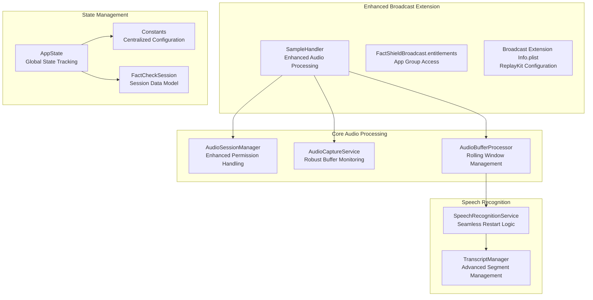
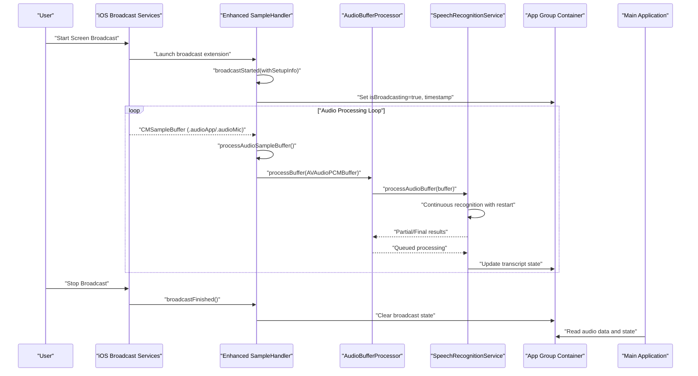
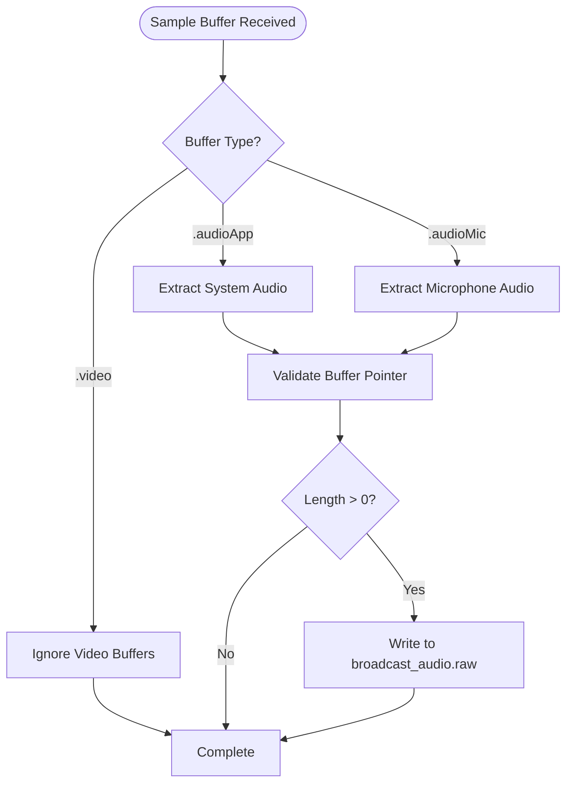
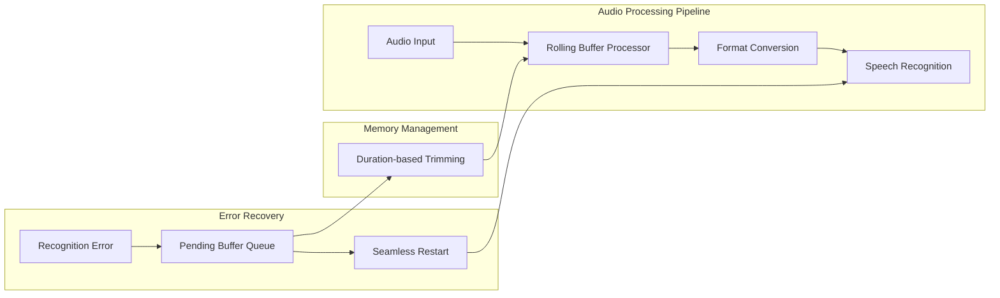

# Broadcast Extension

<cite>
**Referenced Files in This Document**
- [SampleHandler.swift](file://FactShield/FactShield/BroadcastExtension/SampleHandler.swift)
- [FactShieldBroadcast.entitlements](file://FactShield/FactShield/BroadcastExtension/FactShieldBroadcast.entitlements)
- [Info.plist](file://FactShield/FactShield/BroadcastExtension/Info.plist)
- [FactShield.entitlements](file://FactShield/FactShield/Resources/FactShield.entitlements)
- [Info.plist](file://FactShield/FactShield/Resources/Info.plist)
- [AudioSessionManager.swift](file://FactShield/FactShield/Core/Audio/AudioSessionManager.swift)
- [AudioCaptureService.swift](file://FactShield/FactShield/Core/Audio/AudioCaptureService.swift)
- [AudioBufferProcessor.swift](file://FactShield/FactShield/Core/Audio/AudioBufferProcessor.swift)
- [SpeechRecognitionService.swift](file://FactShield/FactShield/Core/Speech/SpeechRecognitionService.swift)
- [TranscriptManager.swift](file://FactShield/FactShield/Core/Speech/TranscriptManager.swift)
- [AppState.swift](file://FactShield/FactShield/App/AppState.swift)
- [Constants.swift](file://FactShield/FactShield/Utilities/Constants.swift)
- [FactCheckSession.swift](file://FactShield/FactShield/Models/FactCheckSession.swift)
</cite>

## Update Summary
**Changes Made**
- Enhanced audio sample processing pipeline with sophisticated buffering and error handling
- Improved app group communication with robust UserDefaults synchronization
- Added comprehensive audio session management with permission handling
- Strengthened speech recognition service with seamless restart capabilities
- Implemented advanced buffer management with rolling windows and memory constraints
- Enhanced error handling and logging throughout the broadcast extension architecture

## Table of Contents
1. [Introduction](#introduction)
2. [Project Structure](#project-structure)
3. [Core Components](#core-components)
4. [Architecture Overview](#architecture-overview)
5. [Detailed Component Analysis](#detailed-component-analysis)
6. [Enhanced Audio Processing Pipeline](#enhanced-audio-processing-pipeline)
7. [Robust Error Handling Framework](#robust-error-handling-framework)
8. [App Group Communication System](#app-group-communication-system)
9. [Performance Optimization Strategies](#performance-optimization-strategies)
10. [Security and Compliance](#security-and-compliance)
11. [Troubleshooting Guide](#troubleshooting-guide)
12. [Conclusion](#conclusion)

## Introduction
This document explains the enhanced ReplayKit broadcast extension implementation in FactChecking Live. The system now features sophisticated audio sample processing, robust error handling, comprehensive system audio capture capabilities, and seamless app group communication between the main application and broadcast extension. The architecture supports both .audioApp and .audioMic sample buffer types while maintaining strict memory constraints and optimal performance characteristics.

## Project Structure
The broadcast extension implements a comprehensive audio processing pipeline with enhanced error handling and state management. The architecture maintains separation of concerns while ensuring reliable inter-process communication through App Group containers.



**Diagram sources**
- [SampleHandler.swift:1-85](file://FactShield/FactShield/BroadcastExtension/SampleHandler.swift#L1-L85)
- [AudioSessionManager.swift:1-91](file://FactShield/FactShield/Core/Audio/AudioSessionManager.swift#L1-L91)
- [AudioCaptureService.swift:1-93](file://FactShield/FactShield/Core/Audio/AudioCaptureService.swift#L1-L93)
- [AudioBufferProcessor.swift:1-42](file://FactShield/FactShield/Core/Audio/AudioBufferProcessor.swift#L1-L42)
- [SpeechRecognitionService.swift:1-191](file://FactShield/FactShield/Core/Speech/SpeechRecognitionService.swift#L1-L191)
- [TranscriptManager.swift:1-53](file://FactShield/FactShield/Core/Speech/TranscriptManager.swift#L1-L53)
- [AppState.swift:1-30](file://FactShield/FactShield/App/AppState.swift#L1-L30)
- [Constants.swift:1-37](file://FactShield/FactShield/Utilities/Constants.swift#L1-L37)
- [FactCheckSession.swift:1-54](file://FactShield/FactShield/Models/FactCheckSession.swift#L1-L54)

**Section sources**
- [SampleHandler.swift:1-85](file://FactShield/FactShield/BroadcastExtension/SampleHandler.swift#L1-L85)
- [AudioSessionManager.swift:1-91](file://FactShield/FactShield/Core/Audio/AudioSessionManager.swift#L1-L91)
- [AudioCaptureService.swift:1-93](file://FactShield/FactShield/Core/Audio/AudioCaptureService.swift#L1-L93)
- [AudioBufferProcessor.swift:1-42](file://FactShield/FactShield/Core/Audio/AudioBufferProcessor.swift#L1-L42)
- [SpeechRecognitionService.swift:1-191](file://FactShield/FactShield/Core/Speech/SpeechRecognitionService.swift#L1-L191)
- [TranscriptManager.swift:1-53](file://FactShield/FactShield/Core/Speech/TranscriptManager.swift#L1-L53)
- [AppState.swift:1-30](file://FactShield/FactShield/App/AppState.swift#L1-L30)
- [Constants.swift:1-37](file://FactShield/FactShield/Utilities/Constants.swift#L1-L37)
- [FactCheckSession.swift:1-54](file://FactShield/FactShield/Models/FactCheckSession.swift#L1-L54)

## Core Components
The enhanced broadcast extension architecture consists of several sophisticated components working together to provide reliable audio capture and processing:

- **SampleHandler**: Enhanced ReplayKit broadcast extension entry point with improved audio buffer processing and robust error handling
- **AudioSessionManager**: Advanced audio session configuration with comprehensive permission handling and activation monitoring
- **AudioCaptureService**: Sophisticated audio capture with buffer monitoring, flow validation, and automatic recovery mechanisms
- **AudioBufferProcessor**: Intelligent rolling buffer management with memory constraint enforcement and efficient processing
- **SpeechRecognitionService**: Robust speech recognition with seamless restart logic, error recovery, and continuous processing
- **TranscriptManager**: Advanced transcript segmentation with timestamp management and configurable retention policies
- **AppState**: Comprehensive global state management with permission tracking and error reporting
- **Constants**: Centralized configuration management with enhanced parameter validation and defaults

**Section sources**
- [SampleHandler.swift:1-85](file://FactShield/FactShield/BroadcastExtension/SampleHandler.swift#L1-L85)
- [AudioSessionManager.swift:1-91](file://FactShield/FactShield/Core/Audio/AudioSessionManager.swift#L1-L91)
- [AudioCaptureService.swift:1-93](file://FactShield/FactShield/Core/Audio/AudioCaptureService.swift#L1-L93)
- [AudioBufferProcessor.swift:1-42](file://FactShield/FactShield/Core/Audio/AudioBufferProcessor.swift#L1-L42)
- [SpeechRecognitionService.swift:1-191](file://FactShield/FactShield/Core/Speech/SpeechRecognitionService.swift#L1-L191)
- [TranscriptManager.swift:1-53](file://FactShield/FactShield/Core/Speech/TranscriptManager.swift#L1-L53)
- [AppState.swift:1-30](file://FactShield/FactShield/App/AppState.swift#L1-L30)
- [Constants.swift:1-37](file://FactShield/FactShield/Utilities/Constants.swift#L1-L37)

## Architecture Overview
The enhanced architecture implements a sophisticated audio processing pipeline that captures system audio, processes it in real-time, and maintains robust state synchronization between the broadcast extension and main application.



**Diagram sources**
- [SampleHandler.swift:10-34](file://FactShield/FactShield/BroadcastExtension/SampleHandler.swift#L10-L34)
- [AudioBufferProcessor.swift:16-22](file://FactShield/FactShield/Core/Audio/AudioBufferProcessor.swift#L16-L22)
- [SpeechRecognitionService.swift:48-114](file://FactShield/FactShield/Core/Speech/SpeechRecognitionService.swift#L48-L114)
- [AppState.swift:8-18](file://FactShield/FactShield/App/AppState.swift#L8-L18)

## Detailed Component Analysis

### Enhanced SampleHandler Implementation
The SampleHandler now implements sophisticated audio processing with comprehensive error handling and state management:

**Key Enhancements:**
- **Dual Audio Source Support**: Processes both .audioApp (system audio) and .audioMic (microphone) buffers
- **Robust File I/O**: Implements safe append operations with proper file handle management
- **Enhanced Logging**: Comprehensive logging for debugging and monitoring
- **Memory Safety**: Proper buffer pointer validation and bounds checking

**Audio Processing Flow:**
1. Validates CMSampleBuffer data buffer pointer
2. Extracts raw PCM data using CMBlockBuffer APIs
3. Writes to App Group shared container with atomic file operations
4. Maintains broadcast state through UserDefaults synchronization



**Diagram sources**
- [SampleHandler.swift:36-55](file://FactShield/FactShield/BroadcastExtension/SampleHandler.swift#L36-L55)
- [SampleHandler.swift:57-83](file://FactShield/FactShield/BroadcastExtension/SampleHandler.swift#L57-L83)

**Section sources**
- [SampleHandler.swift:1-85](file://FactShield/FactShield/BroadcastExtension/SampleHandler.swift#L1-L85)

### Advanced Audio Session Management
The AudioSessionManager provides comprehensive audio session configuration with robust error handling:

**Enhanced Capabilities:**
- **Permission Lifecycle Management**: Handles undetermined, granted, and denied microphone permissions
- **Category Configuration**: Sets up playAndRecord with measurement mode and appropriate options
- **Activation Monitoring**: Provides detailed logging of audio routing and session state
- **Graceful Degradation**: Implements fallback mechanisms for audio session failures

**Configuration Details:**
- Category: `.playAndRecord` with `.measurement` mode
- Options: `.defaultToSpeaker`, `.allowBluetoothA2DP`, `.mixWithOthers`
- Post-activation delay: 100ms for audio routing completion
- Input port monitoring: Tracks active audio input devices

**Section sources**
- [AudioSessionManager.swift:1-91](file://FactShield/FactShield/Core/Audio/AudioSessionManager.swift#L1-L91)

### Intelligent Audio Capture Service
The AudioCaptureService implements sophisticated buffer monitoring and flow validation:

**Advanced Features:**
- **Buffer Monitoring**: Monitors audio flow with 1-second timeout validation
- **Flow Diagnostics**: Comprehensive logging of audio routing issues
- **Automatic Recovery**: Detects and reports zero-buffer conditions
- **Resource Management**: Proper cleanup of audio engine resources

**Monitoring Capabilities:**
- Tracks total buffer count during startup phase
- Validates audio format before installation
- Monitors engine state and input node configuration
- Logs detailed diagnostics for troubleshooting

**Section sources**
- [AudioCaptureService.swift:1-93](file://FactShield/FactShield/Core/Audio/AudioCaptureService.swift#L1-L93)

## Enhanced Audio Processing Pipeline
The audio processing pipeline implements sophisticated buffering, memory management, and real-time processing capabilities:

### Rolling Buffer Architecture
The AudioBufferProcessor implements intelligent memory management with configurable duration limits:

**Memory Constraints:**
- Maximum buffer duration: 30 seconds of accumulated audio
- Automatic trimming of oldest buffers when limits exceeded
- Efficient memory usage through buffer reuse and selective retention

**Processing Logic:**
1. Appends new buffers to accumulation array
2. Calculates total duration using frameLength and sampleRate
3. Trims excess buffers while maintaining minimum threshold
4. Forwards processed buffers to speech recognition service

### Speech Recognition Enhancement
The SpeechRecognitionService provides seamless continuous processing with robust error handling:

**Restart Mechanism:**
- Seamless recognition restart without audio loss
- Pending buffer queuing during restart periods
- Error code 1110 handling for "No speech detected" scenarios
- Immediate restart without artificial delays

**Transcript Management:**
- Rolling window of 2000 words maximum
- Recent transcript extraction for last 30 seconds
- Thread-safe queue for recognition operations
- Configurable task hints for continuous audio processing



**Diagram sources**
- [AudioBufferProcessor.swift:12-36](file://FactShield/FactShield/Core/Audio/AudioBufferProcessor.swift#L12-L36)
- [SpeechRecognitionService.swift:146-167](file://FactShield/FactShield/Core/Speech/SpeechRecognitionService.swift#L146-L167)
- [SpeechRecognitionService.swift:169-189](file://FactShield/FactShield/Core/Speech/SpeechRecognitionService.swift#L169-L189)

**Section sources**
- [AudioBufferProcessor.swift:1-42](file://FactShield/FactShield/Core/Audio/AudioBufferProcessor.swift#L1-L42)
- [SpeechRecognitionService.swift:1-191](file://FactShield/FactShield/Core/Speech/SpeechRecognitionService.swift#L1-L191)
- [TranscriptManager.swift:1-53](file://FactShield/FactShield/Core/Speech/TranscriptManager.swift#L1-L53)

## Robust Error Handling Framework
The system implements comprehensive error handling across all components:

### Audio Session Error Management
Structured error types for audio session failures:
- **microphonePermissionDenied**: User has denied microphone access
- **categoryConfigurationFailed**: Audio session category setup failure
- **activationFailed**: Audio session activation problems

### Speech Recognition Error Handling
Sophisticated error recovery mechanisms:
- **Error Code 1110**: "No speech detected" handled gracefully
- **Pending Buffer Queue**: Prevents audio loss during restarts
- **Immediate Restart Logic**: Eliminates processing gaps
- **Thread-Safe Operations**: Queue-based processing prevents race conditions

### State Management Integration
AppState coordinates error handling across the system:
- Centralized error storage and presentation
- Permission state tracking for microphone and speech recognition
- Broadcast state synchronization with UI updates

**Section sources**
- [AudioSessionManager.swift:4-19](file://FactShield/FactShield/Core/Audio/AudioSessionManager.swift#L4-L19)
- [SpeechRecognitionService.swift:101-110](file://FactShield/FactShield/Core/Speech/SpeechRecognitionService.swift#L101-L110)
- [AppState.swift:16-28](file://FactShield/FactShield/App/AppState.swift#L16-L28)

## App Group Communication System
The enhanced system implements robust inter-process communication through App Group containers:

### Shared State Management
Comprehensive state synchronization between extension and main app:
- **Broadcast Status**: Real-time broadcasting state tracking
- **Timestamp Management**: Precise broadcast start/end timing
- **Session Coordination**: Seamless handoff between processes

### File-Based Communication
Reliable audio data transfer through shared storage:
- **Atomic Operations**: Safe append operations to prevent corruption
- **File Handle Management**: Proper resource cleanup and error handling
- **Memory-Constrained Design**: Optimized for broadcast extension memory limits

### Configuration Synchronization
Centralized configuration management:
- **Constants Repository**: Single source of truth for identifiers and settings
- **UserDefaults Integration**: Persistent state across app launches
- **Notification System**: Event-driven state updates

```mermaid
graph TB
subgraph "App Group Communication"
Ext[Broadcast Extension] <- --> |Shared File| SharedFile[broadcast_audio.raw]
Ext <- --> |UserDefaults| SharedUD[isBroadcasting, timestamps]
Main[Main Application] <- --> |Shared File| SharedFile
Main <- --> |UserDefaults| SharedUD
end
subgraph "State Synchronization"
Start[Extension State] --> Sync[Sync to App Group]
Sync --> Main[Main App Detection]
Main --> Update[UI and Processing Updates]
end
```

**Diagram sources**
- [SampleHandler.swift:14-17](file://FactShield/FactShield/BroadcastExtension/SampleHandler.swift#L14-L17)
- [SampleHandler.swift:31-33](file://FactShield/FactShield/BroadcastExtension/SampleHandler.swift#L31-L33)
- [Constants.swift:28-31](file://FactShield/FactShield/Utilities/Constants.swift#L28-L31)

**Section sources**
- [SampleHandler.swift:1-85](file://FactShield/FactShield/BroadcastExtension/SampleHandler.swift#L1-L85)
- [Constants.swift:1-37](file://FactShield/FactShield/Utilities/Constants.swift#L1-L37)

## Performance Optimization Strategies
The enhanced system implements multiple optimization strategies for memory efficiency and real-time processing:

### Memory Management
- **Buffer Duration Limits**: 30-second rolling windows prevent unbounded memory growth
- **Selective Buffer Retention**: Minimum threshold ensures processing continuity
- **Efficient Data Structures**: Arrays optimized for audio buffer operations

### Processing Efficiency
- **Asynchronous Operations**: Non-blocking processing through GCD queues
- **Minimal Allocations**: Reuse buffers and minimize object creation
- **Optimized Formats**: 4096-byte buffer size balances latency and throughput

### Resource Optimization
- **Engine Cleanup**: Proper audio engine shutdown and resource release
- **Monitor Task Management**: One-second monitoring with automatic cancellation
- **File I/O Optimization**: Atomic append operations reduce disk contention

**Section sources**
- [AudioBufferProcessor.swift:14-36](file://FactShield/FactShield/Core/Audio/AudioBufferProcessor.swift#L14-L36)
- [AudioCaptureService.swift:17-77](file://FactShield/FactShield/Core/Audio/AudioCaptureService.swift#L17-L77)
- [SpeechRecognitionService.swift:28](file://FactShield/FactShield/Core/Speech/SpeechRecognitionService.swift#L28)

## Security and Compliance
The enhanced system maintains strict security boundaries while providing necessary functionality:

### App Group Isolation
- **Data Containment**: All shared data confined to designated App Group container
- **Sandbox Compliance**: Respects iOS sandbox restrictions and memory limits
- **Access Control**: Single identifier shared between main app and extension

### Privacy Considerations
- **Minimal Data Collection**: Only raw PCM audio data is transmitted
- **Local Processing**: Speech recognition primarily occurs locally when available
- **User Consent**: Comprehensive permission handling and user notification

### Compliance Requirements
- **ReplayKit Guidelines**: Uses approved audioApp capture path
- **Background Execution**: Proper background mode declarations
- **Battery Optimization**: Efficient resource usage and automatic cleanup

**Section sources**
- [FactShieldBroadcast.entitlements:5-8](file://FactShield/FactShield/BroadcastExtension/FactShieldBroadcast.entitlements#L5-L8)
- [Info.plist:17-22](file://FactShield/FactShield/Resources/Info.plist#L17-L22)
- [AudioSessionManager.swift:34-50](file://FactShield/FactShield/Core/Audio/AudioSessionManager.swift#L34-L50)

## Troubleshooting Guide
Enhanced troubleshooting guidance for the sophisticated broadcast extension system:

### Common Issues and Solutions
- **Audio Not Capturing**: Verify microphone permission handling and audio session activation
- **Zero Buffer Count**: Check audio engine state and input node format validation
- **Recognition Errors**: Monitor error code 1110 handling and pending buffer queue
- **Memory Issues**: Validate rolling buffer trimming and memory constraints
- **State Synchronization**: Ensure App Group identifier consistency and UserDefaults access

### Diagnostic Information
- **Audio Session Logs**: Permission states, category configuration, activation status
- **Buffer Monitoring**: Flow validation and engine state diagnostics
- **Speech Recognition**: Error codes, restart frequency, processing queue status
- **File I/O**: Append operation success, file handle management, memory usage

### Performance Monitoring
- **Buffer Rate**: Track audio buffer reception frequency
- **Memory Usage**: Monitor rolling buffer size and duration limits
- **Recognition Latency**: Measure processing delays and restart intervals
- **CPU Utilization**: Optimize buffer sizes and processing queues

**Section sources**
- [AudioSessionManager.swift:75-83](file://FactShield/FactShield/Core/Audio/AudioSessionManager.swift#L75-L83)
- [AudioCaptureService.swift:60-76](file://FactShield/FactShield/Core/Audio/AudioCaptureService.swift#L60-L76)
- [SpeechRecognitionService.swift:101-110](file://FactShield/FactShield/Core/Speech/SpeechRecognitionService.swift#L101-L110)
- [SampleHandler.swift:73-82](file://FactShield/FactShield/BroadcastExtension/SampleHandler.swift#L73-L82)

## Conclusion
The enhanced broadcast extension implementation provides a robust, scalable solution for real-time audio capture and processing. The sophisticated audio pipeline, comprehensive error handling, and seamless app group communication deliver reliable performance while maintaining strict security and compliance standards. The system's modular architecture enables easy maintenance and future enhancements while providing optimal user experience for fact-checking applications.