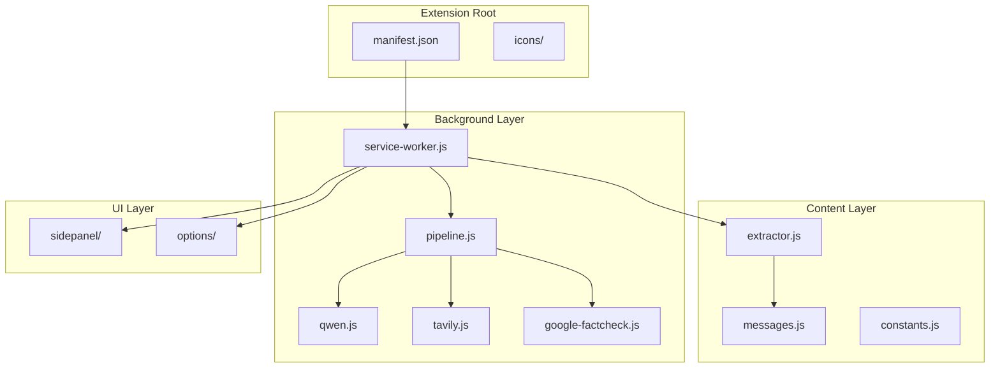
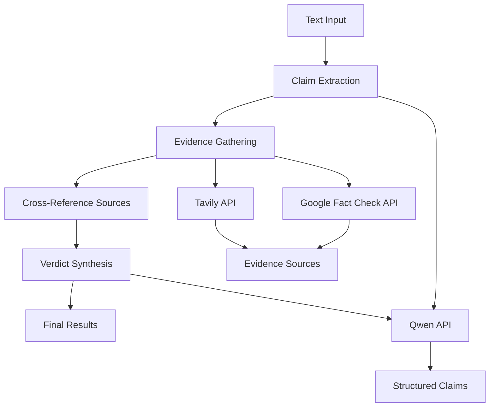
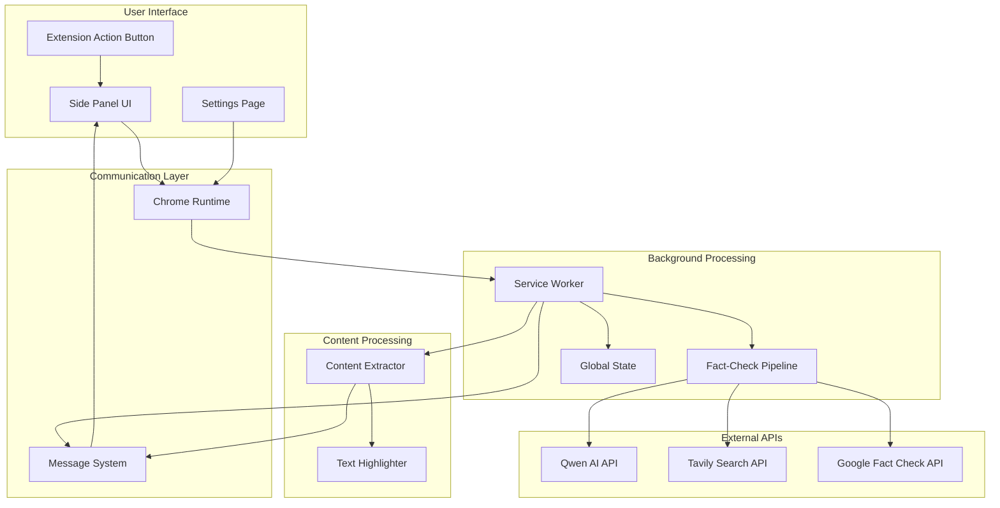
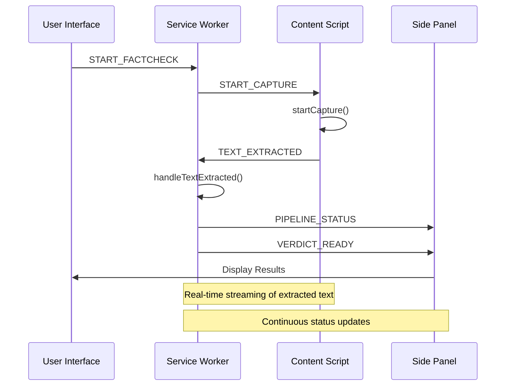
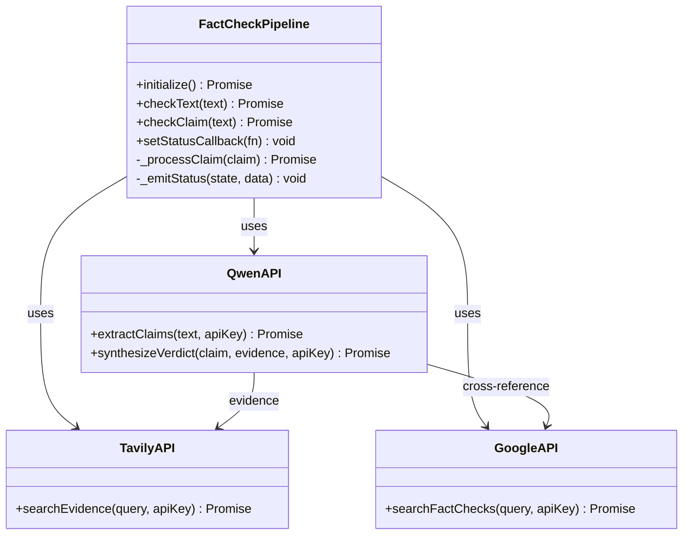
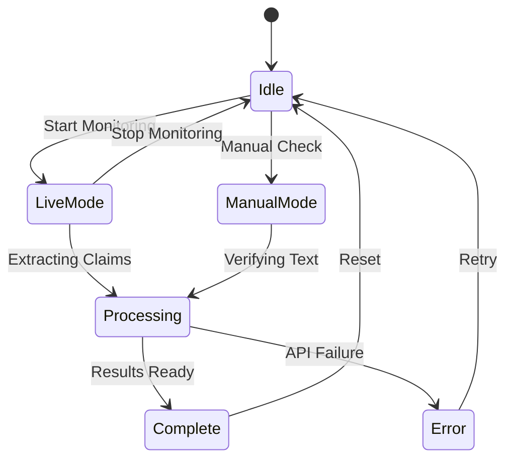
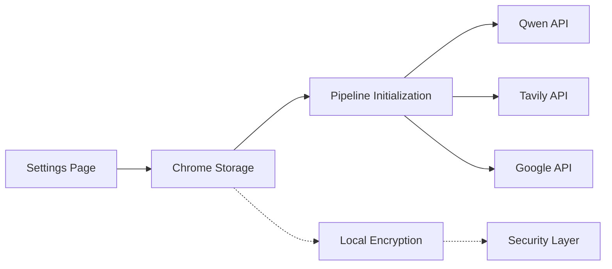

# Chrome Extension Integration

<cite>
**Referenced Files in This Document**
- [manifest.json](file://FactShield-ChromeExtension/manifest.json)
- [service-worker.js](file://FactShield-ChromeExtension/src/background/service-worker.js)
- [extractor.js](file://FactShield-ChromeExtension/src/content/extractor.js)
- [constants.js](file://FactShield-ChromeExtension/src/shared/constants.js)
- [messages.js](file://FactShield-ChromeExtension/src/shared/messages.js)
- [pipeline.js](file://FactShield-ChromeExtension/src/api/pipeline.js)
- [qwen.js](file://FactShield-ChromeExtension/src/api/qwen.js)
- [tavily.js](file://FactShield-ChromeExtension/src/api/tavily.js)
- [google-factcheck.js](file://FactShield-ChromeExtension/src/api/google-factcheck.js)
- [app.js](file://FactShield-ChromeExtension/src/sidepanel/app.js)
- [index.html](file://FactShield-ChromeExtension/src/sidepanel/index.html)
- [styles.css](file://FactShield-ChromeExtension/src/sidepanel/styles.css)
- [options.js](file://FactShield-ChromeExtension/src/options/options.js)
- [generate-icons.html](file://FactShield-ChromeExtension/icons/generate-icons.html)
</cite>

## Table of Contents
1. [Introduction](#introduction)
2. [Project Structure](#project-structure)
3. [Core Components](#core-components)
4. [Architecture Overview](#architecture-overview)
5. [Detailed Component Analysis](#detailed-component-analysis)
6. [Integration Points](#integration-points)
7. [Performance Considerations](#performance-considerations)
8. [Troubleshooting Guide](#troubleshooting-guide)
9. [Conclusion](#conclusion)

## Introduction

The Chrome Extension Integration represents a sophisticated real-time fact-checking system that combines multiple AI-powered APIs to verify claims extracted from various online platforms. This extension seamlessly integrates with popular websites like YouTube, Instagram, Twitter, and Spotify to provide instant fact-checking capabilities.

The system operates through a multi-layered architecture that captures audio and text content, extracts verifiable claims using advanced AI models, gathers evidence from multiple sources, and synthesizes authoritative verdicts with confidence ratings and detailed reasoning.

## Project Structure

The Chrome Extension follows a modular architecture with clear separation of concerns across different functional areas:

**Diagram sources**
- [manifest.json:1-57](file://FactShield-ChromeExtension/manifest.json#L1-L57)
- [service-worker.js:1-250](file://FactShield-ChromeExtension/src/background/service-worker.js#L1-L250)
- [extractor.js:1-394](file://FactShield-ChromeExtension/src/content/extractor.js#L1-L394)

**Section sources**
- [manifest.json:1-57](file://FactShield-ChromeExtension/manifest.json#L1-L57)
- [service-worker.js:1-250](file://FactShield-ChromeExtension/src/background/service-worker.js#L1-L250)

## Core Components

### Background Service Worker

The service worker acts as the central coordinator for the entire extension, managing state, routing messages, and orchestrating the fact-checking pipeline. It maintains a comprehensive state object that tracks the current active tab, pipeline status, extracted claims, and verdicts.

Key responsibilities include:
- **Message Routing**: Handles communication between different extension components
- **State Management**: Maintains global state across extension sessions
- **Pipeline Coordination**: Controls the fact-checking workflow from extraction to verdict synthesis
- **Side Panel Communication**: Broadcasts status updates and results to the side panel interface

### Content Script Extractor

The content script runs on target websites to capture audio and text content in real-time. It implements platform-specific extraction logic for YouTube captions, Twitter posts, Instagram content, and generic web pages.

Platform detection capabilities include:
- **YouTube**: Captures live captions and video metadata
- **Twitter/X**: Extracts tweet text from timeline elements
- **Instagram**: Parses post captions and user-generated content
- **Generic Sites**: Implements intelligent content extraction from article and blog content

### Fact-Checking Pipeline

The pipeline orchestrates the complete fact-checking workflow through multiple stages:

**Diagram sources**
- [pipeline.js:65-113](file://FactShield-ChromeExtension/src/api/pipeline.js#L65-L113)
- [qwen.js:38-94](file://FactShield-ChromeExtension/src/api/qwen.js#L38-L94)
- [tavily.js:12-52](file://FactShield-ChromeExtension/src/api/tavily.js#L12-L52)
- [google-factcheck.js:12-49](file://FactShield-ChromeExtension/src/api/google-factcheck.js#L12-L49)

**Section sources**
- [service-worker.js:88-240](file://FactShield-ChromeExtension/src/background/service-worker.js#L88-L240)
- [extractor.js:181-197](file://FactShield-ChromeExtension/src/content/extractor.js#L181-L197)
- [pipeline.js:13-204](file://FactShield-ChromeExtension/src/api/pipeline.js#L13-L204)

## Architecture Overview

The extension implements a distributed architecture with clear separation between background processing, content extraction, and user interface components:

**Diagram sources**
- [service-worker.js:44-86](file://FactShield-ChromeExtension/src/background/service-worker.js#L44-L86)
- [messages.js:4-26](file://FactShield-ChromeExtension/src/shared/messages.js#L4-L26)
- [app.js:88-145](file://FactShield-ChromeExtension/src/sidepanel/app.js#L88-L145)

The architecture ensures loose coupling between components while maintaining efficient communication through Chrome's messaging system. The side panel provides real-time feedback on the fact-checking process, displaying extracted claims, evidence sources, and final verdicts.

**Section sources**
- [manifest.json:20-56](file://FactShield-ChromeExtension/manifest.json#L20-L56)
- [service-worker.js:17-32](file://FactShield-ChromeExtension/src/background/service-worker.js#L17-L32)

## Detailed Component Analysis

### Message Communication System

The extension uses a comprehensive message-based communication system that enables seamless interaction between different components:

**Diagram sources**
- [messages.js:4-26](file://FactShield-ChromeExtension/src/shared/messages.js#L4-L26)
- [service-worker.js:62-86](file://FactShield-ChromeExtension/src/background/service-worker.js#L62-L86)
- [extractor.js:369-390](file://FactShield-ChromeExtension/src/content/extractor.js#L369-L390)

The message system defines clear protocols for different types of communication:
- **Content to Background**: Text extraction events and page context information
- **Background to Side Panel**: Pipeline status updates and processed results
- **Background to Content**: Control commands for capture lifecycle and highlighting

### API Integration Architecture

The extension integrates with multiple external APIs to provide comprehensive fact-checking capabilities:

**Diagram sources**
- [pipeline.js:13-204](file://FactShield-ChromeExtension/src/api/pipeline.js#L13-L204)
- [qwen.js:38-178](file://FactShield-ChromeExtension/src/api/qwen.js#L38-L178)
- [tavily.js:12-52](file://FactShield-ChromeExtension/src/api/tavily.js#L12-L52)
- [google-factcheck.js:12-49](file://FactShield-ChromeExtension/src/api/google-factcheck.js#L12-L49)

Each API integration implements specific error handling and retry mechanisms to ensure robust operation under varying network conditions.

### Side Panel User Interface

The side panel provides an intuitive interface for users to monitor and control the fact-checking process:

**Diagram sources**
- [app.js:4-18](file://FactShield-ChromeExtension/src/sidepanel/app.js#L4-L18)
- [app.js:148-174](file://FactShield-ChromeExtension/src/sidepanel/app.js#L148-L174)

The interface supports two primary modes:
- **Live Monitoring Mode**: Automatically captures and processes content from supported platforms
- **Manual Verification Mode**: Allows users to paste text for immediate fact-checking

**Section sources**
- [app.js:222-458](file://FactShield-ChromeExtension/src/sidepanel/app.js#L222-L458)
- [options.js:32-74](file://FactShield-ChromeExtension/src/options/options.js#L32-L74)

## Integration Points

### Platform-Specific Content Extraction

The extension implements sophisticated content extraction strategies tailored to different platforms:

| Platform | Extraction Method | Key Features |
|----------|-------------------|--------------|
| YouTube | Caption parsing + metadata extraction | Real-time caption updates, video title/description parsing |
| Twitter/X | Timeline element scraping | Tweet text extraction, user context preservation |
| Instagram | Post content parsing | Caption extraction, media context handling |
| Generic Sites | Intelligent content detection | Article content identification, ad filtering |

### API Key Management and Security

The extension implements secure API key management through Chrome's storage system:

**Diagram sources**
- [options.js:52-74](file://FactShield-ChromeExtension/src/options/options.js#L52-L74)
- [pipeline.js:25-46](file://FactShield-ChromeExtension/src/api/pipeline.js#L25-L46)

**Section sources**
- [constants.js:31-37](file://FactShield-ChromeExtension/src/shared/constants.js#L31-L37)
- [options.js:77-95](file://FactShield-ChromeExtension/src/options/options.js#L77-L95)

## Performance Considerations

### Memory Management and Cleanup

The extension implements comprehensive cleanup mechanisms to prevent memory leaks:

- **Mutation Observers**: Properly disconnected when capturing stops
- **Event Listeners**: Cleaned up during component unmount
- **Interval Management**: Timers cleared on shutdown
- **DOM Manipulation**: Previous highlights removed before applying new ones

### Network Optimization

Multiple strategies ensure efficient API usage:
- **Rate Limiting**: Exponential backoff for API throttling
- **Parallel Processing**: Concurrent evidence gathering from multiple sources
- **Result Deduplication**: Elimination of duplicate sources across APIs
- **Configurable Limits**: Adjustable source limits per claim

### Real-Time Processing Constraints

The system handles real-time content streams efficiently:
- **Debounced Updates**: Prevents excessive processing of rapid content changes
- **Content Filtering**: Ignores short or unchanged content segments
- **Platform-Specific Optimizations**: Tailored extraction strategies for different content types

## Troubleshooting Guide

### Common Issues and Solutions

**API Key Configuration Problems**
- Verify API keys are properly stored in Chrome storage
- Test connection to external APIs from settings page
- Check API quota limits and billing status

**Content Extraction Failures**
- Confirm website is in supported platform list
- Check for JavaScript errors in content script console
- Verify platform-specific selectors are still valid

**Performance Issues**
- Adjust extraction interval settings
- Disable unnecessary features like automatic YouTube startup
- Monitor browser resource usage during intensive fact-checking sessions

### Debugging Tools

The extension provides built-in debugging capabilities:
- **Console Logging**: Extensive logging throughout the pipeline
- **State Inspection**: Real-time state monitoring in side panel
- **Error Reporting**: Comprehensive error messages with stack traces

**Section sources**
- [service-worker.js:50-57](file://FactShield-ChromeExtension/src/background/service-worker.js#L50-L57)
- [app.js:389-421](file://FactShield-ChromeExtension/src/sidepanel/app.js#L389-L421)

## Conclusion

The Chrome Extension Integration represents a sophisticated solution for real-time fact-checking that effectively combines multiple AI-powered APIs to provide comprehensive verification capabilities. The modular architecture ensures maintainability and extensibility while the real-time processing capabilities deliver immediate value to users.

Key strengths of the implementation include:
- **Robust Architecture**: Clear separation of concerns with efficient communication
- **Platform Coverage**: Support for major social media and content platforms
- **API Integration**: Strategic use of multiple external APIs for comprehensive coverage
- **User Experience**: Intuitive interface with real-time feedback and progress indication
- **Performance Optimization**: Efficient resource management and network utilization

The extension successfully bridges the gap between complex AI systems and everyday users, making advanced fact-checking capabilities accessible through a simple browser extension interface.