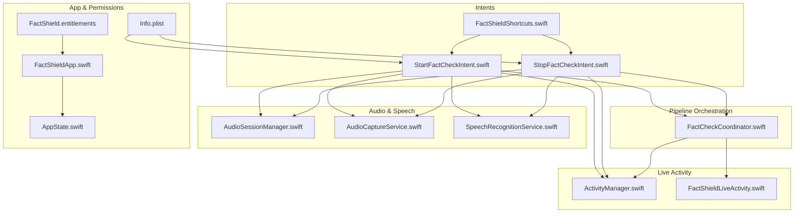
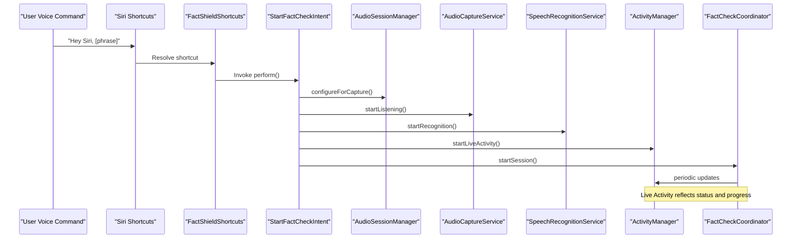
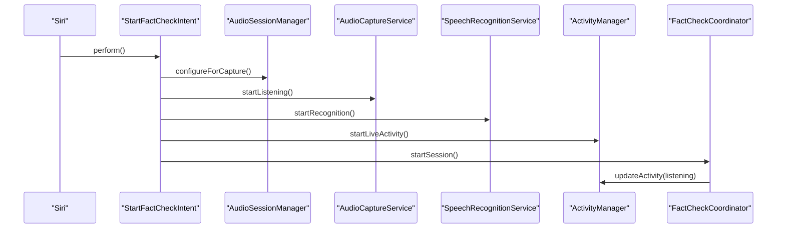
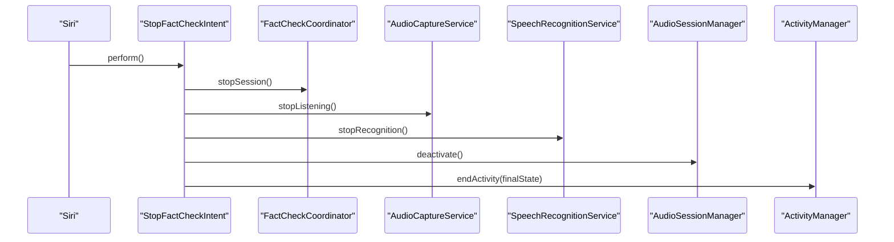
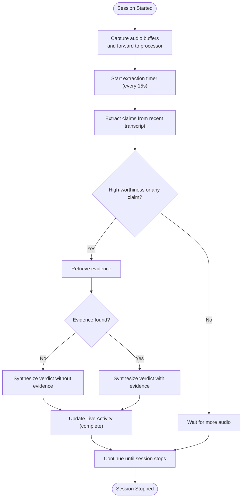
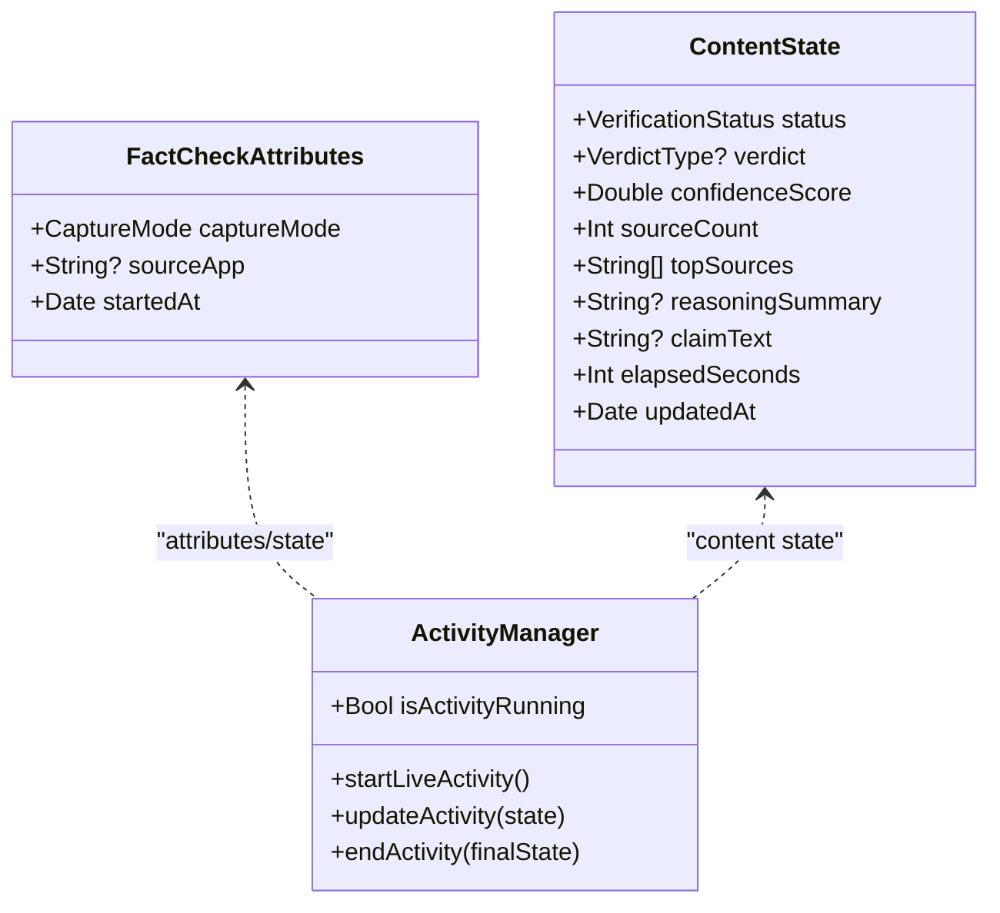
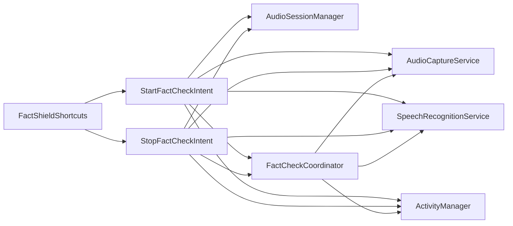

# Siri Shortcuts Integration

<cite>
**Referenced Files in This Document**
- [FactShieldShortcuts.swift](file://FactShield/FactShield/Intents/FactShieldShortcuts.swift)
- [StartFactCheckIntent.swift](file://FactShield/FactShield/Intents/StartFactCheckIntent.swift)
- [StopFactCheckIntent.swift](file://FactShield/FactShield/Intents/StopFactCheckIntent.swift)
- [FactShieldApp.swift](file://FactShield/FactShield/App/FactShieldApp.swift)
- [AppState.swift](file://FactShield/FactShield/App/AppState.swift)
- [FactCheckCoordinator.swift](file://FactShield/FactShield/Features/FactCheck/FactCheckCoordinator.swift)
- [ActivityManager.swift](file://FactShield/FactShield/Widgets/ActivityManager.swift)
- [FactShieldLiveActivity.swift](file://FactShield/FactShield/Widgets/FactShieldLiveActivity.swift)
- [AudioSessionManager.swift](file://FactShield/FactShield/Core/Audio/AudioSessionManager.swift)
- [AudioCaptureService.swift](file://FactShield/FactShield/Core/Audio/AudioCaptureService.swift)
- [SpeechRecognitionService.swift](file://FactShield/FactShield/Core/Speech/SpeechRecognitionService.swift)
- [Info.plist](file://FactShield/FactShield/Resources/Info.plist)
- [FactShield.entitlements](file://FactShield/FactShield/Resources/FactShield.entitlements)
</cite>

## Table of Contents
1. [Introduction](#introduction)
2. [Project Structure](#project-structure)
3. [Core Components](#core-components)
4. [Architecture Overview](#architecture-overview)
5. [Detailed Component Analysis](#detailed-component-analysis)
6. [Dependency Analysis](#dependency-analysis)
7. [Performance Considerations](#performance-considerations)
8. [Troubleshooting Guide](#troubleshooting-guide)
9. [Privacy and Permissions](#privacy-and-permissions)
10. [Conclusion](#conclusion)
11. [Appendices](#appendices)

## Introduction
This document explains the Siri Shortcuts integration in FactChecking Live. It covers how the StartFactCheckIntent and StopFactCheckIntent are defined and executed, how the FactShieldShortcuts provider registers Siri phrases, and how the intents connect to the core fact-checking pipeline. It also provides step-by-step setup instructions, voice command patterns, accessibility considerations, error handling guidance, and privacy-related permissions.

## Project Structure
The Siri Shortcuts integration is centered around three intent definitions and a provider that surfaces them to Siri. These intents orchestrate the audio pipeline, speech recognition, Live Activity updates, and the FactCheckCoordinator lifecycle.

**Diagram sources**
- [FactShieldShortcuts.swift:3-26](file://FactShield/FactShield/Intents/FactShieldShortcuts.swift#L3-L26)
- [StartFactCheckIntent.swift:4-28](file://FactShield/FactShield/Intents/StartFactCheckIntent.swift#L4-L28)
- [StopFactCheckIntent.swift:3-42](file://FactShield/FactShield/Intents/StopFactCheckIntent.swift#L3-L42)
- [FactCheckCoordinator.swift:5-202](file://FactShield/FactShield/Features/FactCheck/FactCheckCoordinator.swift#L5-L202)
- [AudioSessionManager.swift:4-22](file://FactShield/FactShield/Core/Audio/AudioSessionManager.swift#L4-L22)
- [AudioCaptureService.swift:4-50](file://FactShield/FactShield/Core/Audio/AudioCaptureService.swift#L4-L50)
- [SpeechRecognitionService.swift:5-420](file://FactShield/FactShield/Core/Speech/SpeechRecognitionService.swift#L5-L420)
- [ActivityManager.swift:4-87](file://FactShield/FactShield/Widgets/ActivityManager.swift#L4-L87)
- [FactShieldLiveActivity.swift:5-43](file://FactShield/FactShield/Widgets/FactShieldLiveActivity.swift#L5-L43)
- [FactShieldApp.swift:4-26](file://FactShield/FactShield/App/FactShieldApp.swift#L4-L26)
- [AppState.swift:3-29](file://FactShield/FactShield/App/AppState.swift#L3-L29)
- [Info.plist:4-24](file://FactShield/FactShield/Resources/Info.plist#L4-L24)
- [FactShield.entitlements:4-10](file://FactShield/FactShield/Resources/FactShield.entitlements#L4-L10)

**Section sources**
- [FactShieldShortcuts.swift:3-26](file://FactShield/FactShield/Intents/FactShieldShortcuts.swift#L3-L26)
- [StartFactCheckIntent.swift:4-28](file://FactShield/FactShield/Intents/StartFactCheckIntent.swift#L4-L28)
- [StopFactCheckIntent.swift:3-42](file://FactShield/FactShield/Intents/StopFactCheckIntent.swift#L3-L42)
- [FactCheckCoordinator.swift:5-202](file://FactShield/FactShield/Features/FactCheck/FactCheckCoordinator.swift#L5-L202)
- [AudioSessionManager.swift:4-22](file://FactShield/FactShield/Core/Audio/AudioSessionManager.swift#L4-L22)
- [AudioCaptureService.swift:4-50](file://FactShield/FactShield/Core/Audio/AudioCaptureService.swift#L4-L50)
- [SpeechRecognitionService.swift:5-420](file://FactShield/FactShield/Core/Speech/SpeechRecognitionService.swift#L5-L420)
- [ActivityManager.swift:4-87](file://FactShield/FactShield/Widgets/ActivityManager.swift#L4-L87)
- [FactShieldLiveActivity.swift:5-43](file://FactShield/FactShield/Widgets/FactShieldLiveActivity.swift#L5-L43)
- [FactShieldApp.swift:4-26](file://FactShield/FactShield/App/FactShieldApp.swift#L4-L26)
- [AppState.swift:3-29](file://FactShield/FactShield/App/AppState.swift#L3-L29)
- [Info.plist:4-24](file://FactShield/FactShield/Resources/Info.plist#L4-L24)
- [FactShield.entitlements:4-10](file://FactShield/FactShield/Resources/FactShield.entitlements#L4-L10)

## Core Components
- FactShieldShortcuts: Registers two Siri Shortcuts—“Start a quick fact-check” and “Stop the current fact-check”—with Siri phrases and icons.
- StartFactCheckIntent: Performs background initialization of audio capture, speech recognition, Live Activity, and starts the FactCheckCoordinator.
- StopFactCheckIntent: Stops the coordinator, captures the final transcript, deactivates the audio session, and ends the Live Activity with a final state derived from the current verdict and claim.
- FactCheckCoordinator: Orchestrates the end-to-end pipeline, periodically extracting claims, retrieving evidence, synthesizing verdicts, and updating Live Activity.
- ActivityManager and FactShieldLiveActivity: Manage the Live Activity lifecycle and define the attributes/state shown on the Live Activity.
- AudioSessionManager, AudioCaptureService, SpeechRecognitionService: Provide the audio capture, session configuration, and speech transcription pipeline.
- App and Permissions: FactShieldApp requests microphone permission; AppState tracks permissions and errors.

**Section sources**
- [FactShieldShortcuts.swift:3-26](file://FactShield/FactShield/Intents/FactShieldShortcuts.swift#L3-L26)
- [StartFactCheckIntent.swift:4-28](file://FactShield/FactShield/Intents/StartFactCheckIntent.swift#L4-L28)
- [StopFactCheckIntent.swift:3-42](file://FactShield/FactShield/Intents/StopFactCheckIntent.swift#L3-L42)
- [FactCheckCoordinator.swift:5-202](file://FactShield/FactShield/Features/FactCheck/FactCheckCoordinator.swift#L5-L202)
- [ActivityManager.swift:4-87](file://FactShield/FactShield/Widgets/ActivityManager.swift#L4-L87)
- [FactShieldLiveActivity.swift:5-43](file://FactShield/FactShield/Widgets/FactShieldLiveActivity.swift#L5-L43)
- [AudioSessionManager.swift:4-22](file://FactShield/FactShield/Core/Audio/AudioSessionManager.swift#L4-L22)
- [AudioCaptureService.swift:4-50](file://FactShield/FactShield/Core/Audio/AudioCaptureService.swift#L4-L50)
- [SpeechRecognitionService.swift:5-420](file://FactShield/FactShield/Core/Speech/SpeechRecognitionService.swift#L5-L420)
- [FactShieldApp.swift:4-26](file://FactShield/FactShield/App/FactShieldApp.swift#L4-L26)
- [AppState.swift:3-29](file://FactShield/FactShield/App/AppState.swift#L3-L29)

## Architecture Overview
The Siri Shortcuts intents act as entry points to the background audio and fact-checking pipeline. They coordinate service initialization and teardown while delegating the core logic to the FactCheckCoordinator and Live Activity subsystem.

**Diagram sources**
- [FactShieldShortcuts.swift:3-26](file://FactShield/FactShield/Intents/FactShieldShortcuts.swift#L3-L26)
- [StartFactCheckIntent.swift:9-27](file://FactShield/FactShield/Intents/StartFactCheckIntent.swift#L9-L27)
- [AudioSessionManager.swift:8-17](file://FactShield/FactShield/Core/Audio/AudioSessionManager.swift#L8-L17)
- [AudioCaptureService.swift:19-40](file://FactShield/FactShield/Core/Audio/AudioCaptureService.swift#L19-L40)
- [SpeechRecognitionService.swift:41-76](file://FactShield/FactShield/Core/Speech/SpeechRecognitionService.swift#L41-L76)
- [ActivityManager.swift:16-48](file://FactShield/FactShield/Widgets/ActivityManager.swift#L16-L48)
- [FactCheckCoordinator.swift:38-55](file://FactShield/FactShield/Features/FactCheck/FactCheckCoordinator.swift#L38-L55)

## Detailed Component Analysis

### FactShieldShortcuts Provider
- Registers two App Shortcut intents:
  - StartFactCheckIntent with phrases like “Start fact-checking with [app]”, “Fact-check this with [app]”, and “Quick fact-check with [app]”.
  - StopFactCheckIntent with phrases like “Stop fact-checking with [app]” and “End fact-check with [app]”.
- Uses system image names for visual representation in the Shortcuts app and Siri suggestions.

**Section sources**
- [FactShieldShortcuts.swift:3-26](file://FactShield/FactShield/Intents/FactShieldShortcuts.swift#L3-L26)

### StartFactCheckIntent
- Behavior:
  - Configures the audio session for capture.
  - Starts audio capture via the capture service.
  - Starts speech recognition.
  - Starts Live Activity.
  - Begins the FactCheckCoordinator session.
- Execution pattern:
  - Runs in the background without opening the app.
  - Uses @MainActor for UI/Live Activity updates.
- User feedback:
  - Live Activity transitions to a “listening” state.
  - Subsequent stages (transcribing, extracting, searching, verifying, complete) are reflected in periodic updates.

**Diagram sources**
- [StartFactCheckIntent.swift:9-27](file://FactShield/FactShield/Intents/StartFactCheckIntent.swift#L9-L27)
- [AudioSessionManager.swift:8-17](file://FactShield/FactShield/Core/Audio/AudioSessionManager.swift#L8-L17)
- [AudioCaptureService.swift:19-40](file://FactShield/FactShield/Core/Audio/AudioCaptureService.swift#L19-L40)
- [SpeechRecognitionService.swift:41-76](file://FactShield/FactShield/Core/Speech/SpeechRecognitionService.swift#L41-L76)
- [ActivityManager.swift:16-48](file://FactShield/FactShield/Widgets/ActivityManager.swift#L16-L48)
- [FactCheckCoordinator.swift:38-55](file://FactShield/FactShield/Features/FactCheck/FactCheckCoordinator.swift#L38-L55)

**Section sources**
- [StartFactCheckIntent.swift:4-28](file://FactShield/FactShield/Intents/StartFactCheckIntent.swift#L4-L28)

### StopFactCheckIntent
- Behavior:
  - Stops the FactCheckCoordinator session.
  - Stops audio capture and speech recognition.
  - Deactivates the audio session.
  - Ends the Live Activity with a final state containing verdict metadata, claim text, elapsed time, and timestamps.
- Execution pattern:
  - Uses @MainActor for Live Activity updates.
- User feedback:
  - Live Activity displays the final verdict, confidence, sources, and reasoning summary.

**Diagram sources**
- [StopFactCheckIntent.swift:9-41](file://FactShield/FactShield/Intents/StopFactCheckIntent.swift#L9-L41)
- [FactCheckCoordinator.swift:57-65](file://FactShield/FactShield/Features/FactCheck/FactCheckCoordinator.swift#L57-L65)
- [AudioCaptureService.swift:42-49](file://FactShield/FactShield/Core/Audio/AudioCaptureService.swift#L42-L49)
- [SpeechRecognitionService.swift:373-383](file://FactShield/FactShield/Core/Speech/SpeechRecognitionService.swift#L373-L383)
- [AudioSessionManager.swift:19-21](file://FactShield/FactShield/Core/Audio/AudioSessionManager.swift#L19-L21)
- [ActivityManager.swift:60-67](file://FactShield/FactShield/Widgets/ActivityManager.swift#L60-L67)

**Section sources**
- [StopFactCheckIntent.swift:3-42](file://FactShield/FactShield/Intents/StopFactCheckIntent.swift#L3-L42)

### FactCheckCoordinator Pipeline
- Manages session lifecycle, timers, and state.
- Periodically extracts claims from recent speech transcripts, retrieves evidence, synthesizes verdicts, and updates Live Activity.
- Provides conversion from verdict types to Live Activity types.

**Diagram sources**
- [FactCheckCoordinator.swift:38-161](file://FactShield/FactShield/Features/FactCheck/FactCheckCoordinator.swift#L38-L161)
- [ActivityManager.swift:51-57](file://FactShield/FactShield/Widgets/ActivityManager.swift#L51-L57)

**Section sources**
- [FactCheckCoordinator.swift:5-202](file://FactShield/FactShield/Features/FactCheck/FactCheckCoordinator.swift#L5-L202)

### Live Activity Model and Manager
- Attributes define capture mode, source app, and started timestamp.
- ContentState defines verification status, verdict, confidence, source count, reasoning summary, claim text, elapsed seconds, and updated timestamp.
- ActivityManager handles starting, updating, and ending the Live Activity, including error conditions when activities are disabled.

**Diagram sources**
- [FactShieldLiveActivity.swift:5-43](file://FactShield/FactShield/Widgets/FactShieldLiveActivity.swift#L5-L43)
- [ActivityManager.swift:4-87](file://FactShield/FactShield/Widgets/ActivityManager.swift#L4-L87)

**Section sources**
- [FactShieldLiveActivity.swift:5-43](file://FactShield/FactShield/Widgets/FactShieldLiveActivity.swift#L5-L43)
- [ActivityManager.swift:4-87](file://FactShield/FactShield/Widgets/ActivityManager.swift#L4-L87)

### Audio and Speech Pipeline
- AudioSessionManager configures the audio session for capture with appropriate categories and options.
- AudioCaptureService installs a tap on the input node and forwards PCM buffers to the pipeline.
- SpeechRecognitionService manages on-device recognition, partial and final results, and a rolling transcript buffer.

**Section sources**
- [AudioSessionManager.swift:4-22](file://FactShield/FactShield/Core/Audio/AudioSessionManager.swift#L4-L22)
- [AudioCaptureService.swift:4-50](file://FactShield/FactShield/Core/Audio/AudioCaptureService.swift#L4-L50)
- [SpeechRecognitionService.swift:5-420](file://FactShield/FactShield/Core/Speech/SpeechRecognitionService.swift#L5-L420)

## Dependency Analysis
- FactShieldShortcuts depends on the two intent structs to register Siri phrases.
- StartFactCheckIntent depends on AudioSessionManager, AudioCaptureService, SpeechRecognitionService, ActivityManager, and FactCheckCoordinator.
- StopFactCheckIntent depends on FactCheckCoordinator, AudioCaptureService, SpeechRecognitionService, AudioSessionManager, and ActivityManager.
- FactCheckCoordinator depends on the audio capture and speech services, and updates ActivityManager.
- ActivityManager depends on ActivityKit and FactCheckAttributes/ContentState.
- App and permissions tie into the audio pipeline and UI.

**Diagram sources**
- [FactShieldShortcuts.swift:3-26](file://FactShield/FactShield/Intents/FactShieldShortcuts.swift#L3-L26)
- [StartFactCheckIntent.swift:9-27](file://FactShield/FactShield/Intents/StartFactCheckIntent.swift#L9-L27)
- [StopFactCheckIntent.swift:9-41](file://FactShield/FactShield/Intents/StopFactCheckIntent.swift#L9-L41)
- [FactCheckCoordinator.swift:11-17](file://FactShield/FactShield/Features/FactCheck/FactCheckCoordinator.swift#L11-L17)
- [ActivityManager.swift:4-87](file://FactShield/FactShield/Widgets/ActivityManager.swift#L4-L87)

**Section sources**
- [FactShieldShortcuts.swift:3-26](file://FactShield/FactShield/Intents/FactShieldShortcuts.swift#L3-L26)
- [StartFactCheckIntent.swift:9-27](file://FactShield/FactShield/Intents/StartFactCheckIntent.swift#L9-L27)
- [StopFactCheckIntent.swift:9-41](file://FactShield/FactShield/Intents/StopFactCheckIntent.swift#L9-L41)
- [FactCheckCoordinator.swift:11-17](file://FactShield/FactShield/Features/FactCheck/FactCheckCoordinator.swift#L11-L17)
- [ActivityManager.swift:4-87](file://FactShield/FactShield/Widgets/ActivityManager.swift#L4-L87)

## Performance Considerations
- Background execution: Intents set openAppWhenRun to false to avoid foregrounding the app during execution.
- Audio processing: The capture service forwards buffers on a dedicated queue to keep UI responsive.
- Speech recognition: On-device recognition is preferred when available to reduce latency and improve privacy.
- Live Activity updates: Periodic updates occur at a controlled cadence to balance responsiveness and battery life.
- Transcript buffering: A rolling buffer caps memory usage while maintaining recent context for claim extraction.

[No sources needed since this section provides general guidance]

## Troubleshooting Guide
Common issues and resolutions:
- Live Activities not enabled:
  - Symptom: ActivityManager throws a not-enabled error when attempting to start a Live Activity.
  - Resolution: Ensure Live Activities are enabled in Settings > Focus > Live Activities.
- Microphone permission denied:
  - Symptom: Audio fails to start or session does not progress.
  - Resolution: Grant microphone permission in Settings > FactChecking Live > Microphone.
- Speech recognition not authorized:
  - Symptom: No transcription occurs despite audio capture working.
  - Resolution: Allow speech recognition in Settings > FactChecking Live > Speech Recognition.
- Siri phrase not recognized:
  - Symptom: “Hey Siri” does not trigger the shortcut.
  - Resolution: Confirm the shortcut appears in the Shortcuts app under “Siri” and test with the exact phrases registered by the provider.
- Session stuck or not updating:
  - Symptom: Live Activity remains idle or does not reflect progress.
  - Resolution: Verify audio capture is active, speech recognition is running, and the coordinator’s extraction timer is firing.

**Section sources**
- [ActivityManager.swift:17-20](file://FactShield/FactShield/Widgets/ActivityManager.swift#L17-L20)
- [SpeechRecognitionService.swift:28-39](file://FactShield/FactShield/Core/Speech/SpeechRecognitionService.swift#L28-L39)
- [FactShieldApp.swift:18-25](file://FactShield/FactShield/App/FactShieldApp.swift#L18-L25)

## Privacy and Permissions
- Microphone usage:
  - Description: Required to capture audio for fact-checking.
  - Permission prompt: Requested on app launch and surfaced in Info.plist.
- Speech recognition:
  - Description: Used to transcribe audio for claim extraction.
  - Authorization: Requested at initialization of the speech recognition service.
- Live Activities:
  - Description: Provides real-time status updates on the Lock Screen/Control Center.
  - Permission: Requires enabling Live Activities in system settings.
- Entitlements:
  - Application Groups: Shared container entitlements are declared for inter-process sharing.

**Section sources**
- [Info.plist:5-9](file://FactShield/FactShield/Resources/Info.plist#L5-L9)
- [SpeechRecognitionService.swift:28-39](file://FactShield/FactShield/Core/Speech/SpeechRecognitionService.swift#L28-L39)
- [FactShieldApp.swift:18-25](file://FactShield/FactShield/App/FactShieldApp.swift#L18-L25)
- [FactShield.entitlements:4-10](file://FactShield/FactShield/Resources/FactShield.entitlements#L4-L10)

## Conclusion
The Siri Shortcuts integration in FactChecking Live provides seamless voice-driven access to the fact-checking pipeline. StartFactCheckIntent and StopFactCheckIntent orchestrate audio capture, speech recognition, Live Activity updates, and coordinator lifecycle, delivering immediate feedback and a polished user experience. Proper permissions and Live Activity enablement are essential for reliable operation.

[No sources needed since this section summarizes without analyzing specific files]

## Appendices

### Setup Instructions: Siri Shortcuts
- Register the shortcut:
  - Open the Shortcuts app.
  - Add a new “App Shortcut.”
  - Choose “FactChecking Live.”
  - Select the intent:
    - “Start Quick Fact-Check” for starting a session.
    - “Stop Fact-Check” for stopping a session.
- Configure voice commands:
  - Use the phrases registered by the provider:
    - Start: “Start fact-checking with [app name]”, “Fact-check this with [app name]”, “Quick fact-check with [app name]”
    - Stop: “Stop fact-checking with [app name]”, “End fact-check with [app name]”
- Accessibility considerations:
  - Ensure Speak Selection and VoiceOver are configured according to your preferences.
  - Use Live Activity to monitor progress without unlocking the device.
- Test the shortcut:
  - Say the voice command and confirm the Live Activity appears and updates accordingly.

**Section sources**
- [FactShieldShortcuts.swift:3-26](file://FactShield/FactShield/Intents/FactShieldShortcuts.swift#L3-L26)

### Example Voice Commands
- Start:
  - “Hey Siri, start fact-checking with FactChecking Live”
  - “Hey Siri, fact-check this with FactChecking Live”
  - “Hey Siri, quick fact-check with FactChecking Live”
- Stop:
  - “Hey Siri, stop fact-checking with FactChecking Live”
  - “Hey Siri, end fact-check with FactChecking Live”

**Section sources**
- [FactShieldShortcuts.swift:7-21](file://FactShield/FactShield/Intents/FactShieldShortcuts.swift#L7-L21)

### Integration with the Fact-Checking Pipeline
- Start:
  - Audio session configured → Audio capture started → Speech recognition started → Live Activity started → Coordinator session started.
- Stop:
  - Coordinator session stopped → Audio capture stopped → Final transcript captured → Speech recognition stopped → Audio session deactivated → Live Activity ended with final state.

**Section sources**
- [StartFactCheckIntent.swift:9-27](file://FactShield/FactShield/Intents/StartFactCheckIntent.swift#L9-L27)
- [StopFactCheckIntent.swift:9-41](file://FactShield/FactShield/Intents/StopFactCheckIntent.swift#L9-L41)
- [FactCheckCoordinator.swift:38-65](file://FactShield/FactShield/Features/FactCheck/FactCheckCoordinator.swift#L38-L65)