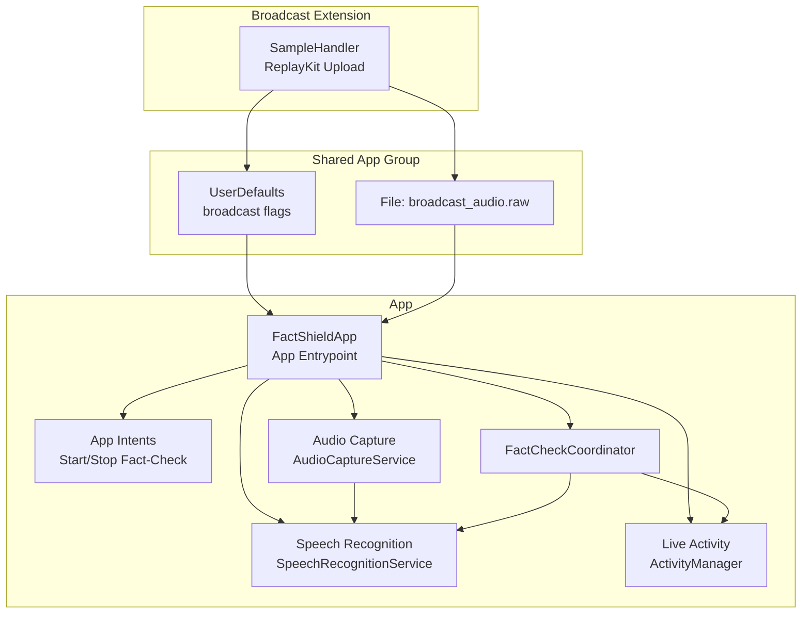
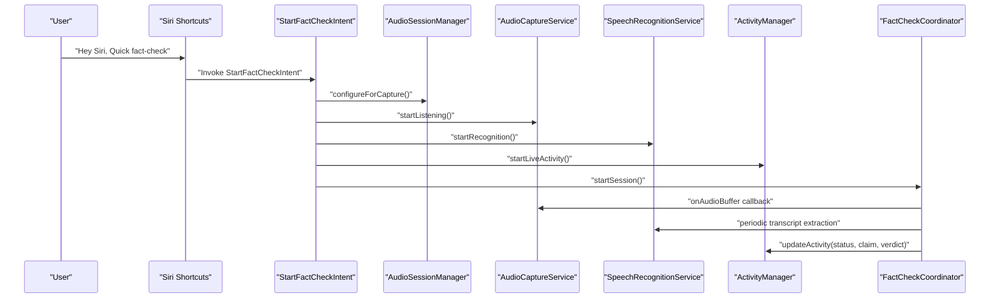
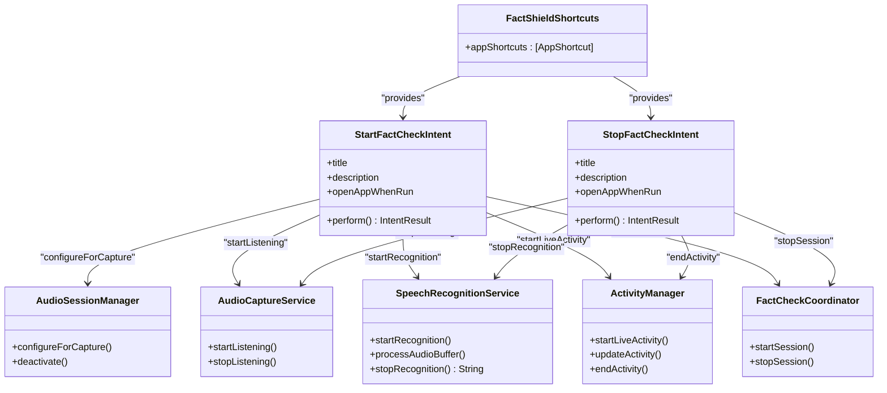
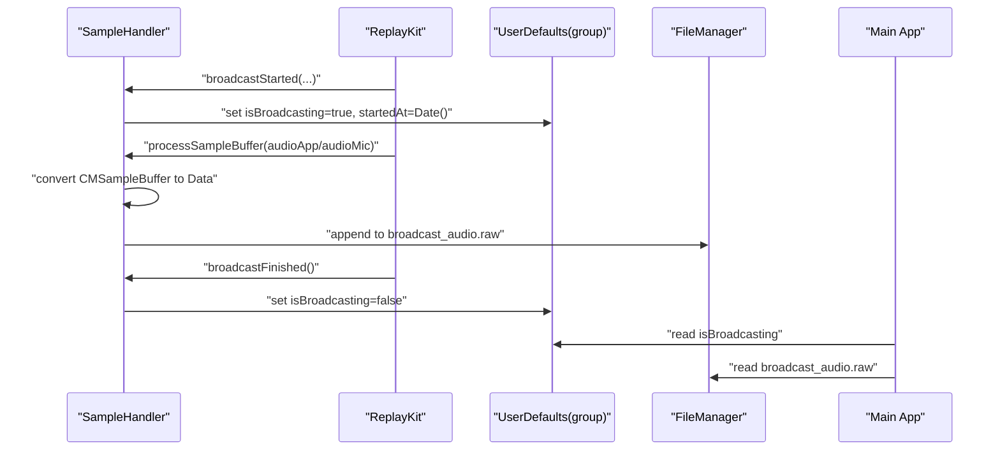
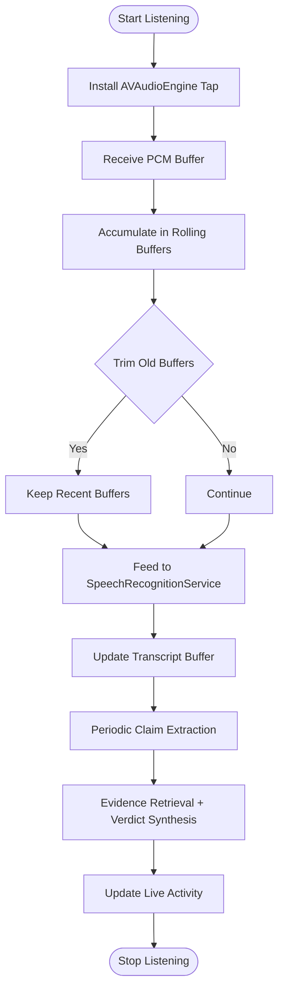
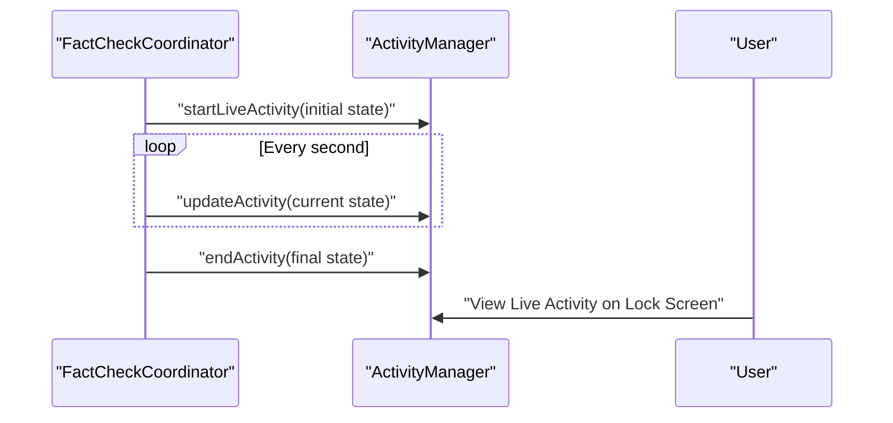
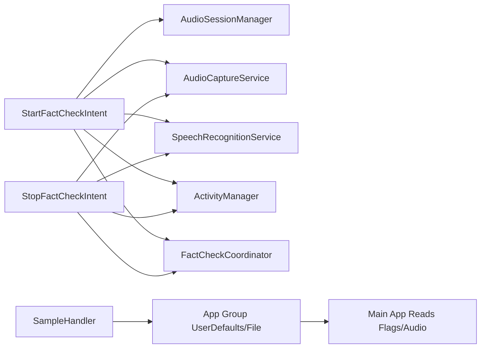

# System Integration

<cite>
**Referenced Files in This Document**
- [FactShieldShortcuts.swift](file://FactShield/FactShield/Intents/FactShieldShortcuts.swift)
- [StartFactCheckIntent.swift](file://FactShield/FactShield/Intents/StartFactCheckIntent.swift)
- [StopFactCheckIntent.swift](file://FactShield/FactShield/Intents/StopFactCheckIntent.swift)
- [SampleHandler.swift](file://FactShield/FactShield/BroadcastExtension/SampleHandler.swift)
- [FactShieldBroadcast.entitlements](file://FactShield/FactShield/BroadcastExtension/FactShieldBroadcast.entitlements)
- [FactShield.entitlements](file://FactShield/FactShield/Resources/FactShield.entitlements)
- [Info.plist](file://FactShield/FactShield/Resources/Info.plist)
- [Broadcast Info.plist](file://FactShield/FactShield/BroadcastExtension/Info.plist)
- [AudioCaptureService.swift](file://FactShield/FactShield/Core/Audio/AudioCaptureService.swift)
- [AudioSessionManager.swift](file://FactShield/FactShield/Core/Audio/AudioSessionManager.swift)
- [AudioBufferProcessor.swift](file://FactShield/FactShield/Core/Audio/AudioBufferProcessor.swift)
- [SpeechRecognitionService.swift](file://FactShield/FactShield/Core/Speech/SpeechRecognitionService.swift)
- [ActivityManager.swift](file://FactShield/FactShield/Widgets/ActivityManager.swift)
- [FactCheckCoordinator.swift](file://FactShield/FactShield/Features/FactCheck/FactCheckCoordinator.swift)
- [FactCheckSession.swift](file://FactShield/FactShield/Models/FactCheckSession.swift)
- [Logger.swift](file://FactShield/FactShield/Utilities/Logger.swift)
</cite>

## Table of Contents
1. [Introduction](#introduction)
2. [Project Structure](#project-structure)
3. [Core Components](#core-components)
4. [Architecture Overview](#architecture-overview)
5. [Detailed Component Analysis](#detailed-component-analysis)
6. [Dependency Analysis](#dependency-analysis)
7. [Performance Considerations](#performance-considerations)
8. [Troubleshooting Guide](#troubleshooting-guide)
9. [Conclusion](#conclusion)
10. [Appendices](#appendices)

## Introduction
This document explains the system integration features in FactChecking Live (referred to as FactShield in the repository). It covers Siri Shortcuts and App Intents automation, the ReplayKit broadcast extension for system audio capture, app group communication, and Live Activities integration. It also provides setup instructions, user workflows, voice command patterns, and troubleshooting guidance for system-level operations.

## Project Structure
The system integration spans several areas:
- App Intents and Siri Shortcuts under the Intents folder
- ReplayKit broadcast extension under BroadcastExtension
- Audio capture and speech recognition under Core
- Live Activity management under Widgets
- Fact-check orchestration under Features/FactCheck
- Shared app group entitlements and Info.plist configurations

**Diagram sources**
- [FactShieldApp.swift](file://FactShield/FactShield/App/FactShieldApp.swift)
- [FactShieldShortcuts.swift](file://FactShield/FactShield/Intents/FactShieldShortcuts.swift)
- [StartFactCheckIntent.swift](file://FactShield/FactShield/Intents/StartFactCheckIntent.swift)
- [StopFactCheckIntent.swift](file://FactShield/FactShield/Intents/StopFactCheckIntent.swift)
- [AudioCaptureService.swift](file://FactShield/FactShield/Core/Audio/AudioCaptureService.swift)
- [SpeechRecognitionService.swift](file://FactShield/FactShield/Core/Speech/SpeechRecognitionService.swift)
- [ActivityManager.swift](file://FactShield/FactShield/Widgets/ActivityManager.swift)
- [FactCheckCoordinator.swift](file://FactShield/FactShield/Features/FactCheck/FactCheckCoordinator.swift)
- [SampleHandler.swift](file://FactShield/FactShield/BroadcastExtension/SampleHandler.swift)

**Section sources**
- [FactShieldShortcuts.swift:1-27](file://FactShield/FactShield/Intents/FactShieldShortcuts.swift#L1-L27)
- [StartFactCheckIntent.swift:1-29](file://FactShield/FactShield/Intents/StartFactCheckIntent.swift#L1-L29)
- [StopFactCheckIntent.swift:1-43](file://FactShield/FactShield/Intents/StopFactCheckIntent.swift#L1-L43)
- [SampleHandler.swift:1-85](file://FactShield/FactShield/BroadcastExtension/SampleHandler.swift#L1-L85)
- [AudioCaptureService.swift:1-51](file://FactShield/FactShield/Core/Audio/AudioCaptureService.swift#L1-L51)
- [SpeechRecognitionService.swift:1-138](file://FactShield/FactShield/Core/Speech/SpeechRecognitionService.swift#L1-L138)
- [ActivityManager.swift:1-87](file://FactShield/FactShield/Widgets/ActivityManager.swift#L1-L87)
- [FactCheckCoordinator.swift:1-216](file://FactShield/FactShield/Features/FactCheck/FactCheckCoordinator.swift#L1-L216)

## Core Components
- Siri Shortcuts and App Intents: Provides two shortcuts and two intents to start and stop a fact-check session. The intents configure the audio session, start audio capture and speech recognition, launch Live Activity, and coordinate the fact-check pipeline.
- Broadcast Extension: Implements a ReplayKit upload extension that captures audio sample buffers and writes raw PCM data to a shared container for the main app to consume.
- App Group Communication: Uses a shared app group to pass state and audio data between the extension and the main app.
- Live Activities: Starts, updates, and ends a Live Activity to surface real-time verification status during sessions.
- Audio Pipeline: Captures audio via AVAudioEngine, buffers and trims rolling audio, feeds speech recognition, and coordinates periodic claim extraction and verdict synthesis.

**Section sources**
- [FactShieldShortcuts.swift:3-26](file://FactShield/FactShield/Intents/FactShieldShortcuts.swift#L3-L26)
- [StartFactCheckIntent.swift:4-27](file://FactShield/FactShield/Intents/StartFactCheckIntent.swift#L4-L27)
- [StopFactCheckIntent.swift:3-41](file://FactShield/FactShield/Intents/StopFactCheckIntent.swift#L3-L41)
- [SampleHandler.swift:4-83](file://FactShield/FactShield/BroadcastExtension/SampleHandler.swift#L4-L83)
- [FactShieldBroadcast.entitlements:4-8](file://FactShield/FactShield/BroadcastExtension/FactShieldBroadcast.entitlements#L4-L8)
- [FactShield.entitlements:5-8](file://FactShield/FactShield/Resources/FactShield.entitlements#L5-L8)
- [ActivityManager.swift:16-67](file://FactShield/FactShield/Widgets/ActivityManager.swift#L16-L67)
- [AudioCaptureService.swift:19-49](file://FactShield/FactShield/Core/Audio/AudioCaptureService.swift#L19-L49)
- [AudioBufferProcessor.swift:16-40](file://FactShield/FactShield/Core/Audio/AudioBufferProcessor.swift#L16-L40)
- [SpeechRecognitionService.swift:41-101](file://FactShield/FactShield/Core/Speech/SpeechRecognitionService.swift#L41-L101)
- [FactCheckCoordinator.swift:38-201](file://FactShield/FactShield/Features/FactCheck/FactCheckCoordinator.swift#L38-L201)

## Architecture Overview
The system integrates three primary flows:
- Siri Shortcuts/Intents: Launches a background session that configures audio, starts speech recognition, and begins Live Activity.
- ReplayKit Broadcast Extension: Captures system audio/mic samples and writes raw PCM to a shared container for the main app.
- App Group Communication: The extension toggles broadcasting flags and writes audio data; the main app reads these signals and consumes the audio file.

**Diagram sources**
- [StartFactCheckIntent.swift:9-27](file://FactShield/FactShield/Intents/StartFactCheckIntent.swift#L9-L27)
- [AudioSessionManager.swift:8-17](file://FactShield/FactShield/Core/Audio/AudioSessionManager.swift#L8-L17)
- [AudioCaptureService.swift:19-40](file://FactShield/FactShield/Core/Audio/AudioCaptureService.swift#L19-L40)
- [SpeechRecognitionService.swift:41-84](file://FactShield/FactShield/Core/Speech/SpeechRecognitionService.swift#L41-L84)
- [ActivityManager.swift:16-48](file://FactShield/FactShield/Widgets/ActivityManager.swift#L16-L48)
- [FactCheckCoordinator.swift:38-84](file://FactShield/FactShield/Features/FactCheck/FactCheckCoordinator.swift#L38-L84)

## Detailed Component Analysis

### Siri Shortcuts and App Intents
- Shortcut configuration defines two App Shortcuts: one to start and one to stop a fact-check session. Each shortcut associates with a dedicated intent and phrase set.
- StartFactCheckIntent configures the audio session for capture, starts audio capture and speech recognition, launches Live Activity, and initiates the coordinator.
- StopFactCheckIntent stops the coordinator and audio capture, retrieves the final transcript, deactivates the audio session, and ends Live Activity with a final state derived from the current verdict and claim.

**Diagram sources**
- [FactShieldShortcuts.swift:3-26](file://FactShield/FactShield/Intents/FactShieldShortcuts.swift#L3-L26)
- [StartFactCheckIntent.swift:4-27](file://FactShield/FactShield/Intents/StartFactCheckIntent.swift#L4-L27)
- [StopFactCheckIntent.swift:3-41](file://FactShield/FactShield/Intents/StopFactCheckIntent.swift#L3-L41)
- [AudioSessionManager.swift:4-22](file://FactShield/FactShield/Core/Audio/AudioSessionManager.swift#L4-L22)
- [AudioCaptureService.swift:4-50](file://FactShield/FactShield/Core/Audio/AudioCaptureService.swift#L4-L50)
- [SpeechRecognitionService.swift:6-137](file://FactShield/FactShield/Core/Speech/SpeechRecognitionService.swift#L6-L137)
- [ActivityManager.swift:5-67](file://FactShield/FactShield/Widgets/ActivityManager.swift#L5-L67)
- [FactCheckCoordinator.swift:6-65](file://FactShield/FactShield/Features/FactCheck/FactCheckCoordinator.swift#L6-L65)

**Section sources**
- [FactShieldShortcuts.swift:3-26](file://FactShield/FactShield/Intents/FactShieldShortcuts.swift#L3-L26)
- [StartFactCheckIntent.swift:4-27](file://FactShield/FactShield/Intents/StartFactCheckIntent.swift#L4-L27)
- [StopFactCheckIntent.swift:3-41](file://FactShield/FactShield/Intents/StopFactCheckIntent.swift#L3-L41)

### ReplayKit Broadcast Extension
- The extension receives audio sample buffers (app audio and mic) and writes raw PCM data to a shared container file. It also sets and clears a broadcasting flag in shared UserDefaults to inform the main app.
- The extension’s Info.plist declares the broadcast extension point and process mode. Both the extension and the main app declare the same shared app group in their entitlements.

**Diagram sources**
- [SampleHandler.swift:10-34](file://FactShield/FactShield/BroadcastExtension/SampleHandler.swift#L10-L34)
- [SampleHandler.swift:36-83](file://FactShield/FactShield/BroadcastExtension/SampleHandler.swift#L36-L83)
- [Broadcast Info.plist:5-13](file://FactShield/FactShield/BroadcastExtension/Info.plist#L5-L13)
- [FactShieldBroadcast.entitlements:4-8](file://FactShield/FactShield/BroadcastExtension/FactShieldBroadcast.entitlements#L4-L8)
- [FactShield.entitlements:5-8](file://FactShield/FactShield/Resources/FactShield.entitlements#L5-L8)

**Section sources**
- [SampleHandler.swift:4-83](file://FactShield/FactShield/BroadcastExtension/SampleHandler.swift#L4-L83)
- [Broadcast Info.plist:4-13](file://FactShield/FactShield/BroadcastExtension/Info.plist#L4-L13)
- [FactShieldBroadcast.entitlements:4-8](file://FactShield/FactShield/BroadcastExtension/FactShieldBroadcast.entitlements#L4-L8)
- [FactShield.entitlements:5-8](file://FactShield/FactShield/Resources/FactShield.entitlements#L5-L8)

### Audio Capture and Speech Recognition Pipeline
- AudioCaptureService installs an AVAudioEngine tap to receive PCM buffers on a high-priority queue and forwards them to the buffer processor and coordinator.
- AudioBufferProcessor maintains a rolling window of recent buffers and trims old data to bound memory usage.
- SpeechRecognitionService initializes on-device recognition when available, streams PCM buffers to the speech engine, and maintains a rolling transcript buffer.

**Diagram sources**
- [AudioCaptureService.swift:19-40](file://FactShield/FactShield/Core/Audio/AudioCaptureService.swift#L19-L40)
- [AudioBufferProcessor.swift:16-40](file://FactShield/FactShield/Core/Audio/AudioBufferProcessor.swift#L16-L40)
- [SpeechRecognitionService.swift:41-101](file://FactShield/FactShield/Core/Speech/SpeechRecognitionService.swift#L41-L101)
- [FactCheckCoordinator.swift:68-161](file://FactShield/FactShield/Features/FactCheck/FactCheckCoordinator.swift#L68-L161)

**Section sources**
- [AudioCaptureService.swift:4-50](file://FactShield/FactShield/Core/Audio/AudioCaptureService.swift#L4-L50)
- [AudioBufferProcessor.swift:5-41](file://FactShield/FactShield/Core/Audio/AudioBufferProcessor.swift#L5-L41)
- [SpeechRecognitionService.swift:6-137](file://FactShield/FactShield/Core/Speech/SpeechRecognitionService.swift#L6-L137)
- [FactCheckCoordinator.swift:68-201](file://FactShield/FactShield/Features/FactCheck/FactCheckCoordinator.swift#L68-L201)

### Live Activities Integration
- ActivityManager validates availability, starts a Live Activity with initial state, updates it periodically, and ends it with a final state containing verdict, confidence, sources, and elapsed time.
- FactCheckCoordinator drives state transitions and pushes updates to Live Activity.

**Diagram sources**
- [ActivityManager.swift:16-67](file://FactShield/FactShield/Widgets/ActivityManager.swift#L16-L67)
- [FactCheckCoordinator.swift:164-201](file://FactShield/FactShield/Features/FactCheck/FactCheckCoordinator.swift#L164-L201)

**Section sources**
- [ActivityManager.swift:5-87](file://FactShield/FactShield/Widgets/ActivityManager.swift#L5-L87)
- [FactCheckCoordinator.swift:164-201](file://FactShield/FactShield/Features/FactCheck/FactCheckCoordinator.swift#L164-L201)

## Dependency Analysis
Key dependencies and coupling:
- Intents depend on AudioSessionManager, AudioCaptureService, SpeechRecognitionService, ActivityManager, and FactCheckCoordinator.
- Broadcast extension depends on shared app group entitlements and writes to a shared container file.
- FactCheckCoordinator orchestrates audio capture, speech recognition, claim extraction, evidence retrieval, verdict synthesis, and Live Activity updates.
- Logging utilities centralize subsystem logs for diagnostics.

**Diagram sources**
- [StartFactCheckIntent.swift:9-27](file://FactShield/FactShield/Intents/StartFactCheckIntent.swift#L9-L27)
- [StopFactCheckIntent.swift:9-41](file://FactShield/FactShield/Intents/StopFactCheckIntent.swift#L9-L41)
- [AudioSessionManager.swift:8-21](file://FactShield/FactShield/Core/Audio/AudioSessionManager.swift#L8-L21)
- [AudioCaptureService.swift:19-49](file://FactShield/FactShield/Core/Audio/AudioCaptureService.swift#L19-L49)
- [SpeechRecognitionService.swift:41-101](file://FactShield/FactShield/Core/Speech/SpeechRecognitionService.swift#L41-L101)
- [ActivityManager.swift:16-67](file://FactShield/FactShield/Widgets/ActivityManager.swift#L16-L67)
- [FactCheckCoordinator.swift:38-201](file://FactShield/FactShield/Features/FactCheck/FactCheckCoordinator.swift#L38-L201)
- [SampleHandler.swift:14-33](file://FactShield/FactShield/BroadcastExtension/SampleHandler.swift#L14-L33)

**Section sources**
- [StartFactCheckIntent.swift:9-27](file://FactShield/FactShield/Intents/StartFactCheckIntent.swift#L9-L27)
- [StopFactCheckIntent.swift:9-41](file://FactShield/FactShield/Intents/StopFactCheckIntent.swift#L9-L41)
- [SampleHandler.swift:14-33](file://FactShield/FactShield/BroadcastExtension/SampleHandler.swift#L14-L33)
- [FactShield.entitlements:5-8](file://FactShield/FactShield/Resources/FactShield.entitlements#L5-L8)
- [FactShieldBroadcast.entitlements:4-8](file://FactShield/FactShield/BroadcastExtension/FactShieldBroadcast.entitlements#L4-L8)

## Performance Considerations
- Audio capture uses a high-priority interactive queue for buffer delivery to minimize latency.
- Rolling audio and transcript buffers cap memory usage and recent duration to keep processing efficient.
- On-device speech recognition reduces latency and privacy risk when available.
- Live Activity updates occur at a controlled cadence to balance responsiveness and battery life.
- The broadcast extension writes raw PCM to disk; ensure appropriate file sizes and periodic cleanup to avoid storage pressure.

[No sources needed since this section provides general guidance]

## Troubleshooting Guide
Common issues and resolutions:
- Speech recognition not authorized: The service requests authorization at startup; ensure the user grants permission when prompted.
- Live Activities disabled: The manager checks availability and throws a descriptive error if activities are not enabled.
- No audio captured: Verify the audio session category and mode are configured for capture and that the app remains active while recording.
- Broadcast extension not writing audio: Confirm shared app group entitlements match between the app and extension, and that the extension has proper upload extension configuration.
- Extension not signaling state: Check that the extension writes and clears the broadcasting flag in shared UserDefaults and that the main app reads these values.

**Section sources**
- [SpeechRecognitionService.swift:28-39](file://FactShield/FactShield/Core/Speech/SpeechRecognitionService.swift#L28-L39)
- [ActivityManager.swift:17-20](file://FactShield/FactShield/Widgets/ActivityManager.swift#L17-L20)
- [AudioSessionManager.swift:8-17](file://FactShield/FactShield/Core/Audio/AudioSessionManager.swift#L8-L17)
- [FactShield.entitlements:5-8](file://FactShield/FactShield/Resources/FactShield.entitlements#L5-L8)
- [FactShieldBroadcast.entitlements:4-8](file://FactShield/FactShield/BroadcastExtension/FactShieldBroadcast.entitlements#L4-L8)
- [Broadcast Info.plist:5-13](file://FactShield/FactShield/BroadcastExtension/Info.plist#L5-L13)

## Conclusion
FactChecking Live integrates Siri Shortcuts and App Intents to enable hands-free launching and stopping of fact-check sessions. The ReplayKit broadcast extension captures system audio and shares it with the main app via a shared container, while the main app orchestrates audio capture, speech recognition, periodic claim extraction, evidence retrieval, and verdict synthesis. Live Activities provide real-time feedback during sessions. Proper entitlements, extension configuration, and robust error handling ensure reliable operation across system-level integrations.

[No sources needed since this section summarizes without analyzing specific files]

## Appendices

### Setup Instructions
- Siri Shortcuts:
  - Add the “Quick Fact-Check” and “Stop Fact-Check” shortcuts in the Shortcuts app. They are registered automatically via the App Shortcuts provider.
- Broadcast Extension Permissions:
  - Ensure the broadcast extension is enabled in the target’s Signing & Capabilities and that the extension’s Info.plist declares the broadcast extension point and process mode.
  - Confirm both the main app and the extension share the same app group identifier in their entitlements.
- System Audio Access:
  - The app requires microphone and speech recognition permissions as declared in the main app’s Info.plist. Users will be prompted upon first use.

**Section sources**
- [FactShieldShortcuts.swift:3-26](file://FactShield/FactShield/Intents/FactShieldShortcuts.swift#L3-L26)
- [Broadcast Info.plist:5-13](file://FactShield/FactShield/BroadcastExtension/Info.plist#L5-L13)
- [FactShield.entitlements:5-8](file://FactShield/FactShield/Resources/FactShield.entitlements#L5-L8)
- [Info.plist:5-22](file://FactShield/FactShield/Resources/Info.plist#L5-L22)

### User Workflows and Voice Command Patterns
- Start a session:
  - Say: “Hey Siri, Quick fact-check with [App Name]”
  - Siri invokes the StartFactCheckIntent, which configures audio, starts speech recognition, and begins Live Activity.
- Stop a session:
  - Say: “Hey Siri, Stop fact-checking with [App Name]”
  - Siri invokes the StopFactCheckIntent, which stops capture and recognition, finalizes the Live Activity, and persists results.
- Broadcast extension workflow:
  - From the Control Center, start a broadcast using the extension. The extension writes audio to the shared container and toggles the broadcasting flag. The main app reads the flag and consumes the audio file.

**Section sources**
- [FactShieldShortcuts.swift:7-24](file://FactShield/FactShield/Intents/FactShieldShortcuts.swift#L7-L24)
- [StartFactCheckIntent.swift:9-27](file://FactShield/FactShield/Intents/StartFactCheckIntent.swift#L9-L27)
- [StopFactCheckIntent.swift:9-41](file://FactShield/FactShield/Intents/StopFactCheckIntent.swift#L9-L41)
- [SampleHandler.swift:10-34](file://FactShield/FactShield/BroadcastExtension/SampleHandler.swift#L10-L34)

### Data Models and Capture Modes
- FactCheckSession defines capture modes (microphone or replay kit) and session lifecycle statuses.
- The coordinator tracks elapsed time, current claim, current verdict, and history for reporting and Live Activity updates.

**Section sources**
- [FactCheckSession.swift:3-35](file://FactShield/FactShield/Models/FactCheckSession.swift#L3-L35)
- [FactCheckCoordinator.swift:19-33](file://FactShield/FactShield/Features/FactCheck/FactCheckCoordinator.swift#L19-L33)