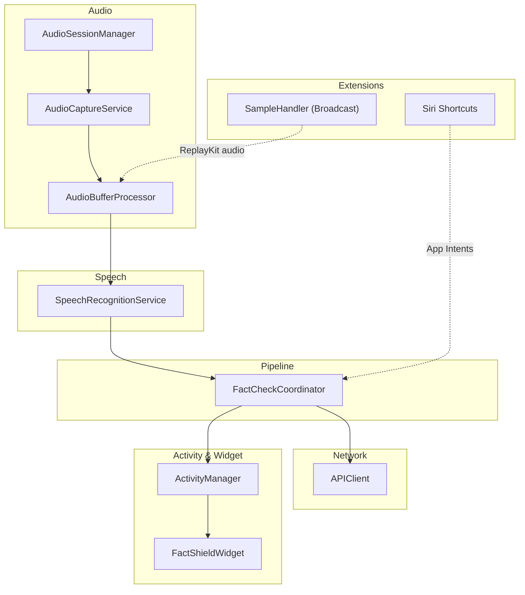
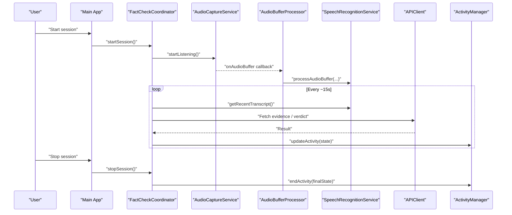
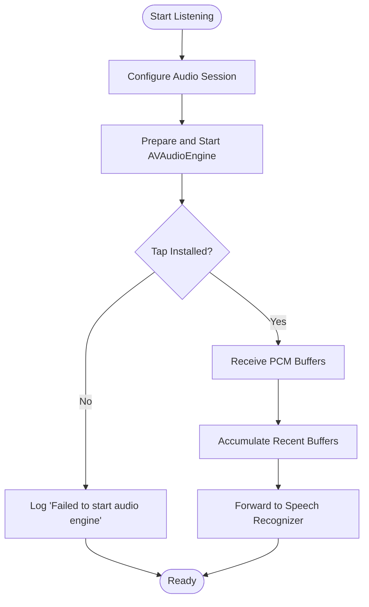
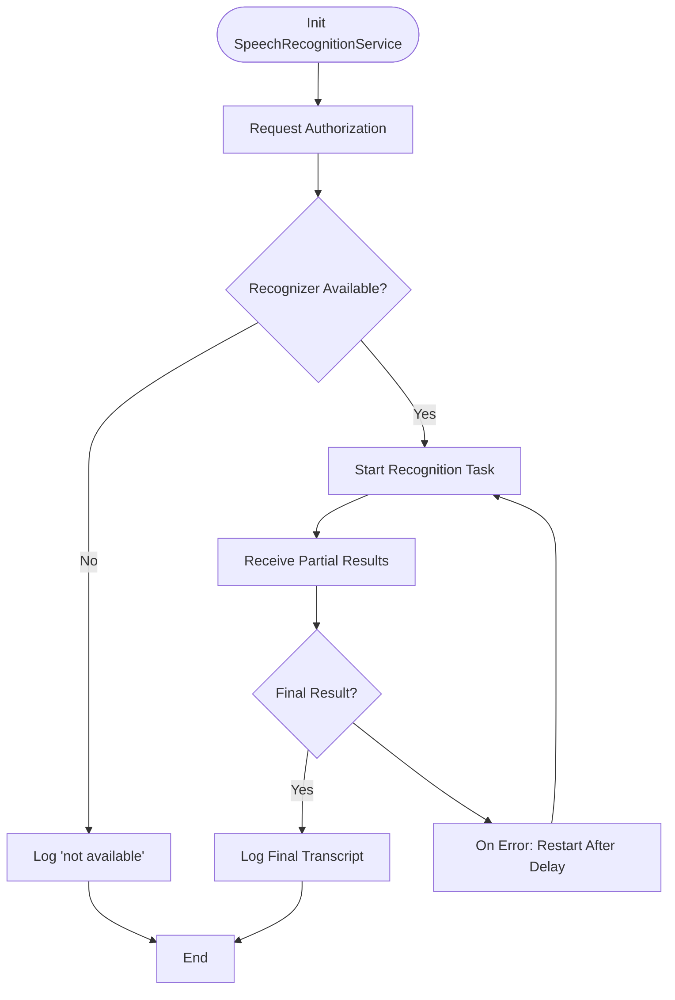
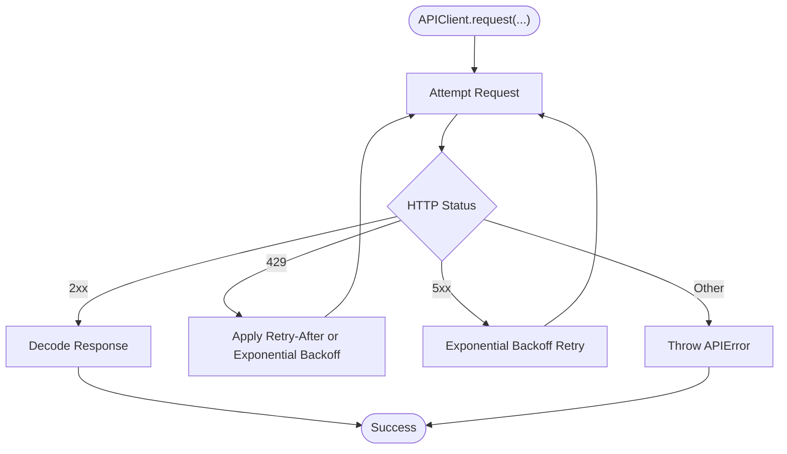
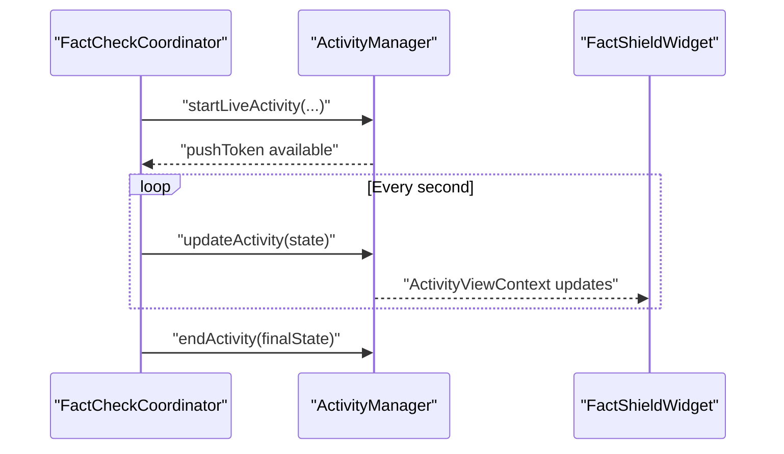
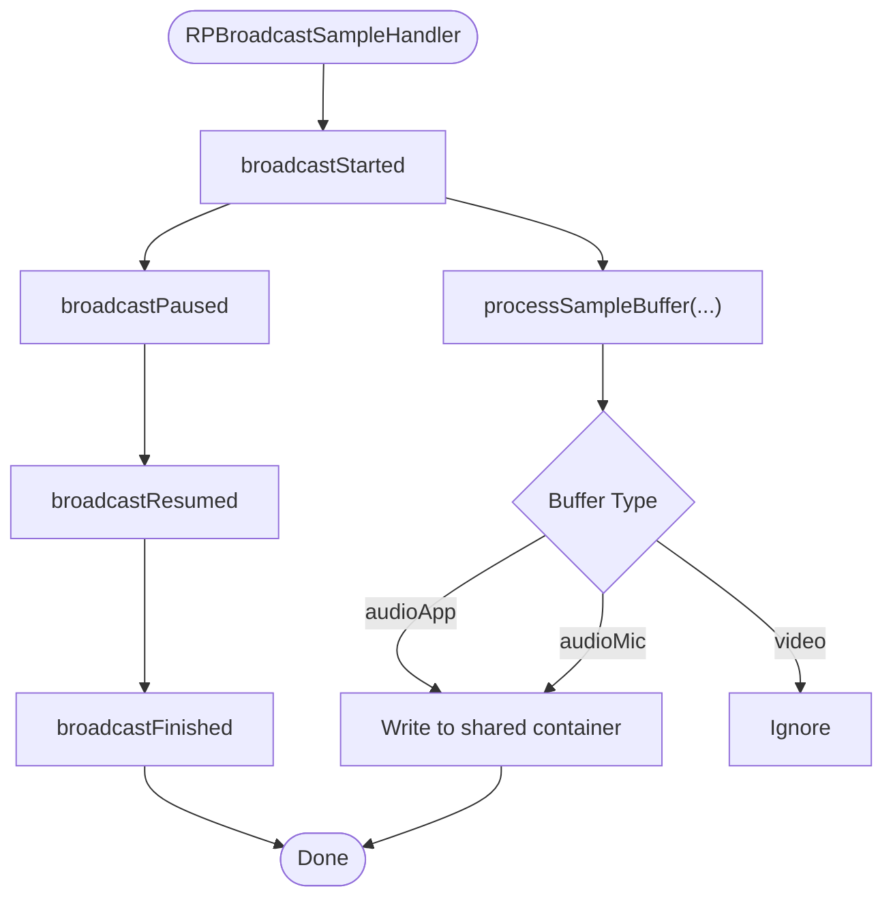
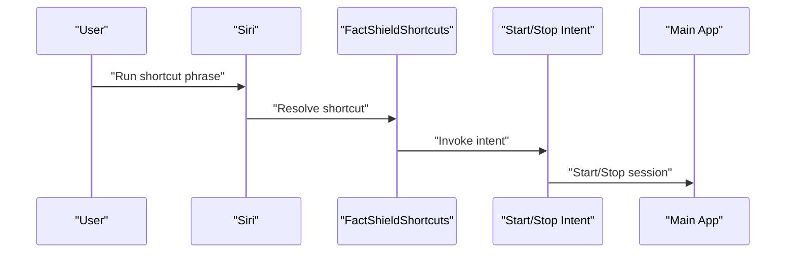
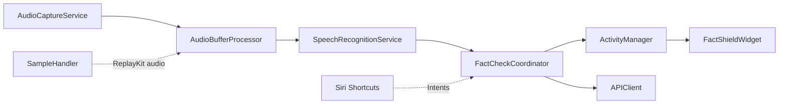

# Troubleshooting and FAQ

<cite>
**Referenced Files in This Document**
- [Logger.swift](file://FactShield/FactShield/Utilities/Logger.swift)
- [AudioCaptureService.swift](file://FactShield/FactShield/Core/Audio/AudioCaptureService.swift)
- [AudioSessionManager.swift](file://FactShield/FactShield/Core/Audio/AudioSessionManager.swift)
- [AudioBufferProcessor.swift](file://FactShield/FactShield/Core/Audio/AudioBufferProcessor.swift)
- [SpeechRecognitionService.swift](file://FactShield/FactShield/Core/Speech/SpeechRecognitionService.swift)
- [APIClient.swift](file://FactShield/FactShield/Core/Network/APIClient.swift)
- [ActivityManager.swift](file://FactShield/FactShield/Widgets/ActivityManager.swift)
- [FactShieldWidget.swift](file://FactShield/FactShield/Widgets/FactShieldWidget.swift)
- [SampleHandler.swift](file://FactShield/FactShield/BroadcastExtension/SampleHandler.swift)
- [FactShieldShortcuts.swift](file://FactShield/FactShield/Intents/FactShieldShortcuts.swift)
- [FactCheckCoordinator.swift](file://FactShield/FactShield/Features/FactCheck/FactCheckCoordinator.swift)
- [FactCheckSession.swift](file://FactShield/FactShield/Models/FactCheckSession.swift)
- [Info.plist](file://FactShield/FactShield/Resources/Info.plist)
</cite>

## Table of Contents
1. [Introduction](#introduction)
2. [Project Structure](#project-structure)
3. [Core Components](#core-components)
4. [Architecture Overview](#architecture-overview)
5. [Detailed Component Analysis](#detailed-component-analysis)
6. [Dependency Analysis](#dependency-analysis)
7. [Performance Considerations](#performance-considerations)
8. [Troubleshooting Guide](#troubleshooting-guide)
9. [Conclusion](#conclusion)
10. [Appendices](#appendices)

## Introduction
This document provides comprehensive troubleshooting and frequently asked questions for FactChecking Live. It focuses on diagnosing and resolving common issues across audio capture, speech recognition, API connectivity, and Live Activity/Widget display. It also covers platform-specific considerations, broadcast extension and Siri Shortcuts integration, and performance optimization strategies. Diagnostic logging is guided by the centralized Logger utility.

## Project Structure
FactChecking Live organizes functionality by domain:
- Audio capture and session management
- Speech recognition and transcript buffering
- Network client with retry/backoff and error modeling
- Live Activity and Widget rendering
- Broadcast extension for ReplayKit audio capture
- Siri Shortcuts app intents
- Coordinator orchestrating the end-to-end pipeline

**Diagram sources**
- [AudioSessionManager.swift:1-23](file://FactShield/FactShield/Core/Audio/AudioSessionManager.swift#L1-L23)
- [AudioCaptureService.swift:1-51](file://FactShield/FactShield/Core/Audio/AudioCaptureService.swift#L1-L51)
- [AudioBufferProcessor.swift:1-42](file://FactShield/FactShield/Core/Audio/AudioBufferProcessor.swift#L1-L42)
- [SpeechRecognitionService.swift:1-138](file://FactShield/FactShield/Core/Speech/SpeechRecognitionService.swift#L1-L138)
- [FactCheckCoordinator.swift:1-216](file://FactShield/FactShield/Features/FactCheck/FactCheckCoordinator.swift#L1-L216)
- [APIClient.swift:1-234](file://FactShield/FactShield/Core/Network/APIClient.swift#L1-L234)
- [ActivityManager.swift:1-87](file://FactShield/FactShield/Widgets/ActivityManager.swift#L1-L87)
- [FactShieldWidget.swift:1-218](file://FactShield/FactShield/Widgets/FactShieldWidget.swift#L1-L218)
- [SampleHandler.swift:1-85](file://FactShield/FactShield/BroadcastExtension/SampleHandler.swift#L1-L85)
- [FactShieldShortcuts.swift:1-27](file://FactShield/FactShield/Intents/FactShieldShortcuts.swift#L1-L27)

**Section sources**
- [AudioSessionManager.swift:1-23](file://FactShield/FactShield/Core/Audio/AudioSessionManager.swift#L1-L23)
- [AudioCaptureService.swift:1-51](file://FactShield/FactShield/Core/Audio/AudioCaptureService.swift#L1-L51)
- [AudioBufferProcessor.swift:1-42](file://FactShield/FactShield/Core/Audio/AudioBufferProcessor.swift#L1-L42)
- [SpeechRecognitionService.swift:1-138](file://FactShield/FactShield/Core/Speech/SpeechRecognitionService.swift#L1-L138)
- [FactCheckCoordinator.swift:1-216](file://FactShield/FactShield/Features/FactCheck/FactCheckCoordinator.swift#L1-L216)
- [APIClient.swift:1-234](file://FactShield/FactShield/Core/Network/APIClient.swift#L1-L234)
- [ActivityManager.swift:1-87](file://FactShield/FactShield/Widgets/ActivityManager.swift#L1-L87)
- [FactShieldWidget.swift:1-218](file://FactShield/FactShield/Widgets/FactShieldWidget.swift#L1-L218)
- [SampleHandler.swift:1-85](file://FactShield/FactShield/BroadcastExtension/SampleHandler.swift#L1-L85)
- [FactShieldShortcuts.swift:1-27](file://FactShield/FactShield/Intents/FactShieldShortcuts.swift#L1-L27)

## Core Components
- AudioSessionManager configures the audio session for capture with echo cancellation and Bluetooth support.
- AudioCaptureService starts/stops the AVAudioEngine tap and emits PCM buffers.
- AudioBufferProcessor accumulates recent buffers and forwards them to the speech recognizer.
- SpeechRecognitionService manages SFSpeech recognition, partial/final results, and on-device/offload preference.
- APIClient centralizes networking with timeouts, retries, exponential backoff, and structured error types.
- ActivityManager controls Live Activity lifecycle and state updates.
- FactCheckCoordinator orchestrates the pipeline: audio capture → buffer accumulation → speech transcription → claim extraction → evidence retrieval → verdict synthesis → Live Activity updates.
- SampleHandler handles ReplayKit audio samples and writes raw audio to a shared container for the main app.
- Siri Shortcuts intents provide voice-driven launch/stop actions.

**Section sources**
- [AudioSessionManager.swift:1-23](file://FactShield/FactShield/Core/Audio/AudioSessionManager.swift#L1-L23)
- [AudioCaptureService.swift:1-51](file://FactShield/FactShield/Core/Audio/AudioCaptureService.swift#L1-L51)
- [AudioBufferProcessor.swift:1-42](file://FactShield/FactShield/Core/Audio/AudioBufferProcessor.swift#L1-L42)
- [SpeechRecognitionService.swift:1-138](file://FactShield/FactShield/Core/Speech/SpeechRecognitionService.swift#L1-L138)
- [APIClient.swift:1-234](file://FactShield/FactShield/Core/Network/APIClient.swift#L1-L234)
- [ActivityManager.swift:1-87](file://FactShield/FactShield/Widgets/ActivityManager.swift#L1-L87)
- [FactCheckCoordinator.swift:1-216](file://FactShield/FactShield/Features/FactCheck/FactCheckCoordinator.swift#L1-L216)
- [SampleHandler.swift:1-85](file://FactShield/FactShield/BroadcastExtension/SampleHandler.swift#L1-L85)
- [FactShieldShortcuts.swift:1-27](file://FactShield/FactShield/Intents/FactShieldShortcuts.swift#L1-L27)

## Architecture Overview
The system streams audio from the device’s microphone or ReplayKit, feeds it to a speech recognizer, periodically extracts claims, retrieves evidence, synthesizes a verdict, and updates Live Activity and widgets.

**Diagram sources**
- [FactCheckCoordinator.swift:38-201](file://FactShield/FactShield/Features/FactCheck/FactCheckCoordinator.swift#L38-L201)
- [AudioCaptureService.swift:19-49](file://FactShield/FactShield/Core/Audio/AudioCaptureService.swift#L19-L49)
- [AudioBufferProcessor.swift:16-22](file://FactShield/FactShield/Core/Audio/AudioBufferProcessor.swift#L16-L22)
- [SpeechRecognitionService.swift:86-88](file://FactShield/FactShield/Core/Speech/SpeechRecognitionService.swift#L86-L88)
- [APIClient.swift:51-103](file://FactShield/FactShield/Core/Network/APIClient.swift#L51-L103)
- [ActivityManager.swift:50-67](file://FactShield/FactShield/Widgets/ActivityManager.swift#L50-L67)

## Detailed Component Analysis

### Audio Capture and Buffering
Common symptoms:
- No audio captured
- Engine fails to start
- Low-quality or echoy audio

Diagnostic steps:
- Verify audio session category/mode and activation.
- Confirm engine tap installation and buffer delivery.
- Inspect buffer queue and processor trimming logic.

**Diagram sources**
- [AudioSessionManager.swift:8-17](file://FactShield/FactShield/Core/Audio/AudioSessionManager.swift#L8-L17)
- [AudioCaptureService.swift:19-49](file://FactShield/FactShield/Core/Audio/AudioCaptureService.swift#L19-L49)
- [AudioBufferProcessor.swift:16-36](file://FactShield/FactShield/Core/Audio/AudioBufferProcessor.swift#L16-L36)

**Section sources**
- [AudioSessionManager.swift:1-23](file://FactShield/FactShield/Core/Audio/AudioSessionManager.swift#L1-L23)
- [AudioCaptureService.swift:1-51](file://FactShield/FactShield/Core/Audio/AudioCaptureService.swift#L1-L51)
- [AudioBufferProcessor.swift:1-42](file://FactShield/FactShield/Core/Audio/AudioBufferProcessor.swift#L1-L42)

### Speech Recognition Calibration
Common symptoms:
- Recognition not authorized
- Frequent restarts or silence
- Poor accuracy

Diagnostic steps:
- Check authorization status and logs.
- Prefer on-device recognition when supported.
- Inspect partial vs. final results and rolling transcript buffer.

**Diagram sources**
- [SpeechRecognitionService.swift:23-84](file://FactShield/FactShield/Core/Speech/SpeechRecognitionService.swift#L23-L84)
- [SpeechRecognitionService.swift:103-114](file://FactShield/FactShield/Core/Speech/SpeechRecognitionService.swift#L103-L114)

**Section sources**
- [SpeechRecognitionService.swift:1-138](file://FactShield/FactShield/Core/Speech/SpeechRecognitionService.swift#L1-L138)

### API Connectivity and Network Errors
Common symptoms:
- HTTP errors, timeouts, rate limits
- JSON decode failures
- Missing API key

Diagnostic steps:
- Review structured APIError messages.
- Apply exponential backoff and retry on server errors and timeouts.
- Respect Retry-After headers for rate limiting.

**Diagram sources**
- [APIClient.swift:51-103](file://FactShield/FactShield/Core/Network/APIClient.swift#L51-L103)
- [APIClient.swift:221-232](file://FactShield/FactShield/Core/Network/APIClient.swift#L221-L232)

**Section sources**
- [APIClient.swift:1-234](file://FactShield/FactShield/Core/Network/APIClient.swift#L1-L234)

### Live Activity and Widget Display
Common symptoms:
- Live Activity does not start
- Widget not updating
- Push token missing

Diagnostic steps:
- Verify Live Activities authorization.
- Ensure ActivityManager receives updates and ends gracefully.
- Confirm widget configuration and dynamic island regions render state.

**Diagram sources**
- [ActivityManager.swift:16-67](file://FactShield/FactShield/Widgets/ActivityManager.swift#L16-L67)
- [FactShieldWidget.swift:5-33](file://FactShield/FactShield/Widgets/FactShieldWidget.swift#L5-L33)
- [FactCheckCoordinator.swift:164-201](file://FactShield/FactShield/Features/FactCheck/FactCheckCoordinator.swift#L164-L201)

**Section sources**
- [ActivityManager.swift:1-87](file://FactShield/FactShield/Widgets/ActivityManager.swift#L1-L87)
- [FactShieldWidget.swift:1-218](file://FactShield/FactShield/Widgets/FactShieldWidget.swift#L1-L218)
- [FactCheckCoordinator.swift:163-201](file://FactShield/FactShield/Features/FactCheck/FactCheckCoordinator.swift#L163-L201)

### Broadcast Extension Problems
Common symptoms:
- No audio forwarded from ReplayKit
- App group data not written
- Microphone vs. system audio mismatch

Diagnostic steps:
- Confirm broadcastStarted/broadcastFinished callbacks.
- Verify app group suite and shared container path.
- Ensure audioApp/audioMic buffers are processed.

**Diagram sources**
- [SampleHandler.swift:10-55](file://FactShield/FactShield/BroadcastExtension/SampleHandler.swift#L10-L55)
- [SampleHandler.swift:57-83](file://FactShield/FactShield/BroadcastExtension/SampleHandler.swift#L57-L83)

**Section sources**
- [SampleHandler.swift:1-85](file://FactShield/FactShield/BroadcastExtension/SampleHandler.swift#L1-L85)

### Siri Shortcuts Integration Issues
Common symptoms:
- Shortcut phrases not recognized
- Intent not triggered

Diagnostic steps:
- Confirm intent identifiers in Info.plist.
- Validate app shortcut phrases and provider registration.

**Diagram sources**
- [FactShieldShortcuts.swift:3-26](file://FactShield/FactShield/Intents/FactShieldShortcuts.swift#L3-L26)
- [Info.plist:11-15](file://FactShield/FactShield/Resources/Info.plist#L11-L15)

**Section sources**
- [FactShieldShortcuts.swift:1-27](file://FactShield/FactShield/Intents/FactShieldShortcuts.swift#L1-L27)
- [Info.plist:1-25](file://FactShield/FactShield/Resources/Info.plist#L1-L25)

## Dependency Analysis
Key relationships:
- AudioCaptureService depends on AVAudioEngine and emits PCM buffers.
- AudioBufferProcessor depends on SpeechRecognitionService and maintains a rolling buffer.
- SpeechRecognitionService depends on SFSpeech and logs authorization and errors.
- FactCheckCoordinator composes all services and drives Live Activity updates.
- APIClient encapsulates network concerns and retries.
- ActivityManager and FactShieldWidget form the Live Activity surface.
- SampleHandler integrates with ReplayKit and shares data via app groups.
- Siri Shortcuts intents integrate with the main app lifecycle.

**Diagram sources**
- [AudioCaptureService.swift:1-51](file://FactShield/FactShield/Core/Audio/AudioCaptureService.swift#L1-L51)
- [AudioBufferProcessor.swift:1-42](file://FactShield/FactShield/Core/Audio/AudioBufferProcessor.swift#L1-L42)
- [SpeechRecognitionService.swift:1-138](file://FactShield/FactShield/Core/Speech/SpeechRecognitionService.swift#L1-L138)
- [FactCheckCoordinator.swift:1-216](file://FactShield/FactShield/Features/FactCheck/FactCheckCoordinator.swift#L1-L216)
- [APIClient.swift:1-234](file://FactShield/FactShield/Core/Network/APIClient.swift#L1-L234)
- [ActivityManager.swift:1-87](file://FactShield/FactShield/Widgets/ActivityManager.swift#L1-L87)
- [FactShieldWidget.swift:1-218](file://FactShield/FactShield/Widgets/FactShieldWidget.swift#L1-L218)
- [SampleHandler.swift:1-85](file://FactShield/FactShield/BroadcastExtension/SampleHandler.swift#L1-L85)
- [FactShieldShortcuts.swift:1-27](file://FactShield/FactShield/Intents/FactShieldShortcuts.swift#L1-L27)

**Section sources**
- [FactCheckCoordinator.swift:1-216](file://FactShield/FactShield/Features/FactCheck/FactCheckCoordinator.swift#L1-L216)
- [APIClient.swift:1-234](file://FactShield/FactShield/Core/Network/APIClient.swift#L1-L234)

## Performance Considerations
- Memory usage
  - Limit rolling audio buffer duration and cap retained buffer count in the processor.
  - Trim old buffers when exceeding thresholds to prevent growth.
- CPU consumption
  - Use userInteractive QoS for buffer queue to keep UI smooth.
  - Prefer on-device speech recognition to reduce network overhead.
- Battery life
  - Deactivate audio session when idle.
  - Avoid unnecessary timers and reduce update frequency where appropriate.
- Background behavior
  - Ensure background modes are declared for audio and fetch to maintain continuity.

**Section sources**
- [AudioBufferProcessor.swift:24-36](file://FactShield/FactShield/Core/Audio/AudioBufferProcessor.swift#L24-L36)
- [AudioCaptureService.swift:17-17](file://FactShield/FactShield/Core/Audio/AudioCaptureService.swift#L17-L17)
- [SpeechRecognitionService.swift:56-59](file://FactShield/FactShield/Core/Speech/SpeechRecognitionService.swift#L56-L59)
- [AudioSessionManager.swift:19-21](file://FactShield/FactShield/Core/Audio/AudioSessionManager.swift#L19-L21)
- [Info.plist:17-22](file://FactShield/FactShield/Resources/Info.plist#L17-L22)

## Troubleshooting Guide

### Audio Permission Problems
Symptoms:
- Microphone access denied
- No audio captured despite permissions granted

Debugging procedure:
- Verify NSMicrophoneUsageDescription in Info.plist.
- Confirm AudioSessionManager configured category/mode and activated session.
- Check AudioCaptureService engine start and tap installation logs.
- Ensure app is not suspended and background audio mode is declared.

Recovery:
- Prompt user to enable microphone in Settings > Privacy.
- Reinitialize audio session and restart capture.

**Section sources**
- [Info.plist:5-6](file://FactShield/FactShield/Resources/Info.plist#L5-L6)
- [AudioSessionManager.swift:8-17](file://FactShield/FactShield/Core/Audio/AudioSessionManager.swift#L8-L17)
- [AudioCaptureService.swift:33-39](file://FactShield/FactShield/Core/Audio/AudioCaptureService.swift#L33-L39)

### Speech Recognition Failures
Symptoms:
- Recognition not authorized
- Frequent restarts or silence
- Garbled or missing transcripts

Debugging procedure:
- Check authorization status logs and handle denied/restricted states.
- Prefer on-device recognition when supported.
- Inspect partial results and rolling transcript buffer size.
- Restart recognition on transient errors with a small delay.

Recovery:
- Guide user to reauthorize speech recognition in Settings > Privacy.
- Switch to on-device recognition if offload is failing.

**Section sources**
- [SpeechRecognitionService.swift:28-39](file://FactShield/FactShield/Core/Speech/SpeechRecognitionService.swift#L28-L39)
- [SpeechRecognitionService.swift:56-59](file://FactShield/FactShield/Core/Speech/SpeechRecognitionService.swift#L56-L59)
- [SpeechRecognitionService.swift:103-114](file://FactShield/FactShield/Core/Speech/SpeechRecognitionService.swift#L103-L114)

### API Connectivity Issues
Symptoms:
- HTTP 4xx/5xx errors
- Timeouts
- Rate-limited responses

Debugging procedure:
- Inspect structured APIError messages and log warnings.
- Apply exponential backoff for 5xx and timeouts.
- Respect Retry-After for 429 responses.
- Validate API key presence and endpoint URLs.

Recovery:
- Retry with backoff; notify user on persistent failures.
- Throttle requests or defer work until retry window.

**Section sources**
- [APIClient.swift:6-28](file://FactShield/FactShield/Core/Network/APIClient.swift#L6-L28)
- [APIClient.swift:73-91](file://FactShield/FactShield/Core/Network/APIClient.swift#L73-L91)
- [APIClient.swift:221-232](file://FactShield/FactShield/Core/Network/APIClient.swift#L221-L232)

### Live Activity Display Problems
Symptoms:
- Live Activity not starting
- Widget not visible or stale
- Missing push token

Debugging procedure:
- Confirm Live Activities are enabled on the device.
- Verify ActivityManager start/update/end calls and logs.
- Ensure ActivityKit attributes/content state are valid.
- Check widget configuration and dynamic island regions.

Recovery:
- Prompt user to enable Live Activities in Settings > Focus > Focus Status.
- Restart Live Activity session and re-send state updates.

**Section sources**
- [ActivityManager.swift:17-20](file://FactShield/FactShield/Widgets/ActivityManager.swift#L17-L20)
- [ActivityManager.swift:40-47](file://FactShield/FactShield/Widgets/ActivityManager.swift#L40-L47)
- [ActivityManager.swift:51-67](file://FactShield/FactShield/Widgets/ActivityManager.swift#L51-L67)
- [FactShieldWidget.swift:5-33](file://FactShield/FactShield/Widgets/FactShieldWidget.swift#L5-L33)

### Broadcast Extension Problems
Symptoms:
- No audio forwarded during screen recording
- App group file not updated

Debugging procedure:
- Confirm broadcastStarted/broadcastFinished callbacks are invoked.
- Verify app group suite identifier and shared container path.
- Ensure audioApp/audioMic buffers are processed and appended to the shared file.

Recovery:
- Re-record or toggle screen recording to trigger callbacks.
- Validate app group entitlements and container accessibility.

**Section sources**
- [SampleHandler.swift:10-34](file://FactShield/FactShield/BroadcastExtension/SampleHandler.swift#L10-L34)
- [SampleHandler.swift:67-83](file://FactShield/FactShield/BroadcastExtension/SampleHandler.swift#L67-L83)

### Siri Shortcuts Integration Issues
Symptoms:
- Shortcut phrases not recognized
- Intent not triggered

Debugging procedure:
- Confirm intent identifiers are registered in Info.plist.
- Validate app shortcut phrases and provider registration.
- Test shortcuts in the Shortcuts app and verify intent handlers.

Recovery:
- Re-add shortcuts and re-test.
- Ensure intent handler is reachable and app is active.

**Section sources**
- [FactShieldShortcuts.swift:3-26](file://FactShield/FactShield/Intents/FactShieldShortcuts.swift#L3-L26)
- [Info.plist:11-15](file://FactShield/FactShield/Resources/Info.plist#L11-L15)

### Widget Update Failures
Symptoms:
- Widget not appearing
- Outdated content

Debugging procedure:
- Confirm widget bundle and configuration are present.
- Verify ActivityKit state updates and timestamps.
- Check dynamic island region layouts and state mapping.

Recovery:
- Force touch to expand Dynamic Island and refresh content.
- Restart the app to re-register widget updates.

**Section sources**
- [FactShieldWidget.swift:5-33](file://FactShield/FactShield/Widgets/FactShieldWidget.swift#L5-L33)
- [FactShieldWidget.swift:100-162](file://FactShield/FactShield/Widgets/FactShieldWidget.swift#L100-L162)

### Platform-Specific Considerations
- iOS versions
  - On-device speech recognition availability varies by OS version.
  - Live Activities require iOS support level; older devices may lack capability.
- Device capabilities
  - Some devices may restrict background audio or require specific session modes.
  - ReplayKit audio forwarding depends on screen recording permissions and app group access.

**Section sources**
- [SpeechRecognitionService.swift:56-59](file://FactShield/FactShield/Core/Speech/SpeechRecognitionService.swift#L56-L59)
- [ActivityManager.swift:17-20](file://FactShield/FactShield/Widgets/ActivityManager.swift#L17-L20)
- [Info.plist:17-22](file://FactShield/FactShield/Resources/Info.plist#L17-L22)

### Diagnostic Tools and Logging Strategies
Use the centralized Logger categories to diagnose issues:
- Audio: capture, session, buffer processor
- Speech: recognition
- Claims/Verification/Verdict: extraction, evidence retrieval, synthesis
- Activity: manager
- Core: coordinator
- API: client
- Broadcast: sample handler
- General: app-wide events

Recommended queries:
- Filter OSLog by subsystem for the area under test.
- Correlate timestamps across audio, speech, and activity logs.
- Reproduce with verbose logs and export logs for review.

**Section sources**
- [Logger.swift:3-17](file://FactShield/FactShield/Utilities/Logger.swift#L3-L17)

### Recovery Procedures and Fallback Strategies
- Audio failure
  - Reset audio session, deactivate/reactivate, and restart engine.
  - Fallback to system audio via ReplayKit if microphone fails.
- Speech failure
  - Restart recognition task; fall back to offload if on-device fails.
- Network failure
  - Retry with exponential backoff; cache partial results locally.
- Live Activity failure
  - End and restart activity; ensure push token availability.
- Siri Shortcuts
  - Re-register intents and re-test phrases.

**Section sources**
- [AudioSessionManager.swift:19-21](file://FactShield/FactShield/Core/Audio/AudioSessionManager.swift#L19-L21)
- [SpeechRecognitionService.swift:103-114](file://FactShield/FactShield/Core/Speech/SpeechRecognitionService.swift#L103-L114)
- [APIClient.swift:73-91](file://FactShield/FactShield/Core/Network/APIClient.swift#L73-L91)
- [ActivityManager.swift:60-67](file://FactShield/FactShield/Widgets/ActivityManager.swift#L60-L67)
- [FactShieldShortcuts.swift:3-26](file://FactShield/FactShield/Intents/FactShieldShortcuts.swift#L3-L26)

## Conclusion
By leveraging the Logger utility and understanding the end-to-end pipeline, most issues can be diagnosed quickly. Prioritize audio/session health, speech authorization, robust network retries, and Live Activity state updates. Use platform-specific checks and recovery strategies to ensure resilient operation across devices and iOS versions.

## Appendices

### Frequently Asked Questions
- Why is microphone access required?
  - To capture real-time audio for speech-to-text and fact-checking.
- Can I use system audio instead of the microphone?
  - Yes, via ReplayKit capture mode; requires screen recording permissions.
- Why does the app sometimes restart speech recognition?
  - To recover from transient errors; logs indicate restart timing.
- How do I fix Live Activity not showing?
  - Enable Live Activities in Settings and ensure the session starts successfully.
- What causes rate limiting?
  - Exceeding API quotas; the client waits according to Retry-After or backoff.

**Section sources**
- [Info.plist:5-9](file://FactShield/FactShield/Resources/Info.plist#L5-L9)
- [SpeechRecognitionService.swift:76-78](file://FactShield/FactShield/Core/Speech/SpeechRecognitionService.swift#L76-L78)
- [ActivityManager.swift:17-20](file://FactShield/FactShield/Widgets/ActivityManager.swift#L17-L20)
- [APIClient.swift:225-228](file://FactShield/FactShield/Core/Network/APIClient.swift#L225-L228)