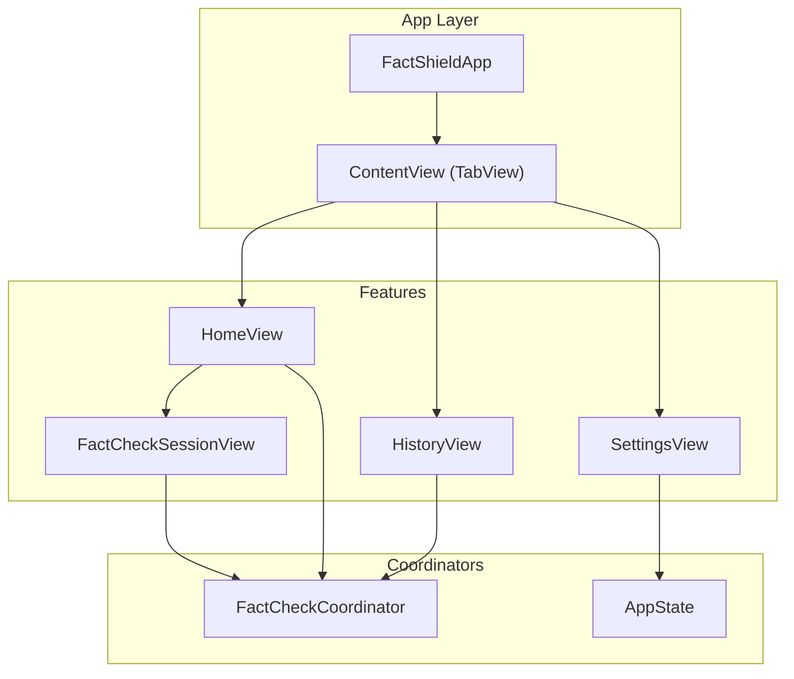
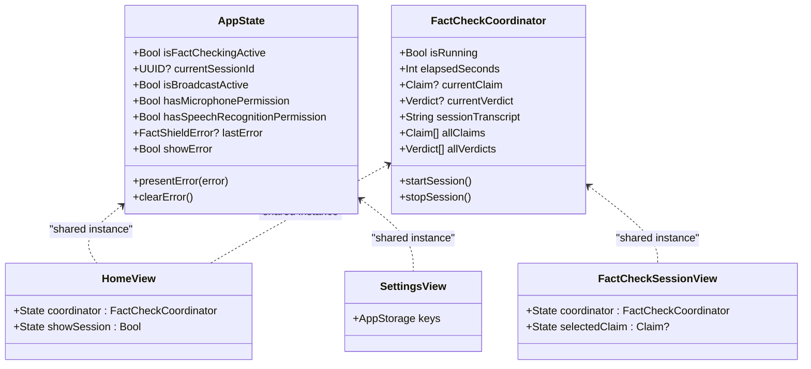
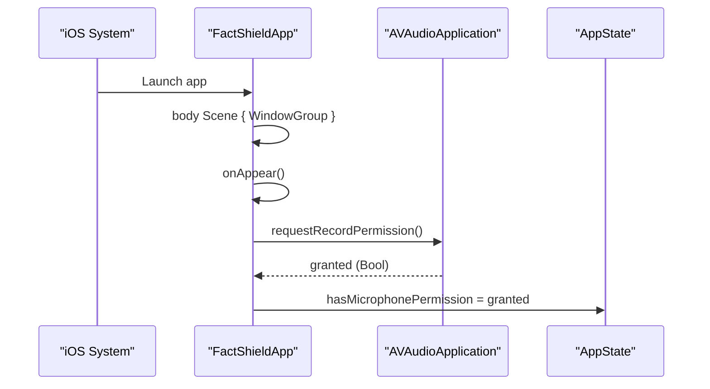
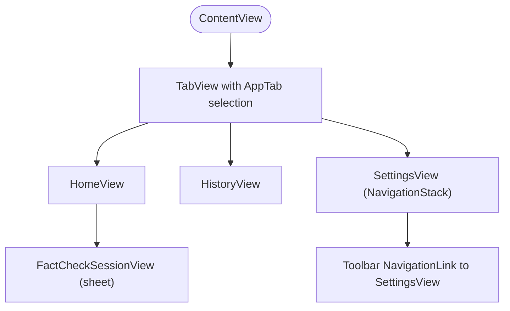
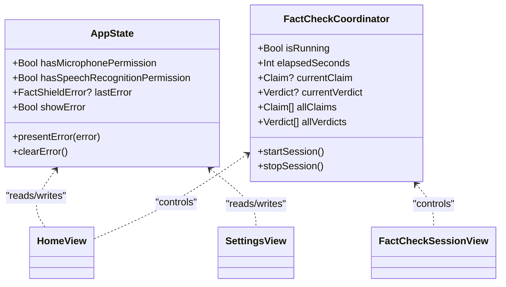
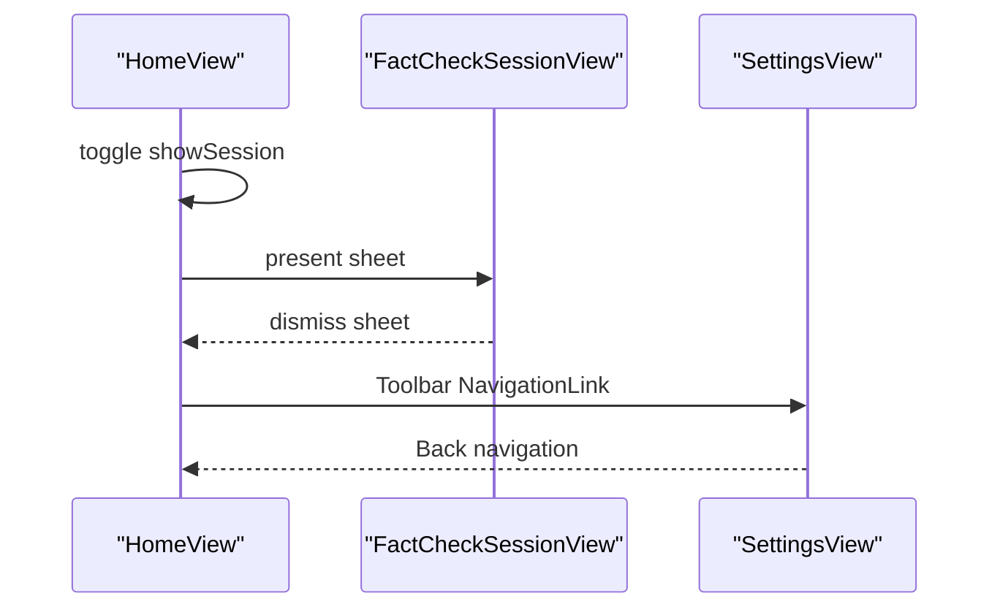
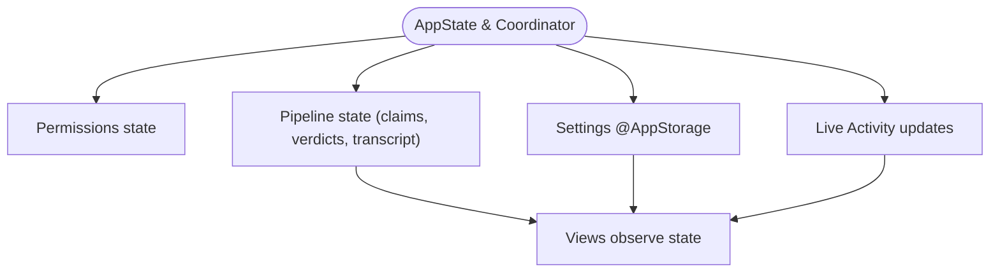
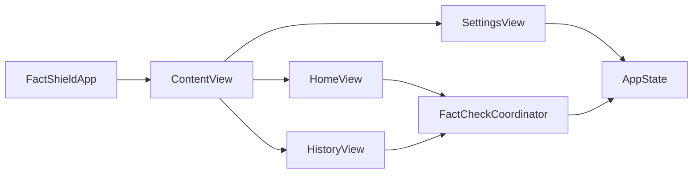

# Application Structure and Navigation

<cite>
**Referenced Files in This Document**
- [FactShieldApp.swift](file://FactShield/FactShield/App/FactShieldApp.swift)
- [AppState.swift](file://FactShield/FactShield/App/AppState.swift)
- [FactCheckCoordinator.swift](file://FactShield/FactShield/Features/FactCheck/FactCheckCoordinator.swift)
- [HomeView.swift](file://FactShield/FactShield/Features/Home/HomeView.swift)
- [SettingsView.swift](file://FactShield/FactShield/Features/Settings/SettingsView.swift)
- [FactCheckSessionView.swift](file://FactShield/FactShield/Features/FactCheck/FactCheckSessionView.swift)
- [Enums.swift](file://FactShield/FactShield/Models/Enums.swift)
- [FactCheckSession.swift](file://FactShield/FactShield/Models/FactCheckSession.swift)
- [Constants.swift](file://FactShield/FactShield/Utilities/Constants.swift)
- [Info.plist](file://FactShield/FactShield/Resources/Info.plist)
- [Package.swift](file://FactShield/Package.swift)
</cite>

## Table of Contents
1. [Introduction](#introduction)
2. [Project Structure](#project-structure)
3. [Core Components](#core-components)
4. [Architecture Overview](#architecture-overview)
5. [Detailed Component Analysis](#detailed-component-analysis)
6. [Dependency Analysis](#dependency-analysis)
7. [Performance Considerations](#performance-considerations)
8. [Troubleshooting Guide](#troubleshooting-guide)
9. [Conclusion](#conclusion)
10. [Appendices](#appendices)

## Introduction
This document explains the application structure and navigation system of FactChecking Live. It covers the main application entry point, window configuration, and app lifecycle management. It details the tab-based navigation architecture, scene management, and state preservation strategies. It documents the AppState implementation for global state management, shared coordinator access, and inter-component communication patterns. It also describes the navigation flow between Home, Settings, and FactCheckSession views, including programmatic navigation triggers and state synchronization. Guidance is provided on extending the navigation system, adding new tabs or views, and maintaining consistent navigation patterns.

## Project Structure
The application is organized as a single-module iOS/macOS library target named FactShield. The SwiftUI-based UI is structured around three primary feature areas: Home, Settings, and FactCheck. A central coordinator manages the live verification pipeline, while a shared AppState holds global state and permissions. The app uses a tab-based interface with a dedicated History tab placeholder and a Settings tab. NavigationStacks are used within views to manage hierarchical navigation.

**Diagram sources**
- [FactShieldApp.swift:9-54](file://FactShield/FactShield/App/FactShieldApp.swift#L9-L54)
- [HomeView.swift:3-59](file://FactShield/FactShield/Features/Home/HomeView.swift#L3-L59)
- [SettingsView.swift:3-111](file://FactShield/FactShield/Features/Settings/SettingsView.swift#L3-L111)
- [FactCheckCoordinator.swift:5-37](file://FactShield/FactShield/Features/FactCheck/FactCheckCoordinator.swift#L5-L37)
- [AppState.swift:4-29](file://FactShield/FactShield/App/AppState.swift#L4-L29)

**Section sources**
- [Package.swift:1-25](file://FactShield/Package.swift#L1-L25)
- [FactShieldApp.swift:9-54](file://FactShield/FactShield/App/FactShieldApp.swift#L9-L54)

## Core Components
- FactShieldApp: The SwiftUI App entry point that configures the initial Scene with a WindowGroup and requests microphone permissions on appearance. It embeds ContentView as the root view.
- ContentView: Hosts a TabView with Home, History, and Settings tabs. Uses AppTab enumeration for selection and tagging.
- AppState: A singleton @Observable class managing global state including permissions, error state, and flags for active sessions and broadcasts.
- FactCheckCoordinator: A singleton @Observable coordinator orchestrating the live verification pipeline, including timers, service wiring, and Live Activity updates.
- HomeView: Provides the landing screen with a hero card, active session banner, and navigation to Settings. It programmatically opens the FactCheckSession sheet when starting a session.
- SettingsView: Presents configurable settings backed by @AppStorage and displays status rows for configuration checks.
- FactCheckSessionView: Manages the live verification session UI, including status cards, claim lists, verdict cards, and a transcript viewer. Supports starting/stopping the session and opening claim details.

**Section sources**
- [FactShieldApp.swift:4-26](file://FactShield/FactShield/App/FactShieldApp.swift#L4-L26)
- [FactShieldApp.swift:28-54](file://FactShield/FactShield/App/FactShieldApp.swift#L28-L54)
- [AppState.swift:4-29](file://FactShield/FactShield/App/AppState.swift#L4-L29)
- [FactCheckCoordinator.swift:5-37](file://FactShield/FactShield/Features/FactCheck/FactCheckCoordinator.swift#L5-L37)
- [HomeView.swift:3-59](file://FactShield/FactShield/Features/Home/HomeView.swift#L3-L59)
- [SettingsView.swift:3-111](file://FactShield/FactShield/Features/Settings/SettingsView.swift#L3-L111)
- [FactCheckSessionView.swift:3-77](file://FactShield/FactShield/Features/FactCheck/FactCheckSessionView.swift#L3-L77)

## Architecture Overview
The app follows a SwiftUI-centric architecture with a coordinator pattern for the live verification pipeline and a centralized state container. Navigation is primarily tab-based, with targeted sheets and nested NavigationStacks for hierarchical views. The coordinator and state are shared singletons accessed by views to maintain synchronization across the UI.

**Diagram sources**
- [AppState.swift:4-29](file://FactShield/FactShield/App/AppState.swift#L4-L29)
- [FactCheckCoordinator.swift:5-37](file://FactShield/FactShield/Features/FactCheck/FactCheckCoordinator.swift#L5-L37)
- [HomeView.swift:3-59](file://FactShield/FactShield/Features/Home/HomeView.swift#L3-L59)
- [SettingsView.swift:3-111](file://FactShield/FactShield/Features/Settings/SettingsView.swift#L3-L111)
- [FactCheckSessionView.swift:3-77](file://FactShield/FactShield/Features/FactCheck/FactCheckSessionView.swift#L3-L77)

## Detailed Component Analysis

### Application Entry Point and Lifecycle
- Entry point: The @main FactShieldApp defines the Scene as a WindowGroup hosting ContentView.
- Lifecycle: On first appearance, the app requests microphone permission and updates AppState.hasMicrophonePermission accordingly.
- Window configuration: Single WindowGroup scene is used; multi-window support is not implemented in the visible code.

**Diagram sources**
- [FactShieldApp.swift:9-25](file://FactShield/FactShield/App/FactShieldApp.swift#L9-L25)
- [AppState.swift:12-14](file://FactShield/FactShield/App/AppState.swift#L12-L14)

**Section sources**
- [FactShieldApp.swift:4-26](file://FactShield/FactShield/App/FactShieldApp.swift#L4-L26)

### Tab-Based Navigation Architecture
- ContentView hosts a TabView with three tabs: Home, History, Settings.
- AppTab enumeration drives selection and tagging for each tab.
- HistoryView is a placeholder that lists verdicts from the coordinator’s in-memory arrays.
- SettingsView is embedded inside a NavigationStack within the tab.

**Diagram sources**
- [FactShieldApp.swift:28-54](file://FactShield/FactShield/App/FactShieldApp.swift#L28-L54)
- [Enums.swift:5-9](file://FactShield/FactShield/Models/Enums.swift#L5-L9)

**Section sources**
- [FactShieldApp.swift:28-54](file://FactShield/FactShield/App/FactShieldApp.swift#L28-L54)
- [Enums.swift:5-9](file://FactShield/FactShield/Models/Enums.swift#L5-L9)

### AppState Implementation and Inter-Component Communication
- AppState is a singleton @Observable class holding permissions, error state, and flags for active sessions and broadcasts.
- Views access AppState.shared to reflect and update global state (e.g., microphone permission).
- FactCheckCoordinator is also a singleton @Observable, providing pipeline state and driving UI updates through SwiftUI’s reactive system.

**Diagram sources**
- [AppState.swift:4-29](file://FactShield/FactShield/App/AppState.swift#L4-L29)
- [FactCheckCoordinator.swift:5-37](file://FactShield/FactShield/Features/FactCheck/FactCheckCoordinator.swift#L5-L37)
- [HomeView.swift:3-59](file://FactShield/FactShield/Features/Home/HomeView.swift#L3-L59)
- [FactCheckSessionView.swift:3-77](file://FactShield/FactShield/Features/FactCheck/FactCheckSessionView.swift#L3-L77)

**Section sources**
- [AppState.swift:4-29](file://FactShield/FactShield/App/AppState.swift#L4-L29)
- [FactCheckCoordinator.swift:5-37](file://FactShield/FactShield/Features/FactCheck/FactCheckCoordinator.swift#L5-L37)

### Navigation Flow Between Home, Settings, and FactCheckSession
- Home to Settings: A toolbar button navigates to SettingsView within a NavigationStack.
- Home to FactCheckSession: Tapping the hero card or active session banner sets a Boolean state that presents the FactCheckSession sheet.
- Settings to Home: No direct programmatic navigation is defined; users navigate via the tab bar.
- Programmatic triggers: State-driven sheet presentation and toolbar-based navigation are used to move between views.

**Diagram sources**
- [HomeView.swift:44-59](file://FactShield/FactShield/Features/Home/HomeView.swift#L44-L59)
- [FactCheckSessionView.swift:54-77](file://FactShield/FactShield/Features/FactCheck/FactCheckSessionView.swift#L54-L77)
- [SettingsView.swift:46-52](file://FactShield/FactShield/Features/Settings/SettingsView.swift#L46-L52)

**Section sources**
- [HomeView.swift:44-59](file://FactShield/FactShield/Features/Home/HomeView.swift#L44-L59)
- [FactCheckSessionView.swift:54-77](file://FactShield/FactShield/Features/FactCheck/FactCheckSessionView.swift#L54-L77)
- [SettingsView.swift:46-52](file://FactShield/FactShield/Features/Settings/SettingsView.swift#L46-L52)

### State Preservation Strategies
- In-memory state: FactCheckCoordinator maintains currentClaim, currentVerdict, sessionTranscript, and in-session arrays for claims and verdicts.
- Persistent preferences: SettingsView uses @AppStorage for API keys and pipeline settings, ensuring persistence across launches.
- Live Activity updates: The coordinator periodically updates the Live Activity with current state, preserving visibility during background operation.
- Permissions: AppState tracks microphone and speech recognition permissions to gate functionality.

**Diagram sources**
- [AppState.swift:12-18](file://FactShield/FactShield/App/AppState.swift#L12-L18)
- [FactCheckCoordinator.swift:19-36](file://FactShield/FactShield/Features/FactCheck/FactCheckCoordinator.swift#L19-L36)
- [SettingsView.swift:4-11](file://FactShield/FactShield/Features/Settings/SettingsView.swift#L4-L11)

**Section sources**
- [AppState.swift:12-18](file://FactShield/FactShield/App/AppState.swift#L12-L18)
- [FactCheckCoordinator.swift:19-36](file://FactShield/FactShield/Features/FactCheck/FactCheckCoordinator.swift#L19-L36)
- [SettingsView.swift:4-11](file://FactShield/FactShield/Features/Settings/SettingsView.swift#L4-L11)

### Extending the Navigation System and Adding New Tabs
- Add a new tab: Define a new case in AppTab, add a new tab item in ContentView.TabView, and implement the destination view.
- Maintain consistent patterns: Use NavigationStack for hierarchical views, and rely on shared instances of AppState and FactCheckCoordinator for state access.
- Preserve state: Ensure new views read from FactCheckCoordinator and write to AppState as appropriate to keep UI synchronized.

Guidance summary:
- Keep ContentView.TabView the single source of truth for tab navigation.
- Use @State bindings for selection and @Observable singletons for state.
- For new views, wire toolbar buttons or navigation links to maintain consistent UX.

**Section sources**
- [FactShieldApp.swift:28-54](file://FactShield/FactShield/App/FactShieldApp.swift#L28-L54)
- [Enums.swift:5-9](file://FactShield/FactShield/Models/Enums.swift#L5-L9)

## Dependency Analysis
The app exhibits a clean separation of concerns:
- App layer depends on SwiftUI and AVFAudio for permissions.
- Feature views depend on shared coordinator and state.
- Coordinator encapsulates service orchestration and timer-based pipelines.
- Models and utilities provide enums, constants, and session structures.

**Diagram sources**
- [FactShieldApp.swift:9-54](file://FactShield/FactShield/App/FactShieldApp.swift#L9-L54)
- [HomeView.swift:3-59](file://FactShield/FactShield/Features/Home/HomeView.swift#L3-L59)
- [SettingsView.swift:3-111](file://FactShield/FactShield/Features/Settings/SettingsView.swift#L3-L111)
- [FactCheckCoordinator.swift:5-37](file://FactShield/FactShield/Features/FactCheck/FactCheckCoordinator.swift#L5-L37)
- [AppState.swift:4-29](file://FactShield/FactShield/App/AppState.swift#L4-L29)

**Section sources**
- [FactShieldApp.swift:9-54](file://FactShield/FactShield/App/FactShieldApp.swift#L9-L54)
- [FactCheckCoordinator.swift:5-37](file://FactShield/FactShield/Features/FactCheck/FactCheckCoordinator.swift#L5-L37)
- [AppState.swift:4-29](file://FactShield/FactShield/App/AppState.swift#L4-L29)

## Performance Considerations
- Timers: The coordinator uses scheduled timers for periodic claim extraction and elapsed time updates. Ensure timers are invalidated on session stop to prevent leaks.
- UI updates: SwiftUI’s @Observable singletons propagate state changes efficiently; avoid unnecessary work in main actor-bound activity updates.
- Live Activity: Frequent updates are throttled by the coordinator’s update frequency; keep UI animations minimal to preserve responsiveness.
- Memory: In-memory arrays for claims and verdicts grow during sessions; consider trimming older entries for long-running sessions.

[No sources needed since this section provides general guidance]

## Troubleshooting Guide
- Microphone permission denied: AppState.hasMicrophonePermission reflects the system response. Ensure Info.plist includes NSMicrophoneUsageDescription and handle denial gracefully in views.
- Speech recognition unavailable: AppState tracks permissions; present user-friendly alerts when unavailable.
- API key missing: SettingsView indicates configuration status; prompt users to configure keys in Settings.
- Session errors: The coordinator logs pipeline errors; surface them via AppState.presentError and show alerts in views.

**Section sources**
- [AppState.swift:16-28](file://FactShield/FactShield/App/AppState.swift#L16-L28)
- [Info.plist:5-9](file://FactShield/FactShield/Resources/Info.plist#L5-L9)
- [SettingsView.swift:65-73](file://FactShield/FactShield/Features/Settings/SettingsView.swift#L65-L73)
- [FactCheckCoordinator.swift:158-161](file://FactShield/FactShield/Features/FactCheck/FactCheckCoordinator.swift#L158-L161)

## Conclusion
FactChecking Live employs a clear SwiftUI architecture with a tabbed interface, a shared coordinator for the live verification pipeline, and a centralized AppState for global state. Navigation is straightforward, with programmatic sheet presentations and toolbar-based navigation. Extending the system involves adding new tabs in ContentView, implementing destinations, and leveraging shared singletons for state and coordination. Maintaining consistent patterns ensures predictable behavior and easy maintenance.

[No sources needed since this section summarizes without analyzing specific files]

## Appendices

### App Delegate and Scene Delegate Notes
- Scene configuration: The app uses a WindowGroup scene in the App struct; no explicit SceneDelegate subclass is present in the visible code.
- Multi-window support: Not implemented in the current codebase.

**Section sources**
- [FactShieldApp.swift:9-16](file://FactShield/FactShield/App/FactShieldApp.swift#L9-L16)

### Data Models Used by Navigation and State
- AppTab: Defines tab identifiers for ContentView selection.
- FactCheckSession: Represents session metadata and status, useful for future persistence and history.

**Section sources**
- [Enums.swift:5-9](file://FactShield/FactShield/Models/Enums.swift#L5-L9)
- [FactCheckSession.swift:3-35](file://FactShield/FactShield/Models/FactCheckSession.swift#L3-L35)