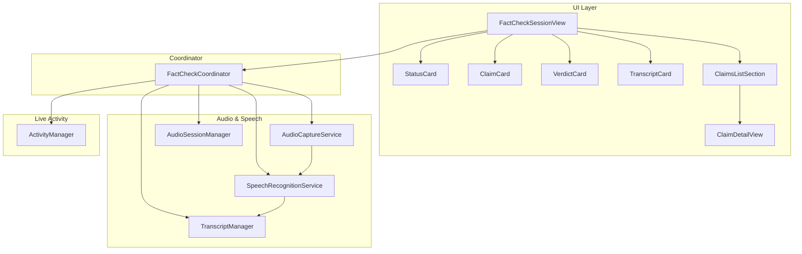
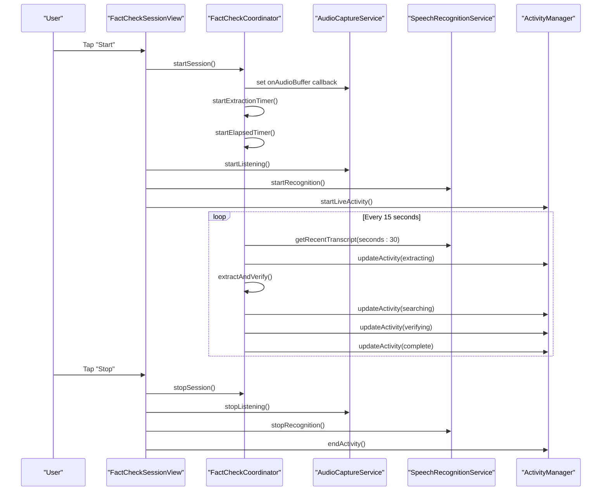
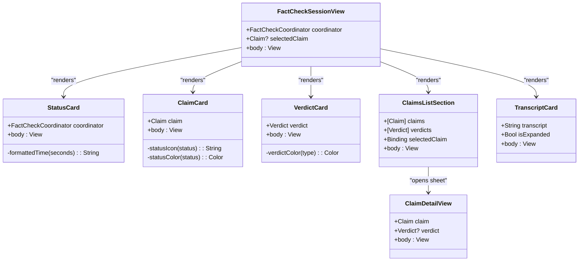
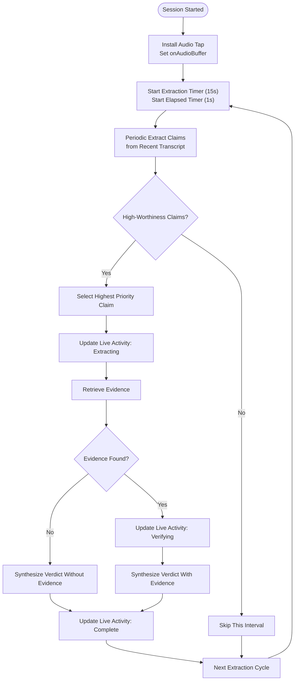
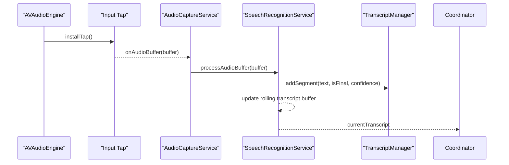
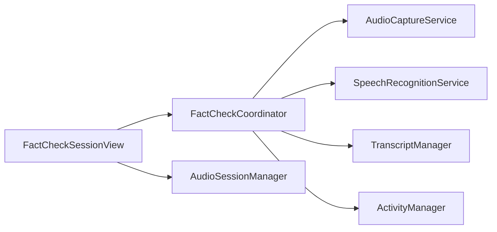

# FactCheck Session View

<cite>
**Referenced Files in This Document**
- [FactCheckSessionView.swift](file://FactShield/FactShield/Features/FactCheck/FactCheckSessionView.swift)
- [FactCheckCoordinator.swift](file://FactShield/FactShield/Features/FactCheck/FactCheckCoordinator.swift)
- [AudioCaptureService.swift](file://FactShield/FactShield/Core/Audio/AudioCaptureService.swift)
- [SpeechRecognitionService.swift](file://FactShield/FactShield/Core/Speech/SpeechRecognitionService.swift)
- [AudioSessionManager.swift](file://FactShield/FactShield/Core/Audio/AudioSessionManager.swift)
- [TranscriptManager.swift](file://FactShield/FactShield/Core/Speech/TranscriptManager.swift)
- [ActivityManager.swift](file://FactShield/FactShield/Widgets/ActivityManager.swift)
- [FactCheckSession.swift](file://FactShield/FactShield/Models/FactCheckSession.swift)
- [Claim.swift](file://FactShield/FactShield/Core/Claims/Claim.swift)
- [Verdict.swift](file://FactShield/FactShield/Core/Verification/Verdict.swift)
- [Source.swift](file://FactShield/FactShield/Models/Source.swift)
- [HomeView.swift](file://FactShield/FactShield/Features/Home/HomeView.swift)
- [Constants.swift](file://FactShield/FactShield/Utilities/Constants.swift)
</cite>

## Table of Contents
1. [Introduction](#introduction)
2. [Project Structure](#project-structure)
3. [Core Components](#core-components)
4. [Architecture Overview](#architecture-overview)
5. [Detailed Component Analysis](#detailed-component-analysis)
6. [Dependency Analysis](#dependency-analysis)
7. [Performance Considerations](#performance-considerations)
8. [Troubleshooting Guide](#troubleshooting-guide)
9. [Conclusion](#conclusion)
10. [Appendices](#appendices)

## Introduction
This document provides comprehensive documentation for the FactCheckSessionView component, the real-time fact-checking interface. It explains session management UI elements including live audio status, transcript display, claim extraction progress indicators, and verdict presentation. It also details real-time data binding patterns for audio levels, speech recognition results, and the fact-checking pipeline status. User interaction elements for session control, claim review, evidence exploration, and result sharing are documented alongside dynamic content updates, progress tracking, and error state handling. Guidance is included for customizing the session interface, adding new visual indicators, and integrating additional fact-checking information displays.

## Project Structure
The FactCheckSessionView resides within the Features/FactCheck module and orchestrates real-time UI updates driven by the FactCheckCoordinator. Supporting services manage audio capture, speech recognition, transcript buffering, and Live Activity updates. The view composes reusable SwiftUI components for status cards, claim cards, verdict cards, transcript display, and claim detail views.

**Diagram sources**
- [FactCheckSessionView.swift:1-77](file://FactShield/FactShield/Features/FactCheck/FactCheckSessionView.swift#L1-L77)
- [FactCheckCoordinator.swift:1-216](file://FactShield/FactShield/Features/FactCheck/FactCheckCoordinator.swift#L1-L216)
- [AudioCaptureService.swift:1-51](file://FactShield/FactShield/Core/Audio/AudioCaptureService.swift#L1-L51)
- [SpeechRecognitionService.swift:1-138](file://FactShield/FactShield/Core/Speech/SpeechRecognitionService.swift#L1-L138)
- [AudioSessionManager.swift:1-23](file://FactShield/FactShield/Core/Audio/AudioSessionManager.swift#L1-L23)
- [TranscriptManager.swift:1-53](file://FactShield/FactShield/Core/Speech/TranscriptManager.swift#L1-L53)
- [ActivityManager.swift:1-87](file://FactShield/FactShield/Widgets/ActivityManager.swift#L1-L87)

**Section sources**
- [FactCheckSessionView.swift:1-77](file://FactShield/FactShield/Features/FactCheck/FactCheckSessionView.swift#L1-L77)
- [FactCheckCoordinator.swift:1-216](file://FactShield/FactShield/Features/FactCheck/FactCheckCoordinator.swift#L1-L216)

## Core Components
- FactCheckSessionView: Main session UI composed of status card, current claim, current verdict, claims list, and transcript card. Provides toolbar controls to start/stop sessions and sheet navigation to claim detail view.
- FactCheckCoordinator: Orchestrates the real-time pipeline, manages timers, drives periodic claim extraction, updates Live Activity, and maintains session state.
- AudioCaptureService: Captures PCM audio buffers from the input node and forwards them via callbacks.
- SpeechRecognitionService: Streams audio buffers to the speech recognizer, maintains a rolling transcript buffer, and exposes recent/full transcripts.
- TranscriptManager: Maintains a rolling list of transcript segments with timestamps and provides recent/full transcript retrieval.
- ActivityManager: Manages Live Activity lifecycle and updates content state for Dynamic Island display.
- AudioSessionManager: Configures and deactivates the AVAudioSession for capture with appropriate categories and modes.
- Models: Claim, Verdict, Source, and FactCheckSession define the data structures for claims, evidentiary results, and session metadata.

**Section sources**
- [FactCheckSessionView.swift:1-77](file://FactShield/FactShield/Features/FactCheck/FactCheckSessionView.swift#L1-L77)
- [FactCheckCoordinator.swift:1-216](file://FactShield/FactShield/Features/FactCheck/FactCheckCoordinator.swift#L1-L216)
- [AudioCaptureService.swift:1-51](file://FactShield/FactShield/Core/Audio/AudioCaptureService.swift#L1-L51)
- [SpeechRecognitionService.swift:1-138](file://FactShield/FactShield/Core/Speech/SpeechRecognitionService.swift#L1-L138)
- [TranscriptManager.swift:1-53](file://FactShield/FactShield/Core/Speech/TranscriptManager.swift#L1-L53)
- [ActivityManager.swift:1-87](file://FactShield/FactShield/Widgets/ActivityManager.swift#L1-L87)
- [AudioSessionManager.swift:1-23](file://FactShield/FactShield/Core/Audio/AudioSessionManager.swift#L1-L23)
- [Claim.swift:1-37](file://FactShield/FactShield/Core/Claims/Claim.swift#L1-L37)
- [Verdict.swift:1-31](file://FactShield/FactShield/Core/Verification/Verdict.swift#L1-L31)
- [Source.swift:1-11](file://FactShield/FactShield/Models/Source.swift#L1-L11)
- [FactCheckSession.swift:1-54](file://FactShield/FactShield/Models/FactCheckSession.swift#L1-L54)

## Architecture Overview
The FactCheckSessionView renders real-time state from FactCheckCoordinator, which coordinates audio capture, speech recognition, periodic claim extraction, evidence retrieval, and verdict synthesis. Live Activity is updated continuously to reflect the current verification status and results.

**Diagram sources**
- [FactCheckSessionView.swift:44-76](file://FactShield/FactShield/Features/FactCheck/FactCheckSessionView.swift#L44-L76)
- [FactCheckCoordinator.swift:38-201](file://FactShield/FactShield/Features/FactCheck/FactCheckCoordinator.swift#L38-L201)
- [AudioCaptureService.swift:19-49](file://FactShield/FactShield/Core/Audio/AudioCaptureService.swift#L19-L49)
- [SpeechRecognitionService.swift:41-101](file://FactShield/FactShield/Core/Speech/SpeechRecognitionService.swift#L41-L101)
- [ActivityManager.swift:16-67](file://FactShield/FactShield/Widgets/ActivityManager.swift#L16-L67)

## Detailed Component Analysis

### FactCheckSessionView
- Composition: Renders status card, current claim, current verdict, claims list, and transcript card inside a scrollable VStack with padding and animations.
- Toolbar Controls: Conditional buttons ("Start"/"Stop") orchestrate session lifecycle, audio capture, speech recognition, and Live Activity.
- Sheet Navigation: Opens ClaimDetailView for selected claim with associated verdict.
- Real-time Binding: Observes FactCheckCoordinator state for currentClaim, currentVerdict, allClaims, allVerdicts, sessionTranscript, and isRunning.

**Diagram sources**
- [FactCheckSessionView.swift:3-77](file://FactShield/FactShield/Features/FactCheck/FactCheckSessionView.swift#L3-L77)
- [FactCheckSessionView.swift:81-125](file://FactShield/FactShield/Features/FactCheck/FactCheckSessionView.swift#L81-L125)
- [FactCheckSessionView.swift:129-185](file://FactShield/FactShield/Features/FactCheck/FactCheckSessionView.swift#L129-L185)
- [FactCheckSessionView.swift:213-281](file://FactShield/FactShield/Features/FactCheck/FactCheckSessionView.swift#L213-L281)
- [FactCheckSessionView.swift:322-348](file://FactShield/FactShield/Features/FactCheck/FactCheckSessionView.swift#L322-L348)
- [FactCheckSessionView.swift:407-440](file://FactShield/FactShield/Features/FactCheck/FactCheckSessionView.swift#L407-L440)
- [FactCheckSessionView.swift:444-505](file://FactShield/FactShield/Features/FactCheck/FactCheckSessionView.swift#L444-L505)

**Section sources**
- [FactCheckSessionView.swift:7-76](file://FactShield/FactShield/Features/FactCheck/FactCheckSessionView.swift#L7-L76)

### StatusCard
- Displays session status (active/inactive), elapsed time, and claim count when running.
- Uses animated symbols and material backgrounds for visual clarity.

**Section sources**
- [FactCheckSessionView.swift:81-125](file://FactShield/FactShield/Features/FactCheck/FactCheckSessionView.swift#L81-L125)

### ClaimCard
- Shows detected claim text, worthiness badge, status with icon and color, and timestamp.
- Uses status-specific icons and colors for visual feedback.

**Section sources**
- [FactCheckSessionView.swift:129-185](file://FactShield/FactShield/Features/FactCheck/FactCheckSessionView.swift#L129-L185)

### VerdictCard
- Presents verdict type with colored indicator, confidence percentage, reasoning summary, and optional sources list with credibility indicators.
- Adds a subtle border overlay matching verdict color.

**Section sources**
- [FactCheckSessionView.swift:213-281](file://FactShield/FactShield/Features/FactCheck/FactCheckSessionView.swift#L213-L281)

### SourceRow
- Displays source name, optional bias rating, snippet, and credibility dot color-coded by score.

**Section sources**
- [FactCheckSessionView.swift:285-318](file://FactShield/FactShield/Features/FactCheck/FactCheckSessionView.swift#L285-L318)

### ClaimsListSection and ClaimListRow
- Lists all claims with optional verdict indicators and timestamps.
- Tapping a row selects the claim for detail view.

**Section sources**
- [FactCheckSessionView.swift:322-403](file://FactShield/FactShield/Features/FactCheck/FactCheckSessionView.swift#L322-L403)

### TranscriptCard
- Shows live transcript with expand/collapse toggle and line limit for readability.
- Indicates "Waiting for audio..." when transcript is empty.

**Section sources**
- [FactCheckSessionView.swift:407-440](file://FactShield/FactShield/Features/FactCheck/FactCheckSessionView.swift#L407-L440)

### ClaimDetailView
- Full-screen detail view for a selected claim with worthiness badge, timestamp, and either verdict or a progress indicator.

**Section sources**
- [FactCheckSessionView.swift:444-505](file://FactShield/FactShield/Features/FactCheck/FactCheckSessionView.swift#L444-L505)

### FactCheckCoordinator
- Manages session lifecycle, audio buffer callbacks, periodic extraction timer, elapsed time, and Live Activity updates.
- Drives the end-to-end pipeline: extract claims from recent transcript → retrieve evidence → synthesize verdict → update UI and Live Activity.

**Diagram sources**
- [FactCheckCoordinator.swift:38-201](file://FactShield/FactShield/Features/FactCheck/FactCheckCoordinator.swift#L38-L201)

**Section sources**
- [FactCheckCoordinator.swift:1-216](file://FactShield/FactShield/Features/FactCheck/FactCheckCoordinator.swift#L1-L216)

### Audio and Speech Pipeline
- AudioCaptureService installs a tap on the input node and forwards PCM buffers to the coordinator.
- SpeechRecognitionService streams buffers to the speech recognizer, maintains a rolling transcript buffer, and exposes recent/full transcripts.
- TranscriptManager keeps segments with timestamps and trims old entries to maintain memory bounds.

**Diagram sources**
- [AudioCaptureService.swift:19-49](file://FactShield/FactShield/Core/Audio/AudioCaptureService.swift#L19-L49)
- [SpeechRecognitionService.swift:86-136](file://FactShield/FactShield/Core/Speech/SpeechRecognitionService.swift#L86-L136)
- [TranscriptManager.swift:26-46](file://FactShield/FactShield/Core/Speech/TranscriptManager.swift#L26-L46)

**Section sources**
- [AudioCaptureService.swift:1-51](file://FactShield/FactShield/Core/Audio/AudioCaptureService.swift#L1-L51)
- [SpeechRecognitionService.swift:1-138](file://FactShield/FactShield/Core/Speech/SpeechRecognitionService.swift#L1-L138)
- [TranscriptManager.swift:1-53](file://FactShield/FactShield/Core/Speech/TranscriptManager.swift#L1-L53)

### Live Activity Integration
- ActivityManager starts and updates Live Activity content state, reflecting current status, verdict, confidence, source count, and reasoning summary.
- FactCheckCoordinator updates Live Activity during each stage of the pipeline and periodically with elapsed time.

**Section sources**
- [ActivityManager.swift:1-87](file://FactShield/FactShield/Widgets/ActivityManager.swift#L1-L87)
- [FactCheckCoordinator.swift:164-201](file://FactShield/FactShield/Features/FactCheck/FactCheckCoordinator.swift#L164-L201)

### Models and Data Structures
- Claim: Identifies claim text, timestamp, speaker, worthiness level, and status.
- Verdict: Contains verdict type, confidence, reasoning, sources, timestamps, and elapsed verification duration.
- Source: Represents external sources with credibility scores and bias ratings.
- FactCheckSession: Session metadata including capture mode, status, transcript, claims, and verdicts.

**Section sources**
- [Claim.swift:1-37](file://FactShield/FactShield/Core/Claims/Claim.swift#L1-L37)
- [Verdict.swift:1-31](file://FactShield/FactShield/Core/Verification/Verdict.swift#L1-L31)
- [Source.swift:1-11](file://FactShield/FactShield/Models/Source.swift#L1-L11)
- [FactCheckSession.swift:1-54](file://FactShield/FactShield/Models/FactCheckSession.swift#L1-L54)

## Dependency Analysis
The FactCheckSessionView depends on FactCheckCoordinator for reactive state updates. FactCheckCoordinator depends on AudioCaptureService, SpeechRecognitionService, TranscriptManager, and ActivityManager. AudioSessionManager configures the audio session for capture.

**Diagram sources**
- [FactCheckSessionView.swift:3-7](file://FactShield/FactShield/Features/FactCheck/FactCheckSessionView.swift#L3-L7)
- [FactCheckCoordinator.swift:11-17](file://FactShield/FactShield/Features/FactCheck/FactCheckCoordinator.swift#L11-L17)
- [AudioSessionManager.swift:4-21](file://FactShield/FactShield/Core/Audio/AudioSessionManager.swift#L4-L21)

**Section sources**
- [FactCheckSessionView.swift:1-77](file://FactShield/FactShield/Features/FactCheck/FactCheckSessionView.swift#L1-L77)
- [FactCheckCoordinator.swift:1-216](file://FactShield/FactShield/Features/FactCheck/FactCheckCoordinator.swift#L1-L216)

## Performance Considerations
- Continuous audio buffer processing occurs on a dedicated queue to avoid blocking the main thread.
- Speech recognition uses on-device recognition when available to reduce latency and improve privacy.
- Transcript buffers are trimmed to a fixed time window to prevent unbounded memory growth.
- UI animations are scoped to specific state changes to minimize layout thrash.
- Live Activity updates are batched with elapsed time increments to reduce update frequency.

[No sources needed since this section provides general guidance]

## Troubleshooting Guide
- Speech Recognition Not Authorized: The service requests authorization and logs warnings if denied. Ensure permissions are granted in Settings.
- Speech Recognition Unavailable: Device may report recognizer unavailability; the service attempts restart after errors.
- Audio Session Configuration Failures: Configure category and mode for voice chat with echo cancellation; verify session activation.
- Live Activity Disabled: Live Activity requires user enablement; the manager throws descriptive errors when disabled.
- Session State Mismatch: Ensure proper cleanup of timers and taps on stop; verify coordinator state transitions.

**Section sources**
- [SpeechRecognitionService.swift:28-39](file://FactShield/FactShield/Core/Speech/SpeechRecognitionService.swift#L28-L39)
- [SpeechRecognitionService.swift:42-45](file://FactShield/FactShield/Core/Speech/SpeechRecognitionService.swift#L42-L45)
- [SpeechRecognitionService.swift:76-80](file://FactShield/FactShield/Core/Speech/SpeechRecognitionService.swift#L76-L80)
- [AudioSessionManager.swift:8-17](file://FactShield/FactShield/Core/Audio/AudioSessionManager.swift#L8-L17)
- [ActivityManager.swift:17-20](file://FactShield/FactShield/Widgets/ActivityManager.swift#L17-L20)
- [FactCheckCoordinator.swift:57-65](file://FactShield/FactShield/Features/FactCheck/FactCheckCoordinator.swift#L57-L65)

## Conclusion
The FactCheckSessionView provides a comprehensive real-time fact-checking interface that binds to a robust coordinator-driven pipeline. It visually communicates session status, claim detection progress, and verdict outcomes while enabling user interaction for review and exploration. The architecture balances responsiveness, privacy, and accessibility through careful separation of concerns, efficient data structures, and Live Activity integration.

[No sources needed since this section summarizes without analyzing specific files]

## Appendices

### Accessibility Features
- Dynamic Island Updates: Live Activity reflects current status, verdict, and confidence for glanceable verification insights.
- Voice Chat Mode: Audio session configured for voice chat enables acoustic echo cancellation for clearer capture.
- Animated Feedback: Pulse symbols and color-coded status indicators enhance real-time awareness.

**Section sources**
- [ActivityManager.swift:16-67](file://FactShield/FactShield/Widgets/ActivityManager.swift#L16-L67)
- [AudioSessionManager.swift:8-17](file://FactShield/FactShield/Core/Audio/AudioSessionManager.swift#L8-L17)
- [FactCheckSessionView.swift:86-89](file://FactShield/FactShield/Features/FactCheck/FactCheckSessionView.swift#L86-L89)

### Customization Guidelines
- Adding New Visual Indicators:
  - Extend ClaimCard or VerdictCard with new badges or status dots aligned with existing color coding.
  - Add new enum cases in Claim.ClaimStatus or Verdict.VerdictType and map to icons/colors accordingly.
- Integrating Additional Information Displays:
  - Extend TranscriptCard to include speaker diarization or confidence overlays.
  - Enhance ClaimDetailView with additional metadata panels (e.g., source credibility breakdown).
- Performance Optimizations:
  - Adjust extraction interval and recent transcript window via Constants to balance responsiveness and resource usage.
  - Monitor Live Activity update frequency to avoid excessive refresh rates.

**Section sources**
- [FactCheckSessionView.swift:129-185](file://FactShield/FactShield/Features/FactCheck/FactCheckSessionView.swift#L129-L185)
- [FactCheckSessionView.swift:213-281](file://FactShield/FactShield/Features/FactCheck/FactCheckSessionView.swift#L213-L281)
- [Constants.swift:24-26](file://FactShield/FactShield/Utilities/Constants.swift#L24-L26)