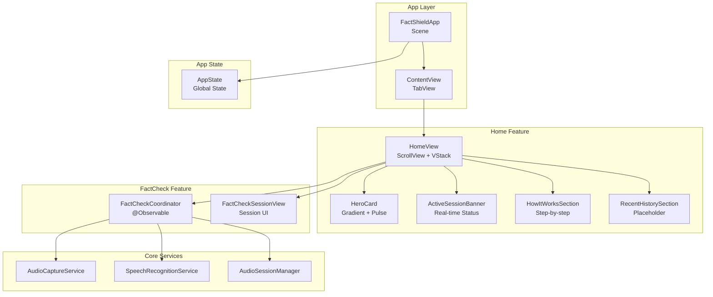
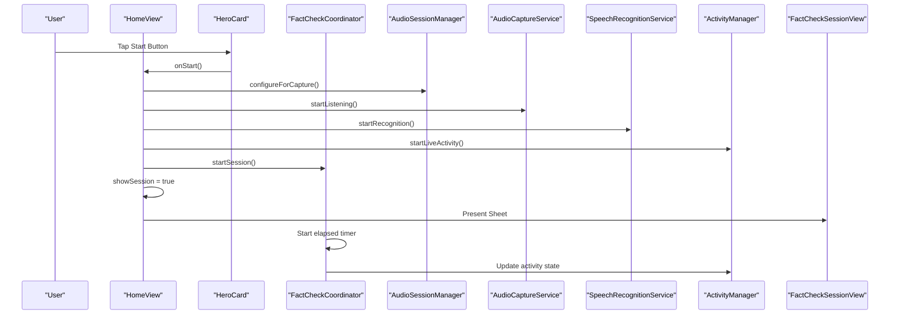
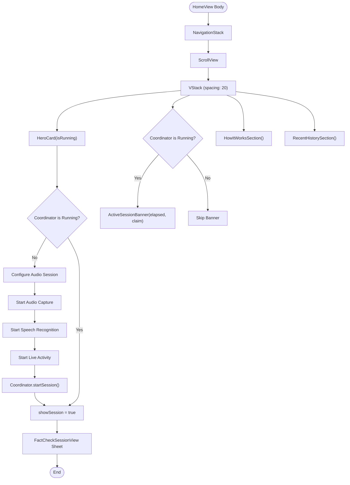
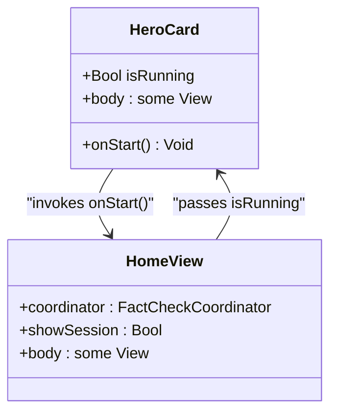
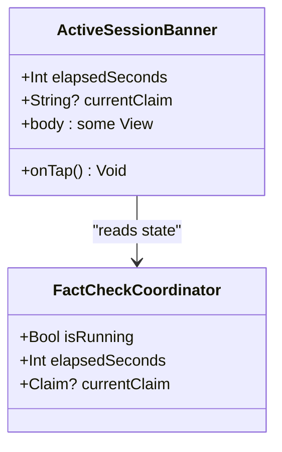
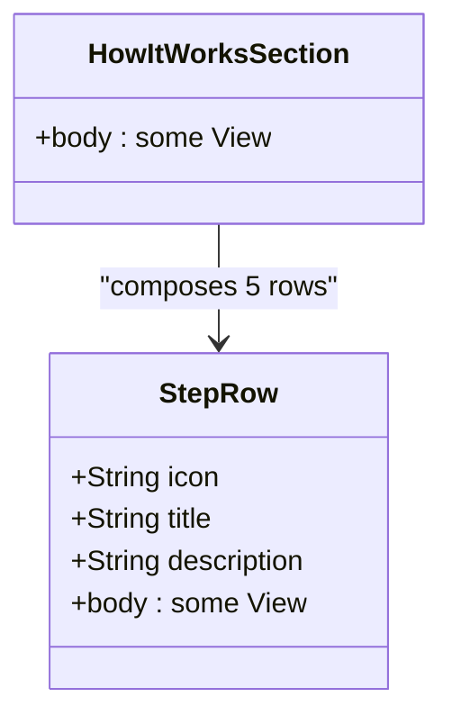
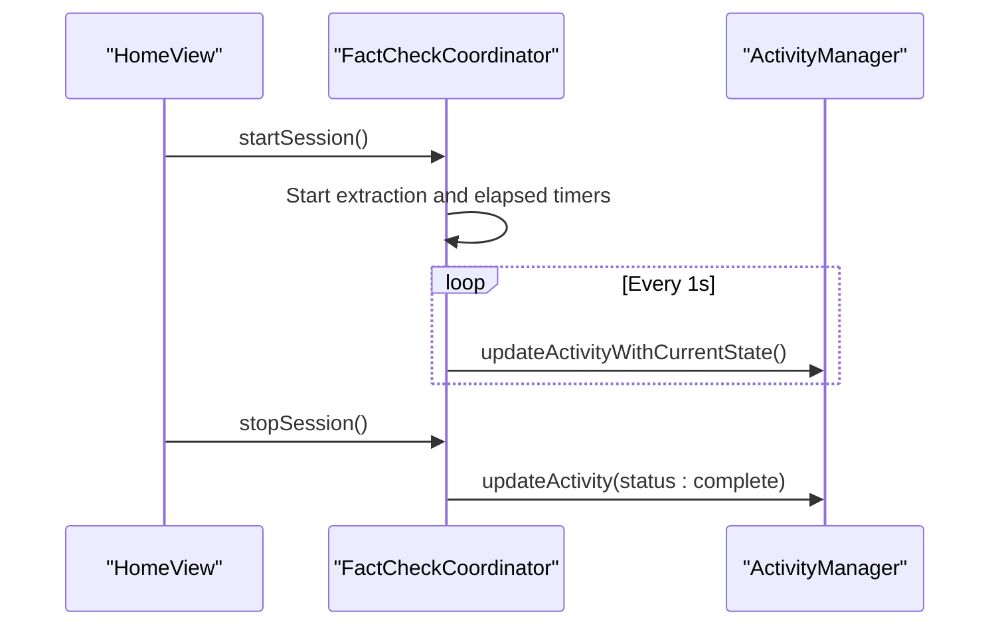
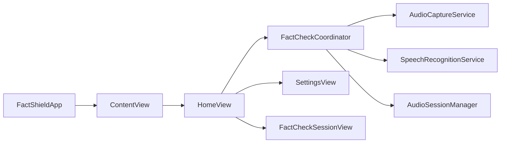

# Home View

<cite>
**Referenced Files in This Document**
- [HomeView.swift](file://FactShield/FactShield/Features/Home/HomeView.swift)
- [FactCheckCoordinator.swift](file://FactShield/FactShield/Features/FactCheck/FactCheckCoordinator.swift)
- [FactCheckSessionView.swift](file://FactShield/FactShield/Features/FactCheck/FactCheckSessionView.swift)
- [FactShieldApp.swift](file://FactShield/FactShield/App/FactShieldApp.swift)
- [SettingsView.swift](file://FactShield/FactShield/Features/Settings/SettingsView.swift)
- [AudioCaptureService.swift](file://FactShield/FactShield/Core/Audio/AudioCaptureService.swift)
- [AudioSessionManager.swift](file://FactShield/FactShield/Core/Audio/AudioSessionManager.swift)
- [SpeechRecognitionService.swift](file://FactShield/FactShield/Core/Speech/SpeechRecognitionService.swift)
- [FactCheckSession.swift](file://FactShield/FactShield/Models/FactCheckSession.swift)
- [AppState.swift](file://FactShield/FactShield/App/AppState.swift)
- [Constants.swift](file://FactShield/FactShield/Utilities/Constants.swift)
</cite>

## Table of Contents
1. [Introduction](#introduction)
2. [Project Structure](#project-structure)
3. [Core Components](#core-components)
4. [Architecture Overview](#architecture-overview)
5. [Detailed Component Analysis](#detailed-component-analysis)
6. [Dependency Analysis](#dependency-analysis)
7. [Performance Considerations](#performance-considerations)
8. [Troubleshooting Guide](#troubleshooting-guide)
9. [Conclusion](#conclusion)

## Introduction
This document provides comprehensive technical documentation for the HomeView component, the primary landing page of FactChecking Live. HomeView orchestrates the user's journey into the live fact-checking experience, featuring:
- A hero card section with a prominent start button and gradient styling
- An active session banner that displays real-time session status, elapsed time, and current claim
- A step-by-step "How It Works" educational section
- A recent history preview area (placeholder for future SwiftData integration)

The documentation covers SwiftUI composition patterns, state management with @State variables, navigation integration, toolbar configuration, component customization, accessibility considerations, and responsive design strategies.

## Project Structure
HomeView resides in the Features/Home module and integrates with the FactCheckCoordinator for session lifecycle management and with supporting services for audio capture, speech recognition, and live activity updates. The app's tabbed interface places HomeView as the primary tab alongside History and Settings.

**Diagram sources**
- [FactShieldApp.swift:28-54](file://FactShield/FactShield/App/FactShieldApp.swift#L28-L54)
- [HomeView.swift:3-59](file://FactShield/FactShield/Features/Home/HomeView.swift#L3-L59)
- [FactCheckCoordinator.swift:5-25](file://FactShield/FactShield/Features/FactCheck/FactCheckCoordinator.swift#L5-L25)

**Section sources**
- [FactShieldApp.swift:28-54](file://FactShield/FactShield/App/FactShieldApp.swift#L28-L54)
- [HomeView.swift:3-59](file://FactShield/FactShield/Features/Home/HomeView.swift#L3-L59)

## Core Components
- HomeView: The root view that composes the hero card, active session banner, how-it-works section, and recent history preview. It manages the sheet presentation for the FactCheckSessionView and provides a settings toolbar item.
- HeroCard: Displays the brand icon with gradient styling and a pulsing animation when a session is active. It conditionally renders a start button or an active-state button based on the coordinator's isRunning flag.
- ActiveSessionBanner: Shows real-time session status, elapsed time, and the current claim text. It acts as a quick-access button to open the session view.
- HowItWorksSection: Educational section presenting five steps of the fact-checking workflow using a reusable StepRow component.
- RecentHistorySection: Placeholder area indicating no checks yet, with a note to start the first session.

**Section sources**
- [HomeView.swift:3-59](file://FactShield/FactShield/Features/Home/HomeView.swift#L3-L59)
- [HomeView.swift:63-115](file://FactShield/FactShield/Features/Home/HomeView.swift#L63-L115)
- [HomeView.swift:119-163](file://FactShield/FactShield/Features/Home/HomeView.swift#L119-L163)
- [HomeView.swift:167-185](file://FactShield/FactShield/Features/Home/HomeView.swift#L167-L185)
- [HomeView.swift:212-228](file://FactShield/FactShield/Features/Home/HomeView.swift#L212-L228)

## Architecture Overview
HomeView coordinates with FactCheckCoordinator to manage the live fact-checking session lifecycle. When the user taps the start button in HeroCard, HomeView triggers audio session configuration, starts audio capture and speech recognition, launches the live activity, and begins the coordinator session. The coordinator periodically extracts claims, retrieves evidence, synthesizes verdicts, and updates the live activity. The ActiveSessionBanner reflects the current state and elapsed time.

**Diagram sources**
- [HomeView.swift:12-25](file://FactShield/FactShield/Features/Home/HomeView.swift#L12-L25)
- [FactCheckCoordinator.swift:38-55](file://FactShield/FactShield/Features/FactCheck/FactCheckCoordinator.swift#L38-L55)
- [AudioSessionManager.swift:8-17](file://FactShield/FactShield/Core/Audio/AudioSessionManager.swift#L8-L17)
- [AudioCaptureService.swift:19-40](file://FactShield/FactShield/Core/Audio/AudioCaptureService.swift#L19-L40)
- [SpeechRecognitionService.swift:41-84](file://FactShield/FactShield/Core/Speech/SpeechRecognitionService.swift#L41-L84)

## Detailed Component Analysis

### HomeView Composition and Navigation
- Layout: Uses NavigationStack with a ScrollView and a VStack containing the hero card, active session banner, how-it-works section, and recent history preview. Padding ensures consistent spacing across devices.
- State Management: Declares a @State coordinator bound to FactCheckCoordinator.shared and a @State showSession flag controlling the presentation of the FactCheckSessionView sheet.
- Toolbar: Adds a gear-shaped settings link in the top bar trailing placement, linking to SettingsView.
- Sheet Presentation: Presents FactCheckSessionView when showSession is true, enabling seamless transition into the active session UI.

**Diagram sources**
- [HomeView.swift:7-58](file://FactShield/FactShield/Features/Home/HomeView.swift#L7-L58)

**Section sources**
- [HomeView.swift:7-58](file://FactShield/FactShield/Features/Home/HomeView.swift#L7-L58)

### HeroCard Component Implementation
- Gradient Styling: The shield icon uses a blue gradient foreground style for visual prominence.
- Pulsing Animation: The shield icon applies a pulse symbol effect when isRunning is true, providing immediate feedback that the system is live.
- Conditional Rendering: Displays a bordered-prominent start button when not running and a bordered active button when running, with distinct tinting and disabled state for the latter.
- Material Design: Employs ultra-thin material background with rounded corners for depth and iOS-native appearance.

**Diagram sources**
- [HomeView.swift:119-163](file://FactShield/FactShield/Features/Home/HomeView.swift#L119-L163)

**Section sources**
- [HomeView.swift:119-163](file://FactShield/FactShield/Features/Home/HomeView.swift#L119-L163)

### ActiveSessionBanner Component
- Real-time Status: Displays "Session Active" with a green dot indicator and monospaced elapsed seconds.
- Current Claim: Shows the current claim text if available; otherwise, indicates "Listening for claims...".
- Interaction: Acts as a button that triggers showSession, allowing users to jump into the session view quickly.

**Diagram sources**
- [HomeView.swift:63-115](file://FactShield/FactShield/Features/Home/HomeView.swift#L63-L115)
- [FactCheckCoordinator.swift:20-24](file://FactShield/FactShield/Features/FactCheck/FactCheckCoordinator.swift#L20-L24)

**Section sources**
- [HomeView.swift:63-115](file://FactShield/FactShield/Features/Home/HomeView.swift#L63-L115)

### HowItWorksSection and StepRow
- Step-by-step Workflow: Presents five steps from pressing the action button to receiving the verdict, each represented by a StepRow with an icon, title, and description.
- Reusable Pattern: StepRow encapsulates the row layout and styling, promoting consistency across steps.

**Diagram sources**
- [HomeView.swift:167-185](file://FactShield/FactShield/Features/Home/HomeView.swift#L167-L185)
- [HomeView.swift:187-208](file://FactShield/FactShield/Features/Home/HomeView.swift#L187-L208)

**Section sources**
- [HomeView.swift:167-185](file://FactShield/FactShield/Features/Home/HomeView.swift#L167-L185)
- [HomeView.swift:187-208](file://FactShield/FactShield/Features/Home/HomeView.swift#L187-L208)

### Recent History Preview
- Placeholder Behavior: Indicates no checks yet and encourages starting the first session. Future integration will load from SwiftData.
- Material Design: Uses ultra-thin material background and rounded corners for visual consistency.

**Section sources**
- [HomeView.swift:212-228](file://FactShield/FactShield/Features/Home/HomeView.swift#L212-L228)

### State Management and Lifecycle
- FactCheckCoordinator: Manages session state, timers, and service orchestration. Exposes isRunning, elapsedSeconds, and currentClaim to HomeView.
- Session Control: HomeView delegates session start/stop actions to FactCheckCoordinator, which handles audio and speech services and live activity updates.
- Live Activity Updates: Coordinator periodically updates the live activity with current status, claim text, verdict, confidence, and source count.

**Diagram sources**
- [FactCheckCoordinator.swift:38-84](file://FactShield/FactShield/Features/FactCheck/FactCheckCoordinator.swift#L38-L84)
- [FactCheckCoordinator.swift:187-201](file://FactShield/FactShield/Features/FactCheck/FactCheckCoordinator.swift#L187-L201)

**Section sources**
- [FactCheckCoordinator.swift:5-25](file://FactShield/FactShield/Features/FactCheck/FactCheckCoordinator.swift#L5-L25)
- [FactCheckCoordinator.swift:38-84](file://FactShield/FactShield/Features/FactCheck/FactCheckCoordinator.swift#L38-L84)
- [FactCheckCoordinator.swift:187-201](file://FactShield/FactShield/Features/FactCheck/FactCheckCoordinator.swift#L187-L201)

## Dependency Analysis
HomeView depends on FactCheckCoordinator for session state and on several core services for audio capture, speech recognition, and live activity management. The app's ContentView hosts HomeView within a TabView, and the toolbar links to SettingsView.

**Diagram sources**
- [HomeView.swift:3-59](file://FactShield/FactShield/Features/Home/HomeView.swift#L3-L59)
- [FactShieldApp.swift:28-54](file://FactShield/FactShield/App/FactShieldApp.swift#L28-L54)

**Section sources**
- [HomeView.swift:3-59](file://FactShield/FactShield/Features/Home/HomeView.swift#L3-L59)
- [FactShieldApp.swift:28-54](file://FactShield/FactShield/App/FactShieldApp.swift#L28-L54)

## Performance Considerations
- Timer Frequency: The coordinator updates the live activity every second, balancing responsiveness with battery life. Consider adjusting intervals via settings if needed.
- Audio Engine: AudioCaptureService uses a dedicated buffer queue for processing audio buffers, minimizing UI thread contention.
- Speech Recognition: SpeechRecognitionService maintains a rolling transcript buffer to reduce API calls and improve latency.
- Material Effects: Ultra-thin material backgrounds and rounded corners are lightweight and performant on modern iOS devices.

[No sources needed since this section provides general guidance]

## Troubleshooting Guide
- Microphone Permission: The app requests record permission on launch. If audio capture fails, verify permissions in Settings.
- Speech Recognition Authorization: SpeechRecognitionService requests authorization; ensure the device supports on-device recognition when available.
- Session Not Starting: Confirm that AudioSessionManager successfully configures the audio session and that AudioCaptureService and SpeechRecognitionService are started.
- Live Activity Issues: Verify that ActivityManager.startLiveActivity is invoked and that the coordinator updates the activity state regularly.

**Section sources**
- [FactShieldApp.swift:18-25](file://FactShield/FactShield/App/FactShieldApp.swift#L18-L25)
- [SpeechRecognitionService.swift:28-39](file://FactShield/FactShield/Core/Speech/SpeechRecognitionService.swift#L28-L39)
- [AudioSessionManager.swift:8-17](file://FactShield/FactShield/Core/Audio/AudioSessionManager.swift#L8-L17)

## Conclusion
HomeView serves as the central hub for initiating and monitoring live fact-checking sessions. Its clean SwiftUI composition, robust state management through FactCheckCoordinator, and integration with core services deliver a seamless user experience. The component architecture supports easy customization, accessibility enhancements, and responsive design across various screen sizes, laying a solid foundation for future feature additions such as SwiftData-backed history and advanced analytics.