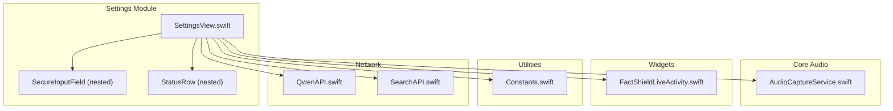
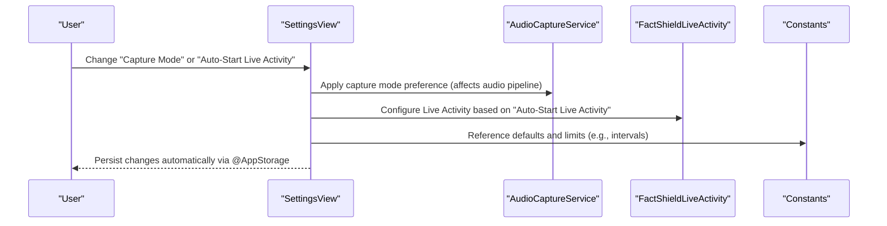
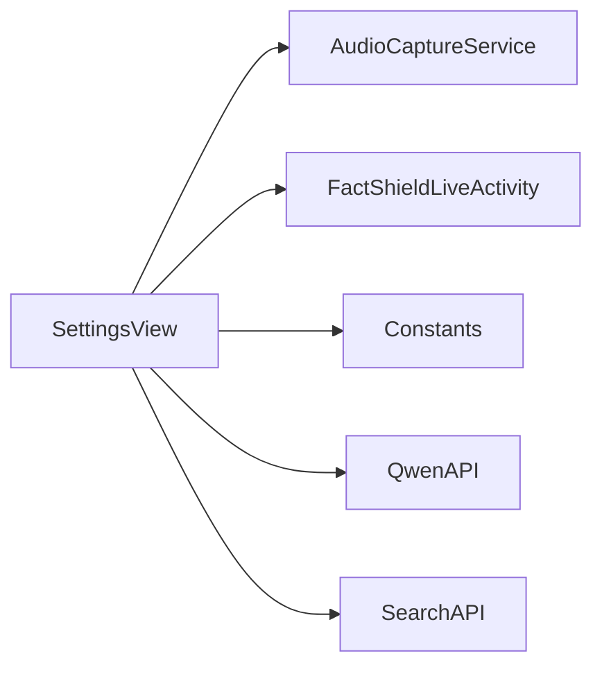

# Settings View

<cite>
**Referenced Files in This Document**
- [SettingsView.swift](file://FactShield/FactShield/Features/Settings/SettingsView.swift)
- [AudioCaptureService.swift](file://FactShield/FactShield/Core/Audio/AudioCaptureService.swift)
- [FactShieldLiveActivity.swift](file://FactShield/FactShield/Widgets/FactShieldLiveActivity.swift)
- [Constants.swift](file://FactShield/FactShield/Utilities/Constants.swift)
- [QwenAPI.swift](file://FactShield/FactShield/Core/Network/QwenAPI.swift)
- [SearchAPI.swift](file://FactShield/FactShield/Core/Network/SearchAPI.swift)
</cite>

## Table of Contents
1. [Introduction](#introduction)
2. [Project Structure](#project-structure)
3. [Core Components](#core-components)
4. [Architecture Overview](#architecture-overview)
5. [Detailed Component Analysis](#detailed-component-analysis)
6. [Dependency Analysis](#dependency-analysis)
7. [Performance Considerations](#performance-considerations)
8. [Troubleshooting Guide](#troubleshooting-guide)
9. [Conclusion](#conclusion)

## Introduction
This document provides comprehensive documentation for the SettingsView component, which manages user preferences and application configuration for the FactShield iOS application. It covers the settings interface layout, preference categories, user interaction patterns, configuration options (audio, pipeline, status), state management, persistence, validation, user feedback, and integration with system capabilities such as Live Activities and audio capture. Guidance is also included for extending the settings interface while maintaining iOS design patterns.

## Project Structure
SettingsView resides within the Features/Settings module and integrates with core audio, network, and widget subsystems. The settings interface is built using SwiftUI with @AppStorage-backed state persisted via UserDefaults. Supporting components include the audio capture service, Live Activity attributes, and constants that define default behaviors and limits.

**Diagram sources**
- [SettingsView.swift:1-172](file://FactShield/FactShield/Features/Settings/SettingsView.swift#L1-L172)
- [AudioCaptureService.swift:1-51](file://FactShield/FactShield/Core/Audio/AudioCaptureService.swift#L1-L51)
- [FactShieldLiveActivity.swift:1-44](file://FactShield/FactShield/Widgets/FactShieldLiveActivity.swift#L1-L44)
- [Constants.swift:1-37](file://FactShield/FactShield/Utilities/Constants.swift#L1-L37)
- [QwenAPI.swift:76-80](file://FactShield/FactShield/Core/Network/QwenAPI.swift#L76-L80)
- [SearchAPI.swift:41-41](file://FactShield/FactShield/Core/Network/SearchAPI.swift#L41-L41)

**Section sources**
- [SettingsView.swift:1-172](file://FactShield/FactShield/Features/Settings/SettingsView.swift#L1-L172)

## Core Components
SettingsView defines the primary settings interface and three key preference categories:
- API Configuration: Secure storage for third-party API keys with reveal capability.
- Audio & Speech: Capture mode selection and on-device recognition preference.
- Fact-Check Pipeline: Extraction interval slider and Live Activity auto-start toggle.
- Status: Visual indicators for configured components.
- About: Version/build info and external links.

Supporting components:
- SecureInputField: A reusable secure text input with reveal toggle.
- StatusRow: A compact row displaying configuration status with icons.

State management leverages @AppStorage for automatic persistence and synchronization across app launches. Defaults are defined inline for each setting.

**Section sources**
- [SettingsView.swift:3-11](file://FactShield/FactShield/Features/Settings/SettingsView.swift#L3-L11)
- [SettingsView.swift:14-111](file://FactShield/FactShield/Features/Settings/SettingsView.swift#L14-L111)
- [SettingsView.swift:115-149](file://FactShield/FactShield/Features/Settings/SettingsView.swift#L115-L149)
- [SettingsView.swift:153-165](file://FactShield/FactShield/Features/Settings/SettingsView.swift#L153-L165)

## Architecture Overview
The settings interface interacts with system-level services and app-wide constants. API keys are consumed by network services, capture mode influences audio capture behavior, and Live Activity auto-start affects background activity lifecycle.

**Diagram sources**
- [SettingsView.swift:32-63](file://FactShield/FactShield/Features/Settings/SettingsView.swift#L32-L63)
- [AudioCaptureService.swift:19-50](file://FactShield/FactShield/Core/Audio/AudioCaptureService.swift#L19-L50)
- [FactShieldLiveActivity.swift:22-34](file://FactShield/FactShield/Widgets/FactShieldLiveActivity.swift#L22-L34)
- [Constants.swift:23-26](file://FactShield/FactShield/Utilities/Constants.swift#L23-L26)

## Detailed Component Analysis

### SettingsView Layout and Categories
- API Keys section: Uses SecureInputField for three providers, with a help button to guide obtaining keys.
- Audio & Speech section: Picker for capture mode and a toggle for on-device recognition.
- Fact-Check Pipeline section: Slider for extraction interval with numeric display and toggle for Live Activity auto-start.
- Status section: Read-only indicators for API key and various system capabilities.
- About section: Static version/build info and a link to the project repository.

User interactions:
- Immediate persistence via @AppStorage.
- Reveal toggle in SecureInputField for key visibility.
- Help alert for API key acquisition.

Validation and feedback:
- StatusRow indicates configuration state visually.
- Extraction interval slider enforces a bounded range with discrete steps.
- Alert provides contextual guidance for API key setup.

Reset functionality:
- No explicit reset-to-defaults action is present in the current implementation.

**Section sources**
- [SettingsView.swift:14-111](file://FactShield/FactShield/Features/Settings/SettingsView.swift#L14-L111)

### SecureInputField Component
Purpose:
- Provides a secure text input with optional reveal toggle.
- Applies monospaced font and disables autocorrection/auto-capitalization for key safety.

Behavior:
- Toggles between SecureField and TextField based on internal state.
- Maintains binding to parent-scope text variable.

Complexity:
- O(1) per keystroke; negligible overhead.

**Section sources**
- [SettingsView.swift:115-149](file://FactShield/FactShield/Features/Settings/SettingsView.swift#L115-L149)

### StatusRow Component
Purpose:
- Displays a configuration status with a check or x icon and color-coded feedback.

Usage:
- Consumed in the Status section to reflect API key and capability readiness.

**Section sources**
- [SettingsView.swift:153-165](file://FactShield/FactShield/Features/Settings/SettingsView.swift#L153-L165)

### State Management and Persistence
- @AppStorage keys:
  - qwen_api_key, tavily_api_key, google_factcheck_api_key
  - preferred_capture_mode
  - extraction_interval
  - auto_start_live_activity
  - on_device_recognition
- Defaults are defined inline in SettingsView.
- Persistence occurs automatically; no manual save operation is required.

Integration with network services:
- API keys are loaded from UserDefaults by network clients when needed.

**Section sources**
- [SettingsView.swift:4-10](file://FactShield/FactShield/Features/Settings/SettingsView.swift#L4-L10)
- [QwenAPI.swift:76-80](file://FactShield/FactShield/Core/Network/QwenAPI.swift#L76-L80)
- [SearchAPI.swift:41-41](file://FactShield/FactShield/Core/Network/SearchAPI.swift#L41-L41)

### Audio Settings and Capture Modes
- Capture modes:
  - Microphone (AEC): Uses the device microphone with acoustic echo cancellation.
  - System Audio (ReplayKit): Captures system audio via broadcast extension.
- On-device recognition toggle influences whether speech recognition runs locally.

Audio capture service:
- Manages AVAudioEngine, installs taps, and emits buffers asynchronously.
- Exposes callbacks for downstream processors.

**Section sources**
- [SettingsView.swift:34-39](file://FactShield/FactShield/Features/Settings/SettingsView.swift#L34-L39)
- [AudioCaptureService.swift:4-50](file://FactShield/FactShield/Core/Audio/AudioCaptureService.swift#L4-L50)

### Live Activity Integration
- Auto-start toggle controls whether Live Activities begin automatically during fact-check sessions.
- Live Activity attributes define content state and verification status enums used to update activity content.

**Section sources**
- [SettingsView.swift:58-58](file://FactShield/FactShield/Features/Settings/SettingsView.swift#L58-L58)
- [FactShieldLiveActivity.swift:5-43](file://FactShield/FactShield/Widgets/FactShieldLiveActivity.swift#L5-L43)

### Pipeline Settings and Extraction Interval
- Extraction interval slider sets how frequently claims are extracted from the transcript.
- The underlying constant defines the default interval and acceptable range for the UI.

Performance implications:
- Shorter intervals increase responsiveness but raise API usage and CPU load.
- Longer intervals reduce resource consumption but delay updates.

**Section sources**
- [SettingsView.swift:47-63](file://FactShield/FactShield/Features/Settings/SettingsView.swift#L47-L63)
- [Constants.swift:24-24](file://FactShield/FactShield/Utilities/Constants.swift#L24-L24)

### About Section and External Links
- Displays version and build identifiers.
- Provides a link to the project repository for transparency and support.

**Section sources**
- [SettingsView.swift:75-101](file://FactShield/FactShield/Features/Settings/SettingsView.swift#L75-L101)

## Dependency Analysis
SettingsView depends on:
- AudioCaptureService for runtime behavior aligned with capture mode and on-device recognition.
- FactShieldLiveActivity for Live Activity configuration and content state.
- Constants for default values and pipeline limits.
- Network services for API key retrieval and usage.

**Diagram sources**
- [SettingsView.swift:32-63](file://FactShield/FactShield/Features/Settings/SettingsView.swift#L32-L63)
- [AudioCaptureService.swift:19-50](file://FactShield/FactShield/Core/Audio/AudioCaptureService.swift#L19-L50)
- [FactShieldLiveActivity.swift:22-34](file://FactShield/FactShield/Widgets/FactShieldLiveActivity.swift#L22-L34)
- [Constants.swift:23-26](file://FactShield/FactShield/Utilities/Constants.swift#L23-L26)
- [QwenAPI.swift:76-80](file://FactShield/FactShield/Core/Network/QwenAPI.swift#L76-L80)
- [SearchAPI.swift:41-41](file://FactShield/FactShield/Core/Network/SearchAPI.swift#L41-L41)

**Section sources**
- [SettingsView.swift:32-63](file://FactShield/FactShield/Features/Settings/SettingsView.swift#L32-L63)
- [AudioCaptureService.swift:19-50](file://FactShield/FactShield/Core/Audio/AudioCaptureService.swift#L19-L50)
- [FactShieldLiveActivity.swift:22-34](file://FactShield/FactShield/Widgets/FactShieldLiveActivity.swift#L22-L34)
- [Constants.swift:23-26](file://FactShield/FactShield/Utilities/Constants.swift#L23-L26)
- [QwenAPI.swift:76-80](file://FactShield/FactShield/Core/Network/QwenAPI.swift#L76-L80)
- [SearchAPI.swift:41-41](file://FactShield/FactShield/Core/Network/SearchAPI.swift#L41-L41)

## Performance Considerations
- Extraction interval tuning directly impacts API usage and CPU consumption. Users should balance responsiveness against resource usage.
- On-device recognition reduces latency and network dependency but may require sufficient local compute resources.
- Audio capture mode selection affects power usage; microphone mode with AEC may consume more CPU than system audio capture depending on device and workload.

[No sources needed since this section provides general guidance]

## Troubleshooting Guide
Common scenarios and resolutions:
- API keys appear empty: Verify entries in the API Keys section and confirm the alert guidance for obtaining keys.
- Extraction interval seems ineffective: Ensure the value falls within the supported range and adjust accordingly.
- Live Activity does not start: Confirm the Auto-Start Live Activity toggle is enabled and review Live Activity permissions.
- Audio capture not working: Check capture mode selection and verify microphone permissions; switch modes if necessary.

User feedback mechanisms:
- StatusRow provides immediate visual feedback for configuration state.
- Alert presents contextual help for API key setup.

Reset functionality:
- There is no built-in reset-to-defaults option. To reset, manually clear stored values in the settings UI or manage them via system settings.

**Section sources**
- [SettingsView.swift:105-109](file://FactShield/FactShield/Features/Settings/SettingsView.swift#L105-L109)
- [SettingsView.swift:66-73](file://FactShield/FactShield/Features/Settings/SettingsView.swift#L66-L73)

## Conclusion
SettingsView offers a structured, persistent, and user-friendly configuration surface for FactShield. It aligns with iOS design patterns using SwiftUI forms, toggles, pickers, and sliders, while integrating with audio capture, Live Activities, and network services. Extending the interface should preserve consistent labeling, default values, and immediate persistence semantics, ensuring predictable user experiences and maintainable code.