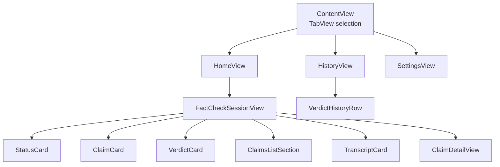
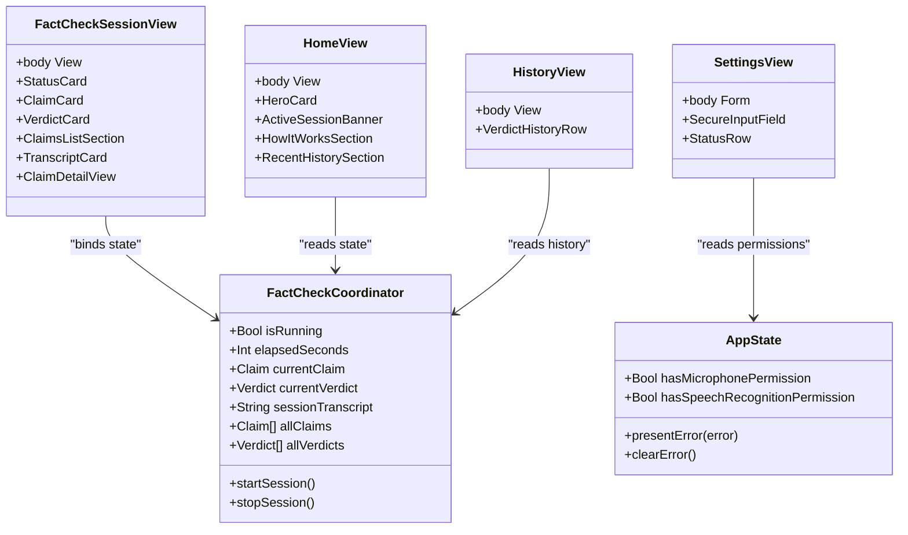
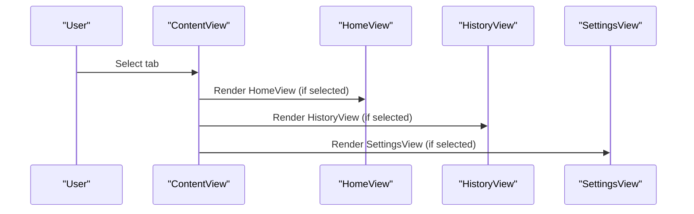
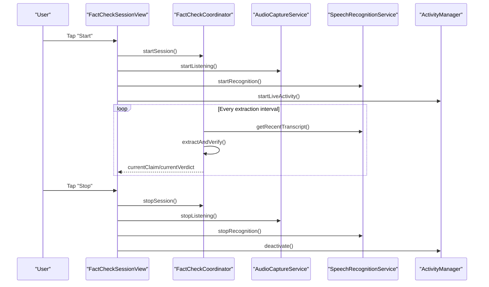
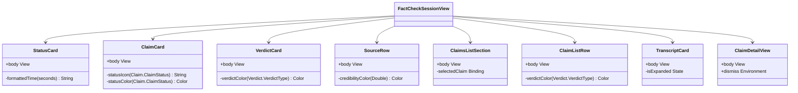
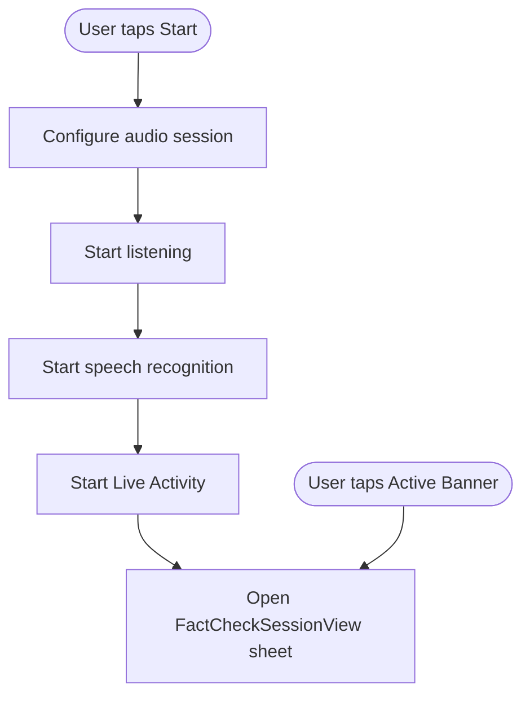
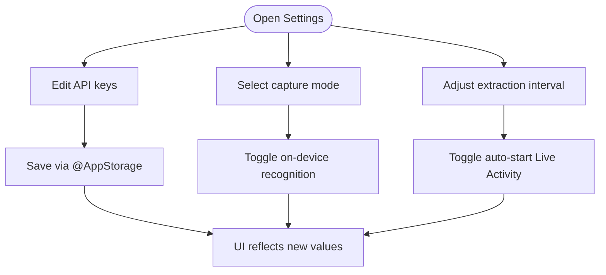
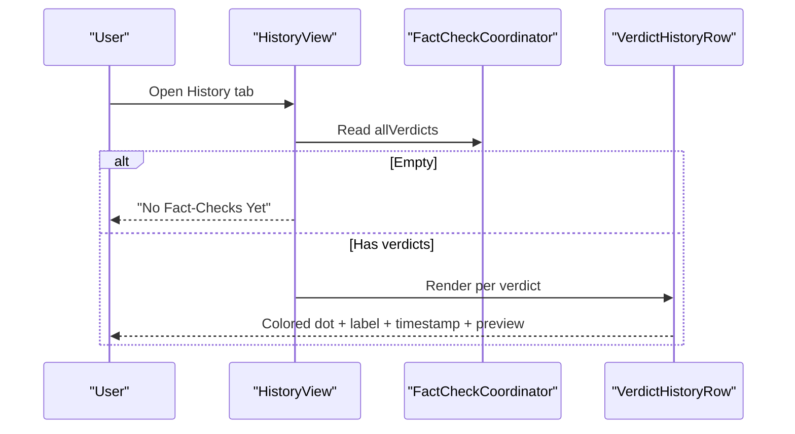
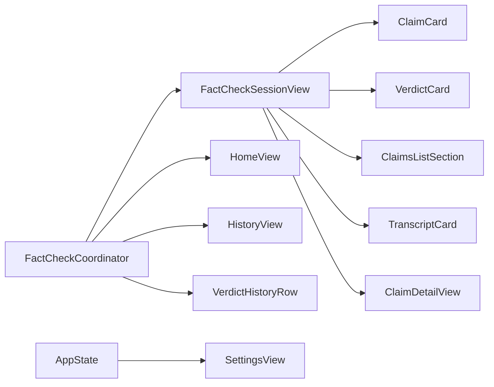
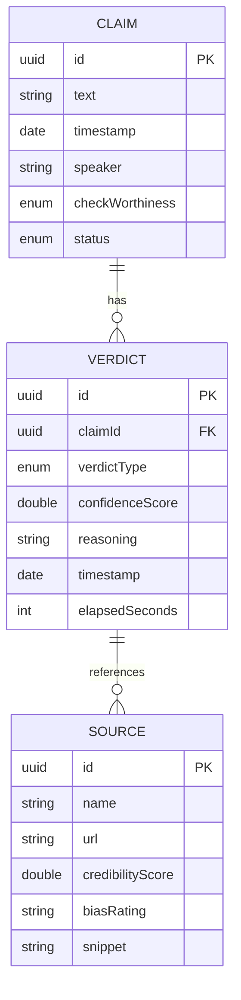

# UI Components and Views

<cite>
**Referenced Files in This Document**
- [FactShieldApp.swift](file://FactShield/FactShield/App/FactShieldApp.swift)
- [AppState.swift](file://FactShield/FactShield/App/AppState.swift)
- [FactCheckCoordinator.swift](file://FactShield/FactShield/Features/FactCheck/FactCheckCoordinator.swift)
- [FactCheckSessionView.swift](file://FactShield/FactShield/Features/FactCheck/FactCheckSessionView.swift)
- [HomeView.swift](file://FactShield/FactShield/Features/Home/HomeView.swift)
- [SettingsView.swift](file://FactShield/FactShield/Features/Settings/SettingsView.swift)
- [HistoryView.swift](file://FactShield/FactShield/App/FactShieldApp.swift)
- [VerdictHistoryRow.swift](file://FactShield/FactShield/App/FactShieldApp.swift)
- [Claim.swift](file://FactShield/FactShield/Core/Claims/Claim.swift)
- [Verdict.swift](file://FactShield/FactShield/Core/Verification/Verdict.swift)
- [Source.swift](file://FactShield/FactShield/Models/Source.swift)
- [Enums.swift](file://FactShield/FactShield/Models/Enums.swift)
- [FactShield-Architecture.md](file://FactShield-Architecture.md)
</cite>

## Update Summary
**Changes Made**
- Comprehensive documentation of FactCheckSessionView with all its custom components and real-time functionality
- Enhanced documentation of HomeView with HeroCard, ActiveSessionBanner, HowItWorksSection, and RecentHistorySection
- Complete documentation of SettingsView with form-based configuration and preference management
- Added detailed coverage of custom UI components including StatusCard, ClaimCard, VerdictCard, SourceRow, ClaimsListSection, ClaimListRow, TranscriptCard, and ClaimDetailView
- Updated architecture diagrams to reflect the new comprehensive view structure
- Enhanced component composition patterns and state binding strategies documentation

## Table of Contents
1. [Introduction](#introduction)
2. [Project Structure](#project-structure)
3. [Core Components](#core-components)
4. [Architecture Overview](#architecture-overview)
5. [Detailed Component Analysis](#detailed-component-analysis)
6. [Dependency Analysis](#dependency-analysis)
7. [Performance Considerations](#performance-considerations)
8. [Troubleshooting Guide](#troubleshooting-guide)
9. [Conclusion](#conclusion)
10. [Appendices](#appendices)

## Introduction
This document describes the UI components and views in FactChecking Live (iOS app). It covers the tab-based navigation (Home, History, Settings), the comprehensive real-time FactCheckSessionView, enhanced HomeView design and functionality, SettingsView configuration, and custom UI components such as VerdictHistoryRow. It also explains SwiftUI composition patterns, state binding strategies, view lifecycle management, color-coded verdict displays, and responsive design considerations. Accessibility and cross-platform compatibility guidance are included, along with performance optimization recommendations for UI rendering and user experience.

## Project Structure
The app is organized around a tabbed interface with three primary destinations:
- Home: Entry point for starting and monitoring sessions with HeroCard, ActiveSessionBanner, HowItWorksSection, and RecentHistorySection
- History: Review past fact-check results with VerdictHistoryRow components
- Settings: Configure API keys, audio modes, and pipeline behavior with form-based interface

**Diagram sources**
- [FactShieldApp.swift:28-54](file://FactShield/FactShield/App/FactShieldApp.swift#L28-L54)
- [HomeView.swift:3-59](file://FactShield/FactShield/Features/Home/HomeView.swift#L3-L59)
- [HistoryView.swift:58-80](file://FactShield/FactShield/App/FactShieldApp.swift#L58-L80)
- [SettingsView.swift:3-172](file://FactShield/FactShield/Features/Settings/SettingsView.swift#L3-L172)
- [FactCheckSessionView.swift:3-77](file://FactShield/FactShield/Features/FactCheck/FactCheckSessionView.swift#L3-L77)

**Section sources**
- [FactShieldApp.swift:28-54](file://FactShield/FactShield/App/FactShieldApp.swift#L28-L54)

## Core Components
- TabView with Home, History, and Settings destinations
- FactCheckSessionView: Comprehensive real-time UI for live fact-checking with StatusCard, ClaimCard, VerdictCard, ClaimsListSection, TranscriptCard, and ClaimDetailView
- HomeView: Enhanced primary access point with HeroCard, ActiveSessionBanner, HowItWorksSection, and RecentHistorySection
- SettingsView: Form-based configuration for API keys, audio capture mode, extraction interval, and pipeline toggles
- HistoryView and VerdictHistoryRow: List-based presentation of past verdicts with color-coded indicators

**Section sources**
- [FactShieldApp.swift:28-80](file://FactShield/FactShield/App/FactShieldApp.swift#L28-L80)
- [FactCheckSessionView.swift:3-506](file://FactShield/FactShield/Features/FactCheck/FactCheckSessionView.swift#L3-L506)
- [HomeView.swift:3-233](file://FactShield/FactShield/Features/Home/HomeView.swift#L3-L233)
- [SettingsView.swift:3-172](file://FactShield/FactShield/Features/Settings/SettingsView.swift#L3-L172)
- [HistoryView.swift:58-80](file://FactShield/FactShield/App/FactShieldApp.swift#L58-L80)
- [VerdictHistoryRow.swift:84-126](file://FactShield/FactShield/App/FactShieldApp.swift#L84-L126)

## Architecture Overview
The UI relies on a central coordinator for state and orchestration:
- FactCheckCoordinator manages the live pipeline, timers, and shared state
- Views bind to coordinator state and reactively update
- AppState holds global permissions and error state

**Diagram sources**
- [FactCheckCoordinator.swift:5-216](file://FactShield/FactShield/Features/FactCheck/FactCheckCoordinator.swift#L5-L216)
- [AppState.swift:4-30](file://FactShield/FactShield/App/AppState.swift#L4-L30)
- [FactCheckSessionView.swift:3-506](file://FactShield/FactShield/Features/FactCheck/FactCheckSessionView.swift#L3-L506)
- [HomeView.swift:3-233](file://FactShield/FactShield/Features/Home/HomeView.swift#L3-L233)
- [SettingsView.swift:3-172](file://FactShield/FactShield/Features/Settings/SettingsView.swift#L3-L172)
- [HistoryView.swift:58-80](file://FactShield/FactShield/App/FactShieldApp.swift#L58-L80)

## Detailed Component Analysis

### Tab-Based Navigation (Home, History, Settings)
- ContentView hosts a TabView with three destinations:
  - HomeView tab item with comprehensive session management
  - HistoryView tab item with list-based verdict display
  - SettingsView inside a NavigationStack as a tab with form-based configuration
- Selection is tracked via AppTab enum

**Diagram sources**
- [FactShieldApp.swift:28-54](file://FactShield/FactShield/App/FactShieldApp.swift#L28-L54)
- [Enums.swift:5-9](file://FactShield/FactShield/Models/Enums.swift#L5-L9)

**Section sources**
- [FactShieldApp.swift:28-54](file://FactShield/FactShield/App/FactShieldApp.swift#L28-L54)
- [Enums.swift:5-9](file://FactShield/FactShield/Models/Enums.swift#L5-L9)

### FactCheckSessionView: Comprehensive Real-Time Fact-Checking Interface
- Composition pattern:
  - NavigationStack root with ScrollView content
  - Multiple conditional sections: StatusCard, ClaimCard, VerdictCard, ClaimsListSection, TranscriptCard
  - Sheet for ClaimDetailView with detailed claim information
- State binding:
  - Uses FactCheckCoordinator.shared for reactive updates
  - Animations trigger on claim and verdict changes with custom transition effects
- Interaction patterns:
  - Top toolbar toggles Start/Stop session with proper cleanup
  - ClaimsListSection buttons open ClaimDetailView with associated verdict
  - TranscriptCard supports expand/collapse functionality
- Real-time status display:
  - StatusCard shows active/inactive state, elapsed time, and claim count with pulse animation
  - ClaimCard shows status icon/color, check-worthiness badge, and timestamp
  - VerdictCard shows verdict type with colored circle, confidence percentage, reasoning, and sources list
  - ClaimsListSection displays scrollable list of ClaimListRow entries with verdict indicators

**Diagram sources**
- [FactCheckSessionView.swift:44-76](file://FactShield/FactShield/Features/FactCheck/FactCheckSessionView.swift#L44-L76)
- [FactCheckCoordinator.swift:38-216](file://FactShield/FactShield/Features/FactCheck/FactCheckCoordinator.swift#L38-L216)

**Section sources**
- [FactCheckSessionView.swift:3-506](file://FactShield/FactShield/Features/FactCheck/FactCheckSessionView.swift#L3-L506)
- [FactCheckCoordinator.swift:38-216](file://FactShield/FactShield/Features/FactCheck/FactCheckCoordinator.swift#L38-L216)

#### Custom UI Components in FactCheckSessionView
- **StatusCard**: Pulse symbol, status text, elapsed time, claim count with Material Design
- **ClaimCard**: Claim text, CheckWorthinessBadge, status icon/color, timestamp with Material Design
- **VerdictCard**: Verdict type circle, confidence percentage, reasoning, sources list with colored border
- **SourceRow**: Credibility dot, name/bias, snippet with line limiting
- **ClaimsListSection**: Scrollable list of ClaimListRow entries with Material Design background
- **ClaimListRow**: Verdict dot, claim preview, verdict label, timestamp, chevron with Material Design
- **TranscriptCard**: Expand/collapse toggle, monoline limit, animation with Material Design
- **ClaimDetailView**: Claim info, optional verdict or progress indicator, Done button with Material Design

**Diagram sources**
- [FactCheckSessionView.swift:81-506](file://FactShield/FactShield/Features/FactCheck/FactCheckSessionView.swift#L81-L506)

**Section sources**
- [FactCheckSessionView.swift:81-506](file://FactShield/FactShield/Features/FactCheck/FactCheckSessionView.swift#L81-L506)

### HomeView: Enhanced Primary App Access
- Composition:
  - HeroCard with gradient shield icon and Start/Active state with pulse animation
  - ActiveSessionBanner showing elapsed time and current claim with tap-to-open functionality
  - HowItWorksSection with step-by-step icons and descriptions
  - RecentHistorySection (placeholder with TODO comment)
- Interactions:
  - Start button configures audio session, starts listening/recognition, starts Live Activity, and launches FactCheckSessionView sheet
  - Active banner taps also open the session with proper state management
  - Settings gear icon navigates to SettingsView via NavigationLink
- Toolbar:
  - Gear icon with NavigationLink to SettingsView

**Diagram sources**
- [HomeView.swift:12-25](file://FactShield/FactShield/Features/Home/HomeView.swift#L12-L25)

**Section sources**
- [HomeView.swift:3-233](file://FactShield/FactShield/Features/Home/HomeView.swift#L3-L233)

### SettingsView: Comprehensive Configuration Options and Preferences
- Sections:
  - API Keys: Secure input fields for Qwen, Tavily, Google Fact Check with reveal/hide functionality
  - Audio & Speech: Capture mode picker (microphone vs replaykit) and on-device recognition toggle
  - Pipeline: Extraction interval slider (5-60s) and Live Activity auto-start toggle
  - Status: Per-feature configuration indicators with checkmarks
  - About: Version/build information and GitHub link
- State management:
  - @AppStorage-backed preferences persist across runs with sensible defaults
  - SecureInputField supports reveal/hide for sensitive values with eye/eye.slash icons
  - StatusRow indicates configured/unconfigured states with color-coded checkmarks
  - Alert dialog provides API key setup instructions

**Diagram sources**
- [SettingsView.swift:14-172](file://FactShield/FactShield/Features/Settings/SettingsView.swift#L14-L172)

**Section sources**
- [SettingsView.swift:3-172](file://FactShield/FactShield/Features/Settings/SettingsView.swift#L3-L172)

### HistoryView and VerdictHistoryRow: Past Results Presentation
- HistoryView presents either:
  - Unavailable state when no verdicts exist with ContentUnavailableView
  - A List of VerdictHistoryRow items with proper navigation
- VerdictHistoryRow:
  - Leading verdict dot and label with color-coded verdict type
  - Relative timestamp with secondary styling
  - Optional claim preview with line limiting
  - One-line reasoning summary with secondary styling

**Diagram sources**
- [HistoryView.swift:58-80](file://FactShield/FactShield/App/FactShieldApp.swift#L58-L80)
- [VerdictHistoryRow.swift:84-126](file://FactShield/FactShield/App/FactShieldApp.swift#L84-L126)

**Section sources**
- [HistoryView.swift:58-80](file://FactShield/FactShield/App/FactShieldApp.swift#L58-L80)
- [VerdictHistoryRow.swift:84-126](file://FactShield/FactShield/App/FactShieldApp.swift#L84-L126)

## Dependency Analysis
- FactCheckSessionView depends on FactCheckCoordinator for live state and emits cleanup actions on stop
- HomeView reads coordinator state to decide whether to launch a session and manages sheet presentation
- SettingsView reads AppState for permissions and stores user preferences via @AppStorage
- HistoryView reads coordinator history arrays to render rows
- VerdictHistoryRow consumes Verdict and optional Claim for display
- All components use Material Design with ultraThinMaterial background for consistent visual appearance

**Diagram sources**
- [FactCheckCoordinator.swift:5-216](file://FactShield/FactShield/Features/FactCheck/FactCheckCoordinator.swift#L5-L216)
- [FactShieldApp.swift:28-80](file://FactShield/FactShield/App/FactShieldApp.swift#L28-L80)
- [AppState.swift:4-30](file://FactShield/FactShield/App/AppState.swift#L4-L30)

**Section sources**
- [FactShieldApp.swift:28-80](file://FactShield/FactShield/App/FactShieldApp.swift#L28-L80)
- [FactCheckCoordinator.swift:5-216](file://FactShield/FactShield/Features/FactCheck/FactCheckCoordinator.swift#L5-L216)
- [AppState.swift:4-30](file://FactShield/FactShield/App/AppState.swift#L4-L30)

## Performance Considerations
- Minimize recomputation:
  - Use @State and @Observable judiciously; avoid unnecessary property changes
  - Keep heavy computations off the main thread (already performed via Task in coordinator)
- Animation and transitions:
  - Limit animations to meaningful state changes (e.g., claim/verdict appearance)
  - Prefer simple easing and short durations for responsiveness
  - Use custom transitions (.move + .opacity) for smooth state changes
- List rendering:
  - Use LazyVGrid/LazyHGrid for large lists when appropriate
  - Reuse row components and avoid deep hierarchies
  - Implement line limiting for text content to prevent layout thrashing
- Memory:
  - Avoid retaining large transcript strings longer than needed
  - Clear or reset coordinator arrays when appropriate
  - Use @State for local component state, @Binding for parent-child communication
- Accessibility:
  - Ensure sufficient color contrast for verdict dots and labels
  - Provide semantic labels for interactive elements
  - Use proper font sizes and weights for readability
- Cross-platform:
  - SwiftUI promotes reuse across Apple platforms; verify Dynamic Island and Live Activity availability on target devices
  - Material Design (ultraThinMaterial) provides consistent appearance across devices

## Troubleshooting Guide
- Microphone permission denied:
  - AppState tracks hasMicrophonePermission; SettingsView should reflect status
  - HomeView provides clear messaging when microphone is not available
- Speech recognition unavailable or denied:
  - Coordinator throws errors during pipeline; surface via AppState.lastError
  - SettingsView indicates configuration status; prompt user to enter keys
- API key missing:
  - SettingsView indicates configuration status with checkmarks
  - FactCheckCoordinator handles API key validation and error reporting
- Live Activity failures:
  - Coordinator logs and handles activity updates; verify permissions and entitlements
  - SettingsView provides status indicators for Live Activities
- Session state issues:
  - FactCheckCoordinator manages session lifecycle with proper cleanup
  - HomeView and FactCheckSessionView coordinate session state and UI updates

**Section sources**
- [AppState.swift:12-30](file://FactShield/FactShield/App/AppState.swift#L12-L30)
- [FactShieldApp.swift:18-25](file://FactShield/FactShield/App/FactShieldApp.swift#L18-L25)
- [FactCheckCoordinator.swift:158-161](file://FactShield/FactShield/Features/FactCheck/FactCheckCoordinator.swift#L158-L161)
- [SettingsView.swift:65-73](file://FactShield/FactShield/Features/Settings/SettingsView.swift#L65-L73)

## Conclusion
The UI is structured around a clean separation of concerns: SwiftUI views compose reusable components with Material Design aesthetics, bind to a central coordinator for state, and leverage @AppStorage for persistence. The comprehensive FactCheckSessionView provides immediate feedback with color-coded verdicts, animated transitions, expandable transcript display, and detailed claim information. HomeView offers an enhanced welcoming entry point with HeroCard, ActiveSessionBanner, and step-by-step instructions. SettingsView centralizes configuration with secure input handling and status indicators. HistoryView surfaces past results with compact, scannable rows. Following the recommended patterns ensures maintainability, responsiveness, and accessibility across Apple platforms.

## Appendices

### Data Models Used by UI Components
- Claim: identifiers, text, timestamp, speaker, check-worthiness, status with comprehensive status tracking
- Verdict: claim association, verdict type, confidence, reasoning, sources, timestamps with color mapping
- Source: name, URL, credibility score, bias rating, snippet with credibility scoring

**Diagram sources**
- [Claim.swift:3-37](file://FactShield/FactShield/Core/Claims/Claim.swift#L3-L37)
- [Verdict.swift:3-31](file://FactShield/FactShield/Core/Verification/Verdict.swift#L3-L31)
- [Source.swift:3-11](file://FactShield/FactShield/Models/Source.swift#L3-L11)

### Color Coding for Verdict Types
- TRUE: green with success connotation
- SUBSTANTIALLY TRUE: yellow with nuanced truth
- MISLEADING: orange with caution indication
- FALSE: red with clear falsehood
- UNVERIFIABLE: gray with neutral stance

**Section sources**
- [Verdict.swift:13-31](file://FactShield/FactShield/Core/Verification/Verdict.swift#L13-L31)
- [FactCheckSessionView.swift:272-281](file://FactShield/FactShield/Features/FactCheck/FactCheckSessionView.swift#L272-L281)
- [FactCheckSessionView.swift:394-403](file://FactShield/FactShield/Features/FactCheck/FactCheckSessionView.swift#L394-L403)
- [FactShield-Architecture.md:17-28](file://FactShield-Architecture.md#L17-L28)

### Accessibility and Cross-Platform Notes
- Accessibility:
  - Use semantic labels and readable fonts with proper contrast ratios
  - Ensure sufficient contrast for status and verdict indicators (Material Design helps)
  - Provide focus order and VoiceOver-friendly labels
  - Implement proper font sizing and weight hierarchy
- Cross-platform:
  - SwiftUI enables reuse across iOS/macOS/tvOS; verify Dynamic Island and Live Activity availability on target devices
  - Material Design provides consistent appearance across Apple platforms
  - Consider adaptive layouts for different screen sizes and orientations