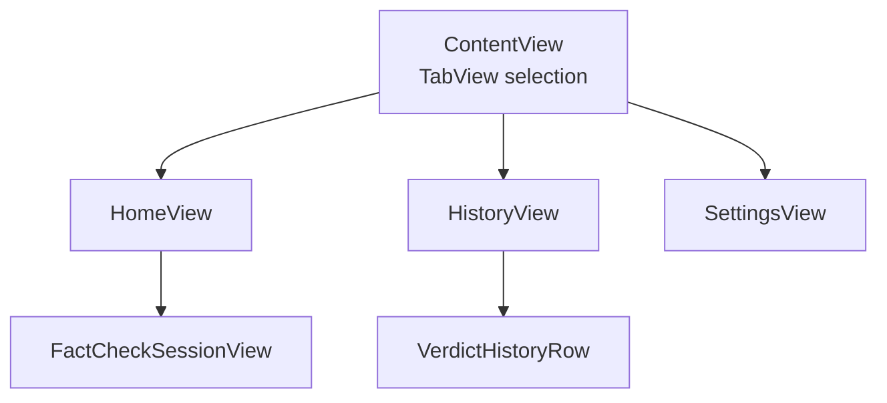
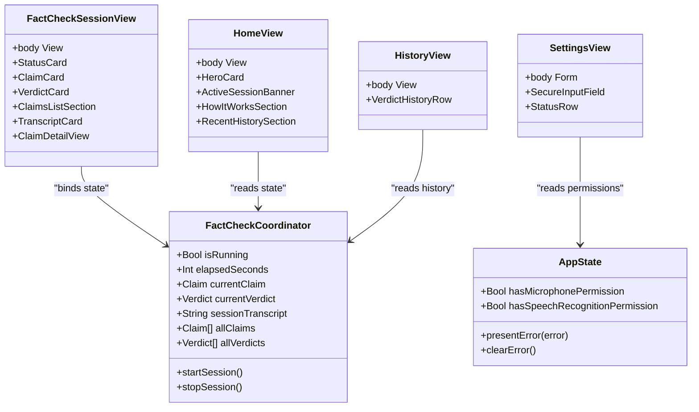
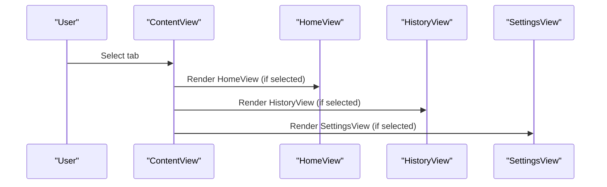
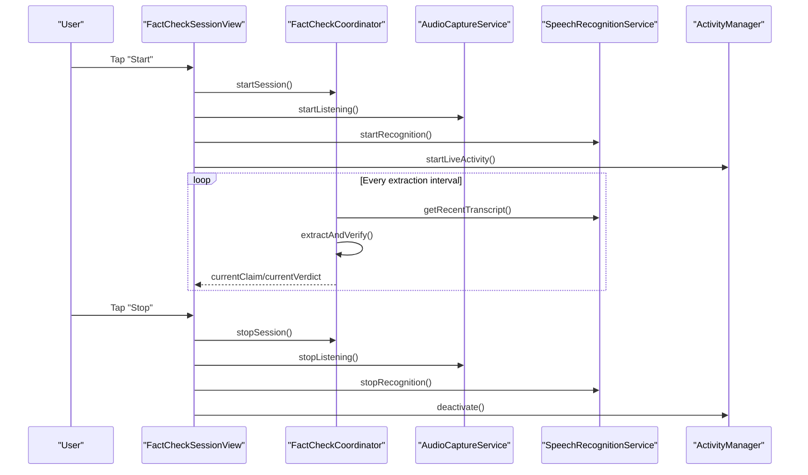
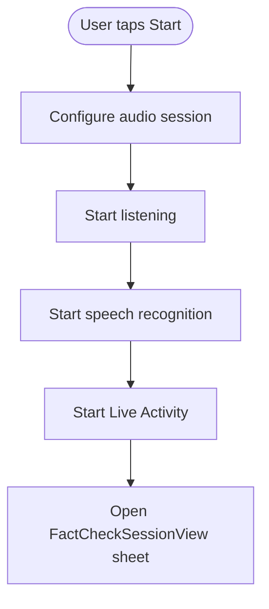
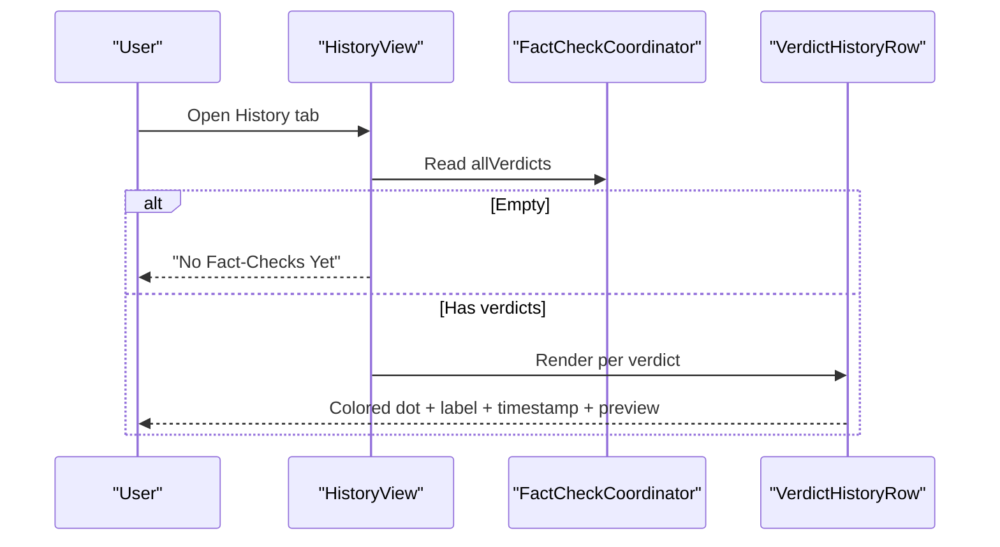
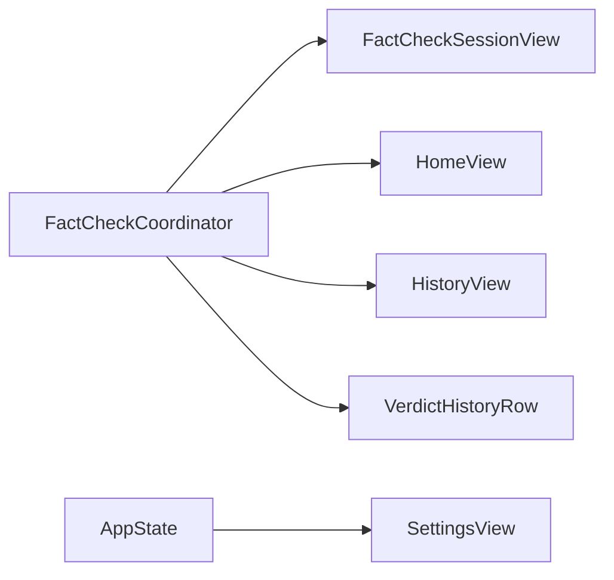
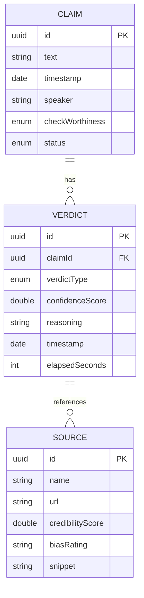

# UI Components and Views

<cite>
**Referenced Files in This Document**
- [FactShieldApp.swift](file://FactShield/FactShield/App/FactShieldApp.swift)
- [AppState.swift](file://FactShield/FactShield/App/AppState.swift)
- [FactCheckCoordinator.swift](file://FactShield/FactShield/Features/FactCheck/FactCheckCoordinator.swift)
- [FactCheckSessionView.swift](file://FactShield/FactShield/Features/FactCheck/FactCheckSessionView.swift)
- [HomeView.swift](file://FactShield/FactShield/Features/Home/HomeView.swift)
- [SettingsView.swift](file://FactShield/FactShield/Features/Settings/SettingsView.swift)
- [HistoryView.swift](file://FactShield/FactShield/App/FactShieldApp.swift)
- [VerdictHistoryRow.swift](file://FactShield/FactShield/App/FactShieldApp.swift)
- [Claim.swift](file://FactShield/FactShield/Core/Claims/Claim.swift)
- [Verdict.swift](file://FactShield/FactShield/Core/Verification/Verdict.swift)
- [Source.swift](file://FactShield/FactShield/Models/Source.swift)
- [Enums.swift](file://FactShield/FactShield/Models/Enums.swift)
- [FactShield-Architecture.md](file://FactShield-Architecture.md)
</cite>

## Table of Contents
1. [Introduction](#introduction)
2. [Project Structure](#project-structure)
3. [Core Components](#core-components)
4. [Architecture Overview](#architecture-overview)
5. [Detailed Component Analysis](#detailed-component-analysis)
6. [Dependency Analysis](#dependency-analysis)
7. [Performance Considerations](#performance-considerations)
8. [Troubleshooting Guide](#troubleshooting-guide)
9. [Conclusion](#conclusion)
10. [Appendices](#appendices)

## Introduction
This document describes the UI components and views in FactChecking Live (iOS app). It covers the tab-based navigation (Home, History, Settings), the real-time FactCheckSessionView, HomeView design and functionality, SettingsView configuration, and custom UI components such as VerdictHistoryRow. It also explains SwiftUI composition patterns, state binding strategies, view lifecycle management, color-coded verdict displays, and responsive design considerations. Accessibility and cross-platform compatibility guidance are included, along with performance optimization recommendations for UI rendering and user experience.

## Project Structure
The app is organized around a tabbed interface with three primary destinations:
- Home: Entry point for starting and monitoring sessions
- History: Review past fact-check results
- Settings: Configure API keys, audio modes, and pipeline behavior

**Diagram sources**
- [FactShieldApp.swift:28-54](file://FactShield/FactShield/App/FactShieldApp.swift#L28-L54)
- [HomeView.swift:3-59](file://FactShield/FactShield/Features/Home/HomeView.swift#L3-L59)
- [HistoryView.swift:58-80](file://FactShield/FactShield/App/FactShieldApp.swift#L58-L80)
- [SettingsView.swift:3-111](file://FactShield/FactShield/Features/Settings/SettingsView.swift#L3-L111)

**Section sources**
- [FactShieldApp.swift:28-54](file://FactShield/FactShield/App/FactShieldApp.swift#L28-L54)

## Core Components
- TabView with Home, History, and Settings destinations
- FactCheckSessionView: Real-time UI for live fact-checking with status, claims, verdicts, and transcript
- HomeView: Primary access point with hero card, active session banner, how-it-works steps, and recent history
- SettingsView: Form-based configuration for API keys, audio capture mode, extraction interval, and pipeline toggles
- HistoryView and VerdictHistoryRow: List-based presentation of past verdicts with color-coded indicators

**Section sources**
- [FactShieldApp.swift:28-80](file://FactShield/FactShield/App/FactShieldApp.swift#L28-L80)
- [FactCheckSessionView.swift:3-77](file://FactShield/FactShield/Features/FactCheck/FactCheckSessionView.swift#L3-L77)
- [HomeView.swift:3-59](file://FactShield/FactShield/Features/Home/HomeView.swift#L3-L59)
- [SettingsView.swift:3-111](file://FactShield/FactShield/Features/Settings/SettingsView.swift#L3-L111)
- [HistoryView.swift:58-80](file://FactShield/FactShield/App/FactShieldApp.swift#L58-L80)
- [VerdictHistoryRow.swift:84-126](file://FactShield/FactShield/App/FactShieldApp.swift#L84-L126)

## Architecture Overview
The UI relies on a central coordinator for state and orchestration:
- FactCheckCoordinator manages the live pipeline, timers, and shared state
- Views bind to coordinator state and reactively update
- AppState holds global permissions and error state

**Diagram sources**
- [FactCheckCoordinator.swift:5-202](file://FactShield/FactShield/Features/FactCheck/FactCheckCoordinator.swift#L5-L202)
- [AppState.swift:4-29](file://FactShield/FactShield/App/AppState.swift#L4-L29)
- [FactCheckSessionView.swift:3-77](file://FactShield/FactShield/Features/FactCheck/FactCheckSessionView.swift#L3-L77)
- [HomeView.swift:3-59](file://FactShield/FactShield/Features/Home/HomeView.swift#L3-L59)
- [SettingsView.swift:3-111](file://FactShield/FactShield/Features/Settings/SettingsView.swift#L3-L111)
- [HistoryView.swift:58-80](file://FactShield/FactShield/App/FactShieldApp.swift#L58-L80)

## Detailed Component Analysis

### Tab-Based Navigation (Home, History, Settings)
- ContentView hosts a TabView with three destinations:
  - HomeView tab item
  - HistoryView tab item
  - SettingsView inside a NavigationStack as a tab
- Selection is tracked via AppTab enum

**Diagram sources**
- [FactShieldApp.swift:28-54](file://FactShield/FactShield/App/FactShieldApp.swift#L28-L54)
- [Enums.swift:5-9](file://FactShield/FactShield/Models/Enums.swift#L5-L9)

**Section sources**
- [FactShieldApp.swift:28-54](file://FactShield/FactShield/App/FactShieldApp.swift#L28-L54)
- [Enums.swift:5-9](file://FactShield/FactShield/Models/Enums.swift#L5-L9)

### FactCheckSessionView: Real-Time Fact-Checking Interface
- Composition pattern:
  - NavigationStack root with ScrollView content
  - Conditional sections: StatusCard, ClaimCard, VerdictCard, ClaimsListSection, TranscriptCard
  - Sheet for ClaimDetailView
- State binding:
  - Uses FactCheckCoordinator.shared for reactive updates
  - Animations trigger on claim and verdict changes
- Interaction patterns:
  - Top toolbar toggles Start/Stop session
  - ClaimsListSection buttons open ClaimDetailView
- Status display:
  - StatusCard shows active/inactive, elapsed time, and claim count
  - ClaimCard shows status icon/color and timestamp
  - VerdictCard shows verdict type, confidence, reasoning, and sources
  - TranscriptCard expands/collapses long transcripts

**Diagram sources**
- [FactCheckSessionView.swift:44-76](file://FactShield/FactShield/Features/FactCheck/FactCheckSessionView.swift#L44-L76)
- [FactCheckCoordinator.swift:38-201](file://FactShield/FactShield/Features/FactCheck/FactCheckCoordinator.swift#L38-L201)

**Section sources**
- [FactCheckSessionView.swift:3-77](file://FactShield/FactShield/Features/FactCheck/FactCheckSessionView.swift#L3-L77)
- [FactCheckCoordinator.swift:38-201](file://FactShield/FactShield/Features/FactCheck/FactCheckCoordinator.swift#L38-L201)

#### Custom UI Components in FactCheckSessionView
- StatusCard: Pulse symbol, status text, elapsed time, claim count
- ClaimCard: Claim text, worthiness badge, status icon/color, timestamp
- VerdictCard: Verdict type circle, confidence percentage, reasoning, sources list
- SourceRow: Credibility dot, name/bias, snippet
- ClaimsListSection: Scrollable list of ClaimListRow entries
- ClaimListRow: Verdict dot, claim preview, verdict label, timestamp, chevron
- TranscriptCard: Expand/collapse toggle, monoline limit, animation
- ClaimDetailView: Claim info, optional verdict or progress indicator, Done button

**Diagram sources**
- [FactCheckSessionView.swift:81-505](file://FactShield/FactShield/Features/FactCheck/FactCheckSessionView.swift#L81-L505)

**Section sources**
- [FactCheckSessionView.swift:81-505](file://FactShield/FactShield/Features/FactCheck/FactCheckSessionView.swift#L81-L505)

### HomeView: Primary App Access
- Composition:
  - HeroCard with gradient shield icon and Start/Active state
  - ActiveSessionBanner showing elapsed time and current claim
  - HowItWorksSection with step-by-step icons and descriptions
  - RecentHistorySection (placeholder)
- Interactions:
  - Start button configures audio session, starts listening/recognition, starts Live Activity, and launches FactCheckSessionView sheet
  - Active banner taps also open the session
- Toolbar:
  - Gear icon navigates to SettingsView

**Diagram sources**
- [HomeView.swift:12-25](file://FactShield/FactShield/Features/Home/HomeView.swift#L12-L25)

**Section sources**
- [HomeView.swift:3-59](file://FactShield/FactShield/Features/Home/HomeView.swift#L3-L59)

### SettingsView: Configuration Options and Preferences
- Sections:
  - API Keys: Secure input fields for Qwen, Tavily, Google Fact Check
  - Audio & Speech: Capture mode picker and on-device recognition toggle
  - Pipeline: Extraction interval slider and Live Activity auto-start toggle
  - Status: Per-feature configuration indicators
  - About: Version/build and GitHub link
- State management:
  - @AppStorage-backed preferences persist across runs
  - SecureInputField supports reveal/hide for sensitive values
  - StatusRow indicates configured/unconfigured states

**Diagram sources**
- [SettingsView.swift:14-111](file://FactShield/FactShield/Features/Settings/SettingsView.swift#L14-L111)

**Section sources**
- [SettingsView.swift:3-111](file://FactShield/FactShield/Features/Settings/SettingsView.swift#L3-L111)

### HistoryView and VerdictHistoryRow: Past Results
- HistoryView presents either:
  - Unavailable state when no verdicts exist
  - A List of VerdictHistoryRow items
- VerdictHistoryRow:
  - Leading verdict dot and label
  - Relative timestamp
  - Optional claim preview
  - One-line reasoning summary

**Diagram sources**
- [HistoryView.swift:58-80](file://FactShield/FactShield/App/FactShieldApp.swift#L58-L80)
- [VerdictHistoryRow.swift:84-126](file://FactShield/FactShield/App/FactShieldApp.swift#L84-L126)

**Section sources**
- [HistoryView.swift:58-80](file://FactShield/FactShield/App/FactShieldApp.swift#L58-L80)
- [VerdictHistoryRow.swift:84-126](file://FactShield/FactShield/App/FactShieldApp.swift#L84-L126)

## Dependency Analysis
- FactCheckSessionView depends on FactCheckCoordinator for live state and emits cleanup actions on stop
- HomeView reads coordinator state to decide whether to launch a session
- SettingsView reads AppState for permissions and stores user preferences
- HistoryView reads coordinator history arrays to render rows
- VerdictHistoryRow consumes Verdict and optional Claim for display

**Diagram sources**
- [FactCheckCoordinator.swift:5-202](file://FactShield/FactShield/Features/FactCheck/FactCheckCoordinator.swift#L5-L202)
- [FactShieldApp.swift:28-80](file://FactShield/FactShield/App/FactShieldApp.swift#L28-L80)
- [AppState.swift:4-29](file://FactShield/FactShield/App/AppState.swift#L4-L29)

**Section sources**
- [FactShieldApp.swift:28-80](file://FactShield/FactShield/App/FactShieldApp.swift#L28-L80)
- [FactCheckCoordinator.swift:5-202](file://FactShield/FactShield/Features/FactCheck/FactCheckCoordinator.swift#L5-L202)
- [AppState.swift:4-29](file://FactShield/FactShield/App/AppState.swift#L4-L29)

## Performance Considerations
- Minimize recomputation:
  - Use @State and @Observable judiciously; avoid unnecessary property changes
  - Keep heavy computations off the main thread (already performed via Task in coordinator)
- Animation and transitions:
  - Limit animations to meaningful state changes (e.g., claim/verdict appearance)
  - Prefer simple easing and short durations for responsiveness
- List rendering:
  - Use LazyVGrid/LazyHGrid for large lists when appropriate
  - Reuse row components and avoid deep hierarchies
- Memory:
  - Avoid retaining large transcript strings longer than needed
  - Clear or reset coordinator arrays when appropriate
- Accessibility:
  - Ensure sufficient color contrast for verdict dots and labels
  - Provide semantic labels for interactive elements
- Cross-platform:
  - SwiftUI promotes reuse across Apple platforms; verify Dynamic Island and Live Activity availability on target devices

[No sources needed since this section provides general guidance]

## Troubleshooting Guide
- Microphone permission denied:
  - AppState tracks hasMicrophonePermission; SettingsView should reflect status
- Speech recognition unavailable or denied:
  - Coordinator throws errors during pipeline; surface via AppState.lastError
- API key missing:
  - SettingsView indicates configuration status; prompt user to enter keys
- Live Activity failures:
  - Coordinator logs and handles activity updates; verify permissions and entitlements

**Section sources**
- [AppState.swift:12-29](file://FactShield/FactShield/App/AppState.swift#L12-L29)
- [FactShieldApp.swift:18-25](file://FactShield/FactShield/App/FactShieldApp.swift#L18-L25)
- [FactCheckCoordinator.swift:158-161](file://FactShield/FactShield/Features/FactCheck/FactCheckCoordinator.swift#L158-L161)
- [SettingsView.swift:65-73](file://FactShield/FactShield/Features/Settings/SettingsView.swift#L65-L73)

## Conclusion
The UI is structured around a clean separation of concerns: SwiftUI views compose reusable components, bind to a central coordinator for state, and leverage @AppStorage for persistence. The real-time FactCheckSessionView provides immediate feedback with color-coded verdicts, animated transitions, and expandable transcript display. HomeView offers a welcoming entry point, while SettingsView centralizes configuration. HistoryView surfaces past results with compact, scannable rows. Following the recommended patterns ensures maintainability, responsiveness, and accessibility.

[No sources needed since this section summarizes without analyzing specific files]

## Appendices

### Data Models Used by UI Components
- Claim: identifiers, text, timestamp, speaker, check-worthiness, status
- Verdict: claim association, verdict type, confidence, reasoning, sources, timestamps
- Source: name, URL, credibility score, bias rating, snippet

**Diagram sources**
- [Claim.swift:3-25](file://FactShield/FactShield/Core/Claims/Claim.swift#L3-L25)
- [Verdict.swift:3-29](file://FactShield/FactShield/Core/Verification/Verdict.swift#L3-L29)
- [Source.swift:3-10](file://FactShield/FactShield/Models/Source.swift#L3-L10)

### Color Coding for Verdict Types
- TRUE: green
- SUBSTANTIALLY TRUE: yellow
- MISLEADING: orange
- FALSE: red
- UNVERIFIABLE: gray

**Section sources**
- [Verdict.swift:13-29](file://FactShield/FactShield/Core/Verification/Verdict.swift#L13-L29)
- [FactCheckSessionView.swift:272-281](file://FactShield/FactShield/Features/FactCheck/FactCheckSessionView.swift#L272-L281)
- [FactCheckSessionView.swift:394-403](file://FactShield/FactShield/Features/FactCheck/FactCheckSessionView.swift#L394-L403)
- [FactShield-Architecture.md:17-28](file://FactShield-Architecture.md#L17-L28)

### Accessibility and Cross-Platform Notes
- Accessibility:
  - Use semantic labels and readable fonts
  - Ensure sufficient contrast for status and verdict indicators
  - Provide focus order and VoiceOver-friendly labels
- Cross-platform:
  - SwiftUI enables reuse across iOS/macOS/tvOS; verify Dynamic Island and Live Activity availability on target devices

[No sources needed since this section provides general guidance]