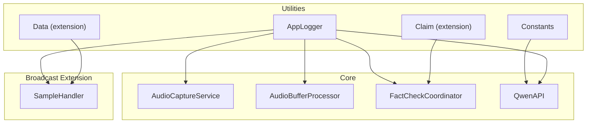
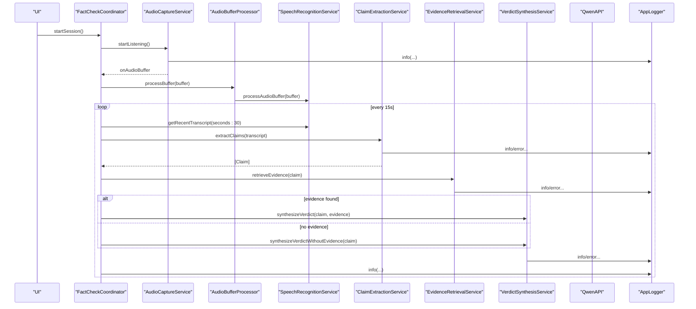
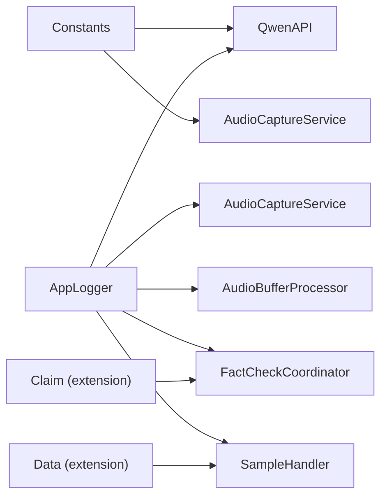

# Utilities and Extensions

<cite>
**Referenced Files in This Document**
- [Constants.swift](file://FactShield/FactShield/Utilities/Constants.swift)
- [Logger.swift](file://FactShield/FactShield/Utilities/Logger.swift)
- [Claim.swift](file://FactShield/FactShield/Core/Claims/Claim.swift)
- [ActivityManager.swift](file://FactShield/FactShield/Widgets/ActivityManager.swift)
- [FactCheckCoordinator.swift](file://FactShield/FactShield/Features/FactCheck/FactCheckCoordinator.swift)
- [AudioCaptureService.swift](file://FactShield/FactShield/Core/Audio/AudioCaptureService.swift)
- [AudioBufferProcessor.swift](file://FactShield/FactShield/Core/Audio/AudioBufferProcessor.swift)
- [QwenAPI.swift](file://FactShield/FactShield/Core/Network/QwenAPI.swift)
- [ClaimExtractionService.swift](file://FactShield/FactShield/Core/Claims/ClaimExtractionService.swift)
- [EvidenceRetrievalService.swift](file://FactShield/FactShield/Core/Verification/EvidenceRetrievalService.swift)
- [VerdictSynthesisService.swift](file://FactShield/FactShield/Core/Verification/VerdictSynthesisService.swift)
- [SampleHandler.swift](file://FactShield/FactShield/BroadcastExtension/SampleHandler.swift)
</cite>

## Table of Contents
1. [Introduction](#introduction)
2. [Project Structure](#project-structure)
3. [Core Components](#core-components)
4. [Architecture Overview](#architecture-overview)
5. [Detailed Component Analysis](#detailed-component-analysis)
6. [Dependency Analysis](#dependency-analysis)
7. [Performance Considerations](#performance-considerations)
8. [Troubleshooting Guide](#troubleshooting-guide)
9. [Conclusion](#conclusion)
10. [Appendices](#appendices)

## Introduction
This document describes the utility classes and extensions used across FactChecking Live (FactShield). It focuses on:
- Centralized configuration via Constants
- Structured logging via AppLogger
- Utility extensions for enhanced functionality
- Data transformation helpers used in the fact-checking pipeline
- Best practices for extending utilities while maintaining performance, thread safety, and maintainability

## Project Structure
Utilities and extensions are organized under the Utilities module and integrated across core subsystems:
- Constants: centralized configuration values
- Logger: OSLog-based logging categories
- Extensions: lightweight additions to standard library types
- Services: integrate utilities for audio, speech, API, and data transformation



**Diagram sources**
- [Constants.swift:1-37](file://FactShield/FactShield/Utilities/Constants.swift#L1-L37)
- [Logger.swift:1-18](file://FactShield/FactShield/Utilities/Logger.swift#L1-L18)
- [Claim.swift:27-36](file://FactShield/FactShield/Core/Claims/Claim.swift#L27-L36)
- [ActivityManager.swift:82-86](file://FactShield/FactShield/Widgets/ActivityManager.swift#L82-L86)
- [AudioCaptureService.swift:1-50](file://FactShield/FactShield/Core/Audio/AudioCaptureService.swift#L1-L50)
- [AudioBufferProcessor.swift:1-41](file://FactShield/FactShield/Core/Audio/AudioBufferProcessor.swift#L1-L41)
- [FactCheckCoordinator.swift:1-216](file://FactShield/FactShield/Features/FactCheck/FactCheckCoordinator.swift#L1-L216)
- [QwenAPI.swift:68-101](file://FactShield/FactShield/Core/Network/QwenAPI.swift#L68-L101)
- [SampleHandler.swift:1949-2029](file://FactShield/FactShield/BroadcastExtension/SampleHandler.swift#L1949-L2029)

**Section sources**
- [Constants.swift:1-37](file://FactShield/FactShield/Utilities/Constants.swift#L1-L37)
- [Logger.swift:1-18](file://FactShield/FactShield/Utilities/Logger.swift#L1-L18)

## Core Components
- Constants: central repository for identifiers, bundle IDs, API base URLs, audio and speech thresholds, pipeline intervals, and UserDefaults keys
- AppLogger: unified OSLog categories for audio, speech, claims, verification, API, broadcast, activity, coordinator, and general logging
- Extensions:
  - Claim.empty: convenience initializer for testing and UI placeholders
  - Data.hexString: converts binary data to a lowercase hexadecimal string

These utilities are consumed by services across the app to keep configuration and logging consistent and to simplify common tasks.

**Section sources**
- [Constants.swift:3-36](file://FactShield/FactShield/Utilities/Constants.swift#L3-L36)
- [Logger.swift:4-17](file://FactShield/FactShield/Utilities/Logger.swift#L4-L17)
- [Claim.swift:27-36](file://FactShield/FactShield/Core/Claims/Claim.swift#L27-L36)
- [ActivityManager.swift:82-86](file://FactShield/FactShield/Widgets/ActivityManager.swift#L82-L86)

## Architecture Overview
The utilities underpin the core pipeline:
- FactCheckCoordinator orchestrates audio capture, speech recognition, claim extraction, evidence retrieval, and verdict synthesis
- AudioCaptureService and AudioBufferProcessor rely on Constants for buffer sizes and sample rates and on AppLogger for diagnostics
- QwenAPI uses Constants for base URL and AppLogger for request lifecycle events
- Data.hexString is used in SampleHandler to write broadcast audio bytes to a shared container file



**Diagram sources**
- [FactCheckCoordinator.swift:38-161](file://FactShield/FactShield/Features/FactCheck/FactCheckCoordinator.swift#L38-L161)
- [AudioCaptureService.swift:19-49](file://FactShield/FactShield/Core/Audio/AudioCaptureService.swift#L19-L49)
- [AudioBufferProcessor.swift:16-22](file://FactShield/FactShield/Core/Audio/AudioBufferProcessor.swift#L16-L22)
- [QwenAPI.swift:94-101](file://FactShield/FactShield/Core/Network/QwenAPI.swift#L94-L101)

## Detailed Component Analysis

### Constants
Purpose:
- Provide centralized, immutable configuration for app group identifiers, bundle IDs, API base URLs, audio and speech thresholds, pipeline intervals, and UserDefaults keys

Usage examples:
- QwenAPI reads the base URL from Constants for constructing requests
- SampleHandler writes broadcast state to UserDefaults using keys defined in Constants

Best practices:
- Add new constants grouped by domain (e.g., API, Audio, Speech)
- Prefer descriptive names and explicit units (e.g., TimeInterval)
- Avoid embedding magic numbers or strings directly in services

**Section sources**
- [Constants.swift:3-36](file://FactShield/FactShield/Utilities/Constants.swift#L3-L36)
- [QwenAPI.swift:71-72](file://FactShield/FactShield/Core/Network/QwenAPI.swift#L71-L72)
- [SampleHandler.swift:1952-1962](file://FactShield/FactShield/BroadcastExtension/SampleHandler.swift#L1952-L1962)

### AppLogger
Purpose:
- Provide a single, structured logging interface using OSLog with categorized subsystems for audio, speech, claims, verification, API, broadcast, activity, coordinator, and general logs

Usage examples:
- AudioCaptureService logs engine start/stop events
- AudioBufferProcessor logs buffer processing
- QwenAPI logs request lifecycle and errors
- SampleHandler logs broadcast lifecycle

Best practices:
- Use appropriate categories per module
- Include contextual information in log messages (formats, durations, counts)
- Avoid logging sensitive data; mask or redact where necessary

**Section sources**
- [Logger.swift:4-17](file://FactShield/FactShield/Utilities/Logger.swift#L4-L17)
- [AudioCaptureService.swift:36-38](file://FactShield/FactShield/Core/Audio/AudioCaptureService.swift#L36-L38)
- [AudioBufferProcessor.swift:10-10](file://FactShield/FactShield/Core/Audio/AudioBufferProcessor.swift#L10-L10)
- [QwenAPI.swift:72-72](file://FactShield/FactShield/Core/Network/QwenAPI.swift#L72-L72)
- [SampleHandler.swift:1955-1979](file://FactShield/FactShield/BroadcastExtension/SampleHandler.swift#L1955-L1979)

### Extensions

#### Claim (extension)
Purpose:
- Provide a convenience static property for an empty Claim instance used for defaults and UI placeholders

Usage examples:
- Initialize default claim state in UI components
- Use as a sentinel value during development and testing

**Section sources**
- [Claim.swift:27-36](file://FactShield/FactShield/Core/Claims/Claim.swift#L27-L36)

#### Data (extension)
Purpose:
- Convert raw binary data to a lowercase hexadecimal string for display or logging

Usage examples:
- Logging push tokens or binary identifiers
- Writing raw audio bytes to a file path for broadcast uploads

**Section sources**
- [ActivityManager.swift:82-86](file://FactShield/FactShield/Widgets/ActivityManager.swift#L82-L86)
- [SampleHandler.swift:2011-2027](file://FactShield/FactShield/BroadcastExtension/SampleHandler.swift#L2011-L2027)

### Utility Functions in Services

#### JSON Cleaning Helpers
Purpose:
- Normalize API responses by stripping markdown code fences and trimming whitespace before decoding

Usage examples:
- ClaimExtractionService parses claim arrays returned by the model
- EvidenceRetrievalService and VerdictSynthesisService normalize model JSON outputs

Implementation pattern:
- Trim leading/trailing whitespace
- Remove fenced code blocks (```json ... ``` or ```` ...)
- Return normalized string for downstream decoding

**Section sources**
- [ClaimExtractionService.swift](file://FactShield/FactShield/Core/Claims/ClaimExtractionService.swift#L134-L150)
- [EvidenceRetrievalService.swift](file://FactShield/FactShield/Core/Verification/EvidenceRetrievalService.swift#L216-L231)
- [VerdictSynthesisService.swift](file://FactShield/FactShield/Core/Verification/VerdictSynthesisService.swift#L167-L182)

### Audio Processing Helpers
Purpose:
- Manage audio capture, buffering, and streaming to speech recognition and broadcasting

Key behaviors:
- AudioCaptureService installs an AVAudioEngine tap with a fixed buffer size and dispatches buffers asynchronously
- AudioBufferProcessor maintains a rolling window of recent buffers and trims older ones to bound memory usage

Thread safety and performance:
- Buffer processing occurs on a dedicated concurrent queue with userInteractive QoS
- Rolling buffer trimming caps growth and reduces memory pressure

**Section sources**
- [AudioCaptureService.swift](file://FactShield/FactShield/Core/Audio/AudioCaptureService.swift#L17-L29)
- [AudioBufferProcessor.swift](file://FactShield/FactShield/Core/Audio/AudioBufferProcessor.swift#L12-L36)

### Network Request Builders
Purpose:
- Construct and execute chat-completion requests to the Qwen API using standardized request/response models

Key behaviors:
- Uses Constants for base URL and environment-based API key resolution
- Supports optional response format and token limits
- Logs lifecycle events and errors via AppLogger

**Section sources**
- [QwenAPI.swift](file://FactShield/FactShield/Core/Network/QwenAPI.swift#L68-L101)

### Data Transformation Utilities
Purpose:
- Convert internal types to UI-friendly representations and vice versa

Examples:
- Verdict.VerdictType to Activity VerdictType conversion for Live Activity updates
- Formatting helpers for UI rendering (time, icons, colors) are used in views

**Section sources**
- [FactCheckCoordinator.swift](file://FactShield/FactShield/Features/FactCheck/FactCheckCoordinator.swift#L205-L215)

## Dependency Analysis
Utilities are consumed across modules with loose coupling and clear boundaries:
- Constants is a pure configuration provider with no side effects
- AppLogger is a thin wrapper around OSLog and is widely used for diagnostics
- Extensions are small and safe to import wherever needed
- Services depend on utilities for configuration and logging, not the other way around



**Diagram sources**
- [Constants.swift:12-17](file://FactShield/FactShield/Utilities/Constants.swift#L12-L17)
- [Logger.swift:4-17](file://FactShield/FactShield/Utilities/Logger.swift#L4-L17)
- [QwenAPI.swift:71-72](file://FactShield/FactShield/Core/Network/QwenAPI.swift#L71-L72)
- [AudioCaptureService.swift:9-9](file://FactShield/FactShield/Core/Audio/AudioCaptureService.swift#L9-L9)
- [AudioBufferProcessor.swift:10-10](file://FactShield/FactShield/Core/Audio/AudioBufferProcessor.swift#L10-L10)
- [FactCheckCoordinator.swift:9-9](file://FactShield/FactShield/Features/FactCheck/FactCheckCoordinator.swift#L9-L9)
- [SampleHandler.swift:1950-1950](file://FactShield/FactShield/BroadcastExtension/SampleHandler.swift#L1950-L1950)
- [Claim.swift:27-36](file://FactShield/FactShield/Core/Claims/Claim.swift#L27-L36)
- [ActivityManager.swift:82-86](file://FactShield/FactShield/Widgets/ActivityManager.swift#L82-L86)

**Section sources**
- [Constants.swift:1-37](file://FactShield/FactShield/Utilities/Constants.swift#L1-L37)
- [Logger.swift:1-18](file://FactShield/FactShield/Utilities/Logger.swift#L1-L18)
- [Claim.swift:27-36](file://FactShield/FactShield/Core/Claims/Claim.swift#L27-L36)
- [ActivityManager.swift:82-86](file://FactShield/FactShield/Widgets/ActivityManager.swift#L82-L86)
- [AudioCaptureService.swift:1-50](file://FactShield/FactShield/Core/Audio/AudioCaptureService.swift#L1-L50)
- [AudioBufferProcessor.swift:1-41](file://FactShield/FactShield/Core/Audio/AudioBufferProcessor.swift#L1-L41)
- [QwenAPI.swift:68-101](file://FactShield/FactShield/Core/Network/QwenAPI.swift#L68-L101)
- [SampleHandler.swift:1949-2029](file://FactShield/FactShield/BroadcastExtension/SampleHandler.swift#L1949-L2029)

## Performance Considerations
- Memory management
  - AudioBufferProcessor trims old buffers to cap duration and count, preventing unbounded growth
  - Rolling buffer strategy ensures bounded memory footprint for speech recognition windows
- Threading
  - Audio callbacks are dispatched to a dedicated queue with userInteractive QoS to keep UI responsive
  - Logging is synchronous but lightweight; avoid heavy computations inside hot paths
- I/O and storage
  - Broadcast audio writing appends to a shared file; ensure file handle usage avoids blocking
- Decoding robustness
  - JSON cleaning removes formatting artifacts before decoding to reduce parsing overhead and failures

**Section sources**
- [AudioBufferProcessor.swift:24-36](file://FactShield/FactShield/Core/Audio/AudioBufferProcessor.swift#L24-L36)
- [AudioCaptureService.swift:17-17](file://FactShield/FactShield/Core/Audio/AudioCaptureService.swift#L17-L17)
- [SampleHandler.swift:2011-2027](file://FactShield/FactShield/BroadcastExtension/SampleHandler.swift#L2011-L2027)
- [ClaimExtractionService.swift:134-150](file://FactShield/FactShield/Core/Claims/ClaimExtractionService.swift#L134-L150)
- [EvidenceRetrievalService.swift:216-231](file://FactShield/FactShield/Core/Verification/EvidenceRetrievalService.swift#L216-L231)
- [VerdictSynthesisService.swift:167-182](file://FactShield/FactShield/Core/Verification/VerdictSynthesisService.swift#L167-L182)

## Troubleshooting Guide
Common areas to inspect:
- Audio capture failures: check engine preparation and logging around start/stop
- Speech recognition stalls: verify buffer accumulation and trimming logic
- API errors: confirm API key presence and base URL correctness
- Broadcast upload issues: validate shared container path and file append behavior
- JSON parsing failures: ensure cleanJSONString is applied before decoding

Diagnostic tips:
- Use AppLogger categories to filter logs by subsystem
- Confirm Constants values align with environment (e.g., base URL, sample rate)
- Validate UserDefaults keys for broadcast state synchronization

**Section sources**
- [AudioCaptureService.swift:33-39](file://FactShield/FactShield/Core/Audio/AudioCaptureService.swift#L33-L39)
- [AudioBufferProcessor.swift:16-22](file://FactShield/FactShield/Core/Audio/AudioBufferProcessor.swift#L16-L22)
- [QwenAPI.swift:76-82](file://FactShield/FactShield/Core/Network/QwenAPI.swift#L76-L82)
- [SampleHandler.swift:1955-1979](file://FactShield/FactShield/BroadcastExtension/SampleHandler.swift#L1955-L1979)
- [ClaimExtractionService.swift:129-131](file://FactShield/FactShield/Core/Claims/ClaimExtractionService.swift#L129-L131)

## Conclusion
The utilities in FactChecking Live provide a consistent foundation for configuration, logging, and common transformations. By centralizing constants, standardizing logs, and offering small, focused extensions, the system remains maintainable and testable. Following the outlined best practices ensures performance, thread safety, and clarity as new features are added.

## Appendices

### Best Practices for Extending Existing Functionality
- Keep extensions pure and side-effect free
- Use Constants for any tunables; avoid hardcoded values
- Wrap logging in AppLogger categories for traceability
- Apply JSON cleaning consistently before decoding
- Preserve thread safety in hot paths; offload heavy work to background queues

### Guidelines for Adding New Utilities
- Place configuration in Constants under appropriate domains
- Add a new AppLogger category for subsystems requiring diagnostics
- Limit extensions to small, reusable helpers
- Provide clear, descriptive names and concise documentation
- Add tests for parsing and transformation helpers

### Example Usage References
- Using Claim.empty in UI initialization
  - [Claim.swift:27-36](file://FactShield/FactShield/Core/Claims/Claim.swift#L27-L36)
- Hex encoding for logging or display
  - [ActivityManager.swift:82-86](file://FactShield/FactShield/Widgets/ActivityManager.swift#L82-L86)
- Audio buffer processing and logging
  - [AudioCaptureService.swift:26-29](file://FactShield/FactShield/Core/Audio/AudioCaptureService.swift#L26-L29)
  - [AudioBufferProcessor.swift:16-22](file://FactShield/FactShield/Core/Audio/AudioBufferProcessor.swift#L16-L22)
- Qwen API request construction
  - [QwenAPI.swift:94-101](file://FactShield/FactShield/Core/Network/QwenAPI.swift#L94-L101)
- JSON normalization before decoding
  - [ClaimExtractionService.swift:134-150](file://FactShield/FactShield/Core/Claims/ClaimExtractionService.swift#L134-L150)
  - [EvidenceRetrievalService.swift:216-231](file://FactShield/FactShield/Core/Verification/EvidenceRetrievalService.swift#L216-L231)
  - [VerdictSynthesisService.swift:167-182](file://FactShield/FactShield/Core/Verification/VerdictSynthesisService.swift#L167-L182)
- Broadcast audio file writing
  - [SampleHandler.swift:2011-2027](file://FactShield/FactShield/BroadcastExtension/SampleHandler.swift#L2011-L2027)